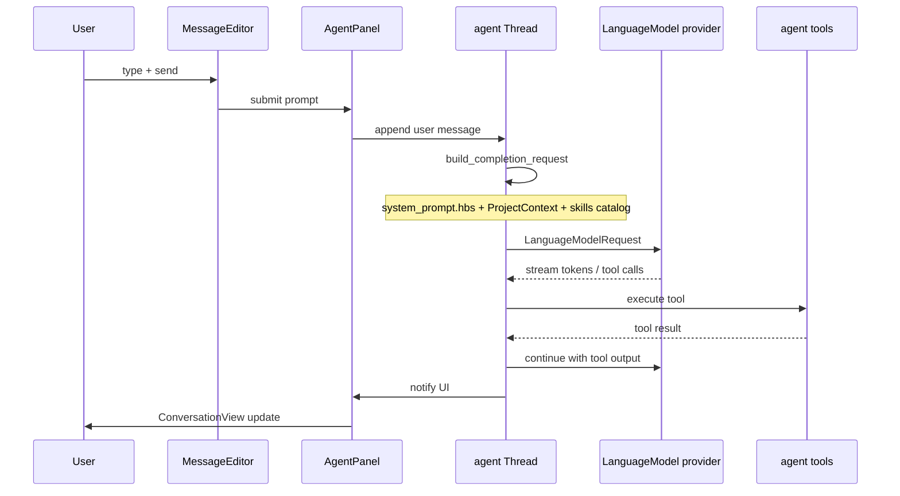
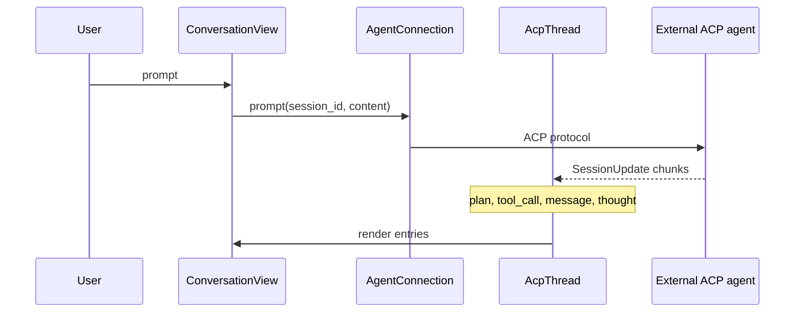

# Inference flow

## Native agent path

## ACP external agent path

## Compaction path

When token usage exceeds `agent.auto_compact.threshold`:

1. Thread identifies compaction point
2. Summarization prompt from `agent_settings/src/prompts/`
3. Older messages replaced with summary
4. User may see compaction indicator in UI

Grep: `auto_compact`, `compact`, `summarize_thread`

## Key types

| Type | Crate |
|------|-------|
| `LanguageModelRequest` | `language_model_core` |
| `LanguageModelRequestMessage` | `language_model_core` |
| `CompletionIntent` | `language_model` / agent |
| `SessionUpdate` | `agent_client_protocol` |
| `AcpThread` | `acp_thread` |

## Streaming

- Native: provider stream → thread messages
- ACP: `SessionUpdate::AgentMessageChunk`, `AgentThoughtChunk`
- UI smoothing: `StreamingTextBuffer` in `acp_thread.rs` (gradual reveal)

When changing streaming, test perceived latency and flicker — product concern.

## Context sources in system prompt

Typical native agent system prompt includes:

- Base instructions (`system_prompt.hbs`)
- Available tools list
- Project context (files, diagnostics summary)
- Skills catalog (name + description + path)
- User `AGENTS.md` / rules content
- Sandboxing notice (if enabled)
- Date, model name

Subagent and inline assist use different templates/intents.
