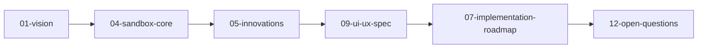
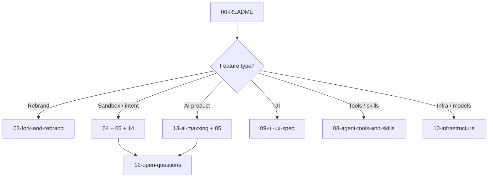
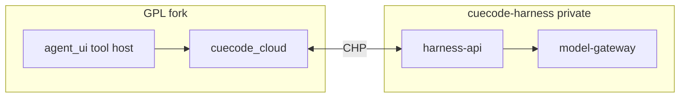
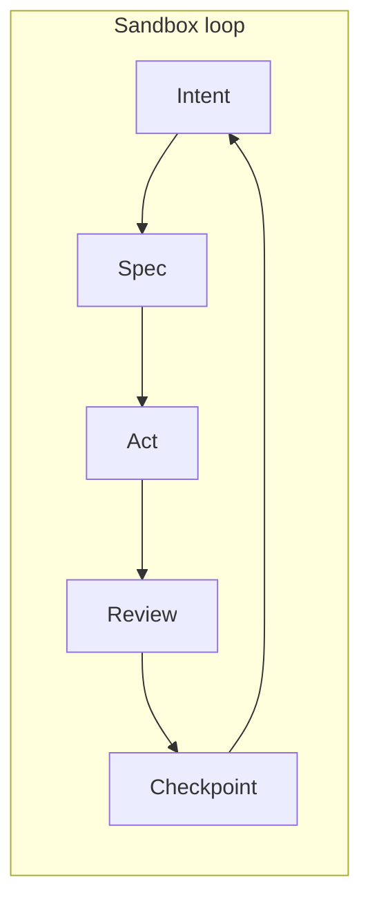
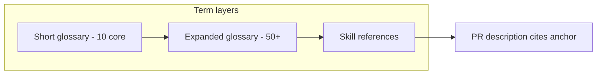

# CueCode Specs {#cuecode-specs}

This directory is the **source of truth** for CueCode — an agentic coding sandbox
forked from Zed (GPL-3.0-or-later). Every product decision, crate boundary, and
agent behavior that matters to humans and coding agents should be discoverable here.

**Stack context:** Rust, GPUI, native macOS/Linux/Windows. Agent runtime in
`crates/agent`, `crates/acp_thread`, `crates/agent_ui`. **Production harness:** proprietary
cloud ([harness/cloud/](./harness/cloud/README.md)) via planned `cuecode_cloud` client.
Local stubs: `cuecode_specs`, `cuecode_sandbox` (see [06-system-design](../core/06-system-design#new-crates)).

---

## Spec tree {#spec-tree}

```
.cursor/specs/
├── 00-README.md              ← start here (only root file)
├── core/                     ← 01–06 product + architecture
├── delivery/                 ← 07 roadmap + build-plans/
├── agent/                    ← 08 tools, 13 AI doctrine
├── design/                   ← 09 UI/UX, 16 Plan, 17 Layout Studio
├── ops/                      ← 10–12 infra, metrics, OQs
├── parity/                   ← 15–21 competitive program
├── research/                 ← CC inventory
└── harness/                  ← local + cloud + 14 stub
```

| Folder | When to open |
|--------|--------------|
| [core/](./core/README.md) | What CueCode is (01–06) |
| [delivery/](./delivery/README.md) | When to ship (07 + build plans) |
| [agent/](./agent/README.md) | Tools, permissions, AI doctrine |
| [design/](./design/README.md) | GPUI layout and copy |
| [ops/](./ops/README.md) | Infra, metrics, open questions |
| [build-plans/](./delivery/build-plans/README.md) | Implementing — say `Build phase 0.1` |
| [parity/](./parity/README.md) | Claude Code parity, flows A–H |
| [research/](./research/README.md) | Tool/command inventory rows |
| [harness/](./harness/README.md) | Active / Async / Hybrid semantics |

---

## Reading order {#reading-order}

Specs are numbered for a reason. Follow the path that matches your role.

### First-time human (30 minutes)



1. [01-vision](../core/01-vision) — north star, problem, non-goals
2. [04-sandbox-core](../core/04-sandbox-core) — session, intent, lifecycle
3. [05-innovations](../core/05-innovations) — differentiated bets (P0–P3)
4. [09-ui-ux-spec](../design/09-ui-ux-spec) — panel-first layout, review flows
5. [07-implementation-roadmap](../delivery/07-implementation-roadmap) — phased delivery
6. [build-plans/00-master-build-plan](./delivery/build-plans/00-master-build-plan.md) — **Build phase X.Y** execution index
7. [12-open-questions](../ops/12-open-questions) — unresolved decisions

### Agent implementing a feature



1. Read this file for index and conventions.
2. Load the spec section cited in the issue or PR.
3. Check [12-open-questions](../ops/12-open-questions) before architectural choices.
4. Link PRs to the spec anchor you implement.
5. Update specs when shipped behavior diverges from the plan.

### Infrastructure / release engineer

1. [03-fork-and-rebrand](../core/03-fork-and-rebrand) — binary name, paths, GPL
2. [03-zed-reference-cleanup-phases → Progress](../core/03-zed-reference-cleanup-phases#progress) — check off passes A–E (`./script/rebrand-progress.sh --full`)
2. [10-infrastructure](../ops/10-infrastructure) — models, sandbox OS, CI, telemetry
3. [11-metrics-and-success](../ops/11-metrics-and-success) — release gates
4. [07-implementation-roadmap](../delivery/07-implementation-roadmap#phase-6) — Phase 6 bundles

### Competitive parity (Claude Code harness)

1. [15-competitive-parity](./parity/15-competitive-parity.md) — program thesis + phases
2. [research/00-claude-code-inventory](./research/00-claude-code-inventory.md) — every tool/command decision
3. [16-end-to-end-flows](./parity/16-end-to-end-flows.md) — acceptance flows A–H
4. Gap docs: [17-memory](./parity/17-memory-and-context.md) · [18-teams](./parity/18-teams-and-tasks.md) · [19-commands](./parity/19-command-surface.md) · [20-platform](./parity/20-platform-integrations.md) · [21-surfaces](./parity/21-ai-surfaces.md)

### AI / harness work

1. [13-ai-maxxing](../agent/13-ai-maxxing) — doctrine, moat, checklist
2. [harness/README](./harness/README.md) — **local vs cloud decision tree**
3. **Production (Model B):** [harness/cloud/](./harness/cloud/README.md) — proprietary orchestration
4. **Local fallback:** [harness/local/01-agent-harness.md](./harness/local/01-agent-harness.md) — Active / Async / Hybrid
5. [08-agent-tools-and-skills](../agent/08-agent-tools-and-skills) — tools, permissions
6. Skill: `.cursor/skills/cuecode-ai-maxxing/SKILL.md`

---

## Persona guide {#persona-guide}

| Persona | Start here | Deep dive | Success signal |
|---------|------------|-----------|----------------|
| **Product / founder** | [01-vision](../core/01-vision), [05-innovations](../core/05-innovations) | [13-ai-maxxing](../agent/13-ai-maxxing), [11-metrics](../ops/11-metrics-and-success#north-star) | SDSW ≥5/week in dogfood |
| **Rust engineer** | [02-current-architecture](../core/02-current-architecture), [06-system-design](../core/06-system-design) | [harness/cloud/04-open-client](./harness/cloud/04-open-client.md), [harness/local/01-agent-harness](./harness/local/01-agent-harness.md#rust-map), [10-infrastructure](../ops/10-infrastructure) | `./script/clippy` clean; spec-linked PR |
| **GPUI / UX engineer** | [09-ui-ux-spec](../design/09-ui-ux-spec) | [harness/local/01-agent-harness](./harness/local/01-agent-harness.md) UI sections, skill `ui-ux-gpui` | Unified review + intent switcher shipped |
| **Agent / inference** | [08-agent-tools-and-skills](../agent/08-agent-tools-and-skills) | [harness/cloud/](./harness/cloud/README.md), [harness/local/01-agent-harness](./harness/local/01-agent-harness.md), skill `agent-inference` | Cloud default + local BYOK fallback |
| **DevOps / release** | [10-infrastructure](../ops/10-infrastructure#build-release) | [03-fork-and-rebrand](../core/03-fork-and-rebrand), [11-metrics](../ops/11-metrics-and-success#release-gates) | Alpha gate checklist green |
| **Cursor / IDE agent** | This file + task-specific spec | Matching skill under `.cursor/skills/` | PR cites `{#anchor-id}` section |

### Persona → skill routing

```
┌────────────────┬──────────────────────────────────────────────────────┐
│ Task           │ Load skill(s)                                        │
├────────────────┼──────────────────────────────────────────────────────┤
│ Spec / rebrand │ cuecode-specs rule (implicit) + engineering-partner│
│ New AI feature │ cuecode-ai-maxxing + product-builder                 │
│ Agent UI       │ ui-ux-gpui + rust-quality                            │
│ Prompts/tools  │ agent-inference + rust-quality                       │
│ GPUI test fail │ gpui-test                                            │
│ Cherry-pick    │ zed-cherry-pick                                      │
└────────────────┴──────────────────────────────────────────────────────┘
```

---

## Document index {#document-index}

| # | Doc | Topic | Key anchors |
|---|-----|-------|-------------|
| 00 | [README](./00-README.md) | Index, conventions, personas | `{#reading-order}`, `{#persona-guide}` |
| 01 | [vision](../core/01-vision) | North star, problem, thesis | `{#thesis}`, `{#non-goals}` |
| 02 | [current-architecture](../core/02-current-architecture) | Zed fork baseline | Existing crates map |
| 03 | [fork-and-rebrand](../core/03-fork-and-rebrand) | CueCode identity, decouple zed.dev | `{#rename-depth}` |
| 04 | [sandbox-core](../core/04-sandbox-core) | Agentic sandbox product | `{#intent-profiles}`, `{#lifecycle}` |
| 05 | [innovations](../core/05-innovations) | Differentiated ideas | `{#sdal}`, `{#multi-lane}` |
| 06 | [system-design](../core/06-system-design) | Components, crates, data flow | `{#new-crates}`, `{#overview}` |
| 07 | [implementation-roadmap](../delivery/07-implementation-roadmap) | Phased delivery | `{#phase-0}` … `{#phase-6}` |
| — | [parity/](./parity/README.md) | CC parity program (15–21) | `{#parity-index}` |
| — | [build-plans/](./delivery/build-plans/README.md) | **Build phase X.Y** tasks, QA, doc routes | `{#master-build-plan}`, `{#phase-index}` |
| 08 | [agent-tools-and-skills](../agent/08-agent-tools-and-skills) | Tools, skills, permissions | New tools section |
| 09 | [ui-ux-spec](../design/09-ui-ux-spec) | Panel-first layout, review | Composer-first |
| 10 | [infrastructure](../ops/10-infrastructure) | Models, OS sandbox, MCP, CI | `{#models}`, `{#terminal-sandbox}` |
| 11 | [metrics-and-success](../ops/11-metrics-and-success) | How we know it works | `{#north-star}`, `{#release-gates}` |
| 12 | [open-questions](../ops/12-open-questions) | Unresolved decisions | Per-question `{#qN-...}` |
| 13 | [ai-maxxing](../agent/13-ai-maxxing) | AI strategy vs sidebar IDEs | `{#design-checklist}`, `{#vs-cursor}` |
| 14 | [agent-harness (redirect)](./harness/14-agent-harness.md) | Stub → [harness/](./harness/README.md) | `{#quick-links}` |
| 15 | [competitive-parity](./parity/15-competitive-parity.md) | Full CC harness parity program | `{#thesis}`, `{#competitive-gate}` |
| 16 | [end-to-end-flows](./parity/16-end-to-end-flows.md) | E2E acceptance flows A–H | `{#flow-index}` |
| 17 | [memory-and-context](./parity/17-memory-and-context.md) | Memory, compact, context | `{#memory-scopes}`, `{#extract-pipeline}` |
| 18 | [teams-and-tasks](./parity/18-teams-and-tasks.md) | Lanes, tasks, coordinator | `{#task-protocol}`, `{#coordinator}` |
| 19 | [command-surface](./parity/19-command-surface.md) | Slash → GPUI mapping | `{#harness-commands}` |
| 20 | [platform-integrations](./parity/20-platform-integrations.md) | Cron, remote, bridge rejects | `{#scheduled-agents}` |
| 21 | [ai-surfaces](./parity/21-ai-surfaces.md) | Agent vs inline vs Copilot | `{#surface-matrix}` |
| — | [research/00-inventory](./research/00-claude-code-inventory.md) | Claude Code master index | `{#tools-harness}`, `{#commands-top-60}` |
| — | [research/01-parity-decisions](./research/01-parity-decisions.md) | Adopt/Adapt/Defer/Reject policy | `{#definitions}` |
| — | [harness/](./harness/README.md) | Local vs cloud harness index | `{#decision-tree}`, `{#cloud-harness}` |
| — | [harness/cloud/](./harness/cloud/README.md) | Model B — proprietary orchestration | `{#reading-order}`, CHP protocol |
| — | [harness/local/01-agent-harness](./harness/local/01-agent-harness.md) | In-process GPL harness | `{#three-contexts}`, `{#rust-map}` |

---

## Harness docs {#harness-docs}

All harness documentation lives under [harness/](./harness/README.md):

| Branch | Path | When to read |
|--------|------|--------------|
| **Index** | [harness/README.md](./harness/README.md) | Choosing local vs cloud |
| **Cloud (default product)** | [harness/cloud/](./harness/cloud/README.md) | Model B — scheduler through decode on CueCode infra |
| **Local (fallback)** | [harness/local/01-agent-harness.md](./harness/local/01-agent-harness.md) | NativeAgent, offline, semantic reference |



---

## Diagram index {#diagram-index}

Central index of architecture and flow diagrams across specs.

| Diagram | Location | Type | Describes |
|---------|----------|------|-----------|
| Spec reading path (human) | [§Reading order](#reading-order) | Mermaid | First-time onboarding |
| Agent feature routing | [§Reading order](#reading-order) | Mermaid | Which spec to load |
| System layers | [06 §overview](../core/06-system-design#overview) | ASCII | Crate stack |
| Session lifecycle | [04 §lifecycle](../core/04-sandbox-core#lifecycle) | ASCII | CREATE → ARCHIVE |
| Intent × execution matrix | [04](../core/04-sandbox-core#intent-profiles) + [local §feature-matrix](./harness/local/01-agent-harness.md#feature-matrix) | Table | Explore/Fix/Ship × Active/Async |
| Harness contexts | [local §three-contexts](./harness/local/01-agent-harness.md#three-contexts) | Prose + matrix | Active / Async / Hybrid |
| Cloud harness topology | [cloud §architecture](./harness/cloud/02-architecture.md) | Mermaid | IDE ↔ API ↔ gateway |
| CHP protocol | [cloud §protocol](./harness/cloud/03-protocol.md) | JSON schemas | Client ↔ server wire |
| Notification rail mockup | [local §notification-rail-ui](./harness/local/01-agent-harness.md#notification-rail-ui) | ASCII | GPUI async UX |
| Lane panel mockup | [local §lane-panel-ui](./harness/local/01-agent-harness.md#lane-panel-ui) | ASCII | Multi-lane GPUI |
| Model provider flow | [10 §models](../ops/10-infrastructure#models) | Mermaid | BYOK / local path |
| Sandbox OS integration | [10 §terminal-sandbox](../ops/10-infrastructure#terminal-sandbox) | Table + ASCII | Seatbelt / Bubblewrap |
| SDAL loop | [13 §north-star](../agent/13-ai-maxxing#north-star) | Mermaid | intent → spec → act → review |
| Moat vs Cursor | [13 §vs-cursor](../agent/13-ai-maxxing#vs-cursor) | Table | Competitive positioning |
| Metrics funnel | [11 §product-metrics](../ops/11-metrics-and-success#product-metrics) | Mermaid | Activation → quality |
| Open question framework | [12 §how-to-resolve](../ops/12-open-questions#how-to-resolve) | Mermaid | Decision workflow |

When adding a new diagram to any spec, add a row here in the same PR.

---

## Spec status {#spec-status}

| Doc | Status | Owner hint | Last expanded |
|-----|--------|------------|---------------|
| 01-vision | Draft | Product | — |
| 02-current-architecture | Draft | Platform | — |
| 03-fork-and-rebrand | Draft | Platform | — |
| 04-sandbox-core | Draft | Product + agent | — |
| 05-innovations | Draft — highest priority | Product | — |
| 06-system-design | Draft | Platform | — |
| 07-implementation-roadmap | Draft | Product | — |
| 08-agent-tools-and-skills | Draft | Agent inference | — |
| 09-ui-ux-spec | Draft | GPUI | — |
| 10-infrastructure | Draft — expanded | Platform | 2026-06-17 |
| 11-metrics-and-success | Draft — expanded | Product | 2026-06-17 |
| 12-open-questions | Draft — expanded | All | 2026-06-17 |
| 13-ai-maxxing | Draft — AI doctrine | Product + AI | 2026-06-17 |
| 14-agent-harness | Redirect stub | Agent + GPUI | 2026-06-17 |
| 15-competitive-parity | Draft — CC parity program | Product + agent | 2026-06-17 |
| 16-end-to-end-flows | Draft — E2E acceptance | Product + agent | 2026-06-17 |
| 17-memory-and-context | Draft — gap spec | Agent + inference | 2026-06-17 |
| 18-teams-and-tasks | Draft — gap spec | Agent + GPUI | 2026-06-17 |
| 19-command-surface | Draft — gap spec | Agent + GPUI | 2026-06-17 |
| 20-platform-integrations | Draft — gap spec | Platform | 2026-06-17 |
| 21-ai-surfaces | Draft — gap spec | Product + GPUI | 2026-06-17 |
| research/ | Living inventory | Agent + Product | 2026-06-17 |
| harness/ | Living index | Agent + Platform | 2026-06-17 |
| harness/cloud/ | Draft — Model B | Agent + Platform | 2026-06-17 |
| harness/local/01-agent-harness | Draft — expanded | Agent + GPUI | 2026-06-17 |
| 00-README | Living index | All | 2026-06-17 |

**Status meanings:**

- **Draft** — direction agreed; implementation may lag or diverge (update spec or code).
- **Expanded** — hyper-detailed pass complete; still draft until behavior matches.
- **Stable** — dogfood-validated; breaking changes require explicit review.

---

## Project agent skills {#project-agent-skills}

Shipped under `.cursor/skills/`:

| Skill | Purpose | Spec cross-links |
|-------|---------|------------------|
| `cuecode-ai-maxxing` | AI doctrine — sandbox moat, surface map, checklist | [13](../agent/13-ai-maxxing), [harness/](./harness/README.md) |
| `engineering-partner` | Voice; ideate vs solve vs product modes | Rule `cuecode-comms.mdc` |
| `product-builder` | User journeys, feature → code routing | [04](../core/04-sandbox-core), [09](../design/09-ui-ux-spec) |
| `ui-ux-gpui` | GPUI surfaces, design language, UX checklist | [09](../design/09-ui-ux-spec) |
| `agent-inference` | Prompts, models, context, streaming, tools, ACP | [08](../agent/08-agent-tools-and-skills), [10](../ops/10-infrastructure#models) |
| `rust-quality` | Rust conventions, GPUI, clippy | AGENTS.md |
| `gpui-test` | GPUI test debugging | — |
| `zed-cherry-pick` | Cherry-pick to preview/stable | [12 §Q8](../ops/12-open-questions#q8-upstream) |

**Planned CueCode skills** (see [08](../agent/08-agent-tools-and-skills)):

- `cuecode-specs` — load and cite spec sections in agent context
- `implement-spec` — SDAL workflow: plan → implement → verify
- `explore-codebase` — read-only explore agent playbook

Skills are **executable context** for agents; specs are **authoritative product truth**.
When a skill and spec disagree, fix the skill in the same PR that updates the spec.

---

## Cursor rules {#cursor-rules}

| Rule | When it applies |
|------|-----------------|
| `.cursor/rules/cuecode-comms.mdc` | Always — voice and ideate/solve modes (`engineering-partner`) |
| `.cursor/rules/cuecode-specs.mdc` | Specs, rebrand, agent crate scope |
| `.cursor/rules/cuecode-agent-development.mdc` | Agent UI, inference, GPUI — routes to skills |
| `.cursor/rules/cuecode-ai-maxxing.mdc` | AI crates + specs 04/05/09/13/14 |

Rules are **short routers**; specs hold detail. Do not duplicate spec bodies in rules.

---

## Principles {#principles}

These apply to every spec section and every PR:

| Principle | Meaning | Anti-pattern |
|-----------|---------|--------------|
| **Session-first** | Agent thread + plan + checkpoint is the unit of work | Optimizing file-tree navigation |
| **Specs-first** | `.cursor/specs/` is first-class agent context | Specs only in Notion or wiki |
| **Local-first** | No required zed.dev account; BYOK / Ollama default | Cloud-only model path |
| **Trust grows** | Permissions expand as agent earns trust in a domain | Binary allow-all forever |
| **Replayable** | Actions logged; rewind via checkpoints | Irreversible silent writes |
| **Native moat** | GPUI speed, OS sandbox, deep editor/LSP integration | Electron parity chase |



---

## Conventions for spec files {#conventions}

### Structure

- **One topic per file** — cross-link rather than duplicate.
- **Numbered prefix** — `NN-topic.md` for sort order; `00-README` is the index.
- **H1 matches filename topic** — e.g. `# Infrastructure {#infrastructure}` in `10-infrastructure.md`.
- **Anchor IDs** — mark linkable sections with `{#anchor-id}` (kebab-case, stable).
  - Prefer preserving existing anchors when expanding.
  - New subsections get new anchors; do not rename anchors without updating links.
- **YAML frontmatter** — optional; use when a spec represents a trackable task:

```yaml
---
title: Phase 2 — Intent switcher
status: draft
phase: 2
owner: agent-ui
---
```

### Linking

- **Internal:** `[label](./NN-file.md#anchor-id)`
- **From skills/rules:** absolute or repo-relative path to `.cursor/specs/...`
- **From PRs:** "Implements [14 §notification-rail](./harness/local/01-agent-harness.md#notification-rail-ui)"
- **From code comments:** sparingly — `// See .cursor/specs/core/04-sandbox-core.md#intent-profiles`

### Diagrams

- **Mermaid** — flows, decision trees, sequences (GitHub/Cursor render).
- **ASCII** — UI mockups, crate stacks, terminal-style layouts.
- **Tables** — matrices (intent × tool, Active × Async, metric definitions).
- Register new diagrams in [§Diagram index](#diagram-index).

### Rust / GPUI references

When specifying implementation:

- Name **crates** (`agent_ui`, `cuecode_sandbox`) not vague "the UI layer."
- Name **types** when stable (`AcpThread`, `ExecutionContext`, `IntentProfile`).
- Distinguish **exists** vs **planned** in tables (see [14 §A.1](./harness/local/01-agent-harness.md#part-a-active)).
- Point to tests: `cargo test -p agent -p acp_thread -p agent_ui`.

### Updating specs

1. Behavior changed in PR → update spec in same PR or immediate follow-up.
2. Decision made → move question from [12](../ops/12-open-questions) to **Resolved**.
3. Large expansion → bump "Last expanded" in [§Spec status](#spec-status).
4. Deprecate sections with `> **Deprecated:**` block, do not silent-delete anchors.

### Agent prompt injection

When loading specs into agent context:

- Prefer **one primary spec** + README index, not entire tree.
- Include **anchor** in user message: "Implement harness/local/01-agent-harness.md#notification-rail-ui"
- For ideation, load [13](../agent/13-ai-maxxing) checklist; for execution, load [06](../core/06-system-design) + task spec.

---

## How to use (quick reference) {#how-to-use}

1. **Humans:** [01-vision](../core/01-vision) → [05-innovations](../core/05-innovations) → [07-implementation-roadmap](../delivery/07-implementation-roadmap) before writing code.
2. **Agents:** Load relevant spec files before implementing. Cite spec sections in PR descriptions.
3. **PRs:** Link to the spec section you implement. Update specs when behavior diverges.
4. **Decisions:** Check [12-open-questions](../ops/12-open-questions); resolve per [§How to resolve](../ops/12-open-questions#how-to-resolve).
5. **AI features:** Run checklist in [13 §design-checklist](../agent/13-ai-maxxing#design-checklist) before merge.

---

## Related directories {#related-directories}

| Path | Role |
|------|------|
| `.cursor/specs/` | Product and architecture specs (this tree) |
| `.cursor/specs/core/` | Product truth (01–06) |
| `.cursor/specs/delivery/` | Roadmap (07) + build-plans/ |
| `.cursor/specs/agent/` | Tools (08) + AI doctrine (13) |
| `.cursor/specs/design/` | UI/UX (09) |
| `.cursor/specs/ops/` | Infra, metrics, open questions (10–12) |
| `.cursor/specs/delivery/build-plans/` | Build phase X.Y execution index |
| `.cursor/specs/parity/` | Competitive parity program (docs 15–21) |
| `.cursor/specs/research/` | Claude Code inventory and parity decisions |
| `.cursor/specs/harness/` | Local + cloud harness docs |
| `.cursor/rules/` | Cursor agent rules (routers) |
| `.cursor/skills/` | Agent Skills playbooks |
| `.agents/agents/` | Planned built-in agent definitions (markdown overrides) |
| `crates/agent/` | Native agent loop, tools, templates |
| `crates/agent_ui/` | GPUI agent panel, composer, review |
| `crates/acp_thread/` | Session entity, plan, terminals |
| `crates/sandbox/` | OS sandbox (Seatbelt, Bubblewrap) |

---

## Glossary (spec shorthand) {#glossary}

| Term | Definition |
|------|------------|
| **SDAL** | Spec-Driven Agent Loop — plan/checklist synced with `.cursor/specs/` |
| **SDSW** | Successful spec-driven sessions per week (north star metric) |
| **BYOK** | Bring your own API keys — no zed.dev billing |
| **Intent** | Explore / Fix / Ship / Review / Orchestrate — sandbox profile |
| **Lane** | Parallel agent thread with specialized role (explore, implement, verify) |
| **Checkpoint** | Session-scoped rewind point (action log + plan + spec refs) |
| **Harness** | Active / Async / Hybrid execution contexts ([14](./harness/local/01-agent-harness.md)) |
| **ACP** | Agent Client Protocol — external agent backends |
| **VERDICT** | Structured pass/fail from verification agent |

---

## Expanded glossary {#expanded-glossary}

Comprehensive term reference for specs, skills, PRs, and agent context. Terms marked
**(planned)** are not yet implemented in the fork.

### Session and sandbox

| Term | Definition |
|------|------------|
| **AcpThread** | GPUI session entity in `acp_thread` holding plan, terminals, subagent sessions, and thread metadata for one agent conversation. |
| **Action log** | Append-only record of agent edits and user accept/reject decisions in `action_log`; feeds checkpoints and unified review. |
| **Agentic sandbox** | CueCode product unit: session + intent profile + permissions + spec context + review/checkpoint loop — not chat bolted onto an editor. |
| **Away summary** | Async harness notification summarizing session activity while the CueCode window was unfocused ([14 §B.3](./harness/local/01-agent-harness.md#b-3-post-turn-jobs)). |
| **Checkpoint** | Session-scoped rewind point combining action log snapshot, plan state, and linked spec refs; stored by `cuecode_sandbox` (planned). |
| **Composer** | Primary agent input surface in `agent_ui`; may be coordinator-only under Orchestrate intent. |
| **Execution context** | Active, Async, or Hybrid scheduling mode for a lane or built-in agent ([14 §three-contexts](./harness/local/01-agent-harness.md#three-contexts)). |
| **Handoff artifact** | Required output of a Hybrid flow: plan entry, checkpoint, VERDICT, spec link, or structured notification — never prose-only completion. |
| **Intent profile** | Named sandbox configuration (Explore / Fix / Ship / Review / Orchestrate) mapping to tool allowlists, sandbox policy, and prompt deltas. |
| **Lane** | Parallel specialized agent sub-session under one parent AcpThread (explore, implement, verify, coordinator). |
| **Notification rail** | GPUI async feedback drawer listing structured session notifications with open/retry actions ([14 §notification-rail-ui](./harness/local/01-agent-harness.md#notification-rail-ui)). |
| **Orchestrate** | Intent where the main thread acts as coordinator: spawn workers, read specs/plan, synthesize — no direct file edits. |
| **Parent thread** | Main AcpThread the user interacts with; owns plan, checkpoints, and spawns background sub-sessions. |
| **Plan gate** | UI state blocking implement tools until the user explicitly approves the active plan ([14 §composer-states](./harness/local/01-agent-harness.md#composer-states)). |
| **Rewind** | User action restoring session state from a checkpoint without manual git operations. |
| **Session artifact** | Any durable output of agent work: diff set, VERDICT file, sidechain transcript, spec proposal, or checkpoint. |
| **Session-first** | Product principle: optimize for the agent session lifecycle rather than file-tree navigation ([§Principles](#principles)). |
| **Sidechain** | Isolated subagent transcript persisted as JSONL under the session directory ([14 §B.5](./harness/local/01-agent-harness.md#b-5-async-artifacts-on-disk)). |
| **Sub-session** | Child agent run keyed by `session_id`, spawned via `spawn_agent`; may be foreground or background. |
| **Task pill** | Compact GPUI badge above composer indicating background job state (running, partial, done, failed). |
| **Trust graph** | Per-repo rules recording which tools/paths/network hosts auto-allow after user promotion ([05 §trust-graph](../core/05-innovations#trust-graph)). |
| **Unified review** | Single GPUI panel combining plan progress, file diffs, terminal output, spec proposals, and VERDICT evidence ([09-ui-ux-spec](../design/09-ui-ux-spec)). |
| **Worktree isolation** | (planned) Git worktree per Ship session so agent edits stay isolated until merge. |

### Specs and SDAL

| Term | Definition |
|------|------------|
| **@spec** | Composer mention syntax loading a `.cursor/specs/` file or section into agent context. |
| **Anchor id** | Stable `{#kebab-case}` suffix on spec headings for cross-linking from PRs, skills, and code comments. |
| **Catalog mode** | Injecting spec index (titles + anchors) without full file bodies to save context budget. |
| **cuecode_specs** | (planned) Crate for spec index build, `@spec` resolution, and plan ↔ spec sync proposals. |
| **Dogfood story** | Documented real session win using the template in [11 §success-stories](../ops/11-metrics-and-success#success-stories). |
| **Full body mode** | Loading entire spec file content when a section is linked or user confirms. |
| **implement-spec** | (planned) Skill encoding SDAL workflow: plan → implement → verify → checkpoint. |
| **Plan ↔ spec sync** | Mirroring plan checkboxes into linked spec files with user confirmation for prose ([Q6](../ops/12-open-questions#q6-spec-confirm)). |
| **Propose spec update** | Agent tool path that creates a diff for spec changes; never silent write ([06-system-design](../core/06-system-design)). |
| **SDAL** | Spec-Driven Agent Loop — intent → spec → act → review → checkpoint; CueCode core workflow. |
| **Spec chip** | GPUI header element showing active linked spec path and anchor. |
| **Spec index** | Background-built list of `.cursor/specs/*.md` titles, anchors, and status for prompt injection. |
| **Spec-native user** | Dogfood segment where >70% of sessions include a `spec_link` event ([11 §user-segments](../ops/11-metrics-and-success#user-segments)). |
| **Specs-first** | Principle that `.cursor/specs/` is authoritative product truth, loadable by humans and agents. |

### Agent runtime and inference

| Term | Definition |
|------|------------|
| **ACP** | Agent Client Protocol — wire format for external agent backends via `agent_servers`. |
| **Auto-compact** | Thread summarization when context limits approach; must preserve intent and linked spec paths ([10 §compaction](../ops/10-infrastructure#compaction)). |
| **Built-in agent** | Rust-defined agent type (`explore`, `plan`, `implement`, `verification`) with enforced tool allowlist. |
| **Context budget UI** | (planned) Visual breakdown of tokens: system, specs, tools, transcript, spill. |
| **Coordinator** | Main-thread Orchestrate role or built-in agent definition that spawns and synthesizes workers. |
| **cuecode_sandbox** | (planned) Crate for intent profiles, trust graph, checkpoints, execution context, and builtin agent defs. |
| **Deferred tool catalog** | (future) MCP-driven runtime tool list instead of static `agent` registry. |
| **Foreground spawn** | `spawn_agent` with `run_in_background: false`; blocks composer with inline updates. |
| **Background spawn** | `spawn_agent` with `run_in_background: true`; completes via notification + sidechain. |
| **Model hint** | Builtin agent metadata: Fast (cheap model), Inherit (session model), or Default. |
| **omit_spec_index** | Flag on read-only agents skipping full spec body injection (explore, verification). |
| **Permission prompt** | GPUI modal for tool approval; may be skipped via trust graph rules. |
| **Prompt delta** | Intent-specific system prompt addition appended to base template. |
| **Skill** | Markdown playbook under `.cursor/skills/` loaded via `skill` tool with progressive disclosure. |
| **spawn_agent** | Native tool delegating work to a typed subagent with optional `session_id` resume. |
| **Stop hook** | Post-turn callback in `agent::Thread` for async housekeeping (memory, away summary). |
| **Tool spill** | Persisting oversized tool output to disk under session dir; model reads via `read_file`. |
| **Tool wall** | Rust-enforced deny list preventing an agent type from calling disallowed tools. |
| **Verification agent** | Read-only async agent running tests and emitting structured VERDICT ([14 §B.2](./harness/local/01-agent-harness.md#b-2-verification-agent-async-gate)). |
| **VERDICT** | Structured pass/fail/partial outcome from verification; blocks Ship completion on FAIL unless user overrides. |

### Infrastructure and platform

| Term | Definition |
|------|------------|
| **APP_NAME** | Constant in `crates/paths` controlling config dir name (`cuecode` vs `zed`); must differ in fork. |
| **Bubblewrap** | Linux `bwrap` sandbox wrapping agent terminals ([10 §terminal-sandbox](../ops/10-infrastructure#terminal-sandbox)). |
| **BYOK** | Bring your own API keys — cloud models without zed.dev billing. |
| **Context server** | MCP client connection in `context_server` crate supplying external tools/data. |
| **Dev container** | OCI-backed isolated environment via `dev_container` crate; deferred for CueCode v1. |
| **GPUI** | Rust UI framework used by Zed/CueCode for native rendering and entity model. |
| **Keychain** | OS credential store for API keys; production path for BYOK secrets ([10 §secrets](../ops/10-infrastructure#secrets)). |
| **Local JSONL** | Privacy-preserving metrics log at `~/.config/cuecode/metrics/local.jsonl` ([11 §logging](../ops/11-metrics-and-success#logging)). |
| **MCP** | Model Context Protocol — standard for attaching external tool servers to agents. |
| **Network allowlist** | Host patterns permitted for sandboxed terminal network access per intent profile. |
| **Ollama** | Default local model runtime; HTTP on localhost:11434 ([10 §models](../ops/10-infrastructure#models)). |
| **Seatbelt** | macOS `sandbox-exec` policy applied to agent terminals. |
| **Session directory** | `~/.config/cuecode/sessions/<id>/` holding sidechains, spills, verdicts, notes. |
| **Telemetry** | Usage analytics; **off by default** in CueCode alpha ([10 §telemetry](../ops/10-infrastructure#telemetry)). |
| **Unsandboxed escape hatch** | Explicit user confirm to run one terminal command without OS sandbox. |
| **zed.dev** | Upstream Zed cloud services; **non-required** for CueCode core workflows. |

### Metrics and quality

| Term | Definition |
|------|------------|
| **Accept rate** | Accepted agent edits divided by proposed edits; core quality signal ([11 §quality](../ops/11-metrics-and-success#quality)). |
| **Activation** | First-session metrics: first prompt, local model success, spec discovery ([11 §activation](../ops/11-metrics-and-success#activation)). |
| **Alpha gate** | Release checklist combining roadmap phases + dogfood SDSW + crash/quality bars ([11 §alpha-gate](../ops/11-metrics-and-success#alpha-gate)). |
| **Anti-metric** | Vanity measure we explicitly refuse to optimize (raw prompt count, LOC without accept). |
| **Beta gate** | Stricter release bar including trust graph, multi-lane, verification ([11 §beta-gate](../ops/11-metrics-and-success#beta-gate)). |
| **Dogfood** | Internal team usage driving qualitative + quantitative feedback before public alpha. |
| **Engagement** | Session length, intent mix, checkpoint usage, async notification opens ([11 §engagement](../ops/11-metrics-and-success#engagement)). |
| **North star** | SDSW — successful spec-driven sessions per user per week ([11 §north-star](../ops/11-metrics-and-success#north-star)). |
| **Release gate** | Named criterion blocking a release tag until met. |
| **Rewind rate** | Checkpoints restored divided by created; lower indicates fewer bad agent outcomes. |
| **SDSW** | Successful spec-driven session: spec linked + plan item done + accept or explicit complete. |
| **Verify pass rate** | VERDICT PASS count divided by verification runs ([11 §quality](../ops/11-metrics-and-success#quality)). |

### Process and decisions

| Term | Definition |
|------|------------|
| **ADR** | Architecture Decision Record — template in [12 §decision-record](../ops/12-open-questions#decision-record-template). |
| **Assumed QN** | Implementing per open-question recommendation before formal resolution; note in PR. |
| **Escalation** | Blocked PR protocol: cite `{#qN}`, spike, or product owner decision ([12 §escalation](../ops/12-open-questions#escalation)). |
| **Hyper-detailed pass** | Spec expansion milestone marked "expanded" in [§Spec status](#spec-status). |
| **Living index** | Status of this README — updated when spec tree structure changes. |
| **Moat** | Differentiated capability vs sidebar IDEs: specs, sandbox, checkpoints, native GPUI ([13 §vs-cursor](../agent/13-ai-maxxing#vs-cursor)). |
| **Open question** | Unresolved architectural choice tracked in `12-open-questions.md` with `{#qN}` anchor. |
| **Parity** | Baseline agent UX matching user expectations from Cursor-class tools ([13 §baseline-parity](../agent/13-ai-maxxing#baseline-parity)). |
| **Phase gate** | Roadmap phase exit criteria in [07-implementation-roadmap](../delivery/07-implementation-roadmap). |
| **Spike** | Time-boxed prototype (≤2 days) to de-risk an open question before deciding. |

### Glossary usage for agents

When loading glossary into agent context:

1. Prefer linking to the **short glossary** above for quick scans.
2. Load **this expanded section** when implementing cross-cutting features (harness + specs + infra).
3. Cite `{#expanded-glossary}` in PRs that introduce new domain terms — add rows here in the same PR.
4. Do not duplicate term definitions in skills; link to this anchor instead.



---

## New section index (2026-06-17 expansion) {#expansion-index}

Quick links to sections added in the hyper-detailed pass. Register in PRs when implementing.

| File | Anchor | Topic |
|------|--------|-------|
| 00 | `{#expanded-glossary}` | 50+ term definitions |
| 00 | `{#expansion-index}` | This table |
| 10 | `{#operational-runbooks}` | Model / sandbox / MCP playbooks |
| 10 | `{#runbook-model-wont-connect}` | Model connection failures |
| 10 | `{#runbook-sandbox-denied}` | OS sandbox denials |
| 10 | `{#runbook-mcp-fails}` | MCP server failures |
| 10 | `{#error-toast-copy-deck}` | User-facing infra toast strings |
| 11 | `{#weekly-sdsW-dashboard}` | ASCII dashboard mockups |
| 11 | `{#qa-metrics-scripts}` | Maintainer metrics scripts |
| 12 | `{#decision-record-template}` | ADR format |
| 12 | `{#adr-example-q13}` | Worked ADR for multi-lane |
| 13 | `{#deep-dive-loop-closure}` | SDAL edge matrix |
| 13 | `{#deep-dive-intent-profiles}` | Intent contract table |
| 13 | `{#deep-dive-trust-graph}` | Trust rule JSON shape |
| 13 | `{#deep-dive-verification}` | Verify moat + integration |
| 13 | `{#competitive-playbook}` | Cursor request response |
| 14 | `{#verification-prompt-outline}` | Verification agent prompt (Rust port) |
| 14 | `{#builtin-prompt-outlines}` | Explore / plan / implement prompts |
| 14 | `{#notification-payloads}` | XML + JSON notification examples |
| 14 | `{#harness-analytics-events}` | Harness telemetry events |

When adding rows here, also update [§Diagram index](#diagram-index) if the section includes a diagram.

---

## Agent loading guide (by task) {#agent-loading-guide}

Which spec sections to load into agent context for common tasks — minimizes token waste.

### Task: Fix a bug in agent crates {#load-guide-fix-bug}

```
Primary:  harness/local/01-agent-harness.md#a-2-active-agents
          harness/local/01-agent-harness.md#builtin-prompt-outlines
Secondary: 04-sandbox-core.md#intent-profiles
          10-infrastructure.md#terminal-sandbox
Skills:   agent-inference, rust-quality
```

### Task: Implement async notification rail {#load-guide-notification-rail}

```
Primary:  harness/local/01-agent-harness.md#notification-rail-ui
          harness/local/01-agent-harness.md#notification-payloads
          harness/local/01-agent-harness.md#harness-analytics-events
Secondary: 06-system-design.md#overview
          09-ui-ux-spec.md
Skills:   ui-ux-gpui, rust-quality
```

### Task: Wire verification agent {#load-guide-verification}

```
Primary:  harness/local/01-agent-harness.md#verification-prompt-outline
          harness/local/01-agent-harness.md#b-2-verification-agent-async-gate
Secondary: 13-ai-maxxing.md#deep-dive-verification
          12-open-questions.md#q15-verdict
Skills:   agent-inference, cuecode-ai-maxxing
```

### Task: Infrastructure on-call {#load-guide-oncall}

```
Primary:  10-infrastructure.md#operational-runbooks
          10-infrastructure.md#error-toast-copy-deck
Secondary: 10-infrastructure.md#models
          10-infrastructure.md#mcp-failures
Skills:   engineering-partner (solve mode)
```

### Task: Metrics / dogfood report {#load-guide-metrics}

```
Primary:  11-metrics-and-success.md#weekly-sdsW-dashboard
          11-metrics-and-success.md#qa-metrics-scripts
Secondary: 11-metrics-and-success.md#north-star
          harness/local/01-agent-harness.md#harness-analytics-events
```

### Task: Resolve open question {#load-guide-decision}

```
Primary:  12-open-questions.md#decision-record-template
          12-open-questions.md#how-to-resolve
Secondary: Relevant {#qN-...} section
Output:   ADR in .cursor/specs/decisions/ + Resolved table row
```

### Loading anti-patterns {#load-guide-anti-patterns}

| Anti-pattern | Why bad | Instead |
|--------------|---------|---------|
| Load entire spec tree | Context death | One primary + README index |
| Load 13 without 14 for harness work | Missing UI + events | Pair 13 + 14 |
| Skip 12 before architectural PR | Silent decisions | Grep `{#qN}` first |
| Duplicate glossary in skill body | Drift | Link `{#expanded-glossary}` |

---

## Spec ↔ code traceability {#traceability}

Map spec anchors to primary Rust crates for implementation tracking.

| Spec anchor | Primary crates | Test command |
|-------------|----------------|--------------|
| `{#intent-profiles}` | `cuecode_sandbox`, `agent_settings` | `cargo test -p agent_settings` |
| `{#notification-rail-ui}` | `agent_ui`, `acp_thread` | `cargo test -p agent_ui` |
| `{#verification-prompt-outline}` | `agent`, `cuecode_sandbox` | `cargo test -p agent` |
| `{#terminal-sandbox}` | `sandbox`, `agent` | `cargo xtask sandbox-tests` |
| `{#error-toast-copy-deck}` | `agent_ui` | GPUI visual test |
| `{#qa-metrics-scripts}` | `cuecode_sandbox` (metrics emit) | Manual script run |
| `{#expanded-glossary}` | — (docs only) | — |

PRs should add rows when introducing new anchor ↔ crate bindings.

---

## Changelog (index meta) {#changelog}

| Date | Change |
|------|--------|
| 2026-06-16 | Initial spec tree; `.cursor/specs/` as source of truth |
| 2026-06-17 | Hyper-detailed expansion: 00, 10, 11, 12, 13, 14 |
| 2026-06-17 | Second pass: glossary, runbooks, dashboards, ADR, harness prompts, notifications |
| 2026-06-17 | **Harness subtree:** `harness/local/` + `harness/cloud/` (Model B); `14-agent-harness.md` → redirect stub |
| 2026-06-17 | **M0 implemented:** `cuecode_chp`, `cuecode_cloud`, `harness_stub`, `script/cuecode-local` — see [09-dev-and-deploy](./harness/cloud/09-dev-and-deploy.md) |
| 2026-06-17 | **Spec folders:** `core/`, `delivery/`, `agent/`, `design/`, `ops/`; `parity/` (15–21); only `00-README` at root |
