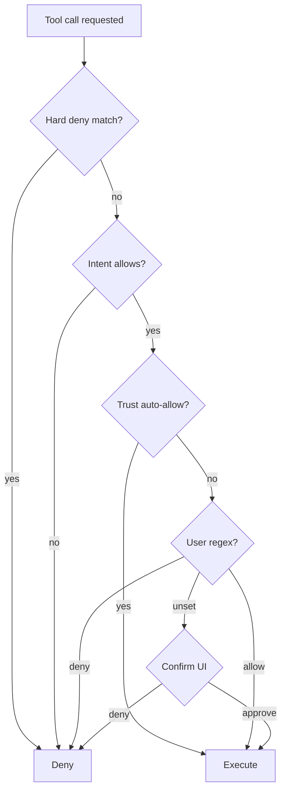
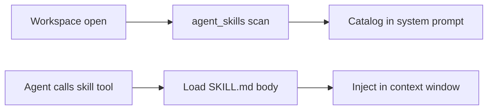
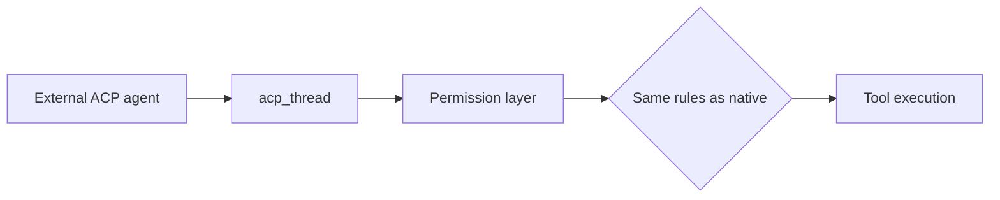
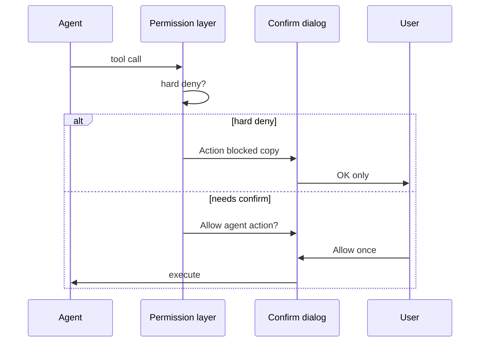

# Agent Tools and Skills {#agent-tools-and-skills}

CueCode extends Zed's native agent tool surface with **spec-aware**, **intent-aware**,
and **trust-aware** tools. This document is the contract for tool behavior, permission
evaluation, skill authoring, and system prompt assembly.

**Related:** [04-sandbox-core](../core/04-sandbox-core), [05-innovations](../core/05-innovations),
[06-system-design](../core/06-system-design), [harness/local/01-agent-harness](../harness/local/01-agent-harness.md),
[09-ui-ux-spec](../design/09-ui-ux-spec#tool-ux)

---

## Design principles {#principles}

1. **Enforce in Rust** — prompts describe policy; `cuecode_sandbox` + `agent` enforce it.
2. **Progressive disclosure** — skills load on demand; spec index in prompt, bodies on `@spec`.
3. **Auditable** — every tool call links to action_log and optional checkpoint.
4. **Intent-native** — default allow/deny derives from intent profile, not global settings alone.
5. **Hard denies are sacred** — trust and user overrides never bypass secret paths or force push.

---

## Tool inventory — existing (keep) {#existing-tools}

Native agent tools in `crates/agent/src/tools/`:

| Tool | Purpose | Intent default | Confirmation default |
|------|---------|----------------|----------------------|
| `read_file` | Read file contents | All | Never |
| `edit_file` | Apply edits (edit_session) | Fix, Ship | On first path / trust |
| `grep` | Search codebase | All | Never |
| `terminal` | Run shell commands | Fix, Ship | Always → trust may auto-allow |
| `fetch` | HTTP fetch | Fix (allowlist) | On new host |
| `web_search` | Web search | Explore, Fix | Never (network policy gates) |
| `diagnostics` | LSP diagnostics | All | Never |
| `skill` | Load agent skill body | All | Never |
| `create_thread` | Spawn sub-thread | Fix, Ship | Optional |
| `rename` / `move_path` / `copy_path` | File ops | Fix, Ship | Always (v1) |
| `create_directory` | mkdir | Fix, Ship | On path outside worktree |
| `find_path` / `find_references` | Navigation | Explore, Fix | Never |
| `get_code_actions` | LSP code actions | Fix | Never |
| `list_agents_and_models` | Meta | All | Never |

MCP tools come through **context servers** (`context_server` registry) — subject to
per-tool permissions like native tools. MCP tool names appear as `mcp::<server>::<tool>`.

### Per-intent tool matrix {#intent-tool-matrix}

| Tool category | Explore | Fix | Ship | Review | Orchestrate |
|---------------|---------|-----|------|--------|-------------|
| Read / grep / find | ✓ | ✓ | ✓ | ✓ | ✓ |
| edit_file | ✗ | ✓ | ✓ | ✗ | ✗ |
| terminal | ✗ | ✓ sandboxed | ✓ sandboxed | ✗ | spawn only |
| git write | ✗ | read-only | ✓ confirm push | ✗ | ✗ |
| fetch / web | ✗ / limited | allowlist | allowlist + CI | ✗ | allowlist |
| spawn_agent | ✗ | optional | ✓ | ✗ | ✓ |
| list_specs / read_spec | ✓ | ✓ | ✓ | ✓ | ✓ |
| update_spec | ✗ | confirm | confirm | ✗ | ✗ |

✓ = allowed by default (may still confirm). ✗ = hard deny at intent layer.

### Built-in agents (CueCode harness) {#builtin-agents}

Rust-defined agent lanes with tool allowlists — see [harness/local/01-agent-harness](../harness/local/01-agent-harness.md#builtin-agents):

| Agent ID | Context | Read-only | Default tools |
|----------|---------|-----------|---------------|
| `explore` | Active / Async | yes | read, grep, find_*, diagnostics, list_specs, read_spec |
| `plan` | Active | yes | + skill, create_thread (plan-only) |
| `implement` | Active | no | Fix intent full write set |
| `verification` | Async | yes | read, grep, terminal (test cmds), diagnostics |
| `coordinator` | Hybrid (Orchestrate intent) | yes on main thread | spawn, read_spec, plan tools |

Extend `spawn_agent` with `agent_type` and `run_in_background`. Enforce tools in
`cuecode_sandbox` + `agent`, not prompts alone.

**Spawn schema (target):**

```json
{
  "agent_type": "explore | plan | implement | verification | coordinator",
  "run_in_background": false,
  "session_id": "optional-resume-id",
  "prompt": "task description"
}
```

---

## New CueCode tools (proposed) {#new-tools}

| Tool | Purpose | Confirmation | Crate owner |
|------|---------|--------------|-------------|
| `list_specs` | Index `.cursor/specs/` | Never | `cuecode_specs` |
| `read_spec` | Load spec by path or slug | Never | `cuecode_specs` |
| `update_spec` | Propose spec edit | Always (v1) | `cuecode_specs` |
| `link_spec` | Attach spec to current session/plan | Never | `cuecode_specs` |
| `checkpoint` | Save session checkpoint | Optional confirm | `cuecode_sandbox` |
| `rewind` | Restore checkpoint by id | Always | `cuecode_sandbox` |
| `trust_query` | Explain active auto-allow rules | Never | `cuecode_sandbox` |

Implementation lives in `crates/agent/src/tools/` with thin wrappers delegating to
`cuecode_specs` / `cuecode_sandbox`.

### `list_specs` {#tool-list-specs}

**Input:** optional `filter` string (fuzzy match title/path)

**Output:**

```json
{
  "specs": [
    {
      "path": ".cursor/specs/core/05-innovations.md",
      "title": "CueCode Innovations",
      "summary": "SDAL, intent switcher, trust graph…",
      "status": "draft"
    }
  ]
}
```

**Behavior:** Reads from in-memory `SpecIndex`; never hits disk synchronously on hot path.

### `read_spec` {#tool-read-spec}

**Input:** `path_or_slug` — e.g. `05-innovations`, `04-sandbox-core.md#intent-profiles`

**Output:** Markdown body (optional anchor slice if `#fragment` present)

**Errors:** `not_found`, `outside_spec_root`, `binary_file`

### `update_spec` {#tool-update-spec}

**Input:** `path`, `proposed_content` or structured checkbox update

**Behavior:** Does not write immediately — creates pending spec diff in review panel
(Spec tab). User accept → write disk.

### `link_spec` {#tool-link-spec}

**Input:** `path`

**Behavior:** Sets session `active_spec_path`; injects full body on next turn;
shows in agent header spec linker.

### `checkpoint` / `rewind` {#tool-checkpoint}

See [04-sandbox-core](../core/04-sandbox-core#lifecycle). `rewind` requires explicit
user confirmation in UI even if tool is invoked by agent (agent cannot auto-rewind in v1).

### `trust_query` {#tool-trust-query}

**Input:** optional `tool_name`, `path_prefix`

**Output:** Human-readable explanation of matching trust rules and evidence counts.

---

## Tool permissions model {#permissions}

### Evaluation order (strict) {#permission-order}

```
1. Hard deny     → immediate deny (no override)
2. Intent profile → default allow/deny for tool class
3. Trust graph   → auto-allow if rule + evidence match
4. User tool_permissions (settings.json regex)
5. External ACP  → only if CueCode native would allow
6. Confirm UI    → user approve / deny / always allow for pattern
```



### Settings location {#settings-location}

| Store | Path | Contents |
|-------|------|----------|
| Global agent | `~/.config/cuecode/settings.json` → `agent.tool_permissions` | Regex patterns |
| Intent overlay | `~/.config/cuecode/intent_profiles.json` | Per-intent overrides |
| Trust | `~/.config/cuecode/trust/<repo_hash>.json` | Promoted rules + evidence |
| Hard deny | Shipped defaults + user extensions in settings | Secret paths, destructive cmds |

### Example hard deny patterns (CueCode defaults) {#hard-deny}

```json
{
  "always_deny": [
    { "pattern": "\\.env($|\\.)", "reason": "secret env files" },
    { "pattern": "secrets?/", "reason": "secrets directory" },
    { "pattern": "\\.pem$", "reason": "private keys" },
    { "pattern": "id_rsa", "reason": "SSH private key" },
    { "pattern": "git\\s+push\\s+(-f|--force)", "reason": "force push" },
    { "pattern": "rm\\s+-rf\\s+/", "reason": "destructive rm" },
    { "pattern": "curl\\s+.*\\|\\s*(ba)?sh", "reason": "curl pipe shell" }
  ]
}
```

### Intent profile defaults (JSON sketch) {#intent-profiles-json}

```json
{
  "Explore": {
    "allowed_tools": ["read_file", "grep", "diagnostics", "list_specs", "read_spec", "skill"],
    "network": "off",
    "fs_write": "none"
  },
  "Fix": {
    "allowed_tools": ["*"],
    "denied_tools": [],
    "network": "allowlist",
    "fs_write": "worktree",
    "terminal_sandbox": true
  }
}
```

### Permission prompt UX {#permission-prompt}

Fields shown in confirm dialog:

- Tool name + arguments (truncated with expand)
- Intent + sandbox badge
- Matching trust rule if near promotion ("2/5 successful tests")
- Buttons: **Allow once**, **Always allow in repo**, **Deny**
- Checkbox: "Remember for this session"

Labels on tool cards after resolution:

| Label | Meaning |
|-------|---------|
| `auto-approved (trust)` | Trust graph matched |
| `you approved` | User confirmed this call |
| `denied` | User or policy blocked |
| `intent blocked` | Explore + write tool |

---

## Agent skills {#skills}

### Discovery (existing) {#skill-discovery}

- Global: `~/.agents/skills/<name>/SKILL.md`
- Project: `<worktree>/.cursor/skills/<name>/SKILL.md`
- Flat scan only (no nested skills)

See `crates/agent_skills/README.md` for design rationale.

**Load path:**



### Skill file format {#skill-format}

```yaml
---
name: implement-spec
description: Execute a CueCode spec checklist as an agent plan
metadata:
  cuecode:
    spec_root: .cursor/specs
    intents: [Fix, Ship]
    allowed_tools: [read_spec, list_specs, edit_file, terminal]
---
# Implement spec

Body markdown…
```

**Frontmatter rules:**

| Field | Required | Notes |
|-------|----------|-------|
| `name` | yes | Matches directory name |
| `description` | yes | Shown in catalog; keep ≤120 chars |
| `metadata.cuecode.intents` | no | Filter skill visibility by intent |
| `metadata.cuecode.spec_root` | no | Default `.cursor/specs` |
| `metadata.cuecode.allowed_tools` | no | Experimental hint; enforce in Rust separately |

### CueCode default skills to ship {#default-skills}

Create under `.cursor/skills/` in this repo (or template):

#### `cuecode-ai-maxxing` (shipped) {#skill-ai-maxxing}

- **Description:** AI-maxxing doctrine — agentic sandbox vs sidebar-first IDEs, full AI surface map, feature checklist.
- **References:** `references/ai-surface-map.md`, `references/cursor-parity-vs-moat.md`
- **Spec:** [13-ai-maxxing](./13-ai-maxxing)
- **Pairs with:** `product-builder`, `agent-inference`, `ui-ux-gpui`, `engineering-partner`
- **Cursor rule:** `cuecode-ai-maxxing.mdc`
- **When to load:** AI product decisions, harness design, moat vs parity debates

#### `engineering-partner` (shipped) {#skill-engineering-partner}

- **Description:** Hype technical partner — ideate vs solve vs product modes, direct voice, accurate.
- **References:** `references/mode-detection.md`
- **Pairs with:** all skills; loaded via `.cursor/rules/cuecode-comms.mdc` in Cursor
- **Cursor rule:** `cuecode-comms.mdc` (`alwaysApply: true`)

#### `product-builder` (shipped) {#skill-product-builder}

- **Description:** Product builder mindset — user paths, spec alignment, route to UI vs inference code.
- **References:** `references/product-thinking-checklist.md`
- **Pairs with:** `ui-ux-gpui`, `agent-inference`, `cuecode-specs`
- **When to load:** New features, UX scope questions, journey mapping

#### `ui-ux-gpui` (shipped) {#skill-ui-ux-gpui}

- **Description:** GPUI UI/UX — panel/dock model, agent surfaces, icons, CONTRIBUTING UX checklist.
- **References:** `references/ui-surfaces.md`, `references/ux-review-checklist.md`
- **Pairs with:** `product-builder`, `gpui-test`, `rust-quality`
- **When to load:** Any `agent_ui` work

#### `agent-inference` (shipped) {#skill-agent-inference}

- **Description:** Agent inference — prompts, context, models, streaming, compaction, tools, ACP.
- **References:** `references/inference-flow.md`, `references/prompt-editing-guide.md`
- **Pairs with:** `product-builder`, `ui-ux-gpui`, `rust-quality`
- **When to load:** Prompt edits, tool registration, model routing

#### `rust-quality` (shipped) {#skill-rust-quality}

- **Description:** Write high-quality Rust — repo conventions, GPUI traps, error handling, `./script/clippy`, pre-submit checklist.
- **References:** `references/pre-submit-checklist.md`
- **Pairs with:** `gpui-test`, `product-builder`, `ui-ux-gpui`, `agent-inference`

#### `implement-spec` (planned) {#skill-implement-spec}

- **Description:** Load a spec from `.cursor/specs/`, create an ACP plan from checklist items, execute sequentially.
- **Scripts:** optional validation script under `scripts/`
- **References:** link to `04-sandbox-core.md`
- **Workflow:**
  1. `read_spec` → parse checklist headings
  2. `update_plan` with 1:1 entries
  3. Execute items in Fix intent
  4. Propose spec checkbox updates on complete

#### `explore-codebase` (planned) {#skill-explore-codebase}

- **Description:** Read-only reconnaissance — grep, read_file, diagnostics only.
- **allowed-tools (experimental):** read-only subset
- **Pairs with:** Explore intent, `explore` builtin agent

#### `review-changes` (planned) {#skill-review-changes}

- **Description:** Review pending diffs and terminal output; no writes.
- **Use in:** Review intent lane
- **Output format:** Structured findings list (severity, file, recommendation)

#### `write-spec` (planned) {#skill-write-spec}

- **Description:** Help author a new spec file with template frontmatter.
- **Template:** `{#anchor-id}` sections, cross-links, status draft

### Skills + specs interaction {#skills-specs-interaction}

Skills may include in frontmatter:

```yaml
---
name: implement-spec
description: Execute a CueCode spec checklist as an agent plan
metadata:
  cuecode:
    spec_root: .cursor/specs
---
```

Agent loads skill catalog in system prompt; body on demand via `skill` tool.

**Spec ↔ skill routing:**

| User says | Skill | Spec tool |
|-----------|-------|-----------|
| "implement phase 2" | `implement-spec` | `read_spec 07-implementation-roadmap` |
| "explore auth crate" | `explore-codebase` | optional `list_specs` |
| "review my changes" | `review-changes` | — |
| "write a spec for X" | `write-spec` | `update_spec` on confirm |

---

## System prompt structure (target) {#system-prompt}

Order of context blocks:

1. Base CueCode agent instructions (fork of `system_prompt.hbs`)
2. **Intent** block (Explore / Fix / …) — tools, network, tone
3. **Spec index** (titles + paths + one-line summary)
4. **Linked spec** full body if session linked one
5. Project context (existing `ProjectContext`)
6. Skills catalog (name + description only)
7. Sandbox notice (if terminal sandbox active)
8. Active checkpoint id (optional, for rewind awareness)

Compaction (`auto_compact`) must preserve (1), (2), linked spec path, and intent.

### Intent block template (sketch) {#intent-block-template}

```markdown
## Current intent: Fix

You may edit files in the worktree and run sandboxed terminal commands.
Network is restricted to allowlisted hosts. Do not read or write secret paths.
Prefer citing linked specs when making architectural choices.
```

### Spec index block template (sketch) {#spec-index-template}

```markdown
## Project specs (.cursor/specs/)

- 04-sandbox-core.md — Agentic sandbox product spec
- 05-innovations.md — SDAL, intent switcher, trust graph
…

Use read_spec or @spec in user messages to load full content.
```

---

## ACP external agents {#acp-agents}

External agents via `agent_servers::acp` remain supported.

CueCode-specific behavior:

- Intent profiles apply to permission **overrides** (deny/confirm still win)
- Spec index available as optional MCP or injected context when using native bridge
- Display name "CueCode" in agent panel, not "Zed"
- External agent tool calls logged in action_log same as native
- ACP agents cannot bypass hard deny list

**Bridge diagram:**



---

## Tool UX {#tool-ux}

### Conversation tool cards {#tool-cards}

- Expandable tool call cards in conversation (existing)
- Show sandbox badge on terminal tools when wrapped
- Show "auto-approved (trust)" vs "you approved" vs "denied" labels
- Link tool calls to checkpoint entries for rewind
- Collapse read/grep bursts into grouped "Searched codebase" summary (Phase 3b)

### Terminal tool display {#terminal-display}

```
┌─ terminal ──────────────────────────────── sandboxed ─┐
│ $ cargo test -p cuecode_specs                          │
│ … output truncated; expand for full …                  │
│ exit 0                                    [Replay] [Copy]│
└────────────────────────────────────────────────────────┘
```

### Error states {#tool-error-states}

| Error | User-visible message | Agent recoverable? |
|-------|---------------------|------------------|
| Permission denied | "Blocked by Fix intent / trust / you denied" | yes — try alternate |
| Hard deny | "Blocked: secret path policy" | no — do not retry |
| Sandbox fail | "Sandbox could not start; running unsandboxed?" | confirm required |
| Tool timeout | "Timed out after Ns" | yes |
| MCP disconnected | "MCP server X disconnected" | retry after reconnect |

---

## MCP and context servers {#mcp}

MCP tools inherit permission evaluation. Additional rules:

- MCP server must be enabled in workspace settings
- Per-tool toggles in `configure_context_server_tools_modal`
- Intent Explore: MCP tools default off unless read-only classification
- Tool name namespacing prevents collision with native tools

---

## Testing tools {#testing}

### Existing {#testing-existing}

- Evals in `crates/agent/src/tools/evals/`
- Pattern: fixture workspace + mock model + assert tool calls

### New eval fixtures {#testing-new}

- [ ] `list_specs` / `read_spec` with temp `.cursor/specs/`
- [ ] Intent deny: Explore cannot `edit_file`
- [ ] Trust promotion: 5× `cargo test` → auto-allow
- [ ] Hard deny: `.env` write always blocked
- [ ] `update_spec` creates pending diff, no immediate write
- [ ] Spawn explore background: allowlist enforced

### Trust rule unit tests {#testing-trust}

Location: `cuecode_sandbox/tests/trust_rules.rs`

Cases:

- Promote after N successes
- Revoke clears auto-allow
- Deny overrides trust
- Repo hash isolation (two repos independent)

---

## Tool registration checklist (for implementers) {#registration-checklist}

When adding a new native tool:

1. Register in `crates/agent/src/tools/mod.rs`
2. Add intent matrix row in this doc
3. Wire permission kind in `agent_settings`
4. Add eval fixture
5. Add tool card rendering in `conversation_view` if special UI
6. Document in [09-ui-ux-spec](../design/09-ui-ux-spec) if user-facing confirm flow
7. Link PR to [07-implementation-roadmap](../delivery/07-implementation-roadmap) phase

---

## Security notes {#security}

- Tools never receive raw user API keys in arguments logged to action_log (redact)
- `trust_query` must not leak other repo hashes
- `read_spec` constrained to `.cursor/specs/` under worktree root
- `terminal` commands logged; replay warns if environment changed
- Agent cannot call `rewind` without user confirm in UI layer

---

## Permission prompt copy library {#permission-prompt-copy}

Exact strings for confirm dialogs. Implementers must match verbatim unless i18n layer
exists (v1 English only). Placeholders in `{curly braces}`.

### Dialog shell (all tools)

**Title (default):** `Allow agent action?`

**Title variants:**

| Context | Title |
|---------|-------|
| Terminal | `Run terminal command?` |
| edit_file | `Apply file edit?` |
| fetch | `Fetch URL?` |
| MCP tool | `Run {server} tool?` |
| Hard deny attempt | `Action blocked` |
| Trust near promotion | `Allow agent action?` (subtitle shows promotion hint) |

**Body layout (top to bottom):**

1. Tool name row: `{tool_display_name}` — monospace chip
2. Arguments block (collapsed default, max 3 lines):
   - Label: `Details`
   - Expand control: `Show full arguments`
   - Collapse control: `Hide arguments`
3. Context row: `Intent: {Explore|Fix|Ship|Review|Orchestrate}`
4. Sandbox row: `{sandbox_badge_label}` — matches header badge text
5. Trust hint (conditional): `This action is 2 of 5 successful runs toward auto-allow for "{pattern}".`
6. Hard deny (conditional): `Blocked by policy: {reason}` — no allow buttons

### Primary buttons

| Button | Exact label | Primary? | Action |
|--------|-------------|----------|--------|
| Allow once | `Allow once` | yes (default focus) | Execute this call only |
| Always allow | `Always allow in this repo` | no | Promote trust rule for pattern |
| Deny | `Deny` | no | Block; agent receives permission denied |

**Checkbox below buttons:**

- Label: `Remember for this session`
- Helper (muted): `Applies to matching commands until you close this thread.`

### Footer microcopy

- Keyboard hint: `Enter to allow once · Esc to deny`
- Timeout (if ever used): `Auto-deny in {N}s` — not v1 default

### Tool-specific body snippets

#### `terminal`

```
Command:
$ {command_single_line_or_first_line}

Working directory:
{worktree_relative_path}

Sandbox:
{Sandbox active|Partial sandbox|Not sandboxed on this platform}
```

#### `edit_file`

```
File:
{path}

Change summary:
{lines_added} additions, {lines_deleted} deletions

Preview:
{first_3_diff_lines_or_"Expand in review panel"}
```

#### `fetch` / network

```
URL:
{url}

Host not in allowlist:
{host}

Network policy:
{Allowlist only|Off|Full}
```

#### `update_spec`

```
Spec file:
{path}

Proposed changes:
{checkbox_count} checkbox updates, {line_delta} line changes

Changes apply only after you accept in the review panel.
```

#### `rewind` / `checkpoint` restore (agent-initiated)

**Title:** `Restore checkpoint?`

**Body:**

```
The agent requested rewinding to checkpoint {checkpoint_label}.

This will:
• Revert {file_count} files
• Restore plan state ({plan_entry_count} entries)
• Restore linked spec: {spec_basename_or_"none"}

You must confirm — the agent cannot rewind automatically.
```

**Buttons:** `Cancel` | `Restore checkpoint` (destructive styling)

### Deny / block dialogs (no allow path)

#### Intent blocked (Explore + write)

**Title:** `Action blocked`

**Body:**

```
edit_file is not available in Explore intent.

Switch to Fix to allow file edits, or ask the agent to continue read-only.
```

**Buttons:** `OK` | secondary `Switch to Fix`

#### Hard deny

**Title:** `Action blocked`

**Body:**

```
This action matches a blocked pattern: {reason}

Examples: secret files, force push, destructive shell patterns.

The agent should not retry this action.
```

**Buttons:** `OK` only

#### User previously denied pattern

**Title:** `Action blocked`

**Body:**

```
You denied this pattern earlier in this session.

Pattern: {truncated_pattern}
```

**Buttons:** `OK` | `Allow once anyway` (advanced, optional v2)

### Post-resolution tool card labels

| Outcome | Card footer label | Tooltip |
|---------|-------------------|---------|
| Trust auto | `auto-approved (trust)` | `Matched rule: {pattern} ({evidence})` |
| User allow once | `you approved` | `Approved at {time}` |
| User always allow | `you approved · saved for repo` | `Rule saved to trust store` |
| Denied | `denied` | `Blocked by you` |
| Intent | `intent blocked` | `Explore intent blocks write tools` |
| Hard deny | `policy blocked` | `{reason}` |

### Permission flow with copy anchors



---

## Eval fixture catalog {#eval-fixtures}

Fixtures live under `crates/agent/src/tools/evals/fixtures/`. Each fixture is a
temp workspace + mock model transcript asserting tool calls and permission outcomes.

### Fixture index

| Fixture ID | Tools under test | Intent | Description |
|------------|------------------|--------|-------------|
| `specs-index-basic` | `list_specs` | Fix | Workspace with 5 specs; assert index JSON shape and sort order |
| `specs-read-slug` | `read_spec` | Fix | Slug `05-innovations` resolves; body contains anchor `#sdal` slice |
| `specs-read-not-found` | `read_spec` | Fix | Invalid slug returns `not_found` error to agent |
| `specs-outside-root` | `read_spec` | Fix | Path `../secrets/foo.md` returns `outside_spec_root` |
| `specs-update-pending` | `update_spec` | Fix | Proposed edit creates pending diff; disk unchanged until accept |
| `specs-link-session` | `link_spec` | Fix | Sets session field; next turn prompt includes full body |
| `intent-explore-deny-edit` | `edit_file` | Explore | Call denied at permission layer; agent gets recoverable error |
| `intent-explore-allow-read` | `read_file`, `grep` | Explore | Read tools succeed without confirm |
| `intent-fix-terminal-sandbox` | `terminal` | Fix | macOS mock: sandbox wrapper invoked |
| `trust-promote-cargo-test` | `terminal` | Fix | Five mocked successes → sixth skips confirm |
| `trust-hard-deny-env` | `edit_file` | Fix | Target `.env` always denied despite trust on other paths |
| `trust-revoke-reset` | `terminal` | Fix | After revoke fixture, confirm dialog required again |
| `checkpoint-create-turn` | `checkpoint` | Fix | Turn completion creates checkpoint with action_log snapshot |
| `checkpoint-rewind-ui-gate` | `rewind` | Fix | Agent `rewind` tool triggers UI confirm flag; no auto restore |
| `spawn-explore-readonly` | `spawn_agent` | Fix | `agent_type: explore` cannot invoke `edit_file` in child |
| `spawn-verify-verdict-fail` | `spawn_agent` | Ship | Verification lane output parsed; VERDICT FAIL blocks complete |
| `spawn-resume-session` | `spawn_agent` | Fix | Same `session_id` continues transcript |
| `mcp-readonly-explore` | MCP mock | Explore | Non-read MCP tools denied unless classified read-only |
| `acp-bridge-hard-deny` | external ACP | Fix | Bridged call to `.pem` path denied same as native |
| `compaction-spec-survival` | `read_spec`, compaction | Fix | After compact, linked spec path + index header remain |

### Fixture: `specs-index-basic` (detailed)

**Workspace tree:**

```
.cursor/specs/
  00-README.md
  04-sandbox-core.md
  05-innovations.md
  07-implementation-roadmap.md
  09-ui-ux-spec.md
```

**Mock agent transcript:** single turn calling `list_specs` with no filter.

**Assertions:**

- Response `specs.length == 5`
- Each entry has `path`, `title`, `summary`
- Paths are relative to worktree root
- No disk read on second call within 100ms (cache hit)

### Fixture: `intent-explore-deny-edit` (detailed)

**Setup:** Intent Explore; file `src/lib.rs` exists.

**Mock transcript:** agent calls `edit_file` with one-line change.

**Assertions:**

- Permission result `denied` with reason containing `intent`
- `action_log` records denied entry
- No file mutation on disk
- UI label would be `intent blocked` (mock UI optional)

### Fixture: `trust-promote-cargo-test` (detailed)

**Setup:** Fresh trust store for fixture repo hash.

**Mock transcript:** six sequential `terminal` calls with command `cargo test -p foo`.

**First five:** user approves via mock UI.

**Sixth:** no confirm prompt; execution proceeds.

**Assertions:**

- Trust store JSON contains rule pattern matching `cargo test`
- Evidence count `5/5`
- Hard deny patterns unaffected

### Fixture: `spawn-verify-verdict-fail` (detailed)

**Setup:** Builtin verification agent; mock terminal output ends with `VERDICT: FAIL`.

**Assertions:**

- Notification event emitted
- Session `can_complete == false` until override flag in mock UI
- Evidence path linked in notification payload

### Eval pipeline diagram

```
┌──────────────┐    ┌─────────────┐    ┌──────────────┐
│ Temp fixture │───►│ Mock model  │───►│ Assert tools │
│ workspace    │    │ transcript  │    │ + permissions│
└──────────────┘    └─────────────┘    └──────────────┘
        │                                      │
        └────────────── cleanup ───────────────┘
```

### Running evals (implementer note)

```bash
cargo test -p agent -- evals::specs_index_basic
cargo test -p agent -- evals::intent_explore_deny_edit
cargo test -p cuecode_sandbox -- trust_rules
```

---

## Screen reader announcements (tools) {#tool-a11y-announcements}

Verbatim strings for `aria-live` regions tied to tool permission and execution.
Use `polite` unless noted `assertive`.

| Event | Politeness | Announcement |
|-------|------------|--------------|
| Confirm dialog opened | assertive | `Permission required. {tool_display_name}. Intent {intent}.` |
| Near promotion hint visible | polite | `{N} of {M} successful runs toward auto-allow.` |
| User allowed once | polite | `Allowed. Running {tool_display_name}.` |
| User always allow | polite | `Allowed and saved for this repository.` |
| User denied | polite | `Denied. {tool_display_name} was not run.` |
| Intent blocked | assertive | `Blocked. {tool_display_name} is not allowed in Explore intent.` |
| Hard deny | assertive | `Blocked by security policy. {reason}.` |
| Tool started (no confirm) | off | (no announcement — avoid noise on read/grep) |
| Tool completed success | polite | `{tool_display_name} completed.` |
| Tool completed error | assertive | `{tool_display_name} failed. {short_error}.` |
| Terminal sandbox active | polite | `Terminal command running in sandbox.` |
| Terminal unsandboxed warning | assertive | `Warning. Terminal command running without sandbox.` |
| Trust auto-approved | polite | `Auto-approved by trust rule.` |
| MCP tool started | polite | `{server} {tool_name} running.` |
| Spawn background started | polite | `Background agent {agent_type} started.` |
| Verification VERDICT PASS | polite | `Verification passed.` |
| Verification VERDICT FAIL | assertive | `Verification failed. Open review for details.` |
| Rewind confirm opened | assertive | `Restore checkpoint dialog. Revert {file_count} files.` |
| Rewind completed | polite | `Checkpoint restored to {checkpoint_label}.` |
| Spec linked via tool | polite | `Spec linked. {spec_basename}.` |
| update_spec pending | polite | `Spec edit pending review.` |

---

## Tool analytics events {#tool-analytics-events}

| Event | Trigger | Properties |
|-------|---------|------------|
| `cuecode.tool.invoked` | Tool call begins | `tool`, `intent`, `native_or_mcp` |
| `cuecode.tool.permission_prompt_shown` | Confirm dialog open | `tool`, `near_promotion: bool` |
| `cuecode.tool.permission_allowed_once` | Allow once | `tool`, `latency_ms` |
| `cuecode.tool.permission_always_allow` | Always allow in repo | `tool`, `pattern` |
| `cuecode.tool.permission_denied` | Deny click | `tool`, `reason: user \| intent \| hard_deny` |
| `cuecode.tool.completed` | Success | `tool`, `duration_ms` |
| `cuecode.tool.failed` | Error | `tool`, `error_code` |
| `cuecode.tool.trust_auto` | Trust short-circuit | `tool`, `rule_pattern` |
| `cuecode.tool.spawn` | spawn_agent | `agent_type`, `background: bool` |
| `cuecode.tool.verdict` | verification parse | `result: pass \| fail` |
| `cuecode.tool.spec_read` | read_spec | `path`, `anchor: bool` |
| `cuecode.tool.spec_update_pending` | update_spec | `path`, `checkbox_updates` |
| `cuecode.tool.rewind_requested` | rewind tool | `checkpoint_id`, `ui_confirmed: bool` |

---

## Tool edge case matrix {#tool-edge-case-matrix}

| Scenario | Tool(s) | Expected outcome |
|----------|---------|------------------|
| Empty repo, no specs dir | `list_specs` | Empty array; no error |
| Spec file 2MB | `read_spec` | Truncate with `truncated: true` in metadata or error if over hard cap |
| Symlink escape outside worktree | `read_spec` | `outside_spec_root` |
| Binary in specs | `read_spec` | `binary_file` error |
| Explore + `terminal` | `terminal` | Denied at intent layer |
| Fix + `curl \| bash` | `terminal` | Hard deny before confirm |
| Trust broad regex + `.env` | `edit_file` | Hard deny wins |
| MCP server disconnected mid-call | MCP | `MCP server {name} disconnected`; retry after reconnect |
| Spawn explore + edit in same turn | `spawn_agent` | Child deny; parent unaffected |
| Double confirm same terminal cmd | `terminal` | Second call uses trust/session remember if checked |
| Agent calls `rewind` without UI | `rewind` | Blocked until user confirms in UI layer |
| Offline + `fetch` | `fetch` | Network error; user-visible "No network connection" |
| Huge grep result | `grep` | Truncate output; tool card "Results truncated" |
| `read_file` outside worktree | `read_file` | Deny or project-root policy per Zed defaults |
| Compaction loses skill body | `skill` | Catalog remains; re-load on next skill call |
| ACP agent force push | bridged terminal | Hard deny same as native |
| Session remember + new thread | `terminal` | Remember does not carry to new thread |
| update_spec on read-only FS | `update_spec` | Accept in UI fails with write error toast |
| list_specs during watch storm | `list_specs` | Debounced index; stale no longer than 2s |
| Orchestrate spawn + Explore intent mismatch | `spawn_agent` | Orchestrate profile wins for spawn; intent badge still shown |

### Permission decision ASCII

```
                    ┌─────────────┐
                    │ tool call   │
                    └──────┬──────┘
                           │
              ┌────────────▼────────────┐
              │     hard deny?          │
              └───┬──────────────┬──────┘
               yes│              │no
                  ▼              ▼
           ┌──────────┐   ┌─────────────┐
           │ policy   │   │intent allow?│
           │ blocked  │   └───┬────┬────┘
           └──────────┘    no │    │yes
                              ▼    ▼
                         intent  trust / confirm
                         blocked   path
```

---

## Revision history {#revision-history}

| Date | Change |
|------|--------|
| 2026-06 | Expanded: tool schemas, permission flow, skill catalog, testing matrix |
| 2026-06 | Added permission copy library, eval fixtures, a11y announcements, analytics, edge cases |
