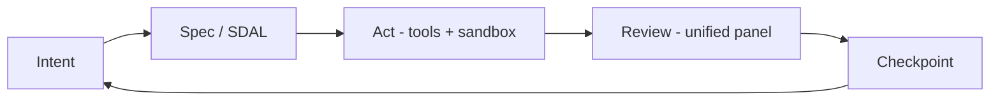
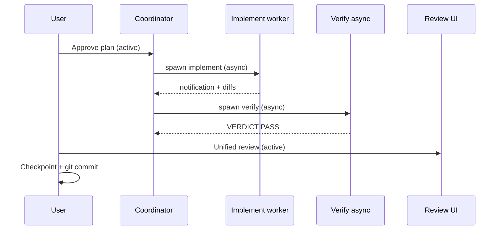
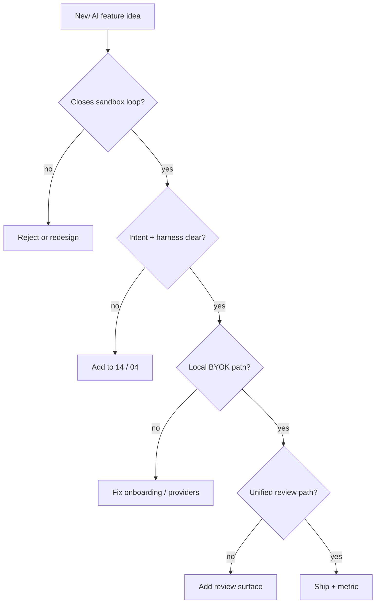
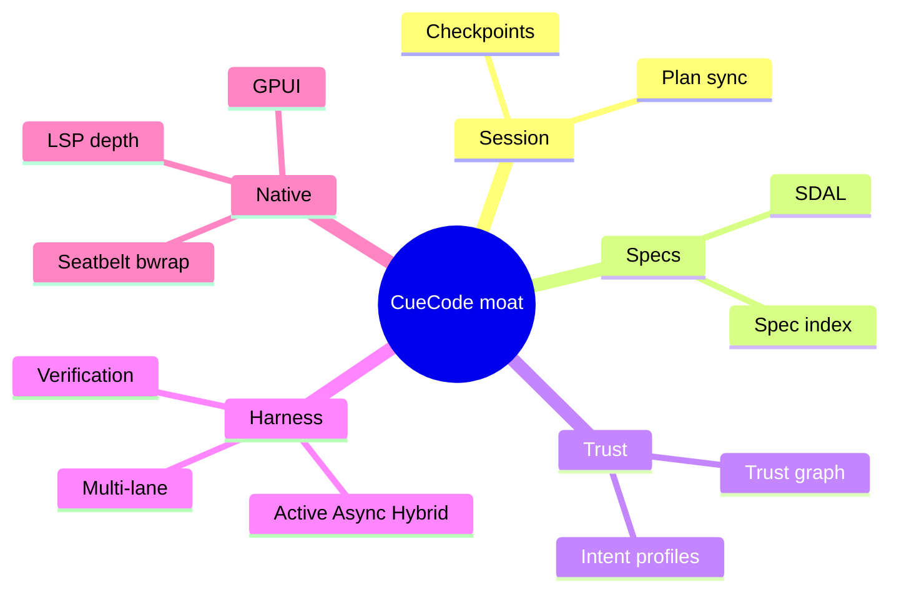
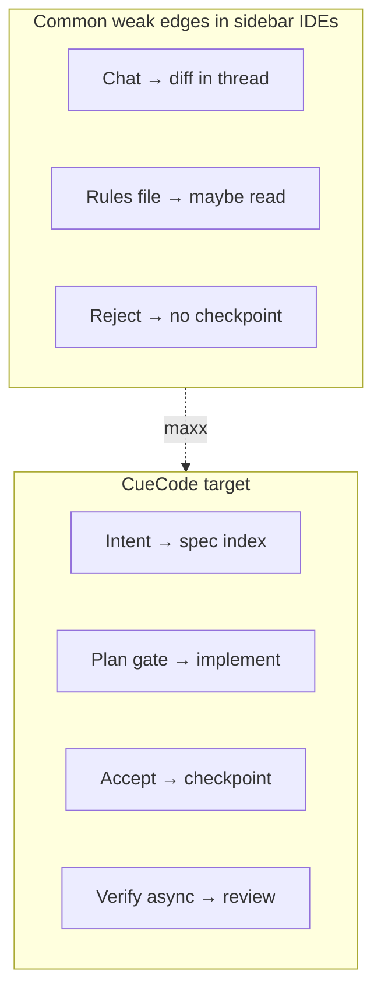
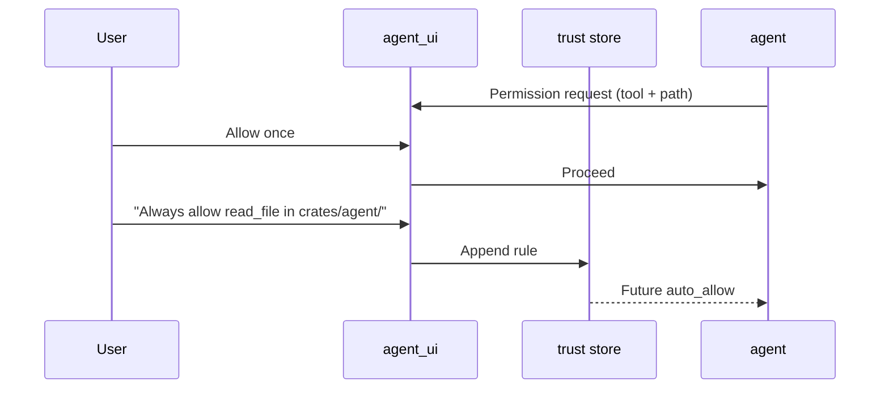

# CueCode AI-maxxing {#ai-maxxing}

Strategic spec for turbo-charging this Zed fork with AI — going **beyond
sidebar-first tools** (Cursor, default Zed Agent UX) toward an **agentic sandbox**
where the session, sandbox, and review loop are the product.

**Stack:** Rust agent runtime (`crates/agent`), GPUI panel (`crates/agent_ui`),
session entity (`acp_thread`), cloud client (`cuecode_cloud` planned), local stubs
`cuecode_specs` + `cuecode_sandbox`.

Related: [01-vision](../core/01-vision), [04-sandbox-core](../core/04-sandbox-core),
[05-innovations](../core/05-innovations), [09-ui-ux-spec](../design/09-ui-ux-spec),
[harness/](../harness/README.md) (cloud Model B + local fallback)

Agent skill: `.cursor/skills/cuecode-ai-maxxing/SKILL.md`

---

## North star {#north-star}

**CueCode is not an editor with a chat panel.** The agentic **sandbox** is the
product; the editor is a tool inside it for review and manual edits.

Every AI feature must answer:

> Does this tighten the sandbox loop (intent → spec → act → review → checkpoint),
> or does it just add more chat?

If the answer is "more chat only" — **reject or redesign**.



**Execution contexts:** Every harness feature is **Active** (developer in loop),
**Async** (background / away), or **Hybrid** (handoff with artifact). See
[harness/local/01-agent-harness](../harness/local/01-agent-harness.md#three-contexts).

---

## vs sidebar-first IDEs (Cursor mental model) {#vs-cursor}

| Dimension | Sidebar-first (Cursor-class) | CueCode maxxing |
|-----------|------------------------------|-----------------|
| Primary unit | Files + chat thread | **Session** (thread + plan + checkpoint) |
| Context | Implicit / rules in IDE | **Specs** in `.cursor/specs/` + skills |
| Trust | Allow all / confirm all | **Intent profiles** + **trust graph** |
| Review | Diff in chat | **Unified review** (plan, diffs, terminal, spec) |
| Agents | One composer | **Multi-lane** (explore / implement / review) |
| Runtime | Electron | **Native GPUI** — latency, integration |
| Models | Vendor account common | **Local-first / BYOK** default |
| Undo | File-level reject | **Checkpoint stack** (session-scoped rewind) |
| Verification | User runs tests manually | **Verification agent** + VERDICT async |
| Orchestration | Subagents in chat | **Coordinator intent** + notification rail |

**Do not** chase Cursor feature parity without a sandbox moat. Match where users
expect baseline agent UX; **leap** on session, trust, specs, review, native speed.

### Moat diagram {#moat-diagram}

```
                    CURSOR / SIDEBAR-FIRST              CUECODE SANDBOX
                    ─────────────────────              ───────────────
                    Chat thread ───────────────►       Session + plan + checkpoint
                    .cursorrules ──────────────►       .cursor/specs/ SDAL
                    Confirm all tools ───────────►     Intent + trust graph
                    Diff in message list ────────►     Unified review panel
                    Single agent thread ───────────►   Multi-lane + harness
                    Cloud model default ───────────►   Ollama / BYOK default
                    (Electron latency) ────────────►   GPUI native + OS sandbox
```

### Parity vs moat decision tree {#parity-tree}

```
User asks for feature X
        │
        ▼
Does Cursor have X?
├── No  → Build if closes sandbox loop
└── Yes → Does native/sandbox/spec make ours BETTER?
          ├── Yes → Maxx it (checkpoint, intent, verify)
          └── No  → Defer unless baseline UX gap blocks adoption
```

Skill reference: `references/cursor-parity-vs-moat.md`

---

## Product stories {#product-stories}

Concrete narratives that illustrate maxxing — use in dogfood and GPUI tests.

### Story 1: Fix auth bug (Active + SDAL) {#story-fix-auth}

**Persona:** Solo Rust dev  
**Intent:** Fix  
**Harness:** Active implement + Async verify

1. User selects **Fix** intent → sandbox + test allowlist enabled.
2. User `@spec 04-sandbox-core#intent-profiles` in composer.
3. **Plan agent** (active) proposes steps; plan entries mirror spec checkboxes (confirm).
4. **Implement agent** edits `crates/auth/`; user reviews in **unified review** pane.
5. User accepts; **checkpoint** created.
6. **Verification agent** runs async → `VERDICT: PASS` in notification rail.
7. User marks session complete → counts toward **SDSW** ([11](../ops/11-metrics-and-success#north-star)).

**Moat moments:** intent-bound sandbox, spec-linked plan, checkpoint, async verify — not "chat suggested a fix."

### Story 2: Explore unfamiliar crate (Async explore) {#story-explore}

**Persona:** New contributor  
**Intent:** Explore  
**Harness:** Async explore lane

1. User selects **Explore** — read-only tools, network off.
2. Spawns background **explore** agent: "Map `crates/agent_ui` module boundaries."
3. User keeps editing elsewhere; notification rail shows completion summary.
4. Parent thread synthesizes; **no spec body** in explore prompt (`omit_spec_index`).
5. User promotes trust rule: auto-allow `read_file` in this repo.

**Moat moments:** Rust-enforced read-only, collapsed tool groups, async notification — not grep spam in chat.

### Story 3: Ship feature (Hybrid pipeline) {#story-ship}

**Persona:** Tech lead  
**Intent:** Ship → Orchestrate  
**Harness:** Hybrid Plan → Implement → Verify → Review



**Moat moments:** every hybrid step produces artifact ([local §C.5](../harness/local/01-agent-harness.md#c-5-hybrid-handoff-artifacts-required)).

### Story 4: Review PR-style diff (Active review) {#story-review}

**Intent:** Review — human-only writes. Agent reads diffs, diagnostics, suggests comments.
User never fights accidental agent edits. Unified review shows plan + terminal test output + spec compliance.

### Story 5: Away summary (Async) {#story-away}

User switches to browser 20 minutes; GPUI detects unfocus. Post-turn **away summary** job runs.
On return: notification rail shows "2 files changed, verify PASS, 1 permission pending."
User resumes in **Active** context without reading full transcript.

---

## AI surface inventory (this fork) {#ai-surfaces}

Full crate map: skill reference `ai-surface-map.md`. Summary:

| Surface | Crates | CueCode priority | Harness context |
|---------|--------|------------------|-----------------|
| Agent panel / threads | `agent_ui`, `acp_thread` | **Core** | Active + Hybrid |
| Native agent + tools | `agent`, `action_log` | **Core** | All |
| External ACP agents | `agent_servers`, `acp_tools` | Keep | Active |
| Skills | `agent_skills`, `.cursor/skills/` | **Core** | Active / Async |
| MCP / context servers | `context_server*` | Important | Intent-gated |
| Models / providers | `language_model*`, `language_models` | **Local-first** | Per-lane |
| Prompts / templates | `agent/templates/`, `prompt_store` | Customize | Per agent type |
| Permissions / sandbox | `agent_settings`, `agent/sandboxing` | **Intent-bound** | All |
| Inline / terminal assist | `inline_assistant`, `terminal_*` | Integrate | Active |
| Edit prediction | `edit_prediction*` | Keep | Complementary |
| Copilot path | `copilot*` | De-emphasize | — |
| Onboarding | `ai_onboarding` | Replace account wall | Activation |

### Surface stack (ASCII) {#surface-stack}

```
┌─────────────────────────────────────────────┐
│ agent_ui (GPUI) — composer, review, rail    │
├─────────────────────────────────────────────┤
│ cuecode_specs │ cuecode_sandbox (planned)    │
├─────────────────────────────────────────────┤
│ acp_thread │ agent │ agent_skills            │
├─────────────────────────────────────────────┤
│ language_models │ context_server │ sandbox   │
├─────────────────────────────────────────────┤
│ editor │ project │ terminal │ git_ui         │
└─────────────────────────────────────────────┘
```

---

## Innovation backlog (maxxing bets) {#innovations-backlink}

Priority from [05-innovations](../core/05-innovations):

| P | Innovation | Spec section | Metric moved |
|---|------------|--------------|--------------|
| P0 | Zero-account default | [05 §9](../core/05-innovations#zero-account) | Local model works |
| P0 | Spec-Driven Agent Loop (SDAL) | [05 §1](../core/05-innovations#sdal) | SDSW |
| P1 | Intent switcher | [05 §2](../core/05-innovations#intent-switcher) | Intent distribution |
| P1 | Checkpoint stack + unified review | [05 §5](../core/05-innovations#checkpoint-stack), [09](../design/09-ui-ux-spec) | Accept rate, rewind |
| P2 | Trust graph | [05 §3](../core/05-innovations#trust-graph) | Trust promotions |
| P3 | Multi-lane sessions | [05 §4](../core/05-innovations#multi-lane) | Multi-lane usage |
| P3 | Composer-first layout | [05 §10](../core/05-innovations#composer-first) | Activation |
| P2 | Context budget UI | [05](../core/05-innovations#context-budget) | Compact frequency |
| P2 | Verification agent | [local §B.2](../harness/local/01-agent-harness.md#b-2-verification-agent-async-gate) | Verify pass rate |

New AI features should map to an innovation or justify a new spec section.

---

## AI-maxxing design checklist {#design-checklist}

Before shipping any AI feature:

### Loop and product {#checklist-loop}

- [ ] **Loop closure** — plan → act → review → checkpoint (not chat-only)
- [ ] **Session artifact named** — what persists if user leaves?
- [ ] **Intent-aware** — behavior differs for Explore / Fix / Ship / Review / Orchestrate
- [ ] **Harness classified** — Active / Async / Hybrid per [local harness](../harness/local/01-agent-harness.md#feature-matrix)

### Trust and safety {#checklist-trust}

- [ ] **Trust-aware** — auto-approve rules; hard denies for secrets
- [ ] **Sandbox aligned** — Fix/Ship use OS sandbox where available
- [ ] **Spec safe** — no silent spec overwrites ([Q6](../ops/12-open-questions#q6-spec-confirm))

### Inference and UX {#checklist-inference}

- [ ] **Inference + UX together** — prompt/tool change has visible UI feedback
- [ ] **Context budget** — catalog vs full body; compaction-safe
- [ ] **Local path** — works without zed.dev account
- [ ] **Failure UX** — no model, tool deny, rate limit, timeout — actionable errors

### Engineering {#checklist-eng}

- [ ] **Rust tool enforcement** — read-only agents not prompt-only
- [ ] **Spec linked** — PR cites `.cursor/specs/` section
- [ ] **Native advantage** — GPUI speed, sandbox, or deep editor integration
- [ ] **Tests** — `agent`, `agent_ui`, or `cuecode_*` coverage as appropriate

### Checklist flow (mermaid) {#checklist-flow}



---

## Feature evaluation rubric {#rubric}

Score 0–2 per dimension; ship if sum ≥ 12/16.

| Dimension | 0 | 1 | 2 |
|-----------|---|---|---|
| Loop closure | Chat only | Partial review | Full checkpoint path |
| Moat | Cursor parity clone | One moat | Spec+sandbox+native |
| Intent fit | Ignores intent | Partial | Full profile change |
| Trust | Binary confirm | Some rules | Trust graph ready |
| Local-first | Cloud only | BYOK | Ollama default path |
| Failure UX | Silent fail | Generic error | Actionable + UI |
| Native | Could be web | GPUI only | GPUI + LSP/sandbox |
| Measurable | No metric | Qualitative | SDSW/accept/event |

---

## Anti-patterns {#anti-patterns}

| Anti-pattern | Why reject | Alternative |
|--------------|------------|-------------|
| Another chat panel | No review/checkpoint | Unified review |
| zed.dev-only feature | Violates local-first | BYOK path |
| Prompt bloat | Context death | Catalog + compact |
| Electron thinking | Wrong stack | GPUI native |
| Autonomous without human | Policy + trust | Verify + review |
| AI with no unhappy path | Broken offline | Onboarding errors |
| Grep flood in transcript | Noise | Collapse tool groups |
| Worker writes coordinator plan | Harness bug | Orchestrate tool filter |
| Spec auto-write | Source corruption | Confirm + diff |

---

## Competitive positioning {#positioning}

### Where we match (baseline) {#baseline-parity}

- Composer with streaming
- Tool calls: read, edit, terminal, grep
- Model picker
- MCP support
- Skills / rules analog (`.cursor/skills` + specs)

### Where we leap (maxxing) {#leap-areas}



---

## Success metrics {#metrics}

Align with [11-metrics-and-success](../ops/11-metrics-and-success):

| Metric | Target | AI-maxxing link |
|--------|--------|-----------------|
| **SDSW** | ≥5/user/week | SDAL + spec index |
| Accept rate | >60% | Unified review |
| Checkpoint usage | Track ↑ | Session trust |
| Intent distribution | Healthy mix | Intent switcher |
| Sessions without zed.dev | >90% first prompt | Zero-account |
| Verify pass rate | >70% | Verification agent |
| Async notification engagement | Track | Async harness |

---

## Implementation routing {#routing}

| Work type | Read first | Skills |
|-----------|------------|--------|
| Harness / agents / async | [harness/local/01-agent-harness](../harness/local/01-agent-harness.md) | `cuecode-ai-maxxing`, `agent-inference` |
| New AI product bet | This doc + [05-innovations](../core/05-innovations) | `cuecode-ai-maxxing`, `product-builder` |
| Prompts / models / tools | [08](./08-agent-tools-and-skills) | `agent-inference` |
| Agent panel UI | [09-ui-ux-spec](../design/09-ui-ux-spec) | `ui-ux-gpui` |
| Infrastructure | [10](../ops/10-infrastructure) | `agent-inference` |
| Rust changes | — | `rust-quality` |
| Communication | — | `engineering-partner` |

New crates (planned): `cuecode_specs`, `cuecode_sandbox` — see [06-system-design](../core/06-system-design).

---

## Phase alignment {#phases}

| Roadmap phase | AI-maxxing deliverables |
|---------------|-------------------------|
| 0 | Remove zed.dev wall; local model onboarding |
| 1 | Spec index in system prompt; `list_specs` / `read_spec` tools |
| 2 | Intent switcher; intent prompt deltas |
| 3 | Unified review; checkpoints; explore/plan tool walls |
| 4 | Trust graph; context budget UI |
| 5 | Multi-lane; coordinator; verification VERDICT |
| 6 | Polish; composer-first preset; dogfood stories |

---

## Ideation prompts (for agents) {#ideation}

When designing a new feature, answer:

1. What's the **session artifact** (plan entry, checkpoint, VERDICT, spec section)?
2. What's the **trust boundary** (intent, tool, path, network)?
3. **Active, Async, or Hybrid?** If Hybrid, what's the handoff artifact?
4. Does Cursor already do this — is our version **native / sandbox / spec** better?
5. Which **metric** moves (SDSW, accept rate, activation)?
6. What's the **unhappy path** (offline, deny, timeout)?

Load `engineering-partner` in **Ideate** mode for brainstorming; **Solve** for implementation.

---

## GPUI / Rust implementation notes {#impl-notes}

| Pattern | Crate | Note |
|---------|-------|------|
| `cx.listener` for composer actions | `agent_ui` | Match existing message editor |
| `cx.spawn` for async harness | `agent`, `agent_ui` | Cancel on session drop |
| Tool filter per `agent_type` | `agent`, `cuecode_sandbox` | Rust enforcement |
| `cx.notify()` after state change | All views | Rerender review + rail |
| `./script/clippy` | — | Required before PR |

Never `unwrap()` on user paths; propagate errors to notification rail.

---

## Deep dive: closing the sandbox loop {#deep-dive-loop-closure}

Every shipped AI feature must tighten at least one edge of the SDAL graph. This section
maps **feature types → loop edges → verification** so PRs cannot claim "AI improvement"
without naming the edge.

### Loop edge matrix {#loop-edge-matrix}

| Edge | What breaks if weak | Example fix | Metric |
|------|---------------------|-------------|--------|
| Intent → Spec | Agent ignores `.cursor/specs/` | `@spec` picker + spec index in prompt | Spec discovery % |
| Spec → Plan | Plan doesn't reference spec anchors | Plan agent `read_spec` tool | Plan items with spec refs |
| Plan → Act | Tools run without sandbox/intent | `cuecode_sandbox` tool filter | Permission deny rate |
| Act → Review | Diffs buried in chat | Unified review strip | Accept rate |
| Review → Checkpoint | User can't rewind | `create_checkpoint` on accept | Checkpoint usage |
| Checkpoint → Intent | Next task loses context | Compact preserves intent + spec path | Rewind rate |



### Feature archetypes {#feature-archetypes}

| Archetype | Description | Loop edges | Harness | Example |
|-----------|-------------|------------|---------|---------|
| **Context** | Gets right info to model | Intent→Spec, Spec→Plan | Active | Spec index, skills |
| **Execution** | Runs tools safely | Plan→Act | Active/Async | Sandbox, spawn_agent |
| **Review** | Human approves work | Act→Review | Active | Unified review |
| **Memory** | Session survives compact/away | Review→Checkpoint | Async | Checkpoints, session notes |
| **Gate** | Blocks bad ship | Act→Review | Async | VERDICT |
| **Orchestration** | Parallel lanes | Plan→Act (N workers) | Hybrid | Multi-lane, coordinator |

Reject PRs that are **Chat** archetype only (new message renderer with no review/checkpoint path).

---

## Deep dive: intent profiles as product surface {#deep-dive-intent-profiles}

Intent is not a settings deep-link — it is the **primary trust UX**. Each profile is a
contract with the user about what the agent may do.

### Intent contract table {#intent-contract-table}

| Intent | User promise | Agent may | Agent must not | Default harness |
|--------|--------------|-----------|----------------|-----------------|
| **Explore** | "Help me understand" | Read, grep, diagnostics | Edit, terminal write, network | Async explore |
| **Fix** | "Fix this with me" | Edit, sandboxed test, allowlist network | Push, spec prose write | Active implement |
| **Ship** | "Land this change" | Fix + git + verify gate | Push without confirm | Hybrid pipeline |
| **Review** | "I review, you advise" | Read, comment tools | Any write | Active read-only |
| **Orchestrate** | "Run workers for me" | Spawn, read plan/spec | Direct edit on coordinator | Hybrid coordinator |

### Intent switcher UX requirements {#intent-switcher-ux}

```
┌─ Intent header ────────────────────────────────────────────────┐
│  [Explore] [Fix●] [Ship] [Review] [Orchestrate]   Model: ▼    │
│  Fix: sandbox on · network allowlist · checkpoints enabled     │
└────────────────────────────────────────────────────────────────┘
```

**Rules:**

1. Switching intent mid-session shows **diff of permission changes** (not silent).
2. Downgrade (Ship → Explore) cancels in-flight write tools with confirm.
3. Intent visible in every async notification payload ([local §notification-envelope](../harness/local/01-agent-harness.md#notification-envelope)).
4. Default intent per new session: **Fix** for dogfood; measure [Q3](../ops/12-open-questions#q3-layout-default) separately for layout.

### Intent × model hints {#intent-model-hints}

| Intent | Default model strategy | Why |
|--------|------------------------|-----|
| Explore | Fast/local small model | Grep-heavy; cost control |
| Fix | User session model | Quality for edits |
| Ship | Session model + verify fast | Implement quality + cheap verify |
| Review | Session model | Nuanced comments |
| Orchestrate | Session model | Synthesis quality |

---

## Deep dive: trust graph mechanics {#deep-dive-trust-graph}

Trust graph is the **permission memory** that stops confirm fatigue without allow-all.

### Trust rule shape {#trust-rule-shape}

```json
{
  "repo_hash": "a1b2…",
  "rules": [
    {
      "tool": "read_file",
      "glob": "crates/agent/**",
      "intent": ["explore", "fix"],
      "auto_allow": true,
      "created_at": "2026-06-17T12:00:00Z",
      "source": "user_promote"
    },
    {
      "tool": "terminal",
      "command_prefix": "cargo test",
      "intent": ["fix"],
      "auto_allow": true
    }
  ],
  "hard_denies": [
    { "path_glob": "**/.env" },
    { "path_glob": "**/credentials.json" },
    { "tool": "read_file", "path_glob": "**/.ssh/**" }
  ]
}
```

**Hard denies** never auto-promote — even Ship intent requires explicit confirm ([10 §secrets](../ops/10-infrastructure#secrets)).

### Promotion flows {#trust-promotion-flows}



Track `trust_promote` events ([11 §event-catalog](../ops/11-metrics-and-success#event-catalog)).
High promotion rate + low deny rate = healthy trust UX.

---

## Deep dive: verification as moat {#deep-dive-verification}

Verification is not "run tests in chat" — it is an **async gate** with structured VERDICT.

### Why verification beats manual test {#verify-moat}

| Sidebar IDE | CueCode verify |
|-------------|----------------|
| User runs tests in terminal | Verification agent async |
| Model claims "tests pass" | VERDICT file + evidence |
| No block on ship | Ship intent blocked on FAIL |
| No session artifact | `verdicts/<turn>.md` + notification |

### Verify integration points {#verify-integration}

1. **Spawn:** After implement accept + checkpoint, auto-offer verify (Ship) or manual (Fix).
2. **Execute:** Read-only agent, sandboxed `cargo test` / `./script/clippy`.
3. **Emit:** `submit_verdict` tool → JSON + markdown evidence.
4. **Notify:** Red card on FAIL in notification rail ([local §B.2](../harness/local/01-agent-harness.md#b-2-verification-agent-async-gate)).
5. **Gate:** `session_complete` disabled until PASS or user override with confirm.

### VERDICT override policy {#verdict-override}

Override allowed — users own risk — but:

- Log `verdict_override` event with FAIL reason hash
- Show persistent banner in session until next PASS
- Track override rate <10% in [11 §harness-metrics](../ops/11-metrics-and-success#harness-metrics)

---

## Deep dive: async as productivity multiplier {#deep-dive-async}

Async harness is how CueCode beats "wait and watch the chat scroll."

### Async eligibility guide {#async-eligibility}

| Task | Async default? | Rationale |
|------|----------------|-----------|
| Map unfamiliar crate | Yes | Long read-only |
| Run full test suite verify | Yes | Minutes-long |
| Single-file fix | No | Active pair-program |
| Permission decision | No | Active modal |
| Plan authoring | No | Active collaboration |
| Away summary | Yes | Post-turn hook |
| Spec learnings extract | Yes (beta) | Post-turn optional |

### Notification signal hierarchy {#notification-signal}

| Priority | Kind | Interrupt user? |
|----------|------|-----------------|
| P0 | VERDICT FAIL | Yes — rail + review |
| P1 | Implement worker done | Soft badge |
| P2 | Explore done | Rail entry |
| P3 | Away summary | On focus only |
| P4 | Proactive brief | Beta only |

Never P4 during Active foreground implement unless user opted in.

---

## Deep dive: multi-lane orchestration {#deep-dive-multi-lane}

Multi-lane is the **GPUI-native swarm** — not tmux, not external CLI agents.

### Lane choreography patterns {#lane-choreography}

**Pattern A: Fix + Verify (2 lane)**

```
Implement lane (active) ──accept──► checkpoint
        │
        └──spawn verify lane (async)──► VERDICT ──► review (active)
```

**Pattern B: Explore + Implement (2 lane)**

```
Explore (async) ──notification──► synthesis (active parent)
        │
        └──user approves plan──► Implement (active)
```

**Pattern C: Full orchestrate (4 lane)**

```
Coordinator (parent)
  ├── explore async
  ├── implement async
  └── verify async
        └── synthesize ──► unified review
```

Conflict rule: **one writer per path set** — second writer gets `LaneConflict` ([local §rust-types](../harness/local/01-agent-harness.md#rust-types)).

Decision: one parent AcpThread — see [ADR example Q13](../ops/12-open-questions#adr-example-q13).

---

## Competitive feature response playbook {#competitive-playbook}

When user or dogfood says "Cursor has X," run this playbook before building.

### Response template {#competitive-response-template}

1. **Classify X:** parity baseline vs moat opportunity vs distraction
2. **Map loop edge:** which SDAL edge does X affect?
3. **Score rubric:** [§Feature evaluation rubric](#rubric) — ship if ≥12/16
4. **Harness classify:** Active / Async / Hybrid
5. **Metric:** name expected movement (SDSW, accept rate, etc.)
6. **Decision:** ship / maxx / defer — document in PR

### Common requests mapped {#competitive-requests-map}

| Request | Class | CueCode response |
|---------|-------|------------------|
| Background agents | Parity → Moat | Async harness + notification rail ([local harness](../harness/local/01-agent-harness.md)) |
| Rules files | Parity | Specs + skills — stronger SDAL |
| Composer @codebase | Parity | Spec index + project context |
| Bugbot / review bot | Moat | Verification agent + VERDICT |
| Multiple chats | Parity → Moat | Multi-lane with shared checkpoint |
| Cloud account | Anti-goal | BYOK / Ollama — do not build |
| Browser tool | Parity | Intent-gated fetch; defer browser MCP |
| Auto-commit | Distraction | Checkpoint + user confirm commit (Ship) |
| YOLO mode | Anti-pattern | Trust graph — never allow-all default |

---

## Rollout stages for AI features {#ai-rollout-stages}

| Stage | Audience | Bar |
|-------|----------|-----|
| **Internal** | Team only | Checklist + clippy |
| **Dogfood** | Invited devs | Metric instrumented + story |
| **Alpha** | Public alpha | Alpha gate + runbooks |
| **Beta** | Wider | Beta gate + trust graph |

Feature flags in settings JSON — no half-shipped UI without flag.

---

## AI feature PR description template {#ai-pr-template}

```markdown
## Spec
Implements [13-ai-maxxing.md#anchor] + [harness/local/01-agent-harness.md#anchor]

## Loop edge
[Intent→Spec | Plan→Act | Act→Review | …]

## Harness
Active | Async | Hybrid — artifact: [name]

## Metric
Expected: [SDSW | accept rate | …] — event: [event name]

## Unhappy path
[offline | deny | timeout UX]

## Checklist
- [ ] 13 design-checklist
- [ ] Rust tool enforcement if agent-typed
- [ ] No prompt content in telemetry
```

---

## Extended anti-pattern catalog {#extended-anti-patterns}

| Anti-pattern | Symptom | Detection | Fix |
|--------------|---------|-----------|-----|
| **Spec decoration** | `@spec` in prompt but plan ignores it | Manual review | Plan agent must cite anchors |
| **Fake async** | Background flag but blocks GPUI thread | Profiling | `cx.spawn` + Task handle |
| **Notification spam** | Rail fills with explore progress | Event rate | Collapse + complete-only notify |
| **Coordinator worker edits** | Orchestrate thread writes files | Tool audit | Tool wall on coordinator |
| **Verify theater** | Model says PASS without tool | Missing verdict file | `submit_verdict` enforced |
| **Trust bypass** | Hidden allow-all setting | Settings audit | Remove; use promotions |
| **Compact amnesia** | Loses spec path after compact | Repro long session | CompactPreserve struct ([10 §compaction](../ops/10-infrastructure#compaction)) |
| **Lane plan fork** | Two lanes mutate plan | Conflict logs | Parent owns plan exclusively |
| **Metric gaming** | Auto plan checkbox without work | SDSW audit | Require accept or complete |
| **Parity churn** | Ports Cursor UI with no moat | Rubric <8 | Redesign or defer |

---

## Future moat bets (post-beta) {#future-moat-bets}

| Bet | Description | Depends on |
|-----|-------------|------------|
| **Magic spec docs** | Spec sections update from session learnings | Spec confirm policy [Q6](../ops/12-open-questions#q6-spec-confirm) |
| **Worktree per Ship** | Isolated git worktree per ship session | Sandbox + git_ui |
| **Cron verify** | Nightly branch verification | Async harness v3 |
| **LSP agent tools** | Call hierarchy, type nav as tools | editor/LSP depth |
| **Prompt speculation** | Ghost text accept from stop hook | Post-turn hooks |
| **CI webhook session** | Failed CI → agent notification | External integration |

Each bet requires new spec section + rubric score before implementation.

---

## Related open questions {#open-questions}

| ID | Topic |
|----|-------|
| [Q10](../ops/12-open-questions#q10-default-model) | Default Ollama model |
| [Q11](../ops/12-open-questions#q11-agent-backend) | Native vs ACP |
| [Q13–Q16](../ops/12-open-questions#harness-open) | Harness architecture |

---

## Document changelog {#changelog}

| Date | Change |
|------|--------|
| 2026-06-17 | Hyper-detailed expansion: stories, moat diagrams, checklist flows |
