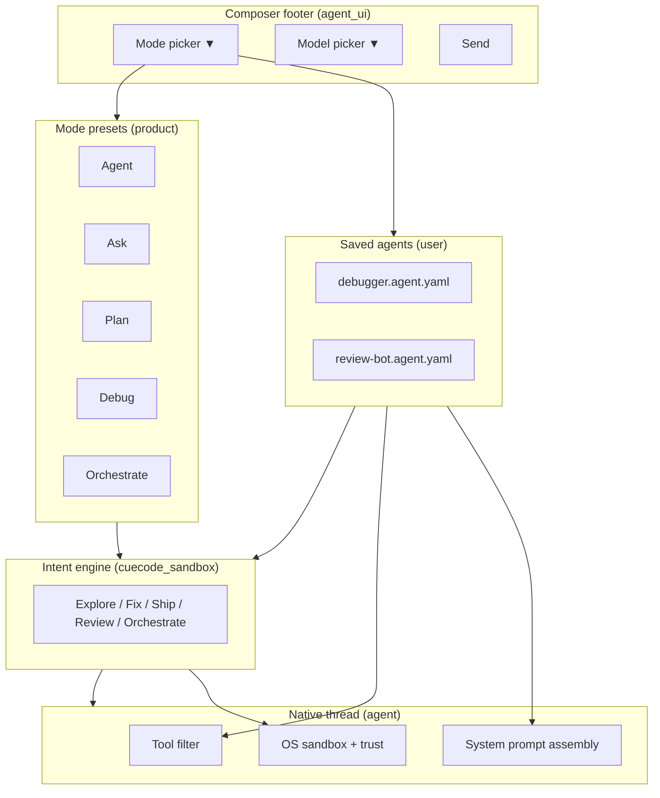
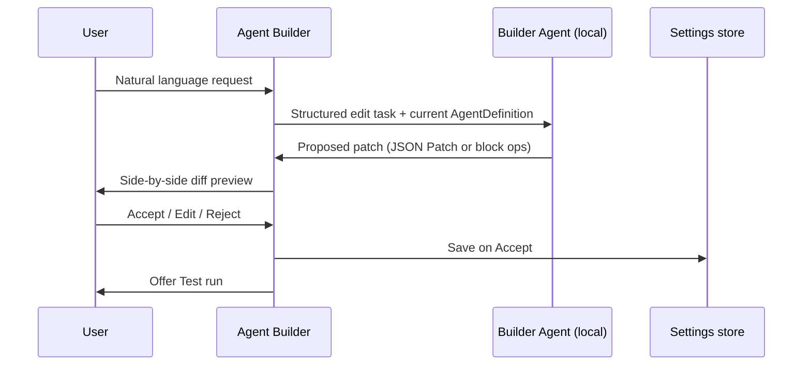

# Agent Modes & Agent Builder {#agent-modes-and-builder}

Replace Zed's opaque **agent profiles** (Write / Ask / Minimal + modal tool toggles)
with a **Cursor-class composer mode picker** on the surface and a **CueCode agent
builder** underneath — an agentic low-code surface for defining, testing, forking,
and sharing saved agent definitions.

This spec is the product + engineering contract for composer footer UX, mode semantics,
persistence schema, builder UI, migration from upstream profiles, and integration
with **intent profiles** ([04-sandbox-core](../core/04-sandbox-core#intent-profiles)).

**Related:** [04-sandbox-core](../core/04-sandbox-core), [08-agent-tools-and-skills](./08-agent-tools-and-skills),
[09-ui-ux-spec](../design/09-ui-ux-spec#agent-panel), [13-ai-maxxing](./13-ai-maxxing),
[harness/local/01-agent-harness](../harness/local/01-agent-harness.md)

**Implementation phases:** [Build phase 2.3](../delivery/build-plans/phases/2-3-composer-modes-agent-builder.md)

**Crates:** `agent_ui`, `agent_settings`, `agent`, `settings`, `settings_ui`, `cuecode_sandbox` (intent layer)

---

## Problem statement {#problem}

### What users see today (broken mental model)

The composer footer exposes a **profile picker** labeled Write / Ask / Minimal (plus
custom profiles like "debugger"). **Configure** opens `ManageProfilesModal`:

1. Choose profile → New Profile (name only) → View Profile menu
2. Nested sub-flows: Fork · Default Model · Built-in Tools · MCP Tools · Delete

This UI implies "profiles" are **personas**. In reality they are **tool checkbox maps**
stored in `settings.json` under `agent.profiles` — see
`assets/settings/default.json` and `AgentProfileContent` in `settings_content/src/agent.rs`.

There is **no** editable system prompt, sandbox policy, skills binding, trust defaults,
or test harness in the configure flow. Custom profiles inherit tool toggles from a
base profile and optionally a default model — nothing else.

### Why it conflicts with CueCode strategy

| Layer | Spec vision | Current UI |
|-------|-------------|------------|
| Primary control | **Intent** (Explore / Fix / Ship / Review / Orchestrate) | Zed **Profile** (Write / Ask / Minimal) |
| Sandbox | Network + FS + trust reconfigured per intent | Not visible in profile UI |
| Persona | System prompt + skills + rules | Not in profile schema |
| Cursor parity | Obvious mode picker (Agent / Ask / …) | Profile picker + admin modal |
| Moat | Spec-driven, testable agent definitions | Checkbox lists in a modal |

Users who want **Cursor-like agent mode** and users who want **powerful custom agents**
both hit the same underpowered surface — hence "Configure doesn't make sense."

### Success criteria (product)

1. **Composer footer feels like Cursor** — one mode control, obvious behavior, no admin maze.
2. **Power users get a builder** — define agents with prompts, tools, sandbox, skills; save, fork, test.
3. **Agentic authoring** — user can describe an agent in natural language; builder proposes structured changes with diff preview.
4. **Single runtime model** — modes, saved agents, and intent profiles compose predictably (documented precedence).
5. **Migration** — existing Write / Ask / Minimal / custom profiles map forward without data loss.

---

## Concepts and glossary {#glossary}

| Term | Definition |
|------|------------|
| **Composer mode** | User-facing picker in the message editor footer (Cursor-class). Maps to a **mode preset**. |
| **Mode preset** | Built-in, product-owned definition bundling default intent, tool policy, prompt additions, and UX labels. Not user-deletable. |
| **Saved agent** | User-defined agent definition (`AgentDefinition`). Forkable, exportable. Replaces "custom profile." |
| **Intent profile** | Sandbox policy layer from [04 §intent-profiles](../core/04-sandbox-core#intent-profiles). Controls network, FS, trust, hard tool denies. |
| **Agent builder** | Settings + optional side panel UI to edit `AgentDefinition` blocks; supports agent-assisted edits. |
| **Active configuration** | Resolved config for the current thread after precedence rules (§runtime-precedence). |
| **Profile (legacy)** | Zed `agent.profiles` entry. Deprecated name; migrated to saved agent or mode preset reference. |

---

## Target architecture {#architecture}

### Layer diagram



### Design principles {#principles}

1. **Modes are behavior-first** — picker shows what the agent *does*, not settings IDs.
2. **Intent enforces safety** — UI labels never bypass hard denies ([08 §principles](./08-agent-tools-and-skills#principles)).
3. **Saved agents extend, not replace, intent** — they narrow tools and add instructions; they cannot enable network in Explore.
4. **Builder is structured** — every field maps to runtime; no orphan checkboxes.
5. **Agent-assisted edits are diff-first** — AI proposes YAML/block changes; user confirms Save.
6. **Test before trust** — builder includes "Test run" (single turn, sandboxed, no side effects beyond policy).
7. **Keep split I/O context rings** — the composer footer's ↑/↓ circular progress indicators are a retained UX anchor; never drop them in mode-picker or footer refactors ([§split-token-usage](#split-token-usage)).

---

## Composer mode picker (Cursor parity) {#composer-mode-picker}

### Placement

Replace the current **profile selector** in the message editor footer with a **mode
picker** when the native agent is active. Keep model selector adjacent (unchanged position).

**Wireframe — composer footer**

```
┌─────────────────────────────────────────────────────────────────────────────┐
│  Message input…                                                             │
├─────────────────────────────────────────────────────────────────────────────┤
│  [+] [@]     │  [↑○ ↓○]  [∞ Agent ▼]  [GLM 5.2 ▼]  [Send ⏎]               │
└─────────────────────────────────────────────────────────────────────────────┘
```

`↑○ ↓○` = split input/output context rings — **required**; see [§split-token-usage](#split-token-usage).

### Mode preset catalog (v1)

Product-owned presets. IDs are stable; display names localizable.

| Preset ID | Display | Icon | Default intent | Cursor analog | Primary use |
|-----------|---------|------|----------------|---------------|-------------|
| `agent` | Agent | ∞ | **Fix** | Agent | Default implementer — edit, terminal, tools |
| `ask` | Ask | ○ | **Explore** | Ask | Read-only Q&A, specs, codebase exploration |
| `plan` | Plan | ≡ | **Orchestrate** (read-heavy) | Plan | Planning, specs, spawn read-only workers |
| `debug` | Debug | 🐛 | **Fix** (terminal bias) | Debug | Diagnostics, logs, repro, minimal edits |
| `review` | Review | □ | **Review** | (partial) | Read + comment; no writes |
| `orchestrate` | Multitask | ◎ | **Orchestrate** | Multitask | Coordinator — spawn lanes, no direct edits |

**Notes:**

- **Agent** replaces legacy **Write** preset (migration alias).
- **Ask** replaces legacy **Ask** preset (same ID `ask` where possible).
- **Minimal** deprecated → maps to **Ask** with "strict tools" variant or saved agent; see §migration.
- Icons use GPUI `IconName` equivalents; exact glyph choices in [09-ui-ux-spec](../design/09-ui-ux-spec#composer-mode-picker).

### Popover contents

```
┌─ Mode ────────────────────────────────┐
│ 🔍 Filter modes…                      │
├───────────────────────────────────────┤
│ ∞  Agent                          ✓   │
│ ○  Ask                                │
│ ≡  Plan                               │
│ 🐛 Debug                              │
│ □  Review                             │
│ ◎  Orchestrate                        │
├───────────────────────────────────────┤
│ ★ Saved agents                        │
│    debugger                           │
│    spec-writer                        │
├───────────────────────────────────────┤
│ ⚙  Manage agents…                     │  → Agent Builder (settings page)
└───────────────────────────────────────┘
```

**Removed from popover:** "Configure" opening `ManageProfilesModal` name-only flow.

**Keyboard:**

| Action | Binding (macOS) | Behavior |
|--------|-----------------|----------|
| Toggle mode menu | `⌥⌘P` (keep if already bound) | Open mode popover |
| Cycle mode | `⌥⌘⇧P` | Cycle presets in catalog order |
| Open builder | — | Only via "Manage agents…" or Settings |

### Mode selection behavior

On mode change:

1. Update thread `active_mode` field (new) and linked `intent` (via preset map).
2. Apply tool filter intersection (intent ∩ preset ∩ saved agent if any).
3. If preset or saved agent specifies `default_model`, offer **switch model?** toast (do not silently switch after first dismiss preference).
4. Emit telemetry `cuecode.mode.selected` with `mode_id`, `source`.
5. Re-render composer footer badge (optional one-line hint: "Read-only" in Ask).

### ACP / external agents

When thread uses ACP (`ModeSelector` in `agent_ui/src/mode_selector.rs`), show **ACP
session modes** instead of CueCode presets. Do not merge the two systems in one menu.
If both could apply, native picker wins for native threads only.

---

## Split input/output context rings (retain) {#split-token-usage}

### Product intent

The composer footer **split token usage** control — **↑ ring** (input / prompt context)
and **↓ ring** (output / completion budget) — is a core CueCode UX element. Users rely
on it to see context pressure at a glance without opening settings or a modal.

**This spec explicitly requires keeping it** through all composer footer work (mode
picker, agent builder, composer-first layout). Refactors must **relayout around it**,
not remove or replace it with a generic single ring unless the model cannot report
split counts (fallback only).

### Current implementation (upstream)

| Item | Location |
|------|----------|
| Render | `crates/agent_ui/src/conversation_view/thread_view.rs` — `render_token_usage()` |
| DOM id (split) | `#split_token_usage` |
| DOM id (fallback) | `#circular_progress_tokens` |
| Component | `CircularProgress` + `IconName::ArrowUp` / `ArrowDown` |
| Tooltip | `TokenUsageTooltip` — Input/Output counts, cost, rules loaded |
| Gate | `LanguageModel::supports_split_token_display()` |

When `show_split` is true, footer shows:

```
↑ ○    ↓ ○
```

Each ring fills by ratio: `input_tokens / input_max` and `output_tokens / output_max`.
Stroke turns **warning** color at ≥85% utilization (existing behavior).

### Layout rules (composer footer)

| Rule | Requirement |
|------|-------------|
| **Position** | Left of mode picker and model selector; right of `@` / add-context cluster |
| **Order** | `[add context…] … [↑○ ↓○] [Mode ▼] [Model ▼] [Send]` |
| **Visibility** | Shown whenever `thread.token_usage()` is `Some` (same as today) |
| **Split preferred** | If model supports split display, **always** use dual rings — not the single combined ring |
| **Resize** | Rings stay `flex_shrink_0`; must not collapse on narrow agent panel (wrap footer row if needed) |
| **Interaction** | Hover/focus tooltip with Input/Output breakdown — preserve `TokenUsageTooltip` content |
| **Theming** | Muted arrows; ring uses `text_muted` / `status.warning` — match existing GPUI tokens |

### Relationship to Context Budget UI (Phase 5)

These rings are **not** the same as the planned **Context Budget Bar** ([05 §context-budget](../core/05-innovations#context-budget)) — category breakdown (Specs / Files / Chat / Tools).

| Surface | Scope | Phase |
|---------|-------|-------|
| **Split I/O rings** | Input vs output token pressure vs model limits | **Keep now** — shipping in Zed fork |
| **Context budget bar** | Category breakdown + manual compact/drop | Optional Phase 5.2 — **additive**, header or popover |

Do **not** implement context budget by removing split rings. If both exist, rings stay
in the composer footer; budget bar lives in header or tooltip drill-down.

### Non-goals

- Replacing rings with a text label only (`12k/128k`)
- Moving rings to agent header (footer placement is intentional — near send)
- Hiding rings in Explore / Ask mode (context pressure still matters when reading)

### Acceptance

See **EC-AM-8** in [§acceptance](#acceptance).

---

## Saved agents & Agent Builder {#agent-builder}

### Purpose

The **Agent Builder** is the power-user surface for creating **saved agents** —
structured definitions that combine:

- Human-readable **purpose**
- **Instructions** (system prompt extension)
- **Tool allowlist** (native + MCP)
- **Skills** and **rules** attachments
- **Model** preference and fallbacks
- **Intent override** (optional, bounded)
- **Subagent spawn** defaults (Orchestrate only)

The builder supports **agentic authoring**: a chat column or inline "Describe changes…"
field where the user asks for modifications; the product proposes block updates with
a diff preview before Save.

### Entry points

| Entry | Destination |
|-------|-------------|
| Mode popover → Manage agents… | Settings → Agents → Builder list |
| Settings sidebar → Agents | Builder list |
| Command palette → `agent: Open Agent Builder` | Builder list |
| Mode popover → long-press saved agent | Builder editor for that agent |
| `@agent` mention in composer (future) | Attach saved agent to thread |

### Builder list page

```
Settings → Agents

┌─ Agents ────────────────────────────────────────────────────────────────────┐
│  Built-in modes (read-only)                                                 │
│  Agent · Ask · Plan · Debug · Review · Orchestrate                          │
│                                                                             │
│  Your agents                                              [+ New agent]     │
│  ┌─────────────────────────────────────────────────────────────────────┐   │
│  │ debugger     Fix intent · 12 tools · GLM 5.2          [Edit] [⋯]   │   │
│  │ spec-writer  Plan intent · 8 tools · inherit          [Edit] [⋯]   │   │
│  └─────────────────────────────────────────────────────────────────────┘   │
│                                                                             │
│  Import…   Export all…                                                      │
└─────────────────────────────────────────────────────────────────────────────┘
```

### Builder editor (block layout)

Single scrollable page with anchored sections. All sections participate in validation.

```
┌─ Edit agent: debugger ──────────────────────────────────────────────────────┐
│  [Test run]  [Save]  [Fork]  [Revert]                    Unsaved changes ●  │
├───────────────────────────────┬─────────────────────────────────────────────┤
│  STRUCTURE (human + machine)  │  AGENT ASSIST (optional, v2)              │
│                               │  "Make this agent more cautious about git"  │
│  Name                         │  [Propose changes]                        │
│  ┌ debugger ────────────────┐ │                                           │
│                               │  Preview diff                               │
│  Purpose (one line)           │  ┌─────────────────────────────────────┐  │
│  ┌ Root-cause analysis… ────┐ │  │ - instructions: …                   │  │
│                               │  │ + instructions: …                   │  │
│  Base mode preset             │  └─────────────────────────────────────┘  │
│  [Debug ▼]                    │                                           │
│                               │                                           │
│  Intent                       │                                           │
│  ( ) Inherit from preset      │                                           │
│  (●) Override [Fix ▼]         │  (override disabled if illegal combo)     │
│                               │                                           │
│  Model                        │                                           │
│  Default [GLM 5.2 ▼]          │                                           │
│  Fallback [local/llama ▼]     │                                           │
│  ( ) Inherit session model    │                                           │
│                               │                                           │
│  Tools ▼                      │                                           │
│  [x] grep  [x] terminal  …    │                                           │
│  MCP ▼                        │                                           │
│  github [x]  browser [ ]      │                                           │
│                               │                                           │
│  Skills & rules ▼             │                                           │
│  @rust-quality  @gpui-test    │                                           │
│  Include AGENTS.md  [x]       │                                           │
│                               │                                           │
│  Instructions ▼               │                                           │
│  ┌──────────────────────────┐ │                                           │
│  │ You are a debugging…     │ │                                           │
│  └──────────────────────────┘ │                                           │
│                               │                                           │
│  Advanced ▼                   │                                           │
│  Subagent spawn: [off ▼]      │                                           │
│  Trust: inherit intent        │                                           │
└───────────────────────────────┴─────────────────────────────────────────────┘
```

### Agentic authoring flow (v2)



**Builder agent constraints:**

- Runs in **Explore** intent + builder tool allowlist (`read_agent_def`, `propose_agent_patch` only).
- Cannot enable tools or intents beyond builder validation rules.
- Must cite which blocks changed and why (short rationale field in proposal).

### Test run

**Test run** executes a **single sandboxed turn** (or fixed script of turns in v2):

1. User optional seed prompt: "Try listing tests for agent crate."
2. Spawn ephemeral thread with resolved config (not persisted as user thread).
3. Show tool calls + assistant reply + policy violations in a modal.
4. No writes outside sandbox policy; terminal allowlist respected.

Exit: user sees "This agent behaves as expected" before Save.

---

## Data model {#data-model}

### AgentDefinition (new schema)

Persisted per user. v1: embed in `settings.json` under `agent.definitions`.
v1.1 optional: `~/.config/cuecode/agents/*.agent.yaml` with settings references.

```rust
// Conceptual — implement in settings_content + agent_settings

pub struct AgentDefinition {
    pub id: AgentDefinitionId,           // kebab-case slug
    pub name: SharedString,
    pub purpose: SharedString,             // ≤240 chars, UI subtitle
    pub base_mode: ModePresetId,           // agent | ask | plan | ...
    pub intent_override: Option<IntentId>, // None = inherit preset
    pub model: AgentModelPolicy,
    pub tools: ToolPolicy,
    pub mcp: McpToolPolicy,
    pub skills: SkillAttachments,
    pub rules: RulesAttachments,
    pub instructions: SharedString,        // markdown, max 16 KiB v1
    pub subagent: SubagentPolicy,
    pub metadata: AgentDefinitionMeta,
}

pub struct AgentModelPolicy {
    pub inherit_session_model: bool,
    pub default_model: Option<LanguageModelSelection>,
    pub fallback_model: Option<LanguageModelSelection>,
}

pub struct ToolPolicy {
    /// None = inherit preset defaults; Some = explicit map
    pub native: Option<IndexMap<Arc<str>, bool>>,
}

pub struct McpToolPolicy {
    pub enable_all: bool,
    pub servers: IndexMap<Arc<str>, ContextServerPresetContent>,
}

pub struct SkillAttachments {
    pub skill_ids: Vec<SharedString>,      // agent_skills ids or paths
    pub include_agents_md: bool,
    pub include_cursor_rules: bool,
}

pub struct SubagentPolicy {
    pub allow_spawn: bool,
    pub default_agent_type: Option<SharedString>, // harness builtin id
}

pub struct AgentDefinitionMeta {
    pub created_at: i64,
    pub updated_at: i64,
    pub forked_from: Option<AgentDefinitionId>,
    pub version: u32,                      // bump on save
}
```

### ModePreset (product constants)

Not stored in user settings. Defined in Rust (`agent_settings/src/mode_presets.rs`).

```rust
pub struct ModePreset {
    pub id: ModePresetId,
    pub display_name: SharedString,
    pub description: SharedString,
    pub default_intent: IntentId,
    pub default_tools: ToolPolicy,         // merged with intent
    pub prompt_preamble: SharedString,     // appended in system prompt
    pub composer_hint: SharedString,       // footer subtitle e.g. "Can edit files"
}
```

### Thread runtime state

Extend native thread (`agent/src/thread.rs`):

```rust
pub struct ThreadAgentConfig {
    pub mode: ModeSelection,
}

pub enum ModeSelection {
    Preset(ModePresetId),
    Saved(AgentDefinitionId),
}

// Existing profile_id → deprecated; migrate to mode + optional saved agent
```

### YAML export format (v1.1)

File: `~/.config/cuecode/agents/{id}.agent.yaml`

```yaml
apiVersion: cuecode.dev/v1
kind: AgentDefinition
metadata:
  id: debugger
  name: Debugger
  purpose: Find root cause and propose minimal fixes
spec:
  baseMode: debug
  intentOverride: fix
  model:
    inheritSessionModel: false
    default:
      provider: zai
      model: glm-5.2-coding
  tools:
    native:
      terminal: true
      grep: true
      edit_file: true
      fetch: false
  mcp:
    enableAll: false
    servers:
      github:
        tools:
          search_code: true
  skills:
    ids: [rust-quality, gpui-test]
    includeAgentsMd: true
    includeCursorRules: true
  instructions: |
    You are a debugging specialist. Prefer minimal diffs...
  subagent:
    allowSpawn: false
```

Import validates schema; unknown fields rejected with line numbers.

---

## Runtime precedence {#runtime-precedence}

Resolved configuration for each native agent turn:

```
1. Intent profile (Explore/Fix/…)     → hard denies, sandbox, network, FS
2. Mode preset                        → default tool set + prompt preamble
3. Saved agent (if selected)          → narrows tools, adds instructions/skills
4. Session overrides (future)         → per-thread ephemeral toggles
5. Trust graph                        → auto-allow / confirm on top
```

**Rules:**

| Rule | Description |
|------|-------------|
| R1 | Intent hard denies **always win** — saved agent cannot enable `edit_file` in Explore. |
| R2 | Tool enabled iff `intent_allows(t) && preset_allows(t) && saved_allows(t)`. |
| R3 | Instructions concatenate: `base_system` + `preset_preamble` + `saved_instructions` + `skills`. |
| R4 | Model: if `inherit_session_model` → use thread model; else apply saved default on mode/agent select (with user confirm preference). |
| R5 | MCP: `enable_all` only applies to servers allowed by intent network policy. |

**Conflict UI:** If user selects saved agent incompatible with current intent (should not happen if UI validates), show banner: "Agent restricted by Explore intent" and clamp tools.

---

## System prompt assembly {#prompt-assembly}

Order (extends [08 §system-prompt](./08-agent-tools-and-skills#system-prompt-assembly)):

1. Base CueCode system template (`agent/templates/system_prompt.hbs`)
2. Intent block (`intent:fix` partial)
3. Mode preset preamble (`mode:agent` partial)
4. Saved agent `instructions` (if any)
5. Attached skills bodies (on demand via skill tool or eager for attached list)
6. Spec index block (`cuecode_specs`)
7. Project rules (`AGENTS.md`, `.cursor/rules/` if enabled)

New template partials:

- `templates/modes/{preset_id}.hbs`
- `templates/agents/{definition_id}.hbs` (optional cache)

---

## Migration from Zed profiles {#migration}

### Mapping table

| Legacy `agent.profiles` ID | New mode / agent |
|----------------------------|------------------|
| `write` | Mode preset **Agent** (`agent`) |
| `ask` | Mode preset **Ask** (`ask`) |
| `minimal` | Mode preset **Ask** + saved agent `minimal` (optional auto-create) with empty tools |
| Custom e.g. `debugger` | Saved agent `debugger` with `base_mode: agent` or `debug` |

### Migration algorithm (first launch after upgrade)

1. Read `settings.agent.profiles`.
2. For each builtin id (`write`, `ask`, `minimal`): set default mode; do not duplicate as saved agent unless `minimal`.
3. For each custom profile:
   - Create `AgentDefinition` with same name, tool map, MCP map, `default_model`.
   - `base_mode` = infer from tool set (heuristic: has `edit_file` → `agent`, else `ask`).
   - Store under `agent.definitions`.
4. Set `agent.default_mode` (new key) from legacy `default_profile`.
5. Keep legacy profiles read-only for one release; log deprecation warning if accessed via old API.
6. Remove `ManageProfilesModal` routes; redirect to builder.

### Backward compatibility

- `AgentProfileId` type alias to `AgentDefinitionId` for one release with deprecation attribute.
- Database threads storing `profile` column → map to `mode` + optional `saved_agent_id` on load.

---

## UI / UX specification {#ui-spec}

### Composer footer states

| State | Footer display |
|-------|----------------|
| Native + Agent mode | `∞ Agent ▼` |
| Native + saved agent | `★ debugger ▼` (star distinguishes) |
| Native + Ask | `○ Ask ▼` + subtle "Read-only" chip |
| ACP thread | Existing ACP mode name |
| No model selected | Mode picker disabled; link to LLM Providers |

### Settings navigation

New settings section: **Agents** (not buried under generic AI).

```
Settings
├── General
├── AI
│   ├── LLM Providers
│   ├── …
├── Agents                    ← NEW
│   ├── Modes (read-only catalog)
│   └── Your agents (builder list)
```

Remove standalone modal `ManageProfilesModal` from agent panel (delete or thin wrapper redirect).

### Accessibility

- Mode picker: `aria-label="Agent mode"`, selected item announced.
- Builder: section headings as focus landmarks; Save disabled until valid.
- Test run results: screen reader summary "3 tools would run; 0 policy violations."

### Empty states

| Surface | Empty copy |
|---------|--------------|
| Saved agents list | "No custom agents yet. Start from a mode preset or describe one with the assistant." |
| Builder instructions | Placeholder: "What should this agent do differently from the base mode?" |

---

## Integration map (crates & files) {#integration-map}

| Component | Crate | Primary files (existing → change) |
|-----------|-------|-----------------------------------|
| Mode picker UI | `agent_ui` | `profile_selector.rs` → `mode_picker.rs` or refactor |
| Builder list/editor | `settings_ui` | new `pages/agents_page.rs` |
| Legacy modal | `agent_ui` | `manage_profiles_modal.rs` → deprecate |
| Presets | `agent_settings` | new `mode_presets.rs` |
| Definitions | `agent_settings` | extend `agent_profile.rs` → `agent_definition.rs` |
| Settings schema | `settings_content` | `AgentDefinitionContent`, deprecate profile-only |
| Thread runtime | `agent` | `thread.rs` — resolve config each turn |
| Tool filter | `agent` | `thread.rs`, `tool_permissions.rs` |
| Prompt | `agent` | `templates.rs`, new mode partials |
| Intent | `cuecode_sandbox` | intent_profiles.json integration (Phase 2.1) |
| Persistence | `settings` | migration in `settings_file.rs` |
| Export/import | `agent_settings` | YAML serde module |

---

## Telemetry & analytics {#telemetry}

| Event | Properties |
|-------|------------|
| `cuecode.mode.selected` | `mode_id`, `saved_agent_id?`, `source` (picker/cycle/default) |
| `cuecode.agent.saved` | `agent_id`, `base_mode`, `tool_count` |
| `cuecode.agent.test_run` | `agent_id`, `violations`, `duration_ms` |
| `cuecode.agent.builder_assist` | `accepted`, `blocks_changed` |
| `cuecode.migration.profile` | `legacy_id`, `target` |

---

## Security & trust {#security}

1. **Builder agent** cannot escalate privileges beyond Fix intent defaults.
2. **Import YAML** — size limits (64 KiB/file), schema validation, no executable content in instructions (markdown sanitize links only).
3. **Instructions injection** — saved agent instructions are user content; still subject to intent hard denies (cannot override sandbox).
4. **Shared agents** (future) — export strips secrets, MCP tokens, local paths.

---

## Phased delivery {#phased-delivery}

Detailed task breakdown: [Build phase 2.3](../delivery/build-plans/phases/2-3-composer-modes-agent-builder.md).

| Phase | Scope | User-visible outcome |
|-------|-------|----------------------|
| **2.3a** | Mode presets + picker; map Write→Agent; remove Configure modal entry | Cursor-like footer |
| **2.3b** | AgentDefinition schema + migration | Custom profiles become saved agents |
| **2.3c** | Builder editor (structure blocks, Save, Test run) | Power users configure without modal |
| **2.3d** | Agent-assisted builder + YAML import/export | Agentic low-code loop |
| **2.3e** | Polish, telemetry, docs | Ship in beta |

**Dependencies:** Phase 2.1 intent core strongly recommended before 2.3a; 2.3a can ship with stub intent mapping to legacy tool behavior if 2.1 slips (documented risk).

---

## Acceptance criteria {#acceptance}

### EC-AM-1 — Mode picker parity

**Given** native agent thread with model selected, **When** user opens mode popover,
**Then** presets Agent / Ask / Plan / Debug / Review / Orchestrate appear with icons
and checkmark on current selection — no "Configure" that opens name-only modal.

### EC-AM-2 — Ask is read-only

**Given** mode **Ask**, **When** user asks agent to edit a file,
**Then** tool card shows deny before execution (intent Explore or equivalent).

### EC-AM-3 — Saved agent applies

**Given** saved agent `debugger` with terminal on and fetch off,
**When** selected from mode popover,
**Then** resolved tool list matches intersection with intent and preset.

### EC-AM-4 — Migration

**Given** settings with legacy custom profile `debugger`,
**When** app upgrades,
**Then** saved agent `debugger` appears in builder with equivalent tools and model.

### EC-AM-5 — Builder Save

**Given** user edits instructions in builder,
**When** Save clicked,
**Then** settings persist and mode popover lists updated agent within 1s.

### EC-AM-6 — Test run

**Given** builder Test run with seed prompt,
**When** run completes,
**Then** modal shows tool trace without persisting a user thread.

### EC-AM-7 — Agent assist (v2)

**Given** user proposes "disable web search",
**When** accepting diff,
**Then** tools map updates and Save enables.

### EC-AM-8 — Split I/O context rings retained

**Given** native thread with a model that supports split token display and non-zero usage,
**When** composer footer renders after mode picker refactor (2.3a+),
**Then** `#split_token_usage` shows ↑ and ↓ rings to the left of mode and model controls,
**And** hover tooltip lists separate Input and Output counts,
**And** rings remain visible in all mode presets including Ask.

---

## Open questions {#open-questions}

| ID | Question | Default if unresolved |
|----|----------|----------------------|
| OQ-1 | Keep `minimal` as hidden preset or fold into Ask? | Fold into Ask + optional saved agent |
| OQ-2 | Separate header Intent switcher AND footer mode? | Yes — intent in header (power), mode in footer (Cursor parity); link with "Advanced" |
| OQ-3 | Per-workspace default mode vs global? | Global default + per-workspace override in workspace metadata |
| OQ-4 | Builder in settings only vs dockable panel? | Settings v1; panel v2 |
| OQ-5 | Cloud sync of agent definitions? | Defer post-beta; export/import only |

---

## References (upstream today) {#references-upstream}

| Upstream artifact | Path |
|-------------------|------|
| Profile selector | `CueCode-IDE/crates/agent_ui/src/profile_selector.rs` |
| Manage profiles modal | `CueCode-IDE/crates/agent_ui/src/agent_configuration/manage_profiles_modal.rs` |
| Builtin profiles | `CueCode-IDE/crates/agent_settings/src/agent_profile.rs` |
| Default tool maps | `CueCode-IDE/assets/settings/default.json` |
| ACP mode selector | `CueCode-IDE/crates/agent_ui/src/mode_selector.rs` |
| Thread profile | `CueCode-IDE/crates/agent/src/thread.rs` |

---

## Changelog {#changelog}

| Date | Change |
|------|--------|
| 2026-06-20 | Initial spec — modes, builder, schema, migration, acceptance |
| 2026-06-20 | §split-token-usage — retain ↑/↓ context rings in composer footer (EC-AM-8) |
