# CueCode Vision {#vision}

## One sentence

CueCode is a **native agentic coding sandbox** — a Rust/GPUI IDE (forked from Zed)
where the default mode is "work with an agent in a safe, spec-driven, replayable
environment," not "open files and type."

---

## Product story {#product-story}

CueCode is built for developers who already trust AI for coding but hate fighting
the tooling. The product story is not "faster autocomplete." It is **closing the
loop** from intent → spec → sandboxed execution → review → checkpoint — without
leaving a native GPUI shell.

### Persona 1: Maya — solo indie dev {#persona-maya}

**Profile:** Full-stack Rust + TypeScript. Ships side projects nights and weekends.
Uses Ollama locally, occasionally OpenAI API. Already writes specs in markdown but
keeps them in a separate Obsidian vault. Has been burned by agents running
`rm -rf` in the wrong directory.

**Day in the life (before CueCode):**

```
08:30  Opens Cursor. Starts chat: "fix the auth bug."
08:31  Agent greps blindly. No spec loaded. Wrong module.
08:45  Agent proposes 400-line refactor. Maya rejects half.
09:10  Agent runs tests in integrated terminal — full shell access.
09:12  Something touches ~/.ssh. Maya kills terminal. Trust gone.
09:30  Gives up. Opens Zed manually. Fixes bug herself in 20 minutes.
```

**Day in the life (with CueCode):**

```
08:30  Opens CueCode. Project loads. Spec index shows `.cursor/specs/`.
08:31  Picks intent **Fix**. Links `@spec 04-sandbox-core#lifecycle`.
08:32  Agent loads spec + relevant crates. Plan appears in panel.
08:35  Sandboxed terminal runs `cargo test -p auth`. Network off.
08:40  Unified review: 2 files, 1 terminal command, plan checkboxes.
08:42  Accept selected. Checkpoint created. Git commit optional.
08:43  Still in flow. Starts **Explore** session for next feature.
```

**What Maya cares about:**

| Need | CueCode answer |
|------|----------------|
| Safety | OS-level sandbox + intent profiles ([04-sandbox-core](./04-sandbox-core#intent-profiles)) |
| Context | Specs-first, not chat archaeology ([06-system-design](./06-system-design#new-crates)) |
| Speed | Native GPUI — no Electron jank |
| Cost | Local/BYOK models, no zed.dev wall ([03-fork-and-rebrand](./03-fork-and-rebrand#decouple-cloud)) |
| Undo | Checkpoint stack, not "revert in git manually" ([05-innovations](./05-innovations)) |

### Persona 2: Alex — team lead, 4-person startup {#persona-alex}

**Profile:** Runs a small team on a monorepo. Wants agents to help juniors without
letting them push broken code. Uses GitHub PRs. Cares about auditability.

**Day in the life (with CueCode):**

```
09:00  Opens CueCode on `feature/billing-v2`. Reviews overnight **Async** lane output.
09:05  Checkpoint from agent session shows: plan, diffs, terminal logs.
09:10  Switches intent to **Review** — write tools disabled, read-only sandbox.
09:15  Leaves inline comments via review surface. Sends summary to Slack manually (v1).
09:30  Junior dev Priya opens same repo. Her **Fix** intent has stricter confirm rules.
10:00  Alex checks metrics: sessions completed, checkpoints, reject rate ([11-metrics-and-success](../ops/11-metrics-and-success)).
```

**What Alex cares about:**

| Need | CueCode answer |
|------|----------------|
| Governance | Intent profiles per role/repo ([08-agent-tools-and-skills](../agent/08-agent-tools-and-skills)) |
| Audit trail | Action log + checkpoint history ([02-current-architecture](./02-current-architecture#agent-stack)) |
| Parallel work | Lanes / multi-agent ([harness/local/01-agent-harness](../harness/local/01-agent-harness.md)) |
| Onboarding | Specs as team source of truth ([00-README](../00-README.md)) |

### Persona 3: Jordan — Zed power user evaluating the fork {#persona-jordan}

**Profile:** Daily Zed user. Loves performance. Skeptical of forks. Uses Zed Agent
occasionally but hit sign-in friction and zed.dev model defaults.

**Day in the life (first CueCode launch):**

```
Day 1  Installs CueCode alongside Zed. Separate config dir — no collision.
Day 1  No sign-in wall. Points agent at local Ollama. Same keybindings (mostly).
Day 2  Notices agent panel enhancements: intent switcher, spec linker.
Day 3  Runs both Zed and CueCode during transition ([03-fork-and-rebrand](./03-fork-and-rebrand#migration-zed-users)).
Week 2 Fully on CueCode for agent-heavy work. Keeps Zed for collab calls (until decided).
```

**Jordan's adoption criteria:**

| Criterion | Pass/fail signal |
|-----------|------------------|
| Config isolation | `~/.config/cuecode/` ≠ `~/.config/zed/` |
| Editor parity | LSP, vim mode, multi-cursor unchanged |
| Agent works offline | Local model prompt succeeds |
| No regressions | `./script/clippy`, core tests green |
| GPL clarity | License notices intact in distributed build |

---

## Problem {#problem}

Today's agentic coding (Cursor, Zed Agent, Copilot, Windsurf, etc.) still treats
the agent as a **sidebar bolted onto a text editor**. That architectural choice
creates systemic friction — not because the models are weak, but because the
**host environment** was designed for typing, not for agent sessions.

### Problem space map {#problem-space}

```
┌─────────────────────────────────────────────────────────────────────┐
│                     AGENTIC CODING FRICTION MAP                      │
├─────────────────┬───────────────────────────────────────────────────┤
│ Context         │ Agent guesses intent; specs live outside IDE     │
│ Trust           │ Binary: allow-all vs confirm-everything            │
│ State           │ History is chat scrollback, not structured state   │
│ Coherence       │ Multi-step work splits across threads              │
│ Review          │ Diffs embedded in messages, not a workflow         │
│ Execution       │ Terminals often = full user shell                   │
│ Identity        │ Vendor accounts, cloud models, telemetry defaults   │
│ Replay          │ No session-scoped undo; git is the only safety net  │
└─────────────────┴───────────────────────────────────────────────────┘
```

### Detailed pain points {#pain-points}

#### 1. Context is implicit {#pain-context}

Agents receive file trees, open buffers, and user messages — but rarely a
**structured plan** the team agreed on. Specs in Notion, Linear, or scattered
markdown do not flow into the agent unless the user manually `@`-mentions them.

**Unhappy path:** User says "implement Phase 2." Agent implements Phase 1 semantics
because it never saw the roadmap. User spends 30 minutes correcting.

**CueCode direction:** `.cursor/specs/` is first-class context ([04-sandbox-core](./04-sandbox-core#spec-integration)).

#### 2. Trust is binary {#pain-trust}

Most tools offer: (a) YOLO mode — agent runs anything, or (b) confirmation fatigue —
every `grep` needs approval.

**Unhappy path:** Developer enables YOLO for speed. Agent runs destructive command.
Developer disables agent entirely.

**CueCode direction:** Intent profiles + progressive trust graph ([05-innovations](./05-innovations)).

#### 3. History is chat, not state {#pain-history}

Chat logs are not machine-actionable. You cannot rewind to "before the agent edited
`main.rs` and ran those three commands" without manual git archaeology.

**Unhappy path:** Agent goes down wrong path for 20 turns. User abandons thread.

**CueCode direction:** Checkpoints fuse git state + action log + plan ([04-sandbox-core](./04-sandbox-core#lifecycle)).

#### 4. Review is second-class {#pain-review}

Reading a diff inside a chat bubble does not scale to multi-file changes + terminal
output + plan updates.

**Unhappy path:** User accepts changes without reading terminal failures. CI breaks.

**CueCode direction:** Unified review panel ([09-ui-ux-spec](../design/09-ui-ux-spec#surfaces)).

#### 5. Multi-step work loses coherence {#pain-coherence}

Long tasks get split across threads, models, or days. No single session object
ties together plan, tools, edits, and checkpoints.

**CueCode direction:** Session-first product model ([00-README](../00-README.md#principles)).

#### 6. Cloud identity walls {#pain-identity}

Default agent onboarding tied to vendor accounts (zed.dev, Cursor subscription)
blocks local-first workflows.

**CueCode direction:** Fork rebrand decouples cloud ([03-fork-and-rebrand](./03-fork-and-rebrand)).

### Who feels this most acutely {#problem-audience}

| Segment | Symptom | Intensity |
|---------|---------|-----------|
| Solo devs | Trust + cost + context | High |
| Small teams | Audit + consistency | High |
| Enterprise | Often solved by policy — not v1 target | Low (v1) |
| Zed loyalists | Want native agent UX without cloud | Medium |

---

## Competitive landscape {#competitive-landscape}

CueCode is **not** trying to win "most LLM providers" or "best autocomplete."
It competes on **session-native agentic workflow** in a **native Rust/GPUI shell**.

### Comparison matrix: CueCode vs Cursor vs Zed {#competitive-matrix}

| Dimension | Cursor | Zed (+ Agent) | CueCode |
|-----------|--------|---------------|---------|
| **Runtime** | Electron | Native GPUI | Native GPUI (fork) |
| **Primary unit** | Files + chat | Files + agent panel | **Session** (thread + plan + checkpoint) |
| **Specs** | Rules, `.cursor/rules` | Skills, AGENTS.md | `.cursor/specs/` first-class index |
| **Trust model** | Allow list / YOLO | Tool permissions | **Intent profiles** + trust graph |
| **Review UX** | Inline diff in chat | Agent diff, improving | **Unified review** surface |
| **Sandbox** | Limited / OS-dependent | Seatbelt/bwrap (flag) | Sandbox **productized** per intent |
| **Models** | Cursor subscription common | zed.dev default | **Local/BYOK default** |
| **Multi-agent** | Subagents (emerging) | Threads, ACP externals | **Lanes** + harness ([harness/local/01-agent-harness](../harness/local/01-agent-harness.md)) |
| **Collab** | Cloud | Zed collab (strong) | **Non-goal v1** ([#non-goals](#non-goals)) |
| **Extensions** | VS Code ecosystem | Zed extensions | Compat TBD ([12-open-questions](../ops/12-open-questions)) |
| **License** | Proprietary | GPL forkable | GPL-3.0-or-later |

### Cursor — strengths and gaps {#vs-cursor}

**Cursor strengths:**

- Massive VS Code extension ecosystem
- Polished onboarding, wide model support
- Subagent patterns emerging
- Strong market presence

**Cursor gaps CueCode exploits:**

- Electron latency vs GPUI native integration
- Chat-first UX — specs/rules are adjuncts
- Session rewind not a first-class primitive
- Vendor/cloud identity common path

**Strategic stance:** Do not chase Cursor feature parity sheet-for-sheet. Match
baseline agent UX; **leap** on sandbox loop ([13-ai-maxxing](../agent/13-ai-maxxing#vs-cursor)).

### Zed — strengths and gaps {#vs-zed}

**Zed strengths:**

- Fastest-in-class editor, GPUI, LSP, git, terminal
- Agent runtime already in tree: ACP, native tools, skills, action log
- Sandboxing infrastructure exists (`agent::sandboxing`)
- Fork-friendly GPL license

**Zed gaps CueCode exploits:**

- Agent UX still editor-first mentally
- zed.dev account + cloud model defaults
- Specs not indexed for agent context by default
- Collab/cloud identity intertwined with product

**Strategic stance:** CueCode is a **respectful fork** — inherit engine, change
product identity and agent-first workflow ([#relationship-to-zed](#relationship-to-zed)).

### Other competitors (brief) {#other-competitors}

| Tool | Relevant note |
|------|---------------|
| **Windsurf / Codeium** | Flow-based agent UX; still sidebar-first |
| **Copilot Workspace** | GitHub-centric; cloud identity |
| **Devin-class autonomous** | Explicit non-goal — human in loop ([#non-goals](#non-goals)) |
| **Aider / CLI agents** | Strong terminal workflow; no native review UI |
| **OpenCode / ACP agents** | CueCode can host via `agent_servers` ([02-current-architecture](./02-current-architecture#agent-stack)) |

---

## CueCode thesis {#thesis}

Make agentic coding **easier** by making these first-class — not bolted on:

```
┌──────────────────────────────────────────────────────────────────┐
│                    CUECODE THESIS PILLARS                          │
├─────────────┬────────────────────────────────────────────────────┤
│ 1. Intent   │ Declare mode: explore / fix / ship / review          │
│ 2. Specs    │ Structured plans agent reads + updates               │
│ 3. Sandbox  │ OS isolation + permission profiles per intent        │
│ 4. Lanes    │ Parallel specialized agents                          │
│ 5. Checkpoints │ Git + action log fusion; rewind anytime         │
│ 6. Review   │ Diffs, terminals, plans in one surface               │
└─────────────┴────────────────────────────────────────────────────┘
```

### 1. Intent {#thesis-intent}

One switch reconfigures tools, network, filesystem write scope, and default
confirmation behavior. See [04-sandbox-core](./04-sandbox-core#intent-profiles).

**Why not just settings?** Settings are static. Intent is **per-session mode**
the user switches as work phase changes.

**Tradeoff:** More UI surface in agent header. Mitigate with sensible defaults
and persistence per workspace.

### 2. Specs {#thesis-specs}

`.cursor/specs/` is the **source of truth** for product and architecture in the
repo. Agents load an index at session start; users link active specs.

**Why not AGENTS.md only?** AGENTS.md is one file. Specs are a **structured corpus**
with cross-links, lifecycle, and checklists.

**Tradeoff:** Spec drift if humans do not maintain. Mitigate with plan ↔ spec sync
and review-before-write ([06-system-design](./06-system-design#new-crates)).

### 3. Sandbox {#thesis-sandbox}

OS-level isolation (Seatbelt on macOS, Bubblewrap on Linux) plus tool permission
profiles. Terminal commands run bounded.

**Why not trust the model?** Models hallucinate commands. Users need **defense in depth**.

**Tradeoff:** Sandbox complexity, platform differences. See [10-infrastructure](../ops/10-infrastructure).

### 4. Lanes {#thesis-lanes}

Multiple agents in parallel: explore codebase while implementer ships fix while
reviewer reads diff.

**Why?** Single-thread chat serializes work that humans parallelize.

**Tradeoff:** Conflict resolution on edits. Mitigate with lane ownership rules
([harness/local/01-agent-harness](../harness/local/01-agent-harness.md)).

### 5. Checkpoints {#thesis-checkpoints}

Fusion of git state, action log snapshot, plan entries, and linked spec refs.
Rewind a session without losing the whole thread.

**Why not git alone?** Git does not capture plan, tool history, or rejected edits.

**Tradeoff:** Storage size. Mitigate with compaction policies.

### 6. Review {#thesis-review}

Unified surface: plan tab, multi-file diff, terminal output, spec diff — before accept.

**Why?** Accept/reject in chat is fine for 1 file; fails at 10 files + 3 commands.

**Tradeoff:** Engineering cost in `agent_ui`. Core bet — see [09-ui-ux-spec](../design/09-ui-ux-spec).

### Vision diagram {#vision-diagram}

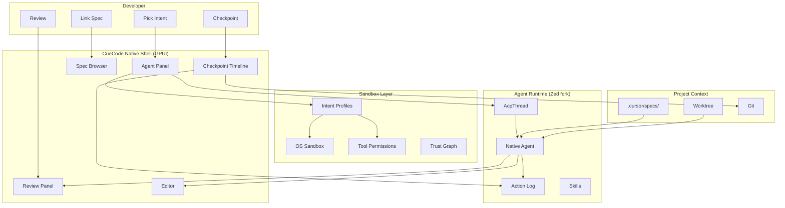

---

## Target user {#target-user}

Solo developers and small teams (2–10) who:

- Already use AI agents for coding but fight the tooling
- Want **local or BYOK models** without a vendor account wall
- Think in **tasks and specs**, not just files
- Need **safe agent execution** (sandboxed terminals, progressive trust)
- Value **native performance** (Rust/GPUI) over Electron flexibility

### Anti-target (v1) {#anti-target}

| Segment | Why not v1 |
|---------|------------|
| Large enterprise SSO shops | Identity/collab not ready |
| Non-coders | Editor-first shell assumes dev literacy |
| "Fully autonomous" seekers | Human-in-loop by design |
| Extension marketplace power users | Compat undecided |

### User maturity model {#user-maturity}

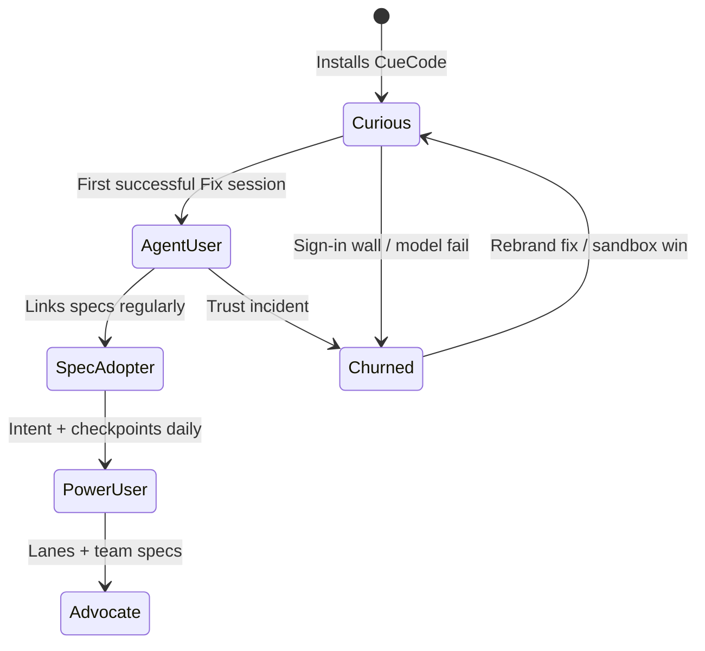

---

## User journeys {#user-journeys}

### Journey 1: Fix a bug (Maya) {#journey-fix-bug}

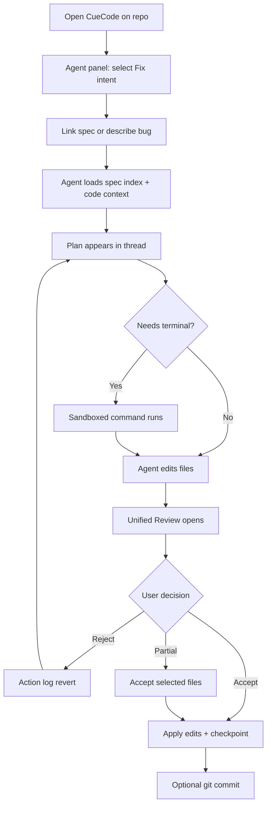

### Journey 2: Explore unfamiliar codebase (Maya) {#journey-explore}

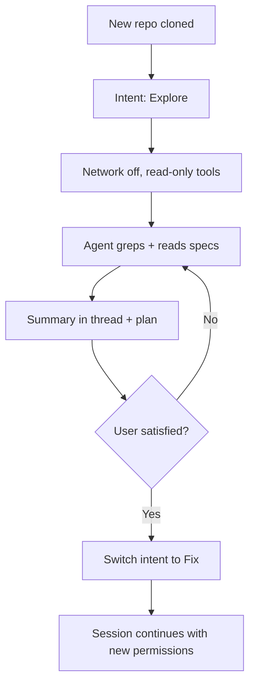

### Journey 3: Team review (Alex) {#journey-review}

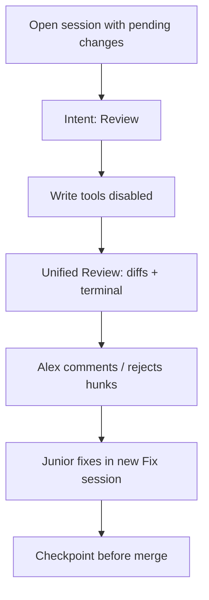

### Journey 4: First launch (Jordan) {#journey-first-launch}

See detailed flow in [03-fork-and-rebrand](./03-fork-and-rebrand#first-launch-story).

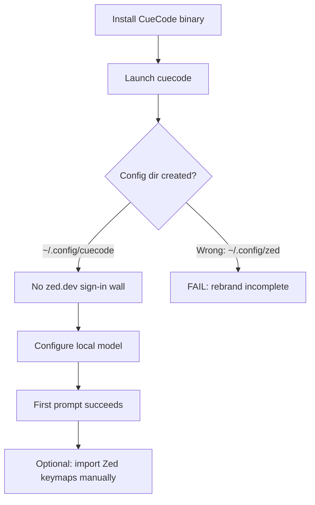

---

## UI/UX vision (high level) {#ui-vision}

Detailed spec: [09-ui-ux-spec](../design/09-ui-ux-spec). Wireframe — default layout:

```
┌─────────────────────────────────────────────────────────────────────────────┐
│ CueCode — my-project                                    [Intent▼] [Sandbox🔒]│
├──────────┬──────────────────────────────────────────────────────────────────┤
│          │  Agent Panel (primary)                                            │
│ Project  │  ┌─────────────────────────────────────────────────────────────┐  │
│ (narrow) │  │ [Explore ▼] [Spec: 04-sandbox ▼] [Model: ollama/... ▼]     │  │
│          │  ├─────────────────────────────────────────────────────────────┤  │
│          │  │ Thread list │ Conversation + Plan block                     │  │
│          │  │             │                                               │  │
│          │  │             │ > Fix auth token refresh...                   │  │
│          │  │             │ [Plan] 1. Read spec  2. Run tests  3. Patch    │  │
│          │  └─────────────────────────────────────────────────────────────┘  │
│          │  ┌─────────────────────── Review (when triggered) ───────────────┐  │
│          │  │ [Plan] [Diffs] [Terminal] [Spec]     Accept | Reject | ...  │  │
│          │  └─────────────────────────────────────────────────────────────┘  │
├──────────┴──────────────────────────────────────────────────────────────────┤
│ ▶ cargo test -p auth — exit 0                                                │
└─────────────────────────────────────────────────────────────────────────────┘
```

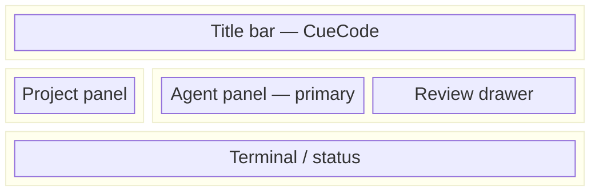

---

## Non-goals (v1) {#non-goals}

Explicit non-goals prevent scope creep. Each has **rationale** and **revisit trigger**.

| Non-goal | Rationale | Revisit when |
|----------|-----------|--------------|
| Replace entire Zed extension ecosystem | Compat matrix is huge; blocks alpha | [12-open-questions](../ops/12-open-questions) resolved |
| Zed Cloud collab, channels, billing | Different product identity; infra cost | Team demand + dedicated infra ([10-infrastructure](../ops/10-infrastructure)) |
| Web-based IDE | GPUI is native desktop moat | Unlikely v1 |
| Most LLM providers | Depth over breadth; maintain quality | Community contributions |
| Autonomous agents without human in loop | Safety + upstream policy alignment | Never for CueCode core |
| Mobile / tablet IDE | Desktop agent workflow focus | N/A v1 |
| Built-in CI/CD platform | Git + terminal sufficient | Partner integrations |
| Proprietary dual-license build | GPL compliance simplicity | Legal strategy separate |

### Non-goals vs innovations {#non-goals-innovations}

Some [05-innovations](./05-innovations) ideas are **deliberately deferred** —
not rejected:

| Innovation | v1 status |
|------------|-----------|
| Intent switcher | Phase 2 ([07-implementation-roadmap](../delivery/07-implementation-roadmap)) |
| Spec sync | Phase 1 |
| Multi-lane orchestration | Phase 3+ |
| Container sandbox | Phase 4+ ([10-infrastructure](../ops/10-infrastructure)) |

---

## Success looks like {#success}

### Success scenario with story beats {#success-story-beats}

**Beat 1 — Open:** Developer launches `cuecode`. Window title says CueCode.
Config writes to `~/.config/cuecode/`. No sign-in modal.

**Beat 2 — Intent:** User selects **Fix bug in auth module**. Sandbox badge shows
network off, write scope = worktree.

**Beat 3 — Context:** Agent loads `.cursor/specs/` index + `@spec`-linked doc.
First response references spec section — not generic advice.

**Beat 4 — Execute:** Sandboxed `cargo test` runs. Plan checkboxes update.
Terminal output captured in thread.

**Beat 5 — Review:** Unified review shows 2-file diff + terminal tab. User accepts
one file, rejects one.

**Beat 6 — Checkpoint:** Session checkpoint created. Optional git commit. User
continues same thread — no context loss.

**Beat 7 — Return:** Next day, user opens checkpoint timeline, previews yesterday's
state, continues from beat 6.

### Success metrics (summary) {#success-metrics}

Full detail: [11-metrics-and-success](../ops/11-metrics-and-success).

| Metric | Target signal |
|--------|---------------|
| Time to first successful agent turn | < 5 min from install |
| Session completion rate | User reaches Review + Accept |
| Checkpoint usage | > 30% of Fix sessions |
| Trust incidents | Near zero destructive commands outside sandbox |
| Spec reference rate | Agent cites linked spec in > 50% of spec-linked sessions |
| Churn after week 1 | Lower than baseline Zed Agent onboarding drop |

### Success state diagram {#success-state}

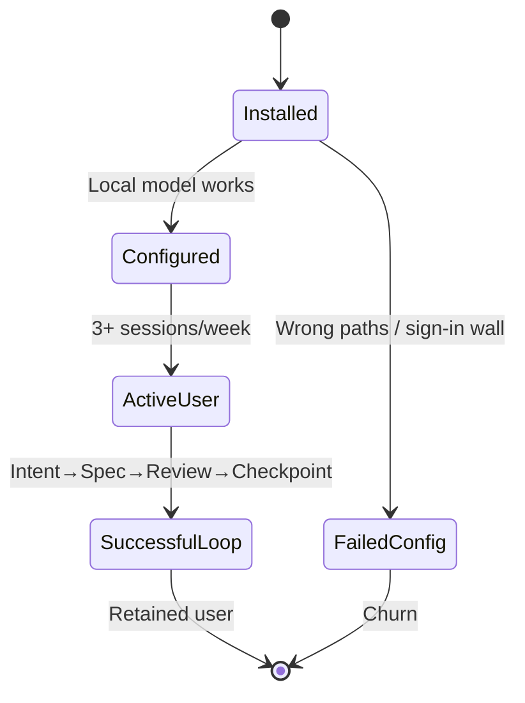

---

## Relationship to Zed {#relationship-to-zed}

CueCode is a **fork**, not a thin skin. We inherit the engine; we change product
identity and agent-first workflow.

### What we inherit {#inherit-zed}

| Layer | Crates | Keep? |
|-------|--------|-------|
| UI framework | `gpui`, platform crates | Yes — core moat |
| Editor | `editor`, `rope`, `multi_buffer` | Yes |
| LSP / languages | `project`, `language`, tree-sitter | Yes |
| Git / terminal | `git`, `git_ui`, `terminal` | Yes |
| Agent runtime | `agent`, `acp_thread`, `agent_ui` | Yes — extend |
| Sandboxing | `agent::sandboxing` | Yes — productize |
| Skills | `agent_skills` | Yes — extend |

See full map: [02-current-architecture](./02-current-architecture).

### What we replace or remove {#replace-zed}

| Area | Action | Spec |
|------|--------|------|
| Branding | CueCode name, icons, bundle IDs | [03-fork-and-rebrand](./03-fork-and-rebrand) |
| Cloud auth | Remove sign-in wall for core agent | [03-fork-and-rebrand](./03-fork-and-rebrand#decouple-cloud) |
| Default models | Local/BYOK, not zed.dev | [10-infrastructure](../ops/10-infrastructure) |
| Collab / channels | Hide v1 | [03-fork-and-rebrand](./03-fork-and-rebrand) |
| Telemetry | Off by default | [03-fork-and-rebrand](./03-fork-and-rebrand) |
| Product UX | Session-first, specs, review | [04-sandbox-core](./04-sandbox-core), [09-ui-ux-spec](../design/09-ui-ux-spec) |

### Fork relationship diagram {#fork-diagram}

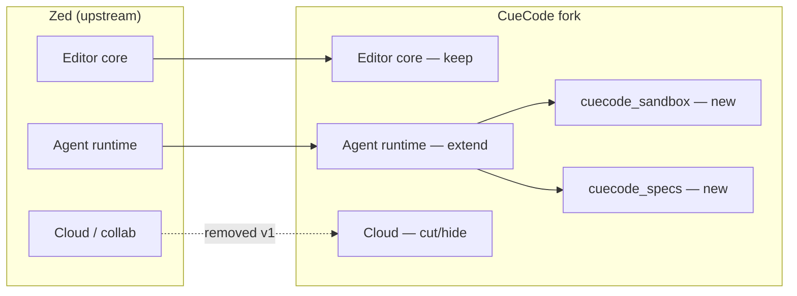

### License {#license}

GPL-3.0-or-later applies to distributed builds. Fork obligations:

- Provide source or written offer
- Preserve copyright notices
- Mark modified files

Detail: [03-fork-and-rebrand](./03-fork-and-rebrand#licensing).

---

## Strategic principles {#principles}

From [00-README](../00-README.md#principles) — expanded:

| Principle | Meaning | Violation example |
|-----------|---------|-------------------|
| **Session-first** | Thread + plan + checkpoint is the unit of work | Feature that only improves single-file edit |
| **Specs-first** | Load `.cursor/specs/` before guessing | Agent refactors without reading spec |
| **Local-first** | No required zed.dev account | Default model requires cloud login |
| **Trust grows** | Permissions expand with earned trust | Permanent YOLO mode as default |
| **Replayable** | Action log + checkpoints | Destructive ops not logged |

---

## Open questions (vision-level) {#open-questions}

Decisions deferred to [12-open-questions](../ops/12-open-questions):

| Question | Vision impact |
|----------|---------------|
| Extension compat mode | Distribution story |
| Container vs OS sandbox | Trust model depth |
| Async lane notifications | Power user workflow |
| CueCode cloud (if ever) | Identity model |

---

## Cross-reference index {#cross-links}

| Topic | Spec |
|-------|------|
| Architecture baseline | [02-current-architecture](./02-current-architecture) |
| Rebrand / fork | [03-fork-and-rebrand](./03-fork-and-rebrand) |
| Sandbox product | [04-sandbox-core](./04-sandbox-core) |
| Differentiators | [05-innovations](./05-innovations) |
| New crates | [06-system-design](./06-system-design) |
| Phases | [07-implementation-roadmap](../delivery/07-implementation-roadmap) |
| Tools + skills | [08-agent-tools-and-skills](../agent/08-agent-tools-and-skills) |
| UI detail | [09-ui-ux-spec](../design/09-ui-ux-spec) |
| Infra | [10-infrastructure](../ops/10-infrastructure) |
| Metrics | [11-metrics-and-success](../ops/11-metrics-and-success) |
| AI doctrine | [13-ai-maxxing](../agent/13-ai-maxxing) |
| Harness | [harness/local/01-agent-harness](../harness/local/01-agent-harness.md) |

---

## Acceptance criteria {#acceptance-criteria}

Top five vision scenarios — Given/When/Then for product validation.

### AC-VIS-1: Session-first loop {#ac-vis-1}

**Given** a developer with a linked spec and **Fix** intent (when shipped)  
**When** they complete a bugfix session through review  
**Then** they reach Accept/Reject on a unified review surface, create a checkpoint, and continue the same thread without re-explaining context

### AC-VIS-2: Specs-first context {#ac-vis-2}

**Given** `.cursor/specs/` exists in the repo and user links `@spec 04-sandbox-core#lifecycle`  
**When** the agent responds to an implementation question  
**Then** the first plan or answer cites the linked spec section — not generic advice disconnected from the spec corpus

### AC-VIS-3: Local-first onboarding {#ac-vis-3}

**Given** a fresh CueCode install with no zed.dev account  
**When** the user configures Ollama or a BYOK endpoint  
**Then** the first agent prompt succeeds within 5 minutes of install without authentication errors

### AC-VIS-4: Trust via sandbox {#ac-vis-4}

**Given** **Fix** intent with network off and write scope limited to worktree  
**When** the agent attempts a terminal command outside policy  
**Then** the command is blocked or requires explicit confirmation — no silent full-shell execution

### AC-VIS-5: Replayable undo {#ac-vis-5}

**Given** an agent session with multiple tool calls and file edits  
**When** the user opens the checkpoint timeline and rewinds to a prior checkpoint  
**Then** git state, action log snapshot, and plan entries reflect that point — user can continue from there

---

## UI copy deck {#ui-copy-deck}

North-star user-facing strings for CueCode vision surfaces. Final polish in [09-ui-ux-spec](../design/09-ui-ux-spec).

| Surface | String | Context |
|---------|--------|---------|
| Window title | `CueCode — {project}` | Primary chrome |
| Intent: Explore | `Explore` | Read-only, network off default |
| Intent: Fix | `Fix` | Write + bounded terminal |
| Intent: Ship | `Ship` | Full write + tests |
| Intent: Review | `Review` | Read-only tools |
| Sandbox badge | `Sandbox active` | OS isolation on |
| Sandbox off | `Sandbox off` | Degraded / Windows |
| Spec linker | `Link spec…` | Composer `@spec` picker |
| Spec linked | `Spec: {name}` | Header chip |
| Spec index empty | `No specs in .cursor/specs/` | Empty state |
| Review tab: Plan | `Plan` | Unified review |
| Review tab: Diffs | `Diffs` | Multi-file |
| Review tab: Terminal | `Terminal` | Captured output |
| Review tab: Spec | `Spec` | Spec diff (future) |
| Accept all | `Accept all` | Apply pending edits |
| Accept selected | `Accept selected` | Partial apply |
| Reject all | `Reject all` | Discard action_log |
| Checkpoint | `Create checkpoint` | Session rewind point |
| Checkpoint timeline | `Checkpoints` | Sidebar section |
| Checkpoint preview | `Preview at this point` | Timeline item |
| Rewind | `Rewind to here` | Destructive confirm follows |
| Rewind confirm | `Rewind session to this checkpoint? Pending changes will be lost.` | Modal |
| Empty agent | `Describe what you want to build or fix` | Composer placeholder |
| First launch | `Welcome to CueCode` | Onboarding title |
| Model setup | `Connect a model to start` | Onboarding body |
| Continue | `Continue` | Onboarding CTA |
| Trust incident toast | `Command blocked by sandbox policy` | Safety feedback |
| Session complete | `Ready for review` | Post-turn nudge |

---

## Analytics events catalog {#analytics-events}

Optional opt-in analytics aligned with [11-metrics-and-success](../ops/11-metrics-and-success). Default: **off**.

| Event | Properties | When fired |
|-------|------------|------------|
| `vision.install_complete` | `platform`, `install_source` | First launch after install |
| `vision.intent_selected` | `intent`, `workspace_id` | User changes intent switcher |
| `vision.spec_linked` | `spec_path`, `anchor?` | User links spec in composer |
| `vision.spec_cited` | `session_id`, `spec_path`, `turn_id` | Agent response references linked spec |
| `vision.review_opened` | `session_id`, `pending_files`, `pending_commands` | Unified review surface opens |
| `vision.review_accept` | `session_id`, `files_accepted`, `files_rejected` | User accepts (full or partial) |
| `vision.checkpoint_created` | `session_id`, `checkpoint_id`, `git_sha?` | Checkpoint saved |
| `vision.checkpoint_rewind` | `session_id`, `from_id`, `to_id` | User rewinds timeline |
| `vision.session_completed` | `session_id`, `intent`, `duration_min`, `checkpoint_used: bool` | Review + accept path finished |
| `vision.trust_blocked` | `session_id`, `tool_name`, `policy` | Sandbox/permission block |
| `vision.churn_signal` | `reason`, `session_count` | User abandons after error (optional) |
| `vision.lane_started` | `parent_session_id`, `lane_role` | Multi-agent lane (future) |

---

## Manual QA scripts {#manual-qa}

### QA-VIS-1: North-star happy path (Maya) {#qa-vis-1}

1. Fresh install CueCode; configure local model.
2. Open repo with `.cursor/specs/`.
3. Start agent; link a spec (or `@spec` when available).
4. Ask: `Fix the auth token refresh bug per the linked spec`.
5. **Expect:** Plan block references spec; sandboxed test run; review shows diffs.
6. Accept one file; create checkpoint.
7. Send follow-up in **same thread** — agent remembers prior plan.
8. **Pass:** Beats 1–6 of [#success-story-beats](#success-story-beats) satisfied.

### QA-VIS-2: Explore → Fix intent switch {#qa-vis-2}

1. Select **Explore** intent (or read-only mode when shipped).
2. Ask: `Map the agent stack crates`.
3. **Expect:** Read-only tools only; no file writes without confirm.
4. Switch to **Fix** intent.
5. Ask: `Add a doc comment to paths.rs explaining APP_NAME`.
6. **Expect:** Write tools enabled; edit appears in review.

### QA-VIS-3: Trust incident prevention {#qa-vis-3}

1. Enable strict sandbox / Fix intent.
2. Prompt agent to run a destructive command outside worktree.
3. **Expect:** Block or confirm — not silent success.
4. **Pass:** Aligns with Maya's pre-CueCode pain ([#pain-trust](#pain-trust)).

### QA-VIS-4: Team review path (Alex) {#qa-vis-4}

1. Open session with pending agent changes.
2. Switch to **Review** intent.
3. **Expect:** Write tools disabled; unified review readable.
4. Reject one hunk; note action in thread.
5. **Pass:** Journey 3 ([#journey-review](#journey-review)) without data loss.

### QA-VIS-5: Jordan first launch {#qa-vis-5}

1. Install alongside Zed; launch CueCode only.
2. **Expect:** `~/.config/cuecode/` created; no zed.dev sign-in.
3. First prompt succeeds.
4. **Pass:** Jordan adoption criteria table ([#persona-jordan](#persona-jordan)).

---

## Performance budgets {#performance-budgets}

User-perceived targets supporting the vision (native GPUI moat).

| Metric | Target | Rationale |
|--------|--------|-----------|
| Install → first successful agent turn | < 5 min | [#success-metrics](#success-metrics) |
| Intent switcher UI response | < 100 ms | Phase changes must feel instant |
| Spec index load at session start | < 500 ms | Specs-first cannot lag chat |
| Unified review open (10 files) | < 1.0 s | Review is core loop |
| Checkpoint create | < 2.0 s | Includes git snapshot |
| Checkpoint rewind preview | < 1.5 s | Trust in undo |
| Agent panel as primary layout | 60 fps scroll | Native vs Electron claim |
| Cold start (CueCode) | ≤ 3.0 s | Jordan parity with Zed |

---

## Security and privacy notes {#security-privacy}

| Data | Leaves machine? | Vision alignment |
|------|-------------------|------------------|
| Chat + tool results to LLM | Yes (user-chosen provider) | Local-first = user picks endpoint |
| `.cursor/specs/` in prompts | Yes, when linked | Specs-first — user controls repo |
| Terminal output | Yes, to model (bounded) | Sandbox limits blast radius |
| Checkpoint metadata | No (local/git) | Replayable |
| Team audit exports | User-initiated only | Alex persona — v1 manual |
| zed.dev identity | **Must not** be required | [#pain-identity](#pain-identity) |
| Telemetry | Off by default | Local-first principle |
| Collab/audio (Zed) | N/A v1 | Hidden — [#non-goals](#non-goals) |

**CueCode promise:** Code and commands leave the machine only through explicit model provider configuration — not through hidden Zed cloud defaults.

---

## Additional product micro-stories {#micro-stories}

### Micro-story: Dev — spec drift caught in review {#micro-story-dev}

Dev links `@spec 07-implementation-roadmap#phase-2` but the agent implements Phase 1 work.
In unified review, the **Plan** tab still lists Phase 2 tasks while diffs touch unrelated crates.
Dev rejects, re-links spec, and re-prompts — checkpoint before reject preserved the pre-edit
state. Vision pillar **Review** catches what chat-only UX missed.

### Micro-story: Morgan — lane handoff {#micro-story-morgan}

Morgan runs **Explore** lane (read-only) to map `acp_thread` while a **Fix** lane patches
`agent_ui`. Conflict on one file triggers review merge UI (future). Morgan's team accepts
partial lanes because session objects — not chat scrollback — hold each lane's plan and
checkpoint. Vision pillar **Lanes** matches how humans parallelize.

---

## Appendix: grep commands {#grep-appendix}

Verify vision-aligned implementation progress:

```bash
# Spec corpus present
ls -la .cursor/specs/
rg -n "session-first|specs-first|local-first" .cursor/specs/00-README.md

# Intent / sandbox (when implemented)
rg -n "Intent|intent_profile" crates/ --glob '!target/**'
rg -n "cuecode_sandbox|cuecode_specs" crates/

# Review surface
rg -n "unified.review|ReviewPanel" crates/agent_ui/

# Checkpoint hooks
rg -n "checkpoint" crates/acp_thread/src/acp_thread.rs

# Rebrand / local-first blockers
rg -n "zed\.dev|Sign in to Zed" --glob '!target/**'
rg -n 'APP_NAME.*CueCode' crates/paths/src/paths.rs

# Success metric instrumentation (future)
rg -n "telemetry|analytics" crates/telemetry/
```

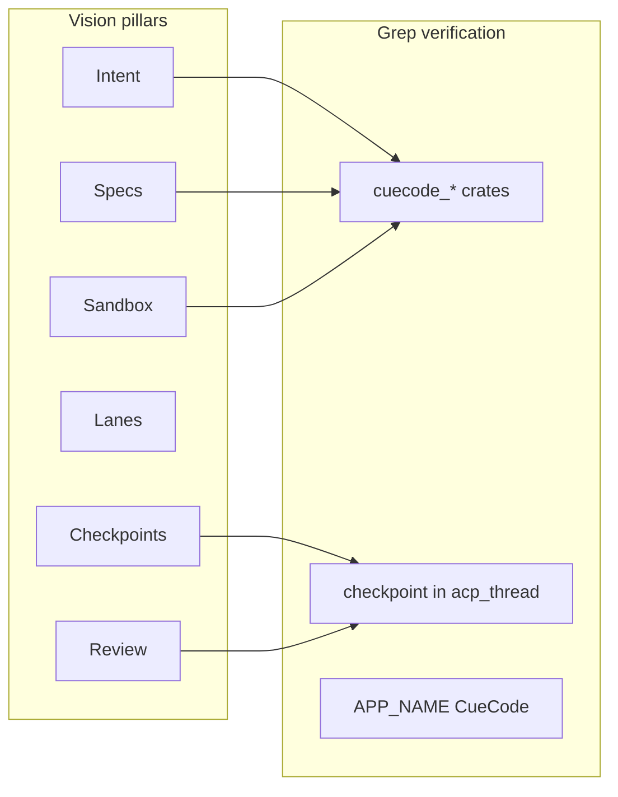

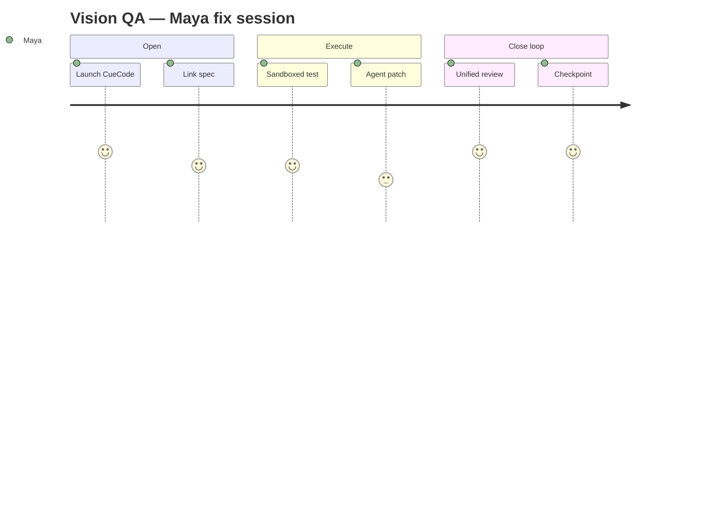

---

## Acceptance criteria supplement {#acceptance-criteria-supplement}

Additional Given/When/Then for competitive and retention scenarios.

### AC-VIS-6: Native performance parity {#ac-vis-6}

**Given** the same repo open in Cursor (Electron) and CueCode (GPUI) on comparable hardware  
**When** the user scrolls a 5k-line file and opens the agent panel  
**Then** CueCode maintains smooth scrolling (no sustained frame drops) while the agent panel is visible — validating the native-shell thesis ([#competitive-matrix](#competitive-matrix))

### AC-VIS-7: Checkpoint return next day {#ac-vis-7}

**Given** a completed Fix session with checkpoint at beat 6 ([#success-story-beats](#success-story-beats))  
**When** the user reopens CueCode the next day and selects that checkpoint in the timeline  
**Then** thread transcript, plan state, and git snapshot match the checkpoint — user continues without re-pasting context

### AC-VIS-8: Non-goal guardrail {#ac-vis-8}

**Given** a feature request for fully autonomous unsupervised agents  
**When** product evaluates against [#non-goals](#non-goals)  
**Then** the request is deferred or rejected with documented rationale — human-in-loop remains default

---

## Manual QA supplement {#manual-qa-supplement}

### QA-VIS-6: Competitive smoke {#qa-vis-6}

1. Time cold start: CueCode vs baseline Zed fork (stopwatch).
2. Open identical monorepo; run agent grep across `crates/agent`.
3. **Expect:** CueCode total wall time ≤ Zed agent + 10% (rebrand overhead only).
4. Document result in PR if regression > 200 ms.

### QA-VIS-7: Spec reference rate {#qa-vis-7}

1. Run 10 spec-linked sessions with mixed intents.
2. Manually score: did first substantive agent reply cite linked spec?
3. **Pass:** ≥ 50% cite rate per [#success-metrics](#success-metrics).

### QA-VIS-8: Principles regression {#qa-vis-8}

1. For each shipped agent feature, confirm it advances at least one row in [#principles](#principles).
2. **Fail** if feature improves only single-buffer typing with no session/spec/sandbox/replay angle.
3. Record pass/fail in PR template under "Vision alignment".

---

## Document status {#status}

| Field | Value |
|-------|-------|
| Status | Draft — expanded |
| Last expanded | 2026-06-17 |
| Owner | CueCode product |
| Implements | North star for all phases |
