# Current Architecture (Zed Fork Baseline) {#current-architecture}

This document maps what **already exists** in the CueCode codebase (a Zed fork)
before and alongside CueCode-specific changes. Use it to avoid rebuilding what
works and to know **exactly where to touch** for each CueCode feature.

**Related specs:**

- Vision: [01-vision](./01-vision)
- Rebrand: [03-fork-and-rebrand](./03-fork-and-rebrand)
- Sandbox product: [04-sandbox-core](./04-sandbox-core)
- System design (new crates): [06-system-design](./06-system-design)
- Agent tools: [08-agent-tools-and-skills](../agent/08-agent-tools-and-skills)
- Inference map: `.cursor/skills/agent-inference/SKILL.md`

---

## Repository scale {#scale}

| Metric | Value | Notes |
|--------|-------|-------|
| Rust crates | ~235 | Workspace members in root `Cargo.toml` |
| Default binary crate | `crates/zed` | `cargo run` from repo root |
| Binary name (today) | `zed` | CueCode target: `cuecode` ([03-fork-and-rebrand](./03-fork-and-rebrand)) |
| UI framework | **GPUI** | `crates/gpui` + platform crates |
| Rust toolchain | 1.95.0 (pinned) | `rust-toolchain.toml` |
| License | GPL-3.0-or-later | Fork obligations in [03-fork-and-rebrand](./03-fork-and-rebrand#licensing) |
| Primary language | Rust | Tree-sitter grammars, some TS in extensions |

### Scale implications for CueCode {#scale-implications}

- **Do not rewrite** GPUI, editor buffer, LSP pipeline — see [#do-not-rewrite](#do-not-rewrite).
- **Extend** `agent_ui`, `agent`, `acp_thread` — agent stack is the main lever.
- **Add** small focused crates (`cuecode_specs`, `cuecode_sandbox`) per [06-system-design](./06-system-design).
- **Hide/cut** cloud crates from default UX without deleting immediately — reduces merge pain with upstream.

---

## Layer diagram {#layers}

```
┌─────────────────────────────────────────────────────────┐
│  App shell — crates/zed, crates/cli                       │
│  Startup, menus, reliability, window management         │
├─────────────────────────────────────────────────────────┤
│  Workspace UI — workspace, panel, title_bar, sidebar    │
│  Dockable panels, multi-workspace                       │
├─────────────────────────────────────────────────────────┤
│  Agent UX — agent_ui                                    │
│  AgentPanel, ConversationView, diff review, onboarding  │
├─────────────────────────────────────────────────────────┤
│  Agent runtime — agent, acp_thread, agent_servers       │
│  Native agent, ACP external agents, tools, threads      │
├─────────────────────────────────────────────────────────┤
│  Models — language_model*, prompt_store                 │
│  Provider registry, settings, compaction prompts        │
├─────────────────────────────────────────────────────────┤
│  Editor core — editor, rope, multi_buffer, language   │
│  LSP, tree-sitter grammars, project, fs, git          │
├─────────────────────────────────────────────────────────┤
│  Extensions — extension, extension_host, extension_api  │
├─────────────────────────────────────────────────────────┤
│  Zed cloud (remove/replace for CueCode) — client, collab│
│  Auth, API, LiveKit, telemetry, auto_update             │
└─────────────────────────────────────────────────────────┘
```

### Layer diagram (mermaid) {#layers-mermaid}

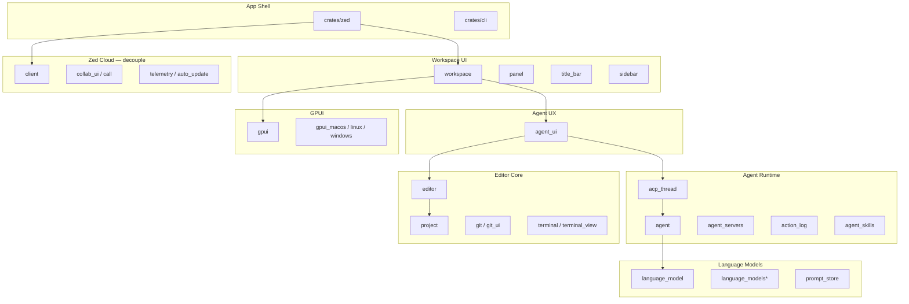

---

## Product story: architecture-aware personas {#product-story}

### Persona: Maya — "where does my fix live in the stack?" {#persona-maya-arch}

Maya reports an auth bug. She does not care about crate names — but **we** do when
implementing CueCode features.

| User action | Architectural path |
|-------------|-------------------|
| Open agent panel | `agent_ui::AgentPanel` |
| Select Fix intent (future) | `cuecode_sandbox` → `agent_settings` |
| Agent runs test | `agent::terminal_tool` → `agent::sandboxing` |
| See diff | `agent_ui` + `agent_diff` / multi_buffer |
| Accept edit | `action_log` → `editor` buffer apply |

### Persona: Alex — "what can I audit?" {#persona-alex-arch}

Alex asks: "What did the agent touch?" Existing infrastructure:

| Audit source | Crate |
|--------------|-------|
| File edits | `action_log` |
| Tool calls | `acp_thread` session updates |
| Terminal output | `AcpThread.terminals` |
| Git state | `git` crate + checkpoint hooks in `AcpThread` |

CueCode adds checkpoint fusion ([04-sandbox-core](./04-sandbox-core#lifecycle)).

### Persona: DevRel engineer — "what do we fork vs build?" {#persona-devrel}

Use [#cuecode-touch-map](#cuecode-touch-map) when scoping PRs.

---

## Agent stack (critical for CueCode) {#agent-stack}

The agent stack is the **highest-value existing asset** in the fork. CueCode's
differentiation layers on top — it does not replace this stack.

### Agent stack overview diagram {#agent-stack-diagram}

```
User input (composer)
       │
       ▼
┌──────────────┐     ┌─────────────────┐
│  agent_ui    │────▶│  ThreadStore    │
│  AgentPanel  │     │  Draft threads  │
└──────┬───────┘     └────────┬────────┘
       │                      │
       ▼                      ▼
┌──────────────┐     ┌─────────────────┐
│ Conversation │◀───▶│  AcpThread      │
│ View         │     │  plan, tools    │
└──────────────┘     └────────┬────────┘
                              │
              ┌───────────────┼───────────────┐
              ▼               ▼               ▼
     ┌────────────┐  ┌────────────┐  ┌──────────────┐
     │ Native     │  │ ACP        │  │ Custom       │
     │ Agent      │  │ externals  │  │ agents       │
     │ agent/     │  │ agent_     │  │ agent_       │
     │            │  │ servers    │  │ servers      │
     └─────┬──────┘  └────────────┘  └──────────────┘
           │
           ▼
     ┌─────────────────────────────────┐
     │ Tools: read, edit, grep, terminal │
     │ skill, MCP via context_server   │
     └─────────────────────────────────┘
```

### Entry and initialization {#agent-entry}

| File | Role |
|------|------|
| `crates/cuecode/src/main.rs` | Boots app, wires agent via `agent_ui::init` |
| `crates/agent_ui/src/agent_ui.rs` | `ThreadStore`, skills hook, language models, panel init |
| `crates/agent_ui/src/agent_panel.rs` | Main panel: threads, terminals, serialization |
| `crates/agent_ui/src/conversation_view.rs` | Single thread UI, composer, streaming |

**CueCode touch:** Intent switcher + spec linker in `agent_panel` header
([09-ui-ux-spec](../design/09-ui-ux-spec#surfaces)).

### Thread and protocol {#agent-thread}

| File | Type | Role |
|------|------|------|
| `crates/acp_thread/src/acp_thread.rs` | `AcpThread` | Session lifecycle, plan, tools, streaming, terminals, git checkpoints, compaction |
| `crates/acp_thread/src/connection.rs` | `AgentConnection` trait | `new_session`, `load_session`, `prompt`, ACP bridge |

**Data held in AcpThread (conceptual):**

| Field / concept | Purpose |
|-----------------|---------|
| Plan entries | ACP plan UI, future spec sync |
| Tool call history | Audit, replay |
| Terminals | Sandboxed command output |
| Compaction state | Long session management |
| Checkpoint hooks | Git-aware rewind |

### Agent prompt flow — sequence diagram {#agent-prompt-sequence}

End-to-end path when user sends a message in the agent composer:

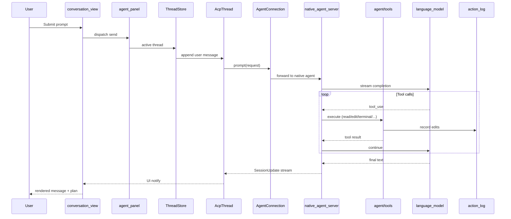

**CueCode additions to this flow (planned):**

1. **Pre-prompt:** inject spec index from `cuecode_specs` ([06-system-design](./06-system-design)).
2. **Pre-tool:** check intent profile + trust graph ([04-sandbox-core](./04-sandbox-core#intent-profiles)).
3. **Post-turn:** open unified review if pending edits ([09-ui-ux-spec](../design/09-ui-ux-spec)).

### Agent implementations {#agent-implementations}

| Path | Role |
|------|------|
| `crates/agent/src/native_agent_server.rs` | Built-in Zed/CueCode native agent |
| `crates/agent_servers/src/acp.rs` | External ACP agents (Cursor CLI, etc.) |
| `crates/agent_servers/src/custom.rs` | User-defined agent server configs |

**CueCode default:** Native agent + local provider; ACP optional for power users
([10-infrastructure](../ops/10-infrastructure)).

### Tools (native agent) {#agent-tools}

Located in `crates/agent/src/tools/`:

| Category | Tools | Sandbox-aware? |
|----------|-------|----------------|
| File | `read_file`, `edit_file`, `grep`, `rename`, `move_path`, `copy_path` | Edit paths scoped by permissions |
| Terminal | `terminal_tool` | Yes when sandbox flag on |
| Context | `fetch`, `web_search`, `diagnostics`, `skill` | Network policy per intent |
| Meta | `create_thread`, `list_agents_and_models` | — |
| MCP | via `context_server` registry | Server-specific |

Full permission model: [08-agent-tools-and-skills](../agent/08-agent-tools-and-skills).

### Skills {#agent-skills}

| Location | Path |
|----------|------|
| Crate | `crates/agent_skills` |
| Global skills | `~/.agents/skills/` |
| Project skills | `<worktree>/.cursor/skills/` |
| CueCode shipped skills | `.cursor/skills/**/SKILL.md` |

Surfaced via `skill` tool and slash commands. Specs (`.cursor/specs/`) are
**separate** from skills — see [06-system-design](./06-system-design#new-crates).

### Action log and undo {#action-log}

| Component | Role |
|-----------|------|
| `crates/action_log` | Tracks agent edits per buffer |
| Agent UI reject/undo | Reverts pending agent changes |
| `AcpThread` git hooks | Checkpoint updates on accept |

**CueCode extension:** checkpoint stack snapshots action_log + plan
([05-innovations](./05-innovations)).

### Sandboxing {#sandboxing}

| File | Role |
|------|------|
| `crates/agent/src/sandboxing.rs` | Seatbelt (macOS) / Bubblewrap (Linux) |
| Feature flag | `SandboxingFeatureFlag` |
| Policy | Network allowlists, FS write scopes per command |

**CueCode productization:** Map intent → sandbox strictness ([04-sandbox-core](./04-sandbox-core#intent-profiles)).

### Settings defaults {#agent-settings}

**File:** `assets/settings/default.json` — `"agent"` section:

| Setting | Current (Zed) | CueCode target |
|---------|---------------|----------------|
| `default_model` | `zed.dev` / `claude-sonnet-4` | Ollama / OpenAI-compatible |
| `dock` | user preference | keep |
| `tool_permissions` | global rules | intent-aware override |
| `auto_compact` | on | keep |
| `single_file_review` | optional | extend to unified review |

---

## Data flow — editor ↔ agent ↔ project {#data-flow}

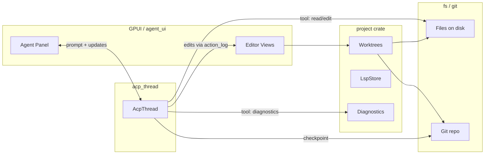

### Unhappy paths in current architecture {#unhappy-paths}

| Scenario | Current behavior | CueCode mitigation |
|----------|------------------|-------------------|
| Model provider down | Error in thread | Local-first default ([03-fork-and-rebrand](./03-fork-and-rebrand)) |
| Tool permission denied | User sees confirm/deny | Intent profiles reduce noise ([04-sandbox-core](./04-sandbox-core)) |
| Sandbox unsupported (Windows) | Degraded terminal trust | Document + strict confirms ([10-infrastructure](../ops/10-infrastructure)) |
| Huge context | Auto-compaction | Spec index summarizes ([06-system-design](./06-system-design)) |
| zed.dev login required | Onboarding wall | Remove for CueCode ([03-fork-and-rebrand](./03-fork-and-rebrand)) |

---

## Editor and project (keep) {#editor-project}

These crates are **stable foundation**. CueCode changes should not fork them without
extreme justification.

| Crate | Role | CueCode touch |
|-------|------|---------------|
| `editor` | Text buffer, edits, vim, multi-cursor | Review UI only |
| `project` | Worktrees, LSP store, diagnostics | Spec file watching (via new crate) |
| `workspace` | Panels, panes, serialization | Layout presets ([09-ui-ux-spec](../design/09-ui-ux-spec)) |
| `terminal` / `terminal_view` | Integrated terminal | Sandbox badge, log capture |
| `git` / `git_ui` | Git integration | Checkpoint UI |
| `multi_buffer` | Multi-file diff views | Unified review diffs |
| `rope` / `sum_tree` | Buffer model | None |
| `language` | Language registry | None |

### Editor ↔ agent integration points {#editor-agent-integration}

```
agent edit_file tool
        │
        ▼
   action_log (pending)
        │
        ▼
 multi_buffer / agent diff UI
        │
        ├── Accept → apply to editor buffer → git
        └── Reject → discard action_log entry
```

---

## Workspace and panel model {#workspace-panels}

| Crate | Responsibility |
|-------|----------------|
| `workspace` | Dock layout, pane groups, focus |
| `panel` | Panel trait, sizing |
| `title_bar` | Window chrome, menus |
| `project_panel` | File tree |
| `agent_ui` | Agent panel registration |

**CueCode UI additions (planned):**

- Spec browser panel
- Review panel (modal or docked)
- Checkpoint timeline in agent sidebar

See [09-ui-ux-spec](../design/09-ui-ux-spec).

### ASCII: workspace layout (current Zed) {#ascii-workspace}

```
┌────────────────────────────────────────────────────────────┐
│ Title bar — menus, workspace switcher                       │
├────────┬───────────────────────────────────┬───────────────┤
│ Project│ Editor pane(s)                    │ Agent panel   │
│ panel  │                                   │ (dockable)    │
│        │                                   │               │
├────────┴───────────────────────────────────┴───────────────┤
│ Terminal drawer / bottom panel                              │
└────────────────────────────────────────────────────────────┘
```

---

## Language models layer {#language-models}

| Crate pattern | Role |
|---------------|------|
| `language_model` | Core trait, registry |
| `language_models` | Provider aggregation |
| `language_models_cloud` | zed.dev proxy — **decouple for CueCode** |
| `prompt_store` | System prompts, compaction templates |

### Model provider flow {#model-provider-flow}

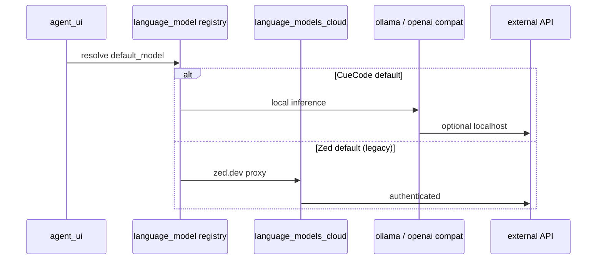

**CueCode:** Change defaults in `assets/settings/default.json`; hide cloud provider
UI if not configured ([03-fork-and-rebrand](./03-fork-and-rebrand#decouple-cloud)).

---

## Paths and branding hooks {#paths}

| File | Constant / logic | Current | CueCode |
|------|------------------|---------|---------|
| `crates/paths/src/paths.rs` | `APP_NAME` | `"Zed"` | `"CueCode"` |
| same | `APP_NAME_LOWERCASE` | `zed` | `cuecode` |
| `crates/cuecode/src/main.rs` | compile-time assert | bin name == lowercase APP_NAME | `cuecode` |
| `crates/release_channel/src/lib.rs` | `display_name()`, `app_id()` | Zed IDs | CueCode IDs |

### Path resolution table {#paths-table}

| OS | Config dir (after rebrand) | Data dir |
|----|---------------------------|----------|
| macOS | `~/Library/Application Support/CueCode` | same tree |
| Linux | `$XDG_CONFIG_HOME/cuecode` | `$XDG_DATA_HOME/cuecode` |
| Windows | `%APPDATA%\CueCode` | `%LOCALAPPDATA%\CueCode` |

**Critical:** Forks must change `APP_NAME` or collide with Zed user data
([03-fork-and-rebrand](./03-fork-and-rebrand#phase-0-checklist)).

---

## External services today (decouple) {#external-services}

| Service | Crates | Default behavior | CueCode v1 |
|---------|--------|------------------|------------|
| zed.dev auth/API | `client`, `cloud_api_*` | Sign-in, account URLs | Remove/hide wall |
| Collab / channels | `collab_ui`, `call`, `livekit_client` | Multiplayer, calls | Hide menus |
| Telemetry | `telemetry`, `crashes` | Usage, Sentry | Off by default |
| Auto-update | `auto_update*` | Poll zed.dev | Disabled / CueCode server later |
| zed.dev LLM proxy | `language_models_cloud` | Default models | Not default |

### Decouple strategy diagram {#decouple-diagram}

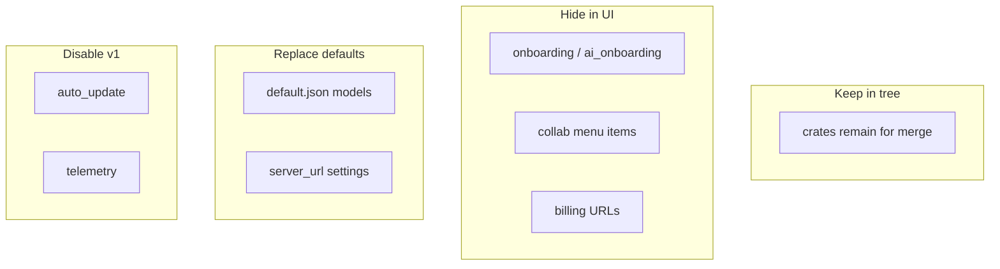

Detail: [03-fork-and-rebrand](./03-fork-and-rebrand#decouple-cloud).

---

## Extensions {#extensions}

| Crate | Role |
|-------|------|
| `extension` | Extension manifest, WASM host |
| `extension_host` | Load and run extensions |
| `extension_api` | API surface for extension authors |

**CueCode status:** Undecided — see [12-open-questions](../ops/12-open-questions).
Initial approach: compat mode, no marketplace requirement v1.

---

## GPUI and platform {#gpui}

| Crate | Platform |
|-------|----------|
| `gpui` | Core UI framework |
| `gpui_macos` | Metal shaders — **Xcode required** |
| `gpui_linux` | Wayland/X11 |
| `gpui_windows` | Windows |

**Build note:** macOS dev requires Xcode for Metal shader compilation in `gpui_macos`.

UI patterns: `.cursor/skills/ui-ux-gpui/SKILL.md`.

---

## Crate dependency diagram (agent-focused) {#crate-dependency-diagram}

Simplified dependency graph for agent-related crates:

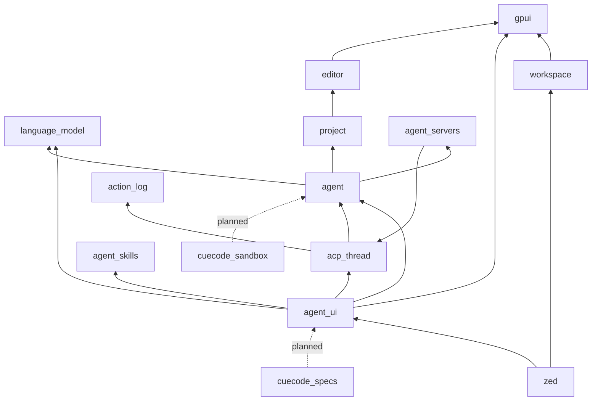

New crates from [06-system-design](./06-system-design) shown dashed.

---

## What to touch for CueCode — mapping table {#cuecode-touch-map}

Master mapping: feature → crates/files → spec → phase.

| CueCode feature | Primary crates / files | Spec | Phase |
|-----------------|------------------------|------|-------|
| APP_NAME / paths | `paths/src/paths.rs` | [03](./03-fork-and-rebrand) | 0 |
| Binary rename | `zed/Cargo.toml`, `main.rs` | [03](./03-fork-and-rebrand) | 0 |
| Display name / bundle ID | `release_channel/src/lib.rs` | [03](./03-fork-and-rebrand) | 0 |
| Hide sign-in | `onboarding`, `ai_onboarding`, `title_bar` | [03](./03-fork-and-rebrand) | 0 |
| Local default model | `assets/settings/default.json` | [03](./03-fork-and-rebrand), [10](../ops/10-infrastructure) | 0 |
| Spec index | **new** `cuecode_specs` | [06](./06-system-design), [04](./04-sandbox-core#spec-integration) | 1 |
| `@spec` composer | `agent_ui` composer | [04](./04-sandbox-core) | 1 |
| Intent switcher | `cuecode_sandbox`, `agent_ui` header | [04](./04-sandbox-core#intent-profiles) | 2 |
| Intent → permissions | `agent_settings`, `agent` | [08](../agent/08-agent-tools-and-skills) | 2 |
| Unified review | `agent_ui`, `multi_buffer` | [09](../design/09-ui-ux-spec) | 3 |
| Checkpoints | `cuecode_sandbox`, `acp_thread` | [04](./04-sandbox-core#lifecycle) | 3 |
| Lanes / harness | `agent`, `acp_thread`, `agent_ui` | [local harness](../harness/local/01-agent-harness.md) | 4+ |
| Telemetry off | `telemetry`, settings | [03](./03-fork-and-rebrand) | 0 |
| URL scheme | `client`, link parsers | [03](./03-fork-and-rebrand#url-schemes) | 2+ |

### What NOT to touch (initially) {#touch-not}

| Area | Reason |
|------|--------|
| `rope`, `sum_tree` | Buffer correctness |
| `gpui` rendering | Massive blast radius |
| Tree-sitter grammars | Unless adding languages |
| LSP protocol | Stable |
| Full cloud crate deletion | Upstream merge conflicts |

---

## Build and dev {#build-dev}

| Task | Command / note |
|------|----------------|
| Run app | `cargo run` from repo root |
| Lint | `./script/clippy` (not bare `cargo clippy`) |
| macOS | Xcode + Metal toolchain |
| Collab local dev | `script/bootstrap`, `foreman start`, `script/zed-local` (optional) |
| Tests | `cargo test -p <crate>`; GPUI tests per `.cursor/skills/gpui-test/SKILL.md` |

### Dev workflow ASCII {#dev-workflow}

```
clone fork
    │
    ▼
rustup (toolchain pin)
    │
    ▼
cargo run  ──▶  Zed window (CueCode after Phase 0)
    │
    ▼
./script/clippy  ──▶  pre-PR lint
```

---

## User journey: developer implements spec feature {#journey-implement-feature}

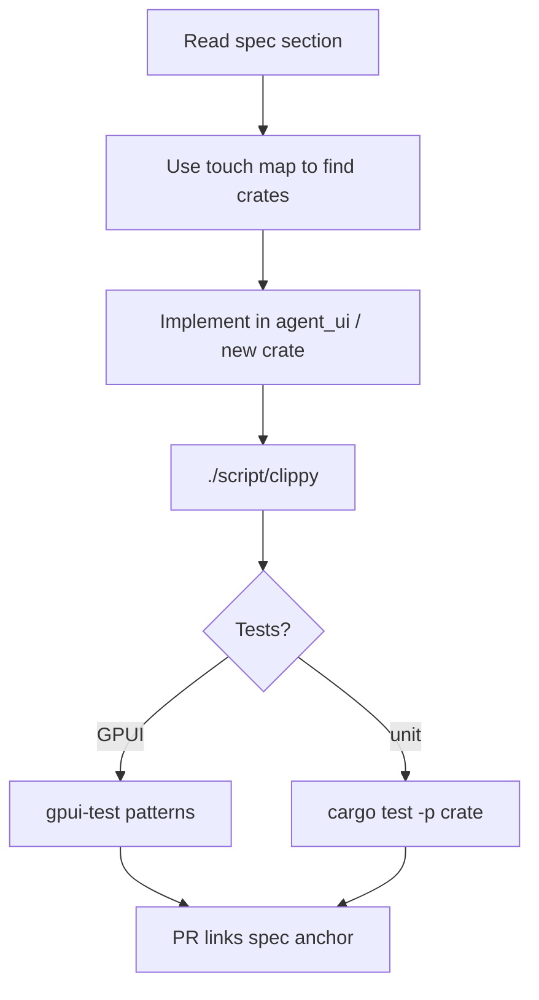

---

## What CueCode should not rewrite {#do-not-rewrite}

| Subsystem | Why keep |
|-----------|----------|
| GPUI rendering pipeline | Performance moat, huge effort |
| LSP / language server integration | Mature, user expectation |
| Tree-sitter / syntax highlighting | Extension of editor core |
| Core editor buffer model (`rope`, `sum_tree`) | Correctness-critical |
| Extension host (v1) | User compat may matter |

**Add vs modify** guidance: [06-system-design](./06-system-design).

---

## Comparison: Zed baseline vs CueCode target architecture {#baseline-vs-target}

| Layer | Zed baseline | CueCode target |
|-------|--------------|----------------|
| Shell | Zed branding | CueCode branding |
| Agent UX | Panel + chat | + intent, spec, review, checkpoints |
| Sandbox | Flag-gated | Intent-productized |
| Specs | Not indexed | `cuecode_specs` crate |
| Models | zed.dev default | Local/BYOK |
| Cloud | Integrated | Hidden/cut v1 |
| Session model | Thread | Thread + checkpoint stack |

---

## Verification checklist (architecture understanding) {#verification-arch}

Use this before opening a PR:

- [ ] Identified correct layer (UI vs runtime vs editor)
- [ ] Confirmed feature does not rewrite [#do-not-rewrite](#do-not-rewrite)
- [ ] Listed crates touched matches [#cuecode-touch-map](#cuecode-touch-map)
- [ ] Agent flow traced through `AcpThread` if agent-related
- [ ] Paths/branding not broken (`APP_NAME` consistency)
- [ ] Linked spec section in PR description
- [ ] `./script/clippy` passes

---

## Cross-reference index {#cross-links}

| Topic | Spec |
|-------|------|
| Vision | [01-vision](./01-vision) |
| Rebrand | [03-fork-and-rebrand](./03-fork-and-rebrand) |
| Sandbox | [04-sandbox-core](./04-sandbox-core) |
| Innovations | [05-innovations](./05-innovations) |
| System design | [06-system-design](./06-system-design) |
| Roadmap | [07-implementation-roadmap](../delivery/07-implementation-roadmap) |
| Tools | [08-agent-tools-and-skills](../agent/08-agent-tools-and-skills) |
| UI | [09-ui-ux-spec](../design/09-ui-ux-spec) |
| Infra | [10-infrastructure](../ops/10-infrastructure) |
| Harness | [harness/local/01-agent-harness](../harness/local/01-agent-harness.md) |

---

## Acceptance criteria {#acceptance-criteria}

Top five architecture scenarios — Given/When/Then for QA and implementation sign-off.

### AC-ARCH-1: Agent prompt round-trip {#ac-arch-1}

**Given** a workspace with a local model configured and an active `AcpThread`  
**When** the user submits a prompt from `conversation_view`  
**Then** the message appears as a `UserMessage` entry, `running_turn` is set, the native agent streams `SessionUpdate::AgentMessageChunk`, and the UI re-renders without blocking the editor thread

### AC-ARCH-2: Tool call audit trail {#ac-arch-2}

**Given** the native agent invokes `grep` or `read_file`  
**When** the tool completes  
**Then** a `ToolCall` entry is appended with `raw_input`, `raw_output`, `status`, and file edits (if any) are recorded in `action_log` before accept/reject UI

### AC-ARCH-3: Sandboxed terminal {#ac-arch-3}

**Given** `SandboxingFeatureFlag` enabled on macOS or Linux  
**When** the agent runs `terminal_tool` with a bounded `timeout_ms`  
**Then** output is captured in `AcpThread.terminals`, combined stdout/stderr is returned to the model (≤16 KiB default cap), and `sandbox_not_applied` is set only when fallback is authorized

### AC-ARCH-4: Thread persistence {#ac-arch-4}

**Given** a thread with at least one completed turn  
**When** the app restarts and `ThreadStore::reload` completes  
**Then** the thread appears in the sidebar with correct `title`, `folder_paths`, and `updated_at`; loading the session reconstructs `entries` via `AgentConnection::load_session`

### AC-ARCH-5: Path isolation (CueCode rebrand) {#ac-arch-5}

**Given** `APP_NAME = "CueCode"` in `paths.rs`  
**When** the app writes settings or thread DB  
**Then** files land under `cuecode` config/data paths only — never under `~/.config/zed/` during a CueCode session

---

## UI copy deck (architecture surfaces) {#ui-copy-deck}

Exact strings for agent/runtime surfaces mapped in this doc. CueCode may rebrand labels; semantics stay.

| Surface | String | Context |
|---------|--------|---------|
| Tool pending | `Allow` / `Deny` | Tool authorization prompt (`ToolAuthorizationRequested`) |
| Tool denied | `Tool call denied` | User rejected permission |
| Compaction | `Summarizing conversation…` | `ContextCompactionStatus::InProgress` |
| Compaction done | `Conversation summarized` | Compaction completed |
| Checkpoint | `Create checkpoint` | Git checkpoint action in thread |
| Checkpoint label | `User (checkpoint)` | Markdown export when checkpoint shown |
| Stop | `Stop` | Cancel `running_turn` |
| Error | `Something went wrong` | `AcpThreadEvent::Error` generic |
| Load fail | `Failed to load thread` | `AcpThreadEvent::LoadError` |
| Retry | `Retrying…` | `AcpThreadEvent::Retry` |
| Token usage | `{input} in / {output} out` | Footer when `token_usage` present |
| Empty thread | `Ask anything about your project` | Composer placeholder (agent panel) |
| Draft restore | (silent) | `draft_prompt` restored on reload |
| Sandbox badge | `Sandbox active` | When OS sandbox applied to terminal |
| Sandbox fallback | `Running without sandbox` | When `sandbox_not_applied` set |
| Model error | `Model request failed: {detail}` | Provider/network failure in thread |
| Subagent | `Subagent started` | `AcpThreadEvent::SubagentSpawned` toast |

---

## Analytics events catalog {#analytics-events}

CueCode v1 targets **telemetry off by default** ([03-fork-and-rebrand](./03-fork-and-rebrand#decouple-telemetry)). This catalog defines events for optional local metrics or future opt-in analytics. Names are stable for dashboards.

| Event | Properties | When fired |
|-------|------------|------------|
| `agent.prompt_submitted` | `session_id`, `agent_id`, `model_provider`, `turn_id` | User sends composer message |
| `agent.turn_completed` | `session_id`, `turn_id`, `duration_ms`, `tool_call_count`, `stop_reason` | `running_turn` cleared successfully |
| `agent.tool_executed` | `session_id`, `tool_name`, `status`, `sandboxed: bool` | Tool call reaches terminal status |
| `agent.tool_denied` | `session_id`, `tool_name` | User denies tool authorization |
| `agent.compaction` | `session_id`, `status`, `summary_bytes` | Context compaction start/complete |
| `agent.checkpoint` | `session_id`, `git_sha`, `pending_edits` | Git checkpoint created/updated |
| `agent.thread_created` | `session_id`, `parent_session_id?`, `folder_count` | New thread registered in `ThreadStore` |
| `agent.thread_loaded` | `session_id`, `entry_count`, `load_ms` | `load_session` completes |
| `agent.provider_error` | `provider`, `error_class`, `retry_count` | Model or ACP connection failure |
| `agent.action_log_accept` | `session_id`, `buffer_count`, `hunk_count` | User accepts pending agent edits |
| `agent.action_log_reject` | `session_id`, `buffer_count` | User rejects pending edits |
| `app.launch` | `release_channel`, `app_name`, `cold_start_ms` | `main.rs` boot complete |
| `app.config_write` | `path_kind`, `app_name` | Settings or DB write (verify `cuecode`) |

---

## Manual QA scripts {#manual-qa}

### QA-ARCH-1: Trace agent prompt flow {#qa-arch-1}

1. Launch app: `cargo run --bin cuecode` (or `zed` pre-rebrand).
2. Open a repo with `.cursor/specs/`.
3. Open Agent panel; confirm thread list loads after ~2 s (wait for `ThreadStore::reload`).
4. Select local model; send: `List files in crates/agent/src/tools`.
5. **Expect:** User bubble → assistant streaming → at least one `ToolCall` (`list_directory` or `grep`).
6. Open devtools/log: confirm no panic on foreground thread.
7. Quit and relaunch; confirm thread persists in sidebar.

### QA-ARCH-2: Edit + action log {#qa-arch-2}

1. Prompt: `Add a comment to the top of README.md explaining this is a test`.
2. Wait for `edit_file` or `write_file` tool call.
3. **Expect:** Diff preview in agent UI; buffer shows pending edit in `action_log`.
4. Click **Reject** — file unchanged on disk.
5. Repeat prompt; **Accept** — file updated; git status shows change.

### QA-ARCH-3: Terminal sandbox {#qa-arch-3}

1. Enable sandbox feature flag in settings (if not default).
2. Prompt: `Run cargo test -p paths --no-run in the project root`.
3. **Expect:** Terminal tool UI; exit code visible; output in thread.
4. On macOS: Activity Monitor — child process should be transient.
5. Prompt destructive command (`rm -rf /`) — **Expect:** deny or sandbox block, not executed.

### QA-ARCH-4: Compaction {#qa-arch-4}

1. Open long thread or enable small context model.
2. Trigger auto-compaction (many turns or manual compact if exposed).
3. **Expect:** `ContextCompaction` entry; thread continues; older entries may collapse.
4. Expand compaction summary if present — text readable.

### QA-ARCH-5: Dual-app path safety {#qa-arch-5}

1. Note mtime of `~/.config/zed/settings.json` (if exists).
2. Run CueCode session for 5 minutes (agent + settings tweak).
3. **Expect:** `~/.config/cuecode/` updated; Zed config mtime unchanged.

---

## Performance budgets {#performance-budgets}

Targets for architecture-sensitive paths. Measure on M-series Mac / modern Linux, release build.

| Metric | Budget | Measurement point |
|--------|--------|-------------------|
| Cold start to interactive window | ≤ 3.0 s | `main.rs` → first frame |
| Agent panel first paint | ≤ 500 ms after workspace open | `AgentPanel` render |
| `ThreadStore::reload` | ≤ 2.0 s for 500 threads | DB read on startup |
| `load_session` | ≤ 1.5 s for 200-entry thread | Open thread from sidebar |
| Composer submit → first token | ≤ 2.0 s (local model) | Excludes model cold start |
| Tool: `read_file` (10 KiB) | ≤ 100 ms | Excluding LLM round-trip |
| Tool: `grep` (medium repo) | ≤ 2.0 s first page | 20 results page |
| Tool: `terminal_tool` overhead | ≤ 200 ms + command runtime | Spawn + capture |
| Streaming reveal tick | 16 ms | `StreamingTextBuffer::TASK_UPDATE_MS` |
| UI frame during stream | No jank > 50 ms | GPUI foreground thread |

---

## Security and privacy notes {#security-privacy}

| Data | Leaves machine? | Notes |
|------|-----------------|-------|
| Source code in tool results | Only to configured LLM provider | `read_file`, `grep`, diffs in prompts |
| Terminal output | Same | Bounded to 16 KiB to model; full output may show in UI |
| `fetch` / `web_search` | Yes — target URLs | Network policy per intent (future) |
| Thread DB | No (local) | `ThreadsDatabase` under app data dir |
| Skills content | To LLM when invoked | `~/.agents/skills`, `.cursor/skills/` |
| zed.dev auth (baseline Zed) | Yes | **CueCode:** decouple ([03](./03-fork-and-rebrand)) |
| Telemetry (baseline) | Yes if enabled | **CueCode:** off by default |
| MCP tools | Server-dependent | User-configured `context_server` |
| Action log | No | Pending edits local until accept |

**Principle:** Treat the LLM provider as semi-trusted — minimize exfiltration via sandbox network off for Fix/Explore intents ([04-sandbox-core](./04-sandbox-core)).

---

## Deep dive: native agent tools {#native-tools-deep-dive}

All tools live under `crates/agent/src/tools/`. Each implements `AgentTool` with JSON Schema inputs (model-facing). Outputs are typically `String` or structured types converted to `LanguageModelToolResultContent`.

### File and path tools {#tools-file}

| Tool | Input (summary) | Output (summary) | Permission notes |
|------|-----------------|------------------|------------------|
| `read_file` | `path`, `start_line?`, `end_line?` | Line-numbered text or image content | Read-only; updates agent location optionally |
| `write_file` | `path`, `content` | Success/error string | Writes via `EditSession`; action_log |
| `edit_file` | `path`, `edits[]` (`old_text`/`new_text`) | `EditFileToolOutput` session result | Sequential edits; action_log |
| `grep` | `regex`, `include_pattern?`, `offset`, `case_sensitive` | Paginated match listing (20/page) | Read-only search |
| `find_path` | `glob`, `offset` | Paths page (50/page) | Read-only |
| `list_directory` | `path` | Directory listing markdown | Read-only |
| `rename` | `old_path`, `new_path` | Success/error | FS mutation |
| `move_path` | `source`, `destination` | Success/error | FS mutation |
| `copy_path` | `source`, `destination` | Success/error | FS mutation |
| `delete_path` | `path` | Success/error | Destructive — confirm/intent |
| `create_directory` | `path` | Success/error | FS mutation |

**Path rule:** First path segment must be a project root name (or `~/.agents/skills/...` for global skills).

### Terminal tools {#tools-terminal}

| Tool | Input (summary) | Output (summary) | Sandbox |
|------|-----------------|------------------|---------|
| `terminal` | `command`, `cd`, `timeout_ms?`, `head_lines?`, `tail_lines?` | Combined stdout/stderr string | Optional OS sandbox |
| `terminal` (sandboxed variant) | Same schema (`SandboxedTerminalToolInput`) | Same | Required when flag on |

Output capped at **16 KiB** (`COMMAND_OUTPUT_LIMIT`) to model; UI may show full terminal.

### LSP / IDE tools {#tools-lsp}

| Tool | Input | Output |
|------|-------|--------|
| `diagnostics` | `path?` | Project summary or file diagnostics |
| `go_to_definition` | `path`, `position` | Location list |
| `find_references` | `path`, `position` | Reference list |
| `get_code_actions` | `path`, `range` | Available code actions |
| `apply_code_action` | `path`, action id | Apply result |

### Network and context tools {#tools-network}

| Tool | Input | Output |
|------|-------|--------|
| `fetch` | `url` | Markdown-converted page body |
| `web_search` | query fields per schema | Search results text |
| `skill` | `name` | `<skill_content>` envelope or error |
| MCP | server-defined | Via `context_server_registry` |

### Meta / harness tools {#tools-meta}

| Tool | Input | Output |
|------|-------|--------|
| `create_thread` | `title`, `prompt`, `agent?`, `model?`, `use_new_worktree`, … | Session id + title or error |
| `list_agents_and_models` | `{}` | Available agents/models list |
| `spawn_agent` | per `SpawnAgentToolInput` | Subagent session info |

Tool registration: `crates/agent/src/native_agent_server.rs` and `AgentTool` trait in `crates/agent/src/thread.rs`.

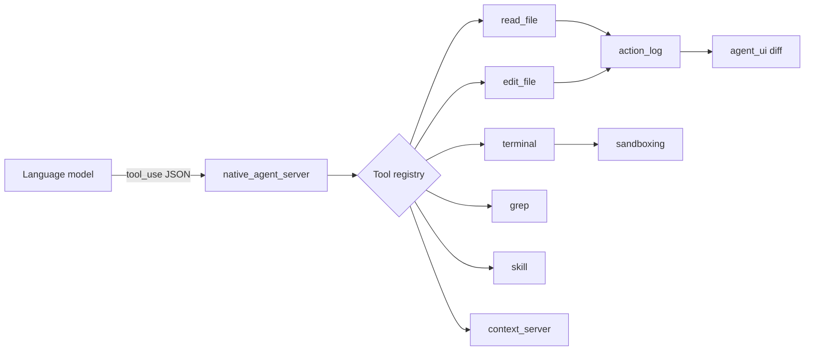

---

## Deep dive: AcpThread state fields {#acpthread-fields}

**Source:** `crates/acp_thread/src/acp_thread.rs` — `AcpThread` struct.

| Field | Type (conceptual) | Purpose |
|-------|-------------------|---------|
| `session_id` | `acp::SessionId` | Stable session identifier; maps to `ThreadStore` |
| `work_dirs` | `Option<PathList>` | Project roots for this thread |
| `parent_session_id` | `Option<SessionId>` | Subagent / fork lineage |
| `title` | `Option<SharedString>` | Persisted sidebar title |
| `provisional_title` | `Option<SharedString>` | Pre-save generated title |
| `entries` | `Vec<AgentThreadEntry>` | Conversation log (messages, tools, plan, compaction) |
| `plan` | `Plan` | Live ACP plan entries |
| `project` | `Entity<Project>` | Worktrees, LSP, buffers |
| `action_log` | `Entity<ActionLog>` | Pending agent buffer edits |
| `_git_store_subscription` | `Subscription` | React to git state for checkpoints |
| `update_last_checkpoint_if_changed_task` | `Option<Task>` | Async checkpoint sync |
| `shared_buffers` | `HashMap<Buffer, Snapshot>` | Consistent reads during edits |
| `turn_id` | `u32` | Monotonic turn counter |
| `running_turn` | `Option<RunningTurn>` | In-flight prompt (`send_task`) |
| `connection` | `Rc<dyn AgentConnection>` | Native or ACP backend |
| `token_usage` | `Option<TokenUsage>` | Last turn token counts |
| `cost` | `Option<SessionCost>` | Optional cost display |
| `prompt_capabilities` | `acp::PromptCapabilities` | Image upload, etc. |
| `available_commands` | `Vec<AvailableCommand>` | Slash commands from agent |
| `_observe_prompt_capabilities` | `Task` | Capability sync |
| `terminals` | `HashMap<TerminalId, Entity<Terminal>>` | Live terminal entities |
| `pending_terminal_output` | `HashMap<TerminalId, Vec<Vec<u8>>>` | Buffer before terminal ready |
| `pending_terminal_exit` | `HashMap<TerminalId, ExitStatus>` | Exit before terminal ready |
| `had_error` | `bool` | Thread error sticky flag |
| `draft_prompt` | `Option<Vec<ContentBlock>>` | Unsent composer persistence |
| `ui_scroll_position` | `Option<ListOffset>` | Restore scroll on load |
| `streaming_text_buffer` | `Option<StreamingTextBuffer>` | Smooth token reveal (16 ms ticks) |

### AcpThread events (UI subscriptions) {#acpthread-events}

| Event | Meaning |
|-------|---------|
| `PromptUpdated` | Draft prompt changed |
| `NewEntry` | New thread entry appended |
| `TitleUpdated` | Title/provisional title changed |
| `TokenUsageUpdated` | Usage footer refresh |
| `EntryUpdated(usize)` | Single entry mutated (streaming) |
| `EntriesRemoved(Range)` | Compaction or deletion |
| `ToolAuthorizationRequested` | User confirm needed |
| `ToolAuthorizationReceived` | Confirm completed |
| `Retry` | Provider retry in progress |
| `SubagentSpawned` | Child session created |
| `Stopped` | Turn ended with reason |
| `Error` / `LoadError` | Failure surfaces |
| `PromptCapabilitiesUpdated` | Composer affordances changed |
| `Refusal` | Model refusal |

---

## Deep dive: ThreadStore entity fields {#threadstore-fields}

**Source:** `crates/agent/src/thread_store.rs`, `crates/agent/src/db.rs`.

### ThreadStore {#threadstore-struct}

| Field | Type | Purpose |
|-------|------|---------|
| `threads` | `Vec<DbThreadMetadata>` | Sidebar index (in-memory cache) |
| `reload_task` | `Shared<Task<()>>` | Async DB reload; await before trusting `entries()` |

**Key methods:** `init_global`, `global`, `thread_from_session_id`, `load_thread`, `save_thread`, `entries`, `register_thread`.

### DbThreadMetadata (per sidebar row) {#db-thread-metadata}

| Field | Type | Purpose |
|-------|------|---------|
| `id` | `acp::SessionId` | Primary key |
| `parent_session_id` | `Option<SessionId>` | Subagent parent link |
| `title` | `SharedString` | Display title |
| `updated_at` | `DateTime<Utc>` | Sort key |
| `created_at` | `Option<DateTime<Utc>>` | Creation time |
| `folder_paths` | `PathList` | Project grouping (sorted) |

### DbThread (serialized session body) {#db-thread}

| Field | Type | Purpose |
|-------|------|---------|
| `title` | `SharedString` | Persisted title |
| `messages` | `Vec<Arc<DbMessage>>` | Serialized transcript |
| `updated_at` | `DateTime<Utc>` | Last save |
| `detailed_summary` | `Option<SharedString>` | Post-compaction summary |

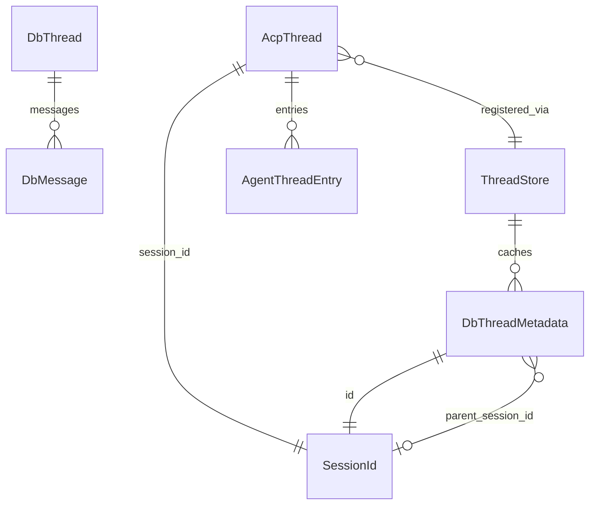

---

## Deep dive: message types in agent loop {#message-types}

### AgentThreadEntry variants {#agent-thread-entry}

| Variant | Contains | UI rendering |
|---------|----------|--------------|
| `UserMessage` | `content`, `checkpoint?`, `indented` | User bubble; checkpoint styling |
| `AssistantMessage` | `chunks[]`, `indented`, `is_subagent_output` | Streaming markdown / thoughts |
| `ToolCall` | Full tool UI state (see below) | Collapsible tool block + diff/terminal |
| `CompletedPlan` | `Vec<PlanEntry>` | Plan snapshot block |
| `ContextCompaction` | `id`, `status`, `summary?` | Compaction divider |

### AssistantMessageChunk {#assistant-chunks}

| Variant | Purpose |
|---------|---------|
| `Message { block }` | Visible assistant text |
| `Thought { block }` | Reasoning wrapped in `<thinking>` on export |

### SessionUpdate → handler mapping {#session-updates}

ACP stream events handled in `AcpThread::handle_session_update`:

| `SessionUpdate` | Effect |
|-----------------|--------|
| `UserMessageChunk` | Append/increment user content |
| `AgentMessageChunk` | Stream assistant message |
| `AgentThoughtChunk` | Stream thought chunk |
| `ToolCall` | New `ToolCall` entry |
| `ToolCallUpdate` | Status, output, diff, terminal attach |
| `Plan` | Update `plan.entries` |
| `SessionInfoUpdate` | Title, metadata |
| `AvailableCommandsUpdate` | Slash commands |
| `CurrentModeUpdate` | Agent mode switch |
| `ConfigOptionUpdate` | Agent config |
| `UsageUpdate` | Token/cost counters |

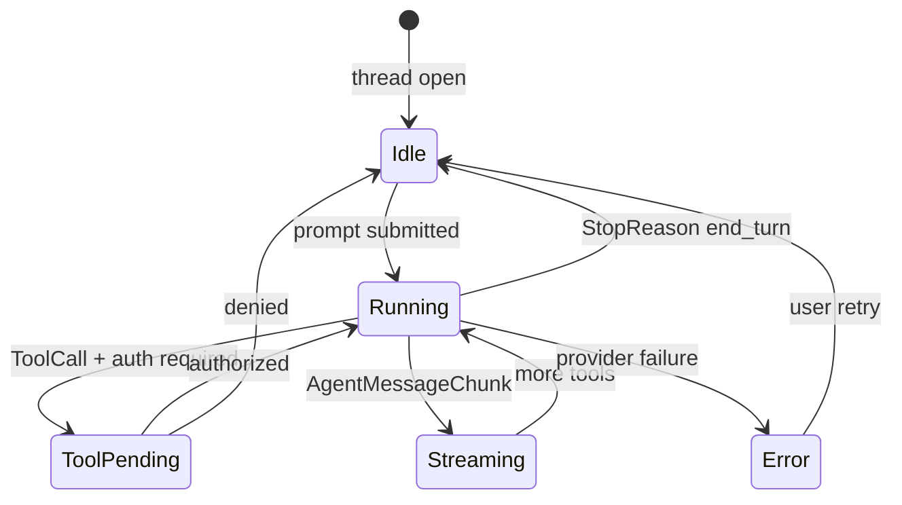

---

## File path index {#file-path-index}

Master table: feature → path → primary symbol.

| Feature | File path | Symbol / entry point |
|---------|-----------|----------------------|
| App boot | `crates/cuecode/src/main.rs` | `main` |
| Agent UI init | `crates/agent_ui/src/agent_ui.rs` | `init` |
| Agent panel | `crates/agent_ui/src/agent_panel.rs` | `AgentPanel` |
| Conversation | `crates/agent_ui/src/conversation_view.rs` | `ConversationView` |
| Composer | `crates/agent_ui/src/message_editor.rs` | `MessageEditor` |
| Thread index | `crates/agent/src/thread_store.rs` | `ThreadStore` |
| Thread DB | `crates/agent/src/db.rs` | `DbThreadMetadata`, `ThreadsDatabase` |
| Session entity | `crates/acp_thread/src/acp_thread.rs` | `AcpThread` |
| ACP bridge | `crates/acp_thread/src/connection.rs` | `AgentConnection` |
| Native agent | `crates/agent/src/native_agent_server.rs` | native agent server |
| Tool trait | `crates/agent/src/thread.rs` | `AgentTool` |
| Read file tool | `crates/agent/src/tools/read_file_tool.rs` | `ReadFileTool` |
| Edit file tool | `crates/agent/src/tools/edit_file_tool.rs` | `EditFileTool` |
| Terminal tool | `crates/agent/src/tools/terminal_tool.rs` | `TerminalTool` |
| Grep tool | `crates/agent/src/tools/grep_tool.rs` | `GrepTool` |
| Skill tool | `crates/agent/src/tools/skill_tool.rs` | `SkillTool` |
| Sandboxing | `crates/agent/src/sandboxing.rs` | seatbelt / bubblewrap |
| Action log | `crates/action_log/src/action_log.rs` | `ActionLog` |
| External ACP | `crates/agent_servers/src/acp.rs` | ACP agent server |
| Model registry | `crates/language_model/src/language_model.rs` | provider registry |
| Default settings | `assets/settings/default.json` | `"agent"` section |
| App paths | `crates/paths/src/paths.rs` | `APP_NAME` |
| Release IDs | `crates/release_channel/src/lib.rs` | `display_name`, `app_id` |
| Skills crate | `crates/agent_skills/src/agent_skills.rs` | skill discovery |
| Prompt templates | `crates/prompt_store/` | system prompts |

---

## Additional product micro-stories {#micro-stories}

### Micro-story: Sam — grep before edit {#micro-story-sam}

Sam asks the agent to fix a flaky test. The agent calls `grep` for `test_auth_refresh`,
then `read_file` on the matching path, then `edit_file` with a one-line assert fix.
Sam sees three tool blocks in order, rejects the edit after noticing wrong module, and
re-prompts — **without** losing grep results in the thread. Architecture win: `entries`
preserve tool history; `action_log` reject does not roll back read-only tools.

### Micro-story: Riley — subagent spawn {#micro-story-riley}

Riley uses `create_thread` to spin a research thread while keeping Fix work in the parent.
`parent_session_id` links the sidebar rows; Riley switches threads without closing the
workspace. Architecture path: `CreateThreadTool` → new `AcpThread` → separate
`action_log` — parent pending edits untouched.

---

## Appendix: grep commands {#grep-appendix}

Verify architecture assumptions from repo root:

```bash
# Agent stack entry points
rg -n "pub struct AcpThread" crates/acp_thread/src/acp_thread.rs
rg -n "pub struct ThreadStore" crates/agent/src/thread_store.rs
rg -n "impl AgentTool for" crates/agent/src/tools/

# Session update handling
rg -n "SessionUpdate::" crates/acp_thread/src/acp_thread.rs | head -30

# Tool input schemas
rg -n "pub struct \w+ToolInput" crates/agent/src/tools/

# Action log integration
rg -n "ActionLog" crates/agent/src/tools/edit_file_tool.rs crates/agent/src/tools/read_file_tool.rs

# Sandboxing
rg -n "sandboxing_enabled|SandboxingFeatureFlag" crates/agent/src/

# Agent UI wiring
rg -n "AcpThread|ThreadStore" crates/agent_ui/src/agent_panel.rs

# Native agent server tool list
rg -n "register_tool|ToolRegistry" crates/agent/src/native_agent_server.rs

# Paths / branding hooks
rg -n "APP_NAME" crates/paths/src/paths.rs

# Default model provider
rg -n "default_model" assets/settings/default.json
```

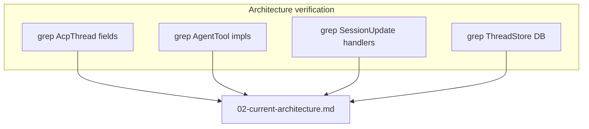

---

## Document status {#status}

| Field | Value |
|-------|-------|
| Status | Draft — expanded |
| Last expanded | 2026-06-17 |
| Update trigger | Major crate moves or agent stack refactors |
