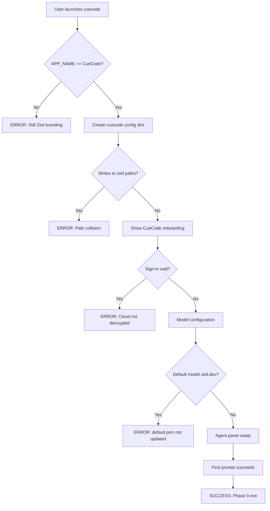
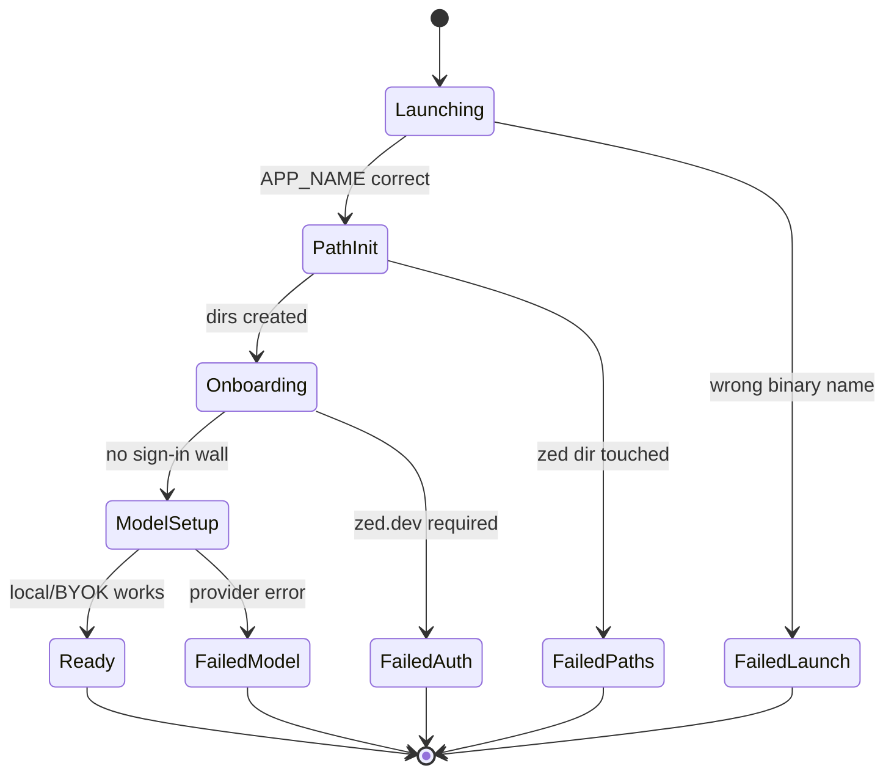
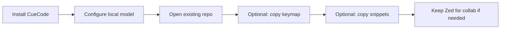
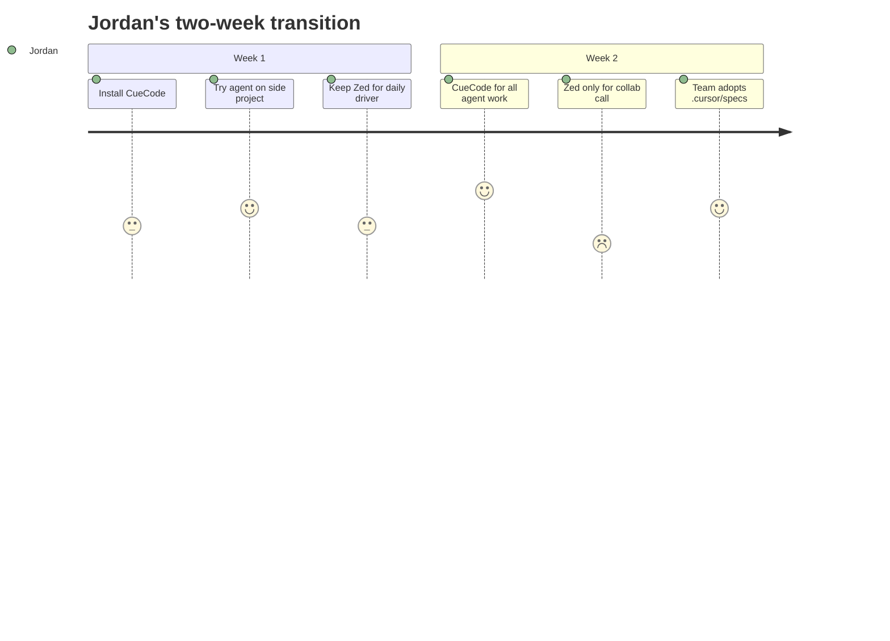
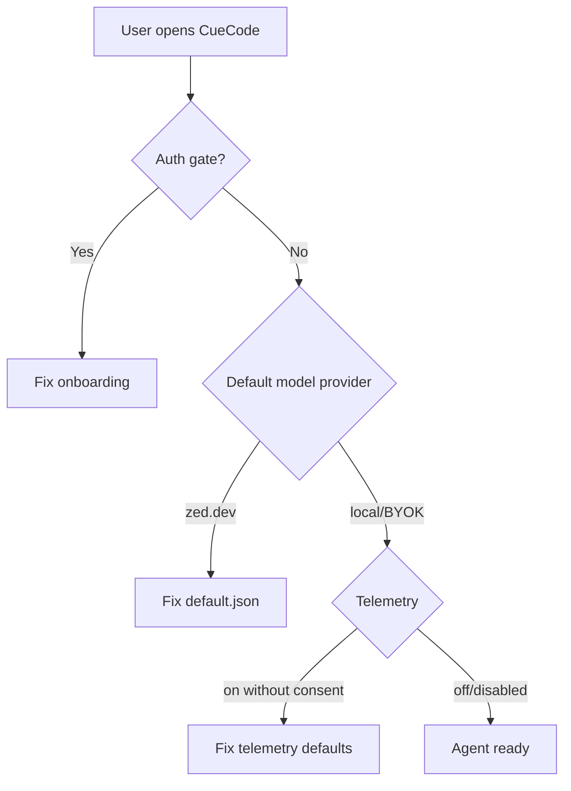
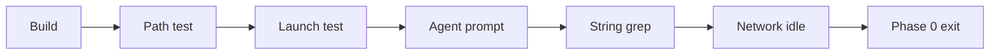
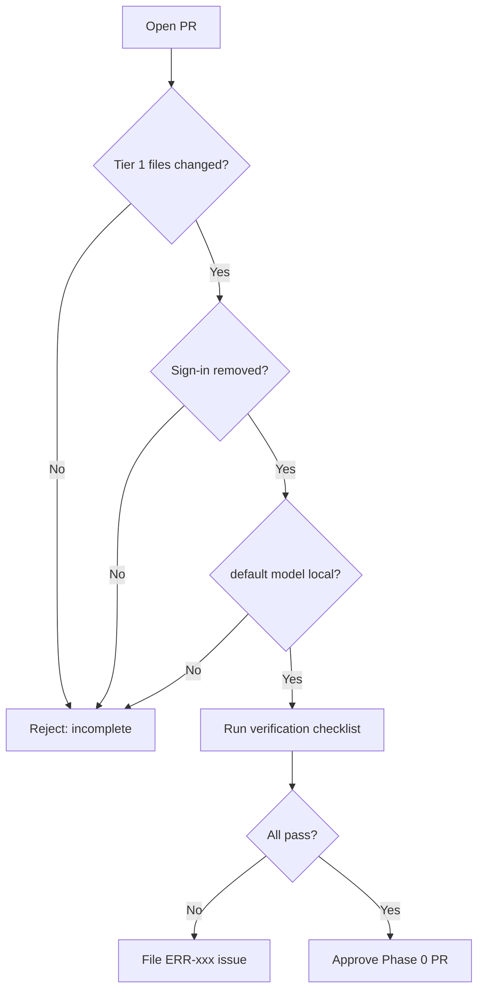
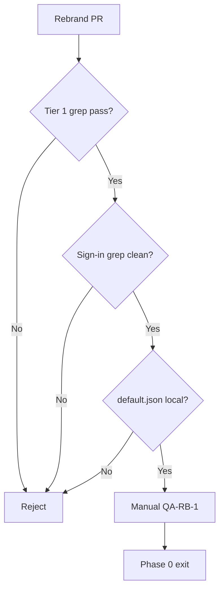
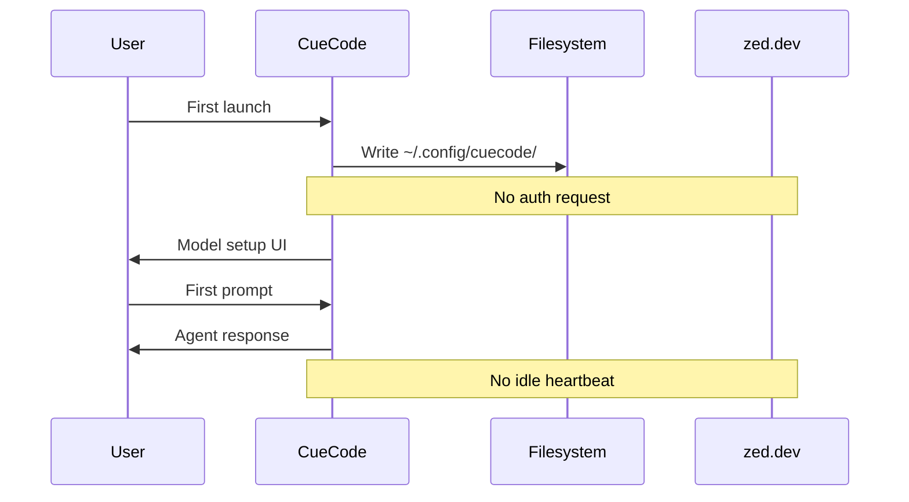

# Fork and Rebrand — CueCode Identity {#fork-and-rebrand}

Ship **CueCode** as a distinct Rust/GPUI product forked from Zed — separate identity,
separate user data, no zed.dev account wall for core agent workflows, GPL-compliant
distribution.

**Related specs:**

- Vision: [01-vision](./01-vision#relationship-to-zed)
- Architecture: [02-current-architecture](./02-current-architecture#paths)
- Roadmap Phase 0: [07-implementation-roadmap](../delivery/07-implementation-roadmap#phase-0)
- UI strings/surfaces: [09-ui-ux-spec](../design/09-ui-ux-spec)
- Open decisions: [12-open-questions](../ops/12-open-questions)
- Remaining Zed references (post–Phase 0): [03-zed-reference-cleanup-phases](./03-zed-reference-cleanup-phases) — **[check off progress](./03-zed-reference-cleanup-phases#progress)**

---

## Goal {#goal}

Ship **CueCode** as a distinct product that:

1. Does **not collide** with Zed user data on the same machine.
2. Does **not require** zed.dev accounts for core agent workflows.
3. **Complies** with GPL-3.0-or-later for distributed binaries.
4. Presents as a **coherent product** — not "Zed with a different icon."

### Goal acceptance criteria {#goal-acceptance}

| # | Criterion | Verification |
|---|-----------|--------------|
| G1 | Separate config/data paths | Files only under `cuecode` paths |
| G2 | Window/title says CueCode | Manual + screenshot test |
| G3 | Agent works without zed.dev login | Fresh install E2E |
| G4 | Binary named `cuecode` | `which cuecode`, `CARGO_BIN_NAME` assert |
| G5 | No accidental Zed config writes | Monitor `~/.config/zed` mtime |
| G6 | GPL notices preserved | Ship checklist |

---

## Product story: first launch {#product-story}

### Persona: Jordan — Zed user trying CueCode {#persona-jordan}

Jordan has used Zed daily for six months. They install CueCode from a GitHub
release artifact to evaluate the agent-first fork.

**Emotional arc:** skeptical → relieved (no sign-in) → curious (spec panel) →
trusts (sandbox badge) → keeps both apps during transition.

### Persona: Priya — new hire, never used Zed {#persona-priya}

Priya joins Alex's team. She only knows CueCode. She must never see "Sign in to
Zed" or wonder why config lives in a `zed` folder.

### Persona: Release engineer — shipping binaries {#persona-release}

They need a file-by-file checklist with grep verification and error scenarios
when rebrand is incomplete.

---

## First launch user story {#first-launch-story}

### Story beats {#first-launch-beats}

**Beat 1 — Install**

Jordan downloads `CueCode-aarch64.dmg` (or builds from source). Installs to
`/Applications/CueCode.app`. Zed remains installed separately.

**Beat 2 — Launch**

Double-click CueCode. Dock icon shows CueCode branding. No migration wizard from
Zed — these are separate products.

**Beat 3 — First-run paths**

App creates:

- macOS: `~/Library/Application Support/CueCode/`
- Config: `~/.config/cuecode/settings.json` (Linux) or equivalent

**No files written to `Zed` or `zed` paths.**

**Beat 4 — Onboarding**

Jordan sees CueCode onboarding — **not** zed.dev sign-in. Model setup points to
Ollama or API key entry. Agent panel is visible.

**Beat 5 — First prompt**

Jordan types: "List files in crates/agent/src/tools". Local model responds.
Thread created. No auth errors.

**Beat 6 — Habit**

Jordan uses Zed for collab call (CueCode hides channels v1). Uses CueCode for
agent work. Two apps, zero config collision.

### First launch flowchart {#first-launch-flow}



### First launch state diagram {#first-launch-state}



---

## Before / after UI mockups {#before-after-ui}

### Window title and title bar {#mockup-title-bar}

**Before (Zed):**

```
┌─────────────────────────────────────────────────────────────────────────────┐
│ ● ● ●   Zed — my-project                                    👤 Sign in     │
├─────────────────────────────────────────────────────────────────────────────┤
```

**After (CueCode):**

```
┌─────────────────────────────────────────────────────────────────────────────┐
│ ● ● ●   CueCode — my-project                    [Intent▼] [Sandbox🔒] [···]  │
├─────────────────────────────────────────────────────────────────────────────┤
```

No sign-in button in title bar v1. Intent/sandbox badges per [09-ui-ux-spec](../design/09-ui-ux-spec).

### Agent onboarding {#mockup-onboarding}

**Before (Zed — unhappy path):**

```
┌──────────────────────────────────────┐
│         Welcome to Zed Agent         │
│                                      │
│   Sign in to zed.dev to get started  │
│                                      │
│         [ Sign in with GitHub ]      │
│                                      │
└──────────────────────────────────────┘
```

**After (CueCode):**

```
┌──────────────────────────────────────┐
│        Welcome to CueCode            │
│                                      │
│   Connect a model to start:          │
│   ○ Ollama (local)                   │
│   ○ OpenAI-compatible endpoint       │
│   ○ Anthropic API key                │
│                                      │
│         [ Continue ]                 │
│                                      │
│   Specs: .cursor/specs/ in your repo │
└──────────────────────────────────────┘
```

### About dialog {#mockup-about}

**Before:**

```
Zed 0.x.x
Copyright Zed Industries
https://zed.dev
```

**After:**

```
CueCode 0.x.x
Based on Zed (GPL-3.0-or-later)
https://github.com/<org>/CueCode-Agents
```

GPL attribution required — see [#licensing](#licensing).

### Settings default model {#mockup-settings}

**Before (`assets/settings/default.json`):**

```json
"agent": {
  "default_model": {
    "provider": "zed.dev",
    "model": "claude-sonnet-4"
  }
}
```

**After (CueCode):**

```json
"agent": {
  "default_model": {
    "provider": "ollama",
    "model": "llama3.2"
  }
}
```

Exact model string depends on [10-infrastructure](../ops/10-infrastructure).

### ASCII: side-by-side shell layout {#mockup-layout}

```
ZED (before)                          CUECODE (after)
────────────────────────────────      ────────────────────────────────
┌ Project │ Editor      │ Agent │      ┌ Project │ Agent (wide) │ Ed │
│ tree    │ buffers     │ chat  │      │ narrow  │ + intent     │  │
│         │             │       │      │         │ + spec link  │  │
└─────────┴─────────────┴───────┘      └─────────┴──────────────┴──┘
   editor-first                         session-first (optional preset)
```

---

## Migration path for Zed users {#migration-zed-users}

CueCode does **not** auto-import Zed settings v1 — intentional separation prevents
accidental cross-writes. Users may run both apps.

### What migrates automatically {#migration-auto}

| Item | Auto? | Notes |
|------|-------|-------|
| Config/settings | **No** | Different paths |
| Extensions | **No** | Different extension dirs |
| Keybindings | **No** | User may copy manually |
| Projects | **Yes** | Open same folder path |
| Git repo | **Yes** | Same worktree |
| `.cursor/specs/` | **Yes** | In repo — CueCode reads them |
| `.cursor/skills/` | **Yes** | Project skills path |

### Manual migration steps {#migration-manual}



**Copy keybindings (optional):**

| OS | Zed source | CueCode dest |
|----|------------|--------------|
| macOS | `~/.config/zed/keymap.json` | `~/.config/cuecode/keymap.json` |
| Linux | `~/.config/zed/keymap.json` | `~/.config/cuecode/keymap.json` |

Review diff before copy — CueCode may add agent keybindings.

### Running both apps {#dual-install}

| Concern | Safe? | Detail |
|---------|-------|--------|
| Same repo open in both | Caution | File save conflicts — same as any two IDEs |
| Config collision | **Safe** if APP_NAME correct | [#phase-0-checklist](#phase-0-checklist) |
| Port conflicts (LSP) | Rare | Different instances |
| Git lock | User discipline | One writer at a time |

### Zed → CueCode journey (Jordan) {#migration-journey}



---

## Phase 0 checklist {#phase-0-checklist}

Phase 0 = launchable CueCode binary. Full roadmap: [07-implementation-roadmap](../delivery/07-implementation-roadmap#phase-0).

### Application name and paths {#app-name-paths}

**File:** `crates/paths/src/paths.rs`

```rust
pub const APP_NAME: &str = "CueCode";
```

This drives:

| OS | Path type | Resolved location |
|----|-----------|-------------------|
| macOS | Application Support | `~/Library/Application Support/CueCode` |
| macOS | Config fallback | `~/.config/cuecode/` |
| Linux | XDG config | `$XDG_CONFIG_HOME/cuecode` |
| Linux | XDG data | `$XDG_DATA_HOME/cuecode` |
| Windows | Roaming | `%APPDATA%\CueCode` |
| Windows | Local | `%LOCALAPPDATA%\CueCode` |

**Verification:**

```bash
# After first launch
ls ~/.config/cuecode/settings.json   # Linux
ls ~/Library/Application\ Support/CueCode  # macOS

# Must NOT create new files in zed paths during CueCode run
ls -la ~/.config/zed/
```

**Error if skipped:** CueCode reads/writes Zed settings — data corruption risk for dual installs.

### Binary name {#binary-name}

**File:** `crates/cuecode/Cargo.toml`

Rename `[[bin]]` name from `zed` to `cuecode`.

**File:** `crates/cuecode/src/main.rs`

Compile-time assert requires `CARGO_BIN_NAME` to match `APP_NAME_LOWERCASE` (`cuecode`).

The **crate** can remain named `zed` internally initially (L3 rename deferred) — only
the binary must match.

**Verification:**

```bash
cargo build -p cuecode
./target/debug/cuecode --version   # or cargo run --bin cuecode
```

**Error if skipped:** Assert fails at compile time OR wrong binary name in PATH.

### Release channel and display names {#release-channel}

**File:** `crates/release_channel/src/lib.rs`

Update:

| Function | Zed (before) | CueCode (after) |
|----------|--------------|-----------------|
| `display_name()` | "Zed", "Zed Dev", … | "CueCode", "CueCode Dev", … |
| `app_id()` | `dev.zed.Zed` | `dev.cuecode.CueCode` |
| `app_identifier()` | Zed identifiers | CueCode identifiers |
| Windows | Zed app id | CueCode app id |

**Verification:**

- Window title shows "CueCode"
- macOS Activity Monitor process name
- Wayland app_id on Linux

### Assets and packaging {#assets-packaging}

| Location | Change | Verification |
|----------|--------|--------------|
| `crates/assets`, `crates/icons` | CueCode icon set | Dock/taskbar icon visual |
| `crates/cuecode/resources/` | entitlements, `.desktop`, flatpak, Windows installer | Package smoke test |
| `script/bundle-mac`, `script/bundle-windows.ps1` | App name strings | Built artifact name |
| `assets/settings/default.json` | Comments, default icon theme, agent model | JSON valid, no zed.dev default |

### CLI {#cli-rebrand}

**File:** `crates/cli`

| Item | Change |
|------|--------|
| User-facing strings | "CueCode" not "Zed" |
| Install path | `cuecode` binary on PATH via `install_cli` |
| Help text | Updated product name |

**Verification:**

```bash
cuecode --help
cuecode path/to/project   # if supported
```

---

## File-by-file rebrand checklist {#file-checklist}

Exhaustive checklist for Phase 0 rebrand. Status: `[ ]` todo, `[x]` done.

**Implementation progress:** check off passes in
[03-zed-reference-cleanup-phases → Progress](./03-zed-reference-cleanup-phases#progress).
Run `./script/rebrand-progress.sh --full` to verify gates before updating boxes.

### Tier 1 — Must change (breaks identity) {#checklist-tier1}

| File / path | Change required | Verify |
|-------------|-----------------|--------|
| `crates/paths/src/paths.rs` | `APP_NAME = "CueCode"` | Config path grep |
| `crates/cuecode/Cargo.toml` | `[[bin]] name = "cuecode"` | `cargo run --bin cuecode` |
| `crates/cuecode/src/main.rs` | bin name assert passes | compile |
| `crates/release_channel/src/lib.rs` | display_name, app_id | window title |
| `assets/settings/default.json` | agent.default_model not zed.dev | settings UI |
| App icons | CueCode branding | visual |

### Tier 2 — User-visible strings {#checklist-tier2}

| Area | Grep pattern | Action |
|------|--------------|--------|
| Onboarding | `onboarding`, `ai_onboarding` | Remove sign-in wall |
| Title bar | `title_bar` | Remove account button |
| Menus | `collab`, `channels` | Hide items |
| About | `about` dialog | CueCode + GPL |
| URLs | `zed_urls`, `zed.dev` | Replace/remove |
| Agent upsell | `Zed Pro`, trial strings | Remove |

**Verification command:**

```bash
rg -n "zed\.dev|Sign in to Zed|Zed Pro" --glob '!target/**' --glob '!*.png'
```

Trending down — not zero until L3 crate rename.

### Tier 3 — Cloud decouple {#checklist-tier3}

| File / crate | Action | Verify |
|--------------|--------|--------|
| `crates/client` | server_url not default zed.dev | network trace |
| `language_models_cloud` | not default provider | agent works local |
| `auto_update` | disabled v1 | no zed.dev poll |
| `telemetry` | off by default | no outbound |
| `crashes` | optional CueCode Sentry | config gate |

### Tier 4 — Packaging {#checklist-tier4}

| Script / artifact | Change |
|-------------------|--------|
| `script/bundle-mac` | CueCode.app name |
| `script/bundle-windows.ps1` | Product name |
| `.desktop` file | `Name=CueCode`, icon |
| Flatpak manifest | app id |
| Entitlements | bundle id match |

### Tier 5 — Deferred (L3/L4) {#checklist-tier5}

| Item | When |
|------|------|
| Rename `crates/zed` → `cuecode` | L3 — weeks |
| Import path churn | L3 |
| `cuecode://` URL scheme | L4 |
| Extension API fork | L4 |

See [#rename-depth](#rename-depth).

For straggler strings, comments, docs, and optional renames after tiers 1–4, use the
phased plan in [03-zed-reference-cleanup-phases](./03-zed-reference-cleanup-phases).

---

## Decouple from Zed cloud {#decouple-cloud}

### Disable or hide (UI) {#decouple-ui}

| Feature | Where | Action | Unhappy path if missed |
|---------|-------|--------|------------------------|
| Sign-in / account | `onboarding`, `ai_onboarding`, title bar | Remove or stub | User blocked at first launch |
| Channels / collab | `collab_ui`, `call`, menus | Hide menu items | Confusion, broken features |
| Billing / upgrade URLs | `client/src/zed_urls.rs` | Replace with CueCode docs or remove | Links to zed.dev |
| Zed Pro / trial | agent onboarding upsell | Remove | Wrong product monetization |

### Replace defaults {#decouple-defaults}

**File:** `assets/settings/default.json`

```json
"agent": {
  "default_model": {
    "provider": "ollama",
    "model": "..."
  }
}
```

Or another local/BYOK provider — **not** `zed.dev`.

Provider setup: [10-infrastructure](../ops/10-infrastructure).

### Client and server URL {#decouple-client}

**File:** `crates/client` settings

| Setting | Zed default | CueCode |
|---------|-------------|---------|
| `server_url` | `https://zed.dev` | empty / disabled / CueCode future |
| Auth flows | required for cloud | optional or removed v1 |

### Auto-update and telemetry {#decouple-telemetry}

| Crate | v1 approach | Error if wrong |
|-------|-------------|----------------|
| `auto_update` | Disabled in dev; CueCode server later | Polls zed.dev |
| `telemetry` | Off by default or removed | Sends Zed telemetry |
| `crashes` | Optional Sentry with CueCode project | Wrong crash bucket |

### Decouple flow diagram {#decouple-flow}



---

## URL schemes and deep links {#url-schemes}

Today: `zed://` links for channels, collab, etc.

| Phase | Scheme | Purpose |
|-------|--------|---------|
| v1 | none required | Avoid broken handlers |
| v2+ | `cuecode://` | Open project, open spec, open session |

**Migration tasks (v2+):**

- Grep for `zed://` and `parse_zed_link`
- Introduce `cuecode://` parser
- Do not silently fail — unknown scheme shows user-visible error

**Error scenario:** User clicks old `zed://` link with CueCode installed — should
not crash; show "unsupported link" dialog.

---

## Extension compatibility {#extensions}

Zed extensions may assume Zed API and branding.

**Options (pick in [12-open-questions](../ops/12-open-questions)):**

| Option | Effort | v1 fit |
|--------|--------|--------|
| **1. Compat mode** | Low | **Recommended** — keep API, rebrand UI |
| **2. Fork registry** | High | Later |
| **3. Curated subset** | Medium | Ship without marketplace |

**Verification (compat mode):**

- [ ] Extension host loads without Zed account
- [ ] Popular extensions tested manually (list TBD)
- [ ] Extension paths use CueCode data dir not Zed

---

## Licensing {#licensing}

- Source: GPL-3.0-or-later (see `crates/cuecode/LICENSE-GPL`, root `README.md`)
- If distributing CueCode binaries:
  - Provide source (or written offer)
  - Preserve license notices
  - Mark modified files
  - State based on Zed

**Cannot** ship proprietary CueCode without separate legal strategy.

### GPL ship checklist {#gpl-checklist}

| Item | Required |
|------|----------|
| LICENSE file in repo | Yes |
| GPL notice in About | Yes |
| Source offer in distribution | Yes |
| Modified file headers | Recommended |
| Third-party notices | Preserve |

---

## Rename depth levels {#rename-depth}

| Level | Effort | Scope | When |
|-------|--------|-------|------|
| **L1 Cosmetic** | Days | APP_NAME, binary, icons, menus, defaults | **Alpha — now** |
| **L2 Service cut** | 1–2 weeks | No zed.dev, hide collab, local models | **Alpha — now** |
| **L3 Crate rename** | Weeks | `zed` crate → `cuecode`, import churn | Beta |
| **L4 Protocol fork** | Months | `cuecode://`, custom extension API | Post-beta |

**Recommendation:** L1 + L2 for alpha; defer L3/L4.

### Rename depth decision matrix {#rename-depth-matrix}

| If you need… | Minimum level |
|--------------|---------------|
| Separate user data | L1 |
| No sign-in wall | L2 |
| Clean `cargo doc` crate names | L3 |
| Extension marketplace fork | L4 |

---

## Error scenarios — incomplete rebrand {#error-scenarios}

When rebrand is incomplete, these failures occur. Use for QA and bug triage.

### ERR-001: Config collision {#err-001}

**Symptom:** CueCode writes to `~/.config/zed/settings.json`.

**Cause:** `APP_NAME` still `"Zed"` in `paths.rs`.

**Fix:** Set `APP_NAME = "CueCode"`. Rebuild. Move settings manually if already polluted.

**Severity:** Critical — data loss risk for dual installs.

### ERR-002: Compile assert failure {#err-002}

**Symptom:** `cargo build` fails: binary name mismatch.

**Cause:** `Cargo.toml` bin name ≠ `APP_NAME_LOWERCASE`.

**Fix:** Align `cuecode` in both places.

**Severity:** Blocker — cannot ship.

### ERR-003: Sign-in wall {#err-003}

**Symptom:** First launch requires zed.dev GitHub login.

**Cause:** Onboarding not stubbed; agent settings require cloud provider.

**Fix:** [Decouple UI](#decouple-ui) + [default model](#decouple-defaults).

**Severity:** Critical — violates CueCode vision ([01-vision](./01-vision#pain-identity)).

### ERR-004: Agent auth errors {#err-004}

**Symptom:** "Authentication required" on first prompt.

**Cause:** Default model still `zed.dev`; no API token.

**Fix:** `default.json` → ollama/openai compat.

**Severity:** High — core workflow broken.

### ERR-005: Wrong window title {#err-005}

**Symptom:** Window says "Zed" or "Zed Dev".

**Cause:** `release_channel::display_name()` not updated.

**Fix:** Update release_channel + rebuild.

**Severity:** Medium — trust/branding.

### ERR-006: zed.dev network calls {#err-006}

**Symptom:** Packet capture shows requests to zed.dev on idle launch.

**Cause:** auto_update, telemetry, or client heartbeat active.

**Fix:** Disable defaults in settings; gate crates.

**Severity:** Medium — privacy + confusion.

### ERR-007: Broken collab menu items {#err-007}

**Symptom:** User clicks Channels → error or empty cloud UI.

**Cause:** Menu visible but backend decoupled.

**Fix:** Hide menu items in L2.

**Severity:** Low — polish.

### ERR-008: Extension path wrong {#err-008}

**Symptom:** Extensions installed to Zed dir, not visible in CueCode.

**Cause:** Hardcoded "Zed" path in extension host.

**Fix:** Ensure all paths derive from `paths.rs`.

**Severity:** Medium — extension users blocked.

### ERR-009: Deep link crash {#err-009}

**Symptom:** Clicking `zed://` link crashes or hangs.

**Cause:** Handler expects cloud collab state.

**Fix:** Graceful error; implement `cuecode://` later.

**Severity:** Low v1 — unless default OS handler.

### ERR-010: GPL violation in ship {#err-010}

**Symptom:** Binary distributed without source offer or license.

**Cause:** Release process skipped legal checklist.

**Fix:** [#gpl-checklist](#gpl-checklist).

**Severity:** Legal blocker.

### Error scenario summary table {#error-summary}

| ID | Symptom | Likely cause | Phase |
|----|---------|--------------|-------|
| ERR-001 | Zed config written | APP_NAME | 0 |
| ERR-002 | Build fail | bin name | 0 |
| ERR-003 | Sign-in wall | onboarding | 0 |
| ERR-004 | Auth on prompt | default model | 0 |
| ERR-005 | Wrong title | release_channel | 0 |
| ERR-006 | zed.dev traffic | telemetry/update | 0 |
| ERR-007 | Broken collab | menus not hidden | 0 |
| ERR-008 | Extension path | hardcoded paths | 1 |
| ERR-009 | Deep link crash | zed:// handler | 2+ |
| ERR-010 | GPL issue | release process | ship |

---

## Verification {#verification}

After Phase 0:

### Automated / command verification {#verification-commands}

```bash
# Build and run
cargo run --bin cuecode

# Path constants
rg 'APP_NAME.*CueCode' crates/paths/src/paths.rs

# Binary name
rg 'name = "cuecode"' crates/cuecode/Cargo.toml

# zed.dev string trend (expect decreasing)
rg -c "zed\.dev" --glob '!target/**' | tail -1

# Sign-in strings
rg -n "Sign in" crates/onboarding crates/agent_ui crates/title_bar
```

### Manual verification checklist {#verification-manual}

- [ ] `cargo run` launches window titled **CueCode**
- [ ] Config writes to `~/.config/cuecode/` (Linux) or `~/Library/Application Support/CueCode` (macOS)
- [ ] **No** new writes to `~/.config/zed/` during session
- [ ] No sign-in wall on first launch
- [ ] Agent panel sends prompt to local/BYOK model without zed.dev login
- [ ] About dialog shows CueCode + GPL attribution
- [ ] Dock/icon shows CueCode branding
- [ ] `rg -l "Zed" --glob '!target/**'` count trending down (not zero until L3)
- [ ] Idle app does not phone zed.dev (packet capture or log)
- [ ] Collab/channels menus hidden or removed
- [ ] CLI `cuecode --help` shows CueCode

### Verification journey {#verification-journey}



---

## User journey: rebrand PR review {#journey-pr-review}



---

## Cross-reference index {#cross-links}

| Topic | Spec |
|-------|------|
| Vision / why fork | [01-vision](./01-vision) |
| Crate map | [02-current-architecture](./02-current-architecture) |
| Sandbox (post-rebrand) | [04-sandbox-core](./04-sandbox-core) |
| Roadmap phases | [07-implementation-roadmap](../delivery/07-implementation-roadmap) |
| Model providers | [10-infrastructure](../ops/10-infrastructure) |
| UI surfaces | [09-ui-ux-spec](../design/09-ui-ux-spec) |
| Open questions | [12-open-questions](../ops/12-open-questions) |

---

## Acceptance criteria {#acceptance-criteria}

Top five rebrand scenarios — Given/When/Then for Phase 0 exit.

### AC-RB-1: Config isolation {#ac-rb-1}

**Given** Zed and CueCode both installed on the same machine  
**When** the user runs CueCode for a full session  
**Then** all new config/data files appear only under `cuecode` paths — `~/.config/zed/` mtime unchanged

### AC-RB-2: Binary identity {#ac-rb-2}

**Given** a clean build from this fork  
**When** `cargo build -p zed` completes  
**Then** `target/debug/cuecode` exists, compile-time assert in `main.rs` passes, and `cuecode --help` shows CueCode branding

### AC-RB-3: No sign-in wall {#ac-rb-3}

**Given** a fresh install with no credentials  
**When** the user completes onboarding  
**Then** no step requires zed.dev GitHub login to reach the agent composer

### AC-RB-4: Local default model {#ac-rb-4}

**Given** factory `assets/settings/default.json`  
**When** the user opens agent settings without customization  
**Then** default provider is not `zed.dev` — first prompt uses local/BYOK path

### AC-RB-5: GPL-compliant About {#ac-rb-5}

**Given** a packaged CueCode build  
**When** the user opens About  
**Then** dialog shows CueCode version, GPL attribution, and upstream Zed notice per [#licensing](#licensing)

---

## UI copy deck {#ui-copy-deck}

Rebrand-specific strings. Tier 2 checklist ([#checklist-tier2](#checklist-tier2)).

| Surface | Before (Zed) | After (CueCode) |
|---------|--------------|-----------------|
| Window title | `Zed — {project}` | `CueCode — {project}` |
| Onboarding title | `Welcome to Zed Agent` | `Welcome to CueCode` |
| Onboarding body | `Sign in to zed.dev to get started` | `Connect a model to start` |
| Sign-in CTA | `Sign in with GitHub` | *(removed v1)* |
| Title bar account | `Sign in` | *(removed v1)* |
| About title | `Zed {version}` | `CueCode {version}` |
| About subtitle | `Copyright Zed Industries` | `Based on Zed (GPL-3.0-or-later)` |
| About URL | `https://zed.dev` | `https://github.com/<org>/CueCode-Agents` |
| CLI help header | `Zed` | `CueCode` |
| Agent upsell | `Zed Pro` / trial strings | *(removed)* |
| Collab menu | `Channels`, `Call` | *(hidden v1)* |
| Settings cloud | `Sign in to sync` | *(hidden or stub)* |
| Error: auth | `Authentication required` | `Configure a model provider in Settings` |
| Error: wrong paths | *(silent Zed write)* | `Configuration error: contact support` (internal) |
| Deep link | `zed://…` handler | `Unsupported link` dialog (v1) |
| Extension dir error | paths under Zed | `Extensions install to CueCode data directory` |
| Auto-update | `Checking for updates…` | *(disabled v1 — no toast)* |
| Telemetry prompt | Zed consent copy | *(off by default — no prompt v1)* |
| Model default label | `zed.dev / claude-…` | `ollama / llama3.2` (example) |
| Spec hint onboarding | — | `Specs: .cursor/specs/ in your repo` |
| Dual install note | — | `CueCode and Zed use separate settings folders` |

---

## Analytics events catalog {#analytics-events}

Phase 0 events — only if telemetry explicitly enabled; default **off** ([#decouple-telemetry](#decouple-telemetry)).

| Event | Properties | When fired |
|-------|------------|------------|
| `rebrand.first_launch` | `platform`, `app_name`, `release_channel` | First process start |
| `rebrand.config_dir_created` | `path`, `app_name` | Initial settings write |
| `rebrand.path_collision_detected` | `zed_path_written: bool` | **Should never fire** — alert |
| `rebrand.onboarding_completed` | `model_provider`, `skipped_sign_in: bool` | Onboarding finish |
| `rebrand.sign_in_shown` | `surface` | **Should never fire v1** — regression |
| `rebrand.default_model_provider` | `provider` | First agent prompt |
| `rebrand.zed_dev_request` | `crate`, `endpoint` | **Should never fire v1** — network regression |
| `rebrand.about_viewed` | `version` | About dialog open |
| `rebrand.cli_invoked` | `subcommand?` | `cuecode` CLI run |
| `rebrand.migration_keymap_copy` | `manual: bool` | User copies keymap (optional) |
| `rebrand.dual_install_detected` | `zed_config_exists: bool` | Both apps on machine |
| `rebrand.gpl_notice_shown` | — | About / first run legal |

---

## Manual QA scripts {#manual-qa}

### QA-RB-1: Phase 0 smoke (Jordan) {#qa-rb-1}

1. `cargo run --bin cuecode` from clean build.
2. Window title contains **CueCode** — not Zed.
3. Confirm config path:
   - macOS: `~/Library/Application Support/CueCode/`
   - Linux: `~/.config/cuecode/settings.json`
4. Touch `~/.config/zed/settings.json` mtime before session; re-check after — unchanged.
5. Complete onboarding without sign-in.
6. Send agent prompt — no auth error.
7. Open About — GPL + CueCode version.
8. **Pass:** [#verification-manual](#verification-manual) checklist.

### QA-RB-2: ERR scenario regression {#qa-rb-2}

| Step | Trigger | Expected |
|------|---------|----------|
| 1 | Wrong `APP_NAME` | ERR-001 — no Zed writes |
| 2 | Bin name `zed` with CueCode APP_NAME | ERR-002 — compile fail |
| 3 | Restore onboarding sign-in | ERR-003 — QA fails |
| 4 | `default_model` zed.dev | ERR-004 — auth on prompt |
| 5 | Idle app 10 min | ERR-006 — no zed.dev traffic |

### QA-RB-3: Packaging artifact {#qa-rb-3}

1. Run `script/bundle-mac` (or platform script).
2. Install produced `.app` / installer.
3. Launch from Applications — not `cargo run`.
4. Verify Dock icon, process name, data paths.
5. **Pass:** Tier 4 ([#checklist-tier4](#checklist-tier4)).

### QA-RB-4: CLI rebrand {#qa-rb-4}

1. `cuecode --help` — product name CueCode.
2. `which cuecode` — on PATH after install_cli.
3. No `zed` binary shadowing in CueCode release artifact.

### QA-RB-5: Priya new-hire path {#qa-rb-5}

1. Machine never had Zed.
2. Install CueCode only.
3. **Expect:** No Zed strings in onboarding, About, or error dialogs.
4. Agent works with Ollama.

---

## Performance budgets {#performance-budgets}

Rebrand must not regress Zed performance.

| Metric | Budget | Notes |
|--------|--------|-------|
| Cold start delta vs Zed baseline | ≤ +200 ms | Branding strings only |
| Onboarding first paint | ≤ 500 ms | No blocking network auth |
| First agent prompt (local) | Same as Zed agent | Provider change only |
| Idle CPU (no telemetry) | ≤ baseline Zed | auto_update/telemetry off |
| Binary size delta | ≤ +5 MB | Icons/assets swap |
| `rg` rebrand CI grep job | ≤ 30 s | Verification pipeline |

---

## Security and privacy notes {#security-privacy}

| Data | Leaves machine? | Rebrand action |
|------|-----------------|----------------|
| zed.dev auth tokens | Yes (Zed default) | **Remove requirement** |
| Collab/call signaling | Yes | **Hide menus v1** |
| Telemetry events | Yes if on | **Default off** |
| Crash reports (Sentry) | Yes if configured | Optional CueCode project |
| Auto-update polls | Yes to zed.dev | **Disabled v1** |
| LLM prompts | User provider | **Default local/BYOK** |
| Settings sync cloud | Yes (Zed) | **Not required v1** |
| Extension WASM | Local | Extension dir under CueCode paths |

**Privacy win:** Idle CueCode must not phone zed.dev — verify with packet capture in QA-RB-2.

---

## Additional product micro-stories {#micro-stories}

### Micro-story: Release engineer — grep gate {#micro-story-release}

Before tagging `v0.1.0-alpha`, the release engineer runs the [#verification-commands](#verification-commands)
block. `rg 'APP_NAME.*CueCode'` passes; `rg -c zed\.dev` shows downward trend but onboarding
still contains one `Zed Agent` string in `ai_onboarding`. They file ERR-005, block the tag,
and merge the string fix — **grep appendix as release gate**.

### Micro-story: Priya — wrong keymap path {#micro-story-priya}

Priya copies a blog post saying to edit `~/.config/zed/keymap.json`. Nothing happens in
CueCode. Support doc ([#migration-manual](#migration-manual)) says copy to `cuecode/keymap.json`.
Priya fixes path; both products stay isolated. Micro-story validates **intentional non-migration**
of config.

---

## Appendix: grep commands {#grep-appendix}

Phase 0 verification from repo root:

```bash
# Tier 1 — identity
rg -n 'APP_NAME.*CueCode' crates/paths/src/paths.rs
rg -n 'name = "cuecode"' crates/cuecode/Cargo.toml
rg -n 'CARGO_BIN_NAME' crates/cuecode/src/main.rs

# Display name / bundle ID
rg -n 'display_name|app_id|CueCode' crates/release_channel/src/lib.rs

# Default model — must not be zed.dev
rg -n 'default_model' -A5 assets/settings/default.json
rg -n '"provider".*"zed\.dev"' assets/settings/

# User-visible Zed strings (trend down)
rg -n 'zed\.dev|Sign in to Zed|Zed Pro|Welcome to Zed' \
  --glob '!target/**' --glob '!*.png' --glob '!*.svg'

# Onboarding / auth surfaces
rg -n 'sign.in|Sign in|ai_onboarding|onboarding' \
  crates/onboarding crates/agent_ui crates/title_bar

# Cloud decouple
rg -n 'server_url|zed\.dev' crates/client/
rg -n 'telemetry|auto_update' assets/settings/default.json

# Packaging strings
rg -n 'Zed|CueCode' script/bundle-mac script/bundle-windows.ps1

# Hardcoded paths (ERR-008)
rg -n '"Zed"|/zed/|\.config/zed' crates/ --glob '!target/**'

# URL schemes (v2 prep)
rg -n 'zed://|parse_zed_link|cuecode://' crates/
```





---

## Acceptance criteria supplement {#acceptance-criteria-supplement}

### AC-RB-6: Dual-install safety {#ac-rb-6}

**Given** Jordan runs Zed and CueCode on the same repo path  
**When** both apps are open (read-only in one, agent editing in the other)  
**Then** config dirs remain isolated; user sees standard file-save conflict warnings — not silent cross-write of settings

### AC-RB-7: Extension data dir {#ac-rb-7}

**Given** compat mode extensions enabled  
**When** user installs an extension from CueCode UI  
**Then** WASM and manifest land under CueCode application support — not `~/.local/share/zed/extensions`

### AC-RB-8: Collab menu hidden {#ac-rb-8}

**Given** L2 service cut complete  
**When** user opens main menu  
**Then** Channels, Call, and billing entries are absent or disabled — no ERR-007 broken navigation

---

## Manual QA supplement {#manual-qa-supplement}

### QA-RB-6: Network idle capture {#qa-rb-6}

1. Launch CueCode; deny all outbound except localhost (Little Snitch / firewall).
2. Idle 15 minutes — no agent activity.
3. **Expect:** zero connections to `zed.dev` domains.
4. Run one Ollama prompt — only localhost + chosen provider.

### QA-RB-7: GPL artifact inspection {#qa-rb-7}

1. Open shipped `.dmg` or `.deb` contents.
2. **Expect:** LICENSE or COPYING present; About matches [#gpl-checklist](#gpl-checklist).
3. No proprietary "all rights reserved" replacing GPL body text.

### QA-RB-8: String regression sweep {#qa-rb-8}

1. Run full Tier 2 grep ([#checklist-tier2](#checklist-tier2)).
2. Triage each hit: user-visible vs internal crate name.
3. **Pass:** zero user-visible "Sign in to Zed" or zed.dev upsell in onboarding/agent/title_bar.

### QA-RB-9: Settings round-trip {#qa-rb-9}

1. Change agent model in CueCode settings; restart app.
2. **Expect:** value persists under `cuecode` settings file only.
3. Open Zed (if installed) — **Expect:** Zed settings unchanged.

---

## Document status {#status}

| Field | Value |
|-------|-------|
| Status | Draft — expanded |
| Last expanded | 2026-06-17 |
| Phase | 0 — rebrand + decouple |
| Owner | CueCode platform |
