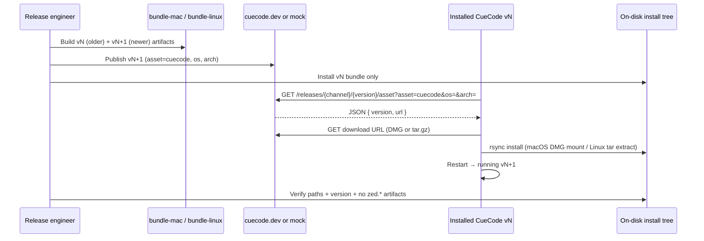

# Pass C — Auto-update install smoke test (E2E) {#pass-c-auto-update-smoke-test}

Follow-on from [03-zed-reference-cleanup-phases → Pass C progress](./03-zed-reference-cleanup-phases#progress-pass-c).

Pass C **code gates** are green (`rebrand-check.sh` proves `cuecode{}.app`, `libexec/cuecode-editor`,
`cuecode-remote-server`, Windows `install\bin\cuecode`). This doc is the **manual E2E playbook** for
line 108: prove an installed build can download and apply an update on real macOS and Linux machines.

**Why deferred today:** CueCode v1 disables the update pipeline on purpose:

| Switch | Location | Current v1 value |
|--------|----------|------------------|
| Poll gate | `crates/release_channel/src/lib.rs` → `poll_for_updates()` | `false` (hardcoded) |
| User setting | `assets/settings/default.json` → `"auto_update"` | `false` |
| Cloud base | `assets/settings/default.json` → `"server_url"` | `""` (empty) |

Until a CueCode release server (or staging mock) serves `cuecode` assets, there is nothing legitimate to
exercise end-to-end.

**Unit tests are not enough:** `crates/auto_update/src/auto_update.rs` has `#[gpui::test]` coverage with
`FakeHttpClient` (mock `/releases/stable/latest/asset`). That validates download logic in-process; it does
**not** validate bundle layout, `rsync`/`hdiutil`, install prefix detection, or relaunch.

---

## Overview (end-to-end flow)



---

## Phase 0 — Enable the update path (engineering, before smoke)

Do **not** flip these for general v1 users until CueCode releases are live. Use a **test channel build**
or local env overrides for smoke only.

### 0.1 Code / settings switches

| # | Change | Purpose |
|---|--------|---------|
| 1 | `ReleaseChannel::poll_for_updates()` → `true` for Stable/Preview (keep `false` for Dev if desired) | Start polling + allow manual “Check for Updates” |
| 2 | `"auto_update": true` in defaults **or** enable per-user in Settings for smoke account | Updater respects user kill switch |
| 3 | `"server_url": "https://cuecode.dev"` (or staging) **or** `ZED_SERVER_URL=...` at launch | HTTP client base for release API |
| 4 | Confirm release API host mapping | `get_release_asset` calls `build_zed_cloud_url_with_query("/releases/{channel}/{version}/asset", …)`. For non-`zed.dev` bases, cloud URL = `server_url` + path (see `http_client.rs`). Staging must expose the same JSON contract as today’s Zed cloud release API. |
| 5 | Asset name on server | Primary asset id **`cuecode`** (fallback `zed` still exists in code for migration — server should publish `cuecode`) |
| 6 | Remote server asset (optional) | **`cuecode-remote-server`** if you exercise SSH remote during smoke |

**Do not** point smoke builds at `cloud.zed.dev` — that validates upstream, not the rebrand.

### 0.2 Host prerequisites

| Platform | Required on PATH | Notes |
|----------|------------------|-------|
| macOS | `rsync`, `hdiutil` | `check_dependencies()` fails update if `rsync` missing |
| Linux | `rsync`, `tar` | Same; install hint shown in UI if `rsync` absent |
| Both | Network to **your** release host only | Run `script/network-idle-audit.sh` after smoke — no `*.zed.dev` |

### 0.3 Release API contract (what the app expects)

**Metadata request** (from `auto_update.rs`):

```http
GET {server_url}/releases/{channel}/{version}/asset?asset=cuecode&os={macos|linux}&arch={aarch64|x86_64}&…
```

**Response** (JSON):

```json
{ "version": "0.200.1", "url": "https://…/CueCode-aarch64.dmg" }
```

or for Linux:

```json
{ "version": "0.200.1", "url": "https://…/cuecode-linux-aarch64.tar.gz" }
```

**Download artifacts** must match installer expectations:

| OS | Download filename | Install logic |
|----|-------------------|---------------|
| macOS | `CueCode.dmg` (see `target_path`) | Mount DMG → `rsync` into running `.app` path |
| Linux | `cuecode-linux-{arch}.tar.gz` | Extract → contains **`cuecode.app/`** (or `cuecode-{channel}.app/`) → `rsync` to install prefix |

**Build commands:**

```bash
cd apps/CueCode-IDE
# Bump RELEASE_VERSION / crate version between vN and vN+1 builds
./script/bundle-mac          # → target/.../CueCode-{aarch64|x86_64}.dmg
./script/bundle-linux        # → target/release/cuecode-linux-$(uname -m).tar.gz
```

Linux tarball layout (from `script/bundle-linux`):

```
cuecode.app/
  bin/cuecode
  libexec/cuecode-editor      ← main binary; auto-update tracks this path
  lib/ …
  share/ …
```

---

## Phase 1 — Staging server options

Pick one before platform smoke.

### Option A — Real CueCode staging (preferred before GA)

1. Publish **vN+1** only to a staging channel (e.g. `preview` or dedicated `smoke`).
2. Install **vN** from a local bundle build (do not use “latest” from prod).
3. Point `server_url` / `ZED_SERVER_URL` at staging host.

### Option B — Local HTTP mock (fast iteration)

1. Serve static files for DMG/tar.gz.
2. Implement `GET /releases/stable/{version}/asset` returning JSON with URLs to your static host.
3. Launch CueCode with:

```bash
export ZED_SERVER_URL=http://127.0.0.1:8787
# optional: RUST_LOG=auto_update=info,http_client=debug
```

Reference: in-process mock shape in `auto_update.rs` tests (`test_auto_update_downloads`).

### Option C — Collab local cloud (advanced)

`http_client` maps `http://localhost:3000` → cloud `http://localhost:8787`. Only use if your collab
stack is configured to serve release assets; otherwise prefer Option B.

---

## Phase 2 — macOS smoke test

**Goal:** Installed **vN** `.app` updates to **vN+1** in place; no `Zed` paths or binaries remain.

### Setup

1. Build **vN** with `script/bundle-mac` (note version in About).
2. Install to a dedicated path, e.g. `/Applications/CueCode-smoke.app` (copy from DMG).
3. Confirm baseline:

```bash
/Applications/CueCode-smoke.app/Contents/MacOS/CueCode --version   # expect vN
ls /Applications/CueCode-smoke.app/Contents/MacOS/
# expect CueCode binary name per bundle (not Zed.app)
```

4. Enable updates (Phase 0 switches) for this install.
5. Publish **vN+1** DMG to staging/mock; ensure metadata version **>** installed semver.

### Execute

1. Launch installed vN app (bundled build, not `cargo run`).
2. Trigger update:
   - Wait for automatic poll (interval: stable ~ hours), **or**
   - Command palette → check for updates (requires `poll_for_updates()` true).
3. Accept download + install when prompted; allow restart.

### Verify (checklist)

- [ ] About / `--version` shows **vN+1**
- [ ] App relaunches from same `.app` path
- [ ] No error dialogs mentioning `Zed.exe` or missing `rsync`
- [ ] Install tree has no `zed` product names:

```bash
find /Applications/CueCode-smoke.app -iname '*zed*' | head
# expect empty or only upstream license text, not binaries
```

- [ ] Logs show download + rsync success (`RUST_LOG=auto_update=info`)
- [ ] Network trace during update: **no** `cloud.zed.dev` / `zed.dev` (optional: `script/network-idle-audit.sh` pattern)

### macOS failure modes to watch

| Symptom | Likely cause |
|---------|----------------|
| “Check for Updates” does nothing | `poll_for_updates()` still `false` |
| “Could not auto-update… rsync” | Xcode CLT / rsync missing |
| Download OK, version unchanged | Server returned same semver as installed |
| Codesign / gatekeeper blocks | Smoke DMG not signed — use `-i` local install or ad-hoc sign for dev |

---

## Phase 3 — Linux smoke test

**Goal:** Update from **vN** → **vN+1** under `~/.local/cuecode.app/` (default prefix).

### Setup

1. Build **vN** tarball: `./script/bundle-linux`.
2. Clean prefix and install vN:

```bash
rm -rf ~/.local/cuecode.app
tar -xzf target/release/cuecode-linux-$(uname -m).tar.gz -C ~/.local
~/.local/cuecode.app/libexec/cuecode-editor --version   # vN
```

3. Launch editor from that path (desktop entry or direct binary).
4. Enable Phase 0 switches; publish **vN+1** tarball to staging/mock.

### Execute

1. Trigger update (poll or manual check).
2. Accept install + restart when prompted.

### Verify (checklist)

- [ ] `~/.local/cuecode.app/libexec/cuecode-editor --version` → **vN+1**
- [ ] CLI wrapper exists: `~/.local/cuecode.app/bin/cuecode`
- [ ] **No** legacy tree:

```bash
test ! -d ~/.local/zed.app
test ! -e ~/.local/zed.app/libexec/zed-editor
```

- [ ] `rsync` log / app log shows copy from extracted `cuecode.app` → `~/.local`
- [ ] Temp extract uses prefix `cuecode-auto-update` (see `InstallerDir` in `auto_update.rs`)

### Phase 3b — Legacy path migration (recommended once)

Simulates users still running from an old **`zed{}.app`** layout:

1. Manually create or restore a `~/.local/zed.app/libexec/zed-editor` tree at vN (or symlink).
2. Run update to vN+1.
3. Confirm `linux_install_prefix()` detected legacy suffix (`auto_update.rs` `legacy_suffix`) and updated
   files land under the correct prefix — ideally migrated to **`cuecode.app`**.

---

## Phase 4 — Windows (optional)

Pass C gate covers `install\bin\cuecode` in `auto_update_helper`. Full E2E is separate:

1. Build with `script/bundle-windows.ps1`.
2. Install vN; publish vN+1; quit app so `auto_update_helper.exe` can swap binaries.
3. Verify `install\bin\cuecode` and relaunch.

Not required to check off macOS + Linux line 108, but track before Windows GA.

---

## Phase 5 — Remote server asset (optional)

If smoke includes **SSH remote** or remote development:

1. Trigger remote server download (connect to remote once).
2. Confirm cache path uses **`cuecode-remote-server`** gzip under `paths::remote_servers_dir()`.
3. Confirm no download of `zed-remote-server` unless fallback path is intentionally tested.

---

## Exit checklist (check off line 108)

When all are true, mark
[Auto-update install smoke test](./03-zed-reference-cleanup-phases#progress-pass-c) `[x]`:

- [ ] **macOS:** vN → vN+1 in `/Applications/…` (or chosen `.app` path)
- [ ] **Linux:** vN → vN+1 under `~/.local/cuecode.app/`
- [ ] **Linux legacy:** update works when running from old `zed.app` path *(recommended)*
- [ ] **Network:** update traffic hits CueCode release host only (no `zed.dev` poll)
- [ ] **Static gates still green:** `./script/rebrand-check.sh` Pass C section
- [ ] **Product decision recorded:** `poll_for_updates()` / `auto_update` default for GA documented in
  [03-fork-and-rebrand](./03-fork-and-rebrand.md) Tier 3

---

## Future automation (not blocking manual checkbox)

Possible follow-up — **do not** block Pass C manual sign-off:

| Step | Idea |
|------|------|
| CI job | macOS + Linux runners, staging bucket, scripted curl of asset API |
| Script | `script/qa-auto-update-smoke.sh` wrapping mock server + headless install |
| Collab | Reuse release refresh workflow (`tooling/xtask/.../after_release.rs`) pointed at CueCode cloud |

Keep manual smoke as the **first** sign-off when enabling updates; automate once staging is stable.

---

## Quick reference — code touchpoints

| Concern | File |
|---------|------|
| Poll gate | `crates/release_channel/src/lib.rs` — `poll_for_updates()` |
| Init / polling | `crates/auto_update/src/auto_update.rs` — `init`, `check` |
| Release API | `get_release_asset`, asset name `"cuecode"` |
| Linux paths | `linux_app_folder_name`, `linux_editor_relative_path`, `linux_install_prefix` |
| macOS install | `install_release_macos` (DMG + rsync) |
| Linux install | `install_release_linux` (tar + rsync) |
| Bundle output | `script/bundle-mac`, `script/bundle-linux` |
| Static gates | `script/rebrand-check.sh` Pass C section |

---

## Changelog

| Date | Change |
|------|--------|
| 2026-06-20 | Initial E2E smoke test playbook for Pass C line 108 |
