# Agentic Sandbox — Core Product Spec {#sandbox-core}

> **Status:** Draft — foundational product spec  
> **Related:** [01-vision](./01-vision) · [05-innovations](./05-innovations) · [06-system-design](./06-system-design) · [09-ui-ux-spec](../design/09-ui-ux-spec) · [harness/](../harness/README.md)

---

## Definition {#definition}

The **sandbox** is the bounded environment where an agent session runs. It is not a
feature flag or a terminal wrapper — it is the **product surface** of CueCode.

The sandbox governs:

| Dimension | What the sandbox controls |
|-----------|---------------------------|
| **Tools** | Which native tools, MCP tools, and skills are available |
| **Filesystem** | Read-only vs worktree writes; path deny lists |
| **Network** | Off, allowlist, or unrestricted (never default unrestricted) |
| **Context** | Which specs, skills, and project slices enter the system prompt |
| **Execution** | Active / Async / Hybrid scheduling per [harness/local/01-agent-harness](../harness/local/01-agent-harness.md) |
| **Review** | How edits are staged, diffed, accepted, or rewound |
| **Audit** | What gets logged for undo, replay, trust, and checkpoints |

CueCode is not "an editor with an agent panel." The sandbox is the product; the editor
is a **review instrument** inside it. See [13-ai-maxxing](../agent/13-ai-maxxing) for the
strategic framing.

### Persona: Maya — the sandbox-first developer {#persona-maya}

**Maya** maintains a Rust monorepo with `.cursor/specs/` for every major feature. She
opens CueCode to **Fix** a flaky GPUI test, not to browse files. She expects:

1. Intent **Fix** to enable sandboxed terminal + worktree writes without opening settings.
2. The agent to load spec `04-sandbox-core` when she `@spec`s it.
3. A unified **Review** panel before anything hits disk.
4. **Rewind** to undo an entire agent turn if tests fail.

If any of these fail, Maya falls back to manual editing — the sandbox failed.

### Persona: Alex — the cautious reviewer {#persona-alex}

**Alex** is a tech lead who reviews agent output from teammates. Alex uses **Review**
intent exclusively: read-only tools, no network, human-only writes. Alex's success
criteria is seeing Plan + Diffs + Terminal in one place with zero surprise file writes.

---

## Session model {#session-model}

Maps to existing Zed infrastructure with CueCode UX naming:

| Concept | Current crate / type | CueCode UX name | Notes |
|---------|----------------------|-----------------|-------|
| Thread | `acp_thread::AcpThread` | **Session** | Primary work unit |
| Agent connection | `AgentConnection` trait (`acp_thread::connection`) | Agent backend | Native or ACP |
| Tool calls | `agent` tools + ACP `SessionUpdate` | Tool invocations | Logged in thread |
| Plan | `AcpThread.plan` (ACP Plan entries) | Plan | Synced to specs when linked |
| Terminals | `AcpThread.terminals` | Sandboxed terminals | Structured metadata |
| Undo/reject | `action_log` | **Rewind** | Per-buffer + session scope |
| Skills | `agent_skills` | Skills | `.cursor/skills/` |
| Permissions | `agent_settings::tool_permissions` | Intent-based rules | Layered with trust |
| Sub-sessions | `create_thread` tool, `parent_session_id` | **Lanes** | See [05-innovations](./05-innovations#multi-lane) |

### Session entity relationships

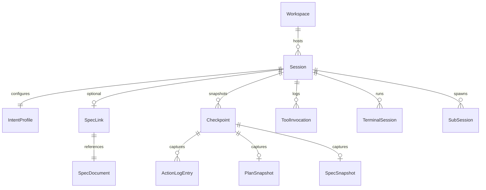

### Proposed Rust types (session layer)

```rust
// crates/cuecode_sandbox/src/session.rs (proposed)

pub struct SandboxSession {
    pub thread_id: acp_thread::ThreadId,
    pub intent: Intent,
    pub execution_context: ExecutionContext,
    pub linked_spec: Option<SpecLink>,
    pub sandbox_policy: SandboxPolicy,
    pub checkpoint_head: Option<CheckpointId>,
}

pub struct SpecLink {
    pub path: PathBuf,
    pub sync_plan: bool,
    pub last_synced_at: Option<DateTime<Utc>>,
}

pub struct SandboxPolicy {
    pub network: NetworkPolicy,
    pub fs_write: FsWritePolicy,
    pub sandbox_enabled: bool,
    pub platform_backend: SandboxBackend, // Seatbelt | Bubblewrap | Disabled
}
```

Wire `SandboxSession` into `ConversationView` state at session start; persist intent
and spec link in thread serialization (`agent_panel` retained threads).

---

## Session lifecycle {#lifecycle}

Each phase is **visible in the UI** — not buried in logs. Users should always know:
*where* the session is, *what* it can do, and *what* is pending review.

### Lifecycle state machine

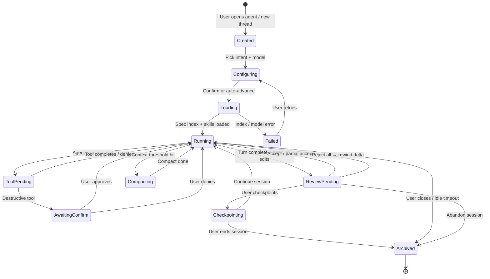

### Phase descriptions

| Phase | User-visible signal | Backend hooks |
|-------|---------------------|---------------|
| **CREATE** | New thread in sidebar | `AgentConnection::new_session` |
| **CONFIGURE** | Intent picker, model selector | `cuecode_sandbox::IntentProfile` |
| **LOAD** | "Loading specs…" chip | `cuecode_specs::load_spec_index` |
| **RUN** | Streaming transcript + plan | Agent loop, tools, `action_log` |
| **REVIEW** | Review panel badge + tab count | `agent_ui::agent_diff`, unified review |
| **CHECKPOINT** | Timeline entry | `cuecode_sandbox::CheckpointStore` |
| **COMPACT** | Context budget warning | `auto_compact`, compaction prompts |
| **ARCHIVE** | Thread retained, read-only | Serialization in `agent_panel` |

### Sequence: happy path — Fix intent session {#lifecycle-happy}

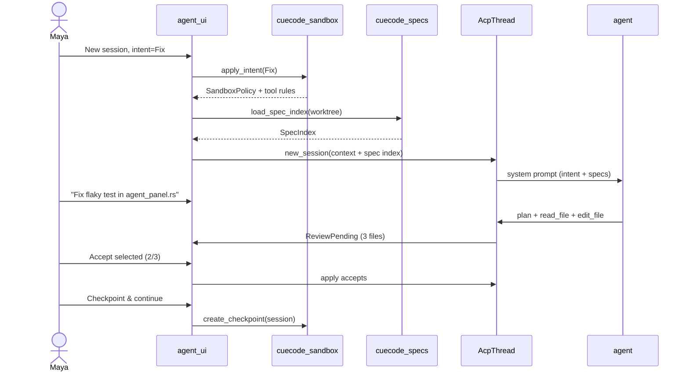

### Sequence: unhappy path — Explore write attempt {#lifecycle-unhappy}

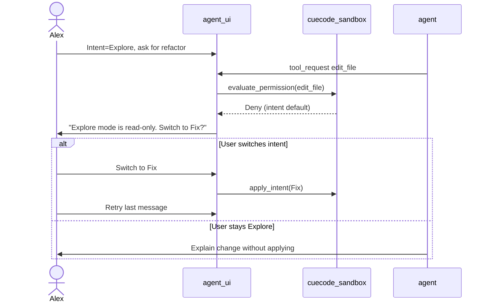

### ASCII: session header lifecycle indicators

```
┌─────────────────────────────────────────────────────────────────────────────┐
│ Agent — Session: "Fix flaky GPUI test"                    [···] [Review ●3] │
├─────────────────────────────────────────────────────────────────────────────┤
│ [Intent ▼ Fix] [Sandbox 🔒 net:off write:worktree] [Spec ▼ 04-sandbox]   │
│ [Model ▼ local/llama]              Phase: RUNNING → REVIEW PENDING          │
└─────────────────────────────────────────────────────────────────────────────┘

Review badge ●3 = 3 pending file diffs + optional spec diff tab
```

---

## Intent profiles {#intent-profiles}

**Intent profiles** are the primary CueCode UX control for sandbox behavior. One intent
selection reconfigures tools, network, filesystem, default trust, execution context,
and system prompt instructions — not twelve settings pages.

See [05-innovations](./05-innovations#intent-switcher) and [08-agent-tools-and-skills](../agent/08-agent-tools-and-skills#permissions).

### Master intent table

| Intent | Tools | Network | FS write | Default trust | Default execution | Primary persona |
|--------|-------|---------|----------|---------------|-------------------|-----------------|
| **Explore** | read, grep, diagnostics, list_specs | off | none | auto-allow reads | Active / Async | Researcher |
| **Fix** | + edit, terminal (sandboxed), tests | allowlist | worktree | confirm destructive | Active | Implementer |
| **Ship** | + git, build, push (strict confirm) | allowlist + CI hosts | worktree | confirm push/force | Active + Async verify | Release engineer |
| **Review** | read, diff, comment tools | off | none | human-only writes | Active | Reviewer (Alex) |
| **Orchestrate** | spawn, read_spec, plan; no edit | allowlist | none | confirm workers | Hybrid | Coordinator |

**Storage (proposed):** `~/.config/cuecode/intent_profiles.json`  
**Per-workspace override:** last intent in workspace serialization

### Integration points

| Layer | Crate / module | Mapping |
|-------|----------------|---------|
| Tool permissions | `agent_settings::tool_permissions` | intent → default + patterns |
| OS sandbox | `agent::sandboxing` | intent → strictness + network |
| System prompt | `agent` templates | intent-specific instructions |
| UI visibility | `agent_ui::conversation_view` | hide write actions in Explore |
| Harness | `cuecode_sandbox` | `ExecutionContext` default |

---

### Intent: Explore {#intent-explore}

**User story:** As **Jordan**, a new contributor, I want to ask questions about the
codebase without risk of the agent modifying files, so I can learn safely.

**Behavior:**

- All write tools hard-denied at permission layer (not prompt-only).
- Network off by default; `fetch` / `web_search` disabled unless user toggles allowlist.
- Deep codebase surveys run **Async** when estimated >30s ([harness/local/01-agent-harness](../harness/local/01-agent-harness.md#async)).
- Spec index injected; full spec bodies loaded on `@spec` mention only.

**ASCII UI mockup — Explore composer**

```
┌─────────────────────────────────────────────────────────────────────────────┐
│ [Intent ▼ Explore] [Sandbox 🔒 read-only] [Spec: none ▼]                  │
├─────────────────────────────────────────────────────────────────────────────┤
│  💬 Ask about the codebase…                                                 │
│  @spec 02-current-architecture                                              │
│                                                                             │
│  [Send]  Background survey available for large searches                     │
├─────────────────────────────────────────────────────────────────────────────┤
│  Hidden/disabled: Apply edit · Run terminal · Git · Push                    │
└─────────────────────────────────────────────────────────────────────────────┘
```

**Happy path:** Jordan `@spec`s architecture doc → agent answers with citations → no pending diffs.

**Unhappy path:** Agent tries `edit_file` → UI blocks → offers "Switch to Fix?" CTA.

---

### Intent: Fix {#intent-fix}

**User story:** As **Maya**, I want sandboxed terminal + worktree writes with confirm
only on destructive ops, so I can iterate on a bug without nuking my home directory.

**Behavior:**

- Terminal sandbox enabled on macOS/Linux when `SandboxingFeatureFlag` on ([10-infrastructure](../ops/10-infrastructure)).
- Network allowlist: crates.io, npm registries, common package mirrors (configurable).
- `edit_file` allowed under worktree; hard-deny `.env`, secrets, force git ops.
- Default **Active** execution; verification subagent may run **Async**.

**ASCII UI mockup — Fix header + sandbox badge**

```
┌─────────────────────────────────────────────────────────────────────────────┐
│ [Intent ▼ Fix ●] [Sandbox 🔒 net:allowlist write:worktree] [Spec ▼ linked] │
├─────────────────────────────────────────────────────────────────────────────┤
│  💬 What should we fix?                                                     │
│  Fix the race in ConversationView::new thread startup                         │
│                                                                             │
│  [Send]                                                                     │
├─────────────────────────────────────────────────────────────────────────────┤
│  Plan (2/5)                                                                 │
│  ☐ Reproduce failure in test                                                │
│  ☑ Patch agent_panel spawn path                                             │
│  ☐ Run ./script/clippy                                                      │
└─────────────────────────────────────────────────────────────────────────────┘

Tap sandbox badge →
┌──────────────────────────┐
│ Sandbox detail           │
│ Platform: Seatbelt (macOS)│
│ Network: allowlist (3)   │
│ FS writes: worktree only │
│ [View allowlist]         │
└──────────────────────────┘
```

**Happy path:** Agent edits + runs `cargo test` in sandbox → tests pass → Review → Accept.

**Unhappy path:** Sandbox blocks network → agent surfaces error → Maya adds host to allowlist or approves once.

---

### Intent: Ship {#intent-ship}

**User story:** As **Riley**, a release captain, I want git/build/push with strict
confirm on push and never auto-allow force push, so I can ship without fear.

**Behavior:**

- Superset of Fix tools + git operations.
- `git push` always confirm; `git push --force` hard-deny (trust graph cannot override).
- Async **verification** lane runs CI-like commands before Riley accepts push proposal.
- Optional checkpoint + git commit checkbox on Ship review footer.

**ASCII UI mockup — Ship confirm dialog**

```
┌─────────────────────────────────────────────────────────────────────────────┐
│ Confirm: git push origin feature/sandbox-core                               │
├─────────────────────────────────────────────────────────────────────────────┤
│  Branch: feature/sandbox-core → origin/feature/sandbox-core               │
│  Commits: 3                                                                 │
│  CI preview: verification lane PASS (see terminal tab)                    │
│                                                                             │
│  ☐ Create checkpoint before push                                            │
│                                                                             │
│  [Cancel]                                    [Approve once] [Deny always] │
└─────────────────────────────────────────────────────────────────────────────┘
```

**Happy path:** Verification Async lane passes → Riley confirms push once → success notification.

**Unhappy path:** Verification FAIL → push blocked → Review shows failing terminal output.

---

### Intent: Review {#intent-review}

**User story:** As **Alex**, I want read-only agent analysis with a unified diff view,
so I can comment without the agent silently "fixing" things.

**Behavior:**

- Write tools denied; agent produces review comments and plan entries only.
- Human applies edits manually in editor (outside agent write path).
- Ideal for PR review workflows and teaching.

**ASCII UI mockup — Review mode**

```
┌─────────────────────────────────────────────────────────────────────────────┐
│ [Intent ▼ Review] [Sandbox 🔒 read-only] [Spec: PR checklist ▼]           │
├─────────────────────────────────────────────────────────────────────────────┤
│  💬 Review these changes…                                                   │
│  Focus on error handling in cuecode_specs                                   │
├─────────────────────────────────────────────────────────────────────────────┤
│  Review panel (read-only)                                                   │
│  [Plan] [Diffs] [Terminal] [Spec]                                         │
│  Findings: 2 major, 1 nit — no auto-apply                                   │
└─────────────────────────────────────────────────────────────────────────────┘
```

---

### Intent: Orchestrate {#intent-orchestrate}

**User story:** As **Sam**, a staff engineer, I want to spawn Explore + Implement
lanes without editing files on the main thread, so parallel work stays isolated.

**Behavior:**

- `spawn_agent` / `create_thread` enabled; `edit_file` denied on coordinator session.
- **Hybrid** execution default per [harness/local/01-agent-harness](../harness/local/01-agent-harness.md#hybrid).
- Sub-lanes inherit intent (Explore read-only, Implement Fix rules).
- Parent synthesizes subagent artifacts into plan + checkpoint.

**ASCII UI mockup — Multi-lane orchestration**

```
┌─────────────────────────────────────────────────────────────────────────────┐
│ [Intent ▼ Orchestrate] [Lanes: 2 active]                                  │
├─────────────────────────────────────────────────────────────────────────────┤
│  Main (coordinator) — Hybrid                                                  │
│  ├─ Lane A: Explore · Async · "Map acp_thread API" · done ✓               │
│  └─ Lane B: Fix · Active · "Implement checkpoint store" · running…        │
├─────────────────────────────────────────────────────────────────────────────┤
│  [Merge artifact from Lane A into plan]  [Open Lane B review]             │
└─────────────────────────────────────────────────────────────────────────────┘
```

See [05-innovations](./05-innovations#multi-lane).

---

## Spec integration {#spec-integration}

Specs in `.cursor/specs/` are **first-class context** — not optional markdown the
agent might ignore. This section defines load, index, mention, plan sync, and review
flows. Implementation: `cuecode_specs` crate ([06-system-design](./06-system-design#new-crates)).

### Spec index pipeline

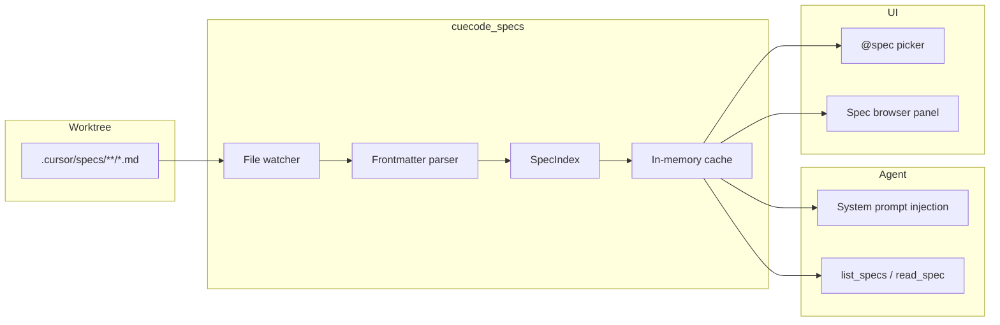

### Session start flow

When a session starts (`ConversationView::new` hook):

1. Scan `.cursor/specs/**/*.md` in the active worktree.
2. Build **spec index** (title, path, status from YAML frontmatter if present, anchor ids).
3. Inject compact index into system prompt (titles + paths + status — not full bodies).
4. Enable `@spec` mentions in composer (fuzzy path/slug match).
5. If user pre-linked a spec ("Start session from spec"), load full body + set `SpecLink`.

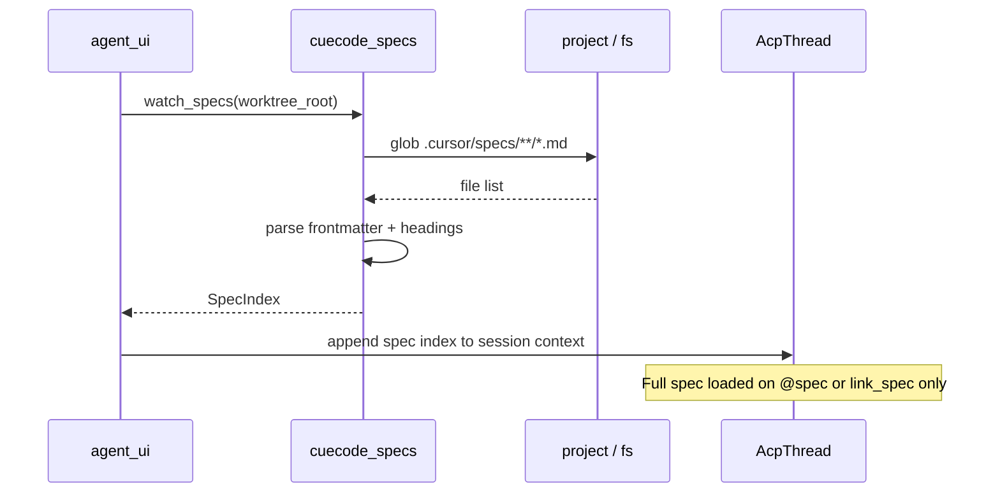

### Plan ↔ spec sync

When the agent updates a plan (`AcpThread::update_plan` in `crates/acp_thread/src/acp_thread.rs`):

1. If session has `SpecLink { sync_plan: true }`, diff plan entries vs spec checkboxes.
2. Propose spec patch (never silent write) → **Spec** tab in unified review.
3. User confirms → `cuecode_specs::propose_spec_update` → write with backup.

**Checkbox mapping convention:**

```markdown
## Tasks {#tasks}
- [ ] Implement SpecIndex watcher
- [x] Add @spec composer completion
```

Plan entry `"Implement SpecIndex watcher"` maps to checkbox line by normalized title match.

### ASCII: @spec mention picker

```
┌─────────────────────────────────────────────────────────────────────────────┐
│ @spec ▌                                                                     │
├─────────────────────────────────────────────────────────────────────────────┤
│  04-sandbox-core.md      Agentic Sandbox — Core Product Spec                │
│  05-innovations.md       CueCode Innovations                                │
│  06-system-design.md     System Design                                      │
│  harness/local/01-agent-harness.md     Agent harness — Active, Async, Hybrid              │
└─────────────────────────────────────────────────────────────────────────────┘
```

### Spec integration happy paths

| Scenario | Expected outcome |
|----------|------------------|
| New spec file added on disk | Index updates via watcher; next turn sees it |
| User `@spec 05-innovations` | Full spec body injected for that turn |
| Agent completes plan item | Spec checkbox update proposed in Review → Spec tab |
| User rejects spec write | Spec file unchanged; trust graph notes rejection |

### Spec integration unhappy paths

| Scenario | Expected outcome |
|----------|------------------|
| No `.cursor/specs/` directory | Empty index; agent nudged to use `/write-spec` skill |
| Malformed frontmatter | File indexed with path-only title; warning in spec browser |
| Plan/spec title mismatch | Sync UI shows manual mapping UI; no auto patch |
| External ACP agent ignores specs | Index still shown to user; native agent fully spec-aware |

### Proposed `cuecode_specs` API

```rust
pub struct SpecIndex {
    pub entries: Vec<SpecEntry>,
    pub worktree_id: WorktreeId,
    pub updated_at: DateTime<Utc>,
}

pub struct SpecEntry {
    pub path: PathBuf,
    pub title: String,
    pub status: Option<SpecStatus>,
    pub tags: Vec<String>,
    pub summary: Option<String>,
}

pub struct SpecDocument {
    pub frontmatter: Option<SpecFrontmatter>,
    pub body: String,
    pub checkboxes: Vec<SpecCheckbox>,
}

pub fn load_spec_index(worktree: &Path, cx: &App) -> SpecIndex;
pub fn read_spec(path: &Path) -> Result<SpecDocument>;
pub fn propose_spec_update(path: &Path, patch: SpecPatch) -> SpecProposal;
pub fn sync_plan_to_spec(plan: &Plan, doc: &SpecDocument) -> Option<SpecPatch>;
```

---

## Sandbox isolation {#isolation}

Isolation is **defense in depth**: intent profile → tool permissions → OS sandbox → trust graph hard denies.

### Isolation layers diagram

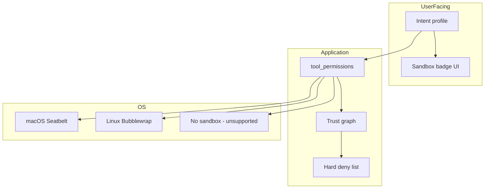

### Existing (Zed) implementation

| Component | Location |
|-----------|----------|
| Sandbox orchestration | `crates/agent/src/sandboxing.rs` |
| Feature flag | `crates/feature_flags/src/flags.rs` — `SandboxingFeatureFlag` |
| Terminal tool integration | `crates/agent/src/tools/terminal_tool.rs` |
| Network allowlists | `NetworkRequest` enum — None / AnyHost / Hosts |
| Thread sandbox metadata | `acp_thread` — `SandboxNetworkAccess` |

### CueCode extensions

| Extension | Description |
|-----------|-------------|
| Intent-bound policy | Fix/Ship enable sandbox by default on supported platforms |
| Visible badge | Network on/off, write scope, platform backend |
| Profile persistence | `intent_profiles.json` merges with settings |
| Coordinator isolation | Orchestrate lanes get per-lane policies |

### ASCII: isolation — Explore vs Fix terminal

**Explore:** terminal tool not offered in UI; backend denies if invoked.

```
┌──────────────────────┐         ┌──────────────────────┐
│   Explore session    │         │    Fix session       │
│   ───────────────    │         │    ───────────       │
│   FS:  read-only     │         │   FS:  worktree      │
│   Net: off           │         │   Net: allowlist     │
│   Term: (disabled)   │         │   Term: sandboxed    │
│   Seatbelt: n/a      │         │   Seatbelt: ON       │
└──────────────────────┘         └──────────────────────┘
```

### Platform matrix

| Platform | Backend | Fix intent default | Ship intent default |
|----------|---------|--------------------|---------------------|
| macOS | Seatbelt | sandbox on (flag) | sandbox on (flag) |
| Linux | Bubblewrap | sandbox on (flag) | sandbox on (flag) |
| Windows | None (v1) | permissions only | permissions only |

Future: dev containers per [10-infrastructure](../ops/10-infrastructure) — out of sandbox v1 scope.

---

## Review surface {#review}

Review is where agent output becomes **user-owned** code. CueCode unifies Zed's diff
review with plan, terminal, and spec tabs.

### Existing (Zed) building blocks

| Surface | Location |
|---------|----------|
| Inline diff review | `agent_ui::agent_diff` |
| Single-file review setting | `agent.single_file_review` in `assets/settings/default.json` |
| Reject last batch | `action_log` integration in agent UI |
| Plan UI | ACP plan rendering in `conversation_view` |

### CueCode unified review

Single **Review** mode tabbing across:

| Tab | Content | Primary actions |
|-----|---------|-----------------|
| **Plan** | ACP plan entries + linked spec checkboxes | Toggle plan items; link spec |
| **Diffs** | All pending file changes (multi-buffer) | Accept/reject per file/hunk |
| **Terminal** | Commands + exit codes this turn | Copy, re-run (Fix only) |
| **Spec** | Proposed spec file edits | Accept/reject spec patch |

**Footer actions:** Accept all · Reject all · Accept selected · **Checkpoint & continue**

See [09-ui-ux-spec](../design/09-ui-ux-spec#surfaces) and [05-innovations](./05-innovations#checkpoint-stack).

### Review workflow story — Maya's unhappy test fix {#review-story}

1. Agent completes a Fix turn with 3 edited files and 2 terminal commands.
2. Review badge shows **●3**; Maya opens unified review panel.
3. **Diffs** tab: accepts 2 files, rejects 1 (wrong approach).
4. **Terminal** tab: sees `cargo test` exited 1; keeps rejected file out of scope.
5. **Plan** tab: marks "Add regression test" incomplete.
6. **Spec** tab: agent proposed checking off "Patch spawn path" — Maya confirms.
7. Maya clicks **Checkpoint & continue** — checkpoint N created on timeline.
8. Maya sends follow-up prompt; if agent goes sideways, she restores checkpoint N.

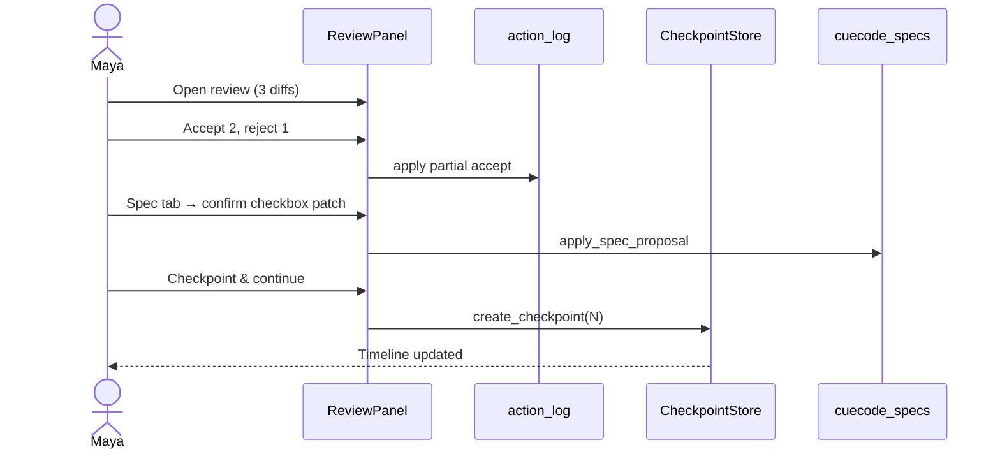

### ASCII: unified review panel

```
┌─────────────────────────────────────────────────────────────────────────────┐
│ Review — Turn 7                                          [× Close]          │
├─────────────────────────────────────────────────────────────────────────────┤
│ [Plan] [Diffs ●3] [Terminal] [Spec ●1]                                      │
├─────────────────────────────────────────────────────────────────────────────┤
│  crates/agent_ui/src/conversation_view.rs        [Accept] [Reject]        │
│  ─────────────────────────────────────────────────────────────────────────  │
│  -    spawn_thread(...);                                                   │
│  +    spawn_thread(..., intent);                                           │
│                                                                             │
│  crates/cuecode_sandbox/src/checkpoint.rs        [Accept] [Reject]        │
│  ...                                                                        │
├─────────────────────────────────────────────────────────────────────────────┤
│ [Reject all]  [Accept selected (2)]  [Accept all]  [Checkpoint & continue] │
└─────────────────────────────────────────────────────────────────────────────┘
```

### Review happy / unhappy paths

| Path | Trigger | Result |
|------|---------|--------|
| Happy | Accept all | Edits applied; trust positive signal; checkpoint optional |
| Happy | Accept selected | Partial apply; rejected hunks discarded |
| Unhappy | Reject all | `action_log` rewind; plan may revert entries |
| Unhappy | Close review without action | Pending badge remains; agent blocked from new edits until resolved |
| Unhappy | Spec write conflict | Diff3 shown; user must resolve before accept |

---

## Connection to innovations {#innovations-link}

This spec is the foundation for [05-innovations](./05-innovations):

| Innovation | Sandbox core anchor |
|------------|---------------------|
| SDAL | [Spec integration](#spec-integration) |
| Intent Switcher | [Intent profiles](#intent-profiles) |
| Trust graph | [Isolation](#isolation) + permissions layers |
| Multi-lane | [Orchestrate intent](#intent-orchestrate) + session model |
| Checkpoint stack | [Review surface](#review) + lifecycle CHECKPOINT |
| Unified Review | [Review surface](#review) |
| Terminal replay | Session terminals + review Terminal tab |
| Context budget | Lifecycle COMPACT phase |
| Skills + specs | Spec integration + `agent_skills` |
| Zero-account | Session CONFIGURE — local model default ([03-fork-and-rebrand](./03-fork-and-rebrand)) |
| Composer-first | Session-first UX ([09-ui-ux-spec](../design/09-ui-ux-spec)) |

---

## Rust crate mapping (implementation index) {#rust-mapping}

| Concern | Crate | Key files / symbols |
|---------|-------|---------------------|
| Session entity | `acp_thread` | `AcpThread`, `update_plan`, terminals |
| Agent loop | `agent` | `native_agent_server`, `tools/*`, `sandboxing.rs` |
| Agent UI | `agent_ui` | `agent_panel.rs`, `conversation_view.rs`, `agent_diff` |
| Settings | `agent_settings` | `tool_permissions` |
| Action tracking | `action_log` | edit batches, reject |
| **New** spec index | `cuecode_specs` | `SpecIndex`, watcher, plan sync |
| **New** sandbox policy | `cuecode_sandbox` | `Intent`, `IntentProfile`, checkpoints |
| Optional UI widgets | `cuecode_ui` | intent switcher, review shell, timeline |
| Skills | `agent_skills` | `.cursor/skills/` loader |
| Paths / config dir | `paths` | `APP_NAME = "CueCode"` |

Phased delivery: [07-implementation-roadmap](../delivery/07-implementation-roadmap).

---

## Metrics (sandbox-specific) {#metrics}

See [11-metrics-and-success](../ops/11-metrics-and-success). Sandbox core adds:

| Event | Use |
|-------|-----|
| `intent_change` | Profile adoption |
| `spec_link` | SDAL funnel |
| `review_open` / `review_accept_rate` | Review UX quality |
| `checkpoint_create` / `checkpoint_restore` | Rewind trust |
| `sandbox_denial` | Policy tuning |

---

## Acceptance criteria (Gherkin) {#acceptance-gherkin}

Feature definitions for sandbox core. Each scenario is independently testable in dogfood.

### Session lifecycle {#gherkin-lifecycle}

```gherkin
Feature: Session lifecycle visibility
  As Maya
  I want to always know my session phase
  So that I never wonder if edits are pending

  Scenario: Happy path — Fix session reaches review
    Given a new session with intent "Fix"
    And the spec index has loaded successfully
    When the agent completes a turn with pending file edits
    Then the session header shows phase "REVIEW PENDING"
    And the review badge displays the pending diff count

  Scenario: Unhappy path — spec index fails at load
    Given a worktree with a corrupted `.cursor/specs/` file
    When the user starts a new session
    Then the session phase shows "Failed"
    And the user sees "Couldn't load specs" with a Retry action
    And no agent turn starts until the user retries or continues without specs
```

### Intent profiles {#gherkin-intents}

```gherkin
Feature: Intent profile enforcement
  As Jordan
  I want intent to hard-deny tools at the permission layer
  So that Explore mode cannot silently write files

  Scenario: Explore blocks edit_file
    Given an active session with intent "Explore"
    When the agent requests tool "edit_file"
    Then the tool is denied before execution
    And the UI shows "Explore mode is read-only. Switch to Fix?"
    And analytics event "sandbox_denial" fires with reason "intent_explore"

  Scenario: Fix allows worktree writes
    Given an active session with intent "Fix"
    And sandbox is enabled on a supported platform
    When the agent requests "edit_file" under the worktree root
    Then the tool proceeds without intent denial
    And the sandbox badge shows "write:worktree"

  Scenario: Ship requires confirm on git push
    Given an active session with intent "Ship"
    When the agent requests "git push"
    Then a confirm dialog appears
    And trust graph cannot auto-allow the push
```

### Spec integration {#gherkin-spec}

```gherkin
Feature: Spec-driven session context
  As Maya
  I want @spec mentions and plan sync to stay user-confirmed
  So that specs remain the contract

  Scenario: @spec injects full body for one turn
    Given a session with a loaded spec index
    When the user mentions "@spec 04-sandbox-core"
    Then the full spec body is injected for that turn
    And the spec linker shows "04-sandbox-core.md"

  Scenario: Plan checkbox sync requires review confirm
    Given a session linked to a spec with sync_plan enabled
    When the agent marks a plan item complete
    Then the Review panel Spec tab shows a proposed checkbox patch
    And the spec file on disk is unchanged until the user accepts
```

### Review surface {#gherkin-review}

```gherkin
Feature: Unified review panel
  As Alex
  I want plan, diffs, terminal, and spec in one panel
  So that I can accept or reject atomically per turn

  Scenario: Partial accept applies only selected files
    Given a turn with 3 pending file diffs
    When the user accepts 2 files and rejects 1
    Then only 2 files are written to disk
    And the review badge clears when all items are resolved

  Scenario: Checkpoint from review footer
    Given the user has accepted pending edits
    When the user clicks "Checkpoint & continue"
    Then a checkpoint appears on the session timeline
    And analytics event "checkpoint_create" fires
```

### Sandbox isolation {#gherkin-isolation}

```gherkin
Feature: Defense-in-depth sandbox
  As Riley
  I want OS sandbox + intent + trust layers stacked
  So that a single misconfiguration cannot escalate privileges

  Scenario: Hard deny blocks .env write even in Fix
    Given intent "Fix" with trust rules allowing "edit_file"
    When the agent requests edit to ".env"
    Then the request is hard-denied
    And the error catalog entry "ERR_FS_SECRET_PATH" is shown

  Scenario: Terminal sandbox on Fix macOS
    Given intent "Fix" on macOS with SandboxingFeatureFlag enabled
    When the agent runs a terminal command
    Then Seatbelt policy applies
    And the sandbox badge shows platform backend "Seatbelt"
```

---

## UI copy deck {#ui-copy-deck}

Exact user-facing strings for sandbox core surfaces. Use verbatim unless i18n layer exists.

### Intent switcher {#copy-intent-switcher}

| Key | String |
|-----|--------|
| `intent.label` | Intent |
| `intent.explore` | Explore |
| `intent.fix` | Fix |
| `intent.ship` | Ship |
| `intent.review` | Review |
| `intent.orchestrate` | Orchestrate |
| `intent.switch_confirm_title` | Switch intent? |
| `intent.switch_confirm_body` | You have {n} pending review items. Reject them before switching, or stay on {current}. |
| `intent.switch_confirm_reject` | Reject pending & switch |
| `intent.switch_confirm_cancel` | Stay on {current} |
| `intent.denial_cta` | Explore mode is read-only. Switch to Fix? |
| `intent.denial_cta_action` | Switch to Fix |

### Review panel {#copy-review-panel}

| Key | String |
|-----|--------|
| `review.title` | Review — Turn {n} |
| `review.tab.plan` | Plan |
| `review.tab.diffs` | Diffs |
| `review.tab.terminal` | Terminal |
| `review.tab.spec` | Spec |
| `review.badge` | Review ●{n} |
| `review.accept_all` | Accept all |
| `review.reject_all` | Reject all |
| `review.accept_selected` | Accept selected ({n}) |
| `review.checkpoint_continue` | Checkpoint & continue |
| `review.empty` | No pending changes this turn |
| `review.close_unresolved` | Resolve pending changes before closing |

### Checkpoints {#copy-checkpoints}

| Key | String |
|-----|--------|
| `checkpoint.timeline_title` | Checkpoints |
| `checkpoint.now` | Turn {n} — now |
| `checkpoint.entry` | Turn {n} — {summary} |
| `checkpoint.restore` | Restore Turn {n} |
| `checkpoint.restore_git` | Also restore git HEAD |
| `checkpoint.created_toast` | Checkpoint saved — Turn {n} |
| `checkpoint.restore_confirm_title` | Restore checkpoint? |
| `checkpoint.restore_confirm_body` | This rewinds file edits and plan state to Turn {n}. Unsaved editor changes may be lost. |
| `checkpoint.preview` | Preview changes |

### Spec linker {#copy-spec-linker}

| Key | String |
|-----|--------|
| `spec.link_label` | Spec |
| `spec.link_none` | none |
| `spec.link_picker_placeholder` | Link a spec… |
| `spec.sync_plan_on` | Plan ↔ Spec sync ON |
| `spec.sync_plan_off` | Plan ↔ Spec sync OFF |
| `spec.mention_empty` | No specs in this project. Add `.cursor/specs/` or use /write-spec. |
| `spec.proposal_title` | Proposed spec update |
| `spec.proposal_accept` | Accept spec change |
| `spec.proposal_reject` | Reject spec change |
| `spec.conflict_title` | Spec changed on disk |
| `spec.conflict_body` | The spec file changed outside this session. Resolve the conflict before accepting. |

### Session header / sandbox badge {#copy-session-header}

| Key | String |
|-----|--------|
| `session.phase.configuring` | CONFIGURING |
| `session.phase.loading` | Loading specs… |
| `session.phase.running` | RUNNING |
| `session.phase.review_pending` | REVIEW PENDING |
| `session.phase.compacting` | Compacting context… |
| `session.sandbox.read_only` | Sandbox 🔒 read-only |
| `session.sandbox.fix` | Sandbox 🔒 net:{net} write:{fs} |
| `session.sandbox.net_off` | off |
| `session.sandbox.net_allowlist` | allowlist |
| `session.sandbox.write_none` | none |
| `session.sandbox.write_worktree` | worktree |

---

## Analytics events {#analytics-events}

Sandbox-specific telemetry. All events opt-in per [11-metrics](../ops/11-metrics-and-success). Properties use snake_case.

| Event | Trigger | Properties | Notes |
|-------|---------|------------|-------|
| `session_create` | New thread opened | `intent`, `has_linked_spec`, `worktree_id_hash` | Fires once per session |
| `session_phase_change` | Lifecycle transition | `from`, `to`, `session_id_hash` | Includes Failed → Configuring |
| `intent_change` | User switches intent | `from`, `to`, `had_pending_review`, `rejected_pending` | |
| `spec_index_load` | Index build completes | `entry_count`, `duration_ms`, `error` | `error` null on success |
| `spec_link` | User links spec to session | `spec_path_hash`, `sync_plan` | |
| `spec_mention` | User @spec in composer | `spec_path_hash`, `resolved` | |
| `spec_proposal_show` | Spec tab shows patch | `spec_path_hash`, `hunk_count` | |
| `spec_proposal_accept` | User accepts spec write | `spec_path_hash` | |
| `spec_proposal_reject` | User rejects spec write | `spec_path_hash` | |
| `review_open` | Review panel opened | `pending_file_count`, `pending_spec_count`, `turn` | |
| `review_accept` | Accept all/selected | `files_accepted`, `files_rejected`, `turn` | |
| `review_reject_all` | Reject all | `files_count`, `turn` | |
| `review_accept_rate` | Derived metric | — | `accepts / opens` rolling 7d |
| `checkpoint_create` | Checkpoint saved | `turn`, `file_count`, `has_git_head` | |
| `checkpoint_restore` | User restores | `target_turn`, `include_git`, `success` | |
| `checkpoint_restore_fail` | Restore error | `error_code`, `target_turn` | |
| `sandbox_denial` | Tool blocked | `tool`, `reason`, `intent` | reason: intent, trust, hard_deny, os_sandbox |
| `sandbox_badge_open` | User opens badge detail | `intent`, `platform_backend` | |
| `terminal_rerun` | Re-run from review | `command_index`, `exit_code_prior` | Fix intent only |
| `compact_triggered` | Auto or manual compact | `manual`, `tokens_before`, `tokens_after` | |

---

## Manual QA scripts {#manual-qa}

Numbered scripts for alpha dogfood. Run on macOS or Linux with SandboxingFeatureFlag on.

### QA-04-01: Fix session happy path {#qa-fix-happy}

1. Open CueCode on a repo with `.cursor/specs/`.
2. Create new session; select intent **Fix**.
3. Confirm sandbox badge shows `net:allowlist write:worktree`.
4. Send: "List files in crates/agent_ui/src".
5. Send: "Add a one-line comment to conversation_view.rs (harmless)".
6. Wait for turn complete; confirm review badge **●1**.
7. Open Review → Diffs; accept the change.
8. Click **Checkpoint & continue**; confirm timeline entry.
9. Verify file on disk matches accepted diff.

### QA-04-02: Explore write denial {#qa-explore-deny}

1. New session; intent **Explore**.
2. Send: "Refactor agent_panel.rs to use fewer clones".
3. When agent requests `edit_file`, confirm denial toast.
4. Confirm CTA **Switch to Fix** appears.
5. Tap CTA; confirm intent changes to Fix without pending review.
6. Retry message; confirm edit proceeds to review.

### QA-04-03: Spec link and plan sync {#qa-spec-sync}

1. New session; intent **Fix**.
2. Link spec `04-sandbox-core.md`; enable Plan ↔ Spec sync.
3. Ask agent to mark first unchecked task in spec plan as done (if any).
4. Open Review → Spec tab; confirm proposed checkbox patch.
5. Reject spec patch; confirm spec file unchanged on disk.
6. Re-run; accept spec patch; confirm checkbox updated in file.

### QA-04-04: Partial review accept {#qa-partial-review}

1. Fix session; prompt for edits touching 2+ files.
2. Open Review; accept file A, reject file B.
3. Confirm only file A changed on disk.
4. Confirm review badge clears.
5. Confirm `review_accept` analytics (if metrics enabled).

### QA-04-05: Checkpoint restore {#qa-checkpoint-restore}

1. Complete QA-04-01 through checkpoint at Turn N.
2. Send prompt causing a bad edit; accept in review.
3. Open checkpoint timeline; select Turn N.
4. Preview restore; confirm diff preview shows rollback.
5. Restore without git HEAD; confirm files match Turn N state.
6. Confirm plan entries match Turn N snapshot.

### QA-04-06: Ship push confirm {#qa-ship-push}

1. Intent **Ship**; ask agent to prepare commit (no push).
2. Ask agent to `git push` (test branch only).
3. Confirm confirm dialog; deny once.
4. Confirm push did not run.
5. Approve once; confirm push runs or simulates per environment.

### QA-04-07: Session load failure recovery {#qa-load-fail}

1. Temporarily rename `.cursor/specs` to break index.
2. Start session; confirm "Couldn't load specs" + Retry.
3. Restore folder name; tap Retry.
4. Confirm index loads and phase advances to RUNNING.

---

## Error message catalog {#error-catalog}

User-facing text and recovery actions. Error codes stable for support and analytics.

| Code | User message | Recovery action |
|------|--------------|-----------------|
| `ERR_SPEC_INDEX_LOAD` | Couldn't load specs. Some features may be limited. | Tap **Retry** or continue without specs; add `.cursor/specs/` to the project |
| `ERR_SPEC_NOT_FOUND` | Spec not found: {path} | Check spelling in @spec picker or create spec via /write-spec |
| `ERR_SPEC_PARSE` | Spec "{title}" has invalid frontmatter. Indexed by path only. | Fix YAML frontmatter; warning stays until file saved |
| `ERR_SPEC_WRITE_CONFLICT` | Spec changed on disk. Resolve conflict before accepting. | Open Spec tab diff3 view; merge manually or reject proposal |
| `ERR_SPEC_WRITE_FAILED` | Couldn't save spec update. | Check file permissions; retry Accept; backup at {backup_path} |
| `ERR_INTENT_PENDING_REVIEW` | Finish review before switching intent. | Accept or reject pending items, or use "Reject pending & switch" |
| `ERR_TOOL_INTENT_DENY` | {intent} mode doesn't allow {tool}. | Switch intent via CTA or rephrase request for read-only analysis |
| `ERR_TOOL_HARD_DENY` | This action is never allowed ({reason}). | Remove secrets/force-push from request; edit manually if needed |
| `ERR_SANDBOX_NETWORK` | Network blocked for this host: {host} | Add host to allowlist in settings or approve once |
| `ERR_SANDBOX_TERMINAL` | Command blocked by sandbox policy. | Switch to Fix intent or adjust sandbox settings |
| `ERR_CHECKPOINT_CREATE` | Couldn't save checkpoint. | Retry; check disk space under ~/.local/share/cuecode/checkpoints |
| `ERR_CHECKPOINT_RESTORE` | Couldn't restore checkpoint Turn {n}. | Preview failed hunks; restore without git; see QA-04-05 |
| `ERR_CHECKPOINT_DIRTY_GIT` | Worktree has uncommitted changes. Git restore skipped. | Commit or stash; retry with git option unchecked |
| `ERR_SESSION_MODEL` | Couldn't reach model provider. | Check Ollama/LM Studio URL in settings; Test connection |
| `ERR_SESSION_ARCHIVE` | Session is read-only (archived). | Start a new session from sidebar |

---

## Settings JSON examples {#settings-examples}

Full example files for CueCode sandbox-related settings. Paths per [06-system-design §data-dirs](./06-system-design#data-dirs).

### `~/.config/cuecode/settings.json` {#settings-main}

```json
{
  "agent": {
    "single_file_review": false,
    "auto_compact": true,
    "tool_permissions": {
      "default": "confirm",
      "patterns": [
        { "tool": "edit_file", "path": "**/.env", "permission": "deny" },
        { "tool": "edit_file", "path": "**/secrets/**", "permission": "deny" },
        { "tool": "terminal", "pattern": "git push --force*", "permission": "deny" }
      ]
    }
  },
  "cuecode": {
    "layout": {
      "composer_first": true
    },
    "sandbox": {
      "default_intent": "Fix",
      "remember_intent_per_worktree": true,
      "ship_verification_lane": true
    },
    "specs": {
      "root": ".cursor/specs",
      "inject_index_in_prompt": true,
      "max_index_bytes": 4096
    },
    "checkpoints": {
      "max_per_session": 50,
      "include_git_head_default": false
    },
    "metrics": {
      "opt_in": false
    }
  },
  "language_models": {
    "default_provider": "ollama",
    "ollama": {
      "api_url": "http://127.0.0.1:11434"
    }
  }
}
```

### `~/.config/cuecode/intent_profiles.json` {#settings-intent-profiles}

```json
{
  "version": 1,
  "profiles": {
    "Explore": {
      "network": "off",
      "fs_write": "none",
      "sandbox_enabled": false,
      "default_execution": "Async",
      "network_allowlist": []
    },
    "Fix": {
      "network": "allowlist",
      "fs_write": "worktree",
      "sandbox_enabled": true,
      "default_execution": "Active",
      "network_allowlist": [
        "crates.io",
        "index.crates.io",
        "registry.npmjs.org"
      ]
    },
    "Ship": {
      "network": "allowlist",
      "fs_write": "worktree",
      "sandbox_enabled": true,
      "default_execution": "Hybrid",
      "network_allowlist": [
        "crates.io",
        "github.com",
        "api.github.com"
      ],
      "confirm_git_push": true
    },
    "Review": {
      "network": "off",
      "fs_write": "none",
      "sandbox_enabled": false,
      "default_execution": "Active"
    },
    "Orchestrate": {
      "network": "allowlist",
      "fs_write": "none",
      "sandbox_enabled": false,
      "default_execution": "Hybrid",
      "network_allowlist": ["crates.io"]
    }
  },
  "overrides": {}
}
```

### `~/.config/cuecode/trust/<repo_hash>.json` {#settings-trust-example}

```json
{
  "version": 1,
  "repo_hash": "a1b2c3d4",
  "rules": [
    {
      "tool": "terminal",
      "pattern": "cargo test *",
      "promoted_at": "2025-06-10T14:22:00Z",
      "evidence_count": 5
    },
    {
      "tool": "edit_file",
      "pattern": "crates/agent_ui/**",
      "promoted_at": "2025-06-12T09:15:00Z",
      "evidence_count": 12
    }
  ],
  "evidence": [],
  "hard_deny": [
    { "tool": "edit_file", "pattern": "**/.env" },
    { "tool": "terminal", "pattern": "git push --force*" }
  ]
}
```

---

## Security threat model (STRIDE-lite) {#threat-model}

Sandbox-specific threats. Complements [06-system-design §security](./06-system-design#security).

| STRIDE | Threat | Asset | Mitigation | Residual risk |
|--------|--------|-------|------------|---------------|
| **S** Spoofing | Malicious skill poses as trusted workflow | User session | Skills still pass tool_permissions; no elevation via skill name | User runs untrusted skill markdown |
| **T** Tampering | Agent edits secrets or force-pushes | Repo + secrets | Hard deny list; Ship confirm on push | User manual override outside agent |
| **R** Repudiation | User cannot audit what agent did | Session history | action_log, terminal recordings, checkpoints | External terminal outside CueCode |
| **I** Information disclosure | Prompt injection exfiltrates code via network | Source code | Explore net off; Fix allowlist; read scopes | User-added broad allowlist |
| **D** Denial of service | Checkpoint bloat fills disk | Local storage | Prune >50/session; compress snapshots | Very large action_log sessions |
| **E** Elevation | Trust rule too broad auto-allows destructive cmd | Tool execution | Path-prefix required; revoke UI; no spec auto-write | Social engineering "approve all" |

### Threat flow — prompt injection to exfil {#threat-exfil-diagram}

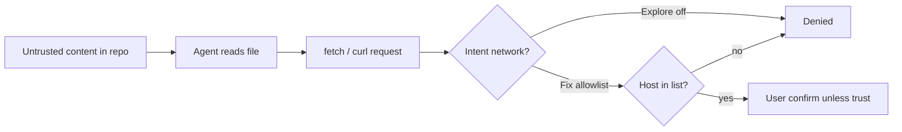

### Trust boundary diagram {#threat-boundaries}

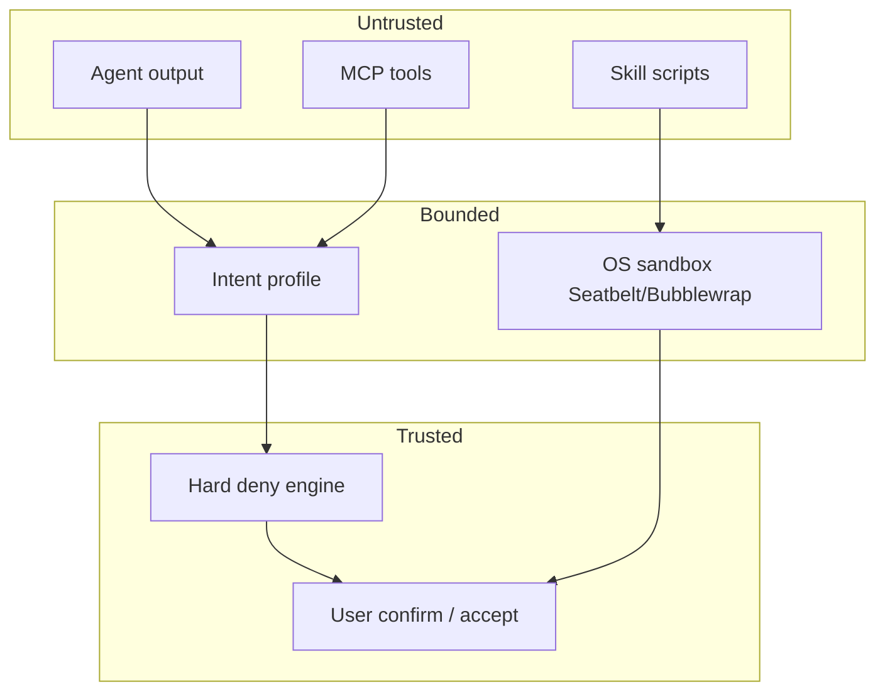

---

## Performance budgets {#performance-budgets}

Targets measured on dogfood hardware: M-series Mac / 16GB RAM, Linux equivalent. P95 unless noted.

| Operation | Target (P95) | Max (P99) | Measurement point | Failure UX |
|-----------|--------------|-----------|-------------------|------------|
| Session create (UI ready) | 200 ms | 500 ms | `ConversationView::new` return | Show spinner >200ms |
| Spec index cold load (50 specs) | 150 ms | 400 ms | `load_spec_index` complete | Phase LOADING chip |
| Spec index warm refresh (1 file) | 30 ms | 80 ms | Watcher event → index bump | None if <80ms |
| `@spec` resolve + read body | 50 ms | 120 ms | Composer pick → inject | Debounce picker |
| Review panel open (10 files) | 300 ms | 800 ms | First paint all tabs | Skeleton tabs |
| Checkpoint create | 250 ms | 600 ms | JSON written + timeline | Toast on success |
| Checkpoint restore (5 files) | 400 ms | 1000 ms | Buffers + plan restored | Preview before apply |
| Checkpoint restore (20 files) | 800 ms | 2000 ms | Large action_log | Progress bar |
| Intent switch apply | 100 ms | 250 ms | `apply_intent` + UI refresh | Block if pending review |
| Trust evaluate (per tool) | 5 ms | 15 ms | Before confirm dialog | Negligible |

### Performance monitoring diagram {#perf-monitoring}

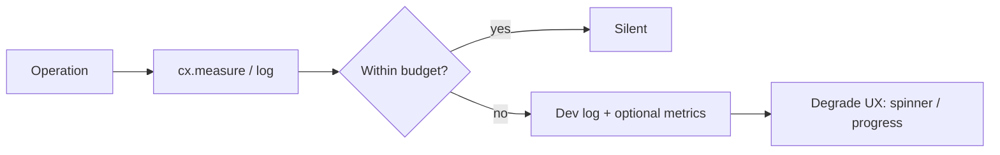

**Regression gate:** CI benchmark smoke on `cuecode_specs` index parse and `cuecode_sandbox` checkpoint round-trip (unit-level, no GPUI).

---

## Out of scope (sandbox v1) {#out-of-scope}

- Full VM / isolated dev container per session → [10-infrastructure](../ops/10-infrastructure)
- Unsandboxed "god mode" as default
- Remote agent execution (SSH agent runs on remote host)
- Autonomous mode without human confirm on destructive actions
- Silent spec overwrites (always confirm in v1)
- Cross-worktree sessions (one session per worktree v1)

Open decisions: [12-open-questions](../ops/12-open-questions).

---

## Cross-reference index {#cross-links}

| Topic | Document |
|-------|----------|
| Vision / north star | [01-vision](./01-vision) |
| Existing Zed agent stack | [02-current-architecture](./02-current-architecture) |
| Rebrand / APP_NAME | [03-fork-and-rebrand](./03-fork-and-rebrand) |
| Product innovations | [05-innovations](./05-innovations) |
| Crate design | [06-system-design](./06-system-design) |
| Phases | [07-implementation-roadmap](../delivery/07-implementation-roadmap) |
| Tools / permissions | [08-agent-tools-and-skills](../agent/08-agent-tools-and-skills) |
| UI details | [09-ui-ux-spec](../design/09-ui-ux-spec) |
| OS sandbox / MCP | [10-infrastructure](../ops/10-infrastructure) |
| Metrics | [11-metrics-and-success](../ops/11-metrics-and-success) |
| Open questions | [12-open-questions](../ops/12-open-questions) |
| AI strategy | [13-ai-maxxing](../agent/13-ai-maxxing) |
| Active / Async / Hybrid | [harness/local/01-agent-harness](../harness/local/01-agent-harness.md) |
