# CueCode Innovations {#innovations}

> **Status:** Draft — highest-priority product differentiators  
> **Related:** [04-sandbox-core](./04-sandbox-core) · [06-system-design](./06-system-design) · [07-implementation-roadmap](../delivery/07-implementation-roadmap) · [13-ai-maxxing](../agent/13-ai-maxxing)

Deliberate product bets that make agentic coding **way easier** — not incremental
improvements to a chat sidebar. Each innovation below includes: user story, before/after,
UI mockup, implementation sketch, metrics, and failure modes.

**Principles:** Session-first · Specs-first · Trust grows · Replayable ([00-README](../00-README.md))

---

## Innovation index {#index}

| # | Innovation | Anchor |
|---|------------|--------|
| 1 | Spec-Driven Agent Loop (SDAL) | {#sdal} |
| 2 | Intent Switcher | {#intent-switcher} |
| 3 | Trust Graph | {#trust-graph} |
| 4 | Multi-Lane Sessions | {#multi-lane} |
| 5 | Checkpoint Stack | {#checkpoint-stack} |
| 6 | Terminal Replay | {#terminal-replay} |
| 7 | Context Budget UI | {#context-budget} |
| 8 | CueCode Skills = Specs + Scripts | {#skills-plus-specs} |
| 9 | Zero-Account Default | {#zero-account} |
| 10 | Composer-First Layout | {#composer-first} |

---

## 1. Spec-Driven Agent Loop (SDAL) {#sdal}

### User story

As **Maya**, when I ask to "implement auth refresh," I want the agent to read or update
a spec in `.cursor/specs/` and produce a plan that maps 1:1 to spec checkboxes, so we
share a contract instead of improvising in chat.

### Before / after

**Before (sidebar-first IDE):**

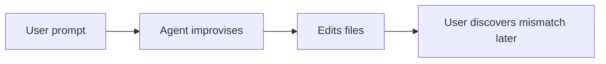

**After (SDAL):**

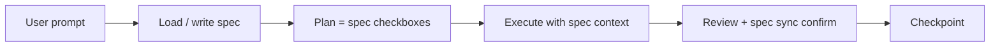

### UI mockup

```
┌─────────────────────────────────────────────────────────────────────────────┐
│ Session linked: .cursor/specs/tasks/auth-refresh.md                         │
├─────────────────────────────────────────────────────────────────────────────┤
│ Plan ↔ Spec sync ON                                                         │
│                                                                             │
│  Plan entry                    Spec checkbox                                │
│  ─────────────────────────────────────────────────                          │
│  ☑ Add refresh token store     ☑ Add refresh token store                   │
│  ☐ Wire agent_settings         ☐ Wire agent_settings                       │
│  ☐ Add GPUI test               ☐ Add GPUI test                             │
│                                                                             │
│  [Open spec]  [Propose spec update on complete]                             │
└─────────────────────────────────────────────────────────────────────────────┘
```

### Implementation sketch

| Layer | Work |
|-------|------|
| `cuecode_specs` | Index, read, propose updates, `sync_plan_to_spec` |
| `agent` | System prompt template: "Non-trivial work starts with spec" |
| `acp_thread` | Hook `update_plan` → spec diff pipeline |
| `agent_ui` | Spec link picker, Review Spec tab |
| Skills | `/implement-spec` skill ([§8](#skills-plus-specs)) |

```rust
// crates/cuecode_specs/src/sync.rs
pub fn plan_entry_to_checkbox(plan_title: &str, doc: &SpecDocument) -> Option<usize>;
pub fn propose_checkbox_toggle(path: &Path, line: usize, checked: bool) -> SpecProposal;
```

### Metrics

| Metric | Target (alpha) |
|--------|----------------|
| Sessions referencing ≥1 spec | >80% dogfood repos |
| Plan items with spec mapping | >70% when spec linked |
| Spec write accept rate | >50% |

See [11-metrics-and-success](../ops/11-metrics-and-success#north-star) — **SDSW** north star.

### Failure modes

| Failure | Mitigation |
|---------|------------|
| Agent ignores specs | Native prompt + tools `list_specs` / `read_spec`; UI shows linked spec |
| Checkbox title drift | Manual mapping UI in review; fuzzy match with confirm |
| Spec write rejected repeatedly | Trust graph does not auto-allow spec writes (v1) |
| ACP external agent bypass | User-visible spec link; native agent primary for SDAL |

**Build on:** `AcpThread::update_plan`, `agent_skills`, `cuecode_specs`  
**Spec:** [04-sandbox-core §spec-integration](./04-sandbox-core#spec-integration)

---

## 2. Intent Switcher {#intent-switcher}

### User story

As **Jordan**, I want one control to switch from researching (Explore) to fixing (Fix)
without opening settings, so the sandbox matches what I'm doing right now.

### Before / after

**Before:**

```
Settings → Agent → Tool permissions → regex patterns → Sandbox flag → ...
(twelve clicks, easy to misconfigure)
```

**After:**

```
[Intent ▼ Explore]  →  one click  →  [Intent ▼ Fix]
(tools + network + FS + prompt + UI visibility)
```

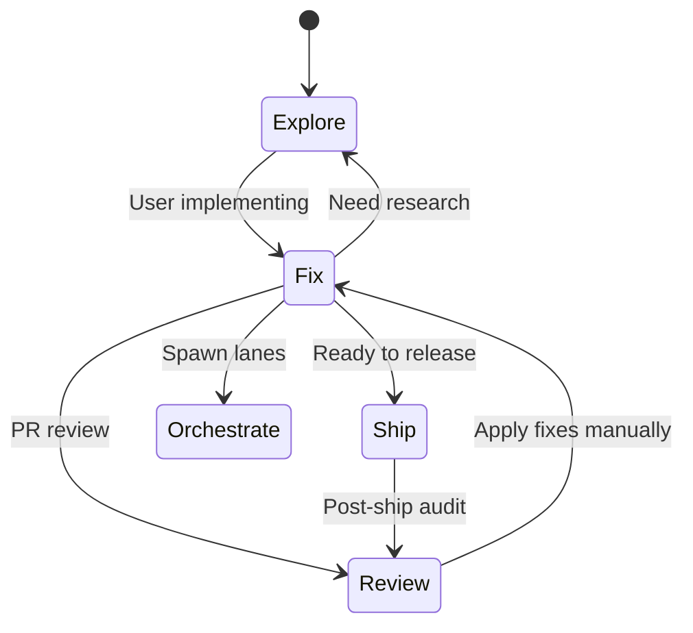

### UI mockup

```
┌─────────────────────────────────────────────────────────────────────────────┐
│ Agent panel header                                                          │
├─────────────────────────────────────────────────────────────────────────────┤
│ ┌─────────────┐  ┌────────────────────────┐  ┌──────────┐                  │
│ │ Intent ▼    │  │ Sandbox 🔒 net:off     │  │ Model ▼  │                  │
│ │ ● Fix       │  │ write:worktree         │  │ local/…  │                  │
│ └─────────────┘  └────────────────────────┘  └──────────┘                  │
│   Explore │ Fix │ Ship │ Review │ Orchestrate                              │
└─────────────────────────────────────────────────────────────────────────────┘
```

Intent change mid-session shows confirm if pending review items exist.

### Implementation sketch

| Component | Location |
|-----------|----------|
| `Intent` enum | `cuecode_sandbox` |
| Profile persistence | `~/.config/cuecode/intent_profiles.json` |
| Permission mapping | `cuecode_sandbox::apply_intent` → `agent_settings` |
| UI control | Extend `agent_ui` mode selector / new `IntentSwitcher` |
| Workspace memory | Last intent per worktree in panel serialization |

```rust
pub fn apply_intent(intent: Intent, session: &mut SandboxSession, cx: &mut App) -> Result<()>;
pub fn intent_tool_rules(intent: Intent) -> ToolPermissionOverlay;
```

### Metrics

| Metric | Target |
|--------|--------|
| Intent switches / session | track; expect >1 for power users |
| Settings opens for permissions | decrease vs baseline Zed |
| Wrong-intent denials | `<5%` of tool calls (user switched quickly) |

### Failure modes

| Failure | Mitigation |
|---------|------------|
| User in Fix but thinks Explore | Persistent sandbox badge + composer placeholder |
| Intent switch with pending review | Block or confirm "Reject pending?" dialog |
| Custom tool_permissions fight intent | Intent overlay documented as layer 2 ([08](../agent/08-agent-tools-and-skills#permissions)) |

**Spec:** [04-sandbox-core §intent-profiles](./04-sandbox-core#intent-profiles)

---

## 3. Trust Graph (progressive auto-approve) {#trust-graph}

### User story

As **Maya**, after the agent successfully runs `cargo test` five times in this repo,
I want those runs auto-approved so confirmation fatigue doesn't kill flow — but never
auto-allow force push or `.env` writes.

### Before / after

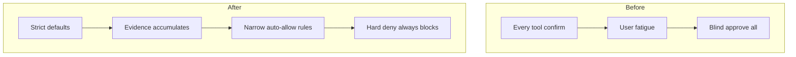

### UI mockup — Trust settings

```
┌─────────────────────────────────────────────────────────────────────────────┐
│ Settings → Agent → Trust — repo: CueCode-Agents                           │
├─────────────────────────────────────────────────────────────────────────────┤
│ Auto-allow rules (3)                                                        │
│                                                                             │
│  ✓ terminal: cargo test *        evidence: 5 success   [Revoke]            │
│  ✓ edit_file: crates/agent_ui/** evidence: 12 accepts  [Revoke]            │
│  ✓ read_file: **                 evidence: always       [Revoke]            │
│                                                                             │
│ Hard deny (never auto-allow): .env, secrets/, git push --force              │
│                                                                             │
│ [Revoke all for this repo]                                                  │
└─────────────────────────────────────────────────────────────────────────────┘
```

Inline confirm dialog shows "Auto-allowed by trust rule" with [Revoke rule] link.

### Implementation sketch

**Data:** `~/.config/cuecode/trust/<repo_hash>.json`

```rust
pub struct TrustStore {
    pub rules: Vec<TrustRule>,
    pub evidence: Vec<TrustEvidence>,
}

pub struct TrustRule {
    pub pattern: ToolPattern,
    pub promoted_at: DateTime<Utc>,
    pub evidence_count: u32,
}

pub fn evaluate_trust(tool: &ToolRequest, store: &TrustStore) -> TrustDecision;
// Called between intent profile and confirm prompt
```

**Signals:**

- Positive: user accept, successful terminal exit, checkpoint without rewind
- Negative: reject, rewind, failed verification, user "deny always"

Hook: `action_log` accept/reject, review UI, terminal metadata.

### Metrics

| Metric | Target |
|--------|--------|
| Trust promotions / repo / week | track |
| Confirm prompts saved | increase over time |
| Bad auto-allow (user revokes within 1h) | <2% |

### Failure modes

| Failure | Mitigation |
|---------|------------|
| Over-broad rule | Path-prefix + tool kind required; no repo-wide push |
| Agent exploits trust | Hard deny list; spec writes never auto |
| Stale rules after refactor | Revoke UI + evidence display |
| Shared machine trust bleed | Repo hash includes remote URL hash |

**Spec:** [04-sandbox-core §isolation](./04-sandbox-core#isolation) · [06-system-design §security](./06-system-design#security)

---

## 4. Multi-Lane Sessions {#multi-lane}

### User story

As **Sam**, I want an Explore lane surveying APIs while a Fix lane implements in parallel,
without write fights in one thread, so exploration and implementation don't block each other.

### Before / after

```
BEFORE: Single thread — read tools interleave with edits; context pollution; permission confusion

AFTER:
  Coordinator (Orchestrate)
    ├─ Lane A: Explore — read-only — Async
    └─ Lane B: Implement — Fix rules — Active
  Shared: spec index, project LSP
  Isolated: write permissions, action_log per lane
```

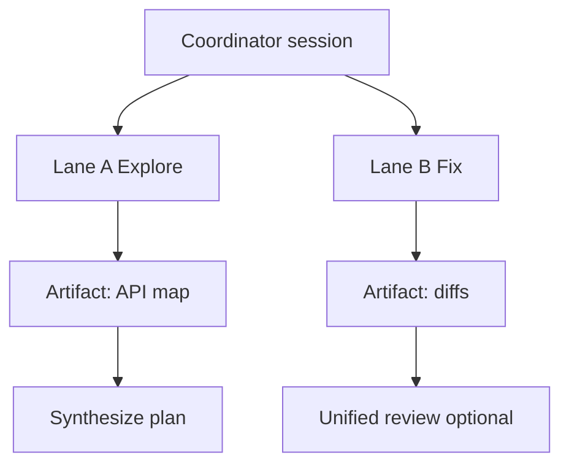

### UI mockup

```
┌─────────────────────────────────────────────────────────────────────────────┐
│ Lanes                                                           [+ Spawn]   │
├─────────────────────────────────────────────────────────────────────────────┤
│ ● Main — Orchestrate — Hybrid                                               │
│ ○ Explorer — Explore — Async — done — "12 files mapped"                     │
│ ◉ Implementer — Fix — Active — running tool: cargo test                     │
├─────────────────────────────────────────────────────────────────────────────┤
│ [Focus lane ▼]  [Merge artifact to plan]  [Open lane review]              │
└─────────────────────────────────────────────────────────────────────────────┘
```

### Implementation sketch

| Piece | Location |
|-------|----------|
| Spawn | `agent::spawn_agent_tool`, `create_thread` |
| Parent link | `AcpThread.parent_session_id` (extend serialization) |
| Retained threads | `AgentPanel.retained_threads` |
| Lane intent | `cuecode_sandbox::LaneConfig { intent, execution }` |
| Built-in agents | [08 §builtin-agents](../agent/08-agent-tools-and-skills#builtin-agents) |

```rust
pub struct LaneHandle {
    pub session_id: ThreadId,
    pub intent: Intent,
    pub execution: ExecutionContext,
    pub write_enabled: bool,
}
```

### Metrics

| Metric | Target |
|--------|--------|
| Multi-lane sessions / power users | track adoption |
| Lane artifact merge rate | >60% Orchestrate sessions |
| Cross-lane write conflict | 0 (permissions) |

### Failure modes

| Failure | Mitigation |
|---------|------------|
| Duplicate edits two lanes | Fix lane only writes; Explore hard deny |
| Coordinator edits anyway | Orchestrate intent denies edit_file |
| Orphan background lane | Notification + auto-archive after TTL |
| Context duplication | Explore lane `omit_spec_index: true` option ([local harness](../harness/local/01-agent-harness.md)) |

---

## 5. Checkpoint Stack {#checkpoint-stack}

### User story

As **Maya**, I want **Rewind** to restore file state, plan snapshot, and optional git
HEAD — not just reject the last edit batch — so I can undo an entire agent turn confidently.

### Before / after

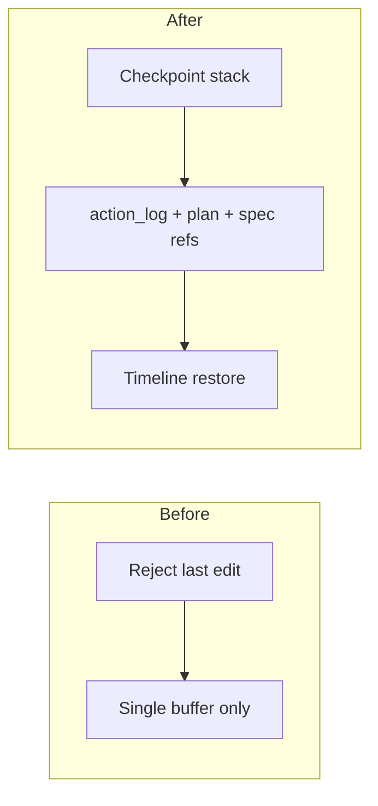

### UI mockup — checkpoint timeline

```
┌──────────────────────────┐
│ Checkpoints              │
├──────────────────────────┤
│ ● Turn 9 — now           │
│ ○ Turn 8 — 2 files OK  │ ← click preview
│ ○ Turn 5 — tests pass  │
│ ○ Session start        │
├──────────────────────────┤
│ [Restore Turn 8]         │
│ ☐ Also restore git HEAD  │
└──────────────────────────┘
```

Review footer: **Checkpoint & continue** creates snapshot before next turn.

### Implementation sketch

**Store:** `~/.local/share/cuecode/checkpoints/<session_id>/*.json`

```rust
pub struct Checkpoint {
    pub id: CheckpointId,
    pub created_at: DateTime<Utc>,
    pub action_log_snapshot: ActionLogSnapshot,
    pub plan: Option<PlanSnapshot>,
    pub spec_refs: Vec<SpecRefSnapshot>,
    pub git_head: Option<String>,
    pub summary: String,
}

pub fn create_checkpoint(session: &SandboxSession) -> Result<Checkpoint>;
pub fn restore_checkpoint(id: CheckpointId, opts: RestoreOptions) -> Result<()>;
```

**Build on:** `action_log`, `AcpThread` git_store hooks, `cuecode_sandbox`

### Metrics

| Metric | Target |
|--------|--------|
| Checkpoints created / session | track |
| Restore rate | <20% ([11-metrics](../ops/11-metrics-and-success)) |
| Restore success (no manual fix) | >90% |

### Failure modes

| Failure | Mitigation |
|---------|------------|
| Git restore conflicts | Optional git; warn if dirty worktree |
| Large checkpoint storage | Prune >50 per session; compress action_log |
| Partial restore | Preview diff before confirm |
| External edits during session | Checkpoint scope = agent edits + plan only |

**Spec:** [04-sandbox-core §review](./04-sandbox-core#review) · Phase 3 [07](../delivery/07-implementation-roadmap#phase-3)

---

## 6. Terminal Replay {#terminal-replay}

### User story

As **Riley**, when agent tests fail, I want to re-run from command N or fork output
into a new lane, so debugging agent work is replay — not re-prompting from scratch.

### Before / after

```
BEFORE: Scroll terminal history in chat; copy-paste commands manually

AFTER: Structured TerminalSession log → re-run cmd #3 → fork to new Fix lane
```

### UI mockup — Terminal tab in review

```
┌─────────────────────────────────────────────────────────────────────────────┐
│ Terminal — Turn 7                                                           │
├─────────────────────────────────────────────────────────────────────────────┤
│ #1  cargo check                                      exit 0    [Re-run]     │
│ #2  cargo test agent_ui                              exit 1    [Re-run]     │
│ #3  cargo test conversation_view -- --nocapture      exit 1    [Re-run]     │
├─────────────────────────────────────────────────────────────────────────────┤
│ [Fork from #2 → new Fix lane]  [Copy all]                                   │
└─────────────────────────────────────────────────────────────────────────────┘
```

### Implementation sketch

| Source | Use |
|--------|-----|
| `AcpThread.pending_terminal_output` | Stream capture |
| `terminal_thread_metadata_store` | Command boundaries, exit codes |
| `cuecode_sandbox` | `TerminalRecording`, replay API |

```rust
pub struct TerminalRecording {
    pub commands: Vec<RecordedCommand>,
}
pub struct RecordedCommand {
    pub index: u32,
    pub argv: Vec<String>,
    pub cwd: PathBuf,
    pub exit_code: Option<i32>,
    pub sandbox_policy: SandboxPolicy,
}
```

### Metrics

| Metric | Target |
|--------|--------|
| Re-run from review | track |
| Fork to lane success | >85% |
| Time saved vs re-prompt | qualitative dogfood |

### Failure modes

| Failure | Mitigation |
|---------|------------|
| Sandbox policy changed | Re-run uses current Fix policy; warn if different |
| Non-idempotent commands | Confirm before re-run push/deploy |
| Missing metadata (ACP agent) | Best-effort parse; degrade gracefully |

---

## 7. Context Budget UI {#context-budget}

### User story

As **Jordan**, I want to see context usage by category (specs, files, chat, tools) and
drop low-value chunks before auto-compact, so the agent stays coherent in long sessions.

### Before / after

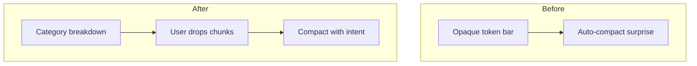

### UI mockup

```
┌─────────────────────────────────────────────────────────────────────────────┐
│ Context 68% ████████████████░░░░░░  [Manage…]                               │
├─────────────────────────────────────────────────────────────────────────────┤
│  Specs          18%  [Drop lowest…]                                         │
│  Files          31%  @spec 04, read_file x12                                │
│  Chat history   22%                                                         │
│  Tool output    29%  terminal logs                                          │
│                                                                             │
│  [Drop selected]  [Compact now]  [Auto-compact at 85% ✓]                  │
└─────────────────────────────────────────────────────────────────────────────┘
```

### Implementation sketch

| Piece | Location |
|-------|-----|
| Token accounting | Extend `agent` context assembly |
| UI bar | `agent_ui` or `cuecode_ui` |
| Drop actions | Remove tool results / old turns with confirm |
| Settings | `agent.auto_compact` in `default.json` |

```rust
pub struct ContextBudget {
    pub categories: Vec<ContextCategory>,
    pub total_tokens: u64,
    pub limit_tokens: u64,
}
pub struct ContextCategory {
    pub kind: ContextKind, // Specs | Files | Chat | Tools
    pub tokens: u64,
    pub droppable_chunks: Vec<ChunkId>,
}
```

### Metrics

| Metric | Target |
|--------|--------|
| Manual drop before compact | increase |
| Auto-compact events / long session | decrease over time |
| Post-compact accept rate | stable or up |

### Failure modes

| Failure | Mitigation |
|---------|------------|
| User drops critical spec | Confirm dialog; pinned specs immune |
| Miscategorization | Heuristic labels; refine in dogfood |
| Local model no token API | Character-based estimate with disclaimer |

---

## 8. CueCode Skills = Specs + Scripts {#skills-plus-specs}

### User story

As **Maya**, I want `/implement-spec` to load a spec, generate a plan, and execute the
checklist with sandbox scripts bundled in the skill, so repeatable workflows are one slash away.

### Before / after

```
BEFORE: Skills = markdown playbooks only; specs disconnected

AFTER: Skill manifest references spec path + optional sandbox scripts
       /implement-spec → read_spec → plan → SDAL loop
```

### UI mockup — skill invocation

```
┌─────────────────────────────────────────────────────────────────────────────┐
│ /implement-spec 04-sandbox-core.md                                          │
├─────────────────────────────────────────────────────────────────────────────┤
│ Skill: implement-spec                                                       │
│ Spec:  04-sandbox-core.md (linked)                                          │
│ Intent: Fix (skill override allowed)                                        │
│                                                                             │
│ Plan generated: 8 items from spec checkboxes                                │
│ [Run]  [Edit plan first]                                                    │
└─────────────────────────────────────────────────────────────────────────────┘
```

### Implementation sketch

**Ship default skills** (`.cursor/skills/`):

| Skill | Behavior |
|-------|----------|
| `implement-spec` | Load spec → plan → execute checklist |
| `explore-codebase` | Explore intent + map structure |
| `review-changes` | Review intent + diff focus |
| `write-spec` | Draft new spec from template |

Extend `agent_skills` manifest:

```yaml
# SKILL.md frontmatter (proposed)
spec_paths:
  - .cursor/specs/templates/feature.md
sandbox_scripts:
  - scripts/verify.sh
default_intent: Fix
```

**Build on:** `skill` tool, [08-agent-tools-and-skills](../agent/08-agent-tools-and-skills)

### Metrics

| Metric | Target |
|--------|--------|
| Slash skill usage / session | track |
| implement-spec completion rate | >40% started skills |
| Skill → spec link rate | >90% for implement-spec |

### Failure modes

| Failure | Mitigation |
|---------|------------|
| Script escapes sandbox | Scripts run with same terminal sandbox as Fix |
| Skill bypasses permissions | Tools still evaluated via permission layers |
| Stale skill spec path | Skill validation on project open |

---

## 9. Zero-Account Default {#zero-account}

### User story

As **Jordan** on first launch, I want to pick a local model (Ollama / LM Studio /
OpenAI-compatible URL) and send an agent prompt immediately — no zed.dev sign-in wall.

### Before / after

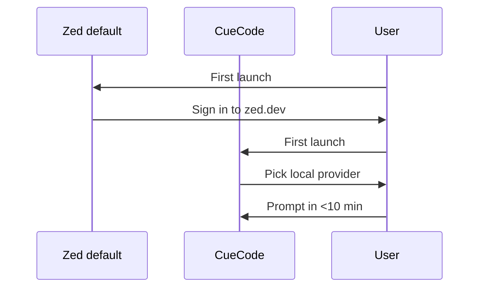

### UI mockup — CueCode onboarding

```
┌─────────────────────────────────────────────────────────────────────────────┐
│ Welcome to CueCode                                                          │
├─────────────────────────────────────────────────────────────────────────────┤
│  Choose your model provider:                                                │
│                                                                             │
│  (●) Ollama          http://127.0.0.1:11434                                │
│  ( ) LM Studio       http://127.0.0.1:1234/v1                              │
│  ( ) OpenAI-compatible URL…                                                 │
│  ( ) Remote API key (optional)                                              │
│                                                                             │
│  No account required for core agent workflows.                              │
│                                                                             │
│  [Continue]                                                                 │
└─────────────────────────────────────────────────────────────────────────────┘
```

### Implementation sketch

| Task | Location |
|------|----------|
| Remove account gate | `onboarding`, strip `ai_onboarding` requirements |
| Default model | `assets/settings/default.json` → local provider |
| Cloud stub | `client` — no required `server_url` for agent |
| Hide Zed Pro UI | `zed` menus, `collab_ui` disabled |

**Phase:** 0 — [07-implementation-roadmap](../delivery/07-implementation-roadmap#phase-0)  
**Spec:** [03-fork-and-rebrand](./03-fork-and-rebrand)

### Metrics

| Metric | Target |
|--------|--------|
| First prompt within 10 min | >70% |
| Local model success without cloud | >90% |
| Accidental Zed config write | 0 |

### Failure modes

| Failure | Mitigation |
|---------|------------|
| Ollama not running | Clear error + link to docs |
| Wrong API URL | Test connection button in onboarding |
| User wants Zed cloud | Optional path; not default |

---

## 10. Composer-First Layout {#composer-first}

### User story

As **Maya**, I want the agent panel to dominate the workspace (≥60% width) with the file
tree collapsed, because agentic work happens in the composer — the editor opens for review.

### Before / after

```
BEFORE: Editor 70% | Agent 30% — file-tree-first mental model

AFTER:  Agent 65% | Editor opens on review click — session-first layout
```

### UI mockup

```
┌────────────────────────────────────────────────────────────────────────────┐
│ CueCode                           [Composer-first preset ON]              │
├───────────────────────────────┬────────────────────────────────────────────┤
│ ▶ Project (collapsed)         │  Agent panel (65%)                         │
│                               │  ┌──────────────────────────────────────┐  │
│                               │  │ Intent · Sandbox · Spec · Model      │  │
│                               │  │ Conversation + Plan                  │  │
│                               │  │ Composer                             │  │
│                               │  └──────────────────────────────────────┘  │
├───────────────────────────────┴────────────────────────────────────────────┤
│ Editor (35%) — opens on file click or Review tab                             │
└────────────────────────────────────────────────────────────────────────────┘
```

Setting: `cuecode.layout.composer_first: true` (new key in settings)

### Implementation sketch

| Piece | Location |
|-------|-----|
| Panel sizing | `workspace`, `agent.dock`, `agent.flexible` |
| Preset on first run | CueCode onboarding flag |
| Restore classic | Settings → Layout → Classic IDE |

```json
// assets/settings/default.json (proposed)
"cuecode": {
  "layout": {
    "composer_first": false
  }
}
```

### Metrics

| Metric | Target |
|--------|--------|
| Preset adoption | track opt-in |
| Review-driven editor opens | increase vs file tree |
| User revert to classic | <30% after 1 week |

### Failure modes

| Failure | Mitigation |
|---------|------------|
| Small screens cramped | Min width threshold; auto classic |
| User lost without tree | Command palette + spec browser |
| Serialization break | Layout preset separate from workspace docks |

**Spec:** [09-ui-ux-spec §composer-first](../design/09-ui-ux-spec#surfaces)

---

## Priority order for implementation {#priority}

Expanded table with dependencies, effort, risk, and owner hints.

| Priority | Innovation | Phase | Depends on | Effort | Risk | Exit signal |
|----------|------------|-------|------------|--------|------|-------------|
| **P0** | Zero-Account Default | 0 | Rebrand | M | Low | Local prompt without login |
| **P0** | SDAL + spec index | 1 | Phase 0 | L | Med | >80% sessions reference specs |
| **P1** | Intent Switcher | 2 | `cuecode_sandbox` stub | M | Low | One-click behavior change |
| **P1** | Checkpoint Stack (basic) | 3 | action_log | L | Med | Rewind full turn |
| **P2** | Unified Review | 3 | agent_diff | L | Med | Single panel all tabs |
| **P2** | Trust Graph | 4 | Intent + review signals | L | High | Measurable confirm reduction |
| **P3** | Multi-Lane | 5 | Orchestrate + spawn | XL | High | Parallel lanes no conflicts |
| **P3** | Terminal Replay | 5+ | Terminal metadata | M | Med | Re-run cmd from review |
| **P3** | Context Budget UI | 5+ | Context accounting | M | Med | User drops before compact |
| **P3** | Composer-First Layout | 5+ | Panel presets | S | Low | Preset sticks dogfood |
| **P3** | Skills + Specs | 1–2 | SDAL + agent_skills | M | Low | `/implement-spec` works |

### Priority diagram

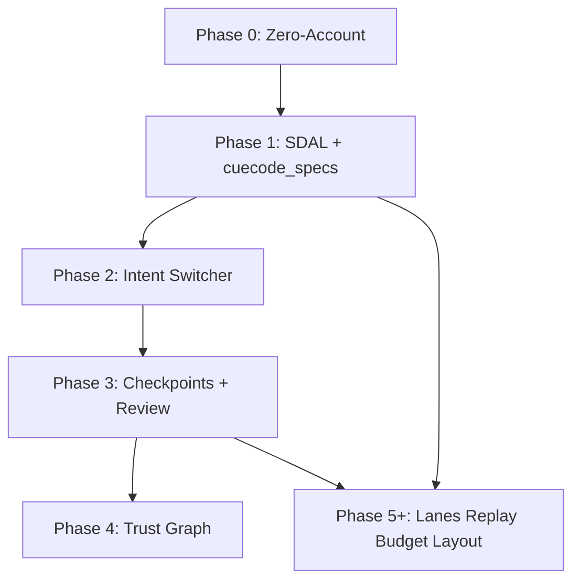

### Innovation ↔ crate map

| Innovation | Primary crates |
|------------|----------------|
| SDAL | `cuecode_specs`, `agent`, `acp_thread` |
| Intent Switcher | `cuecode_sandbox`, `agent_ui`, `agent_settings` |
| Trust Graph | `cuecode_sandbox`, `action_log`, `agent_ui` |
| Multi-Lane | `acp_thread`, `agent`, `agent_ui`, `cuecode_sandbox` |
| Checkpoint Stack | `cuecode_sandbox`, `action_log`, `acp_thread` |
| Terminal Replay | `acp_thread`, `terminal`, `agent_ui` |
| Context Budget | `agent`, `agent_ui`, `language_model` |
| Skills + Specs | `agent_skills`, `cuecode_specs` |
| Zero-Account | `onboarding`, `language_models`, `zed` |
| Composer-First | `workspace`, `agent_ui`, settings |

---

## Acceptance criteria — all innovations (Gherkin) {#acceptance-gherkin}

Per-innovation Given/When/Then scenarios for alpha acceptance. Each maps to the innovation index above.

### 1. SDAL {#gherkin-sdal}

```gherkin
Feature: Spec-Driven Agent Loop
  As Maya
  I want plans to map to spec checkboxes
  So that agent work follows the written contract

  Scenario: Session starts with linked spec
    Given a repo with ".cursor/specs/tasks/auth-refresh.md"
    When Maya links that spec and enables plan sync
    Then the plan panel shows entries aligned with spec checkboxes
    And the agent system prompt includes the compact spec index

  Scenario: Completing plan item proposes spec checkbox
    Given a linked spec with unchecked item "Wire agent_settings"
    When the agent marks that plan entry complete
    Then Review Spec tab shows a proposed checkbox toggle
    And the spec file is not modified until Maya accepts

  Scenario: Spec write rejected three times
    Given Maya rejected spec proposals twice before
    When a third proposal appears
    Then trust graph still requires confirm for spec writes
    And no auto-allow rule is created for update_spec
```

### 2. Intent Switcher {#gherkin-intent-switcher}

```gherkin
Feature: Intent Switcher
  As Jordan
  I want one control to reconfigure the sandbox
  So that I don't dig through settings

  Scenario: Switch Explore to Fix
    Given an Explore session with no pending review
    When Jordan selects intent Fix from the header dropdown
    Then tool permissions update within 100ms
    And the sandbox badge changes to show write:worktree
    And analytics event intent_change fires

  Scenario: Switch blocked by pending review
    Given a Fix session with 2 pending diffs
    When Jordan selects intent Explore
    Then a dialog offers "Reject pending & switch" or cancel
    And intent stays Fix if Jordan cancels

  Scenario: Wrong-intent denial offers CTA
    Given an Explore session
    When the agent attempts edit_file
    Then Jordan sees "Explore mode is read-only. Switch to Fix?"
```

### 3. Trust Graph {#gherkin-trust-graph}

```gherkin
Feature: Trust Graph
  As Maya
  I want repeated safe commands auto-approved
  So that confirmation fatigue doesn't force blind approvals

  Scenario: Promotion after evidence threshold
    Given Maya accepted "cargo test" successfully 5 times in this repo
    When the agent requests terminal "cargo test agent_ui"
    Then the tool runs without confirm dialog
    And inline notice shows "Auto-allowed by trust rule" with Revoke link

  Scenario: Hard deny overrides trust
    Given a broad trust rule for edit_file
    When the agent requests edit to ".env"
    Then the request is denied regardless of trust
    And no promotion is recorded for that path

  Scenario: User revokes rule
    Given an auto-allow rule for cargo test
    When Maya taps Revoke in trust settings
    Then the next cargo test requires confirm again
```

### 4. Multi-Lane Sessions {#gherkin-multi-lane}

```gherkin
Feature: Multi-Lane Sessions
  As Sam
  I want parallel Explore and Fix lanes
  So that research doesn't block implementation

  Scenario: Spawn Explore lane from Orchestrate
    Given a coordinator session with intent Orchestrate
    When Sam spawns a lane with intent Explore
    Then the lane cannot invoke edit_file
    And the lane runs Async by default

  Scenario: Fix lane writes while Explore reads
    Given Lane A Explore and Lane B Fix active
    When both lanes run concurrently
    Then only Lane B may produce pending file diffs
    And cross-lane write conflict count stays zero

  Scenario: Merge artifact to coordinator plan
    Given Lane A completed with artifact "12 files mapped"
    When Sam clicks "Merge artifact to plan"
    Then the coordinator plan gains a new entry citing Lane A
```

### 5. Checkpoint Stack {#gherkin-checkpoint-stack}

```gherkin
Feature: Checkpoint Stack
  As Maya
  I want full-turn rewind not just last buffer
  So that I can undo bad agent turns confidently

  Scenario: Checkpoint from review footer
    Given Maya accepted edits in Turn 7
    When she clicks "Checkpoint & continue"
    Then checkpoint Turn 7 appears on the timeline
    And snapshot includes action_log, plan, and linked spec refs

  Scenario: Restore to prior turn
    Given checkpoints at Turn 5 and Turn 8
    When Maya restores Turn 5 with preview
    Then file buffers match Turn 5 action_log snapshot
    And plan entries match Turn 5 plan snapshot

  Scenario: Git restore skipped on dirty worktree
    Given uncommitted manual edits outside agent
    When Maya restores with "Also restore git HEAD" checked
    Then git restore is skipped with ERR_CHECKPOINT_DIRTY_GIT
    And file/plan restore still applies
```

### 6. Terminal Replay {#gherkin-terminal-replay}

```gherkin
Feature: Terminal Replay
  As Riley
  I want to re-run command N from review
  So that debugging doesn't require re-prompting

  Scenario: Re-run failed test command
    Given Review Terminal tab shows "#2 cargo test agent_ui exit 1"
    When Riley clicks Re-run on command #2
    Then the command executes under current Fix sandbox policy
    And output appends to Terminal tab with new exit code

  Scenario: Fork to new Fix lane from command
    Given command #3 failed with sandbox network block
    When Riley clicks "Fork from #3 → new Fix lane"
    Then a new Fix lane opens with cwd and argv from #3
    And the parent Orchestrate session lists the new lane

  Scenario: Non-idempotent command confirm
    Given command "git push origin main"
    When Riley clicks Re-run
    Then a confirm dialog warns about non-idempotent action
```

### 7. Context Budget UI {#gherkin-context-budget}

```gherkin
Feature: Context Budget UI
  As Jordan
  I want category breakdown before auto-compact
  So that I control what the agent forgets

  Scenario: Budget bar shows categories
    Given a long session above 50% context
    When Jordan opens Context Manage
    Then categories Specs, Files, Chat, Tools show token percentages
    And total matches the header progress bar

  Scenario: Drop tool output chunk
    Given Tools category at 29% with droppable terminal logs
    When Jordan selects oldest terminal chunk and taps Drop selected
    Then confirm dialog appears
    And after confirm tokens decrease and compact is not triggered

  Scenario: Pinned spec immune to drop
    Given spec "04-sandbox-core" is linked and pinned
    When Jordan attempts Drop on Specs category
    Then pinned spec chunks are not selectable
```

### 8. Skills + Specs {#gherkin-skills-specs}

```gherkin
Feature: CueCode Skills equal Specs plus Scripts
  As Maya
  I want /implement-spec to run a checklist
  So that repeatable workflows are one slash away

  Scenario: implement-spec loads spec and generates plan
    Given skill implement-spec with spec_paths including "04-sandbox-core.md"
    When Maya invokes "/implement-spec 04-sandbox-core.md"
    Then intent defaults to Fix unless overridden
    And plan items match spec checkboxes

  Scenario: Skill script runs in Fix sandbox
    Given skill manifest includes sandbox_scripts verify.sh
    When the skill runs the script via terminal tool
    Then the same Seatbelt/Bubblewrap policy as Fix applies

  Scenario: Stale spec path in skill
    Given skill references missing spec path
    When project opens
    Then skill validation warning appears in skills browser
```

### 9. Zero-Account Default {#gherkin-zero-account}

```gherkin
Feature: Zero-Account Default
  As Jordan on first launch
  I want local model without zed.dev sign-in
  So that I can prompt within minutes

  Scenario: First launch local provider
    Given fresh CueCode install with no account
    When Jordan completes onboarding with Ollama selected
    Then first agent prompt sends within 10 minutes
    And no zed.dev sign-in gate appears

  Scenario: Ollama not running
    Given Ollama URL default but daemon stopped
    When Jordan sends first prompt
    Then error shows "Can't reach Ollama at http://127.0.0.1:11434"
    And recovery links to Test connection in settings

  Scenario: Optional cloud path
    Given Jordan selects Remote API key in onboarding
    When Jordan enters valid key
    Then cloud models appear without requiring zed.dev account for core agent
```

### 10. Composer-First Layout {#gherkin-composer-first}

```gherkin
Feature: Composer-First Layout
  As Maya
  I want agent panel to dominate workspace
  So that session work is primary not file tree

  Scenario: Preset enabled on onboarding
    Given composer_first true in default onboarding
    When Maya completes first launch
    Then agent panel width is at least 60% of workspace
    And project tree is collapsed by default

  Scenario: Editor opens on review file click
    Given composer-first layout active
    When Maya clicks a file in Review Diffs tab
    Then editor pane opens at 35% with diff focused
    And agent panel retains focus on conversation

  Scenario: Small screen falls back to classic
    Given window width below 1024px
    When composer-first would apply
    Then layout stays classic IDE with toast "Composer-first needs wider window"
```

---

## UI copy deck (innovations) {#ui-copy-deck}

Strings specific to innovation surfaces beyond [04 §ui-copy-deck](./04-sandbox-core#ui-copy-deck).

### Intent switcher (innovation emphasis) {#copy-intent-innovation}

| Key | String |
|-----|--------|
| `innovation.intent.subtitle` | One click sets tools, network, filesystem, and trust defaults |
| `innovation.intent.explore_hint` | Read-only — safe for questions and surveys |
| `innovation.intent.fix_hint` | Sandboxed writes and tests in this worktree |
| `innovation.intent.ship_hint` | Git and push with strict confirms |
| `innovation.intent.review_hint` | Analysis only — you apply edits manually |
| `innovation.intent.orchestrate_hint` | Spawn lanes — coordinator doesn't edit |

### Review panel (innovation tabs) {#copy-review-innovation}

| Key | String |
|-----|--------|
| `innovation.review.plan_spec_link` | Linked: {spec_path} |
| `innovation.review.terminal_rerun` | Re-run |
| `innovation.review.terminal_fork` | Fork from #{n} → new Fix lane |
| `innovation.review.trust_inline` | Auto-allowed by trust rule · Revoke |
| `innovation.review.verification_lane` | CI preview: verification lane {status} |

### Checkpoints (innovation timeline) {#copy-checkpoint-innovation}

| Key | String |
|-----|--------|
| `innovation.checkpoint.stack_title` | Checkpoint stack |
| `innovation.checkpoint.session_start` | Session start |
| `innovation.checkpoint.prune_notice` | Older checkpoints archived (max {n} per session) |
| `innovation.checkpoint.merge_lane` | Include Lane {id} artifacts |

### Spec linker (SDAL) {#copy-spec-innovation}

| Key | String |
|-----|--------|
| `innovation.spec.sdal_banner` | Session linked: {spec_path} |
| `innovation.spec.open_spec` | Open spec |
| `innovation.spec.propose_on_complete` | Propose spec update on complete |
| `innovation.spec.manual_map` | Map plan item to checkbox manually |
| `innovation.spec.fuzzy_match_confirm` | Match "{plan}" to checkbox "{checkbox}"? |

### Context budget {#copy-context-budget}

| Key | String |
|-----|--------|
| `innovation.context.title` | Context {pct}% |
| `innovation.context.manage` | Manage… |
| `innovation.context.drop_lowest` | Drop lowest… |
| `innovation.context.compact_now` | Compact now |
| `innovation.context.auto_compact` | Auto-compact at 85% |
| `innovation.context.drop_confirm` | Drop {n} chunks ({tokens} tokens)? This can't be undone. |

### Multi-lane {#copy-lanes}

| Key | String |
|-----|--------|
| `innovation.lane.spawn` | + Spawn |
| `innovation.lane.focus` | Focus lane |
| `innovation.lane.merge_artifact` | Merge artifact to plan |
| `innovation.lane.open_review` | Open lane review |
| `innovation.lane.done` | done |
| `innovation.lane.running` | running… |

### Zero-account onboarding {#copy-zero-account}

| Key | String |
|-----|--------|
| `innovation.onboarding.title` | Welcome to CueCode |
| `innovation.onboarding.subtitle` | No account required for core agent workflows. |
| `innovation.onboarding.test_connection` | Test connection |
| `innovation.onboarding.connection_ok` | Connected |
| `innovation.onboarding.connection_fail` | Can't reach provider at {url} |

### Composer-first {#copy-composer-first}

| Key | String |
|-----|--------|
| `innovation.layout.preset_on` | Composer-first preset ON |
| `innovation.layout.restore_classic` | Classic IDE layout |
| `innovation.layout.narrow_fallback` | Composer-first needs a wider window |

---

## Analytics events (innovations) {#analytics-events}

Innovation-specific events. Extend sandbox events in [04 §analytics-events](./04-sandbox-core#analytics-events).

| Event | Innovation | Trigger | Properties |
|-------|------------|---------|------------|
| `sdal_spec_linked` | SDAL | Link spec + sync on | `spec_path_hash`, `checkbox_count` |
| `sdal_plan_mapped` | SDAL | Plan item maps to checkbox | `auto_matched`, `manual_mapped` |
| `sdal_spec_accept` | SDAL | Spec patch accepted | `hunks`, `session_turn` |
| `intent_switch_blocked` | Intent | Pending review block | `pending_count` |
| `trust_promote` | Trust | New auto-allow rule | `tool`, `pattern`, `evidence_count` |
| `trust_revoke` | Trust | User revokes rule | `rule_id`, `within_1h_of_promote` |
| `trust_auto_allow` | Trust | Tool auto-allowed | `tool`, `rule_id` |
| `lane_spawn` | Multi-lane | New lane created | `parent_intent`, `lane_intent`, `execution` |
| `lane_merge_artifact` | Multi-lane | Artifact merged to plan | `lane_id`, `artifact_type` |
| `lane_archive_orphan` | Multi-lane | TTL archive | `lane_id`, `idle_minutes` |
| `checkpoint_prune` | Checkpoint | Old CP removed | `removed_count`, `session_id_hash` |
| `terminal_rerun` | Terminal replay | Re-run cmd | `index`, `lane_fork` |
| `terminal_fork_lane` | Terminal replay | Fork to lane | `from_index`, `success` |
| `context_drop` | Context budget | User drops chunks | `category`, `tokens_dropped` |
| `context_compact_manual` | Context budget | Compact now | `tokens_before`, `tokens_after` |
| `skill_invoke` | Skills+specs | Slash skill | `skill_id`, `spec_linked` |
| `skill_complete` | Skills+specs | Plan finished | `skill_id`, `items_done_ratio` |
| `onboarding_complete` | Zero-account | Finish onboarding | `provider`, `time_to_first_prompt_ms` |
| `layout_composer_enable` | Composer-first | Preset on | `window_width`, `opt_in` |
| `layout_classic_revert` | Composer-first | User reverts | `days_since_enable` |

---

## Manual QA scripts (innovations) {#manual-qa}

### QA-05-01: SDAL end-to-end {#qa-sdal}

1. Link `05-innovations.md` with sync on.
2. Ask agent to complete one plan item tied to a checkbox.
3. Accept spec patch in Review.
4. Verify checkbox checked on disk.
5. Confirm `sdal_spec_accept` event if metrics on.

### QA-05-02: Trust promotion {#qa-trust}

1. Fix session; run `cargo test` via agent 5 times, accepting each.
2. Sixth run should auto-allow with inline trust notice.
3. Revoke rule in Settings → Trust.
4. Seventh run should show confirm again.

### QA-05-03: Multi-lane no write conflict {#qa-lanes}

1. Orchestrate session; spawn Explore + Fix lanes.
2. Parallel prompts: survey in Explore, edit in Fix.
3. Confirm only Fix lane shows review badge.
4. Merge Explore artifact to coordinator plan.

### QA-05-04: Terminal replay fork {#qa-terminal-replay}

1. Fix turn with 3 terminal commands, one failing.
2. Review → Terminal → Fork from #2.
3. Confirm new Fix lane with same cwd/argv.
4. Re-run succeeds or fails independently.

### QA-05-05: Context drop before compact {#qa-context}

1. Long session >68% context.
2. Open Manage; drop oldest tool chunk.
3. Confirm compact did not auto-trigger.
4. Verify agent still references pinned linked spec.

### QA-05-06: /implement-spec {#qa-implement-spec}

1. Invoke `/implement-spec 04-sandbox-core.md`.
2. Confirm 8+ plan items from checkboxes.
3. Run skill; confirm Fix intent and sandbox on scripts.

### QA-05-07: Zero-account cold start {#qa-zero-account}

1. Fresh profile; no zed.dev login.
2. Onboarding → Ollama → Continue.
3. Send prompt; measure <10 min to first response.

### QA-05-08: Composer-first layout {#qa-composer-first}

1. Enable composer_first in settings.
2. Restart; confirm ≥60% agent width, tree collapsed.
3. Review → click diff; editor opens without stealing agent focus.

---

## Error message catalog (innovations) {#error-catalog}

| Code | User message | Recovery |
|------|--------------|----------|
| `ERR_SDAL_NO_SPEC` | No spec linked. Link a spec or use /implement-spec. | Spec linker dropdown or slash skill |
| `ERR_SDAL_MAP_FAIL` | Couldn't match plan item to any checkbox. | Manual mapping UI in Review Plan |
| `ERR_TRUST_PROMOTE_FAIL` | Couldn't save trust rule. | Retry; check ~/.config/cuecode/trust/ permissions |
| `ERR_LANE_SPAWN` | Couldn't spawn lane. | Reduce active lanes; check model availability |
| `ERR_LANE_ORPHAN` | Lane {id} archived after idle timeout. | Spawn new lane; recover artifact from timeline |
| `ERR_LANE_COORDINATOR_EDIT` | Orchestrate sessions can't edit files. | Switch lane to Fix or change coordinator intent |
| `ERR_REPLAY_METADATA` | Command metadata incomplete for replay. | Copy command manually; re-run in Fix terminal |
| `ERR_REPLAY_POLICY_DRIFT` | Sandbox policy changed since recording. | Review warning; approve re-run |
| `ERR_CONTEXT_DROP_PINNED` | Can't drop pinned spec context. | Unlink or unpin spec first |
| `ERR_SKILL_SPEC_MISSING` | Skill references missing spec: {path} | Fix SKILL.md spec_paths |
| `ERR_ONBOARDING_PROVIDER` | Can't reach provider at {url} | Start Ollama/LM Studio; Test connection |
| `ERR_LAYOUT_NARROW` | Composer-first needs a wider window. | Widen window or disable preset |

---

## Settings JSON examples (innovations) {#settings-examples}

### `~/.config/cuecode/settings.json` — innovation keys {#settings-innovations-main}

```json
{
  "cuecode": {
    "innovations": {
      "sdal": {
        "auto_link_last_spec": true,
        "fuzzy_checkbox_match": true,
        "manual_map_fallback": true
      },
      "trust": {
        "promotion_threshold": 5,
        "evidence_window_days": 30,
        "never_auto": ["update_spec", "git_push", "git_push_force"]
      },
      "lanes": {
        "max_concurrent": 4,
        "orphan_ttl_minutes": 120,
        "coordinator_may_edit": false
      },
      "checkpoints": {
        "max_per_session": 50,
        "compress_action_log": true
      },
      "context_budget": {
        "show_bar_at_pct": 50,
        "auto_compact_at_pct": 85,
        "pin_linked_specs": true
      },
      "layout": {
        "composer_first": false,
        "min_width_px": 1024,
        "agent_panel_ratio": 0.65
      },
      "onboarding": {
        "skip_account_gate": true,
        "default_provider": "ollama"
      }
    }
  }
}
```

### Skill manifest example — `implement-spec` {#settings-skill-manifest}

```yaml
---
name: implement-spec
description: Load spec, generate plan, execute checklist
spec_paths:
  - .cursor/specs/templates/feature.md
sandbox_scripts:
  - scripts/verify.sh
default_intent: Fix
---
```

---

## Security threat model — innovations (STRIDE-lite) {#threat-model}

| STRIDE | Threat | Innovation | Mitigation |
|--------|--------|------------|------------|
| **S** | Fake lane identity in UI | Multi-lane | Lane IDs from `acp_thread`; no user-supplied labels in policy |
| **T** | Trust rule widened by agent | Trust graph | Promotions only from user accept signals; agent cannot write trust JSON |
| **R** | Deny lane actions happened | Terminal replay | Structured `RecordedCommand` with session id |
| **I** | Skill script reads ~/.ssh | Skills+specs | Scripts run Fix sandbox; cwd locked to worktree |
| **D** | Spawn 100 lanes exhausts GPU | Multi-lane | `max_concurrent` setting; queue spawn |
| **E** | Coordinator escalates to edit | Orchestrate | Intent denies edit_file on coordinator handle |

### Innovation risk heatmap {#threat-heatmap}

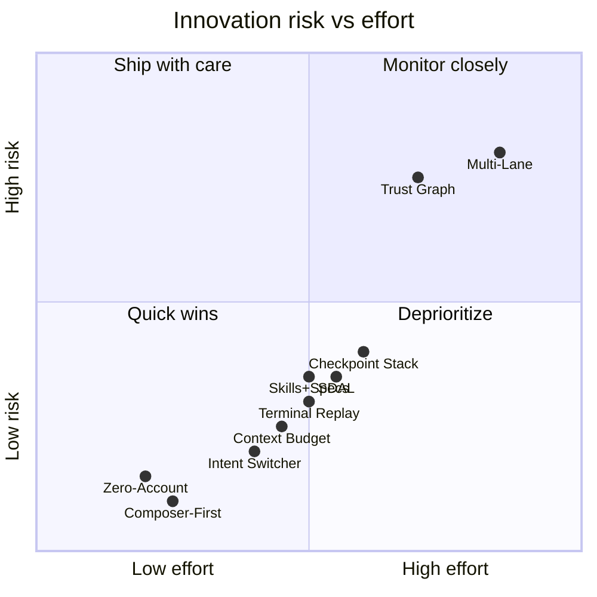

### SDAL data flow trust boundary {#threat-sdal-diagram}

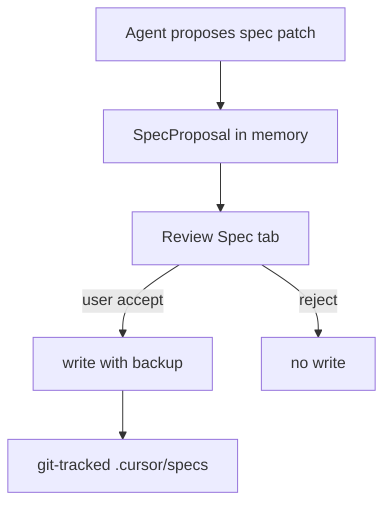

---

## Performance budgets (innovations) {#performance-budgets}

| Operation | Innovation | P95 target | P99 max |
|-----------|------------|------------|---------|
| Intent switcher UI update | Intent | 100 ms | 250 ms |
| Trust evaluate + promote check | Trust | 5 ms | 15 ms |
| Trust store persist after promote | Trust | 50 ms | 150 ms |
| Lane spawn (UI + thread) | Multi-lane | 500 ms | 1200 ms |
| Lane artifact merge to plan | Multi-lane | 200 ms | 500 ms |
| Checkpoint create | Checkpoint | 250 ms | 600 ms |
| Checkpoint restore (see 04) | Checkpoint | 400 ms | 2000 ms |
| Terminal replay re-run start | Terminal replay | 300 ms | 800 ms |
| Context budget panel open | Context | 150 ms | 400 ms |
| Context drop apply | Context | 200 ms | 500 ms |
| Spec fuzzy map plan→checkbox | SDAL | 30 ms | 80 ms |
| Skill invoke → plan generate | Skills | 400 ms | 1000 ms |
| Onboarding → first prompt ready | Zero-account | 30 s wall | 60 s wall |
| Layout preset apply | Composer-first | 100 ms | 300 ms |

### Innovation load sequence {#perf-innovation-sequence}

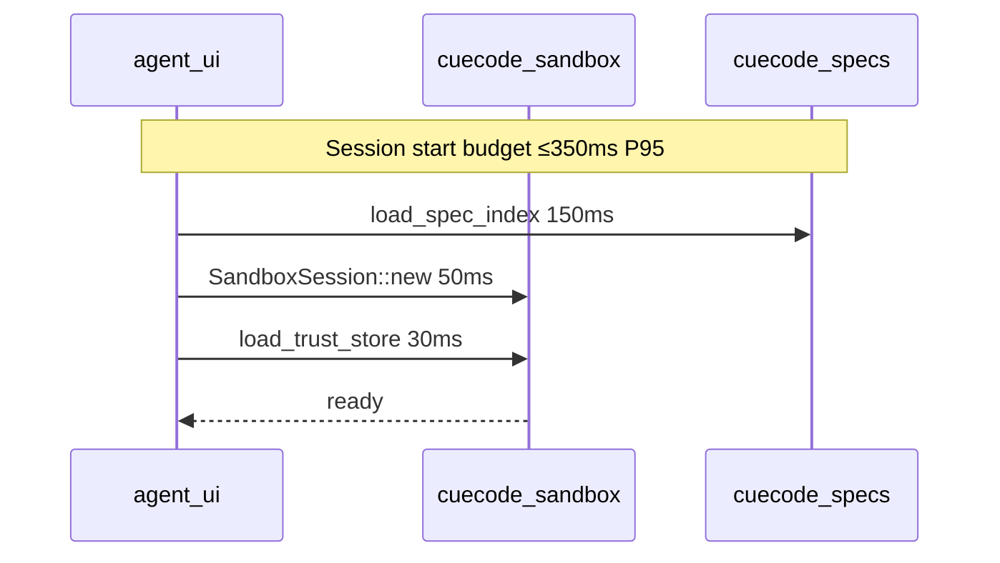

---

## Cross-reference index {#cross-links}

| Topic | Document |
|-------|----------|
| Sandbox lifecycle + intents | [04-sandbox-core](./04-sandbox-core) |
| System architecture | [06-system-design](./06-system-design) |
| Delivery phases | [07-implementation-roadmap](../delivery/07-implementation-roadmap) |
| Tools / permissions | [08-agent-tools-and-skills](../agent/08-agent-tools-and-skills) |
| UI patterns | [09-ui-ux-spec](../design/09-ui-ux-spec) |
| Metrics | [11-metrics-and-success](../ops/11-metrics-and-success) |
| AI moat strategy | [13-ai-maxxing](../agent/13-ai-maxxing) |
| Harness contexts | [harness/local/01-agent-harness](../harness/local/01-agent-harness.md) |

---

## Open questions (innovations-specific) {#open-questions}

See [12-open-questions](../ops/12-open-questions). Key innovation debates:

1. Trust graph promotion thresholds — fixed vs adaptive?
2. Multi-lane max concurrent writes — one Fix lane or many?
3. Spec sync — strict 1:1 plan titles vs manual mapping default?
4. Composer-first default on — opt-in vs opt-out for alpha?
