# System Design {#system-design}

> **Status:** Draft — components, data flow, crates to own  
> **Related:** [02-current-architecture](./02-current-architecture) · [04-sandbox-core](./04-sandbox-core) · [05-innovations](./05-innovations) · [07-implementation-roadmap](../delivery/07-implementation-roadmap) · [harness/](../harness/README.md)

> **Harness (Model B):** Production orchestration runs in proprietary cloud services.
> See [harness/cloud/](../harness/cloud/README.md). In-process harness semantics:
> [harness/local/01-agent-harness.md](../harness/local/01-agent-harness.md).
> `cuecode_sandbox` in this doc is a **local stub** (intent UI cache, offline policy hints).

This document is the **engineering map** for CueCode: what we add, what we extend, how
data flows, and where code lives. Read [02-current-architecture](./02-current-architecture)
first for the Zed baseline.

---

## Architecture overview {#overview}

### Layered stack (ASCII)

```
┌─────────────────────────────────────────────────────────────────────────────┐
│  CueCode Shell (fork crates/zed → cuecode binary)                           │
│  Branding, menus, onboarding, no zed.dev deps for core agent                │
│  Files: crates/cuecode/src/main.rs, menus, onboarding hooks                     │
├─────────────────────────────────────────────────────────────────────────────┤
│  CueCode Agent UX (extend agent_ui + optional cuecode_ui)                   │
│  Intent switcher, spec panel, unified review, checkpoint timeline           │
│  Files: crates/agent_ui/src/*, crates/cuecode_ui/src/* (optional)           │
├─────────────────────────────────────────────────────────────────────────────┤
│  cuecode_sandbox (NEW)                                                      │
│  Intent profiles, trust graph, checkpoints, execution context scheduling    │
├─────────────────────────────────────────────────────────────────────────────┤
│  cuecode_specs (NEW)                                                        │
│  Load / index / watch .cursor/specs, plan↔spec sync, @spec resolution       │
├─────────────────────────────────────────────────────────────────────────────┤
│  Zed Agent Runtime (keep, extend)                                           │
│  agent, acp_thread, agent_servers, action_log, agent_skills, agent_settings │
├─────────────────────────────────────────────────────────────────────────────┤
│  Editor + Project (keep mostly as-is)                                       │
│  editor, project, workspace, terminal, git_ui, fs                           │
├─────────────────────────────────────────────────────────────────────────────┤
│  GPUI (keep)                                                                │
│  gpui, gpui_macos, gpui_linux, gpui_windows                                 │
└─────────────────────────────────────────────────────────────────────────────┘
```

### Component diagram (Mermaid)

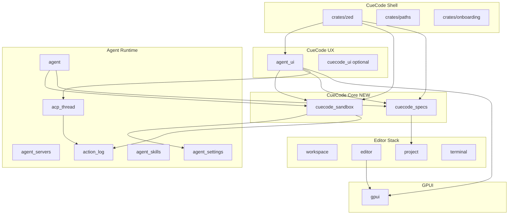

---

## New crates {#new-crates}

### `cuecode_specs` {#cuecode-specs}

**Responsibility:**

- Discover and watch `.cursor/specs/**/*.md` in active worktrees
- Parse optional YAML frontmatter (title, status, tags, summary)
- Build searchable index for agent context and UI pickers
- Propose spec writes (never silent overwrite)
- Sync ACP plan entries ↔ spec checklists when session linked
- Resolve `@spec` mentions (path, slug, fuzzy title)

**Crate layout (proposed):**

```
crates/cuecode_specs/
  Cargo.toml
  src/
    cuecode_specs.rs          # lib root ([lib] path)
    index.rs                  # SpecIndex, watcher
    parse.rs                  # frontmatter, checkboxes, anchors
    sync.rs                   # plan ↔ spec patch generation
    proposal.rs               # SpecProposal, diff preview
    watch.rs                  # worktree file events
```

**Public API (expanded):**

```rust
use std::path::{Path, PathBuf};
use gpui::App;

/// Compact index for system prompt injection.
pub struct SpecIndex {
    pub worktree_id: project::WorktreeId,
    pub entries: Vec<SpecEntry>,
    pub updated_at: chrono::DateTime<chrono::Utc>,
}

pub struct SpecEntry {
    pub path: PathBuf,
    pub title: String,
    pub status: Option<SpecStatus>,
    pub tags: Vec<String>,
    pub summary: Option<String>,
    pub anchor_ids: Vec<String>,
}

pub enum SpecStatus {
    Draft,
    Active,
    Done,
    Deprecated,
}

pub struct SpecDocument {
    pub path: PathBuf,
    pub frontmatter: Option<SpecFrontmatter>,
    pub body: String,
    pub checkboxes: Vec<SpecCheckbox>,
}

pub struct SpecCheckbox {
    pub line: usize,
    pub checked: bool,
    pub title: String,
    pub anchor: Option<String>,
}

pub struct SpecPatch {
    pub path: PathBuf,
    pub hunks: Vec<SpecHunk>,
}

pub struct SpecProposal {
    pub patch: SpecPatch,
    pub preview_markdown: String,
    pub backup_path: PathBuf,
}

/// Build or refresh index; registers watcher on worktree.
pub fn load_spec_index(worktree_root: &Path, cx: &App) -> SpecIndex;

/// Read full document from disk (UTF-8).
pub fn read_spec(path: &Path) -> anyhow::Result<SpecDocument>;

/// Fuzzy match for @spec composer completion.
pub fn resolve_spec_query(index: &SpecIndex, query: &str) -> Vec<SpecEntry>;

/// User must confirm before apply.
pub fn propose_spec_update(path: &Path, patch: SpecPatch) -> anyhow::Result<SpecProposal>;

/// Map ACP plan to checkbox toggles.
pub fn sync_plan_to_spec(
    plan: &acp_thread::Plan,
    doc: &SpecDocument,
) -> Option<SpecPatch>;

pub fn apply_proposal(proposal: SpecProposal) -> anyhow::Result<()>;
```

**Filesystem layout (project):**

```
<worktree>/.cursor/specs/
  00-README.md
  01-vision.md
  ...
  tasks/
    auth-refresh.md
```

---

### `cuecode_sandbox` {#cuecode-sandbox}

**Responsibility:**

- Intent profile definitions and persistence
- Map intent → `tool_permissions` + OS sandbox policy
- **Execution context** scheduling (Active / Async / Hybrid) for spawn and lanes
- Built-in agent definitions with Rust tool allowlists
- Trust graph read/write per repo hash
- Checkpoint create / list / restore / prune

**Crate layout (proposed):**

```
crates/cuecode_sandbox/
  Cargo.toml
  src/
    cuecode_sandbox.rs
    intent.rs                 # Intent, IntentProfile, apply_intent
    execution.rs              # ExecutionContext, notifications
    trust.rs                  # TrustStore, evaluate_trust
    checkpoint.rs             # Checkpoint, CheckpointStore
    builtin_agents.rs         # BuiltinAgentDefinition
    policy.rs                 # SandboxPolicy, NetworkPolicy, FsWritePolicy
    persistence.rs            # JSON on disk under ~/.config/cuecode
```

**Public API (expanded):**

```rust
pub enum Intent {
    Explore,
    Fix,
    Ship,
    Review,
    Orchestrate,
}

pub enum ExecutionContext {
    Active,
    Async,
    Hybrid,
}

pub struct IntentProfile {
    pub intent: Intent,
    pub tool_overlay: ToolPermissionOverlay,
    pub network: NetworkPolicy,
    pub fs_write: FsWritePolicy,
    pub sandbox_enabled: bool,
    pub default_execution: ExecutionContext,
    pub system_prompt_suffix: &'static str,
}

pub struct SandboxSession {
    pub thread_id: acp_thread::ThreadId,
    pub intent: Intent,
    pub execution: ExecutionContext,
    pub linked_spec: Option<SpecLink>,
    pub policy: SandboxPolicy,
}

pub struct TrustStore {
    pub repo_hash: String,
    pub rules: Vec<TrustRule>,
    pub evidence: Vec<TrustEvidence>,
}

pub struct Checkpoint {
    pub id: CheckpointId,
    pub session_id: acp_thread::ThreadId,
    pub created_at: chrono::DateTime<chrono::Utc>,
    pub action_log_snapshot: action_log::Snapshot,
    pub plan: Option<acp_thread::PlanSnapshot>,
    pub spec_refs: Vec<SpecRefSnapshot>,
    pub git_head: Option<String>,
    pub summary: String,
}

pub struct BuiltinAgentDefinition {
    pub id: &'static str,
    pub execution_default: ExecutionContext,
    pub allowed_tools: ToolAllowlist,
    pub disallowed_tools: &'static [&'static str],
    pub model_hint: ModelHint,
    pub omit_spec_index: bool,
}

pub fn default_profiles() -> Vec<IntentProfile>;
pub fn apply_intent(session: &mut SandboxSession, intent: Intent, cx: &mut App) -> anyhow::Result<()>;
pub fn load_trust_store(repo_hash: &str) -> anyhow::Result<TrustStore>;
pub fn record_trust_evidence(store: &mut TrustStore, evidence: TrustEvidence);
pub fn evaluate_trust(request: &ToolRequest, store: &TrustStore) -> TrustDecision;

pub fn create_checkpoint(session: &SandboxSession, cx: &App) -> anyhow::Result<Checkpoint>;
pub fn list_checkpoints(session_id: &acp_thread::ThreadId) -> Vec<CheckpointMeta>;
pub fn restore_checkpoint(id: CheckpointId, opts: RestoreOptions, cx: &App) -> anyhow::Result<()>;
```

See [harness/local/01-agent-harness.md](../harness/local/01-agent-harness.md#rust-map) for local harness integration and [harness/cloud/04-open-client.md](../harness/cloud/04-open-client.md) for cloud client crate.

---

### `cuecode_ui` (optional) {#cuecode-ui}

CueCode-only widgets if `agent_ui` forks become too noisy.

**Start:** extend `agent_ui`  
**Extract when:** intent switcher + review shell + timeline exceed ~800 LOC CueCode-only

| Widget | Purpose |
|--------|---------|
| `IntentSwitcher` | Header intent picker + sandbox badge |
| `SpecMentionPicker` | `@spec` completion popup |
| `UnifiedReviewPanel` | Plan / Diffs / Terminal / Spec tabs |
| `CheckpointTimeline` | Session sidebar scrubber |
| `ContextBudgetBar` | Category token breakdown |

**Proposed path:** `crates/cuecode_ui/src/` — depends on `cuecode_sandbox`, `cuecode_specs`, `agent_ui` (shared types only via small `cuecode_ui_types` if needed).

---

## Data flow {#data-flow}

### Spec index pipeline {#spec-index-flow}

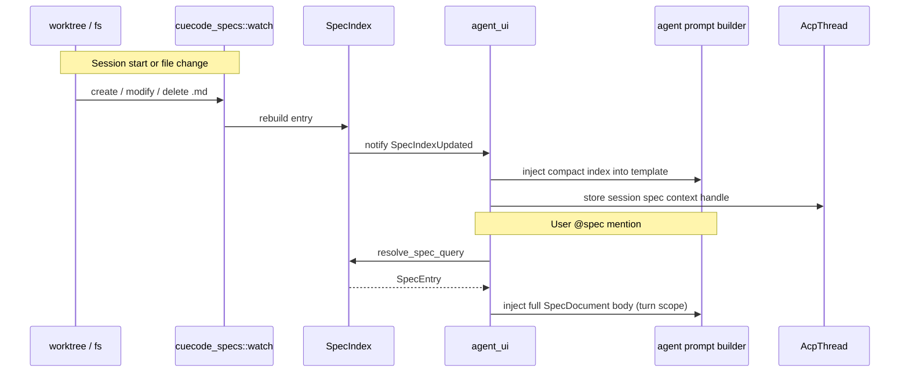

**Index payload size budget:** System prompt gets titles + paths + status (~4KB target);
full bodies on demand via `read_spec` tool or `@spec`.

**Caching:** In-memory `Arc<SpecIndex>` per worktree; bump version on watcher event.

### Checkpoint pipeline {#checkpoint-flow}

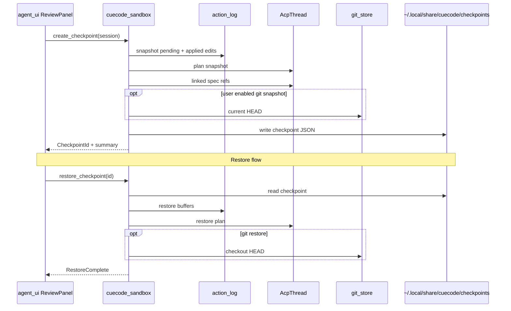

**Checkpoint JSON schema (sketch):**

```json
{
  "id": "cp_20250617_153045_7",
  "session_id": "thread_abc",
  "created_at": "2025-06-17T15:30:45Z",
  "summary": "Turn 7: 2 files accepted, tests pass",
  "action_log": { "version": 1, "entries": [] },
  "plan": { "entries": [] },
  "spec_refs": [{ "path": ".cursor/specs/core/04-sandbox-core.md", "checkbox_lines": [42] }],
  "git_head": "abc123optional"
}
```

### Trust graph evaluation flow {#trust-flow}

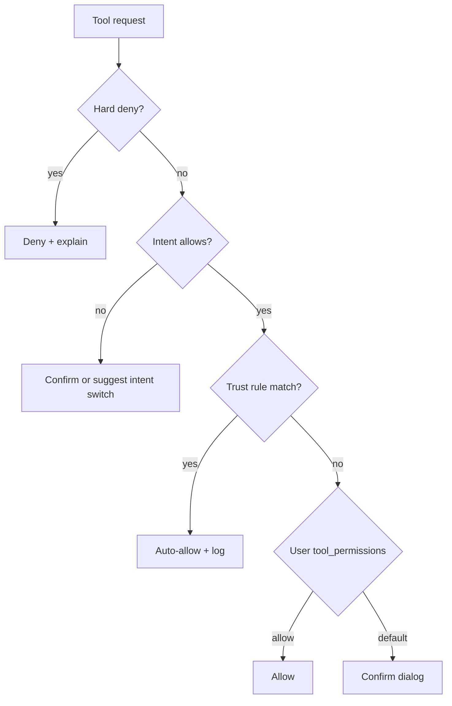

Order matches [08-agent-tools-and-skills §permissions](../agent/08-agent-tools-and-skills#permissions).

---

## Crate dependency graph {#dependency-graph}

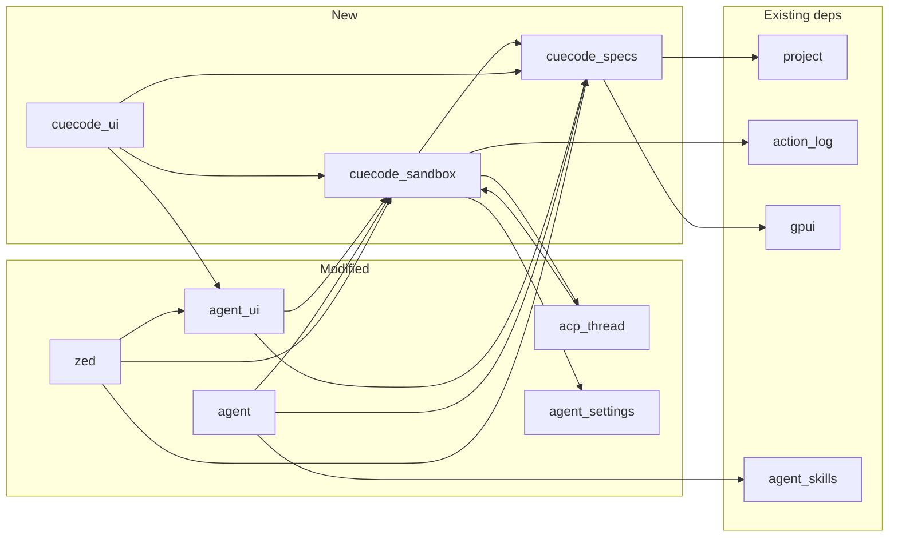

**Workspace `Cargo.toml` additions (proposed):**

```toml
[workspace.members]
# ... existing ...
"crates/cuecode_specs",
"crates/cuecode_sandbox",
# "crates/cuecode_ui",  # when extracted
```

**Dependency rules:**

- `cuecode_specs` must NOT depend on `agent_ui` (keep UI-free)
- `cuecode_sandbox` may depend on `cuecode_specs` for spec snapshots
- `agent` depends on both for tools + prompt assembly
- No circular: `acp_thread` → `cuecode_sandbox` via trait or thin facade if needed

---

## Crates to modify {#modify-crates}

Expanded table with **file paths** and change summaries.

| Crate | Key files | Changes |
|-------|-----------|---------|
| **`paths`** | `crates/paths/src/paths.rs` | `APP_NAME = "CueCode"`; config dir `~/.config/cuecode/` |
| **`zed`** | `crates/cuecode/src/main.rs`, `crates/cuecode/Cargo.toml` | Binary name `cuecode`; init `cuecode_specs`, `cuecode_sandbox`; hide Zed cloud menus |
| **`agent_ui`** | `src/agent_panel.rs`, `src/conversation_view.rs`, `src/agent_diff.rs` | Intent switcher, spec linker, unified review entry, checkpoint timeline hook |
| **`agent_settings`** | `src/agent_settings.rs`, settings schema | Intent overlay keys; CueCode defaults; trust UI settings section |
| **`agent`** | `src/agent.rs`, `src/sandboxing.rs`, `src/tools/*.rs` | Spec-aware system prompt; new tools `list_specs`, `read_spec`, `update_spec`, `checkpoint`, `rewind`; intent in tool eval |
| **`acp_thread`** | `src/acp_thread.rs`, serialization | Checkpoint hooks; `parent_session_id` for lanes; plan snapshot export |
| **`onboarding`** | `crates/onboarding/src/*.rs` | Remove Zed account requirement; local model picker first screen |
| **`client`** | `crates/client/src/*.rs` | Stub optional `server_url`; no hard fail without account for agent |
| **`release_channel`** | `crates/release_channel/src/*.rs` | Display names, bundle IDs (`dev.cuecode.CueCode` or similar) |
| **`assets/settings/default.json`** | `assets/settings/default.json` | Agent defaults, local model, `cuecode.layout.*`, tool_permissions hard deny |
| **`action_log`** | `crates/action_log/src/*.rs` | Snapshot / restore API for checkpoints (if not only in sandbox) |
| **`agent_skills`** | `crates/agent_skills/src/*.rs` | Optional skill manifest: `spec_paths`, `default_intent` |
| **`feature_flags`** | `crates/feature_flags/src/flags.rs` | CueCode: consider default-on sandbox flag for Fix intent (product decision) |
| **`workspace`** | `crates/workspace/src/*.rs` | Composer-first layout preset sizing |
| **`collab_ui`** | various | Hide/disable collab entry points Phase 0 |

### Init wiring (sketch) — `crates/cuecode/src/main.rs`

```rust
// After agent_ui::init
cuecode_specs::init(cx);
cuecode_sandbox::init(cx);
```

### Session start hook — `crates/agent_ui/src/conversation_view.rs`

```rust
// ConversationView::new (conceptual)
let spec_index = cuecode_specs::load_spec_index(&worktree_path, cx);
let sandbox_session = cuecode_sandbox::SandboxSession::new(
    thread_id,
    intent_from_workspace_or_default,
    spec_link,
);
```

### System prompt — `crates/agent/src/agent.rs`

Template sections:

1. Base agent instructions
2. `cuecode_sandbox::intent_system_prompt_suffix(intent)`
3. Compact `SpecIndex` markdown table
4. Linked spec full body (if any)
5. Skills index (existing)

---

## Crates to leave alone (initially) {#leave-alone}

| Crate | Reason |
|-------|--------|
| `gpui`, `gpui_*` | Rendering pipeline stable |
| `editor`, `rope`, `language`, `lsp` | Core editing unchanged |
| `extension`, `extension_host` | Strategy TBD ([12-open-questions](../ops/12-open-questions)) |
| `collab`, `call`, `livekit_client` | Disabled UI, not deleted day one |
| `tree-sitter`, grammars | No CueCode-specific changes |
| `cloud_api_*`, `language_models_cloud` | Optional remote path only |

---

## Integration points {#integration-points}

| Event | Hook location | CueCode action |
|-------|---------------|----------------|
| App boot | `zed/src/main.rs` | `cuecode_*::init` |
| Session start | `ConversationView::new` | Load intent + spec index + `SandboxSession` |
| System prompt build | `agent` templates | Inject specs + intent suffix |
| Plan update | `AcpThread::update_plan` | Optional spec sync proposal |
| Tool before run | `tool_permissions` + `agent::sandboxing` | Trust graph + intent check |
| Edit applied | `action_log` | Checkpoint delta; trust evidence |
| User reject | review UI → `action_log` | Trust negative signal |
| User accept | review UI | Trust positive signal |
| File change | `project` worktree events | `cuecode_specs` watcher refresh |
| Thread serialize | `agent_panel` retained threads | Persist intent, spec link, checkpoint head |
| Spawn subagent | `spawn_agent` tool | Lane config + execution context |

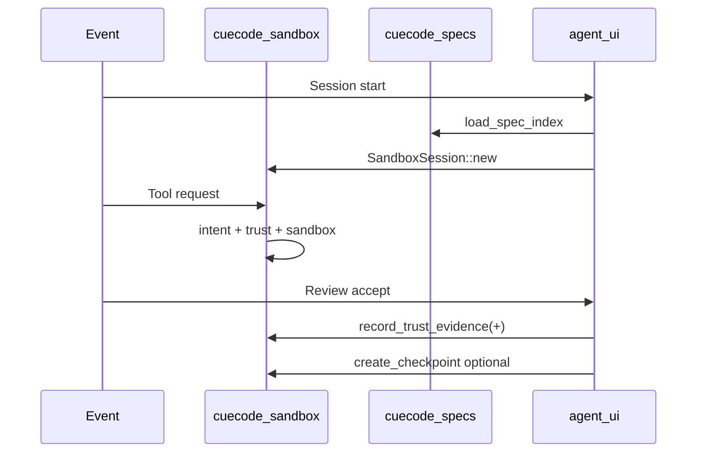

---

## Data directories {#data-dirs}

After rebrand (`APP_NAME = "CueCode"` in `paths.rs`):

```
~/.config/cuecode/
  settings.json                 # agent.tool_permissions, cuecode.layout.*
  keymap.json
  intent_profiles.json          # NEW — IntentProfile overrides
  trust/
    <repo_hash>.json            # NEW — TrustStore
  metrics/
    local.jsonl                 # opt-in — see 11-metrics

~/.local/share/cuecode/         # Linux; macOS Application Support equivalent
  checkpoints/
    <session_id>/
      cp_*.json                 # Checkpoint blobs
  logs/                         # optional debug

<project>/.cursor/specs/        # Git-tracked specs (index source)
<project>/.cursor/skills/       # Agent skills (existing convention)
```

**Repo hash input:** normalized git remote URL + worktree root path hash — document in `cuecode_sandbox::persistence`.

---

## Agent backends {#agent-backends}

CueCode supports multiple backends via `AgentServer` / `AgentConnection`:

| Backend | Source | v1 priority | CueCode customization |
|---------|--------|-------------|-------------------------|
| Native CueCode agent | `agent::NativeAgentServer` | **Primary** | Full SDAL, tools, intent, specs |
| External ACP agents | `agent_servers::acp` | Optional | Deny/confirm overrides; spec UI still works |
| Custom agents | `agent_servers::custom` | Later | User-defined endpoints |

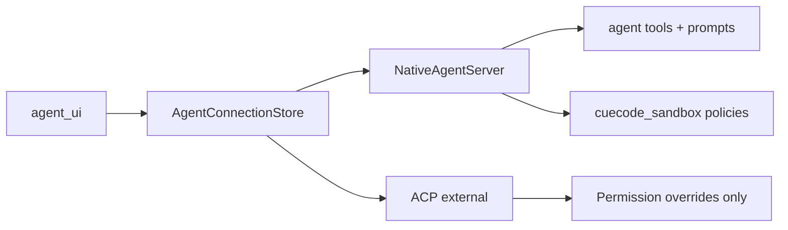

Intent profiles and sandbox rules apply **fully** to native agent first; ACP agents
respect Zed/CueCode deny/confirm per existing behavior ([04-sandbox-core](./04-sandbox-core)).

---

## Security model {#security}

1. **Default deny** — network and FS writes off in Explore/Review.
2. **Sandbox** — terminal commands on macOS/Linux when Fix/Ship + flag enabled (`agent/src/sandboxing.rs`).
3. **Trust graph** — never auto-allows force push, secret paths, or unsandboxed-by-default escalation.
4. **Spec writes** — always user confirmation in v1 (`propose_spec_update` only).
5. **No autonomous mode** — human approves destructive actions unless trust rule explicitly covers them.
6. **Hard deny list** — `.env`, `secrets/`, `.pem`, `git push --force` ([08](../agent/08-agent-tools-and-skills)).

**Threat notes:**

| Threat | Control |
|--------|---------|
| Prompt injection → exfil | Network off Explore; allowlist Fix |
| Malicious skill script | Same terminal sandbox as Fix |
| Trust rule poisoning | Reject/rewind removes evidence; revoke UI |
| Spec path traversal | Resolve paths only under `.cursor/specs/` |

---

## Deployment view {#deployment}

### Build artifacts

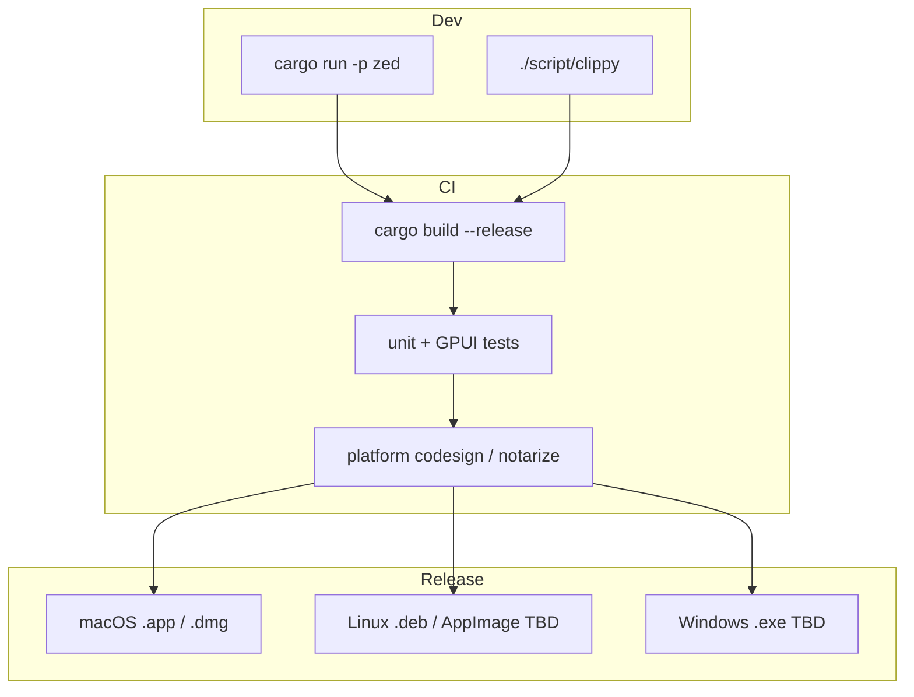

### Runtime deployment (single-user desktop)

```
┌─────────────────────────────────────────────────────────────┐
│ User machine                                                 │
│  ┌─────────────┐    ┌──────────────┐    ┌─────────────────┐ │
│  │ cuecode     │───▶│ Local LLM    │    │ Project worktree│ │
│  │ binary      │    │ Ollama/LM    │    │ .cursor/specs   │ │
│  └─────────────┘    └──────────────┘    └─────────────────┘ │
│         │                    │                    │          │
│         ▼                    ▼                    ▼          │
│  ~/.config/cuecode/    localhost:11434      git repo       │
│  ~/.local/share/cuecode/checkpoints/                         │
└─────────────────────────────────────────────────────────────┘
```

**No required CueCode cloud** for core agent v1. Optional: remote API keys, future telemetry opt-in ([11-metrics](../ops/11-metrics-and-success)).

### Platform packaging hooks

| Platform | Crate / path | Notes |
|----------|--------------|-------|
| macOS | `crates/gpui_macos`, `release_channel` bundle ID | Xcode + Metal required |
| Linux | `crates/gpui_linux`, Bubblewrap for sandbox | |
| Windows | `crates/gpui_windows` | Sandbox v1 permissions-only |

### Environment variables (proposed, debug)

| Variable | Purpose |
|----------|---------|
| `CUECODE_SPEC_ROOT` | Override specs dir (default `.cursor/specs`) |
| `CUECODE_TRUST_DISABLE` | Force all confirms (dev only) |
| `CUECODE_CHECKPOINT_DIR` | Override checkpoint storage path |

---

## Testing strategy {#testing}

| Layer | Scope | Location |
|-------|-------|----------|
| **Unit** | Spec parsing, checkbox sync, trust rules | `crates/cuecode_specs/src/*`, `crates/cuecode_sandbox/src/*` |
| **Integration** | Index watcher + prompt injection | `cuecode_specs` + fake worktree temp dir |
| **GPUI** | Intent switcher, review panel | `agent_ui` tests + `.cursor/skills/gpui-test` |
| **Session** | Spec load + plan sync | `agent_ui` test_support + mock agent |
| **Plan E2E** | Implement, ticket session, multi-lang agent | [ops/13 PulseBoard fixture](../ops/13-plan-e2e-fixture.md) — `cuecode-testing-repo` |
| **E2E** | Manual dogfood | Real repos with `.cursor/specs/` |

**Example unit test targets:**

```rust
#[test]
fn parse_checkbox_lines_with_anchors() { ... }

#[test]
fn trust_never_auto_allows_force_push() { ... }

#[test]
fn spec_index_excludes_outside_cursor_specs() { ... }
```

Run lint: `./script/clippy` per [AGENTS.md](../../AGENTS.md).

---

## API surface summary (cross-crate) {#api-summary}

| Consumer | Provider | Key calls |
|----------|----------|-----------|
| `agent_ui` | `cuecode_specs` | `load_spec_index`, `resolve_spec_query` |
| `agent_ui` | `cuecode_sandbox` | `apply_intent`, `create_checkpoint`, `restore_checkpoint` |
| `agent` | `cuecode_specs` | `read_spec`, index markdown for prompt |
| `agent` | `cuecode_sandbox` | `evaluate_trust`, `SandboxPolicy` for terminal |
| `acp_thread` | `cuecode_sandbox` | checkpoint plan snapshots |
| `zed` | both | `init`, global entities registration |

New agent tools (thin wrappers in `crates/agent/src/tools/`):

| Tool | Delegates to |
|------|--------------|
| `list_specs` | `SpecIndex` |
| `read_spec` | `read_spec` |
| `update_spec` | `propose_spec_update` → UI confirm |
| `link_spec` | `SandboxSession.linked_spec` |
| `checkpoint` | `create_checkpoint` |
| `rewind` | `restore_checkpoint` |
| `trust_query` | `TrustStore` debug |

Full tool list: [08-agent-tools-and-skills](../agent/08-agent-tools-and-skills).

---

## Phased ownership map {#phases}

| Phase | Crates touched | Spec |
|-------|----------------|------|
| 0 | `paths`, `zed`, `onboarding`, `release_channel`, `default.json` | [03-fork-and-rebrand](./03-fork-and-rebrand) |
| 1 | `cuecode_specs`, `agent`, `agent_ui` | [04 §spec-integration](./04-sandbox-core#spec-integration) |
| 2 | `cuecode_sandbox`, `agent_settings`, `agent_ui` | [04 §intent-profiles](./04-sandbox-core#intent-profiles) |
| 3 | `cuecode_sandbox`, `action_log`, `agent_ui`, `acp_thread` | [05 §checkpoint-stack](./05-innovations#checkpoint-stack) |
| 4 | `cuecode_sandbox` trust | [05 §trust-graph](./05-innovations#trust-graph) |
| 5+ | lanes, replay, budget, layout | [05 innovations P3](./05-innovations#priority) |

Roadmap detail: [07-implementation-roadmap](../delivery/07-implementation-roadmap).

---

## Acceptance criteria (Gherkin) {#acceptance-gherkin}

Engineering acceptance for `cuecode_specs`, `cuecode_sandbox`, and integration hooks.

### cuecode_specs index {#gherkin-spec-index}

```gherkin
Feature: Spec index pipeline
  As the agent runtime
  I want a fresh index on worktree changes
  So that prompts and @spec stay accurate

  Scenario: Watcher rebuilds on new file
    Given an active SpecIndex for a worktree
    When a new file is created under .cursor/specs/
    Then the index entry count increases within 80ms P99
    And agent_ui receives SpecIndexUpdated

  Scenario: Path traversal rejected
    Given resolve_spec_query with query "../../../etc/passwd"
    Then no entries outside .cursor/specs/ are returned
```

### cuecode_sandbox checkpoints {#gherkin-checkpoints}

```gherkin
Feature: Checkpoint store
  As agent_ui
  I want atomic checkpoint write and restore
  So that rewind is reliable

  Scenario: Round-trip checkpoint
    Given a SandboxSession with applied action_log entries
    When create_checkpoint then restore_checkpoint same id
    Then buffer contents and plan match within 400ms P95 restore

  Scenario: Prune at max_per_session
    Given 51 checkpoints exist for session_id
    When create_checkpoint is called
    Then oldest checkpoint is pruned and warning logged
```

### Trust evaluation order {#gherkin-trust}

```gherkin
Feature: Trust graph evaluation order
  As agent tool layer
  I want hard deny before trust auto-allow
  So that escalation is impossible

  Scenario: Force push never auto-allowed
    Given a trust rule matching all terminal commands
    When tool request is "git push --force"
    Then TrustDecision is Deny with reason hard_deny
```

---

## UI copy deck (system surfaces) {#ui-copy-deck}

Strings for system-level errors and progress surfaced by `cuecode_*` crates (consumed by `agent_ui`).

| Key | String |
|-----|--------|
| `system.spec.indexing` | Indexing specs… |
| `system.spec.index_ready` | {n} specs indexed |
| `system.checkpoint.writing` | Saving checkpoint… |
| `system.checkpoint.restoring` | Restoring Turn {n}… |
| `system.trust.promoting` | New auto-allow rule saved |
| `system.trust.evaluating` | Checking permissions… |
| `system.lane.spawning` | Spawning lane… |
| `system.init.failed` | CueCode sandbox failed to initialize. Restart the app. |

---

## Analytics events (system layer) {#analytics-events}

Low-level events emitted from `cuecode_specs` / `cuecode_sandbox` (aggregated by UI).

| Event | Emitter | Trigger | Properties |
|-------|---------|---------|------------|
| `spec_index_rebuild` | cuecode_specs | Watcher batch | `duration_ms`, `files_changed`, `entry_count` |
| `spec_read` | cuecode_specs | read_spec | `path_hash`, `bytes` |
| `spec_proposal_build` | cuecode_specs | propose_spec_update | `hunk_count`, `duration_ms` |
| `spec_apply` | cuecode_specs | apply_proposal | `success`, `duration_ms` |
| `spec_conflict_detect` | cuecode_specs | disk mtime drift | `path_hash` |
| `checkpoint_write` | cuecode_sandbox | create_checkpoint | `bytes`, `duration_ms`, `success` |
| `checkpoint_read` | cuecode_sandbox | restore_checkpoint | `duration_ms`, `success`, `error_code` |
| `checkpoint_prune` | cuecode_sandbox | prune | `removed_ids` |
| `trust_store_load` | cuecode_sandbox | load_trust_store | `rule_count`, `duration_ms` |
| `trust_store_save` | cuecode_sandbox | record evidence | `duration_ms` |
| `trust_eval` | cuecode_sandbox | evaluate_trust | `decision`, `duration_ms` |
| `intent_apply` | cuecode_sandbox | apply_intent | `intent`, `duration_ms` |
| `sandbox_policy_apply` | cuecode_sandbox | terminal spawn | `backend`, `network_mode` |

---

## Manual QA scripts (system) {#manual-qa}

### QA-06-01: cuecode_specs watcher {#qa-spec-watcher}

1. Open project with `.cursor/specs/`.
2. Add `tasks/qa-test.md` with valid frontmatter.
3. Within 1s, `@spec` picker lists new file.
4. Delete file; confirm entry removed from index.

### QA-06-02: Checkpoint JSON round-trip {#qa-checkpoint-json}

1. Create Fix session; make edits; checkpoint.
2. Inspect `~/.local/share/cuecode/checkpoints/<session_id>/cp_*.json`.
3. Validate schema: id, action_log, plan, spec_refs fields present.
4. Restore; confirm UI matches JSON summary.

### QA-06-03: Trust store isolation {#qa-trust-isolation}

1. Open repo A; promote cargo test rule.
2. Open repo B (different remote); confirm no shared rules.
3. Revoke in A only; B unchanged.

### QA-06-04: propose_spec_update backup {#qa-spec-backup}

1. Trigger spec patch proposal.
2. Accept; confirm `.cursor/specs/*.md.bak` or backup path exists.
3. Reject second proposal; confirm no backup litter.

### QA-06-05: Init wiring {#qa-init}

1. Launch cuecode binary with `RUST_LOG=cuecode_sandbox=debug`.
2. Confirm `cuecode_specs::init` and `cuecode_sandbox::init` in logs.
3. Open agent panel without panic.

---

## Error message catalog (system) {#error-catalog}

| Code | User message | Recovery | Crate |
|------|--------------|----------|-------|
| `ERR_SPEC_ROOT_INVALID` | Spec root "{path}" is outside worktree. | Fix `cuecode.specs.root` setting | cuecode_specs |
| `ERR_SPEC_WATCHER` | Spec file watcher failed. Changes may be stale. | Restart session; check fs permissions | cuecode_specs |
| `ERR_SPEC_PROPOSAL_EMPTY` | No changes to propose for this spec. | Agent retry; check plan/sync mapping | cuecode_specs |
| `ERR_SPEC_APPLY_IO` | Couldn't write spec file. | Check permissions; restore from backup | cuecode_specs |
| `ERR_CP_SERIALIZE` | Checkpoint data corrupted. | Delete cp file; use earlier checkpoint | cuecode_sandbox |
| `ERR_CP_RESTORE_PARTIAL` | Some files couldn't restore. | Preview shows failed paths; manual fix | cuecode_sandbox |
| `ERR_CP_GIT_CHECKOUT` | Git checkout failed: {stderr} | Stash/commit; uncheck git restore | cuecode_sandbox |
| `ERR_TRUST_LOAD` | Couldn't load trust rules for this repo. | Reset trust file; defaults to confirm-all | cuecode_sandbox |
| `ERR_TRUST_SAVE` | Couldn't save trust evidence. | Check ~/.config/cuecode/trust/ disk space | cuecode_sandbox |
| `ERR_INTENT_APPLY` | Couldn't apply intent profile. | Restart session; validate intent_profiles.json | cuecode_sandbox |
| `ERR_INIT_CUECODE` | CueCode modules failed to start. | Restart app; report logs | zed init |

---

## Settings JSON schema examples {#settings-schema}

### Complete `settings.json` with schema comments {#settings-complete}

```json
{
  "$schema": "cuecode-settings-v1",
  "agent": {
    "tool_permissions": {
      "default": "confirm",
      "patterns": []
    }
  },
  "cuecode": {
    "specs": {
      "root": ".cursor/specs",
      "inject_index_in_prompt": true,
      "max_index_bytes": 4096,
      "watcher_debounce_ms": 100
    },
    "sandbox": {
      "default_intent": "Fix",
      "remember_intent_per_worktree": true
    },
    "checkpoints": {
      "max_per_session": 50,
      "include_git_head_default": false,
      "storage_path": null
    },
    "trust": {
      "promotion_threshold": 5,
      "disabled": false
    },
    "lanes": {
      "max_concurrent": 4
    },
    "layout": {
      "composer_first": false
    },
    "debug": {
      "CUECODE_SPEC_ROOT": null,
      "CUECODE_TRUST_DISABLE": false,
      "CUECODE_CHECKPOINT_DIR": null
    }
  }
}
```

### `intent_profiles.json` full example {#settings-intent-full}

```json
{
  "version": 1,
  "profiles": {
    "Explore": {
      "network": "off",
      "fs_write": "none",
      "sandbox_enabled": false,
      "default_execution": "Async"
    },
    "Fix": {
      "network": "allowlist",
      "fs_write": "worktree",
      "sandbox_enabled": true,
      "default_execution": "Active",
      "network_allowlist": ["crates.io", "registry.npmjs.org"]
    },
    "Ship": {
      "network": "allowlist",
      "fs_write": "worktree",
      "sandbox_enabled": true,
      "default_execution": "Hybrid",
      "confirm_git_push": true
    },
    "Review": {
      "network": "off",
      "fs_write": "none",
      "sandbox_enabled": false
    },
    "Orchestrate": {
      "network": "allowlist",
      "fs_write": "none",
      "default_execution": "Hybrid"
    }
  }
}
```

### Checkpoint blob example (on disk) {#settings-checkpoint-blob}

```json
{
  "id": "cp_20250617_153045_7",
  "session_id": "thread_abc",
  "created_at": "2025-06-17T15:30:45Z",
  "summary": "Turn 7: 2 files accepted, tests pass",
  "action_log": {
    "version": 1,
    "entries": [
      {
        "buffer_id": "buf_1",
        "path": "crates/agent_ui/src/conversation_view.rs",
        "patch_hash": "sha256:…"
      }
    ]
  },
  "plan": {
    "entries": [
      { "id": "p1", "title": "Patch spawn path", "completed": true }
    ]
  },
  "spec_refs": [
    {
      "path": ".cursor/specs/core/04-sandbox-core.md",
      "checkbox_lines": [514]
    }
  ],
  "git_head": null
}
```

---

## Security threat model (STRIDE-lite) {#threat-model-stride}

System-level threats for new crates and data directories.

| STRIDE | Threat | Component | Control | Owner crate |
|--------|--------|-----------|---------|-------------|
| **S** | Swap trust file between repos | `trust/<repo_hash>.json` | repo_hash includes remote URL + root | cuecode_sandbox |
| **T** | Tamper checkpoint JSON on disk | checkpoints/ | Optional HMAC v2; v1 user-only FS | cuecode_sandbox |
| **R** | Deny agent edited file X | action_log snapshot | Include paths + hashes in CP | action_log |
| **I** | Spec index leaks abs paths in prompt | SpecIndex inject | Hash paths in metrics; rel paths in prompt | cuecode_specs |
| **D** | Watcher storm on spec churn | watch.rs | debounce_ms setting; coalesce events | cuecode_specs |
| **E** | `apply_proposal` writes outside specs | proposal.rs | Canonicalize under `.cursor/specs/` | cuecode_specs |

### Crate trust zone diagram {#threat-crate-zones}

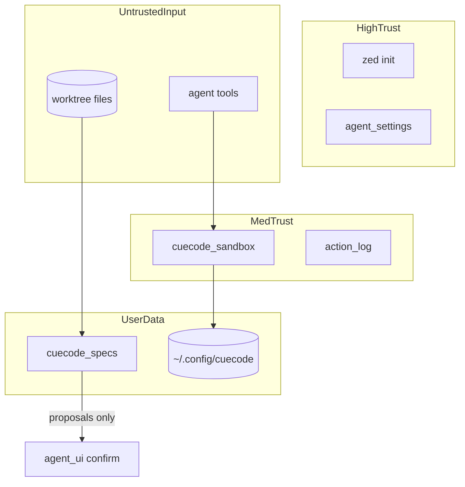

---

## Sequence: checkpoint restore failure {#seq-checkpoint-restore-fail}

```mermaid
sequenceDiagram
    actor Maya
    participant UI as agent_ui
    participant SB as cuecode_sandbox
    participant AL as action_log
    participant DISK as checkpoint store
    participant GIT as git_store

    Maya->>UI: Restore Turn 5 + git HEAD
    UI->>SB: restore_checkpoint(id, {git: true})
    SB->>DISK: read cp_*.json
    DISK-->>SB: Checkpoint blob
    SB->>AL: restore buffers
    AL-->>SB: Error: buffer path missing (external delete)
    SB-->>UI: ERR_CP_RESTORE_PARTIAL
    UI->>Maya: "Some files couldn't restore" + failed paths list
    alt User retries without git
        Maya->>UI: Uncheck git restore, retry
        UI->>SB: restore_checkpoint(id, {git: false})
        SB->>AL: restore remaining buffers
        AL-->>SB: partial OK
        SB-->>UI: RestoreComplete with warnings
    else User aborts
        Maya->>UI: Cancel
        UI-->>Maya: Session unchanged after partial failure rollback
    end
    Note over SB,GIT: If AL succeeded but GIT failed
    SB->>GIT: checkout HEAD
    GIT-->>SB: ERR_CP_GIT_CHECKOUT dirty worktree
    SB-->>UI: File/plan restored; git skipped — ERR_CHECKPOINT_DIRTY_GIT
```

---

## Sequence: spec write conflict {#seq-spec-write-conflict}

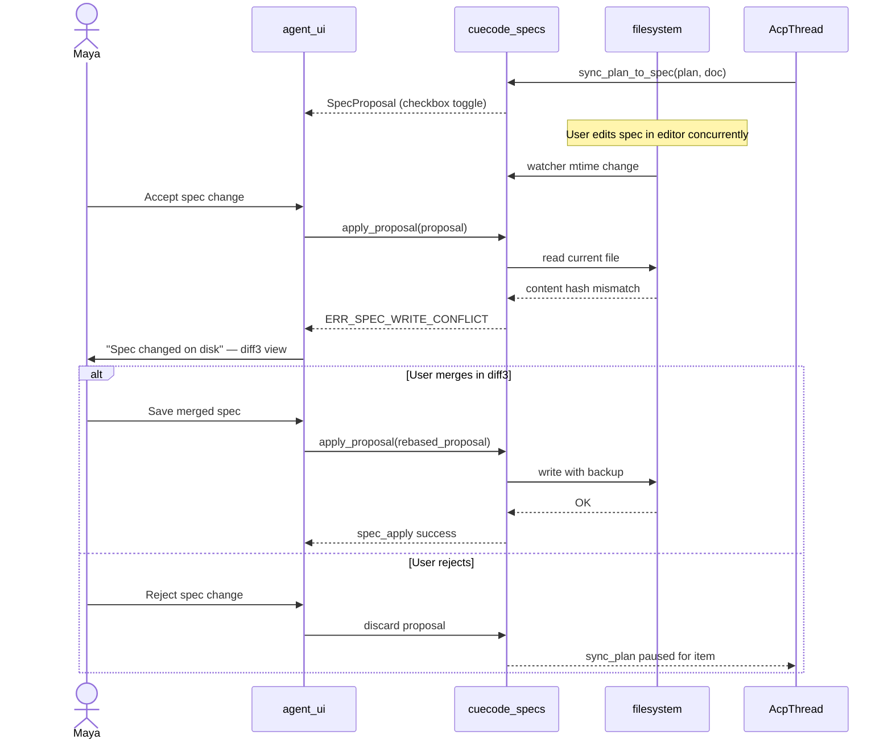

---

## Sequence: trust promotion {#seq-trust-promotion}

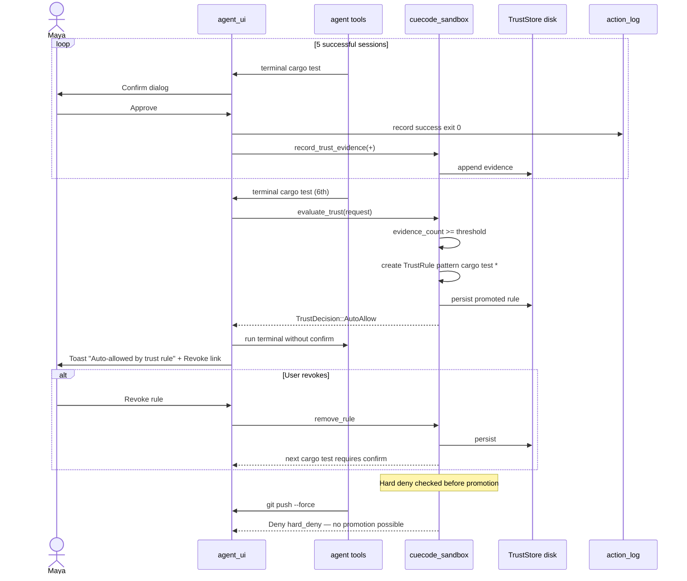

---

## Performance budgets (system) {#performance-budgets}

Targets at `cuecode_*` API boundaries. UI budgets in [04 §performance-budgets](./04-sandbox-core#performance-budgets).

| API | Crate | P95 | P99 | Notes |
|-----|-------|-----|-----|-------|
| `load_spec_index` cold | cuecode_specs | 150 ms | 400 ms | 50 markdown files |
| `load_spec_index` warm | cuecode_specs | 30 ms | 80 ms | single file change |
| `read_spec` | cuecode_specs | 20 ms | 50 ms | <200KB body |
| `propose_spec_update` | cuecode_specs | 40 ms | 100 ms | diff generation |
| `apply_proposal` | cuecode_specs | 60 ms | 150 ms | includes backup write |
| `sync_plan_to_spec` | cuecode_specs | 25 ms | 70 ms | 20 plan entries |
| `create_checkpoint` | cuecode_sandbox | 250 ms | 600 ms | 10 action_log entries |
| `restore_checkpoint` | cuecode_sandbox | 400 ms | 1000 ms | 5 files |
| `list_checkpoints` | cuecode_sandbox | 30 ms | 80 ms | 50 metadata entries |
| `load_trust_store` | cuecode_sandbox | 25 ms | 60 ms | |
| `evaluate_trust` | cuecode_sandbox | 5 ms | 15 ms | per tool call |
| `apply_intent` | cuecode_sandbox | 50 ms | 120 ms | includes settings merge |
| `SandboxSession::new` | cuecode_sandbox | 80 ms | 200 ms | session create component |

### Session create budget breakdown {#perf-session-create}

```mermaid
gantt
    title Session create P95 budget 200ms
    dateFormat X
    axisFormat %L ms
    section UI
    ConversationView shell     :0, 40
    section cuecode_specs
    load_spec_index           :40, 150
    section cuecode_sandbox
    SandboxSession new        :150, 200
    load_trust_store          :crit, 150, 180
```

### Spec index size vs latency {#perf-spec-index-chart}

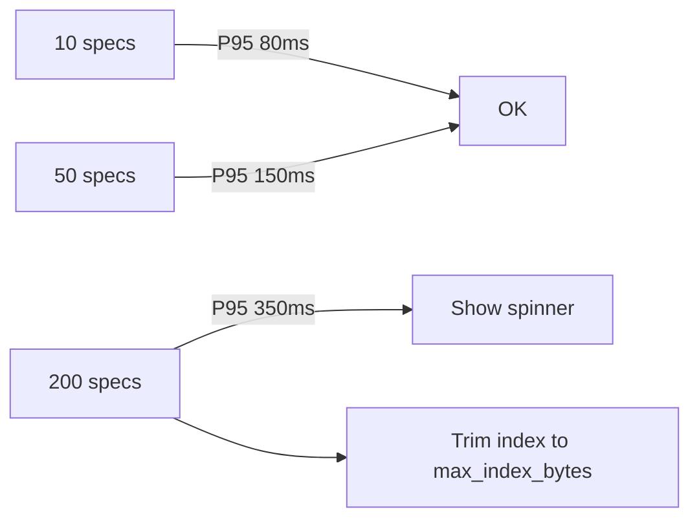

---

## Integration test matrix {#integration-test-matrix}

| Flow | Crates | Automated | Manual |
|------|--------|-----------|--------|
| Index → prompt inject | specs + agent | yes | QA-06-01 |
| Plan → propose → conflict | specs + acp_thread | yes | QA-06-04 |
| Checkpoint round-trip | sandbox + action_log | yes | QA-06-02 |
| Restore partial fail | sandbox + action_log | yes | QA-04-05 |
| Trust promote + revoke | sandbox | yes | QA-05-02 |
| Intent → tool_permissions | sandbox + agent_settings | yes | QA-04-02 |

---

## Cross-reference index {#cross-links}

| Topic | Document |
|-------|----------|
| Zed baseline | [02-current-architecture](./02-current-architecture) |
| Sandbox product spec | [04-sandbox-core](./04-sandbox-core) |
| Innovations | [05-innovations](./05-innovations) |
| Roadmap | [07-implementation-roadmap](../delivery/07-implementation-roadmap) |
| Tools / permissions | [08-agent-tools-and-skills](../agent/08-agent-tools-and-skills) |
| UI | [09-ui-ux-spec](../design/09-ui-ux-spec) |
| Infrastructure / OS sandbox | [10-infrastructure](../ops/10-infrastructure) |
| Metrics | [11-metrics-and-success](../ops/11-metrics-and-success) |
| Open questions | [12-open-questions](../ops/12-open-questions) |
| Harness (local) | [harness/local/01-agent-harness.md](../harness/local/01-agent-harness.md) |
| Harness (cloud) | [harness/cloud/README.md](../harness/cloud/README.md) |
| Cloud client crate | [harness/cloud/04-open-client.md](../harness/cloud/04-open-client.md) |

---

## Open engineering decisions {#open-decisions}

Track in [12-open-questions](../ops/12-open-questions):

1. `acp_thread` → `cuecode_sandbox` dependency direction (facade crate vs feature flag module)
2. Checkpoint storage cap and pruning policy
3. Whether `cuecode_ui` extracts at Phase 3 or Phase 5
4. Windows sandbox timeline vs permissions-only v1
5. Spec index in external ACP agent prompts (inject vs UI-only)
