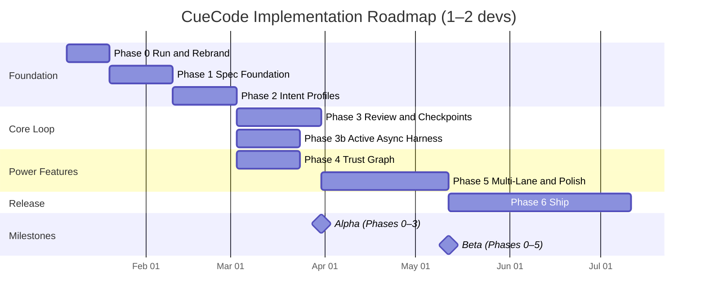
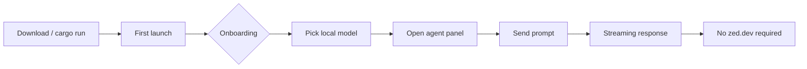
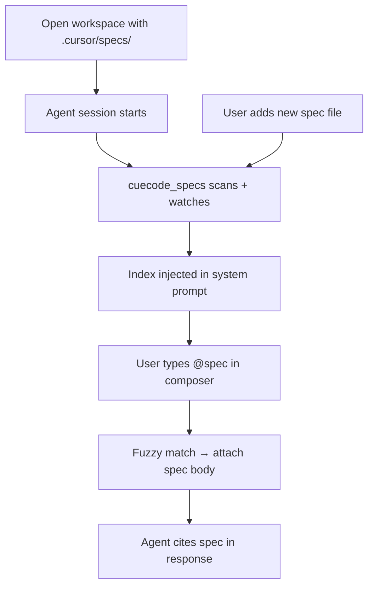
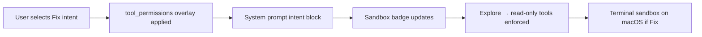
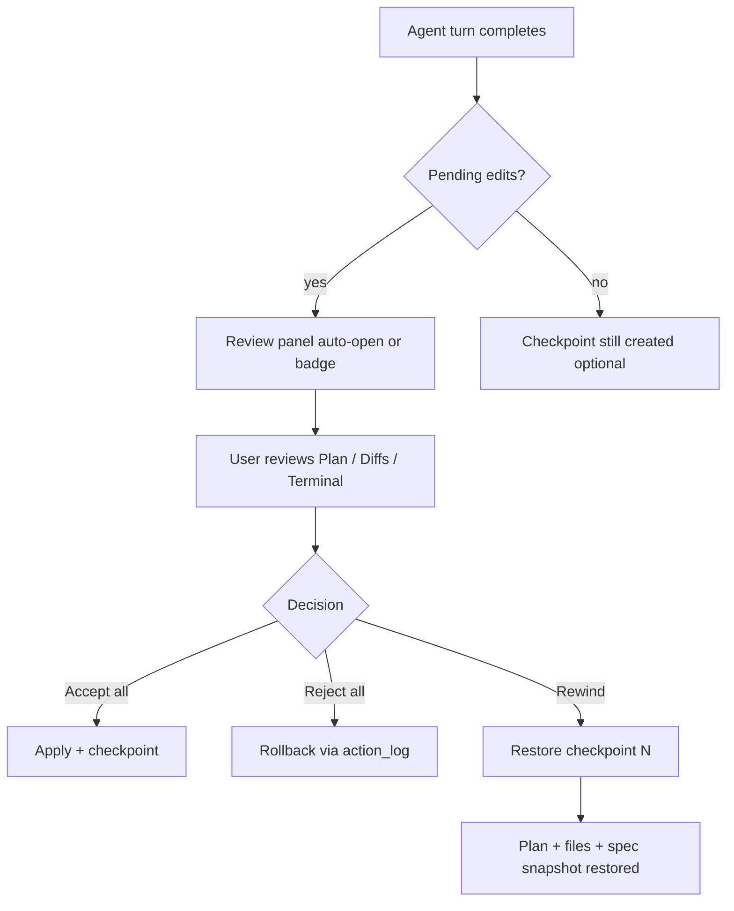
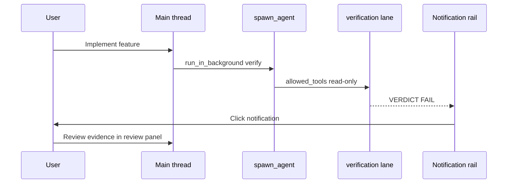
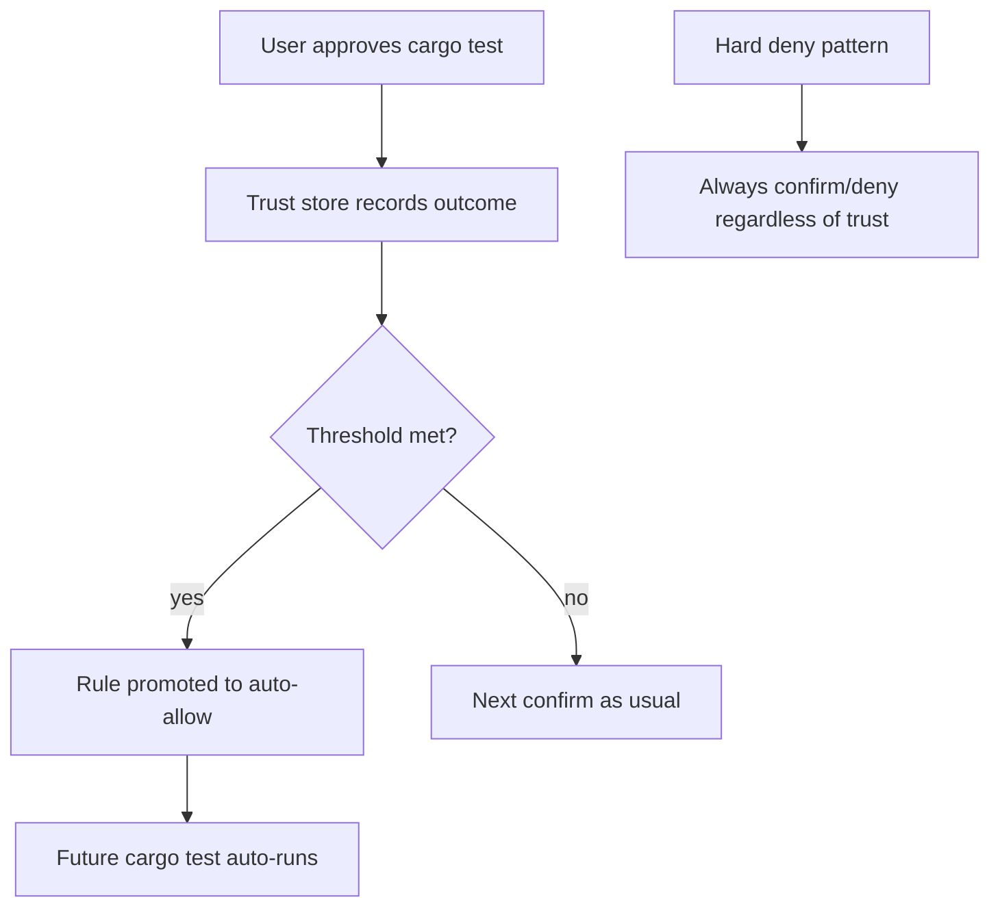
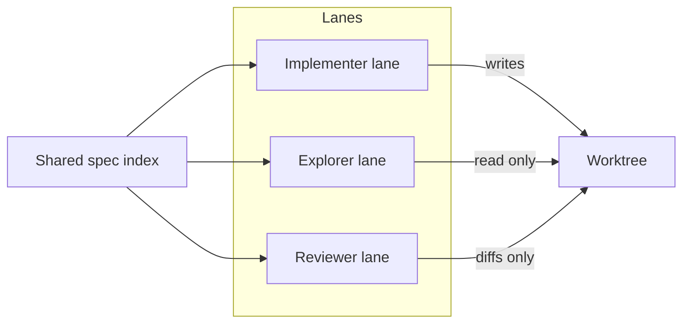
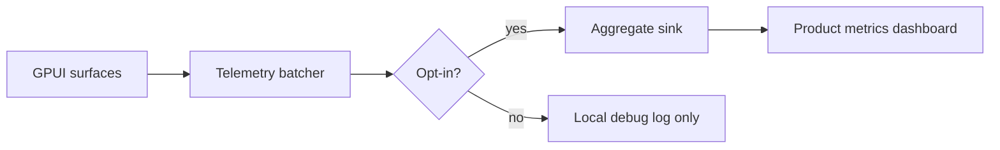
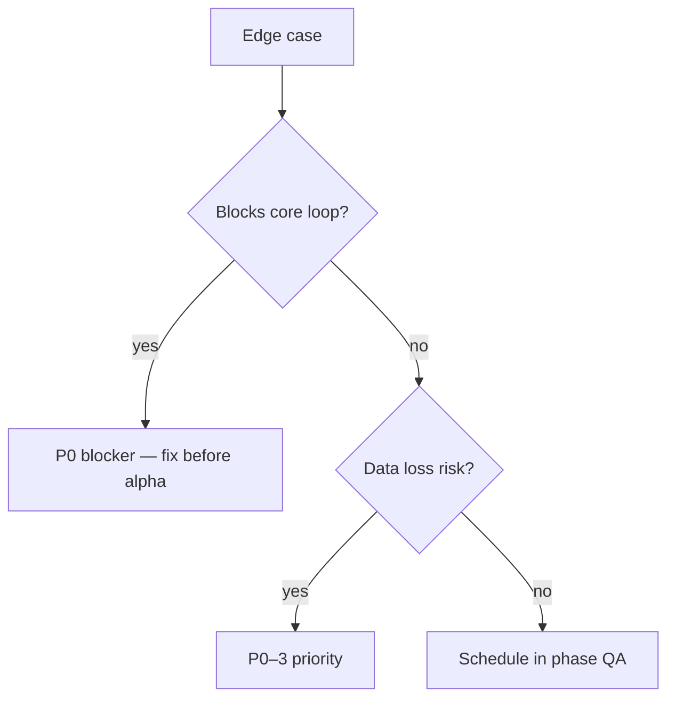

# Implementation Roadmap {#implementation-roadmap}

Phased delivery from Zed fork to shippable CueCode alpha, beta, and public release.
Estimates assume **1–2 focused developers** working full-time on CueCode product
work (not upstream Zed maintenance). Adjust timelines linearly for team size; add
buffer for platform-specific sandbox work (macOS Seatbelt, Linux Bubblewrap).

This document is the **execution contract** for product engineering. Every PR that
implements CueCode-specific behavior should link to a phase task and exit criterion
below. When reality diverges, update this file in the same PR.

> **Build phase X.Y:** For sub-phase task lists, file touchpoints, QA scripts, and doc
> routes, use [build-plans/00-master-build-plan](./build-plans/00-master-build-plan.md)
> (`Build phase 0.1`, `Build phase 3b.2`, etc.).

**Related specs:** [01-vision](../core/01-vision), [04-sandbox-core](../core/04-sandbox-core),
[05-innovations](../core/05-innovations), [06-system-design](../core/06-system-design),
[09-ui-ux-spec](../design/09-ui-ux-spec), [harness/README](../harness/README.md)

> **Phase 3b split:** Cloud harness milestones → [harness/cloud/08-roadmap.md](../harness/cloud/08-roadmap.md).
> Local in-process harness → [harness/local/01-agent-harness.md](../harness/local/01-agent-harness.md).

---

## How to read this roadmap {#how-to-read}

**Sub-phases:** Roadmap phases 0–6 are split into executable slices in
[build-plans/00-master-build-plan §phase-index](./build-plans/00-master-build-plan.md#phase-index).

| Column / section | Meaning |
|------------------|---------|
| **Duration** | Calendar weeks for 1–2 devs; includes code review and basic QA |
| **Product narrative** | What the user *feels* when the phase lands — not crate names |
| **Tasks** | Concrete engineering work; `[ ]` = not started, `[~]` = in progress, `[x]` = done |
| **Labels** | `*(gate)*` = proven by `rebrand-check.sh` / `qa-p0.sh`; `*(manual)*` = human verification only |
| **Exit criteria** | Observable behaviors a PM or dogfooder can verify without reading Rust |
| **Risks** | Known blockers or scope traps |
| **Dependencies** | Hard prerequisites; parallel work called out explicitly |

**Progress:** check off tasks in each phase section below; sub-phase detail in **[build-plans/phases/](./build-plans/phases/)**; rollup at [#progress](#progress).

**Invoke work:** `Build phase X.Y` → open [build-plans/phases/](./build-plans/phases/) file for that ID only.

---

## Progress {#progress}

**Last verified:** 2026-07-02 (PulseBoard 1.4m Q1–Q12 manual QA; `split_column` + `cargo check -p cuecode`)

**Workflow:** finish a sub-phase → check tasks in [#phase-N-tasks](#phase-0-tasks) **and** [build-plans/phases/](./build-plans/phases/) → update **Status** in the sub-phase file → sync here.

| Phase | State | Sub-phases |
|-------|-------|------------|
| **P0** | Mostly done | [0.1](#progress-phase-0) · [0.2](#progress-phase-0) · [0.3](#progress-phase-0) |
| **P1** | In progress | [1.1–1.6 Planning Hub](#progress-phase-1) |
| **P2** | Not started | [2.1–2.2](#progress-phase-2) |
| **P3** | Not started | [3.1–3.2](#progress-phase-3) |
| **P3b** | Not started | [3b.1–3b.2](#progress-phase-3b) |
| **P4** | Not started | [4.1](#progress-phase-4) |
| **P5** | Not started | [5.1–5.2](#progress-phase-5) |
| **P6** | Not started | [6.1–6.2](#progress-phase-6) |
| **Cloud** | C.0 partial | [C.0–C.4](#progress-cloud) |

Full index: [build-plans README §phase-index](./build-plans/README.md#phase-index) · **Next:** [Build phase 1.5](./build-plans/phases/1-5-spec-roots-pin-modes.md)

### Phase 0 sub-phases {#progress-phase-0}

**0.1** `[x] Done` — [Identity & paths](./build-plans/phases/0-1-identity.md) (6/7 tasks)
- [x] **0.1.1** `APP_NAME = "CueCode"` — `crates/paths/src/paths.rs`
- [x] **0.1.2** Binary `cuecode` — `crates/cuecode/Cargo.toml [[bin]]`
- [x] **0.1.3** Compile-time assert passes — `crates/cuecode/src/main.rs`
- [x] **0.1.4** Display names + app IDs — `crates/release_channel/src/lib.rs`
- [x] **0.1.5** Window/title bar strings — `crates/title_bar/, crates/cuecode/src/zed.rs`
- [x] **0.1.6** Windows metadata — `crates/windows_resources/`
- [ ] **0.1.7** App icons (minimal swap OK) — `assets/icons/, crates/icons/`

**0.2** `[x] Done` — [Cloud decouple & defaults](./build-plans/phases/0-2-cloud-decouple.md) (9/9 tasks)
- [x] **0.2.1** Default model → Ollama/BYOK — `assets/settings/default.json`
- [x] **0.2.2** Replace CueCode onboarding — `crates/ai_onboarding/, crates/onboarding/`
- [x] **0.2.3** Remove Zed Pro / trial upsell — `crates/agent_ui/src/end_trial_upsell.rs, edit_prediction_ui/, thread_view.rs`
- [x] **0.2.4** Hide sign-in + account UI — `crates/title_bar/, crates/cuecode/src/zed.rs`
- [x] **0.2.5** Hide collab/channels menus — `crates/collab_ui/, crates/app_menus/src/app_menus.rs`
- [x] **0.2.6** Stub/replace billing URLs — `crates/client/src/zed_urls.rs, crates/client/src/client.rs`
- [x] **0.2.7** Disable auto-update to zed.dev — `crates/auto_update/`
- [x] **0.2.8** Telemetry off by default — `crates/telemetry/, assets/settings/default.json`
- [x] **0.2.9** About dialog: CueCode + GPL — `About view in crates/zed/`

**0.3** `[x] Done` — [Packaging, CLI & rebrand QA](./build-plans/phases/0-3-packaging-qa.md) (6/6 tasks)
- [x] **0.3.1** CLI rebrand (`cuecode --help`) — `crates/cuecode/, CLI entrypoints`
- [x] **0.3.2** Bundle scripts (macOS `.app`, Linux `.desktop`) — `script/bundle-*.sh, packaging configs`
- [x] **0.3.3** Flatpak/snap/Windows installer strings — `installer metadata, crates/windows_resources/`
- [x] **0.3.4** CI grep job for rebrand regression — `.github/workflows/ or CI scripts`
- [x] **0.3.5** Link CONTRIBUTING/README to specs — `CONTRIBUTING.md, README.md`
- [x] **0.3.6** Optional: strip/replace `docs/` Zed copy — `docs/`

#### Phase 0 cross-cutting (roadmap)

- [x] Verify data dir isolation: no shared KV store keys with upstream Zed — `qa-config-isolation.sh` + `qa-p0.sh` Step 5 *(gate)*
- [x] Document BYOK setup in onboarding copy — [09-ui-ux-spec](../design/09-ui-ux-spec#onboarding) · `crates/ai_onboarding/`
- [x] `./script/clippy` passes on touched crates — rebrand crate set *(gate)*
- [x] Agent prompt via Ollama — `qa-agent-ollama.sh` + CI *(gate)*
- [x] Idle app does not phone `zed.dev` — `network-idle-audit.sh` *(gate)*
- [x] Cleanup passes A–E — [03-zed-reference-cleanup-phases](../core/03-zed-reference-cleanup-phases#progress)
- [ ] Optional: [doc screenshots backlog](../build-plans/README.md#doc-screenshots-backlog) (10 CueCode re-captures) · [auto-update E2E](../core/03-pass-c-auto-update-smoke-test.md)

**Phase 0 not complete until** cross-cutting items above are `[x]` and [#phase-0-exit](#phase-0-exit) passes.

### Phase 1 sub-phases {#progress-phase-1}

**1.1** `[x] Done` — [`cuecode_specs` crate](./build-plans/phases/1-1-cuecode-specs.md) (6/6 tasks)
- [x] **1.1.1** Create `crates/cuecode_specs/` — `crates/cuecode_specs/Cargo.toml, src/lib.rs`
- [x] **1.1.2** `SpecIndex` scan `.cursor/specs/**/*.md` — `crates/cuecode_specs/src/index.rs`
- [x] **1.1.3** YAML frontmatter parser (lenient) — `crates/cuecode_specs/src/parse.rs`
- [x] **1.1.4** Filesystem watcher + debounce ≤2s — `crates/cuecode_specs/src/watch.rs`
- [x] **1.1.5** `SpecEntry { path, title, summary, anchor_ids }` — `crates/cuecode_specs/src/index.rs`
- [x] **1.1.6** Unit tests with fixture tree — `crates/cuecode_specs/tests/`

**1.2** `[x] Done` — [Agent integration (@spec + system prompt)](./build-plans/phases/1-2-agent-spec-integration.md) (6/6 tasks; manual QA 2026-06-20)
- [x] **1.2.1** Spec index block in system prompt — `crates/agent/templates/`
- [x] **1.2.2** `@spec` fuzzy completion — `crates/agent_ui/ composer`
- [x] **1.2.3** Session field `active_spec_path` — `crates/acp_thread/`
- [x] **1.2.4** Compaction preserves index + linked spec — `crates/agent/`
- [x] **1.2.5** `/list-specs` stub or tool — `crates/agent/ tools`
- [x] **1.2.6** Analytics: `cuecode.spec.*` events — `crates/telemetry/`

**1.3** `[~]` **Superseded** — [Spec UI stub](./build-plans/phases/1-3-spec-ui-stub.md) → use Planning Hub track below

**1.3-rev** `[x]` Done — [Planning Hub v0 (P-H0)](./build-plans/phases/1-3-rev-planning-hub-v0.md) (8/8 tasks)

**1.4** `[x]` Done — [Manifest + Build track + ticket session (P-H1)](./build-plans/phases/1-4-planning-hub-manifest.md)
- [x] **1.4.1–1.4.9** `cuecode_plans`, `refs[]`, Implement ticket session, dogfood manifest

**1.4a** `[x]` Done — [QA fixture bootstrap (PulseBoard)](./build-plans/phases/1-4a-qa-fixture-bootstrap.md)
- [x] **1.4a.1–1.4a.5** PulseBoard seed, QA-P1-Plan passed 2026-06-23

**1.4b** `[x]` Done — [Plan UI integration (P-H1b)](./build-plans/phases/1-4b-plan-ui-integration.md)
- [x] **1.4b.1–1.4b.9** Plan tab, detached window, demote modal

**1.4c** `[x]` Done — [Plan ↔ Chat navigation polish](./build-plans/phases/1-4c-plan-navigation-polish.md)
- [x] **1.4c.1–1.4c.5** Two-row chrome, strip row, sidebar sync, Threads restore

**1.4d** `[x]` Done — [Surface shortcuts & chrome polish](./build-plans/phases/1-4d-surface-shortcuts-polish.md)
- [x] **1.4d.1–1.4d.5** Segmented tabs, Focus Agent Chat/Terminal, keymaps

**1.4e** `[x]` Done — [Agent layout & multi-window](./build-plans/phases/1-4e-agent-layout-multi-window.md)
- [x] **1.4e.1–1.4e.7** Bottom dock, Panel Position menu, detached Threads window, palette action

**1.4f** `[x]` Done — [Layout Studio](./build-plans/phases/1-4f-layout-studio.md)
- [x] **1.4f.1–1.4f.13** Dollhouse modal, presets, Apply → `PanelLayout` + detach + component preview

**1.4h** `[x]` Done — [Agent / Nav column split](./build-plans/phases/1-4h-agent-nav-column-split.md)
- [x] **1.4h.1–1.4h.5** Inner agent strip + dock suppress when Agent + Nav share a side
- [x] **1.4h.6** Split-aware resize — independent agent inner + nav dock handles

**1.4i** `[x]` Done — [Split-column resize UX](./build-plans/phases/1-4i-split-column-resize-ux.md)
- [x] **1.4i.1–1.4i.5** Split-aware clamp, nav min/ellipsis, tests

**1.4j** `[x]` Done — [Inner column fixed-pixel sizing](./build-plans/phases/1-4j-inner-column-fixed-pixel-sizing.md)
- [x] **1.4j.1–1.4j.4** `PanelResizeMode::FixedPixels` — agent inner drag works with `flexible: true`

**1.4k** `[x]` Done — [Side column row (unified split resize)](./build-plans/phases/1-4k-side-column-row.md)
- [x] **1.4k.1–1.4k.6** blueprint + gutters; recovery in [1.4l](./build-plans/phases/1-4l-side-column-layout-engine.md) / [1.4m](./build-plans/phases/1-4m-layout-stabilization-recovery.md)

**1.4l** `[x]` Done — [Side column layout engine](./build-plans/phases/1-4l-side-column-layout-engine.md)
- [x] **1.4l.1–1.4l.6** `LayoutResolver` + `ColumnShell` + `render_side_layout`; removed `inner_*` flags
- [x] PulseBoard manual QA passed 2026-07-02 via [1.4m recovery](./build-plans/phases/1-4m-layout-stabilization-recovery.md)

**1.4m** `[x]` Done — [Layout stabilization recovery](./build-plans/phases/1-4m-layout-stabilization-recovery.md)  
Master checklist: [07 §1.4m master checklist](#phase-1-4m-master-checklist) (Q1–Q12 passed 2026-07-02)

**1.5** `[ ]` Not started — [Spec roots + pin modes (P-H2)](./build-plans/phases/1-5-spec-roots-pin-modes.md) — **Next**

**1.6** `[ ] Not started` — [Organize with AI (P-H3)](./build-plans/phases/1-6-organize-with-ai.md) — **Phase 1 complete**

> **Design:** [Agent Linear / Plan](../design/16-planning-hub.md) · Dogfood: [`.cuecode/project.yaml`](../../.cuecode/project.yaml) (alias → target `.cuecode/plans/project.yaml`)

### Phase 2 sub-phases {#progress-phase-2}

**2.1** `[ ] Not started` — [`cuecode_sandbox` intent core](./build-plans/phases/2-1-intent-core.md) (0/8 tasks)
- [ ] **2.1.1** Create `cuecode_sandbox` (or module → migrate) — `crates/cuecode_sandbox/`
- [ ] **2.1.2** `Intent` enum + `IntentProfile` struct — `crates/cuecode_sandbox/src/intent.rs`
- [ ] **2.1.3** Wire intent → `tool_permissions` — `crates/agent/, crates/cuecode_sandbox/src/policy.rs`
- [ ] **2.1.4** Wire intent → `agent::sandboxing` — `crates/agent/src/sandboxing.rs`
- [ ] **2.1.5** Intent block in agent templates — `crates/agent/templates/`
- [ ] **2.1.6** Persist intent per workspace — `crates/cuecode_sandbox/src/persistence.rs`
- [ ] **2.1.7** `~/.config/cuecode/intent_profiles.json` overrides — `crates/cuecode_sandbox/src/persistence.rs`
- [ ] **2.1.8** Feature-flag Orchestrate (off until 3b/5) — `crates/cuecode_sandbox/src/intent.rs`

**2.2** `[ ] Not started` — [Intent UI + sandbox badge](./build-plans/phases/2-2-intent-ui.md) (0/6 tasks)
- [ ] **2.2.1** Intent switcher in agent header — `crates/agent_ui/`
- [ ] **2.2.2** Sandbox badge + popover — `crates/agent_ui/`
- [ ] **2.2.3** Hide write UI in Explore — `crates/agent_ui/`
- [ ] **2.2.4** `cmd-shift-i` cycle intent — `crates/workspace/src/keymap.rs, crates/agent_ui/`
- [ ] **2.2.5** Settings UI stub: Agent → Intent Profiles — `crates/settings_ui/ or settings panel`
- [ ] **2.2.6** Analytics: `cuecode.intent.*`, `cuecode.sandbox.*` — `crates/telemetry/`

**2.3** `[ ] Not started` — [Composer modes + Agent Builder](./build-plans/phases/2-3-composer-modes-agent-builder.md) (0/27 tasks)
- See [14-agent-modes-and-builder](../agent/14-agent-modes-and-builder.md) — Cursor-class footer picker, saved agents, builder UI, migration from Zed profiles

### Phase 3 sub-phases {#progress-phase-3}

**3.1** `[ ] Not started` — [Checkpoint store](./build-plans/phases/3-1-checkpoint-store.md) (0/6 tasks)
- [ ] **3.1.1** `CheckpointStore` in `cuecode_sandbox` — `crates/cuecode_sandbox/src/checkpoint.rs`
- [ ] **3.1.2** Snapshot: action_log, plan, spec path, terminal IDs — `crates/cuecode_sandbox/src/checkpoint.rs`
- [ ] **3.1.3** Create on turn complete (configurable) — `crates/agent_ui/, crates/cuecode_sandbox/`
- [ ] **3.1.4** Restore / rewind — `crates/cuecode_sandbox/src/checkpoint.rs`
- [ ] **3.1.5** Optional git stash integration (flag, default off) — `crates/cuecode_sandbox/src/checkpoint.rs`
- [ ] **3.1.6** Checkpoint timeline UI (minimal) — `crates/agent_ui/`

**3.2** `[ ] Not started` — [Unified review panel](./build-plans/phases/3-2-review-panel.md) (0/5 tasks)
- [ ] **3.2.1** review_panel.rs — Plan / Diffs / Terminal / Spec tabs — `crates/agent_ui/src/review_panel.rs`
- [ ] **3.2.2** Accept all / reject all / partial — `crates/agent_ui/src/review_panel.rs`
- [ ] **3.2.3** Triggers: turn complete, `cmd-shift-r`, notification — `crates/agent_ui/`
- [ ] **3.2.4** Plan ↔ spec checkbox mapping (v1, confirm) — `crates/cuecode_specs/src/sync.rs`
- [ ] **3.2.5** Analytics: `cuecode.review.*`, `cuecode.checkpoint.*` — `crates/telemetry/`

### Phase 3b sub-phases {#progress-phase-3b}

**3b.1** `[ ] Not started` — [`run_in_background` + builtin agents](./build-plans/phases/3b-1-background-spawn.md) (0/5 tasks)
- [ ] **3b.1.1** `ExecutionContext` Active/Async/Hybrid — `crates/cuecode_sandbox/src/execution.rs`
- [ ] **3b.1.2** `spawn_agent` + `run_in_background: bool` — `crates/agent/ tools, crates/cuecode_sandbox/`
- [ ] **3b.1.3** Builtin defs: explore, verification (tool walls) — `crates/cuecode_sandbox/src/builtin_agents.rs`
- [ ] **3b.1.4** Sidechain JSONL under session dir — `crates/cuecode_sandbox/src/execution.rs`
- [ ] **3b.1.5** Resume via `session_id` — `crates/acp_thread/, crates/agent_ui/`

**3b.2** `[ ] Not started` — [Notification rail + VERDICT](./build-plans/phases/3b-2-notification-verdict.md) (0/6 tasks)
- [ ] **3b.2.1** Notification rail UI — `crates/agent_ui/`
- [ ] **3b.2.2** Payload schema (XML/JSON) — `crates/cuecode_sandbox/src/execution.rs`
- [ ] **3b.2.3** Verification agent + VERDICT parse — `crates/cuecode_sandbox/src/builtin_agents.rs`
- [ ] **3b.2.4** FAIL blocks Ship complete (override audit) — `crates/agent_ui/, crates/cuecode_sandbox/`
- [ ] **3b.2.5** Stop hooks v1 (memory extract stub) — `crates/agent/`
- [ ] **3b.2.6** Analytics: harness events — `crates/telemetry/`

### Phase 4 sub-phases {#progress-phase-4}

**4.1** `[ ] Not started` — [Trust store + UI](./build-plans/phases/4-1-trust-store.md) (0/6 tasks)
- [ ] **4.1.1** Trust JSON per repo hash — `crates/cuecode_sandbox/src/trust.rs`
- [ ] **4.1.2** Promotion thresholds + hard deny — `crates/cuecode_sandbox/src/trust.rs`
- [ ] **4.1.3** Settings → Agent → Trust UI — `crates/settings_ui/ or settings panel`
- [ ] **4.1.4** Tool card labels: auto-approved vs you approved — `crates/agent_ui/`
- [ ] **4.1.5** Unit tests in `cuecode_sandbox` — `crates/cuecode_sandbox/tests/`
- [ ] **4.1.6** Analytics: `cuecode.trust.*` — `crates/telemetry/`

### Phase 5 sub-phases {#progress-phase-5}

**5.1** `[ ] Not started` — [Multi-lane model](./build-plans/phases/5-1-multi-lane.md) (0/5 tasks)
- [ ] **5.1.1** Lane tabs or split in agent panel — `crates/agent_ui/`
- [ ] **5.1.2** Explorer + Implementer presets — `crates/cuecode_sandbox/src/builtin_agents.rs`
- [ ] **5.1.3** Reviewer lane (read-only intent) — `crates/agent_ui/, crates/cuecode_sandbox/`
- [ ] **5.1.4** Write conflict detection + banner — `crates/agent_ui/`
- [ ] **5.1.5** `parent_session_id` / thread grouping — `crates/acp_thread/`

**5.2** `[ ] Not started` — [Composer-first layout + polish](./build-plans/phases/5-2-composer-polish.md) (0/6 tasks)
- [ ] **5.2.1** Composer-first layout preset — `crates/workspace/, crates/agent_ui/`
- [ ] **5.2.2** Project panel collapsed default — `crates/project_panel/`
- [ ] **5.2.3** Terminal replay (basic re-run) — `crates/agent_ui/, crates/terminal/`
- [ ] **5.2.4** Context budget UI (optional) — `crates/agent_ui/`
- [ ] **5.2.5** Notification rail polish — `crates/agent_ui/`
- [ ] **5.2.6** Visual regression baselines — `crates/agent_ui/tests/ or screenshot CI`

### Phase 6 sub-phases {#progress-phase-6}

**6.1** `[ ] Not started` — [Release artifacts + docs](./build-plans/phases/6-1-release-docs.md) (0/7 tasks)
- [ ] **6.1.1** macOS DMG / Linux tarball build scripts rebranded — `script/bundle-*.sh, release CI`
- [ ] **6.1.2** Windows best-effort build notes — `docs/, CONTRIBUTING.md`
- [ ] **6.1.3** CueCode docs site — `docs/`
- [ ] **6.1.4** Example template repo with `.cursor/specs/` + skills — `external template repo`
- [ ] **6.1.5** GPL source release process — `CONTRIBUTING.md, release docs`
- [ ] **6.1.6** Crash reporting opt-in — `crates/telemetry/`
- [ ] **6.1.7** Release notes template — `AGENTS.md or docs/release-notes.md`

**6.2** `[ ] Not started` — [Competitive 1.0 gate](./build-plans/phases/6-2-competitive-gate.md) (0/5 tasks)
- [ ] **6.2.1** 100% inventory rows Adopt/Adapt/Defer/Reject — `research/00-claude-code-inventory.md, research/01-parity-decisions.md`
- [ ] **6.2.2** ≥90% top-60 commands mapped in GPUI — `parity/19-command-surface.md`
- [ ] **6.2.3** Flows A–H manual QA pass — `parity/16-end-to-end-flows.md`
- [ ] **6.2.4** [21 §surface-matrix](../../parity/21-ai-surfaces.md#surface-matrix) published — `parity/21-ai-surfaces.md`
- [ ] **6.2.5** Link all PRs to inventory row IDs — `PR process, parity/15-competitive-parity.md`

### Cloud track sub-phases {#progress-cloud}

**C.0** `[~] In progress` — [CHP stub + one tool](./build-plans/phases/c-0-chp-stub.md) (0/4 tasks)
- [ ] **C.0.1** CHP v0 message types — `crates/cuecode_cloud/, [03-protocol](../../harness/cloud/03-protocol.md)`
- [ ] **C.0.2** Stub harness-api — `private cuecode-harness / cuecode-cloud-m0 repo`
- [ ] **C.0.3** `cuecode_cloud` crate + adapter — `crates/cuecode_cloud/`
- [ ] **C.0.4** `read_file` round-trip integration test — `crates/cuecode_cloud/tests/`

**C.1** `[ ] Not started` — [Streaming default cloud](./build-plans/phases/c-1-streaming-cloud.md) (0/6 tasks)
- [ ] **C.1.1** Gateway router + fast/quality tiers — `private cuecode-harness model-gateway`
- [ ] **C.1.2** Turn engine persistent transcript store — `private harness-api`
- [ ] **C.1.3** Client stream decoder → `acp_thread` — `crates/cuecode_cloud/`
- [ ] **C.1.4** Onboarding: cloud vs local explainer — `crates/ai_onboarding/`
- [ ] **C.1.5** Cloud build flag (`release_channel = cloud`) — `crates/release_channel/`
- [ ] **C.1.6** Context assembly v1 — spec index from client snapshot — `crates/cuecode_cloud/`

**C.2** `[ ] Not started` — [Subagent async](./build-plans/phases/c-2-subagent-async.md) (0/6 tasks)
- [ ] **C.2.1** Server subagent spawner + builtin registry — `private harness-api scheduler`
- [ ] **C.2.2** CHP notification subscription (WebSocket or SSE) — `crates/cuecode_cloud/`
- [ ] **C.2.3** Client `ExecutionContext` on spawn from composer — `crates/cuecode_cloud/, crates/agent_ui/`
- [ ] **C.2.4** EC-20: duplicate `session_id` resume handling — `crates/cuecode_cloud/`
- [ ] **C.2.5** Task pills + rail — data from CHP — `crates/agent_ui/`
- [ ] **C.2.6** Sidechain transcript sync (cloud SoT) — `crates/cuecode_cloud/`

**C.3** `[ ] Not started` — [VERDICT Hybrid](./build-plans/phases/c-3-verdict-hybrid.md) (0/6 tasks)
- [ ] **C.3.1** Verification agent outline + parser tests — `private harness-api verdict service`
- [ ] **C.3.2** Artifact store for evidence markdown — `private harness-api`
- [ ] **C.3.3** Client override audit log entry — `crates/cuecode_cloud/`
- [ ] **C.3.4** Coordinator spawn (Orchestrate intent) — minimal v1 — `crates/cuecode_sandbox/, harness-api`
- [ ] **C.3.5** Plan import to `AcpThread.plan` — `crates/cuecode_cloud/`
- [ ] **C.3.6** Unified review on VERDICT click — `crates/agent_ui/`

**C.4** `[ ] Not started` — [BYOK enterprise](./build-plans/phases/c-4-byok-enterprise.md) (0/6 tasks)
- [ ] **C.4.1** BYOK encrypted key upload — `model-gateway, settings UI`
- [ ] **C.4.2** Org admin console (seats, usage, route policy) — `private admin console`
- [ ] **C.4.3** SSO (SAML/OIDC) — `private auth service`
- [ ] **C.4.4** Regional routing (EU pool) — `model-gateway`
- [ ] **C.4.5** Audit export (transcript + tool log JSONL) — `harness-api + admin console`
- [ ] **C.4.6** Usage dashboard: tokens per team — `admin console`

---
---

## Timeline overview {#timeline-overview}

### Mermaid Gantt (target schedule)

Assumes Phase 0 starts at **Week 0**. Phase 3 and 3b run in parallel after Phase 2.
Phase 4 can start when Phase 2 intent + permissions plumbing exists.



### ASCII timeline (quarters)

```
Week:  0    2    4    6    8   10   12   14   16   18   20   22   24+
       |----|----|----|----|----|----|----|----|----|----|----|----|
P0     [==]
P1          [======]
P2                    [======]
P3                              [========]
P3b                             [=====]
P4                              [=====]        (parallel w/ P3)
       ^Alpha milestone (end P3)
P5                                        [============]
       ^Beta milestone (end P5)
P6                                                      [==================>
```

---

## Cross-phase product arc {#product-arc}

CueCode delivery follows a single user story that deepens each phase:

1. **Phase 0** — "I can open CueCode, not Zed, and talk to a local model."
2. **Phase 1** — "The agent knows my project's specs without me pasting them."
3. **Phase 2** — "I pick Explore vs Fix and the tool behaves accordingly."
4. **Phase 3** — "I review everything the agent touched and rewind a whole turn."
5. **Phase 3b** — "Background verify and explore lanes don't block my composer."
6. **Phase 4** — "Repeated safe commands stop asking me every time."
7. **Phase 5** — "I run explorer + implementer in parallel without chaos."
8. **Phase 6** — "I can install CueCode, read docs, and ship GPL builds."

Each phase should be **demoable in a 3-minute screen recording** before moving on.

---

## Phase 0 — Run and Rebrand {#phase-0}

**Duration:** 1–2 weeks

**Goal:** Launchable CueCode binary with no Zed account wall.

### Product narrative {#phase-0-narrative}

A solo developer downloads or builds CueCode. The window title says **CueCode**, not
Zed. Config lives under `~/.config/cuecode/`. They open the agent panel, pick Ollama
(or another local provider), send a prompt, and get a streaming response — without
signing into zed.dev, without trial upsells, without accidentally writing to Zed's
config directory. The editor still works; this phase is about **identity and access**,
not sandbox innovation yet.

**User journey (Phase 0):**



### Tasks {#phase-0-tasks}

> **Check boxes here and in [build-plans/phases/](./build-plans/phases/)** — keep both in sync when a task completes.

Track cleanup passes in [03-zed-reference-cleanup-phases → Progress](../core/03-zed-reference-cleanup-phases#progress). Verify with `./script/rebrand-progress.sh --full`.

#### Build phase 0.1 — Identity & paths `[x] Done`

Full doc: [0-1-identity.md](./build-plans/phases/0-1-identity.md)

- [x] **0.1.1** `APP_NAME = "CueCode"` — `crates/paths/src/paths.rs`
- [x] **0.1.2** Binary `cuecode` — `crates/cuecode/Cargo.toml [[bin]]`
- [x] **0.1.3** Compile-time assert passes — `crates/cuecode/src/main.rs`
- [x] **0.1.4** Display names + app IDs — `crates/release_channel/src/lib.rs`
- [x] **0.1.5** Window/title bar strings — `crates/title_bar/, crates/cuecode/src/zed.rs`
- [x] **0.1.6** Windows metadata — `crates/windows_resources/`
- [ ] **0.1.7** App icons (minimal swap OK) — `assets/icons/, crates/icons/`

#### Build phase 0.2 — Cloud decouple & defaults `[x] Done`

Full doc: [0-2-cloud-decouple.md](./build-plans/phases/0-2-cloud-decouple.md)

- [x] **0.2.1** Default model → Ollama/BYOK — `assets/settings/default.json`
- [x] **0.2.2** Replace CueCode onboarding — `crates/ai_onboarding/, crates/onboarding/`
- [x] **0.2.3** Remove Zed Pro / trial upsell — `crates/agent_ui/src/end_trial_upsell.rs, edit_prediction_ui/, thread_view.rs`
- [x] **0.2.4** Hide sign-in + account UI — `crates/title_bar/, crates/cuecode/src/zed.rs`
- [x] **0.2.5** Hide collab/channels menus — `crates/collab_ui/, crates/app_menus/src/app_menus.rs`
- [x] **0.2.6** Stub/replace billing URLs — `crates/client/src/zed_urls.rs, crates/client/src/client.rs`
- [x] **0.2.7** Disable auto-update to zed.dev — `crates/auto_update/`
- [x] **0.2.8** Telemetry off by default — `crates/telemetry/, assets/settings/default.json`
- [x] **0.2.9** About dialog: CueCode + GPL — `About view in crates/zed/`

#### Build phase 0.3 — Packaging, CLI & rebrand QA `[x] Done`

Full doc: [0-3-packaging-qa.md](./build-plans/phases/0-3-packaging-qa.md)

- [x] **0.3.1** CLI rebrand (`cuecode --help`) — `crates/cuecode/, CLI entrypoints`
- [x] **0.3.2** Bundle scripts (macOS `.app`, Linux `.desktop`) — `script/bundle-*.sh, packaging configs`
- [x] **0.3.3** Flatpak/snap/Windows installer strings — `installer metadata, crates/windows_resources/`
- [x] **0.3.4** CI grep job for rebrand regression — `.github/workflows/ or CI scripts`
- [x] **0.3.5** Link CONTRIBUTING/README to specs — `CONTRIBUTING.md, README.md`
- [x] **0.3.6** Optional: strip/replace `docs/` Zed copy — `docs/`

#### Phase 0 cross-cutting (roadmap)

- [x] Verify data dir isolation: no shared KV store keys with upstream Zed — `qa-config-isolation.sh` + `qa-p0.sh` Step 5 *(gate)*
- [x] Document BYOK setup in onboarding copy — [09-ui-ux-spec](../design/09-ui-ux-spec#onboarding) · `crates/ai_onboarding/`
- [x] `./script/clippy` passes on touched crates — rebrand crate set *(gate)*
- [x] Create this `.cursor/specs/` directory
- [x] Link specs from CONTRIBUTING / README — `apps/CueCode-IDE/CONTRIBUTING.md`
- [x] Agent Ollama + network idle gates — see [#progress-phase-0](#progress-phase-0)


### Exit criteria {#phase-0-exit}

- [x] Window shows **CueCode**, config under `~/.config/cuecode/` — `qa-p0.sh` *(gate)*
- [x] Agent sends a prompt to local model without zed.dev login — `qa-agent-ollama.sh` *(headless gate)*; GUI path *(manual)*
- [x] No accidental writes to Zed's config directory — `qa-p0.sh` *(gate)*
- [x] Onboarding does not block on account creation — `qa-p0.sh` / cloud decouple gates *(gate)*
- [x] No idle `zed.dev` network traffic on fresh profile — `network-idle-audit.sh` *(gate)*

### Risks {#phase-0-risks}

| Risk | Mitigation |
|------|------------|
| Hidden zed.dev dependency in model routing | Grep `cloud_api`, `client::UserStore` in agent paths |
| macOS build toolchain friction | Document Xcode + Metal in README |
| GPL compliance for distributed builds | Track in Phase 6; source offer from day one |

### Dependencies {#phase-0-deps}

None — start here.

**Spec:** [03-fork-and-rebrand](../core/03-fork-and-rebrand)

---

## Phase 1 — Spec Foundation {#phase-1}

**Duration:** 2–3 weeks

**Goal:** Specs are first-class agent context.

### Product narrative {#phase-1-narrative}

The developer maintains `.cursor/specs/` in their repo (like this fork). When they
start an agent session, CueCode **already knows** the spec index — titles, paths,
one-line summaries. They type `@spec 05-innovations` in the composer and the agent
loads that file. Adding a new spec file updates the index via filesystem watch without
restarting the app. The agent's answers reference spec sections when relevant; the
user stops copy-pasting markdown into chat.

**User journey (Phase 1):**



### Tasks {#phase-1-tasks}

> **Check boxes here and in [build-plans/phases/](./build-plans/phases/)** — keep both in sync when a task completes.

#### Build phase 1.1 — `cuecode_specs` crate `[x] Done`

Full doc: [1-1-cuecode-specs.md](./build-plans/phases/1-1-cuecode-specs.md)

- [x] **1.1.1** Create `crates/cuecode_specs/` — `crates/cuecode_specs/Cargo.toml, src/lib.rs`
- [x] **1.1.2** `SpecIndex` scan `.cursor/specs/**/*.md` — `crates/cuecode_specs/src/index.rs`
- [x] **1.1.3** YAML frontmatter parser (lenient) — `crates/cuecode_specs/src/parse.rs`
- [x] **1.1.4** Filesystem watcher + debounce ≤2s — `crates/cuecode_specs/src/watch.rs`
- [x] **1.1.5** `SpecEntry { path, title, summary, anchor_ids }` — `crates/cuecode_specs/src/index.rs`
- [x] **1.1.6** Unit tests with fixture tree — `crates/cuecode_specs/tests/`

#### Build phase 1.2 — Agent integration (@spec + system prompt) `[x] Done`

Full doc: [1-2-agent-spec-integration.md](./build-plans/phases/1-2-agent-spec-integration.md)

- [x] **1.2.1** Spec index block in system prompt — `crates/agent/templates/`
- [x] **1.2.2** `@spec` fuzzy completion — `crates/agent_ui/ composer`
- [x] **1.2.3** Session field `active_spec_path` — `crates/acp_thread/`
- [x] **1.2.4** Compaction preserves index + linked spec — `crates/agent/`
- [x] **1.2.5** `/list-specs` stub or tool — `crates/agent/ tools`
- [x] **1.2.6** Analytics: `cuecode.spec.*` events — `crates/telemetry/`

#### Build phase 1.3 — Spec UI stub `[~]` Superseded

Full doc: [1-3-spec-ui-stub.md](./build-plans/phases/1-3-spec-ui-stub.md) — **do not implement**. Use [1.3-rev](./build-plans/phases/1-3-rev-planning-hub-v0.md) → [1.4](./build-plans/phases/1-4-planning-hub-manifest.md) → [1.4a–f](./build-plans/phases/1-4f-layout-studio.md) → [1.5](./build-plans/phases/1-5-spec-roots-pin-modes.md) → [1.6](./build-plans/phases/1-6-organize-with-ai.md).

#### Build phase 1.3-rev — Planning Hub v0 (P-H0) `[x]` Done

Full doc: [1-3-rev-planning-hub-v0.md](./build-plans/phases/1-3-rev-planning-hub-v0.md)

#### Build phase 1.4 — Manifest + Implement (P-H1) `[x]` Done

Full doc: [1-4-planning-hub-manifest.md](./build-plans/phases/1-4-planning-hub-manifest.md)

Sub-phases (Plan UX + layout — implement after 1.4 core):

#### Build phase 1.4a — QA fixture bootstrap (PulseBoard) `[x]` Done

Full doc: [1-4a-qa-fixture-bootstrap.md](./build-plans/phases/1-4a-qa-fixture-bootstrap.md)

- [x] **1.4a.1–1.4a.5** PulseBoard seed, cross-links, QA-P1-Plan on `cuecode-testing-repo`

#### Build phase 1.4b — Plan UI integration (P-H1b) `[x]` Done

Full doc: [1-4b-plan-ui-integration.md](./build-plans/phases/1-4b-plan-ui-integration.md)

- [x] **1.4b.1–1.4b.9** Plan tab, detached window, demote modal

#### Build phase 1.4c — Plan ↔ Chat navigation polish `[x]` Done

Full doc: [1-4c-plan-navigation-polish.md](./build-plans/phases/1-4c-plan-navigation-polish.md)

- [x] **1.4c.1–1.4c.5** Two-row chrome, strip row, sidebar sync, Threads restore

#### Build phase 1.4d — Surface shortcuts & chrome polish `[x]` Done

Full doc: [1-4d-surface-shortcuts-polish.md](./build-plans/phases/1-4d-surface-shortcuts-polish.md)

- [x] **1.4d.1–1.4d.5** Segmented tabs, Focus Agent Chat/Terminal, keymaps

#### Build phase 1.4e — Agent layout & multi-window `[x]` Done

Full doc: [1-4e-agent-layout-multi-window.md](./build-plans/phases/1-4e-agent-layout-multi-window.md)

- [x] **1.4e.1–1.4e.7** Bottom dock, Panel Position menu, detached Threads window

#### Build phase 1.4f — Layout Studio `[x]` Done

Full doc: [1-4f-layout-studio.md](./build-plans/phases/1-4f-layout-studio.md) · Design: [17-layout-studio](../design/17-layout-studio.md)

- [x] **1.4f.1–1.4f.12** Dollhouse modal, presets, Apply → `PanelLayout` + detach
- [x] **1.4f.13** Component preview (`LayoutStudioPreview` in Component Preview gallery)

#### Build phase 1.4h — Agent / Nav column split `[x]` Done

Full doc: [1-4h-agent-nav-column-split.md](./build-plans/phases/1-4h-agent-nav-column-split.md)

- [x] **1.4h.1–1.4h.5** Inner agent strip + dock suppress when sharing a side
- [x] **1.4h.6** Split-aware resize — `resize_displayed_panel`, layout math, inner agent drag

#### Build phase 1.4i — Split-column resize UX `[x]` Done

Full doc: [1-4i-split-column-resize-ux.md](./build-plans/phases/1-4i-split-column-resize-ux.md)

- [x] **1.4i.1–1.4i.2** Split-aware dock/agent clamp — no nav-over-agent overlap
- [x] **1.4i.3–1.4i.4** Nav `min_size` + label ellipsis
- [x] **1.4i.5** Clamp math tests

#### Build phase 1.4j — Inner column fixed-pixel sizing `[x]` Done

Full doc: [1-4j-inner-column-fixed-pixel-sizing.md](./build-plans/phases/1-4j-inner-column-fixed-pixel-sizing.md)

- [x] **1.4j.1–1.4j.4** `PanelResizeMode::FixedPixels` — inner agent drag with `flexible: true`
- [x] **1.4j.5** QA checklist

#### Build phase 1.4k — Side column row (unified split resize) `[x]` Done

Full doc: [1-4k-side-column-row.md](./build-plans/phases/1-4k-side-column-row.md)

- [x] **1.4k.1–1.4k.6** `SideColumnKind`, 14px gutters, blueprint API, PulseBoard QA (via 1.4m)

#### Build phase 1.4l — Side column layout engine `[x]` Done

Full doc: [1-4l-side-column-layout-engine.md](./build-plans/phases/1-4l-side-column-layout-engine.md)

- [x] **1.4l.1–1.4l.4** `LayoutResolver`, `ColumnShell`, `render_side_layout`; removed `inner_*` flags
- [x] **1.4l.5–1.4l.6** Layout Studio invariants + unit tests (`cargo test -p workspace split_column`)
- [x] **PulseBoard manual QA** — passed 2026-07-02 via [1.4m recovery](./build-plans/phases/1-4m-layout-stabilization-recovery.md)

#### Build phase 1.4m — Layout stabilization recovery `[x]` Done {#phase-1-4m-layout-stabilization}

> **Invoke:** `Build phase 1.4m` (or `Build phase 1.4m.0` … `1.4m.4`) — open [1-4m-layout-stabilization-recovery.md](./build-plans/phases/1-4m-layout-stabilization-recovery.md). **Completed 2026-07-02** — PulseBoard Q1–Q12 pass; [1.5](./build-plans/phases/1-5-spec-roots-pin-modes.md) unblocked.

| Field | Value |
|-------|-------|
| **Deliverable** | PulseBoard usable: editor shows files, terminal docks sanely, agent thread UI stable, all gutters resize correct column, Plan ↔ Threads does not corrupt layout |
| **Depends on** | [1.4l](./build-plans/phases/1-4l-side-column-layout-engine.md) (complete 2026-07-02) |
| **Blocks** | ~~[1.5](./build-plans/phases/1-5-spec-roots-pin-modes.md)~~ — **unblocked** |
| **Fixture** | `qa-fixture/pulseboard` — `cd apps/CueCode-IDE && cargo run -p cuecode` |
| **Layout preset** | NavFirst — `[Nav \| Threads] \| [Editor + Terminal] \| [Agent]` |

Full doc: [1-4m-layout-stabilization-recovery.md](./build-plans/phases/1-4m-layout-stabilization-recovery.md)

##### Symptom map (2026-07-01 PulseBoard QA)

| Zone | Expected | Actual | Priority |
|------|----------|--------|----------|
| Nav + Threads columns | Fixed width, resizable gutters | Working | — |
| Center editor | Tabs + file content | **Blank gray band** | **P0** |
| Bottom terminal | Dock under editor column | Renders (min height fix landed) but **steals vertical space** from editor | P1 |
| Agent panel | Thread messages + composer | Title OK, **empty body** / composer wrong | **P0** |
| Editor↔agent seam | Visible resize gutter | Invisible or non-functional | P2 |
| Diff gutter | Stays in editor | **Paint bleed** into agent column | P2 |

##### Root cause (why patches made it worse)

Four layout systems stacked without one flex contract:

```text
Left ColumnRow      column_seam + DraggedColumn + column_shell     (mostly OK)
Center stack        flex_col editor + bottom dock + clip wrapper    (BROKEN)
Right outer agent   classic_dock hybrid + hidden agent_panel_dock  (FRAGILE)
Agent UI            flex wrappers + window.refresh on set_base_view  (FRAGILE)
```

**Rule (unchanged from 1.4l):** Blueprint → `LayoutResolver` → fixed-pixel columns. Never `render_dock` flex inside a column row.

##### Target layout tree

```text
MultiWorkspace row
├── Left strip (ColumnRow: Nav, Threads)
│   seam | nav_shell | seam | threads_shell | seam
├── Center stack (v_flex flex_col flex_1 min_h_0)
│   ├── editor_slot (flex_1 min_h_0 flex_shrink_1 overflow_hidden size_full)
│   │   └── PaneGroup → Editor
│   └── bottom_dock_slot (flex_shrink_0 h = clamp(200px … 45% center))
└── Right strip (outer agent)
    seam | agent_shell | seam          ← DraggedColumn only
```

##### Key files

| Area | File(s) |
|------|---------|
| Side columns + seams | `crates/workspace/src/layout_engine.rs` |
| Center + bottom dock | `crates/workspace/src/workspace.rs` |
| Agent panel | `crates/agent_ui/src/agent_panel.rs` |
| Thread scroll + composer | `crates/agent_ui/src/conversation_view/thread_view.rs` |
| Conversation wrapper | `crates/agent_ui/src/conversation_view.rs` |
| Plan surface | `crates/agent_ui/src/planning_hub.rs` |

##### Out of scope (do not implement in 1.4m)

- Plan hub manifest / Implement ticket content ([1.4](./build-plans/phases/1-4-planning-hub-manifest.md))
- Spec roots + pin modes ([1.5](./build-plans/phases/1-5-spec-roots-pin-modes.md))
- New Layout Studio presets ([1.4f](./build-plans/phases/1-4f-layout-studio.md))
- Classic / Agentic **non-split** dock path (smoke only in QA)

---

##### Master checklist {#phase-1-4m-master-checklist}

Check boxes **in order**. Do not start the next sub-phase until that sub-phase's **Exit** boxes pass.

###### Sub-phase 0 — Stop the bleeding (P0 unblock) {#phase-1-4m-0}

**Goal:** Files and thread messages visible. Smallest diffs only — no new architecture.

| Done | ID | Task | File(s) |
|------|-----|------|---------|
| `[x]` | **1.4m.0.1** | Center pane clip wrapper: add `.size_full()` (or `.h_full().w_full()`) on div wrapping `self.center.render(...)` | `workspace.rs` `render_center_editor` |
| `[x]` | **1.4m.0.2** | `center_stack`: wrap `render_center_editor()` in `div().flex_1().min_h_0().flex_shrink_1().overflow_hidden().h_full()` **before** bottom dock sibling | `workspace.rs` ~`center_stack` closure |
| `[x]` | **1.4m.0.3** | Remove global `window.refresh()` from `AgentPanel::set_base_view`; scope to Plan↔Threads only if still needed | `agent_panel.rs` |
| `[x]` | **1.4m.0.4** | Thread list: if `list_state.item_count() > 0` then entries visible; if count 0 fix **activation** not layout | `thread_view.rs`, `agent_panel.rs` |

**Verify 0:** `cd apps/CueCode-IDE && CARGO_TARGET_DIR=$PWD/target cargo check -p workspace -p agent_ui && cargo run -p cuecode`

**Exit 0:**

- [x] Click file in nav → editor **tab + content** visible (not blank gray)
- [x] Select thread in Threads column → agent shows **message history** (when thread has messages)
- [x] App starts without `cannot update Workspace while it is already being updated` panic

###### Sub-phase 1 — Center column contract {#phase-1-4m-1}

**Goal:** Editor + bottom terminal coexist predictably.

| Done | ID | Task | File(s) |
|------|-----|------|---------|
| `[x]` | **1.4m.1.1** | Extract `render_center_stack(with_bottom_dock)` helper with documented flex tree (see §target) | `workspace.rs` |
| `[x]` | **1.4m.1.2** | Single clip boundary at `editor_slot`; remove redundant inner clip in `render_center_editor` | `workspace.rs` |
| `[x]` | **1.4m.1.3** | Bottom dock: `MIN_BOTTOM_DOCK_HEIGHT` (200px) floor; default 320px; cap ~45% center height | `layout_engine.rs`, `workspace.rs` |
| `[x]` | **1.4m.1.4** | Normalize stored bottom dock heights **below** min on load | `normalize_bottom_dock_panel_sizes` |
| `[x]` | **1.4m.1.5** | `resize_bottom_dock`: clamp min + max vs center bounds | `workspace.rs` |

**Exit 1:**

- [x] Status bar `>_` opens terminal ≥200px; editor still shows open file above
- [x] Drag bottom dock divider — editor shrinks/grows; content stays visible
- [x] `bottom_dock_layout: contained` — terminal only under editor column

###### Sub-phase 2 — Agent column + thread UI contract {#phase-1-4m-2}

**Goal:** Agent panel body stable across Threads / Plan / Terminal tabs.

| Done | ID | Task | File(s) |
|------|-----|------|---------|
| `[x]` | **1.4m.2.1** | Agent body: one `flex_1 min_h_0 overflow_hidden` child keyed by surface id | `agent_panel.rs` |
| `[x]` | **1.4m.2.2** | ThreadView two-zone: scroll (messages + callouts inside) + pinned composer | `thread_view.rs` |
| `[x]` | **1.4m.2.3** | ConversationView: one `flex_1 min_h_0` wrapper around active thread | `conversation_view.rs` |
| `[x]` | **1.4m.2.4** | Plan tab in panel: flat `panel_background` only — no `elevation_3` | `planning_hub.rs` |
| `[x]` | **1.4m.2.5** | Remove extra flex wrappers on `panel.to_any()` unless measured necessary | `layout_engine.rs` |
| `[x]` | **1.4m.2.6** | Re-run agent panel WARNING checklist in `AgentPanel::render` (expand, font, scroll, drop) | manual QA |

**Exit 2:**

- [x] Threads tab: message list fills panel; composer pinned bottom; toolbar buttons visible
- [x] Plan ↔ Threads ×5 — no floating composer, collapsed list, or gutter bleed
- [x] **AP1** Cmd-Option-Esc expand composer still works
- [x] **AP2** Expanded composer: bottom buttons display correctly
- [x] **AP3** Font size Cmd-+ / Cmd-- work
- [x] **AP4** Scrolling works in message list and Plan tab
- [x] **AP5** Files can be dropped into agent panel

###### Sub-phase 3 — Unified resize model {#phase-1-4m-3}

**Goal:** All PulseBoard gutters use `DraggedColumn` — no invisible `DraggedDock` on split outer agent.

| Done | ID | Task | File(s) |
|------|-----|------|---------|
| `[x]` | **1.4m.3.1** | Verify `render_outer_agent_column` in-flow seams; drag hits editor-facing seam | `layout_engine.rs` |
| `[x]` | **1.4m.3.2** | Remove `classic_dock_editor_gutter` + `DraggedDock` for `is_split_outer_agent` | `layout_engine.rs` |
| `[x]` | **1.4m.3.3** | Agent width via `apply_column_width(AgentPanel)` only — no parallel `resize_right_dock` | `layout_engine.rs`, `workspace.rs` |
| `[x]` | **1.4m.3.4** | Double-click editor↔agent seam → `reset_column(AgentPanel)` | `column_seam` |
| `[x]` | **1.4m.3.5** | Nav + Threads gutters resize correct column only (regression) | manual QA |

**Exit 3:**

- [x] Visible 14px seam between editor and agent; cursor `col-resize` on hover
- [x] Drag resizes agent column only; editor keeps `MIN_EDITOR_WIDTH`
- [x] Double-click seam resets agent default width

###### Sub-phase 4 — Regression gate (re-close 1.4l) {#phase-1-4m-4}

**Setup:** `cd apps/CueCode-IDE && cargo run -p cuecode` → open `qa-fixture/pulseboard`

| Done | # | Manual QA step |
|------|---|----------------|
| `[x]` | **Q1** | Nav tree visible; project files listed |
| `[x]` | **Q2** | Threads column lists threads; selection syncs agent header title |
| `[x]` | **Q3** | Open file from nav → editor shows tabs + file content |
| `[x]` | **Q4** | Status bar terminal toggle → dock ≥200px; editor usable above |
| `[x]` | **Q5** | Nav gutter resizes nav column only |
| `[x]` | **Q6** | Threads gutter resizes threads column only |
| `[x]` | **Q7** | Editor↔agent gutter resizes agent column only |
| `[x]` | **Q8** | Agent Threads: messages scroll; composer at bottom |
| `[x]` | **Q9** | Agent Plan → Threads ×5 — no layout corruption |
| `[x]` | **Q10** | Window shrink — editor ≥ `MIN_EDITOR_WIDTH` |
| `[x]` | **Q11** | No diff gutter paint bleeding into agent column |
| `[x]` | **Q12** | Layout Studio Classic + Agentic presets smoke OK |

**Automated verify:**

```bash
cd apps/CueCode-IDE
CARGO_TARGET_DIR=$PWD/target cargo test -p workspace split_column
CARGO_TARGET_DIR=$PWD/target cargo check -p cuecode
./script/clippy -p workspace -p agent_ui
```

| Done | ID | Sign-off task |
|------|-----|---------------|
| `[x]` | **1.4m.4.1** | All Q1–Q12 pass on pulseboard |
| `[x]` | **1.4m.4.2** | Mark [1.4l](./build-plans/phases/1-4l-side-column-layout-engine.md) `[x]` + Last verified date |
| `[x]` | **1.4m.4.3** | Mark 1.4m `[x]` in [§progress](#progress); unblock [1.5](./build-plans/phases/1-5-spec-roots-pin-modes.md) |

**Sub-phase rollup:**

- [x] **1.4m.0** Stop bleeding — 0.x tasks + Exit 0
- [x] **1.4m.1** Center column — 1.x tasks + Exit 1
- [x] **1.4m.2** Agent + thread UI — 2.x tasks + Exit 2 + AP1–AP5
- [x] **1.4m.3** Unified resize — 3.x tasks + Exit 3
- [x] **1.4m.4** Regression gate — Q1–Q12 + 4.1–4.3

#### Build phase 1.5 — Spec roots + pin modes (P-H2) `[ ]` Not started — **Next**

Full doc: [1-5-spec-roots-pin-modes.md](./build-plans/phases/1-5-spec-roots-pin-modes.md)

#### Build phase 1.6 — Organize with AI (P-H3) `[ ] Not started`

Full doc: [1-6-organize-with-ai.md](./build-plans/phases/1-6-organize-with-ai.md) — **Phase 1 complete when done**


### Exit criteria {#phase-1-exit}

- [x] Agent responses reference spec content when relevant (dogfood: ask about SDAL)
- [x] User can `@spec 05-innovations` (or path) in composer
- [x] Adding a spec file updates index without restart (≤2s debounce)
- [ ] **Planning Hub alpha** — [1.3-rev](./build-plans/phases/1-3-rev-planning-hub-v0.md) through [1.6 Organize](./build-plans/phases/1-6-organize-with-ai.md); [16 §exit-criteria](../design/16-planning-hub.md#exit-criteria)
- [ ] Spec index appears in exported thread markdown (optional nice-to-have)

### Risks {#phase-1-risks}

| Risk | Mitigation |
|------|------------|
| Large spec trees blow context budget | Index only in prompt; full body on `@spec` / link |
| Watcher perf on huge monorepos | Scope to `.cursor/specs/` only |
| Frontmatter parsing inconsistency | Lenient parser; unknown keys ignored |

### Dependencies {#phase-1-deps}

- Phase 0 complete (CueCode binary runs)

**Specs:** [04-sandbox-core](../core/04-sandbox-core#spec-integration), [05-innovations](../core/05-innovations#sdal)

---

## Phase 2 — Intent Profiles {#phase-2}

**Duration:** 2–3 weeks

**Goal:** One switch reconfigures sandbox behavior.

### Product narrative {#phase-2-narrative}

The agent panel header shows **Explore | Fix | Ship | Review**. The developer
switches from Explore to Fix before asking the agent to edit code. Write tools and
terminal sandbox policy change immediately — no settings spelunking. A sandbox badge
shows network on/off and write scope. Last intent persists per workspace. Explore
mode hides destructive UI affordances (apply buttons, write tool picker entries).

**User journey (Phase 2):**



### Tasks {#phase-2-tasks}

> **Check boxes here and in [build-plans/phases/](./build-plans/phases/)** — keep both in sync when a task completes.

#### Build phase 2.1 — `cuecode_sandbox` intent core `[ ] Not started`

Full doc: [2-1-intent-core.md](./build-plans/phases/2-1-intent-core.md)

- [ ] **2.1.1** Create `cuecode_sandbox` (or module → migrate) — `crates/cuecode_sandbox/`
- [ ] **2.1.2** `Intent` enum + `IntentProfile` struct — `crates/cuecode_sandbox/src/intent.rs`
- [ ] **2.1.3** Wire intent → `tool_permissions` — `crates/agent/, crates/cuecode_sandbox/src/policy.rs`
- [ ] **2.1.4** Wire intent → `agent::sandboxing` — `crates/agent/src/sandboxing.rs`
- [ ] **2.1.5** Intent block in agent templates — `crates/agent/templates/`
- [ ] **2.1.6** Persist intent per workspace — `crates/cuecode_sandbox/src/persistence.rs`
- [ ] **2.1.7** `~/.config/cuecode/intent_profiles.json` overrides — `crates/cuecode_sandbox/src/persistence.rs`
- [ ] **2.1.8** Feature-flag Orchestrate (off until 3b/5) — `crates/cuecode_sandbox/src/intent.rs`

#### Build phase 2.2 — Intent UI + sandbox badge `[ ] Not started`

Full doc: [2-2-intent-ui.md](./build-plans/phases/2-2-intent-ui.md)

- [ ] **2.2.1** Intent switcher in agent header — `crates/agent_ui/`
- [ ] **2.2.2** Sandbox badge + popover — `crates/agent_ui/`
- [ ] **2.2.3** Hide write UI in Explore — `crates/agent_ui/`
- [ ] **2.2.4** `cmd-shift-i` cycle intent — `crates/workspace/src/keymap.rs, crates/agent_ui/`
- [ ] **2.2.5** Settings UI stub: Agent → Intent Profiles — `crates/settings_ui/ or settings panel`
- [ ] **2.2.6** Analytics: `cuecode.intent.*`, `cuecode.sandbox.*` — `crates/telemetry/`

#### Build phase 2.3 — Composer modes + Agent Builder `[ ] Not started`

Full doc: [2-3-composer-modes-agent-builder.md](./build-plans/phases/2-3-composer-modes-agent-builder.md) · Deep spec: [14-agent-modes-and-builder](../agent/14-agent-modes-and-builder.md)

Sub-phases **2.3a–e**: mode picker (Cursor parity), `AgentDefinition` schema + migration, Settings builder + Test run, agent-assisted edits + YAML I/O, polish.


### Exit criteria {#phase-2-exit}

- [ ] Switching Explore → Fix changes confirmation behavior without opening settings
- [ ] Fix intent enables terminal sandbox on macOS (when `SandboxingFeatureFlag` on)
- [ ] Sandbox badge reflects current intent policy
- [ ] Explore mode: `edit_file` denied at permission layer (not prompt-only)
- [ ] Composer footer mode picker (Agent / Ask / …) replaces profile Configure maze — [14 §acceptance EC-AM-1](../agent/14-agent-modes-and-builder.md#acceptance)

### Risks {#phase-2-risks}

| Risk | Mitigation |
|------|------------|
| Intent vs composer mode confusion | Header = intent (sandbox); footer = mode (Cursor parity) — [14 §architecture](../agent/14-agent-modes-and-builder.md#architecture) |
| Linux sandbox gaps | Badge shows "partial sandbox" on unsupported platforms |
| Orchestrate scope creep | Feature-flag Orchestrate until Phase 3b |
| Legacy profile migration | Automated map + builder — [14 §migration](../agent/14-agent-modes-and-builder.md#migration) |

### Dependencies {#phase-2-deps}

- Phase 1 (spec index stable — intent block stacks with spec block)

**Specs:** [04-sandbox-core](../core/04-sandbox-core#intent-profiles), [05-innovations](../core/05-innovations#intent-switcher), [09-ui-ux-spec](../design/09-ui-ux-spec#intent-ui), [14-agent-modes-and-builder](../agent/14-agent-modes-and-builder.md)

---

## Phase 3 — Review and Checkpoints {#phase-3}

**Duration:** 3–4 weeks

**Goal:** Session-scoped undo and unified review.

### Product narrative {#phase-3-narrative}

The agent finishes a turn with file edits and terminal output. CueCode opens a
**unified review panel**: Plan tab (ACP plan + spec checkboxes), Diffs tab (all
pending files), Terminal tab (commands + exit codes). The user accepts selected
files, rejects others, or rewinds the **entire turn** via checkpoint timeline —
not just the last diff hunk. Checkpoints capture action_log snapshot, plan state,
and optional linked spec. This is the moment CueCode stops feeling like "chat with
diffs" and starts feeling like a **sandbox with undo**.

**User journey (Phase 3):**



### Tasks {#phase-3-tasks}

> **Check boxes here and in [build-plans/phases/](./build-plans/phases/)** — keep both in sync when a task completes.

#### Build phase 3.1 — Checkpoint store `[ ] Not started`

Full doc: [3-1-checkpoint-store.md](./build-plans/phases/3-1-checkpoint-store.md)

- [ ] **3.1.1** `CheckpointStore` in `cuecode_sandbox` — `crates/cuecode_sandbox/src/checkpoint.rs`
- [ ] **3.1.2** Snapshot: action_log, plan, spec path, terminal IDs — `crates/cuecode_sandbox/src/checkpoint.rs`
- [ ] **3.1.3** Create on turn complete (configurable) — `crates/agent_ui/, crates/cuecode_sandbox/`
- [ ] **3.1.4** Restore / rewind — `crates/cuecode_sandbox/src/checkpoint.rs`
- [ ] **3.1.5** Optional git stash integration (flag, default off) — `crates/cuecode_sandbox/src/checkpoint.rs`
- [ ] **3.1.6** Checkpoint timeline UI (minimal) — `crates/agent_ui/`

#### Build phase 3.2 — Unified review panel `[ ] Not started`

Full doc: [3-2-review-panel.md](./build-plans/phases/3-2-review-panel.md)

- [ ] **3.2.1** review_panel.rs — Plan / Diffs / Terminal / Spec tabs — `crates/agent_ui/src/review_panel.rs`
- [ ] **3.2.2** Accept all / reject all / partial — `crates/agent_ui/src/review_panel.rs`
- [ ] **3.2.3** Triggers: turn complete, `cmd-shift-r`, notification — `crates/agent_ui/`
- [ ] **3.2.4** Plan ↔ spec checkbox mapping (v1, confirm) — `crates/cuecode_specs/src/sync.rs`
- [ ] **3.2.5** Analytics: `cuecode.review.*`, `cuecode.checkpoint.*` — `crates/telemetry/`


### Exit criteria {#phase-3-exit}

- [ ] User can rewind entire agent turn, not only last file reject
- [ ] Review shows all pending changes in one place
- [ ] Terminal tab lists commands run this turn with exit codes
- [ ] Checkpoint timeline has ≥1 entry per completed turn in Fix intent

### Risks {#phase-3-risks}

| Risk | Mitigation |
|------|------------|
| action_log incomplete for MCP tools | Log all native + bridged tool outcomes |
| Git restore dangerous | Default off; confirm dialog with diff preview |
| Review panel vs existing diff pane duplication | Single entry point; deprecate scattered flows |

### Dependencies {#phase-3-deps}

- Phase 2 (intent affects what appears in review — Explore may skip write review)

**Specs:** [04-sandbox-core](../core/04-sandbox-core#review), [05-innovations](../core/05-innovations#checkpoint-stack), [09-ui-ux-spec](../design/09-ui-ux-spec), [harness/local/01-agent-harness](../harness/local/01-agent-harness.md#part-b-async)

---

## Phase 3b — Active / Async harness (parallel with Phase 3) {#phase-3b}

**Duration:** 2–3 weeks (parallel with Phase 3 after Phase 2)

**Goal:** Built-in agent lanes + background spawn with notifications.

### Product narrative {#phase-3b-narrative}

The developer spawns an **explore** subagent that runs in the background while they
keep typing in the main thread. When verification finishes, a **notification rail**
shows VERDICT: PASS or FAIL with evidence path — session cannot mark "complete" on
FAIL without user override. Tool allowlists are enforced in Rust: explore cannot call
`edit_file`. Resume subagent via `session_id` unchanged. Sidechain transcripts live
under session storage for audit.

**User journey (Phase 3b):**



### Tasks {#phase-3b-tasks}

> **Check boxes here and in [build-plans/phases/](./build-plans/phases/)** — keep both in sync when a task completes.

Cloud track (parallel): [C.0](./build-plans/phases/c-0-chp-stub.md) · [C.1](./build-plans/phases/c-1-streaming-cloud.md) · [C.2](./build-plans/phases/c-2-subagent-async.md) · [C.3](./build-plans/phases/c-3-verdict-hybrid.md) · [C.4](./build-plans/phases/c-4-byok-enterprise.md) — see [#progress-cloud](#progress-cloud).

#### Build phase 3b.1 — `run_in_background` + builtin agents `[ ] Not started`

Full doc: [3b-1-background-spawn.md](./build-plans/phases/3b-1-background-spawn.md)

- [ ] **3b.1.1** `ExecutionContext` Active/Async/Hybrid — `crates/cuecode_sandbox/src/execution.rs`
- [ ] **3b.1.2** `spawn_agent` + `run_in_background: bool` — `crates/agent/ tools, crates/cuecode_sandbox/`
- [ ] **3b.1.3** Builtin defs: explore, verification (tool walls) — `crates/cuecode_sandbox/src/builtin_agents.rs`
- [ ] **3b.1.4** Sidechain JSONL under session dir — `crates/cuecode_sandbox/src/execution.rs`
- [ ] **3b.1.5** Resume via `session_id` — `crates/acp_thread/, crates/agent_ui/`

#### Build phase 3b.2 — Notification rail + VERDICT `[ ] Not started`

Full doc: [3b-2-notification-verdict.md](./build-plans/phases/3b-2-notification-verdict.md)

- [ ] **3b.2.1** Notification rail UI — `crates/agent_ui/`
- [ ] **3b.2.2** Payload schema (XML/JSON) — `crates/cuecode_sandbox/src/execution.rs`
- [ ] **3b.2.3** Verification agent + VERDICT parse — `crates/cuecode_sandbox/src/builtin_agents.rs`
- [ ] **3b.2.4** FAIL blocks Ship complete (override audit) — `crates/agent_ui/, crates/cuecode_sandbox/`
- [ ] **3b.2.5** Stop hooks v1 (memory extract stub) — `crates/agent/`
- [ ] **3b.2.6** Analytics: harness events — `crates/telemetry/`


### Exit criteria {#phase-3b-exit}

- [ ] Explore spawn cannot call edit/write tools (enforced in Rust)
- [ ] Background verify returns notification; user sees VERDICT in review rail
- [ ] Resume subagent via `session_id` unchanged
- [ ] Foreground spawn blocks composer optionally (Active context)

### Dependencies {#phase-3b-deps}

- Phase 2 (intent + permissions)
- Soft dependency on Phase 3 review for VERDICT evidence display (can stub)

**Spec:** [harness/cloud/08-roadmap.md](../harness/cloud/08-roadmap.md) (cloud) · [harness/local/01-agent-harness.md](../harness/local/01-agent-harness.md) (local)

---

## Phase 4 — Trust Graph {#phase-4}

**Duration:** 2–3 weeks (can parallel Phase 3 after Phase 2)

**Goal:** Fewer confirmations for proven-safe actions.

### Product narrative {#phase-4-narrative}

After the fifth successful `cargo test` in this repo, CueCode stops asking permission
to run `cargo test` again — the trust graph promoted a rule. The user can open
Settings → Agent → Trust, see evidence ("5 successful runs"), and revoke one rule or
all rules for the repo. Hard deny list always wins: `.env`, `git push --force`, etc.
Tool call cards show **auto-approved (trust)** vs **you approved** vs **denied**.

**User journey (Phase 4):**



### Tasks {#phase-4-tasks}

> **Check boxes here and in [build-plans/phases/](./build-plans/phases/)** — keep both in sync when a task completes.

#### Build phase 4.1 — Trust store + UI `[ ] Not started`

Full doc: [4-1-trust-store.md](./build-plans/phases/4-1-trust-store.md)

- [ ] **4.1.1** Trust JSON per repo hash — `crates/cuecode_sandbox/src/trust.rs`
- [ ] **4.1.2** Promotion thresholds + hard deny — `crates/cuecode_sandbox/src/trust.rs`
- [ ] **4.1.3** Settings → Agent → Trust UI — `crates/settings_ui/ or settings panel`
- [ ] **4.1.4** Tool card labels: auto-approved vs you approved — `crates/agent_ui/`
- [ ] **4.1.5** Unit tests in `cuecode_sandbox` — `crates/cuecode_sandbox/tests/`
- [ ] **4.1.6** Analytics: `cuecode.trust.*` — `crates/telemetry/`


### Exit criteria {#phase-4-exit}

- [ ] Repeat `cargo test` in dogfood repo auto-runs after threshold
- [ ] User can reset trust for a repo in settings
- [ ] `.env` write never auto-allowed
- [ ] Trust rules survive app restart

### Dependencies {#phase-4-deps}

- Phase 2 (permission evaluation order includes trust layer)

**Spec:** [05-innovations](../core/05-innovations#trust-graph)

---

## Phase 5 — Multi-Lane and Polish {#phase-5}

**Duration:** 4–6 weeks

**Goal:** Parallel lanes and layout modes.

### Product narrative {#phase-5-narrative}

One workspace runs **Explorer** (read-only), **Implementer** (Fix), and **Reviewer**
(read-only) lanes simultaneously — shared spec context, isolated write permissions.
Lane tabs sit in the agent panel; conflicts on the same file surface a merge banner.
**Composer-first layout** gives the agent panel ≥60% width on first launch for
agent-heavy workflows. Terminal replay (basic re-run) and optional context budget UI
round out power-user polish.

**User journey (Phase 5):**



### Tasks {#phase-5-tasks}

> **Check boxes here and in [build-plans/phases/](./build-plans/phases/)** — keep both in sync when a task completes.

#### Build phase 5.1 — Multi-lane model `[ ] Not started`

Full doc: [5-1-multi-lane.md](./build-plans/phases/5-1-multi-lane.md)

- [ ] **5.1.1** Lane tabs or split in agent panel — `crates/agent_ui/`
- [ ] **5.1.2** Explorer + Implementer presets — `crates/cuecode_sandbox/src/builtin_agents.rs`
- [ ] **5.1.3** Reviewer lane (read-only intent) — `crates/agent_ui/, crates/cuecode_sandbox/`
- [ ] **5.1.4** Write conflict detection + banner — `crates/agent_ui/`
- [ ] **5.1.5** `parent_session_id` / thread grouping — `crates/acp_thread/`

#### Build phase 5.2 — Composer-first layout + polish `[ ] Not started`

Full doc: [5-2-composer-polish.md](./build-plans/phases/5-2-composer-polish.md)

- [ ] **5.2.1** Composer-first layout preset — `crates/workspace/, crates/agent_ui/`
- [ ] **5.2.2** Project panel collapsed default — `crates/project_panel/`
- [ ] **5.2.3** Terminal replay (basic re-run) — `crates/agent_ui/, crates/terminal/`
- [ ] **5.2.4** Context budget UI (optional) — `crates/agent_ui/`
- [ ] **5.2.5** Notification rail polish — `crates/agent_ui/`
- [ ] **5.2.6** Visual regression baselines — `crates/agent_ui/tests/ or screenshot CI`


### Exit criteria {#phase-5-exit}

- [ ] Two lanes active in one workspace without write conflicts (or conflict UI shown)
- [ ] Layout preset usable for agent-heavy workflow
- [ ] Composer-first survives restart
- [ ] Reviewer lane cannot invoke write tools (UI + backend)

### Dependencies {#phase-5-deps}

- Phase 3 (review + checkpoints)
- Phase 3b (spawn + notifications) for lane spawn patterns

**Specs:** [05-innovations](../core/05-innovations#multi-lane), [09-ui-ux-spec](../design/09-ui-ux-spec), [harness/local/01-agent-harness](../harness/local/01-agent-harness.md#part-c-hybrid)

---

## Phase 6 — Ship {#phase-6}

**Duration:** Ongoing

**Goal:** Public-ready CueCode with docs, templates, and compliant releases.

### Product narrative {#phase-6-narrative}

Anyone can install CueCode from a DMG or tarball, read docs on how specs and skills
work, clone an example template repo with `.cursor/specs/` pre-populated, and build
from source under GPL. Crash reporting is opt-in. The product is **dogfood-stable**
for solo developers building real features with local models.

### Tasks {#phase-6-tasks}

> **Check boxes here and in [build-plans/phases/](./build-plans/phases/)** — keep both in sync when a task completes.

#### Build phase 6.1 — Release artifacts + docs `[ ] Not started`

Full doc: [6-1-release-docs.md](./build-plans/phases/6-1-release-docs.md)

- [ ] **6.1.1** macOS DMG / Linux tarball build scripts rebranded — `script/bundle-*.sh, release CI`
- [ ] **6.1.2** Windows best-effort build notes — `docs/, CONTRIBUTING.md`
- [ ] **6.1.3** CueCode docs site — `docs/`
- [ ] **6.1.4** Example template repo with `.cursor/specs/` + skills — `external template repo`
- [ ] **6.1.5** GPL source release process — `CONTRIBUTING.md, release docs`
- [ ] **6.1.6** Crash reporting opt-in — `crates/telemetry/`
- [ ] **6.1.7** Release notes template — `AGENTS.md or docs/release-notes.md`

#### Build phase 6.2 — Competitive 1.0 gate `[ ] Not started`

Full doc: [6-2-competitive-gate.md](./build-plans/phases/6-2-competitive-gate.md)

- [ ] **6.2.1** 100% inventory rows Adopt/Adapt/Defer/Reject — `research/00-claude-code-inventory.md, research/01-parity-decisions.md`
- [ ] **6.2.2** ≥90% top-60 commands mapped in GPUI — `parity/19-command-surface.md`
- [ ] **6.2.3** Flows A–H manual QA pass — `parity/16-end-to-end-flows.md`
- [ ] **6.2.4** [21 §surface-matrix](../../parity/21-ai-surfaces.md#surface-matrix) published — `parity/21-ai-surfaces.md`
- [ ] **6.2.5** Link all PRs to inventory row IDs — `PR process, parity/15-competitive-parity.md`


### Exit criteria {#phase-6-exit}

- [ ] Fresh user can install without building Rust
- [ ] Docs cover: install, first spec, first Fix session, review + rewind
- [ ] Template repo clones and opens in CueCode in <5 minutes

---

## Milestone: CueCode Alpha {#alpha-milestone}

**Includes:** Phases 0–3 (Phase 3b nice-to-have but not blocking)

**Target audience:** Internal team + brave early adopters

A solo developer can:

1. Install and open CueCode
2. Author specs in `.cursor/specs/`
3. Run agent in **Fix** intent with a local model
4. Review diffs and rewind checkpoints
5. Never touch zed.dev

**Alpha demo script (3 min):**

1. Launch CueCode → pick Ollama
2. Open repo with specs → show spec index in agent context
3. Switch Explore → Fix → ask agent to fix a small bug
4. Review panel → accept one file, reject one
5. Checkpoint timeline → rewind turn → files restored

**Not in alpha:** trust graph, multi-lane, composer-first default, full async harness

---

## Milestone: CueCode Beta {#beta-milestone}

**Includes:** Phases 0–5

Adds trust graph, multi-lane, composer-first layout, notification rail, and
background verification for power users.

**Beta success signals:** see [11-metrics-and-success](../ops/11-metrics-and-success)

---

## Dependency graph {#dependencies}

```
Phase 0 (rebrand)
  └── Phase 1 (specs)
        └── Phase 2 (intent) ──► Phase 4 (trust)
        └── Phase 3 (checkpoints/review)
        └── Phase 3b (active/async harness) ── can parallel Phase 3
              └── Phase 5 (multi-lane)
                    └── Phase 6 (ship)
```

Phase 4 can parallel Phase 3 after Phase 2 completes.

### Critical path

```
P0 → P1 → P2 → P3 → P5 → P6
              ↘ P3b ↗
              ↘ P4 (parallel) ↗
```

---

## Engineering conventions per phase {#engineering-conventions}

| Convention | Requirement |
|------------|-------------|
| PR → spec link | Every CueCode PR cites `#phase-N` task or spec anchor |
| Tests | Unit tests for new crates; GPUI tests for non-trivial UI |
| Lint | `./script/clippy` before merge |
| Feature flags | Orchestrate, composer-first, trust graph — flag until exit criteria met |
| Settings keys | Prefix `cuecode.` for new JSON keys |
| User data | Never write to Zed paths — verify in Phase 0 checklist each release |

---

## Staffing scenarios {#staffing}

| Team size | Effect |
|-----------|--------|
| 1 dev | Sequential phases; Phase 3b slips after Phase 3 |
| 2 devs | UI + backend parallel on Phase 3 / 3b |
| 3+ devs | Phase 4 + 5 overlap; assign owner per crate (`cuecode_specs`, `cuecode_sandbox`, `agent_ui`) |

---

## Open questions affecting schedule {#schedule-open-questions}

See [12-open-questions](../ops/12-open-questions). Items that can slip milestones:

- Windows sandbox support depth
- External ACP agents as default vs native-only
- Spec checkbox bi-directional sync complexity (Phase 3 vs 5)

---

## Phase acceptance criteria (Given / When / Then) {#phase-acceptance-criteria}

Each phase ships only when **all** checkboxes pass in dogfood on macOS + Linux (best-effort).
Use these as PR merge gates and release notes source material.

### Phase 0 — Run and Rebrand {#phase-0-acceptance}

- [x] **Given** a fresh machine with no prior Zed or CueCode config, **When** the user launches CueCode for the first time, **Then** the window title reads "CueCode" and no sign-in modal appears. — `qa-p0.sh` *(gate)*
- [x] **Given** CueCode is running, **When** the user sends a prompt with Ollama configured, **Then** a streaming assistant response appears within 30s (local model dependent). — `qa-agent-ollama.sh` *(headless gate)*; full GUI composer *(manual)*
- [x] **Given** CueCode writes settings on first launch, **When** the user inspects `~/.config/`, **Then** only `cuecode/` exists — not `zed/`. — `qa-p0.sh` isolated profile *(gate)*
- [x] **Given** the user completes onboarding with Skip, **When** they open Settings → Agent, **Then** default provider is Ollama at `http://localhost:11434`. — default settings + `rebrand-check.sh` *(gate)*
- [x] **Given** a user who previously used Zed, **When** they run CueCode side-by-side, **Then** CueCode does not read or mutate Zed KV keys. — `qa-config-isolation.sh` + `qa-p0.sh` Step 5 *(gate)*
- [x] **Given** light and dark themes, **When** the title bar renders, **Then** CueCode branding is visible in both. — `qa-p0.sh` *(gate)*
- [x] **Given** agent panel onboarding, **When** user searches for "Zed Pro" or "sign in", **Then** no upsell or account gate blocks the composer. — cloud decouple gates *(gate)*

### Phase 1 — Spec Foundation {#phase-1-acceptance}

- [x] **Given** a workspace containing `.cursor/specs/` with ≥3 markdown files, **When** a new agent thread starts, **Then** the system prompt includes a spec index with titles and paths.
- [x] **Given** an active thread, **When** the user types `@spec 05` in the composer, **Then** fuzzy completion offers `05-innovations.md` and attaching it injects the full body on send.
- [x] **Given** the spec index is loaded, **When** the user adds `99-new-spec.md` to `.cursor/specs/`, **Then** the index updates within 2s without app restart.
- [x] **Given** a linked spec in session header, **When** compaction runs on a long thread, **Then** linked spec path and index header survive compaction.
- [x] **Given** the agent is asked "What is SDAL?", **When** `05-innovations.md` is in the index, **Then** the response cites spec content without user paste.
- [ ] **Given** command palette, **When** user runs "CueCode: Open Spec Browser", **Then** a list or stub panel opens without crash.
- [x] **Given** a spec file with invalid frontmatter, **When** indexed, **Then** the file still appears with filename as title and a parse warning in logs only.

### Phase 2 — Intent Profiles {#phase-2-acceptance}

- [ ] **Given** Explore intent active, **When** the agent invokes `edit_file`, **Then** permission layer denies before execution (not prompt-only).
- [ ] **Given** Explore intent, **When** user views tool picker, **Then** write tools are hidden or disabled with tooltip "Explore is read-only".
- [ ] **Given** Fix intent on macOS with sandbox flag on, **When** agent runs `terminal`, **Then** sandbox badge shows active and command runs sandboxed.
- [ ] **Given** user switches Explore → Fix via header, **When** no settings dialog was opened, **Then** confirmation behavior for writes changes immediately.
- [ ] **Given** a workspace where last intent was Ship, **When** user reopens the workspace, **Then** intent restores to Ship within one session load.
- [ ] **Given** `cmd-shift-i`, **When** pressed in agent context, **Then** intent cycles Explore → Fix → Ship → Review → Explore with live region announcement.
- [ ] **Given** Linux without full sandbox, **When** Fix intent runs terminal, **Then** badge shows "partial sandbox" and user sees unsandboxed warning once per session.

### Phase 3 — Review and Checkpoints {#phase-3-acceptance}

- [ ] **Given** an agent turn that edited 3 files, **When** the turn completes, **Then** review panel opens or header badge shows "3 changes" with one-click access.
- [ ] **Given** review panel open on Diffs tab, **When** user clicks Accept all, **Then** all pending edits apply and checkpoint is created.
- [ ] **Given** review panel open, **When** user clicks Reject all and confirms, **Then** all pending edits roll back via action_log.
- [ ] **Given** checkpoint timeline with Turn 1 and Turn 2, **When** user restores Turn 1, **Then** files, plan state, and linked spec match Turn 1 snapshot.
- [ ] **Given** agent ran 2 terminal commands this turn, **When** user opens Terminal tab, **Then** both commands appear with exit codes.
- [ ] **Given** linked spec and plan entries, **When** user views Plan tab, **Then** spec anchor links are clickable and open spec browser preview.
- [ ] **Given** git stash integration enabled, **When** user restores checkpoint with stash checkbox, **Then** confirm dialog lists file count and warns about git state.

### Phase 3b — Active / Async Harness {#phase-3b-acceptance}

- [ ] **Given** Explore subagent spawned with `run_in_background: true`, **When** it attempts `edit_file`, **Then** Rust allowlist blocks the call.
- [ ] **Given** verification lane completes with FAIL, **When** notification fires, **Then** notification rail shows VERDICT FAIL with Review action.
- [ ] **Given** a background session_id, **When** user resumes via spawn with same id, **Then** transcript continues without duplicate thread.
- [ ] **Given** verification FAIL unacknowledged, **When** user tries to mark session complete, **Then** UI blocks or requires explicit override.
- [ ] **Given** foreground spawn with blocking enabled, **When** subagent runs, **Then** composer shows disabled state with "Background task running" label.
- [ ] **Given** explore completes in background, **When** user clicks View on notification, **Then** sidechain transcript opens in conversation or dedicated view.

### Phase 4 — Trust Graph {#phase-4-acceptance}

- [ ] **Given** user approved `cargo test` 5 times successfully in one repo, **When** agent invokes `cargo test` again, **Then** tool runs without confirm dialog (auto-approved trust).
- [ ] **Given** auto-allow rule for `cargo test`, **When** user opens Settings → Agent → Trust, **Then** rule shows evidence "5/5 success" with Revoke button.
- [ ] **Given** trust auto-allow for a path, **When** agent attempts write to `.env`, **Then** hard deny blocks regardless of trust.
- [ ] **Given** user clicks Revoke all for repo, **When** next `cargo test` runs, **Then** confirm dialog appears again.
- [ ] **Given** app restart, **When** trust store reloads, **Then** previously promoted rules still apply.
- [ ] **Given** tool card after auto-allow, **When** user expands card, **Then** label reads "auto-approved (trust)" not "you approved".

### Phase 5 — Multi-Lane and Polish {#phase-5-acceptance}

- [ ] **Given** Explorer and Implementer lanes active, **When** both attempt write on same file, **Then** conflict banner appears with Review conflicts action.
- [ ] **Given** composer-first preset enabled, **When** user launches fresh workspace, **Then** agent panel width ≥60% and project panel collapsed.
- [ ] **Given** Reviewer lane, **When** agent calls `edit_file`, **Then** denied at permission layer and UI shows read-only lane badge.
- [ ] **Given** composer-first layout, **When** user restarts app, **Then** layout preset persists for that workspace.
- [ ] **Given** Terminal tab in review, **When** user clicks Replay on a command, **Then** bottom terminal pre-fills command (Phase 5).
- [ ] **Given** two background lanes, **When** notifications arrive, **Then** rail groups by session with dismiss and mark read.

### Phase 6 — Ship {#phase-6-acceptance}

- [ ] **Given** release DMG or tarball, **When** fresh user installs without Rust toolchain, **Then** CueCode launches and reaches onboarding screen 1.
- [ ] **Given** docs site published, **When** user follows "First Fix session" guide, **Then** all linked UI copy matches live app (no Zed references).
- [ ] **Given** template repo clone, **When** opened in CueCode, **Then** spec index loads and `@spec` works within 5 minutes.
- [ ] **Given** GPL distribution, **When** user requests source, **Then** corresponding source offer process documented and tested once per release.
- [ ] **Given** crash reporting opt-in off by default, **When** user never opts in, **Then** no crash payloads sent to third parties.

---

## Analytics events by phase {#analytics-events-by-phase}

Event naming convention: `cuecode.<surface>.<action>`. All events include:
`session_id`, `workspace_id_hash`, `intent`, `phase_feature_flag`, `app_version`.

### Phase 0 events

| Event | Trigger | Properties |
|-------|---------|------------|
| `cuecode.app.first_launch` | First process start | `platform`, `has_prior_zed_config` |
| `cuecode.onboarding.started` | Screen 1 shown | `entry: fresh \| reset` |
| `cuecode.onboarding.skipped` | Skip clicked | `screen_number` |
| `cuecode.onboarding.completed` | Finish on screen 4 | `provider`, `sandbox_enabled` |
| `cuecode.model.test_connection` | Test connection click | `provider`, `success`, `latency_ms` |
| `cuecode.agent.first_prompt_sent` | First message in app lifetime | `provider`, `model_id` |

### Phase 1 events

| Event | Trigger | Properties |
|-------|---------|------------|
| `cuecode.spec.index_loaded` | Workspace scan complete | `spec_count`, `scan_duration_ms` |
| `cuecode.spec.mention_attached` | `@spec` used in composer | `spec_path`, `match_type: fuzzy \| exact` |
| `cuecode.spec.browser_opened` | Spec browser command | `source: palette \| linker \| review` |
| `cuecode.spec.linked` | Link to session | `spec_path` |
| `cuecode.spec.watch_refresh` | Filesystem debounce fired | `changed_files_count` |

### Phase 2 events

| Event | Trigger | Properties |
|-------|---------|------------|
| `cuecode.intent.changed` | Intent switch | `from`, `to`, `source: header \| keyboard \| spawn` |
| `cuecode.sandbox.badge_clicked` | Sandbox popover opened | `network_policy`, `fs_write_scope` |
| `cuecode.permission.intent_blocked` | Explore + write tool | `tool_name` |

### Phase 3 events

| Event | Trigger | Properties |
|-------|---------|------------|
| `cuecode.review.opened` | Panel shown | `trigger: auto \| shortcut \| notification`, `pending_files` |
| `cuecode.review.accept_all` | Accept all click | `files_count`, `duration_ms` |
| `cuecode.review.reject_all` | Reject all confirmed | `files_count` |
| `cuecode.review.partial_apply` | Accept selected | `accepted`, `rejected`, `failed` |
| `cuecode.checkpoint.created` | Turn checkpoint saved | `turn_number`, `files`, `commands` |
| `cuecode.checkpoint.restored` | Restore confirmed | `from_turn`, `to_turn`, `git_stash: bool` |

### Phase 3b–6 events (summary)

| Event | Phase | Trigger |
|-------|-------|---------|
| `cuecode.spawn.background_started` | 3b | Background subagent spawn |
| `cuecode.verification.verdict` | 3b | PASS/FAIL parsed |
| `cuecode.notification.clicked` | 3b | Rail action |
| `cuecode.trust.rule_promoted` | 4 | Threshold met |
| `cuecode.trust.revoked` | 4 | Single or all revoke |
| `cuecode.lane.conflict` | 5 | Two lanes same file |
| `cuecode.layout.composer_first_toggled` | 5 | Preset on/off |
| `cuecode.install.completed` | 6 | First launch post-installer |

### Analytics pipeline diagram



---

## Manual QA scripts by phase {#manual-qa-scripts}

Run each script on **macOS primary**; repeat smoke on Linux where noted.
Record: build hash, date, tester, pass/fail per step.

### QA-P0 — Rebrand smoke (15 min)

**Automated (macOS):** from `apps/CueCode-IDE/`:

```bash
./script/qa-p0.sh
```

Uses `--user-data-dir /tmp/cuecode-qa-*` — does not modify your normal CueCode config. Covers `rebrand-check.sh`, launch/branding, Ollama smoke, config isolation, and agent_ui string gates.

**Manual checklist** (Linux smoke or spot-check):

1. Delete `~/.config/cuecode/` (test machine only).
2. Launch CueCode — verify title bar "CueCode", no Zed logo.
3. Skip onboarding — open agent panel, verify no sign-in wall.
4. Configure Ollama — send "Say hello in one word" — verify stream.
5. Quit app — inspect `~/.config/cuecode/` created; confirm no `~/.config/zed/` writes.
6. Relaunch — verify settings persisted.
7. Grep user-visible strings in agent panel for "Zed" — expect zero hits.
8. Toggle light/dark theme — title bar still CueCode.

**Pass:** steps 2, 3, 4, 5, 7 green.

### QA-P1 — Spec index (20 min)

1. Open this repo workspace with `.cursor/specs/`.
2. New agent thread — ask "List spec titles you know about" — expect ≥5 titles.
3. Type `@spec 07` in composer — pick roadmap spec — send question about Phase 2.
4. Verify response references Phase 2 intent content.
5. Create temp file `.cursor/specs/qa-scratch.md` with title frontmatter.
6. Within 2s, `@spec qa` appears in completion without restart.
7. Delete scratch file — index removes entry on next `@spec` search.
8. Command palette → "CueCode: Open Spec Browser" — list renders.

**Pass:** steps 3, 4, 6, 8 green.

### QA-P1-Plan — Planning Hub + Implement (20 min) {#qa-p1-plan}

Run against **[PulseBoard fixture](../ops/13-plan-e2e-fixture.md)** (`CueCard-AI/cuecode-testing-repo` or monorepo `qa-fixture/pulseboard/`) — **not** CueInference Implement.

1. Open fixture repo in CueCode (second window).
2. Planning Hub → Build track lists phases; **Suggested next** / **Blocked** correct.
3. `./scripts/verify-all.sh` green on seed.
4. `cuecode-plan validate --project-root .` from apps/CueCode-IDE dev checkout.
5. **Implement** suggested phase — thread + composer stub; optional: do not Send.
6. Hand-edit `.cuecode/project.yaml` → reload banner.
7. Check phase exit `- [ ]` boxes → **Mark phase done?** → yaml `done`.

**CueInference only:** steps 2 (smoke) on dogfood `.cuecode/project.yaml` — no Implement.

**Pass:** fixture steps 2, 3, 5 (without Send OK), 6.

Full script: [ops/13 §QA-P1-Plan](../ops/13-plan-e2e-fixture.md#qa-p1-plan).

### QA-P2 — Intent switch (20 min)

1. Set Explore — ask agent to edit `README.md` — verify deny in tool card.
2. Switch Fix — repeat edit request — verify confirm or execute path.
3. Click sandbox badge — popover shows network + FS policy.
4. Press `cmd-shift-i` four times — cycle through all intents with announcement.
5. Close workspace — reopen — intent matches last selection.
6. Explore — verify no "Apply patch" in composer toolbar.

**Pass:** steps 1, 2, 5, 6 green.

### QA-P3 — Review and rewind (30 min)

1. Fix intent — ask agent to change two files in a test branch.
2. Turn completes — review panel opens or badge shows pending count.
3. Plan tab — verify plan entries; Terminal tab — verify commands listed.
4. Accept one file, reject one — partial state correct.
5. Reject all — confirm — files restored to pre-turn state.
6. Repeat turn — Accept all — checkpoint timeline shows new entry.
7. Restore previous checkpoint — confirm dialog — files rewind.
8. `cmd-shift-r` opens review when pending edits exist.

**Pass:** steps 2, 4, 5, 7 green.

### QA-P3b — Background verify (25 min)

1. Spawn background verification on small test crate.
2. Continue typing in main composer — not blocked (or blocked per setting).
3. Wait for VERDICT — notification appears in rail.
4. Click Review on FAIL — lands in review Terminal tab.
5. Attempt explore subagent `edit_file` — blocked in Rust.

**Pass:** steps 3, 5 green.

### QA-P4 — Trust (20 min)

1. Deny then allow same `cargo test` five times.
2. Sixth run — no confirm (auto-approved).
3. Settings → Trust — rule visible with evidence.
4. Revoke rule — seventh run confirms again.
5. Attempt `.env` write — always blocked.

**Pass:** steps 2, 3, 5 green.

### QA-P5 — Multi-lane (35 min)

1. Enable composer-first — relaunch — agent panel ≥60% width.
2. Open Explorer + Implementer lanes — shared spec in header.
3. Trigger same-file edit conflict — banner appears.
4. Reviewer lane — write tool denied.

**Pass:** steps 1, 3, 4 green.

### QA-P6 — Install path (45 min)

1. Install from release artifact (no `cargo build`).
2. Complete onboarding all four screens.
3. Clone template repo — `@spec` works.
4. Follow docs "review + rewind" page — matches UI copy in [09-ui-ux-spec](../design/09-ui-ux-spec).

**Pass:** all steps green on clean VM.

### QA escalation flow

```
┌─────────────┐     fail      ┌──────────────┐
│ Phase QA    │──────────────►│ File issue   │
│ script      │               │ tag phase-N  │
└──────┬──────┘               └──────────────┘
       │ pass
       ▼
┌─────────────┐
│ Update exit │
│ criteria [x]│
└─────────────┘
```

---

## Edge case matrix (roadmap) {#edge-case-matrix}

| Scenario | Affected phases | Expected behavior | QA id |
|----------|-----------------|-------------------|-------|
| Empty repo (no `.cursor/specs/`) | P1 | Spec linker shows "none"; index block omitted; no crash | EC-01 |
| No model configured | P0 | Composer disabled; "Set up model…" routes to onboarding screen 2 | EC-02 |
| Ollama offline | P0 | Test connection fails inline; send shows retry toast | EC-03 |
| Offline (no network) | P0–2 | Local model works; fetch/web tools denied or confirm | EC-04 |
| Huge diff (>500KB / 10k lines) | P3 | Review shows truncation banner + "Open in editor" | EC-05 |
| 50+ pending files | P3 | Diffs tab virtualized list; Accept all still works | EC-06 |
| action_log corruption | P3 | Restore fails gracefully; toast + no partial silent state | EC-07 |
| Checkpoint restore mid-stream | P3 | Cancel streaming turn first; then restore | EC-08 |
| Monorepo 10k+ files outside specs | P1 | Watcher scoped to `.cursor/specs/` only; no perf regression | EC-09 |
| Two workspaces same repo path | P2, P4 | Intent + trust isolated per workspace metadata | EC-10 |
| Linux no sandbox | P2 | Badge "partial sandbox"; one-time warning toast | EC-11 |
| Windows best-effort | P0, P2 | App runs; sandbox badge shows platform limitation | EC-12 |
| Git dirty tree + checkpoint | P3 | Restore warns; optional stash checkbox default off | EC-13 |
| Spec file binary / image in specs dir | P1 | Skipped in index; warning in spec browser row | EC-14 |
| Compaction during linked spec turn | P1 | Linked path preserved post-compact | EC-15 |
| Verification FAIL + user override | P3b | Session marked complete with audit log entry | EC-16 |
| Trust rule regex too broad | P4 | Settings shows pattern; revoke fixes; hard deny still wins | EC-17 |
| Composer-first on 1024px display | P5 | Agent min 320px; project collapsed; no horizontal scroll | EC-18 |
| Fresh install + Skip onboarding | P0 | Defaults documented in EC-02 row; agent usable after model setup | EC-19 |
| Duplicate thread spawn same session_id | P3b | Resume succeeds; no duplicate storage leak | EC-20 |

### Edge case test priority



---

## Cross-phase release checklist {#release-checklist}

Before tagging Alpha, Beta, or GA:

- [ ] All phase acceptance criteria for included phases checked
- [ ] Manual QA scripts executed; failures tracked
- [ ] Edge cases EC-01 through EC-10 verified on macOS
- [ ] Analytics events fire in debug build (local log verification)
- [ ] `./script/clippy` clean on touched crates
- [ ] No user-visible "Zed" in agent surfaces
- [ ] [09-ui-ux-spec](../design/09-ui-ux-spec) copy deck matches implemented strings
- [ ] [08-agent-tools-and-skills](../agent/08-agent-tools-and-skills) permission dialogs match UI

### Alpha milestone acceptance (cross-phase) {#alpha-acceptance}

Alpha ships when Phases 0–3 acceptance criteria pass **and** the following integration checks pass:

- [ ] **Given** alpha demo script step 1–5, **When** executed by a new tester in ≤15 min, **Then** all steps succeed without documentation lookup.
- [ ] **Given** EC-01 through EC-10 from edge case matrix, **When** run on macOS, **Then** expected behaviors match matrix.
- [ ] **Given** analytics debug logging enabled, **When** demo script runs, **Then** events `first_launch`, `intent.changed`, `review.opened`, `checkpoint.restored` appear in log.
- [ ] **Given** [09-ui-ux-spec](../design/09-ui-ux-spec) copy deck, **When** compared to live UI via QA-AGENT + QA-REVIEW, **Then** zero mismatches on P0–P3 surfaces.

### Beta milestone acceptance (cross-phase) {#beta-acceptance}

- [ ] **Given** Phases 0–5 complete, **When** beta QA scripts QA-P0 through QA-P5 run, **Then** all pass on macOS and Linux smoke.
- [ ] **Given** trust graph enabled, **When** EC-17 triggered, **Then** revoke fixes over-broad rule without app restart.
- [ ] **Given** composer-first on 1440×900, **When** review opens, **Then** 35/65 split matches [09-ui-ux-spec](../design/09-ui-ux-spec#composer-first-layout).
- [ ] **Given** multi-lane conflict, **When** banner shown, **Then** copy matches UI spec conflict banner verbatim.

---

## Phase → spec → QA traceability {#traceability}

| Phase | Primary spec anchors | QA script | Edge cases |
|-------|---------------------|-----------|------------|
| P0 | [03-fork-and-rebrand](../core/03-fork-and-rebrand), [09 onboarding](../design/09-ui-ux-spec#onboarding) | QA-P0 | EC-02, EC-03, EC-19 |
| P1 | [04 spec integration](../core/04-sandbox-core#spec-integration), [08 list_specs](../agent/08-agent-tools-and-skills#tool-list-specs) | QA-P1 | EC-01, EC-09, EC-14, EC-15 |
| P2 | [04 intent profiles](../core/04-sandbox-core#intent-profiles), [09 intent UI](../design/09-ui-ux-spec#intent-ui) | QA-P2 | EC-10, EC-11, EC-12 |
| P3 | [04 review](../core/04-sandbox-core#review), [09 review panel](../design/09-ui-ux-spec#review-panel) | QA-P3 | EC-05–EC-08, EC-13 |
| P3b | [harness/local/01-agent-harness](../harness/local/01-agent-harness.md) | QA-P3b | EC-16, EC-20 |
| P4 | [05 trust graph](../core/05-innovations#trust-graph), [08 permissions](../agent/08-agent-tools-and-skills#permissions) | QA-P4 | EC-17 |
| P5 | [05 multi-lane](../core/05-innovations#multi-lane), [09 lanes](../design/09-ui-ux-spec#multi-lane) | QA-P5 | EC-18 |
| P6 | [00-README](../00-README.md), docs site | QA-P6 | all EC-* spot check |

```ascii
Phase task [ ] ──► Spec section ──► QA script step ──► Edge case ID
       │                │                  │                  │
       └────────────────┴──────────────────┴──────────────────┘
                         PR must link all four
```

---

## Dogfood weekly checklist (during active development) {#dogfood-weekly}

Run every Friday during Phases 2–5:

1. [ ] Complete one full Fix loop: spec link → prompt → review → checkpoint → rewind.
2. [ ] Run one Explore session — confirm zero writes land on disk.
3. [ ] Verify notification rail if 3b enabled — FAIL path opens review.
4. [ ] Open Trust settings — revoke one rule — confirm prompt returns.
5. [ ] Scan agent UI for "Zed" string — must be zero.
6. [ ] File issues for any copy mismatch against [09-ui-ux-spec](../design/09-ui-ux-spec#ui-copy-deck).
7. [ ] Update task checkboxes `[~]` / `[x]` in this roadmap for completed work.

---

## PR acceptance template (copy into PR description) {#pr-acceptance-template}

When implementing a phased feature, include:

```markdown
## Roadmap link
- Phase: P{N}
- Task: {checkbox text from roadmap}
- Spec: {anchor link}

## Acceptance criteria verified
- [ ] Given … When … Then … (paste relevant rows)

## QA executed
- [ ] QA-P{N} steps {list step numbers}

## Edge cases
- [ ] EC-{id} verified or N/A with reason

## Analytics (if UI)
- [ ] Debug log shows expected cuecode.* events

## Copy (if UI)
- [ ] Matches 09-ui-ux-spec copy deck section {anchor}
```

Reviewers reject PRs missing roadmap link or failing Given/When/Then for the touched phase.

---

## Revision history {#revision-history}

| Date | Change |
|------|--------|
| 2026-06-20 | Sub-phase docs: [build-plans/phases/](./build-plans/phases/) — 22 self-contained files; master plan index-only |
| 2026-06-20 | Added [#progress](#progress) rollup; synced Phase 0 tasks, exit, and acceptance with rebrand gates |
| 2026-06 | Expanded roadmap: narratives, Gantt, detailed tasks, QA checklists |
| 2026-06 | Added phase acceptance criteria, analytics, QA scripts, edge case matrix |
