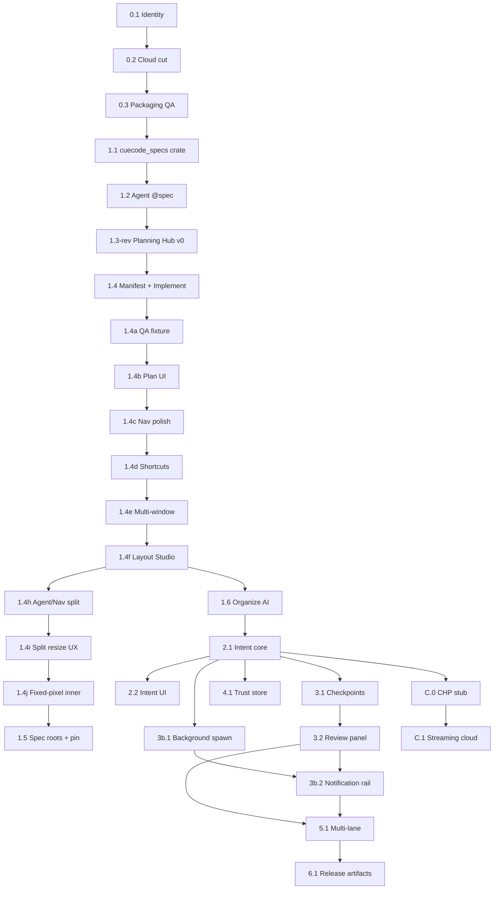

# Master build plan {#master-build-plan}

> **Invoke:** `Build phase X.Y` → open the matching file in **[phases/](./phases/)** — that file is the **only** execution contract for the sub-phase.

Phased execution index for CueCode. Each sub-phase is one PR batch (typically 2–10 days for 1–2 devs).

**Progress:** update **Status** in the sub-phase file, then sync [07 §progress](../07-implementation-roadmap#progress).

Regenerate sub-phase files from master data: `python3 script/generate-build-phase-docs.py`

---

## How to use {#how-to-use}

When you say **Build phase X.Y**:

1. Open **[phases/](./phases/)** file for `X.Y` (see [#phase-index](#phase-index))
2. **Verify Depends** — prerequisite sub-phases show `[x] Done`
3. **Implement** tasks `X.Y.N` in order; mark **Done** column `[x]`
4. **Verify** — run commands in sub-phase **Verify** section
5. **PR** — [07 §pr-acceptance-template](../07-implementation-roadmap#pr-acceptance-template)
6. **Close** — check **Exit criteria** in sub-phase file; update [07 §progress](../07-implementation-roadmap#progress)

### Numbering {#numbering}

```text
Phase X.Y
  X  = major milestone (maps to 07 roadmap Phase X, or cloud C.X)
  Y  = shippable sub-phase
```

| Track | Phases | When |
|-------|--------|------|
| **Product** | 0.x → 6.x | Main path |
| **Cloud** | C.0 → C.4 | After 2.1; parallel with 3b |
| **Parity gate** | P1–P4 | Cross-checks — [15-competitive-parity](../../parity/15-competitive-parity.md) |

---

## Master doc index {#master-doc-index}

| Doc | Role |
|-----|------|
| **[phases/](./phases/)** | **One file per sub-phase — start here for implementation** |
| [TEMPLATE-subphase](./TEMPLATE-subphase.md) | Mandatory sections for new sub-phases |
| [07-implementation-roadmap](../07-implementation-roadmap) | Product phases 0–6, acceptance criteria, QA-P0–P6 |
| [03-fork-and-rebrand](../../core/03-fork-and-rebrand) | Rebrand tiers, ERR scenarios |
| [06-system-design](../../core/06-system-design) | Crate design (reference) |
| [harness/cloud/08-roadmap](../../harness/cloud/08-roadmap.md) | Cloud M0–M4 detail |

---

## Dependency graph {#dependency-graph}



**Critical path:** `0.1 → 0.2 → 0.3 → 1.1 → 1.2 → 1.3-rev → 1.4 → 1.6 → 2.1 → 2.2 → 3.1 → 3.2 → 5.1 → 6.1`

| Milestone | Requires | Doc |
|-----------|----------|-----|
| **Alpha** | 0.x + 1.x + 2.x + 3.1 + 3.2 | [07 §alpha-milestone](../07-implementation-roadmap#alpha-milestone) |
| **Beta** | Alpha + 3b.x + 4.x + 5.x | [07 §beta-milestone](../07-implementation-roadmap#beta-milestone) |
| **Competitive 1.0** | Beta + 6.2 + Flows A–H | [15 §competitive-gate](../../parity/15-competitive-parity.md#competitive-gate) |

---

## Phase index (quick lookup) {#phase-index}

Each row links to the **self-contained** sub-phase doc. Status is maintained in that file.

| Phase | Doc | Name | Depends | QA |
|-------|-----|------|---------|-----|
| **0.1** | [0-1-identity](./phases/0-1-identity.md) | Identity & paths | — | QA-P0 partial |
| **0.2** | [0-2-cloud-decouple](./phases/0-2-cloud-decouple.md) | Cloud decouple & defaults | 0.1 | QA-P0 |
| **0.3** | [0-3-packaging-qa](./phases/0-3-packaging-qa.md) | Packaging, CLI & rebrand QA | 0.2 | QA-P0 full |
| **1.1** | [1-1-cuecode-specs](./phases/1-1-cuecode-specs.md) | `cuecode_specs` crate | 0.3 | QA-P1 partial |
| **1.2** | [1-2-agent-spec-integration](./phases/1-2-agent-spec-integration.md) | Agent @spec + system prompt | 1.1 | QA-P1 |
| **1.3-rev** | [1-3-rev-planning-hub-v0](./phases/1-3-rev-planning-hub-v0.md) | Planning Hub v0 (P-H0) | 1.2 | QA-P1 |
| **1.4** | [1-4-planning-hub-manifest](./phases/1-4-planning-hub-manifest.md) | Manifest + ticket session (P-H1) | 1.3-rev | QA-P1 |
| **1.4a** | [1-4a-qa-fixture-bootstrap](./phases/1-4a-qa-fixture-bootstrap.md) | QA fixture (PulseBoard) | 1.4 | QA-P1-Plan |
| **1.4b** | [1-4b-plan-ui-integration](./phases/1-4b-plan-ui-integration.md) | Plan tab + detached window (P-H1b) | 1.4 | QA-P1 |
| **1.4c** | [1-4c-plan-navigation-polish](./phases/1-4c-plan-navigation-polish.md) | Plan ↔ Chat navigation polish | 1.4b | QA-P1 |
| **1.4d** | [1-4d-surface-shortcuts-polish](./phases/1-4d-surface-shortcuts-polish.md) | Surface shortcuts & chrome | 1.4c | QA-P1 |
| **1.4e** | [1-4e-agent-layout-multi-window](./phases/1-4e-agent-layout-multi-window.md) | Agent layout & multi-window | 1.4d | QA-P1 |
| **1.4f** | [1-4f-layout-studio](./phases/1-4f-layout-studio.md) | Layout Studio | 1.4e | QA-P1 |
| **1.4h** | [1-4h-agent-nav-column-split](./phases/1-4h-agent-nav-column-split.md) | Agent / Nav column split + resize | 1.4f | QA-P1 |
| **1.4i** | [1-4i-split-column-resize-ux](./phases/1-4i-split-column-resize-ux.md) | Split-column resize UX (clamp, limits, ellipsis) | 1.4h | QA-P1 |
| **1.4j** | [1-4j-inner-column-fixed-pixel-sizing](./phases/1-4j-inner-column-fixed-pixel-sizing.md) | Inner column fixed-pixel sizing | 1.4i | QA-P1 |
| **1.4k** | [1-4k-side-column-row](./phases/1-4k-side-column-row.md) | Side column row (unified split resize) | 1.4j | QA-P1 |
| **1.4l** | [1-4l-side-column-layout-engine](./phases/1-4l-side-column-layout-engine.md) | Side column layout engine | 1.4k | QA-P1 |
| **1.4m** | [1-4m-layout-stabilization-recovery](./phases/1-4m-layout-stabilization-recovery.md) | Layout stabilization recovery (PulseBoard QA) | 1.4l | QA-P1 |
| **1.5** | [1-5-spec-roots-pin-modes](./phases/1-5-spec-roots-pin-modes.md) | Spec roots + pin modes (P-H2) | 1.4m | QA-P1 |
| **1.6** | [1-6-organize-with-ai](./phases/1-6-organize-with-ai.md) | Organize with AI (P-H3) | 1.4 | QA-P1 full |
| ~~**1.3**~~ | [1-3-spec-ui-stub](./phases/1-3-spec-ui-stub.md) | ~~Spec UI stub~~ **superseded** | — | — |
| **2.1** | [2-1-intent-core](./phases/2-1-intent-core.md) | `cuecode_sandbox` intent core | 1.6 | QA-P2 partial |
| **2.2** | [2-2-intent-ui](./phases/2-2-intent-ui.md) | Intent UI + sandbox badge | 2.1 | QA-P2 full |
| **3.1** | [3-1-checkpoint-store](./phases/3-1-checkpoint-store.md) | Checkpoint store | 2.2 | QA-P3 partial |
| **3.2** | [3-2-review-panel](./phases/3-2-review-panel.md) | Unified review panel | 3.1 | QA-P3 full |
| **3b.1** | [3b-1-background-spawn](./phases/3b-1-background-spawn.md) | `run_in_background` + builtin agents | 2.2 | QA-P3b partial |
| **3b.2** | [3b-2-notification-verdict](./phases/3b-2-notification-verdict.md) | Notification rail + VERDICT | 3b.1 | QA-P3b full |
| **4.1** | [4-1-trust-store](./phases/4-1-trust-store.md) | Trust store + UI | 2.2 | QA-P4 |
| **5.1** | [5-1-multi-lane](./phases/5-1-multi-lane.md) | Multi-lane model | 3.2, 3b.2 | QA-P5 partial |
| **5.2** | [5-2-composer-polish](./phases/5-2-composer-polish.md) | Composer-first + polish | 5.1 | QA-P5 full |
| **6.1** | [6-1-release-docs](./phases/6-1-release-docs.md) | Release artifacts + docs | 5.2 | QA-P6 |
| **6.2** | [6-2-competitive-gate](./phases/6-2-competitive-gate.md) | Competitive 1.0 gate | 6.1 | Flows A–H |
| **C.0** | [c-0-chp-stub](./phases/c-0-chp-stub.md) | CHP stub + one tool | 2.1 | M0 exit |
| **C.1** | [c-1-streaming-cloud](./phases/c-1-streaming-cloud.md) | Streaming default cloud | C.0 | M1 exit |
| **C.2** | [c-2-subagent-async](./phases/c-2-subagent-async.md) | Subagent async | C.1, 3b.1 | M2 exit |
| **C.3** | [c-3-verdict-hybrid](./phases/c-3-verdict-hybrid.md) | VERDICT Hybrid | C.2, 3b.2 | M3 exit |
| **C.4** | [c-4-byok-enterprise](./phases/c-4-byok-enterprise.md) | BYOK enterprise | C.3, 4.1 | M4 exit |

---

## Track summaries {#tracks}

| Track | Goal | Sub-phases |
|-------|------|------------|
| **0** | Launchable `cuecode`, no zed.dev wall | [0.1](./phases/0-1-identity.md) → [0.3](./phases/0-3-packaging-qa.md) |
| **1** | `.cursor/specs/` + Planning Hub | [1.1](./phases/1-1-cuecode-specs.md) → [1.6 Organize](./phases/1-6-organize-with-ai.md) |
| **2** | Intent profiles + sandbox | [2.1](./phases/2-1-intent-core.md) → [2.2](./phases/2-2-intent-ui.md) |
| **3** | Review + checkpoints (Alpha) | [3.1](./phases/3-1-checkpoint-store.md) → [3.2](./phases/3-2-review-panel.md) |
| **3b** | Async harness (local) | [3b.1](./phases/3b-1-background-spawn.md) → [3b.2](./phases/3b-2-notification-verdict.md) |
| **4** | Trust graph | [4.1](./phases/4-1-trust-store.md) |
| **5** | Multi-lane + polish (Beta) | [5.1](./phases/5-1-multi-lane.md) → [5.2](./phases/5-2-composer-polish.md) |
| **6** | Ship + competitive gate | [6.1](./phases/6-1-release-docs.md) → [6.2](./phases/6-2-competitive-gate.md) |
| **C** | Cloud harness | [C.0](./phases/c-0-chp-stub.md) → [C.4](./phases/c-4-byok-enterprise.md) |

---

## Parity crosswalk {#parity-crosswalk}

| Product phase | Parity program | Flow proven |
|---------------|----------------|-------------|
| 0.3 | P0 complete | — |
| 1.6 | P1 moat (specs + Planning Hub) | A partial |
| 2.2 | P1 Active tools baseline | A |
| 3b.2 | P2 Async | B, D |
| 5.1 | P3 Hybrid | C |
| 6.2 | P4 + Competitive 1.0 | A–H |

---

## Recommended sequence {#recommended-sequence}

```text
Build phase 0.1 → 0.2 → 0.3
Build phase 1.1 → 1.2 → 1.3      ← NEXT: 1.3 (1.2 done)
Build phase 2.1 → 2.2
Build phase 3b.1                   (parallel after 2.2)
Build phase 3.1 → 3.2              (Alpha)
Build phase 4.1                    (parallel with 3.x after 2.2)
Build phase 3b.2
Build phase 5.1 → 5.2
Build phase 6.1 → 6.2
Build phase C.0 … C.4              (parallel after 2.1)
```

---

## Changelog {#changelog}

| Date | Change |
|------|--------|
| 2026-06-20 | Split all sub-phases into [phases/](./phases/) — master file is index only |
| 2026-06-17 | Initial master build plan |
