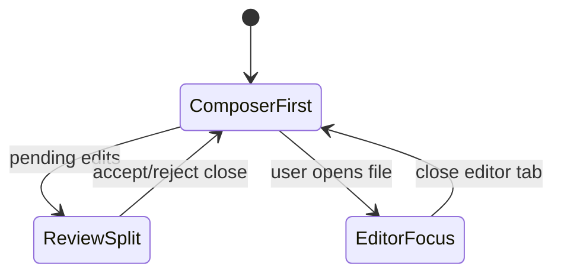
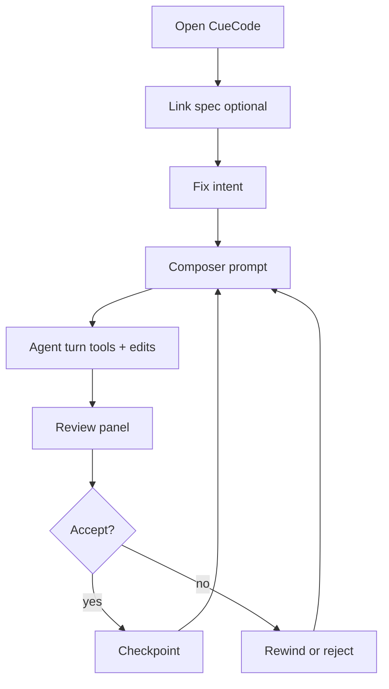
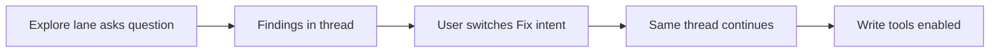
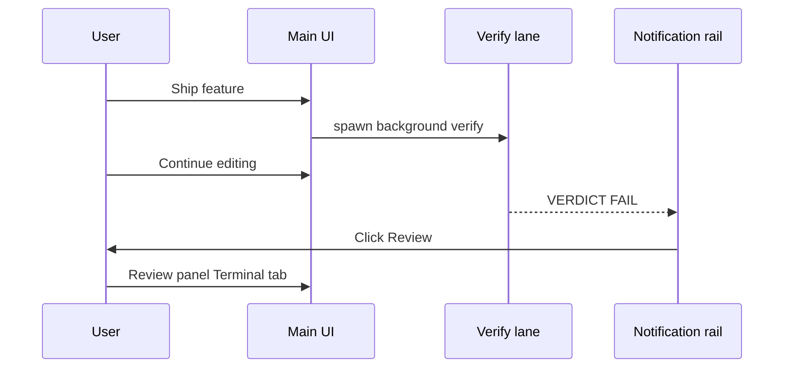
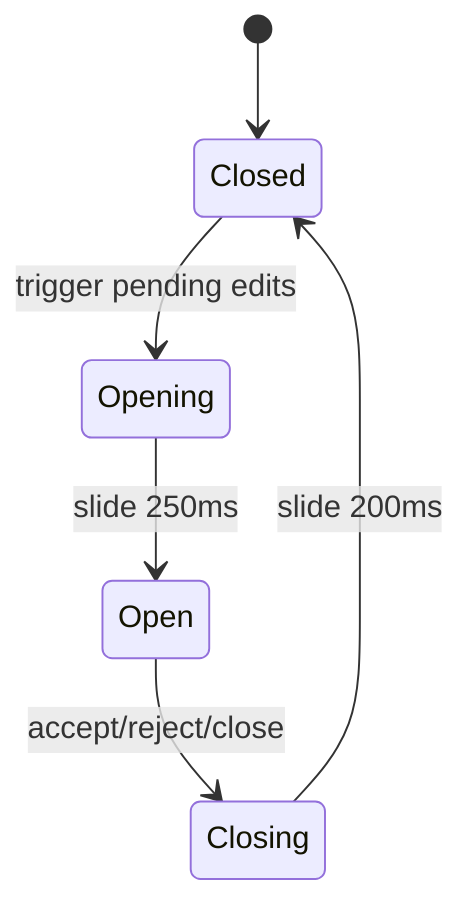
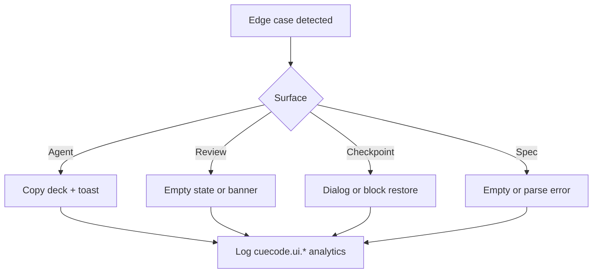

# UI / UX Spec {#ui-ux-spec}

CueCode UX prioritizes **agent sessions** over file browsing. The editor remains
essential for review and manual edits, but the default mental model is:
**intent → spec → act → review → checkpoint**.

This document is the **primary UI reference** for CueCode product work. Implementers
should map sections to `agent_ui` (and related) crates before writing GPUI code.

**Related:** [04-sandbox-core](../core/04-sandbox-core), [05-innovations](../core/05-innovations),
[07-implementation-roadmap](../delivery/07-implementation-roadmap), [08-agent-tools-and-skills](../agent/08-agent-tools-and-skills),
[harness/local/01-agent-harness](../harness/local/01-agent-harness.md)

**Skill:** `.cursor/skills/ui-ux-gpui/SKILL.md`

---

## Design principles {#principles}

1. **Intent visible** — always show current intent and sandbox status in agent header.
2. **Specs reachable** — one click or `@spec` to project specs index; linker shows active spec.
3. **Review before merge** — pending agent changes are obvious, not buried in chat.
4. **Progressive disclosure** — Explore mode hides write actions in UI, not only in backend.
5. **Zed design language** — reuse GPUI patterns, spacing, and icons unless CueCode brand requires otherwise.
6. **Session-first layout** — agent panel is a first-class dock, not an afterthought strip.
7. **Recoverable flow** — every destructive action has undo, checkpoint, or explicit confirm.

---

## Global layout architecture {#global-layout}

### Window regions (pixel-level)

Default window minimum: **1024×700**. Agent-heavy preset targets **1440×900**.

```
┌──────────────────────────────────────────────────────────────────────────────┐
│ Title bar (32px) — CueCode logo, workspace name, traffic lights              │
├──────────┬───────────────────────────────────────────────────────┬───────────┤
│ Left     │ Center pane group (editors / diff / terminal)         │ Right     │
│ dock     │ min-width 400px                                       │ dock      │
│ 240–480px│ flex 1                                                │ 320–560px │
│          │                                                       │           │
│ Project  │                                                       │ Agent     │
│ (collaps)│                                                       │ panel     │
│          │                                                       │ PRIMARY   │
├──────────┴───────────────────────────────────────────────────────┴───────────┤
│ Bottom dock (optional, 160–320px) — terminal, problems, output               │
└──────────────────────────────────────────────────────────────────────────────┘
```

| Region | Default width | Collapsible | CueCode notes |
|--------|---------------|-------------|---------------|
| Left dock (project) | 280px | yes | Collapsed in composer-first preset |
| Center panes | flex | — | Opens on review / file click |
| Right dock (agent) | 420px | yes | Expanded to ≥560px in composer-first |
| Bottom terminal | 240px | yes | Sandboxed badge on agent-spawned terminals |

### Dock behavior {#dock-behavior}

- Agent panel: `agent.dock` setting — `left | right | bottom` (default **left** in `default.json`)
- Persisted per workspace in workspace metadata
- **Primary layout UX (1.4f):** [Layout Studio](../design/17-layout-studio.md) — virtual dollhouse, workflow presets, drag-to-slot; palette `CueCode: Arrange Workspace…`
- **Advanced:** Panel Position submenu in agent `⋯` menu (1.4e) — demoted when Layout Studio ships
- Drag handles match Zed dock UX; double-click divider resets to default width
- **Responsive rules:**
  - `<1024px` width: agent panel min 320px; project auto-collapses
  - `<800px`: show single center OR agent (stacked tab switcher) — v2; v1 warn only
- Panel focus: `ToggleFocus` agent action focuses composer if thread active

### Component tree (workspace level)

```
Window (gpui)
├── TitleBar (title_bar/)
├── Workspace (workspace/)
│   ├── Dock (left) → ProjectPanel
│   ├── PaneGroup (center) → Editor / AgentDiffPane / Terminal
│   ├── Dock (right) → AgentPanel (agent_ui/)
│   └── Dock (bottom) → TerminalPanel
└── Modals / Pickers (layered)
    ├── ReviewPanel (agent_ui — new)
    ├── SpecBrowser (agent_ui — new)
    ├── Onboarding (ai_onboarding / CueCode replacement)
    └── Settings (settings_ui)
```

---

## Primary surfaces {#surfaces}

### Surface index

| # | Surface | Phase | Crate / file |
|---|---------|-------|--------------|
| 1 | Agent panel | 0–2 | `agent_panel.rs`, `conversation_view.rs` |
| 2 | Unified review panel | 3 | `review_panel.rs` (new), `agent_diff.rs` |
| 3 | Checkpoint timeline | 3 | `checkpoint_timeline.rs` (new) |
| 4 | Spec browser | 1–3 | `spec_browser.rs` (new) |
| 5 | Composer-first layout | 5 | `workspace/` layout preset |
| 6 | Notification rail | 3b | `ui/agent_notification.rs` |
| 7 | Onboarding | 0 | replace `AgentPanelOnboarding` |
| 8 | Trust settings | 4 | `agent_configuration.rs` |

---

## 1. Agent panel (extend existing) {#agent-panel}

**Location:** dockable (`agent.dock`: left | right | bottom)

**Existing files:** `crates/agent_ui/src/agent_panel.rs`, `conversation_view.rs`,
`message_editor.rs`, `mode_selector.rs`, `agent_model_selector.rs`

### Full panel wireframe

```
┌─ Agent ──────────────────────────────────────────────────────────────────────┐
│ HEADER 48px                                                                  │
│ ┌─────────────┐ ┌──────────┐ ┌───────────────┐ ┌─────────┐ ┌───┐            │
│ │ Intent ▼    │ │ Sandbox  │ │ Spec: none ▼  │ │ Model ▼ │ │ ⋮ │            │
│ │   Fix       │ │ 🔒 net   │ │               │ │ Ollama  │ │   │            │
│ └─────────────┘ └──────────┘ └───────────────┘ └─────────┘ └───┘            │
├──────────────────────────────────────────────────────────────────────────────┤
│ BODY (flex row)                                                              │
│ ┌ THREAD SIDEBAR 200px ────┐ ┌ CONVERSATION (flex) ────────────────────────┐ │
│ │ [+ New thread]           │ │ ┌─ checkpoint strip (optional 32px) ───────┐ │ │
│ │ ┌──────────────────────┐ │ │ │ ●───●───● Turn 3                      ▼ │ │ │
│ │ │ ● Auth fix      Fix  │ │ │ └─────────────────────────────────────────┘ │ │
│ │ │   Implement lane     │ │ │ [User message bubble]                      │ │
│ │ │ ○ Explore background │ │ │ [Assistant + tool cards]                   │ │
│ │ └──────────────────────┘ │ │ [Plan block]                               │ │
│ │ ┌─ Lanes (Phase 5) ────┐ │ │                                            │ │
│ │ │ [Explorer][Impl][Rev]│ │ │                                            │ │
│ │ └──────────────────────┘ │ │                                            │ │
│ └──────────────────────────┘ └────────────────────────────────────────────┘ │
├──────────────────────────────────────────────────────────────────────────────┤
│ COMPOSER 72–120px (multi-line)                                               │
│ ┌──────────────────────────────────────────────────────────────────────────┐ │
│ │ What should we fix?                                          [@] [Send] │ │
│ └──────────────────────────────────────────────────────────────────────────┘ │
└──────────────────────────────────────────────────────────────────────────────┘
```

### Agent header (CueCode additions) {#agent-header}

**Target height:** 48px (40px content + 8px padding)
**Horizontal padding:** 12px; gap between controls: 8px

```
[Intent ▼ Explore] [Sandbox 🔒] [Spec: none ▼] [Model ▼] [···]
```

| Control | Component (new/existing) | Width | Behavior |
|---------|--------------------------|-------|----------|
| Intent switcher | `intent_selector.rs` (new) or extend `mode_selector.rs` | 120–160px | Segmented or dropdown |
| Sandbox badge | `sandbox_badge.rs` (new) | 80–120px | Icon + tooltip; click → policy detail popover |
| Spec linker | `spec_linker.rs` (new) | 140–200px | Shows basename; click → spec picker |
| Model selector | `agent_model_selector.rs` | 120–180px | Existing |
| Overflow menu | existing options menu | 32px | Settings, export thread, checkpoints |

**Intent switcher options:** Explore | Fix | Ship | Review | (Orchestrate flagged)

**Sandbox badge variants:**

| State | Display | ARIA label |
|-------|---------|------------|
| Explore | `🔒 read-only` | "Sandbox: read only, network off" |
| Fix + sandbox on | `🛡 sandbox` | "Sandbox: terminal sandbox active, network allowlist" |
| Fix + sandbox off | `⚠ unsandboxed` | "Sandbox: terminal not sandboxed on this platform" |
| Ship | `🛡 ship` | "Sandbox: ship mode, git commands confirm" |

### Header — interaction spec {#agent-header-interactions}

| Action | Input | Result |
|--------|-------|--------|
| Open intent menu | Click Intent | Popover with descriptions per intent |
| Cycle intent | `cmd-shift-i` | Explore→Fix→Ship→Review→Explore |
| Open spec linker | Click Spec | Spec browser picker modal |
| Clear linked spec | Spec menu → Clear | Removes session link; header shows "none" |
| Sandbox detail | Click badge | Popover: network, FS write, terminal policy |

**Focus order (header):** Intent → Sandbox → Spec → Model → Overflow → (body)

### Header — empty / loading / error {#agent-header-states}

| State | UI |
|-------|-----|
| Loading workspace | Intent + Spec disabled; Model skeleton shimmer |
| No model configured | Model shows "Set up model…" → onboarding |
| Spec index loading | Spec linker disabled  ≤500ms; then enabled |
| Intent persist fail | Toast: "Could not save intent; using Fix" |

### Body — thread sidebar {#thread-sidebar}

**Width:** 200px default; resizable 160–280px

- Thread list (existing `ThreadMetadataStore`)
- Status pills: streaming, background, verification pending
- Phase 5: lane tabs above thread list

**Empty state:**

```
┌──────────────────────┐
│  No threads yet      │
│  [Start a session]   │
│  Tip: link a spec    │
└──────────────────────┘
```

### Body — conversation view {#conversation-view}

**File:** `conversation_view/thread_view.rs`

- Message bubbles (existing)
- Tool call cards — expandable; link to checkpoint (Phase 3)
- Plan block — ACP plan UI with spec sync badges (Phase 3)
- Inline diff previews — click opens review panel Diff tab

**Loading state:** Streaming cursor on assistant message; tool card shows spinner

**Error state:** Red banner on failed turn with Retry / Edit message

### Composer {#composer}

**File:** `message_editor.rs`, `inline_prompt_editor.rs`

**Min height:** 72px (3 lines); **max:** 120px before scroll

| Intent | Placeholder text |
|--------|------------------|
| Explore | "Ask about the codebase…" |
| Fix | "What should we fix?" |
| Ship | "What are we shipping?" |
| Review | "Review these changes…" |
| Orchestrate | "What should we coordinate?" |

**Explore mode:** Send enabled; `@` mentions enabled; no "Apply edit" shortcuts in UI

**Keyboard:**

| Key | Action |
|-----|--------|
| Enter | Send (if setting enabled) |
| Shift+Enter | Newline |
| @ | Mention menu (spec, file, symbol) |
| Escape | Blur composer / close mention menu |
| cmd-shift-r | Open review panel (global when pending edits) |

**Focus after review accept/reject:** Returns to composer (accessibility requirement)

### Composer mode picker (Cursor parity) {#composer-mode-picker}

**Deep spec:** [14-agent-modes-and-builder](../agent/14-agent-modes-and-builder.md)

Replaces the legacy **profile selector** (Write / Ask / Minimal + Configure modal) in the
composer **footer** — not the header intent switcher. Two controls, two jobs:

| Control | Location | Purpose |
|---------|----------|---------|
| **Intent** | Agent header | Sandbox policy (Explore / Fix / Ship / …) |
| **Mode** | Composer footer | Cursor-class persona + tool preset (Agent / Ask / Plan / …) |

**Footer layout:**

```
[+] [@]     [↑○ ↓○]  [∞ Agent ▼]  [Model ▼]  [Send]
```

`↑○ ↓○` = split input/output context rings — **required**; see
[14 §split-token-usage](../agent/14-agent-modes-and-builder.md#split-token-usage).

**Mode presets (v1):** Agent · Ask · Plan · Debug · Review · Orchestrate — see
[14 §composer-mode-picker](../agent/14-agent-modes-and-builder.md#composer-mode-picker).

**Popover footer:** "Manage agents…" → Settings → Agents (builder). No name-only New Profile modal.

**Saved agents:** Listed under presets with ★ prefix; selecting applies `AgentDefinition` on top of preset.

**ACP threads:** Keep existing ACP `ModeSelector`; do not merge with native mode picker.

### Split input/output context rings {#split-token-usage}

**Retain** the dual-ring footer control (↑ input, ↓ output) implemented in
`thread_view.rs` (`#split_token_usage`). Required in all composer footer layouts;
do not remove when adding mode picker or context budget UI.

| Element | Spec |
|---------|------|
| Input ring | `ArrowUp` + `CircularProgress` — prompt/context fill vs input max |
| Output ring | `ArrowDown` + `CircularProgress` — completion fill vs output max |
| Tooltip | Input/Output counts, optional cost, rules loaded |
| Warning | Ring stroke ≥85% utilization → warning color |
| Fallback | Single combined ring only when model lacks split token API |

Full rules: [14-agent-modes-and-builder §split-token-usage](../agent/14-agent-modes-and-builder.md#split-token-usage).

---

## 2. Unified review panel (new) {#review-panel}

**Trigger:** agent turn completes with pending edits; user cmd "Review changes"; notification click

**Presentation:** Side panel (preferred) or modal if center narrow

**Files:** new `review_panel.rs`; extend `agent_diff.rs`, `AgentDiffPane`

### Wireframe — full review panel

```
┌─ Review changes ──────────────────────────────────────────────── [× Close] ─┐
│ Turn 3 · Fix intent · 4 files · 2 commands · linked: 04-sandbox-core.md      │
├──────────────────────────────────────────────────────────────────────────────┤
│ [ Plan ] [ Diffs ] [ Terminal ] [ Spec ]                                     │
├──────────────────────────────────────────────────────────────────────────────┤
│                                                                              │
│  (tab content area — scrollable)                                             │
│                                                                              │
│                                                                              │
├──────────────────────────────────────────────────────────────────────────────┤
│ ☐ Select all    3 of 4 selected                    [Reject sel] [Accept sel]│
│                                                                               │
│        [ Reject all ]  [ Checkpoint & continue ]  [ Accept all ]             │
└──────────────────────────────────────────────────────────────────────────────┘
```

**Dimensions:**

- Width: 480–720px side panel; or 90% modal max 900px
- Tab bar: 40px
- Footer: 56px (two rows on narrow)

### Tab: Plan {#review-tab-plan}

```
┌─ Plan ─────────────────────────────────────────────────────────────────────┐
│ ☑ Read sandbox-core spec                                    [spec §link]    │
│ ☐ Implement checkpoint store                                               │
│ ☐ Wire review panel tabs                                                   │
│ ☐ Add GPUI tests                                                           │
│ ── Spec sync ──                                                            │
│ ☐ Will update 05-innovations.md §checkpoint-stack on accept               │
└────────────────────────────────────────────────────────────────────────────┘
```

- Checkboxes map to ACP plan entries
- Spec-linked rows show anchor link (opens spec browser preview)
- Completed entries: strikethrough + timestamp

**Empty:** "No plan entries this turn."

### Tab: Diffs {#review-tab-diffs}

```
┌─ Diffs ────────────────────────────────────────────────────────────────────┐
│ ☑ crates/agent_ui/src/review_panel.rs          +142 -0    [view] [reject] │
│ ☑ crates/cuecode_sandbox/src/checkpoint.rs     +88  -0    [view] [reject] │
│ ☐ docs/CHANGELOG.md                            +12  -3    [view] [reject] │
│ ── diff preview (selected file) ──                                         │
│  14  + pub struct ReviewPanel {                                             │
│  15  +     tabs: ReviewTab,                                               │
└────────────────────────────────────────────────────────────────────────────┘
```

- Multi-file list with per-file accept/reject
- Diff preview uses existing `agent_diff` rendering
- Click file row → expand inline diff

**Empty:** "No file changes pending."

### Tab: Terminal {#review-tab-terminal}

```
┌─ Terminal ─────────────────────────────────────────────────────────────────┐
│ $ cargo test -p cuecode_sandbox                           exit 0  [Replay]  │
│   running 12 tests ... ok                                                   │
│ $ ./script/clippy                                         exit 0  [Replay]  │
│ ── expand ──                                                                │
│ $ curl https://crates.io/api/v1/crates/serde              exit 0  ⚠ net   │
└────────────────────────────────────────────────────────────────────────────┘
```

- Commands from current turn only (filter by checkpoint id)
- Exit code badge: green 0, red non-zero
- `[Replay]` Phase 5 — pre-fills terminal with command

**Empty:** "No commands ran this turn."

### Tab: Spec {#review-tab-spec}

Shown only when spec diff pending (`update_spec` tool).

```
┌─ Spec ─────────────────────────────────────────────────────────────────────┐
│ .cursor/specs/delivery/07-implementation-roadmap.md                                │
│ ── proposed checkbox updates ──                                            │
│  - [ ] Phase 3 review panel tasks → [x]                                    │
│ [ Preview full diff ]                                                      │
└────────────────────────────────────────────────────────────────────────────┘
```

### Review panel — interactions {#review-interactions}

| Action | Input | Result |
|--------|-------|--------|
| Accept all | Click / `cmd-enter` | Apply all pending; checkpoint optional; close panel |
| Reject all | Click | Rollback via action_log; keep panel open with confirmation |
| Accept selected | Click | Partial apply |
| Checkpoint & continue | Click | Save checkpoint without closing session |
| Close | × / Escape | Panel hides; pending edits remain with badge on header |

**Focus order:** Tab bar → content → select all → Reject sel → Accept sel → Reject all → Checkpoint → Accept all

### Review panel — states {#review-states}

| State | UI |
|-------|-----|
| Loading diffs | Skeleton list; tabs disabled ≤1s |
| Diff too large | "Diff truncated; open file in editor" link |
| Apply error | Inline error on file row; others unaffected |
| Partial apply | Banner: "2 of 3 applied; 1 failed" |

### Accessibility — review {#review-a11y}

- Tab list: roving tabindex, arrow keys
- Announce tab change: "Diffs tab, 4 files pending"
- Accept all: requires focus; not triggered accidentally on Enter unless focused
- High contrast: selected file row uses theme focus ring

---

## 3. Checkpoint timeline (new) {#checkpoint-timeline}

**Location:** agent panel sidebar section OR session header dropdown OR strip above conversation

### Wireframe — sidebar timeline

```
┌─ Checkpoints ────────────────┐
│ ● Turn 3 — now               │
│   4 files, 2 cmds            │
│   [Preview] [Restore]        │
│ ○ Turn 2 — 10:42             │
│   1 file                     │
│ ○ Turn 1 — 10:38             │
│   plan only                  │
│ ○ Session start              │
└──────────────────────────────┘
```

### Wireframe — horizontal strip (compact)

```
┌─ checkpoint strip ────────────────────────────────────────────────┐
│ Session start ─── Turn 1 ─── Turn 2 ─── ● Turn 3 (current)  [▼] │
└───────────────────────────────────────────────────────────────────┘
```

Click `▼` → dropdown with full timeline + "Restore…" confirm dialog.

### Restore confirm dialog

```
┌─ Restore checkpoint? ──────────────────────────────────────┐
│ Rewind to Turn 2 (10:42)                                   │
│ • Revert 3 files                                           │
│ • Restore plan state (4 entries)                           │
│ ☐ Also reset git stash (advanced)                          │
│                                                            │
│              [ Cancel ]  [ Restore checkpoint ]            │
└────────────────────────────────────────────────────────────┘
```

### Interactions {#checkpoint-interactions}

| Action | Input | Result |
|--------|-------|--------|
| Preview | Click Turn N | Read-only diff summary in review panel |
| Restore | Click Restore | Confirm dialog → rewind |
| Rewind shortcut | `cmd-shift-z` (agent scope) | Restore previous checkpoint |

**Keyboard note:** Agent-scope rewind must not steal editor undo — use key context `AgentPanel`.

### States {#checkpoint-states}

| State | UI |
|-------|-----|
| Empty | "Checkpoints appear after each turn" |
| Creating | Subtle pulse on current node |
| Restore in progress | Block panel input; spinner on timeline |
| Restore fail | Toast + rollback of restore operation |

---

## 4. Spec browser (new) {#spec-browser}

> **⚠ Superseded for daily planning by [16-planning-hub §plan-ui](../design/16-planning-hub.md#plan-ui).** Legacy wireframes below; implement **Plan tab** + detached window per [1.4b](../delivery/build-plans/phases/1-4b-plan-ui-integration.md).

**Location:** command palette + optional dedicated panel + spec linker picker

**File:** `planning_hub.rs` (was `spec_browser.rs`); data from `cuecode_plans` + `cuecode_specs`

### Wireframe — spec browser panel (legacy reference)

```
┌─ Specs (.cursor/specs/) ─────────────────────────────── [Search…] ─────────┐
│ ┌ TREE 220px ─────────────┐ ┌ PREVIEW (flex) ────────────────────────────┐ │
│ │ ▼ 00-README.md          │ │ # Sandbox Core                              │ │
│ │   01-vision.md          │ │                                             │ │
│ │   04-sandbox-core.md  ● │ │ ## Intent profiles                          │ │
│ │   05-innovations.md     │ │ … rendered markdown …                       │ │
│ │   07-roadmap.md         │ │                                             │ │
│ │   09-ui-ux-spec.md      │ │ ── actions ──                               │ │
│ └─────────────────────────┘ │ [Link to session] [Open in editor] [New spec]│ │
│                             └─────────────────────────────────────────────┘ │
└──────────────────────────────────────────────────────────────────────────────┘
```

### Wireframe — picker (from spec linker)

```
┌─ Link spec ────────────────────────────────┐
│ [Search specs…]                            │
│ ─────────────────────────────────────────  │
│ 04-sandbox-core.md    Agentic sandbox…    │
│ 05-innovations.md     SDAL, intent…       │
│ 09-ui-ux-spec.md      UI / UX Spec        │
│ ─────────────────────────────────────────  │
│              [ Cancel ]  [ Link ]          │
└────────────────────────────────────────────┘
```

### Interactions {#spec-browser-interactions}

| Action | Input | Result |
|--------|-------|--------|
| Open browser | `cmd-shift-p` → "CueCode: Browse Specs" | Panel or modal |
| Link to session | Button | Sets header spec linker; injects body next turn |
| Start session from spec | Button | New thread + linked spec + suggested intent |
| Open in editor | Button | Opens `.md` in center pane |
| Search | Type | Fuzzy filter title + path |

### States {#spec-browser-states}

| State | UI |
|-------|-----|
| No specs dir | "No .cursor/specs/ found. [Create README template]" |
| Loading | Tree skeleton |
| Parse error | File row warning icon; preview shows error |
| Watch refresh | Subtle "Specs updated" toast |

---

## 4b. Plan surface (Agent Linear) {#plan-surface}

> **Canonical design:** [16-planning-hub §plan-ui](../design/16-planning-hub.md#plan-ui) · **Build:** [1.4b](../delivery/build-plans/phases/1-4b-plan-ui-integration.md)

**Product name:** **Plan** (not “Planning Hub modal”).

**Default host:** Agent panel **Plan tab** — third mode alongside Threads and Terminal.

**Secondary host:** Detached OS window (`Open in New Window`) — same `PlanStore`, syncs selection.

### Copy deck — Plan chrome {#plan-surface-copy}

| Element | String |
|---------|--------|
| Surface tabs | Segmented control: `Threads` · `Plan` · `Terminal` |
| Tab label | `Plan` |
| Palette (chat) | `CueCode: Focus Agent Chat` |
| Palette (primary) | `CueCode: Focus Plan` |
| Palette (terminal) | `CueCode: Focus Terminal` |
| Palette (detach plan) | `CueCode: Open Plan in New Window` |
| Palette (detach chat) | `CueCode: Open Agent Chat in New Window` |
| Detached chat window title | `Agent Chat — {project_name}` |
| Detached chat header | `Agent Chat` |
| Detach chat button (Threads toolbar) | `Open in New Window` |
| Dock back (detached chat) | `Dock` |
| Main panel placeholder (chat detached) | `Chat is open in a separate window` · `Dock chat to panel` |
| Panel Position menu | `Dock Left` · `Dock Right` · `Dock Bottom` |
| Detached window title | `Plan — {project_name}` |
| Header next hint | `Next: {phase_id} · {done}/{total} tasks` |
| Pin chip (ticket session) | `📎 {title} · {done}/{total} · {n} specs linked` |
| Pin chip action tooltip | `Open Plan` |
| Implement CTA | `Implement phase` |
| Detach button | `Open in New Window` |
| Dock back (detached) | `Dock to main window` |
| Empty manifest | `No plan yet. Organize this project?` |

### Wireframe — agent panel with Plan tab (1440×900)

```
┌─ Title bar ──────────────────────────────────────────────────────────────────┐
├────────────────────────────── center editor ────┬─ Agent panel (~420px) ────┤
│  AGENTS.md                                      │ Intent ▾ Sandbox ▾ Model ▾ │
│                                                 │ Next: 2.1 · 3/6 tasks      │
│                                                 │ [Threads] [Plan ●] [Term ▾]│
│                                                 │ [Open in New Window ↗]     │
│                                                 ├─────────────┬──────────────┤
│                                                 │ Build track │ Preview      │
│                                                 │ 2.1 ◐  3/6  │ … md …       │
│                                                 ├─────────────┴──────────────┤
│                                                 │ [Implement phase] [Open]   │
└─────────────────────────────────────────────────┴────────────────────────────┘
```

### Wireframe — detached Plan window (second monitor)

See [16 §plan-ui-detached](../design/16-planning-hub.md#plan-ui-detached).

### Interactions {#plan-surface-interactions}

| Action | Input | Result |
|--------|-------|--------|
| Focus Agent Chat | `cmd-1` / palette → Focus Agent Chat | Threads surface in main panel **or** activates detached chat window if open |
| Focus Plan | `cmd-2` / palette → Focus Plan | Agent panel Plan tab |
| Focus Terminal | `cmd-3` / palette → Focus Terminal | Agent panel Terminal surface |
| Focus Plan (legacy) | `cmd-shift-p` → Focus Plan | Agent panel Plan tab |
| Detach Plan | Plan tab → Open in New Window | Second GPUI window; shared selection |
| Detach chat | Threads toolbar ↗ / palette → Open Agent Chat in New Window | Detached chat window; main panel placeholder |
| Dock chat | Detached chat → Dock | Closes detached window; restores Threads in main panel |
| Panel position | Agent `⋯` → Panel Position | Sets `agent.dock` left / right / bottom (Advanced; prefer [Layout Studio](./17-layout-studio.md)) |
| Arrange workspace | Palette → Arrange Workspace | Opens Layout Studio modal — presets Plan / Implement / Classic / Dual |
| Implement | Implement phase button | Ticket session; Plan collapses to strip; focuses chat host (main or detached) |
| Pin chip click | Click chip in thread header | Plan tab + ticket selected |
| `@phase` in composer | Autocomplete (1.5) | Crease; click → Plan tab |

---

## 5. Composer-first layout (preset) {#composer-first-layout}

**Setting:** `cuecode.layout.composer_first: true`

**Phase:** 5

### Wireframe — composer-first (1440×900)

```
┌──────────────────────────────────────────────────────────────────────────────┐
│ Title bar                                                                    │
├───────────────────────────────────────────────┬──────────────────────────────┤
│                                               │                              │
│  Center (collapsed / minimal)                 │  Agent panel  ~65% width     │
│  "Open a file or enter review"                │  ┌──────────────────────────┐│
│  OR diff review when active                   │  │ header                   ││
│                                               │  │ threads │ conversation   ││
│  35% width when review open                   │  │ composer (tall)        ││
│                                               │  └──────────────────────────┘│
├───────────────────────────────────────────────┴──────────────────────────────┤
│ Bottom terminal (optional, collapsed default)                                │
└──────────────────────────────────────────────────────────────────────────────┘
```

### Behavior {#composer-first-behavior}

- Agent panel width ≥ **60%** on first launch with preset enabled
- Project panel **collapsed** by default
- Editor opens when user clicks file, review diff, or `@` file mention
- Review panel splits center + agent (35/65) when open
- Preset toggle: Command palette → "CueCode: Composer-first layout"

### Transition diagram



---

## 6. Notification rail (Phase 3b) {#notification-rail}

**File:** extend `crates/agent_ui/src/ui/agent_notification.rs`

### Wireframe — notification rail (right edge stack)

```
                                    ┌─ Notifications ──────────┐
                                    │ ● Verify FAIL            │
                                    │   auth module tests      │
                                    │   2m ago [Review]        │
                                    ├──────────────────────────┤
                                    │ ○ Explore complete       │
                                    │   12 files scanned       │
                                    │   5m ago [View]          │
                                    └──────────────────────────┘
```

### Wireframe — inline toast (ephemeral)

```
┌──────────────────────────────────────────────────────────────┐
│ ✓ Verification passed — 24 tests                  [Dismiss] │
└──────────────────────────────────────────────────────────────┘
```

### Notification types

| Kind | Icon | Primary action |
|------|------|----------------|
| `VerificationVerdict` Pass | green check | Dismiss |
| `VerificationVerdict` Fail | red alert | Open review |
| `SubagentCompleted` | blue dot | View transcript |
| `AwaySummary` | summary | Expand in conversation |

### States {#notification-states}

| State | UI |
|-------|-----|
| Empty | Rail hidden |
| Unread | Badge count on agent panel icon |
| Fail blocking | Session banner until acknowledged |

---

## 7. Multi-lane layout (Phase 5) {#multi-lane}

### Wireframe — lane tabs in agent panel

```
┌─ Agent ──────────────────────────────────────────────────────────────────────┐
│ [Explorer] [Implementer ●] [Reviewer]     Intent: Fix   Spec: 04-sandbox…   │
├──────────────────────────────────────────────────────────────────────────────┤
│ (Implementer lane conversation — isolated thread)                            │
│ …                                                                            │
├──────────────────────────────────────────────────────────────────────────────┤
│ ⚠ Explorer lane is read-only · Implementer has write lock on auth.rs        │
└──────────────────────────────────────────────────────────────────────────────┘
```

### Conflict banner

```
┌──────────────────────────────────────────────────────────────────────────────┐
│ ⚠ Both lanes edited crates/auth/mod.rs — [Review conflicts] [Dismiss]       │
└──────────────────────────────────────────────────────────────────────────────┘
```

### Lane presets

| Lane | Intent | Write | Default agent |
|------|--------|-------|---------------|
| Explorer | Explore | no | explore (background) |
| Implementer | Fix / Ship | yes | implement |
| Reviewer | Review | no | review-changes skill |

---

## Intent-specific UI {#intent-ui}

### Variant summary table

| Intent | Composer placeholder | Hidden/disabled UI | Header accent |
|--------|---------------------|-------------------|---------------|
| Explore | "Ask about the codebase…" | Apply edit buttons, write tool picker | neutral |
| Fix | "What should we fix?" | — | blue accent |
| Ship | "What are we shipping?" | — | green accent |
| Review | "Review these changes…" | Write tools in picker | purple accent |
| Orchestrate | "Coordinate work…" | Direct edit; spawn emphasized | orange accent |

### Explore mode mockup (progressive disclosure)

```
Composer toolbar:  [@ mentions] [Send]
                   (no "Apply patch" chip)

Tool picker filtered: read_file, grep, list_specs only
```

### Fix mode mockup

```
Composer toolbar:  [@ mentions] [Attach] [Send]
Review badge on header when pending: "4 changes"
```

### Ship mode mockup

```
Extra confirm on git push in review footer
Ship checklist tab (optional v2): tests, clippy, changelog
```

### Review mode mockup

```
Diff-first: opening Review intent opens review panel Diffs tab
Composer suggests questions about pending changes
```

---

## Onboarding (CueCode) {#onboarding}

Replace Zed AI account onboarding with local-first flow.

**Remove:** sign-in, trial, Zed Pro upsell (`EndTrialUpsell`, account gates)

### Screen 1 — Welcome

```
┌──────────────────────────────────────────────────────────────────────────────┐
│                         [CueCode logo]                                       │
│                    Welcome to CueCode                                        │
│         Agentic coding sandbox — local-first, spec-driven                    │
│                                                                              │
│                    [ Get started ]    [ Skip ]                               │
└──────────────────────────────────────────────────────────────────────────────┘
```

### Screen 2 — Model provider

```
┌──────────────────────────────────────────────────────────────────────────────┐
│  Choose your model provider                                                  │
│  ┌──────────────┐  ┌──────────────┐  ┌──────────────┐                       │
│  │   Ollama     │  │ OpenAI URL   │  │  API key     │                       │
│  │   (local)    │  │ (compatible) │  │  (BYOK)      │                       │
│  └──────────────┘  └──────────────┘  └──────────────┘                       │
│  Base URL: [ http://localhost:11434 ]   Model: [ llama3 ▼ ]                  │
│                              [ Test connection ]                             │
│                    [ Back ]              [ Continue ]                        │
└──────────────────────────────────────────────────────────────────────────────┘
```

### Screen 3 — Sandbox (optional)

```
┌──────────────────────────────────────────────────────────────────────────────┐
│  Terminal sandbox (recommended on macOS)                                     │
│  [✓] Run agent shell commands in sandbox                                     │
│  Network: ( ) Off  (•) Allowlist  ( ) Full                                   │
│                    [ Back ]              [ Continue ]                        │
└──────────────────────────────────────────────────────────────────────────────┘
```

### Screen 4 — Specs tour (optional)

```
┌──────────────────────────────────────────────────────────────────────────────┐
│  Specs drive your agent                                                      │
│  ┌─────────────────────────────────────────┐                                 │
│  │ .cursor/specs/                          │                                 │
│  │   01-vision.md                          │                                 │
│  │   04-sandbox-core.md                    │                                 │
│  └─────────────────────────────────────────┘                                 │
│  Try @spec in the composer to link a spec.                                   │
│                    [ Back ]              [ Finish ]                          │
└──────────────────────────────────────────────────────────────────────────────┘
```

### Onboarding states

| State | UI |
|-------|-----|
| Connection fail | Inline error under Test connection |
| Skip | All defaults: Ollama localhost, sandbox on if supported |
| Returning user | Onboarding not shown; Reset via command palette |

---

## Trust management UI {#trust-ui}

**Settings → Agent → Trust**

### Wireframe

```
┌─ Trust rules — this repository ──────────────────────────────────────────────┐
│ repo: CueCode-Agents (hash a1b2…)                                            │
├──────────────────────────────────────────────────────────────────────────────┤
│ cargo test *                           auto-allow    5/5 success  [Revoke] │
│ edit crates/cuecode_specs/**           auto-allow    10 accepts   [Revoke] │
│ terminal git push                      always confirm            (deny list)│
├──────────────────────────────────────────────────────────────────────────────┤
│ [ Revoke all rules for this repo ]                                           │
└──────────────────────────────────────────────────────────────────────────────┘
```

---

## User journey diagrams {#user-journeys}

### Primary loop (Fix intent)



### Explore → Fix handoff



### Async verification



---

## Keyboard shortcuts (proposed) {#keybindings}

| Action | Suggested binding | Key context |
|--------|-------------------|-------------|
| Toggle agent panel | keep Zed default | global |
| Cycle intent | `cmd-shift-i` | global / agent |
| Open spec browser | palette → "CueCode: Browse Specs" | global |
| Review pending changes | `cmd-shift-r` | global when pending |
| Rewind last checkpoint | `cmd-shift-z` | AgentPanel |
| Focus composer | `cmd-l` or existing | agent |
| Accept all in review | `cmd-enter` | ReviewPanel |

Exact bindings TBD; ship in `assets/keymaps/default.json` under CueCode section.

---

## Accessibility {#a11y}

### Global requirements

- Intent and sandbox state exposed to screen readers via `aria-label` on header controls
- All interactive elements reachable by keyboard; visible focus ring (theme token)
- Color not sole indicator: icons + text for trust, sandbox, verdict states
- Reduced motion: disable checkpoint pulse animation if preference set

### Per-surface

| Surface | Requirements |
|---------|--------------|
| Agent header | Live region announces intent changes |
| Review panel | Tab pattern WAI-ARIA; file list grid navigation |
| Checkpoint timeline | Announce restore outcomes |
| Spec browser | Tree `aria-expanded`; preview heading hierarchy |
| Notifications | `role="status"` for toasts; fail uses `role="alert"` |
| Onboarding | Focus trap in modal; logical tab order |

### Focus restoration

- After accept/reject in review → composer
- After closing spec browser → spec linker or prior focus
- After restore checkpoint → conversation view scroll to turn

---

## Visual hierarchy {#visual-hierarchy}

### Typography (relative to theme)

| Element | Size / weight |
|---------|---------------|
| Panel title | +1 step, semibold |
| Thread title | default, medium |
| Message body | default, regular |
| Tool card header | -1 step, medium, muted |
| Badge labels | -1 step, caps optional |
| Checkpoint summary | -1 step, muted |

### Spacing scale

Use existing GPUI spacing tokens (`px_2`, `px_3`, `gap_2`):

- Header internal gap: 8px
- Section separation in review: 16px
- Conversation bubble margin: 12px vertical

### Color semantics

| Semantic | Token usage |
|----------|-------------|
| Destructive | Reject all, restore checkpoint confirm |
| Success | Accept, VERDICT pass |
| Warning | Unsandboxed, partial apply |
| Info | Background task running |
| Muted | Timestamps, secondary labels |

### Density

- Default: comfortable (Zed default)
- Optional `cuecode.ui.density: compact` — reduce composer min height, timeline padding (Phase 5)

---

## Visual regression {#visual-tests}

Follow Zed macOS visual test workflow for changed panels.
Baseline images local-only per `docs/src/development/macos.md`.

**Priority baselines:**

- Agent header with all intent variants
- Review panel each tab
- Checkpoint timeline
- Spec browser
- Onboarding screen 2
- Notification rail fail state

Use `gpui-test` skill for parking failures.

---

## Component → crate mapping (implementation index) {#component-map}

| UI component | Target file | Depends on |
|--------------|-------------|------------|
| `IntentSelector` | `agent_ui/src/intent_selector.rs` | `cuecode_sandbox` |
| `SandboxBadge` | `agent_ui/src/sandbox_badge.rs` | `cuecode_sandbox`, `agent::sandboxing` |
| `SpecLinker` | `agent_ui/src/spec_linker.rs` | `cuecode_specs` |
| `SpecBrowser` | `agent_ui/src/spec_browser.rs` | `cuecode_specs` |
| `ReviewPanel` | `agent_ui/src/review_panel.rs` | `agent_diff`, `action_log` |
| `CheckpointTimeline` | `agent_ui/src/checkpoint_timeline.rs` | `cuecode_sandbox` |
| `NotificationRail` | `agent_ui/src/ui/agent_notification.rs` | `acp_thread` events |
| `LaneTabs` | `agent_ui/src/lane_tabs.rs` | Phase 5 thread model |
| `CueCodeOnboarding` | `agent_ui/src/cuecode_onboarding.rs` | replace `ai_onboarding` |
| `TrustSettings` | `agent_configuration.rs` | `cuecode_sandbox` trust store |

---

## Non-goals (UI v1) {#ui-non-goals}

- Custom theme beyond CueCode icon + title bar logo
- Mobile / web UI
- In-panel video calls (collab removed)
- Pixel-perfect Figma handoff — this spec is source of truth
- Full 800px responsive stack layout (warn only in v1)

---

## Phasing cross-reference {#phasing}

| UI surface | Roadmap phase |
|------------|---------------|
| Agent header intent + sandbox | Phase 2 |
| Spec linker + browser | Phase 1–3 |
| Review panel + checkpoints | Phase 3 |
| Notification rail | Phase 3b |
| Trust settings | Phase 4 |
| Multi-lane + composer-first | Phase 5 |
| Onboarding rebrand | Phase 0 |

See [07-implementation-roadmap](../delivery/07-implementation-roadmap) for exit criteria.

---

## UI copy deck (canonical strings) {#ui-copy-deck}

**Rule:** All user-visible strings in CueCode agent surfaces MUST match this deck.
When product copy changes, update this section in the same PR as code.

Legend: `{placeholder}` = runtime value. `[Button]` = clickable control.

---

### Global chrome

| Element | Exact copy |
|---------|------------|
| Window title | `CueCode — {workspace_name}` |
| App menu (macOS) | `CueCode` (not Zed) |
| Agent panel dock title | `Agent` |
| Close panel tooltip | `Close agent panel` |
| Generic loading | `Loading…` |
| Generic error banner action | `Retry` |
| Generic dismiss | `Dismiss` |
| Generic cancel | `Cancel` |
| Generic close | `Close` |
| Generic save | `Save` |
| Generic back | `Back` |
| Generic continue | `Continue` |
| Generic finish | `Finish` |
| Overflow menu: settings | `Agent settings…` |
| Overflow menu: export thread | `Export thread…` |
| Overflow menu: checkpoints | `View checkpoints` |
| Overflow menu: new thread | `New thread` |

---

### Agent header controls

| Control | Label | Tooltip |
|---------|-------|---------|
| Intent switcher | `{Intent}` e.g. `Fix` | `Change agent intent. Current: {Intent}.` |
| Intent menu item Explore | `Explore` | `Read-only. No file edits or terminal.` |
| Intent menu item Fix | `Fix` | `Edit files and run sandboxed commands.` |
| Intent menu item Ship | `Ship` | `Prepare to ship. Git writes may need confirm.` |
| Intent menu item Review | `Review` | `Review changes. Read-only tools.` |
| Intent menu item Orchestrate | `Orchestrate` | `Coordinate subagents. Experimental.` |
| Sandbox badge Explore | `read-only` | `Network off. File writes disabled.` |
| Sandbox badge Fix sandbox | `sandbox` | `Terminal sandbox active. Network allowlist.` |
| Sandbox badge Fix no sandbox | `unsandboxed` | `Terminal not sandboxed on this platform.` |
| Sandbox badge Ship | `ship` | `Ship mode policies active.` |
| Spec linker empty | `Spec: none` | `Link a project spec to this session.` |
| Spec linker linked | `Spec: {basename}` | `Linked spec: {path}. Click to change.` |
| Spec menu clear | `Clear linked spec` | — |
| Model unset | `Set up model…` | `Configure a language model provider.` |
| Model set | `{provider} · {model}` | `Change model.` |
| Pending changes badge | `{N} changes` | `Open review panel.` |

---

### Agent header toasts and errors

| Condition | Toast / banner copy |
|-----------|---------------------|
| Intent persist fail | `Could not save intent. Using Fix.` |
| Spec index slow | `Loading specs…` (inline, ≤500ms) |
| Model unreachable on send | `Can't reach model. Check connection and try again.` |
| Stream failed mid-turn | `Response failed.` · actions: `[Retry]` `[Edit message]` |
| Thread export success | `Thread exported to {path}.` |
| Thread export fail | `Export failed. {error_short}.` |
| Background task running | `Background task running…` (composer disabled strip) |

---

### Thread sidebar

| Element | Copy |
|---------|------|
| New thread button | `New thread` |
| Empty title | `No threads yet` |
| Empty body | `Start a session to work with the agent.` |
| Empty CTA | `Start a session` |
| Empty tip | `Tip: link a spec for better context.` |
| Streaming pill | `Streaming…` |
| Background pill | `Background` |
| Verify pending pill | `Verifying…` |
| Lane tab Explorer | `Explorer` |
| Lane tab Implementer | `Implementer` |
| Lane tab Reviewer | `Reviewer` |
| Thread rename placeholder | `Thread name` |

---

### Composer

| Intent | Placeholder |
|--------|-------------|
| Explore | `Ask about the codebase…` |
| Fix | `What should we fix?` |
| Ship | `What are we shipping?` |
| Review | `Review these changes…` |
| Orchestrate | `What should we coordinate?` |

| Control | Label | Tooltip |
|---------|-------|---------|
| Send button | `Send` | `Send message (Enter)` |
| Stop streaming | `Stop` | `Stop generating` |
| Mention button | `@` | `Mention spec, file, or symbol` |
| Attach (Fix/Ship) | `Attach` | `Attach context` |
| Disabled Explore hint | `Explore is read-only` | — |

**Mention menu section headers:** `Specs` · `Files` · `Symbols` · `Skills`

**Mention empty search:** `No matches for "{query}"`

---

### Conversation view

| Element | Copy |
|---------|------|
| User message failed send | `Not sent. Tap Retry.` |
| Assistant thinking | `Thinking…` |
| Tool card collapsed read burst | `Searched codebase ({N} tools)` |
| Tool card expand | `Show details` |
| Tool card collapse | `Hide details` |
| Plan block title | `Plan` |
| Plan entry spec link | `spec §{anchor}` |
| Inline diff open review | `Open in review` |
| Checkpoint link on card | `Checkpoint {turn}` |

---

### Unified review panel — chrome

| Element | Copy |
|---------|------|
| Panel title | `Review changes` |
| Close button | `Close` |
| Subtitle template | `Turn {N} · {Intent} intent · {F} files · {C} commands · linked: {spec_or_none}` |
| linked none fragment | `none` |
| Tab Plan | `Plan` |
| Tab Diffs | `Diffs` |
| Tab Terminal | `Terminal` |
| Tab Spec | `Spec` |
| Select all checkbox | `Select all` |
| Selection count | `{selected} of {total} selected` |
| Reject selected | `Reject selected` |
| Accept selected | `Accept selected` |
| Reject all | `Reject all` |
| Checkpoint continue | `Checkpoint & continue` |
| Accept all | `Accept all` |

---

### Review panel — empty states (verbatim)

**Plan tab empty:**

```
No plan entries this turn.

The agent did not create or update a plan for this turn. Check the conversation for tool results, or ask the agent to add a plan.
```

**Diffs tab empty:**

```
No file changes pending.

There are no unreviewed edits from this turn. If you expected changes, check whether the agent used read-only tools or Explore intent.
```

**Terminal tab empty:**

```
No commands ran this turn.

Terminal output from this turn will appear here. Switch to Fix or Ship intent to allow shell commands.
```

**Spec tab empty (hidden when no pending spec diff):**

When tab visible but no checkbox deltas:

```
No spec updates pending.

When the agent proposes spec checkbox changes, they will appear here for review before writing to disk.
```

**Review panel — no pending at open (edge):**

```
Nothing to review.

All changes from the last turn were already accepted or rejected.
```

---

### Review panel — confirmations and errors

| Action | Dialog title | Body | Buttons |
|--------|--------------|------|---------|
| Reject all | `Reject all changes?` | `This will discard {N} pending file edits from this turn. This cannot be undone except by restoring a checkpoint.` | `Cancel` · `Reject all` |
| Accept all with failures | Banner | `{applied} of {total} applied. {failed} failed.` | per-file `[Retry]` |
| Diff truncated | Inline | `Diff too large to preview. Open in editor to see full changes.` | link `Open in editor` |
| Loading diffs | Skeleton label (sr-only) | `Loading pending changes…` | — |
| Apply error row | Inline | `Could not apply: {error_short}` | `[Retry]` |

---

### Checkpoint timeline and restore dialog (word-for-word)

**Timeline section title:** `Checkpoints`

**Timeline empty:**

```
Checkpoints appear after each turn.

Each completed agent turn can save a checkpoint you can restore later.
```

**Timeline entry format:**

- Current: `Turn {N} — now` · sub: `{files} files, {cmds} commands`
- Past: `Turn {N} — {time}` · sub: `{files} files` or `plan only`

**Entry buttons:** `Preview` · `Restore`

**Horizontal strip current marker:** `Turn {N} (current)`

**Restore confirm dialog — exact copy:**

```
Title: Restore checkpoint?

Body paragraph 1:
Rewind to Turn {N} ({timestamp})

Body bullet list:
• Revert {file_count} files
• Restore plan state ({plan_entry_count} entries)
• Restore linked spec: {spec_basename_or_none}

Checkbox (unchecked default):
Also reset git stash (advanced)

Footer helper (muted):
This replaces your current session state back to the selected turn.

Buttons:
[ Cancel ]  [ Restore checkpoint ]
```

**Restore in progress toast:** `Restoring checkpoint…`

**Restore success toast:** `Restored to Turn {N}.`

**Restore fail toast:** `Could not restore checkpoint. {error_short}.`

**Restore fail follow-up:** `Your session was left unchanged.`

---

### Spec browser and linker picker

| Element | Copy |
|---------|------|
| Panel title | `Specs (.cursor/specs/)` |
| Search placeholder | `Search…` |
| Link to session | `Link to session` |
| Open in editor | `Open in editor` |
| New spec | `New spec` |
| Picker title | `Link spec` |
| Picker search | `Search specs…` |
| Picker link button | `Link` |
| No specs dir | `No .cursor/specs/ found.` |
| No specs CTA | `Create README template` |
| Parse error preview | `Could not parse this spec file.` |
| Watch refresh toast | `Specs updated` |
| Start session from spec | `Start session from spec` |

---

### Notification rail and toasts (verbatim)

**Rail section title (when expanded):** `Notifications`

**Rail empty:** Rail hidden — no copy.

**Unread badge tooltip:** `{N} unread notifications`

#### Toast templates (bottom or inline)

| Kind | Copy | Primary action | Dismiss |
|------|------|----------------|---------|
| Verification pass | `Verification passed — {test_summary}` | — | `Dismiss` |
| Verification fail | `Verification failed — {test_summary}` | `Review` | `Dismiss` |
| Explore complete | `Explore finished — {file_count} files scanned` | `View` | `Dismiss` |
| Subagent error | `Background agent failed — {agent_type}` | `View log` | `Dismiss` |
| Spec updated | `Specs updated` | — | auto 3s |
| Trust promoted | `Auto-allow enabled for "{pattern}"` | `View in Settings` | `Dismiss` |
| Partial sandbox warning | `Terminal sandbox unavailable on this platform.` | `Learn more` | `Don't show again` |
| Session blocked fail | `Verification failed. Review before completing this session.` | `Review` | — |
| Away summary | `While you were away — {summary_one_line}` | `Expand` | `Dismiss` |
| Network restored | `Network connection restored.` | — | auto 2s |
| Offline | `You're offline. Local model still works.` | — | auto 4s |

#### Rail card format

```
Title line: {icon semantics} {title}
Subtitle: {detail_one_line}
Meta: {relative_time} · [{Primary action}]
```

Examples:

- `Verify FAIL` / `auth module tests` / `2m ago` · `[Review]`
- `Explore complete` / `12 files scanned` / `5m ago` · `[View]`

---

### Onboarding — all four screens (word-for-word)

#### Screen 1 — Welcome

| Element | Copy |
|---------|------|
| Headline | `Welcome to CueCode` |
| Subhead | `Agentic coding sandbox — local-first, spec-driven` |
| Body (optional) | `Build with agents that respect your specs, sandbox, and review flow.` |
| Primary CTA | `Get started` |
| Secondary | `Skip` |
| Skip helper (footer) | `You can configure models later in Settings.` |

#### Screen 2 — Model provider

| Element | Copy |
|---------|------|
| Headline | `Choose your model provider` |
| Card Ollama | Title: `Ollama` · Sub: `(local)` |
| Card OpenAI URL | Title: `OpenAI URL` · Sub: `(compatible)` |
| Card API key | Title: `API key` · Sub: `(BYOK)` |
| Base URL label | `Base URL:` |
| Base URL placeholder | `http://localhost:11434` |
| Model label | `Model:` |
| Model placeholder | `Select or type model id` |
| Test connection | `Test connection` |
| Test success | `Connected.` |
| Test fail | `Connection failed. Check URL and that the server is running.` |
| Back | `Back` |
| Continue | `Continue` |
| Continue disabled hint | `Test connection or select a provider to continue.` |

#### Screen 3 — Sandbox

| Element | Copy |
|---------|------|
| Headline | `Terminal sandbox (recommended on macOS)` |
| Checkbox | `Run agent shell commands in sandbox` |
| Network label | `Network:` |
| Network Off | `Off` |
| Network Allowlist | `Allowlist` |
| Network Full | `Full` |
| Helper | `Sandbox limits what shell commands can access. You can change this in Settings.` |
| Back | `Back` |
| Continue | `Continue` |

#### Screen 4 — Specs tour

| Element | Copy |
|---------|------|
| Headline | `Specs drive your agent` |
| Body | `Keep product rules in .cursor/specs/. CueCode loads the index automatically and links specs to sessions.` |
| Code block label | `.cursor/specs/` |
| Example files | `01-vision.md` · `04-sandbox-core.md` |
| Tip | `Try @spec in the composer to link a spec.` |
| Back | `Back` |
| Finish | `Finish` |
| Finish success toast | `You're ready. Start a session in the agent panel.` |

---

### Trust settings UI

| Element | Copy |
|---------|------|
| Section title | `Trust rules — this repository` |
| Repo line | `repo: {name} (hash {short_hash})` |
| Revoke row | `Revoke` |
| Always confirm label | `always confirm` |
| Deny list label | `(deny list)` |
| Revoke all button | `Revoke all rules for this repo` |
| Revoke all confirm title | `Revoke all trust rules?` |
| Revoke all confirm body | `The agent will ask before running commands that were previously auto-approved.` |
| Revoke all confirm OK | `Revoke all` |
| Empty trust | `No auto-allow rules yet. Approve repeated actions to build trust.` |

---

### Multi-lane and conflict UI

| Element | Copy |
|---------|------|
| Lane read-only banner | `{Lane} lane is read-only · {Other lane} has write lock on {file}` |
| Conflict banner | `Both lanes edited {path} — review before continuing.` |
| Conflict action | `Review conflicts` |
| Conflict dismiss | `Dismiss` |

---

### Command palette entries (CueCode)

| Command | Title |
|---------|-------|
| Browse specs | `CueCode: Browse Specs` |
| Open spec browser | `CueCode: Open Spec Browser` |
| Composer-first | `CueCode: Composer-first layout` |
| Reset onboarding | `CueCode: Reset onboarding` |
| Review changes | `CueCode: Review changes` |
| Link spec | `CueCode: Link spec to session` |

---

## Micro-interaction specifications {#micro-interactions}

Durations use milliseconds. Easing: GPUI default unless noted. Respect
`prefers-reduced-motion`: set duration to `0` and skip non-essential animation.

### Global tokens

| Token | Value | Usage |
|-------|-------|-------|
| `cuecode.hover.duration` | `120ms` | Button/control background fade |
| `cuecode.focus.ring.width` | `2px` | Keyboard focus ring |
| `cuecode.focus.ring.offset` | `2px` | Outside border |
| `cuecode.focus.ring.color` | theme `accent` | All interactive controls |
| `cuecode.press.scale` | `0.98` | Primary button press (optional) |
| `cuecode.toast.enter` | `200ms` | Slide + fade in |
| `cuecode.toast.exit` | `150ms` | Fade out |
| `cuecode.toast.default_ms` | `4000ms` | Non-critical toasts |
| `cuecode.toast.auto_short_ms` | `2000ms` | Spec updated, network restored |
| `cuecode.skeleton.shimmer` | `1200ms` loop | Loading placeholders |
| `cuecode.panel.slide` | `250ms` | Review panel open from right |
| `cuecode.popover.open` | `150ms` | Intent menu, sandbox detail |
| `cuecode.checkpoint.pulse` | `800ms` | Current checkpoint node (reduced motion: off) |
| `cuecode.badge.bounce` | `0ms` | Pending changes badge — color flash only 200ms |

### Per-control interactions

| Control | Hover | Focus | Active | Notes |
|---------|-------|-------|--------|-------|
| Intent switcher | bg `muted/10` 120ms | 2px ring | bg `muted/20` | Arrow opens popover 150ms |
| Sandbox badge | underline dotted | ring | — | Click opens popover below |
| Spec linker | chevron rotate 90° 120ms | ring | — | Clear in menu |
| Send button | brighten 120ms | ring | scale 0.98 | Disabled: opacity 40%, no hover |
| Review tab | bg muted 120ms | ring + selected border bottom 2px accent | — | Roving tabindex |
| Accept all | success tint hover | ring | — | Destructive uses error token |
| Timeline node | scale 1.05 120ms | ring | — | Current node pulse |
| Notification card | bg lift 120ms | ring | — | Primary action always visible |

### Loading skeletons

| Surface | Skeleton pattern | Min display time |
|---------|------------------|------------------|
| Agent header model | 80×24 pill shimmer | 200ms |
| Spec tree | 5 rows 100% width | 300ms |
| Review diff list | 4 rows + block preview | 400ms |
| Conversation history | 3 bubble rects | 200ms |
| Spec preview | Title bar + 8 lines | 300ms |
| Thread list | 6 items 160px | 200ms |

**Rule:** If data arrives before min time, hold skeleton until min elapsed to avoid flash.

### Review panel open animation



---

## Focus order tables per panel {#focus-order-tables}

Tab order top-to-bottom, left-to-right within region. `↵` = moves focus into region.

### Agent panel (full)

| Order | Element | Notes |
|-------|---------|-------|
| 1 | Intent switcher | Opens menu; first item Explore |
| 2 | Sandbox badge | Popover trap on open |
| 3 | Spec linker | |
| 4 | Model selector | |
| 5 | Overflow menu | |
| 6 ↵ | Thread sidebar: New thread | |
| 7 | Thread list items | Up/down navigate |
| 8 | Lane tabs (P5) | |
| 9 ↵ | Conversation scroll | Tool cards focusable |
| 10 | Composer input | |
| 11 | Mention `@` | |
| 12 | Send / Stop | |

**Shift+Tab** reverses. Escape from composer closes mention menu then blurs.

### Unified review panel

| Order | Element |
|-------|---------|
| 1 | Close |
| 2 | Tab Plan |
| 3 | Tab Diffs |
| 4 | Tab Terminal |
| 5 | Tab Spec (if visible) |
| 6 ↵ | Tab panel content |
| 7 | Select all |
| 8 | First file/command row |
| 9 | Row actions View / Reject |
| 10 | Reject selected |
| 11 | Accept selected |
| 12 | Reject all |
| 13 | Checkpoint & continue |
| 14 | Accept all |

**Diffs tab content order:** file list → diff preview → inline actions.

### Checkpoint timeline (sidebar)

| Order | Element |
|-------|---------|
| 1 | Section header (skip if non-interactive) |
| 2 | Turn N current — Preview |
| 3 | Turn N current — Restore |
| 4 | Turn N-1 — Preview |
| 5 | Turn N-1 — Restore |
| … | Chronological |

Restore opens dialog; dialog focus trap: Cancel → Restore checkpoint.

### Spec browser

| Order | Element |
|-------|---------|
| 1 | Search field |
| 2 | Tree item 1…N |
| 3 ↵ | Preview scroll |
| 4 | Link to session |
| 5 | Open in editor |
| 6 | New spec |

### Spec linker picker (modal)

| Order | Element |
|-------|---------|
| 1 | Search |
| 2 | Result list |
| 3 | Cancel |
| 4 | Link |

### Notification rail

| Order | Element |
|-------|---------|
| 1 | Newest card primary action |
| 2 | Newest Dismiss |
| 3 | Next card … |

Fail blocking banner inserted above composer; focus order: Review → Dismiss.

### Onboarding modal (screens 1–4)

| Order | Element |
|-------|---------|
| 1 | Primary CTA (Get started / Continue / Finish) |
| 2 | Secondary (Skip / Back) |
| 3 | Form fields (screen 2: provider cards → URL → model → Test) |
| 4 | Screen 3: checkbox then network radios |

Focus trap active; on open focus primary CTA. On Finish, focus moves to agent composer.

### Trust settings

| Order | Element |
|-------|---------|
| 1 | First rule Revoke |
| 2 | Subsequent Revoke buttons |
| 3 | Revoke all |

---

## Screen reader announcements (UI verbatim) {#ui-a11y-announcements}

| Event | Politeness | Announcement |
|-------|------------|--------------|
| Intent changed | assertive | `Intent changed to {Intent}.` |
| Explore read-only | polite | `Explore intent. Write tools disabled.` |
| Spec linked | polite | `Spec linked. {basename}.` |
| Spec cleared | polite | `Spec link cleared.` |
| Pending changes | polite | `{N} pending changes. Press Command Shift R to review.` |
| Review opened | polite | `Review changes panel open.` |
| Review tab change | polite | `{Tab} tab. {contextual_count}.` |
| Plan tab count | polite | `Plan tab. {N} entries.` |
| Diffs tab count | polite | `Diffs tab. {N} files pending.` |
| Terminal tab count | polite | `Terminal tab. {N} commands.` |
| Accept all success | assertive | `All changes accepted.` |
| Reject all success | assertive | `All pending changes rejected.` |
| Partial apply | assertive | `{applied} of {total} files applied.` |
| Checkpoint created | polite | `Checkpoint saved for turn {N}.` |
| Restore dialog open | assertive | `Restore checkpoint dialog. Revert {file_count} files.` |
| Restore success | assertive | `Restored to turn {N}.` |
| Restore failed | assertive | `Restore failed. Session unchanged.` |
| Notification fail | assertive | `Verification failed. Open review for details.` |
| Notification pass | polite | `Verification passed.` |
| Composer sent | off | (no announce) |
| Stream started | polite | `Assistant responding.` |
| Stream ended | off | — |
| Onboarding screen | polite | `Step {n} of 4. {screen_title}.` |
| Model test success | polite | `Connection successful.` |
| Model test fail | assertive | `Connection failed.` |
| Lane conflict | assertive | `Write conflict on {file}. Review conflicts.` |
| Trust rule revoked | polite | `Trust rule revoked.` |
| Offline banner | polite | `Offline. Local model available.` |
| Empty thread focus | polite | `No threads. Start a session button available.` |

---

## Analytics events (UI) {#ui-analytics-events}

| Event | Trigger | Properties |
|-------|---------|------------|
| `cuecode.ui.agent_panel.opened` | Panel visible | `dock_side` |
| `cuecode.ui.intent.changed` | Intent switch | `from`, `to`, `source` |
| `cuecode.ui.spec.linker_opened` | Spec menu | — |
| `cuecode.ui.composer.sent` | Send | `intent`, `has_spec_mention`, `chars` |
| `cuecode.ui.composer.stopped` | Stop | `turn_id` |
| `cuecode.ui.review.opened` | Panel open | `trigger`, `pending_files` |
| `cuecode.ui.review.tab_changed` | Tab click | `tab` |
| `cuecode.ui.review.accept_all` | Accept all | `files`, `duration_ms` |
| `cuecode.ui.review.reject_all` | Reject all | `files` |
| `cuecode.ui.review.partial` | Selected apply | `accepted`, `rejected` |
| `cuecode.ui.checkpoint.preview` | Preview click | `turn` |
| `cuecode.ui.checkpoint.restore` | Restore confirm | `turn`, `git_stash` |
| `cuecode.ui.spec.browser_open` | Browser | `source` |
| `cuecode.ui.spec.search` | Search type | `query_length`, `results` |
| `cuecode.ui.notification.shown` | Toast/rail | `kind` |
| `cuecode.ui.notification.action` | Review/View click | `kind` |
| `cuecode.ui.onboarding.step` | Screen view | `step`, `skipped: bool` |
| `cuecode.ui.onboarding.complete` | Finish | `provider`, `sandbox` |
| `cuecode.ui.layout.composer_first` | Toggle | `enabled` |
| `cuecode.ui.lane.switched` | Lane tab | `lane` |
| `cuecode.ui.conflict.shown` | Banner | `path` |
| `cuecode.ui.trust.revoke` | Revoke click | `scope: row \| all` |
| `cuecode.ui.toast.dismissed` | Dismiss | `kind`, `dwell_ms` |

### UI event flow

```ascii
User action → agent_ui handler → cuecode.ui.* event → batcher → (opt-in) sink
                     │
                     └── local debug log when telemetry disabled
```

---

## Manual QA scripts per panel {#manual-qa-panels}

### QA-AGENT — Agent panel (20 min)

1. Open agent panel — verify header order Intent → Sandbox → Spec → Model.
2. Cycle intents — verify composer placeholder changes each time.
3. Verify screen reader text (VoiceOver): intent change announcement.
4. New thread — empty sidebar copy matches copy deck.
5. Send message — stream — Stop — verify button labels.
6. Simulate model failure — verify toast copy exact match.
7. `@spec` mention — menu sections Specs / Files visible.
8. Close panel — reopen — focus returns to last focused control.

### QA-REVIEW — Review panel (25 min)

1. Generate pending edits — panel opens — subtitle counts correct.
2. Tab through focus order table — no traps except modals.
3. Plan empty state — exact copy (temp turn with no plan).
4. Diffs — select all — partial accept — counts update.
5. Terminal tab — empty state when no commands.
6. Reject all — confirm dialog copy verbatim.
7. Accept all — panel close — focus returns to composer.
8. Huge diff fixture — truncation banner appears.

### QA-CHECKPOINT — Timeline (15 min)

1. Complete 3 turns — timeline entries match turn numbers.
2. Preview — review panel read-only summary.
3. Restore — dialog copy word-for-word match spec.
4. Cancel restore — no state change.
5. Confirm restore — success toast — files reverted.
6. Reduced motion — no pulse on current node.

### QA-SPEC — Spec browser (15 min)

1. Palette open browser — tree matches disk.
2. Search fuzzy — no results copy.
3. Link to session — header updates — announcement.
4. Delete specs dir — empty state + CTA.
5. Watch toast — edit spec file — "Specs updated" toast.

### QA-NOTIFY — Notification rail (15 min)

1. Background verify PASS — toast copy + Dismiss.
2. FAIL — Review action opens review Terminal tab.
3. Unread badge count increments.
4. Dismiss — badge decrements.
5. Session blocking banner until acknowledged.

### QA-ONBOARD — Onboarding (15 min)

1. Fresh config — screen 1 copy exact.
2. Screen 2 — Test connection fail/success strings.
3. Screen 3 — sandbox checkbox + network radios.
4. Screen 4 — Finish toast — onboarding not shown on relaunch.
5. Skip from screen 1 — defaults per edge case matrix.

### QA-TRUST — Settings (10 min)

1. Open Trust — empty state copy.
2. After promotions — row labels auto-allow / always confirm.
3. Revoke one — confirm behavior in agent.
4. Revoke all dialog — copy match.

### QA-A11Y — Cross-panel (20 min)

1. Keyboard-only traverse agent + review + restore dialog.
2. Focus ring visible on every control — 2px accent.
3. All assertive announcements from table fire once.
4. Reduced motion — animations 0ms; functionality intact.

---

## Edge case matrix (UI) {#ui-edge-case-matrix}

| Scenario | Surface | Expected UI | QA |
|----------|---------|-------------|-----|
| Empty repo | Spec browser | `No .cursor/specs/ found.` + template CTA | EC-UI-01 |
| No model | Agent header | `Set up model…` — composer blocked | EC-UI-02 |
| Offline | Composer send | Toast offline; local model works if configured | EC-UI-03 |
| Ollama down | Onboarding s2 | `Connection failed…` inline | EC-UI-04 |
| Huge diff | Review Diffs | Truncation banner + Open in editor | EC-UI-05 |
| 50+ files | Review Diffs | Virtualized list; select all works | EC-UI-06 |
| No pending on cmd-shift-r | Review | `Nothing to review.` | EC-UI-07 |
| Explore turn no writes | Review | Empty diffs; optional no auto-open | EC-UI-08 |
| Restore during stream | Checkpoint | Stream stops; then restore proceeds | EC-UI-09 |
| Window width 1024 | Layout | Agent min 320; no clip | EC-UI-10 |
| Window width 800 | Layout | Warning banner v1 (no stack) | EC-UI-11 |
| Spec parse error | Spec browser | Warning icon row + preview error | EC-UI-12 |
| Notification flood | Rail | Stack max 5; group older | EC-UI-13 |
| Composer-first + review | Layout | 35/65 split center/agent | EC-UI-14 |
| Two lanes conflict | Multi-lane | Banner exact copy | EC-UI-15 |
| Git stash restore fail | Checkpoint dialog | Error toast; session unchanged | EC-UI-16 |
| Long thread title | Sidebar | Ellipsis truncate + tooltip full | EC-UI-17 |
| RTL locale (future) | All | Deferred v2; LTR verified v1 | EC-UI-18 |

### UI edge routing



---

## Copy implementation checklist {#copy-checklist}

Before merging UI PRs:

- [ ] Strings match this copy deck (grep diff against product tables)
- [ ] Focus order matches panel tables
- [ ] Micro-interaction durations within ±20ms of spec
- [ ] Screen reader announcements wired for intent, review, restore, notifications
- [ ] Empty states use verbatim blocks above
- [ ] Analytics events fire in debug build
- [ ] Manual QA script for touched panel executed

---

## Revision history {#revision-history}

| Date | Change |
|------|--------|
| 2026-06 | Major expansion: wireframes, pixel regions, component map, a11y, states |
| 2026-06 | Added UI copy deck, micro-interactions, focus tables, QA scripts, analytics, edge cases |
