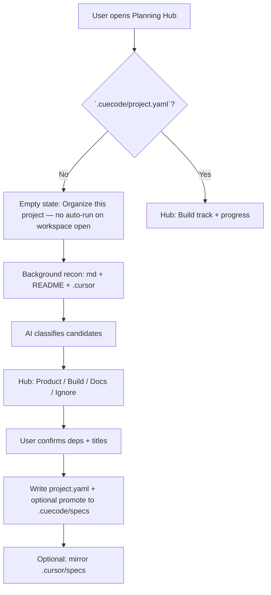
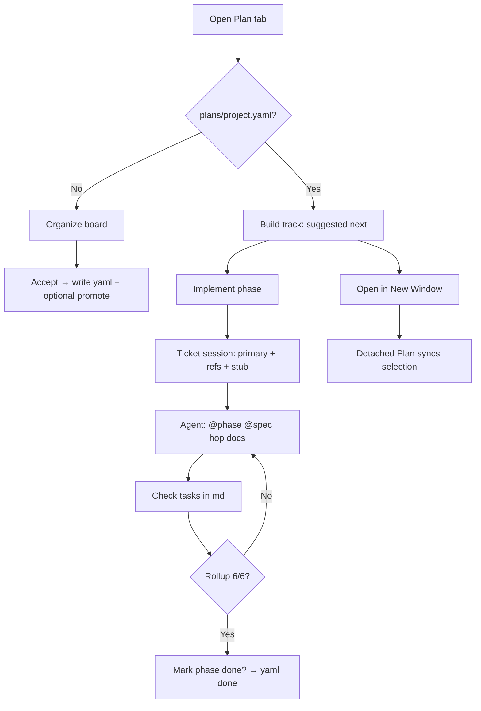
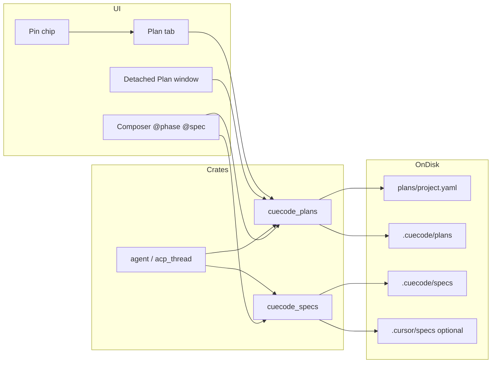

# Planning Hub & `.cuecode` project brain {#planning-hub}

> **Status:** Draft — Q1–Q10 resolved (2026-06-22)  
> **Related:** [05-innovations §SDAL](../core/05-innovations.md#sdal) · [09-ui-ux-spec §plan-surface](./09-ui-ux-spec.md#plan-surface) · [08-agent-tools §specs](../agent/08-agent-tools-and-skills.md) · [07-implementation-roadmap](../delivery/07-implementation-roadmap.md)

| Field | Value |
|-------|-------|
| **One-liner** | **Agent Linear** — a Linear-like board in the IDE for planning and executing agent work (tickets, order, status). **Implement** runs an agent on a ticket with linked context. On disk: yaml + markdown under `.cuecode/plans` and `.cuecode/specs` (persistence detail, not the product pitch). |
| **Product name (UI)** | **Plan** (tab / detached window). “Planning Hub” = legacy palette string until rename. |
| **Supersedes** | Build phase 1.3 header spec linker + dumb spec browser (see [#supersedes-1-3](#supersedes-1-3)) |
| **Canonical on-disk** | `.cuecode/plans/project.yaml` + `.cuecode/plans/` + `.cuecode/specs/` |
| **Compat** | Read/mirror `.cursor/specs/`; v1 dogfood may use `.cuecode/project.yaml` at repo root (alias) |

---

## Problem {#problem}

| Pain | Today | Hub fixes |
|------|-------|-----------|
| Docs scattered | README, `docs/`, random `.md` | AI recon + manifest **pointers** |
| Folder taxonomy | Hand-maintained `.cursor/specs/` tree | Hub **generates** + classifies |
| Phase vs feature vs task | Same checkbox soup | Three **kinds** in UI + yaml |
| “Go build 2.1” | Remember a file path | **Build phase id** + **Implement** |
| Cursor vs CueCode identity | Everything lives under `.cursor/` | **Breathe `.cuecode`**; optional mirror |
| Header spec dropdown | Ceremony; context fear | **Pin modes** + chip; hub is home |

**Cursor gap:** specs can live anywhere; the user is the PM tool. CueCode should **infer → propose → confirm**, not assume one folder exists.

---

## Principles {#principles}

1. **In-repo, not SaaS** — manifest + markdown in git; plan changes go through PRs (hub-generated diffs).
2. **CueCode-native** — default paths under `.cuecode/`; product copy says `.cuecode`, not `.cursor`.
3. **Open compat** — read `.cursor/specs`, skills, rules; optional **mirror export**; open markdown + YAML.
4. **Infer → propose → confirm** — AI never silently moves or deletes files.
5. **Pointer-first** — manifest references external paths until user **promotes** to `.cuecode/specs/`.
6. **Execute wired** — every build phase: Implement · Pin · Verify · Open.
7. **Context policy** — pin = off | summary | full | section; not full-body-by-default.
8. **Hub-authoritative manifest** — the hub compiles `project.yaml`; raw yaml editing is discouraged (see [#manifest-governance](#manifest-governance)).

---

## Product summary {#product-summary}

**Agent Linear** is a Linear-like board in the IDE: tickets, order, and status for agent work. **Plan** is that surface (tab or detached window), not a mode buried in chat.

- **Build track** — executable tickets (`kind: build_phase`) from manifest
- **All artifacts** — browse specs + plans markdown
- **Organize** — scattered repo → manifest (1.6)
- **Implement** — run an **agent ticket session** with primary phase + linked context
- **Detach** — same Plan view in a second OS window (monitor 2)

Persistence lives under `.cuecode/plans` + `.cuecode/specs` (see [#cuecode-layout](#cuecode-layout)). That is how the board survives sessions and PRs, not the product pitch.

**Presentation hosts** (one `PlanningHubView`, shared `PlanStore`):

| Host | When | Build phase |
|------|------|-------------|
| **Agent panel → Plan tab** | Default daily flow | [1.4b](../delivery/build-plans/phases/1-4b-plan-ui-integration.md) |
| **Detached Plan window** | Wide preview / second monitor | 1.4b |
| **Modal / picker** | Quick `@phase` search only | 1.3-rev (demote after 1.4b) |

See [#plan-ui](#plan-ui) for wireframes.

---

## `.cuecode` on-disk layout {#cuecode-layout}

Two trees, two jobs — do not merge into one folder soup.

| Tree | Role | Analogy |
|------|------|---------|
| **`.cuecode/plans/`** | Execution — ticket graph, build phases, task bodies | Linear issues / epics |
| **`.cuecode/specs/`** | Reference — design, architecture, agent doctrine | Project docs / Notion specs |

```text
.cuecode/
├── plans/
│   ├── project.yaml              # master ticket graph (hub-compiled)
│   ├── phases/                   # build phase markdown (promoted over time)
│   │   └── 2-1-intent-core.md
│   └── tickets/                  # optional per-ticket yaml shards (P-H5+)
│       └── phase-2-1.yaml
├── specs/                        # canonical reference markdown
│   ├── design/
│   ├── core/
│   └── agent/
├── skills/                       # optional
├── rules/                        # optional
└── memory/                       # later — parity/17-memory-and-context

# v1 compat (dogfood): project.yaml may also live at .cuecode/project.yaml
# cuecode_plans resolves: plans/project.yaml first, then root alias
```

**Compat (read / mirror):**

```text
.cursor/specs/                    # legacy index + optional mirror export
```

**Organize (1.6)** classifies scattered md → **plans vs specs**, not “dump everything in specs.”

---

## Agent tickets {#agent-tickets}

A **ticket** = manifest `artifacts[]` entry + resolved markdown body + optional `refs[]` doc bundle.

| `kind` | Ticket meaning | Primary action |
|--------|----------------|----------------|
| `build_phase` | Executable work unit | **Implement** |
| `product_plan` | Roadmap / epic | Open · Pin summary |
| `feature_spec` | Deep reference spec | Open · `@spec` · link from phase refs |
| `readme_section` | Docs map entry | Sync preview (later) |
| `ignore` | Excluded from index | — |

**Build track** = filtered view: `kind: build_phase`, deps satisfied, `status != done`.

```text
plans/project.yaml          ← ticket EXISTS, status, deps, refs (yaml upstream)
    └── phases/2-1.md       ← narrative, verify block, checkboxes (md downstream)
            └── refs[] ────► specs/design/09-ui-ux-spec.md
            └── refs[] ────► specs/core/04-sandbox-core.md
```

| Concern | Source of truth | Writer |
|---------|-----------------|--------|
| Ticket id, kind, deps, blocks, refs | `project.yaml` | Hub |
| Phase `status` | `project.yaml` | Hub |
| Task checkboxes | Phase `.md` | User + agent |
| Task count (`3/6`) | Parsed from `.md` | Hub (read-only) |

**Implement ≠ pin one file.** Implement opens a **ticket session** (see [#implement-bundle](#implement-bundle)).

### Build track row status (1.4b polish) {#build-track-status}

Visual affordances on Build track rows (modal + future Plan tab):

| `artifact.status` | Row chrome |
|-------------------|------------|
| `done` | Green border (`success_border`), subtle success background, green **Done** pill + success task line |
| `in_progress` | Accent/focus border when not selected |
| `not_started` | Default row; **Suggested next** / **Blocked** pills unchanged |

**Implement session:** on **Implement**, composer profile auto-selects **Write** (native agent threads). Stub mentions `./scripts/verify-all.sh` for fixture QA — not `cuecode-plan` on PATH.

---

## Three plan kinds {#plan-kinds}

Stop mixing product roadmap, executable build work, and feature depth in one mental bucket.

| Kind | Example | Hub label | Primary action |
|------|---------|-----------|----------------|
| **Product plan** | `07-implementation-roadmap` Phase 2 | Product | Open · Pin summary |
| **Build phase** | `build-plans/phases/2-1-intent-core.md` | Build track | **Implement** |
| **Feature spec** | `core/04-sandbox-core.md` | Specs | Open · Pin · `@spec` |
| **README section** | `README.md#development` | Docs map | Sync preview (later) |
| **Ignore** | scratch notes | — | Excluded from index |

**Implementation steps** = checkbox tasks **inside** a build phase file (or generated task list), not a fourth top-level folder users must maintain by hand.

---

## End-to-end journeys {#journeys}

### A — Scattered repo (first open) {#journey-scattered}



**Copy (draft):** “We found planning docs in N places. Propose a CueCode plan?”

### B — Greenfield {#journey-greenfield}

1. `cuecode init` → `.cuecode/project.yaml` + `specs/` skeleton + templates.
2. Hub wizards: **New product plan** · **New build phase**.
3. First **Implement** → thread + pin (summary) + suggested first message.

### C — Daily dev (dogfood) {#journey-daily}

1. Agent panel → **Plan** tab (or detached Plan window on monitor 2)
2. **Build track** → **Suggested next** highlights `phase-2-1-intent-core`
3. **Implement phase** → ticket session: thread + pin bundle + composer stub
4. Agent hops docs via `@phase 2.1`, `@spec 09-ui-ux`, tools
5. Checkboxes in phase md; Plan UI rolls up `3/6`
6. All checked → **Mark phase done?** → yaml `status: done`

### C2 — Detached Plan window {#journey-detached}

1. Plan tab → **Open in New Window** (or palette: `CueCode: Open Plan in New Window`)
2. Second window shows full Build track + preview; main window keeps agent thread
3. Selection syncs both ways via shared `PlanStore`
4. **Dock back** closes detached window; focuses Plan tab in main workspace

### D — Cursor teammate {#journey-cursor-compat}

- Uses `.cursor/specs/` mirror (`cuecode export cursor-compat` or CI)
- Same markdown; Cursor never needs `project.yaml`
- CueCode user owns manifest; mirror stays in sync by policy

### E — Plan authoring (later) {#journey-plan-builder}

- Hub chat: “Split Phase 2 into three build phases”
- Diff preview → accept → new md + manifest entries (Agent Builder pattern for **plans**)

---

## Implement bundle & `refs[]` {#implement-bundle}

When user clicks **Implement phase**, CueCode opens an **agent ticket session** — not a single-file pin.

### Schema: `refs[]` on artifacts {#refs-schema}

```yaml
artifacts:
  - id: phase-2-1-intent-core
    kind: build_phase
    path: plans/phases/2-1-intent-core.md
    root: plans                    # plans | spec | external
    status: not_started
    depends_on: [phase-1-6-organize-with-ai]
    blocks: [phase-2-2-intent-ui]
    pin_policy: summary
    refs:
      - id: design-09-ui-ux
        path: specs/design/09-ui-ux-spec.md
        root: spec
        role: context              # context | required | optional
      - id: core-04-sandbox
        path: specs/core/04-sandbox-core.md
        root: spec
        role: required
```

| `role` | On Implement | Agent behavior |
|--------|--------------|----------------|
| **context** | Summary injected once (pin summary) | Available via `@spec` |
| **required** | Listed in composer stub; agent prompted to read early | Tool / `@spec` before task 2 |
| **optional** | Index only | User pulls when needed |

### Turn-1 injection (Implement)

| Layer | Content |
|-------|---------|
| **Primary** | Build phase md — tasks, verify, exit criteria (pin: summary default) |
| **Refs (context)** | Title + frontmatter summary per ref |
| **Refs (required)** | Named in stub only — full body via `@spec` or `plan_get_ref` |
| **Index** | Cheap `.cuecode/specs` table (~4KB) from `cuecode_specs` |

### Composer stub (example)

```text
Implement ticket `phase-2-1-intent-core`.
Primary: `.cuecode/plans/phases/2-1-intent-core.md`
Required context: @spec 09-ui-ux-spec, @spec 04-sandbox-core
Start with the first unchecked task.
```

### Session fields (evolve from `active_spec_path`)

| Field | Purpose |
|-------|---------|
| `active_ticket_id` | Manifest artifact id |
| `pinned_bundle` | `[primary, …refs]` with per-artifact pin mode |
| `implementing_since` | Timestamp for Plan UI “in progress” strip |

Pin chip copy: `📎 2.1 Intent core · 3/6 · 2 specs linked` — click → Plan tab, ticket selected.

---

## Plan UI presentation {#plan-ui}

**Product copy:** **Plan** (not “Planning Hub modal”). Palette commands rename in 1.4b.

### Host A — Agent panel Plan tab (default) {#plan-ui-agent-tab}

Third mode alongside Thread and Terminal in `AgentPanel` (`BaseView::Plan`).

**Navigation polish (1.4c):** surface tabs render on a **dedicated row** below the session toolbar; the post-Implement plan strip sits between tabs and content. Sidebar thread clicks always load chat when the panel is not showing that thread.

**Chrome polish (1.4d):** surface tabs use an **outlined segmented control** (`ToggleButtonGroup`). Keybindings when agent panel focused: **Cmd/Ctrl+1** Threads, **Cmd/Ctrl+2** Plan, **Cmd/Ctrl+3** Terminal. Palette: `CueCode: Focus Agent Chat`, `Focus Plan`, `Focus Terminal`.

**Layout & multi-window (1.4e):** agent panel docks **left, right, or bottom** (`agent.dock`; discover via `⋯` → **Panel Position**). **Threads** and **Plan** can each detach to separate OS windows — Plan via Host B, chat via Host D. When chat is detached, main panel shows a placeholder; **Implement phase** focuses whichever window hosts the active thread.

**Layout Studio (1.4f):** primary layout UX — [17-layout-studio](./17-layout-studio.md). Virtual dollhouse workspace, drag blocks to slots, presets **Plan / Implement / Classic / Agentic / Dual**, Apply maps to `PanelLayout` + detach. Replaces raw dock edges as the user-facing model.

```
┌─ Agent panel (right dock) ───────────────────────────────────────────────┐
│ ┌─ header ───────────────────────────────────────────────────────────┐ │
│ │ Intent ▾  Sandbox ▾  Model ▾          Next: 2.1 · 3/6 tasks        │ │
│ └────────────────────────────────────────────────────────────────────┘ │
│ [Threads] [Plan ●] [Terminal ▾]              [Open in New Window ↗]   │
├───────────────────────┬────────────────────────────────────────────────┤
│ BUILD TRACK           │ PREVIEW                                        │
│ [Search…]             │  2.1 — Intent core                             │
│                       │  Status: in progress · 3/6 · blocks 2.2       │
│ ▶ Suggested next      │  ─────────────────────────────────────────     │
│   2.1 ◐  3/6          │  ## Tasks                                      │
│ Upcoming              │  - [x] 2.1.1 …                                 │
│   2.2 ○               │  - [ ] 2.1.2 …                                 │
│ Blocked               │  … markdown …                                  │
│   (none)              │  ── Linked specs ──                            │
│                       │  • 09-ui-ux-spec (context)                     │
│                       │  • 04-sandbox-core (required)                  │
├───────────────────────┴────────────────────────────────────────────────┤
│ [Implement phase] [Pin ▼ summary] [Open] [Verify]     (footer actions) │
└────────────────────────────────────────────────────────────────────────┘
```

**After Implement** — Plan collapses to strip; thread composer expands:

```
┌─ Agent panel ──────────────────────────────────────────────────────────┐
│ [Threads ●] [Plan] [Terminal ▾]     📎 2.1 · 3/6 · 2 specs  [Plan ↗] │
├────────────────────────────────────────────────────────────────────────┤
│ … conversation …                                                       │
│ Agent: Per @phase 2.1, next unchecked task is 2.1.3 …                  │
├────────────────────────────────────────────────────────────────────────┤
│ [@phase 2.1] [@spec 09-ui-ux]  Build Implement phase 2.1…        [Send]│
└────────────────────────────────────────────────────────────────────────┘
```

| Interaction | Result |
|-------------|--------|
| **Plan tab** | Full Build track + preview |
| **Implement phase** | New or current thread; yaml `in_progress`; composer stub; collapse Plan |
| **Plan ↗** / chip click | Return to Plan tab, ticket focused |
| **Open** | Editor tab on primary path; Plan stays open |
| **Open in New Window ↗** | Detached Plan window (Host B) |

### Host B — Detached Plan window {#plan-ui-detached}

Minimal GPUI window — same `PlanningHubView` + shared `PlanStore` as tab.

```
┌─ CueCode — Plan (CueInference) ──────────────────────────────── [×] ─┐
│ [Build track ●] [All artifacts] [Organize]     [Search…]  [Dock ←] │
├─────────────────┬──────────────────────────────────────────────────┤
│ 2.1 ◐  3/6      │ # 2.1 Intent core                               │
│ 2.2 ○           │ … full-height preview + task checklist …        │
│ 1.6 ○           │                                                  │
│                 │ Linked: 09-ui-ux · 04-sandbox                    │
├─────────────────┴──────────────────────────────────────────────────┤
│ [Implement phase] [Open in editor] [Pin ▼]                           │
└──────────────────────────────────────────────────────────────────────┘
```

| Interaction | Result |
|-------------|--------|
| Select ticket | Syncs to main window Plan tab (if open) |
| Implement | Focuses agent thread in main panel **or** detached chat window (Host D); detached Plan stays on ticket |
| **Dock ←** | Closes detached window; focuses Plan tab in main workspace |
| Edit checkbox in preview | Read-only v1; edit in editor or agent checks box in md |

### Host D — Detached Agent Chat window {#plan-ui-detached-chat}

Minimal GPUI window — renders the active `ConversationView` from `AgentPanel` (single entity, not duplicated). Handle stored on `PlanStore.detached_threads_window`.

```
┌─ CueCode — Agent Chat (CueInference) ──────────────────────── [×] ─┐
│ Agent Chat                                              [Dock]      │
├─────────────────────────────────────────────────────────────────────┤
│ … active thread conversation + composer …                           │
└─────────────────────────────────────────────────────────────────────┘
```

| Interaction | Result |
|-------------|--------|
| Open ↗ (Threads toolbar) / palette | Opens detached chat; main panel shows placeholder |
| **Dock** | Closes detached window; restores Threads tab in main agent panel |
| Focus Agent Chat (`cmd-1`) | Activates detached window if open; else main panel Threads |
| Implement phase | Focuses chat host (main or detached); Plan window unchanged |
| Plan + Chat detached | Both windows can be open simultaneously on separate monitors |

Build phase: [1-4e](../delivery/build-plans/phases/1-4e-agent-layout-multi-window.md).

### Host C — Modal / picker (demoted) {#plan-ui-modal}

Keep 1.3-rev modal only for:

- Organize empty state (no manifest)
- Small fuzzy picker: `@phase` from composer (future)

**Do not** use modal as primary Plan home after 1.4b.

### Organize board (1.6) — same Plan chrome {#plan-ui-organize}

```
┌─ Plan — Organize ──────────────────────────────────────────────────────┐
│ We found planning docs in 12 places. Propose a CueCode plan?         │
├──────────┬──────────┬──────────┬──────────┬──────────┬───────────────┤
│ Product  │ Build    │ Spec     │ Docs     │ Ignore   │ Unsorted (3)  │
│ ┌──────┐ │ ┌──────┐ │ ┌──────┐ │          │          │ ┌───────────┐ │
│ │road- │ │ │2-1   │ │ │04-sb │ │          │          │ │notes.md   │ │
│ │map   │ │ │2-2   │ │ │09-ui │ │          │          │ └───────────┘ │
│ └──────┘ │ └──────┘ │ └──────┘ │          │          │               │
├──────────┴──────────┴──────────┴──────────┴──────────┴───────────────┤
│ [Explain why] on card · drag between columns · [Accept plan] [Cancel]  │
└────────────────────────────────────────────────────────────────────────┘
```

Accept → writes `plans/project.yaml` + optional Promote copies to `.cuecode/plans/` + `.cuecode/specs/`.

### All artifacts tab {#plan-ui-all-artifacts}

```
┌─ Plan — All artifacts ────────────────────────────────────────────────┐
│ [Build track] [All artifacts ●] [Docs map]              [Search…]     │
├──────────────────┬─────────────────────────────────────────────────────┤
│ specs/           │ Preview                                             │
│  design/16-…     │ # Planning Hub & project brain                      │
│ plans/           │ …                                                   │
│  phases/2-1…  ●  │ [Open] [Pin ▼]  (no Implement — not build_phase)  │
└──────────────────┴─────────────────────────────────────────────────────┘
```

---

## Chat integration {#chat-integration}

Plan is **referencable from agent chat** like files and specs.

### Mentions

| User types | Resolves to | Injected |
|------------|-------------|----------|
| `@spec roadmap` | spec artifact / path | Spec envelope (today) |
| `@phase 2.1` | `phase-2-1-intent-core` | Ticket summary + task list |
| `@plan` | build track digest | Top N open phases table |
| `@task 2.1.3` | checkbox anchor (P-H5) | Single task + surrounding context |

**New mention URI (sketch):**

```rust
MentionUri::PlanArtifact {
    artifact_id: String,
    title: String,
    kind: PlanKind,
}
```

Crease in composer / transcript: `@2.1 Intent core` — click → Plan tab selects ticket.

### Agent tools (later)

| Tool | Purpose |
|------|---------|
| `plan_list_build_track` | List open phases |
| `plan_get(artifact_id)` | Primary body + refs metadata |
| `plan_get_ref(artifact_id, ref_id)` | Pull linked spec section |
| `propose_plan_update` | Hub applies yaml — agent never writes yaml directly |

### System prompt digest (cheap, every turn)

```text
## Build track (CueCode Plan)
Suggested next: phase-2-1-intent-core (3/6 tasks, in_progress)
Blocked: none
Open phases: 2.1, 2.2, 1.6
```

From `cuecode_plans`; spec index from `cuecode_specs`.

---

## End-to-end journey {#e2e-journey}



---

## Planning Hub UI (legacy modal — 1.3-rev) {#hub-ui}

> **Superseded for daily use by [#plan-ui](#plan-ui).** Modal remains for empty Organize + quick picker until 1.4b lands.

**Entry (v0):** `CueCode: Planning Hub` palette · pin chip · modal.

**Target (1.4b):** `CueCode: Focus Plan` · Plan tab · detached window.

**Empty state (no manifest):** Primary **Organize this project** · secondary **Skip for now** (dismissible). No Organize on workspace open — [Q6](#resolved-decisions).

**Removed (vs 1.3 stub):** header spec dropdown popover.

**Kept:** read-only header chip when pinned — `📎 {title} · {pin_mode}`.

### Wireframe (1.3-rev modal — reference only) {#hub-wireframe}

```
┌─ Planning Hub (modal — demote after 1.4b) ─────────────────────────────┐
│ [Build track] [All artifacts]                              [Search…] [×] │
├──────────────┬──────────────────────────────────────────────────────────┤
│ LIST         │ PREVIEW                                                   │
│   2.1 ◐      │  Build phase 2.1 — Intent core                            │
│   2.2 ○      │  … rendered markdown + task checklist …                   │
├──────────────┴──────────────────────────────────────────────────────────┤
│                                    [Implement phase] [Open]              │
└──────────────────────────────────────────────────────────────────────────┘
```

### Actions {#hub-actions}

| Action | Result |
|--------|--------|
| **Implement phase** | Ticket session — see [#implement-bundle](#implement-bundle) |
| **Pin ▼** | off · summary · full · section (anchor picker) |
| **Open** | Editor on artifact path; Plan surface stays open (1.4b+) |
| **Verify** | Run commands from phase file Verify block |
| **Promote** | Copy/move → `.cuecode/plans/` or `.cuecode/specs/`; update yaml |
| **Organize** | Run recon pipeline (§organize-pipeline) |
| **Open in New Window** | Detached Plan (1.4b) |

## Pin & context policy {#pin-policy}

| Mode | Injected each turn | When to use |
|------|-------------------|-------------|
| **off** | Spec index only (~4KB table) | Explore; agent discovers via tools |
| **summary** | Title + frontmatter + task list | Default when pinned |
| **full** | Entire spec body | Execute build phase |
| **section** | One `{#anchor}` region | Deep dive in huge doc |

**Session field:** `active_ticket_id` (manifest id) + `pinned_bundle[]` with per-ref pin mode. v1 bridge: resolve id → path at Implement; deprecate bare `active_spec_path`.

Compaction must preserve ticket id + pin modes (extends EC-15 / SDAL).

---

## Manifest governance {#manifest-governance}

**Decision (Q2):** The hub is the **compiler**; `project.yaml` is the **compiled artifact** — not the primary editing surface.

| Layer | Who | How |
|-------|-----|-----|
| **Planning Hub** | User | Structured edits: deps, titles, Organize accept, mark done |
| **Phase markdown** | User + agent | Narrative, verify blocks, **task checkboxes** |
| **`project.yaml`** | **Hub writes** (normal path) | Serialized after every hub mutation |
| **Git / PR** | Reviewer | Reviews hub-generated diffs |
| **CI** | Read-only | `cuecode plan validate` — invalid yaml or missing paths fail the check |
| **Escape hatch** | Power users | **Advanced: view generated yaml** (read-only v1); no default in-IDE yaml editor |

If `project.yaml` changes on disk outside the hub (mtime / git pull), hub shows **manifest out of sync — reload or re-validate**. Bulk migrations use `cuecode_plans::apply_patch` or hub import — not hand-edited yaml as the happy path.

---

## On-disk: `project.yaml` v1 {#project-yaml}

Machine-readable ticket graph (hub-compiled). Human/agent bodies stay markdown under `.cuecode/plans/` and `.cuecode/specs/`.

**Load path:** `.cuecode/plans/project.yaml` (canonical). v1 alias: `.cuecode/project.yaml` at repo root (dogfood).

### Schema sketch {#project-yaml-schema}

```yaml
version: 1
project:
  name: my-project
  adopted_at: 2026-06-22

roots:
  plans: .cuecode/plans
  spec: .cuecode/specs
  cursor_mirror: .cursor/specs    # optional
  merge_cursor: false
  mirror_policy: manual

artifacts:
  - id: phase-2-1-intent-core
    kind: build_phase
    path: phases/2-1-intent-core.md
    root: plans                   # plans | spec | external
    canonical: true
    status: in_progress
    depends_on: [phase-1-6-organize-with-ai]
    blocks: [phase-2-2-intent-ui]
    pin_policy: summary
    refs:
      - id: design-09-ui-ux
        path: design/09-ui-ux-spec.md
        root: spec
        role: context

  - id: legacy-roadmap
    kind: product_plan
    path: .cursor/specs/delivery/07-implementation-roadmap.md
    root: external
    canonical: false

build_track:
  suggested_next: phase-2-1-intent-core

docs:
  readme: []
```

### Path resolution {#path-resolution}

| `root` | Resolved path |
|--------|----------------|
| `plans` | `{worktree}/.cuecode/plans/{path}` |
| `spec` | `{worktree}/.cuecode/specs/{path}` |
| `external` | `{worktree}/{path}` |

### Progress {#progress}

**Decision (Q3):** Yaml **upstream** (graph + phase lifecycle); checkboxes **downstream** (task execution in linked md). Hub mediates rollup.

```text
plans/project.yaml (ticket graph + refs)
    └── plans/phases/2-1.md OR external pointer
            └── refs[] → specs/…
            └── checkboxes in md
                    └── rollup → Plan UI
```

| Concern | Source of truth | Writer |
|---------|-----------------|--------|
| Artifact exists, kind, deps, blocks | `project.yaml` | Hub |
| Phase `status` (not_started / in_progress / done) | `project.yaml` | Hub |
| Task list (`2.1.3`, titles) | Phase `.md` | User + agent |
| Task done / not done | Checkbox in `.md` | User + agent |
| Task count (`3/6`) | Parsed from `.md` | Hub (read-only parse) |
| `build_track.suggested_next` | `project.yaml` graph | Hub (deps satisfied + `status != done`) |

**Status transitions (v1):**

1. **Implement phase** → hub sets yaml `status: in_progress`.
2. Checkboxes change in md only; hub recomputes task count.
3. All boxes checked → hub shows **Mark phase done?** (never silent auto-done).
4. User confirms → hub sets yaml `status: done`.

Md without a manifest artifact is not on the build track (may still appear in Organize candidates).

**Later (P-H5):** stable task ids in yaml + md anchors (`<!-- task:2.1.3 -->`) for rename-safe rollup.

---

## Spec root resolution {#spec-roots}

**Decision (Q1):** Prefer-only by default; optional merge; manifest artifacts always indexed.

| Mode | Index behavior |
|------|----------------|
| **Default** | If `.cuecode/specs/` exists and has any `.md`, index **only** that tree |
| **No `.cuecode/specs/` yet** | Fall back to `.cursor/specs/` only (dogfood / migration) |
| **`roots.merge_cursor: true`** | Union `.cuecode/specs` + `.cursor/specs`; same relative path → **`.cuecode` wins** |
| **`project.yaml` `artifacts[]`** | Always merged when manifest exists — external pointers, regardless of merge flag |

Read order for `@spec` + tools: `.cuecode/specs` (or fallback) → optional cursor merge → manifest artifact paths.

**Write default:** hub writes `.cuecode/plans/project.yaml`; Promote copies bodies to `.cuecode/plans/phases/` or `.cuecode/specs/` as appropriate.

**Export:** `cuecode export cursor-compat` → mirror canonical tree to `.cursor/specs/`.

See also: future doc `core/16-cuecode-project-brain.md` (manifest + compat detail).

---

## AI Organize pipeline {#organize-pipeline}

No assumption that specs live in one folder.

**Decision (Q5):** Three layers — Rust recon, **hub board** (the product), bounded read-only structure agent. LLM is advisory for ambiguity, not the whole flow.

**Decision (Q6):** Suggest Organize on **hub empty state** when no manifest — never auto-run on workspace open. Skip is dismissible; palette command always available.

### Layer 1 — Rust recon (deterministic)

| Step | Output |
|------|--------|
| Glob `**/*.md`, README, `.cursor/**`, respect gitignore, size caps | `CandidateFile[]` |
| Heuristics: frontmatter, “Build phase”, “Exit criteria”, checkbox density | Pre-label + confidence |

### Layer 2 — Hub board (human + AI)

Columns: **Product · Build · Spec · Docs · Ignore · Unsorted**. Drag-drop, merge duplicates, edit titles. **Explain why** chip (heuristics + model rationale). **No disk writes.**

| UX | Purpose |
|----|---------|
| **Incremental Organize** | Scan new/changed since last run — don’t re-classify whole repo |
| **Partial accept** | Accept Build track only; defer Docs |
| **Merge suggestions** | “These 3 files look like one phase” |
| **Confidence** | High → auto-column; low → Unsorted |
| **Draft manifest** | In-memory until Accept |

### Layer 3 — Structure agent (bounded LLM)

Dedicated read-only session (subagent or hub-owned thread) — **not** the user’s Implement thread.

| Step | Actor | Output |
|------|-------|--------|
| Classify ambiguous bucket | Read-only agent: summaries + pre-labels only (~20–50 files max) | Column assignments + confidence |
| Dedupe | Same agent | Merge suggestions |
| Structure | Same agent (optional 2-pass: cheap classify → better model for deps) | Proposed `depends_on`, build order, artifact ids |
| Review | Hub board | User edits |
| Accept | User **Accept plan** | Hub writes `project.yaml`; copy only on **Promote** |

**Tool wall:** read_file, grep, list_dir — no write, terminal, or nested spawn.

**Guardrails:**

- No filesystem writes until Accept
- Low confidence → **Unsorted** bucket
- Never delete source files on adopt
- Re-organize **merges** into existing manifest — never nukes user-kept artifacts

Future agent spec: `agent/15-plan-recon.md`.

---

## Agent & harness integration {#harness}

**Decision (Q4):** New crate **`cuecode_plans`** — plan graph, manifest I/O, Organize drafts, progress rollup, Implement resolution. **`cuecode_specs`** stays document discovery (`@spec`, index, frontmatter, multi-root scan). Dependency: `cuecode_plans` → `cuecode_specs` (one way).

| Crate / layer | Owns |
|---------------|------|
| **`cuecode_plans`** | Load `plans/project.yaml`; artifact id → path; `refs[]`; `suggested_next`; checkbox rollup; Implement bundle; Organize draft |
| **`cuecode_specs`** | Scan `.cuecode/specs` + fallback/merge `.cursor/specs`; `@spec`; spec index |
| **System prompt** | Build track digest (`cuecode_plans`) + spec index (`cuecode_specs`) |
| **Session** | `active_ticket_id` + `pinned_bundle` |
| **Tools (later)** | `plan_list`, `plan_get`, `plan_get_ref`, `propose_plan_update` |
| **Skills** | `implement-spec` → Implement `{artifact_id}` ticket session |
| **UI** | `PlanningHubView` + shared `PlanStore`; Plan tab + detached window |

**v1 `cuecode_plans` scope:** `ProjectManifest`, `Artifact`, `Ref`, `validate()`, `resolve_path()`, pointer-only dogfood from existing `build-plans/phases/*.md`.

---

## Architecture {#architecture}



---

## Delivery phases {#delivery-phases}

Reframes roadmap after Phase 1.2. Replaces shipped 1.3 stub direction.

| ID | Deliverable | Notes |
|----|-------------|-------|
| **P-H0** `1.3-rev` | Plan modal shell: list + preview + Open; pin chip; palette | [1-3-rev](../delivery/build-plans/phases/1-3-rev-planning-hub-v0.md) |
| **P-H1** `1.4` | `cuecode_plans`; Build track; Implement **ticket session** + `refs[]` | [1-4](../delivery/build-plans/phases/1-4-planning-hub-manifest.md) |
| **P-H1b** `1.4b` | **Plan tab** in agent panel; detached window; shared `PlanStore` | [1-4b](../delivery/build-plans/phases/1-4b-plan-ui-integration.md) |
| **P-H1c** `1.4e` | Agent dock left/right/bottom; detached Threads + Plan multi-monitor | [1-4e](../delivery/build-plans/phases/1-4e-agent-layout-multi-window.md) |
| **P-H1d** `1.4f` | **Layout Studio** — dollhouse presets, drag layout, Apply → Plan/Implement workflows | [1-4f](../delivery/build-plans/phases/1-4f-layout-studio.md) · [17 §layout-studio](./17-layout-studio.md) |
| **P-H2** `1.5` | `.cuecode/specs` primary; `@phase` mention; pin modes on bundle | [1-5](../delivery/build-plans/phases/1-5-spec-roots-pin-modes.md) |
| **P-H3** `1.6` | Organize board in Plan surface — **Phase 1 complete** | [1-6](../delivery/build-plans/phases/1-6-organize-with-ai.md) |
| **P-H4** `2.x` | Hub writes new build phases; `cursor-compat` export | Ties to intent work |
| **P-H5** `3.x` | `@task` anchors; plan ↔ checkbox sync via ids | SDAL review |
| **P-H6** `5.x` | Plan builder chat; README docs-map drift | Polish |

Build phase markdown: [1-3-rev](../delivery/build-plans/phases/1-3-rev-planning-hub-v0.md) · [1-4](../delivery/build-plans/phases/1-4-planning-hub-manifest.md) · [1-4b](../delivery/build-plans/phases/1-4b-plan-ui-integration.md) · [1-4e](../delivery/build-plans/phases/1-4e-agent-layout-multi-window.md) · [1-4f](../delivery/build-plans/phases/1-4f-layout-studio.md) · [1-5](../delivery/build-plans/phases/1-5-spec-roots-pin-modes.md) · [1-6](../delivery/build-plans/phases/1-6-organize-with-ai.md). Dogfood manifest: [`.cuecode/project.yaml`](../../.cuecode/project.yaml) (repo root alias; target `plans/project.yaml`).

---

## Supersedes 1.3 {#supersedes-1-3}

| 1.3 task (original) | Replacement |
|---------------------|-------------|
| 1.3.1 Header spec linker | Hub **Pin** + header chip only |
| 1.3.2 Command palette spec browser | **CueCode: Planning Hub** |
| 1.3.3 `implement-spec` skill stub | Keep; retarget to **Implement build phase** |

Code shipped for 1.3 remains useful (index, `active_spec_path`, browser patterns) but **header dropdown should be removed** when P-H0 lands.

---

## Exit criteria (alpha) {#exit-criteria}

| ID | Given / When / Then |
|----|---------------------|
| E1 | Scattered repo → Organize → Accept → `project.yaml` exists; Build track shows phases |
| E2 | **Implement** on [PulseBoard fixture](../../ops/13-plan-e2e-fixture.md) → thread + pin; agent uses phase tasks (not CueInference dogfood) |
| E3 | Pin summary injects less than pin full (token measurable) |
| E4 | `.cuecode/specs` indexed; `@spec` works; mirror-only `.cursor/specs` repo still indexes |
| E5 | No header spec dropdown; Plan tab + palette Focus Plan |
| E6 | Dogfood: manifest from build-plans without moving all files (pointer-only v1) — **CueInference only** |
| E7 | **Implement** opens ticket session with `refs[]` bundle — run in [cuecode-testing-repo](../../ops/13-plan-e2e-fixture.md) |
| E8 | Detached Plan window syncs selection with Plan tab; Implement focuses main agent thread |

---

## Resolved decisions {#resolved-decisions}

| ID | Decision |
|----|----------|
| **Q1** | **Prefer-only** index: `.cuecode/specs` if present; else `.cursor/specs` fallback; optional `roots.merge_cursor: true` (`.cuecode` wins on clash); `artifacts[]` always indexed when manifest exists — [§spec-roots](#spec-roots) |
| **Q2** | **Hub-authoritative writes**; yaml = compiled output; CI validates read-only; raw yaml edit discouraged; out-of-band changes → reload banner — [§manifest-governance](#manifest-governance) |
| **Q3** | **Yaml upstream** (graph + phase status); **checkboxes downstream** in linked md; hub rolls up; Implement → `in_progress`; all tasks done → confirm **Mark phase done?** — [§progress](#progress) |
| **Q4** | New **`cuecode_plans`** crate; `cuecode_specs` unchanged in role; one-way dep plans → specs — [§harness](#harness) |
| **Q5** | **Layer 1** Rust scan + heuristics; **Layer 2** hub kanban board; **Layer 3** read-only structure agent for ambiguous files + deps; incremental + partial accept — [§organize-pipeline](#organize-pipeline) |
| **Q6** | **Suggest** Organize on hub empty state when no manifest; **no** auto-run on workspace open; Skip dismissible — [§journey-scattered](#journey-scattered) |
| **Q7** | **`.cuecode/plans/` + `.cuecode/specs/`** split — plans = execution tickets, specs = reference docs — [§cuecode-layout](#cuecode-layout) |
| **Q8** | **Implement = ticket session** with primary + `refs[]` bundle — not single-file pin — [§implement-bundle](#implement-bundle) |
| **Q9** | **Plan UI:** agent panel tab (default) + detached OS window; modal demoted — [§plan-ui](#plan-ui) |
| **Q10** | Chat: `@phase`, `@plan`, `MentionUri::PlanArtifact`; crease click → Plan tab — [§chat-integration](#chat-integration) |

**Open (minor):** v2 “Edit as yaml” with validate-on-save for emergencies — default remains read-only Advanced view.

---

## Changelog {#changelog}

| Date | Change |
|------|--------|
| 2026-07-13 | Reframe product pitch: Agent Linear = in-IDE board for plan + execute; git/on-disk is persistence, not the headline |
| 2026-06-23 | Build track status chrome + Implement→Write — [§build-track-status](#build-track-status) |
| 2026-06-22 | E2E Agent Linear model: `.cuecode/plans` + specs split, ticket sessions, Plan tab wireframes, detached window, `@phase` chat — Q7–Q10 |
| 2026-06-22 | Initial iteration doc from Planning Hub + `.cuecode` brainstorm |
| 2026-06-19 | Build phases 1.3-rev–1.6, roadmap deps, dogfood `.cuecode/project.yaml` |

---

## Next edits (iteration) {#iteration-notes}

- [x] Resolve Q1–Q6 — see [#resolved-decisions](#resolved-decisions)
- [x] E2E ticket model + Plan UI wireframes — Q7–Q10; [§plan-ui](#plan-ui) · [§e2e-journey](#e2e-journey)
- [x] Build phases [1-3-rev](../delivery/build-plans/phases/1-3-rev-planning-hub-v0.md) … [1-6](../delivery/build-plans/phases/1-6-organize-with-ai.md) + [1-4b](../delivery/build-plans/phases/1-4b-plan-ui-integration.md)
- [x] Dogfood [`.cuecode/project.yaml`](../../.cuecode/project.yaml) (pointer-only; migrate to `plans/project.yaml`)
- [ ] Wire [09-ui-ux-spec §plan-surface](./09-ui-ux-spec.md#plan-surface) copy deck (Focus Plan, detached window)
- [ ] Split normative schema to `core/16-cuecode-project-brain.md`
- [ ] Gherkin scenarios for Organize + Implement ticket session
