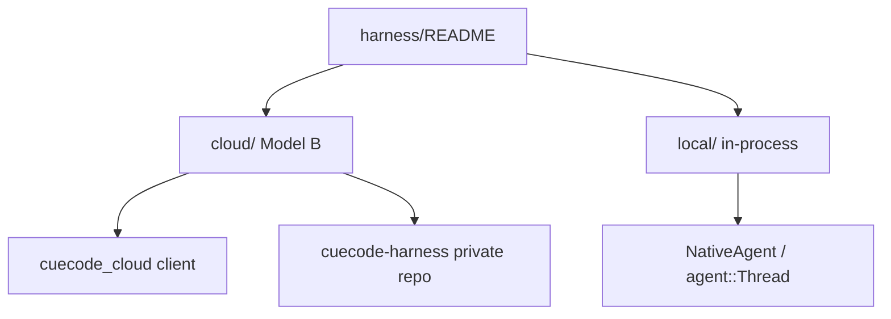

# Harness specs {#harness-index}

> **Parent:** [00-README](../00-README.md)  
> CueCode agent harness documentation — split by **where orchestration runs**.

Two branches live under this directory. They share **semantics** (Active / Async / Hybrid,
built-in agents, VERDICT, artifacts) but differ in **deployment**:

| Branch | Path | Default? | License |
|--------|------|----------|---------|
| **Cloud** | [cloud/](./cloud/README.md) | **Yes — production CueCode** | GPL client + proprietary server |
| **Local** | [local/](./local/01-agent-harness.md) | Dev / air-gap / community | GPL in-process |



---

## Which doc do I read? {#decision-tree}

```
Building the desktop IDE?
  ├─ Cloud default agent     → cloud/04-open-client + cloud/06-tool-host
  ├─ Offline / NativeAgent   → local/01-agent-harness + cloud/01-overview §fallback
  └─ Agent panel UX          → ../09-ui-ux-spec.md + local §notification-rail-ui

Building cloud orchestration?
  └─ cloud/01 → 02 → 05 → 07 → 03 (protocol)

Implementing Active/Async/Hybrid?
  ├─ Semantics (what)        → local/01-agent-harness
  └─ Scheduler (who runs)    → cloud/05-cloud-services §scheduler

Licensing / moat boundary?
  └─ cloud/01-overview
```

---

## Branch index {#branch-index}

### Cloud harness — Model B {#cloud-harness}

Proprietary orchestration on CueCode infrastructure. Open GPL IDE is a **tool host +
thin client** (`cuecode_cloud`).

| # | Doc | Topic |
|---|-----|-------|
| — | [cloud/README.md](./cloud/README.md) | Cloud index + reading order |
| 01 | [cloud/01-overview.md](./cloud/01-overview.md) | Product decision, open vs closed, licensing |
| 02 | [cloud/02-architecture.md](./cloud/02-architecture.md) | Services, topology, data flow |
| 03 | [cloud/03-protocol.md](./cloud/03-protocol.md) | CHP wire format (CueCode Harness Protocol) |
| 04 | [cloud/04-open-client.md](./cloud/04-open-client.md) | `cuecode_cloud` crate (`AgentConnection`) |
| 05 | [cloud/05-cloud-services.md](./cloud/05-cloud-services.md) | harness-api, scheduler, built-in agents |
| 06 | [cloud/06-tool-host.md](./cloud/06-tool-host.md) | Client-side tool execution |
| 07 | [cloud/07-model-gateway.md](./cloud/07-model-gateway.md) | Model routing, decode stream, BYOK |
| 08 | [cloud/08-roadmap.md](./cloud/08-roadmap.md) | M0–M4 milestones |
| 09 | [cloud/09-dev-and-deploy.md](./cloud/09-dev-and-deploy.md) | **E2E runbook** — test, run, deploy |

### Local harness — in-process {#local-harness}

GPL harness embedded in the Zed fork via `NativeAgent`, `agent::Thread`, and planned
local stubs (`cuecode_sandbox` policy cache only).

| Doc | Topic |
|-----|-------|
| [local/01-agent-harness.md](./local/01-agent-harness.md) | Active / Async / Hybrid, built-in agents, GPUI UX, phases |

Legacy redirect: [14-agent-harness.md](./14-agent-harness.md) → local spec.

---

## Concept ownership {#concept-ownership}

| Concept | Defined in | Implemented (cloud) | Implemented (local) |
|---------|------------|---------------------|---------------------|
| `ExecutionContext` | local §rust-types | cloud/05 scheduler | `cuecode_sandbox` stub |
| Built-in agents | local §builtin-agents | cloud/05 registry | `agent::spawn_agent_tool` |
| `SessionNotificationKind` | local §rust-types | cloud/03 CHP | `agent_ui` rail |
| VERDICT gate | local §B.2 | cloud/05 turn engine | local verification agent |
| Tool allowlists | local + 08-tools | cloud/05 + 06 | `agent_settings` |
| Transcript SoT | — | Cloud session store | Local session dir |

---

## Cross-links {#cross-links}

| Topic | Spec |
|-------|------|
| Product vision | [01-vision](../core/01-vision) |
| AI moat doctrine | [13-ai-maxxing](../agent/13-ai-maxxing) |
| System design / crates | [06-system-design](../core/06-system-design) |
| Implementation phases | [07-implementation-roadmap](../delivery/07-implementation-roadmap) |
| Models / infra | [10-infrastructure](../ops/10-infrastructure) |
| Open questions | [12-open-questions](../ops/12-open-questions) |

---

## Document status {#document-status}

| Field | Value |
|-------|-------|
| Status | Living index |
| Created | 2026-06-17 — harness subtree split (local vs cloud) |
| Stub | [14-agent-harness.md](./14-agent-harness.md) preserved for old links |
