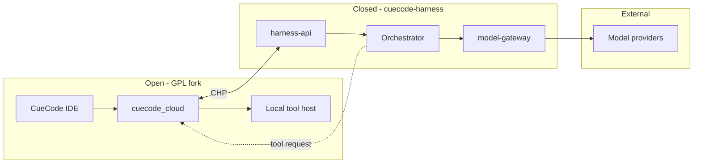
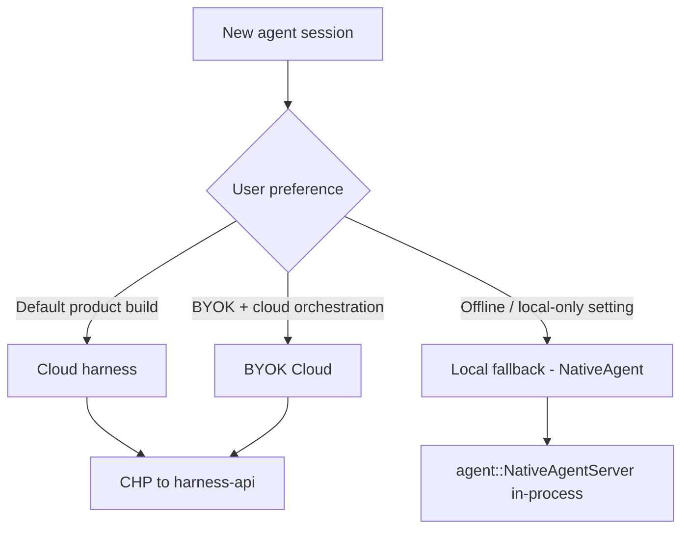

# Cloud harness overview — Model B {#cloud-harness-overview}

> **Branch:** [harness/cloud/](./01-overview.md) — proprietary cloud orchestration (production default).  
> **Open client:** [04-open-client.md](./04-open-client.md) — GPL `cuecode_cloud` crate in the public fork.  
> **Local fallback:** [harness/local/01-agent-harness.md](../local/01-agent-harness.md) — in-process NativeAgent semantics.

CueCode ships as **Model B**: an **open GPL desktop IDE** (this fork) connected to a **closed,
server-deployed agent harness** that owns orchestration, scheduling, and model routing. The IDE
remains the sandbox host — tools execute locally, permissions render in GPUI, specs and
checkpoints stay on disk — but the **agent brain** runs in CueCode Cloud unless the user
explicitly selects local fallback.

Related: [01-vision](../core/01-vision.md), [06-system-design](../core/06-system-design.md#agent-backends),
[10-infrastructure](../ops/10-infrastructure.md#models), [13-ai-maxxing](../agent/13-ai-maxxing.md#vs-cursor),
[local harness semantics](../local/01-agent-harness.md#three-contexts)

Agent skill: `.cursor/skills/cuecode-ai-maxxing/SKILL.md`

---

## Summary {#summary}

| Layer | License | Repo | Owns |
|-------|---------|------|------|
| **CueCode IDE** | GPL-3.0-or-later | Public fork (`CueCode-Agents`) | GPUI, editor, local tools, sandbox OS, spec index UI |
| **Cloud harness** | Proprietary (server) | Private `cuecode-harness` | Turn loop, lane scheduler, compaction, model gateway, proprietary orchestration |
| **Open wire client** | GPL-3.0-or-later | Public fork (`cuecode_cloud`) | CHP transport, auth, streaming bridge, reconnect — **no prompts** |



**Harness semantics** (Active / Async / Hybrid, notification payloads, lane roles) are defined
once in [local harness spec](../local/01-agent-harness.md) and **mirrored** by cloud
orchestration over CHP. Cloud does not redefine product behavior — it implements the same
semantics remotely.

---

## Model B thesis {#model-b-thesis}

### Why split open IDE and closed harness? {#why-split}

| Force | Open IDE only (Model A) | Model B (this spec) |
|-------|-------------------------|---------------------|
| **Moat** | Orchestration prompts + scheduler leak in GPL source | Proprietary loop stays server-side |
| **Velocity** | Ship harness changes with desktop release cadence | Deploy harness daily without IDE bump |
| **Cost control** | User BYOK only; no CueCode margin | Managed models + routing + caching |
| **Community** | Full fork is self-hostable competitor | Fork is client + local fallback; cloud is optional upgrade |
| **Trust** | Users inspect all prompts | Users inspect **behavior** via specs + permissions, not prompt bodies |

Model B preserves CueCode's **local-first** promise: the IDE works offline via
[NativeAgent fallback](#runtime-modes). Cloud is the **default for signed-in product builds**,
not a hard dependency for opening the editor.

### Product decision rationale {#product-rationale}

1. **Session-first sandbox stays in the IDE.** Diffs, checkpoints, OS sandbox, unified review,
   and `.cursor/specs/` integration remain GPL and on-device. Cloud never receives full repo
   contents unless the user enables sync features (future, opt-in).

2. **Orchestration is the paid surface.** Multi-lane scheduling, compaction policy, model
   routing, verification gates, and coordinator synthesis are expensive to operate and hard to
   replicate — appropriate for a managed service.

3. **CHP is the contract.** The public fork implements an open client ([04-open-client.md](./04-open-client.md))
   speaking [CHP](./03-protocol.md). Third parties could build alternate harness servers; CueCode
   operates the reference closed server.

4. **Local fallback is first-class, not a demo.** NativeAgent must pass the same harness
   acceptance scenarios as cloud ([local §acceptance](../local/01-agent-harness.md)). Users who
   refuse cloud still get SDAL, intent profiles, and tools.

5. **No zed.dev coupling.** CueCode Cloud is a distinct service with distinct auth. See
   [03-fork-and-rebrand §decouple-cloud](../core/03-fork-and-rebrand.md).

---

## Moat boundary {#moat-boundary}

What stays **open** (GPL fork) vs **closed** (private `cuecode-harness`):

| Capability | Open (fork) | Closed (cloud) | Rationale |
|------------|-------------|----------------|-----------|
| GPUI agent panel, composer, review | ✓ | — | Native UX moat is shipping speed + integration |
| Intent profiles, trust graph UI | ✓ | — | User-visible policy; must be inspectable |
| Local tool execution (read/write/terminal) | ✓ | — | Tools run on user's machine |
| OS sandbox (Seatbelt/Bubblewrap) | ✓ | — | Safety cannot depend on network |
| Spec index, `@spec`, plan UI | ✓ | — | Specs-first is product identity |
| Checkpoint / action_log / rewind | ✓ | — | Replayable sessions are GPL promise |
| `cuecode_cloud` CHP client | ✓ | — | Interop + auditability of wire format |
| NativeAgent in-process loop | ✓ | — | Offline / air-gap fallback |
| Turn scheduler + lane arbitration | — | ✓ | Core orchestration IP |
| System prompt assembly + compaction | — | ✓ | Context strategy is moat |
| Builtin agent definitions (explore/plan/implement/verify) | — | ✓ | Behavior encoded server-side |
| Model gateway (keys, routing, fallbacks) | — | ✓ | Operational + margin |
| Managed model billing | — | ✓ | Optional; BYOK cloud uses gateway only |
| Session-side artifact store (future) | — | ✓ | Cross-device resume (opt-in) |
| Harness analytics / quality loops | — | ✓ | Aggregate tuning without exposing prompts |

**Explicit non-goals for the closed boundary:**

- Cloud does **not** replace local permission UI — every `tool.request` is approved in GPUI.
- Cloud does **not** silently exfiltrate repo files — tool results are explicit, user-visible.
- Proprietary prompt bodies are **never** shipped in the GPL fork or cited in open specs.

---

## Runtime modes {#runtime-modes}

Three agent runtime modes. Exactly one is active per session at creation time; switching mid-session
requires explicit user action (new session or "Move to local" — future).



### Cloud (default) {#mode-cloud}

| Field | Value |
|-------|-------|
| **Agent backend** | `cuecode_cloud::CloudAgentServer` |
| **Auth** | CueCode account token (OAuth / device flow) |
| **Models** | CueCode-managed keys via `model-gateway` |
| **Billing** | CueCode subscription or usage credits (product TBD) |
| **When** | Signed-in CueCode product builds; online |

User experience matches cloud SaaS agents: fast first prompt, no API key setup, lanes and async
notifications work out of the box. Tool execution remains local.

### BYOK Cloud {#mode-byok-cloud}

| Field | Value |
|-------|-------|
| **Agent backend** | Same `CloudAgentServer` |
| **Auth** | CueCode account **or** harness API token (self-host) |
| **Models** | User API keys sent to `model-gateway`; gateway calls provider |
| **Billing** | User pays provider directly; optional harness hosting fee |
| **When** | Power users, teams with existing OpenAI/Anthropic contracts |

BYOK Cloud still uses **closed orchestration** — keys never enter the IDE process for the agent
loop (keys live in gateway vault). Differs from local fallback where `language_models` reads
keychain directly.

### Local fallback (NativeAgent) {#mode-local-fallback}

| Field | Value |
|-------|-------|
| **Agent backend** | `agent::NativeAgentServer` (in-process) |
| **Auth** | None required |
| **Models** | Ollama / LM Studio / BYOK via `language_models` |
| **Billing** | None |
| **When** | Offline, air-gap, GPL self-build, user setting `agent.runtime = local` |

Implements harness semantics from [local spec](../local/01-agent-harness.md). Feature parity
target: all **user-visible** harness behaviors; acceptable gaps documented in
[12-open-questions](../ops/12-open-questions.md).

### Mode comparison {#mode-comparison}

| Dimension | Cloud | BYOK Cloud | Local fallback |
|-----------|-------|------------|----------------|
| Network required | Yes | Yes | No (after model local) |
| Orchestration location | Server | Server | In-process |
| API keys in IDE | No | No | Yes (keychain) |
| Lane scheduler | Server | Server | `cuecode_sandbox` (planned) |
| Compaction policy | Server | Server | `agent::Thread` |
| Resume across devices | Yes (session_id) | Yes | No |
| GPL self-host harness | N/A | Possible via CHP | N/A |

---

## Licensing {#licensing}

### Desktop (public fork) {#license-desktop}

- **License:** GPL-3.0-or-later (inherits Zed fork obligations).
- **Contains:** IDE, `cuecode_cloud`, NativeAgent, local tools, spec crates.
- **Must not contain:** Proprietary prompt templates, server orchestration source, managed API secrets.

### Cloud harness (private repo) {#license-cloud}

- **Repo:** `cuecode-harness` (private, server-deployed).
- **License:** Proprietary — not distributed with desktop binaries.
- **Deployment:** Containerized services (`harness-api`, `model-gateway`, workers).
- **Interface to world:** CHP over TLS + REST health; no GPL contagion on server if client is separate work.

### Contributor boundary {#license-contributor}

Contributors to the public fork must not paste proprietary prompt text or closed-server logic into
GPL crates. PRs that add cloud **client** code belong in `cuecode_cloud`; PRs that change harness
**behavior** require parallel update to local fallback semantics doc + closed repo (internal).

---

## Repository split {#repo-split}

```
┌─────────────────────────────────────────────────────────────────────────┐
│ PUBLIC: CueCode-Agents (GPL fork)                                       │
├─────────────────────────────────────────────────────────────────────────┤
│ crates/cuecode_cloud/     CHP client, CloudAgentServer                    │
│ crates/agent_ui/          Panel, composer, permissions (unchanged)      │
│ crates/agent/             NativeAgentServer — local fallback            │
│ crates/acp_thread/        AgentConnection trait, AcpThread               │
│ .cursor/specs/harness/    Open specs (this tree)                        │
└─────────────────────────────────────────────────────────────────────────┘
                                    │
                                    │ CHP (TLS)
                                    ▼
┌─────────────────────────────────────────────────────────────────────────┐
│ PRIVATE: cuecode-harness                                                │
├─────────────────────────────────────────────────────────────────────────┤
│ services/harness-api/     Session, turn, tool round-trip, CHP WS        │
│ services/model-gateway/   Provider adapters, key vault, routing           │
│ services/artifact-store/  (future) Session blobs, cross-device          │
│ orchestrator/             Scheduler, lanes, compaction, builtin agents    │
│ deploy/                   K8s / Fly / internal Terraform                │
└─────────────────────────────────────────────────────────────────────────┘
```

| Artifact | Build | Ship channel |
|----------|-------|--------------|
| CueCode.app / .deb | Public CI | GitHub releases, website |
| harness-api image | Private CI | CueCode Cloud production |
| model-gateway image | Private CI | Internal only |
| CHP schema | Public spec [03-protocol.md](./03-protocol.md) | Versioned in spec, not code |

---

## Relationship to local harness spec {#local-semantics}

Cloud harness **does not redefine** Active / Async / Hybrid. It implements:

| Local concept | Cloud implementation |
|---------------|---------------------|
| [ExecutionContext](../local/01-agent-harness.md#rust-types) | `spawn.lane` + `notification` messages |
| [Notification rail](../local/01-agent-harness.md#notification-rail-ui) | `notification` CHP events → `agent_ui` |
| [Task pills](../local/01-agent-harness.md#task-pills) | Lane status in `turn.stream` meta |
| [Permission modal](../local/01-agent-harness.md#composer-states) | `permission.request` / `permission.response` |
| [Builtin agents](../local/01-agent-harness.md#rust-map) | Server-side; client sees tool + notify surface only |
| [spawn_agent](../local/01-agent-harness.md#data-flow) | `spawn.lane` with `session_id` + `execution_context` |

When cloud and local behavior diverge, **local spec is normative for UX**; cloud must converge or
the gap is logged in [12-open-questions](../ops/12-open-questions.md).

---

## User journeys {#user-journeys}

### Journey 1: First launch (Cloud default) {#journey-first-launch}

1. User installs CueCode product build; opens project.
2. Composer shows "CueCode Cloud" as agent backend (no API key prompt).
3. Device auth completes; `session.start` over CHP.
4. User selects **Fix** intent; sends prompt.
5. Cloud streams assistant + tool calls; IDE runs tools locally; user approves writes.
6. Async verify lane completes → notification rail → unified review.

### Journey 2: Air-gap developer {#journey-airgap}

1. User sets `agent.runtime = local` in settings.
2. Agent backend switches to NativeAgent; Ollama default model.
3. Same intent switcher and review UI; no account required.
4. Harness semantics per [local spec](../local/01-agent-harness.md#three-contexts).

### Journey 3: Team BYOK {#journey-byok}

1. Admin deploys private `harness-api` or uses CueCode BYOK tier.
2. Users paste org API key into CueCode settings (stored in gateway vault).
3. Orchestration matches cloud default; billing goes to org provider contract.

---

## Migration from in-process default {#migration}

Current fork state: NativeAgent is primary ([06-system-design §agent-backends](../core/06-system-design.md#agent-backends)).

| Phase | Desktop default | Fallback |
|-------|-----------------|----------|
| **Now** | NativeAgent | — |
| **Alpha cloud** | NativeAgent | Opt-in Cloud in settings |
| **Beta** | Cloud | Local fallback in settings |
| **GA product** | Cloud | Local fallback + offline banner |

Feature flag: `cuecode_cloud_enabled` in product builds only; OSS self-builds default to NativeAgent.

---

## Open questions (cloud-specific) {#open-questions}

| ID | Question | Default assumption |
|----|----------|------------------|
| CQ1 | Self-host harness GA or enterprise-only? | Enterprise first |
| CQ2 | Cross-device session sync scope | Metadata + transcript hash only; no full repo upload |
| CQ3 | Cloud required for multi-lane in GA? | No — local scheduler catches up |
| CQ4 | Account vs API token for BYOK Cloud | Both supported |

Formal tracking: add rows to [12-open-questions](../ops/12-open-questions.md) when implementing.

---

## Acceptance criteria {#acceptance-criteria}

### AC-O1: Default product build uses cloud {#ac-o1}

**Given** a CueCode product build with network connectivity and no `agent.runtime` override  
**When** the user creates a new agent session  
**Then** the active backend is `CloudAgentServer`, auth completes, and the first prompt streams via CHP without requiring an API key

### AC-O2: Local fallback without account {#ac-o2}

**Given** `agent.runtime = local` or an OSS self-build  
**When** the user creates a new agent session offline  
**Then** NativeAgent handles the session with no cloud auth prompt and tools execute locally

### AC-O3: Moat boundary in GPL tree {#ac-o3}

**Given** the public fork source tree  
**When** audited for proprietary orchestration  
**Then** no prompt templates, scheduler logic, or model-gateway secrets exist outside `cuecode_cloud` transport code

### AC-O4: Semantic parity with local harness {#ac-o4}

**Given** a cloud session with Async verify lane  
**When** verification completes  
**Then** the user receives a structured notification matching [local §notification-rail](../local/01-agent-harness.md#notification-rail-ui) (kind, actions, no prose-only completion)

### AC-O5: Permission always local {#ac-o5}

**Given** a cloud turn that requests `write_file`  
**When** the harness sends `tool.request`  
**Then** GPUI shows a permission modal before execution; denial returns `tool.result` with `denied: true` to the server

### AC-O6: BYOK keys not in IDE memory {#ac-o6}

**Given** BYOK Cloud mode with OpenAI key configured  
**When** the user sends a prompt  
**Then** the IDE never loads the provider key into `language_models`; only `model-gateway` holds credentials

---

## Document status {#document-status}

| Field | Value |
|-------|-------|
| Status | Draft |
| Model | B — open IDE + closed cloud harness |
| Next | [02-architecture.md](./02-architecture.md), [03-protocol.md](./03-protocol.md), [04-open-client.md](./04-open-client.md) |
| Local semantics | [../local/01-agent-harness.md](../local/01-agent-harness.md) |
