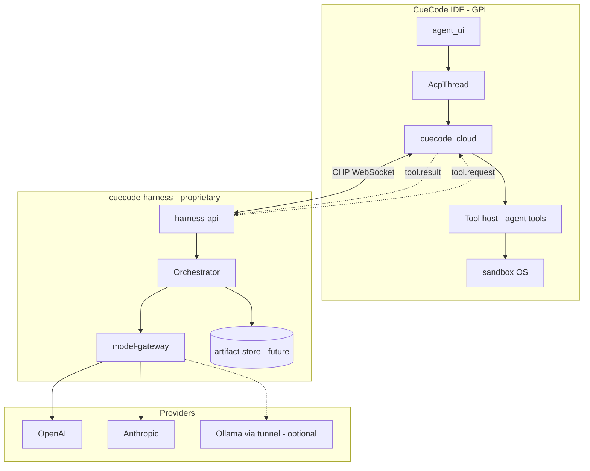
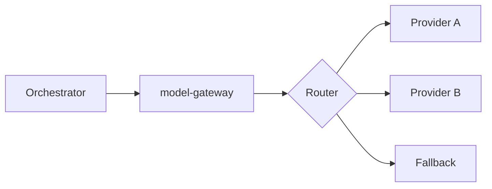
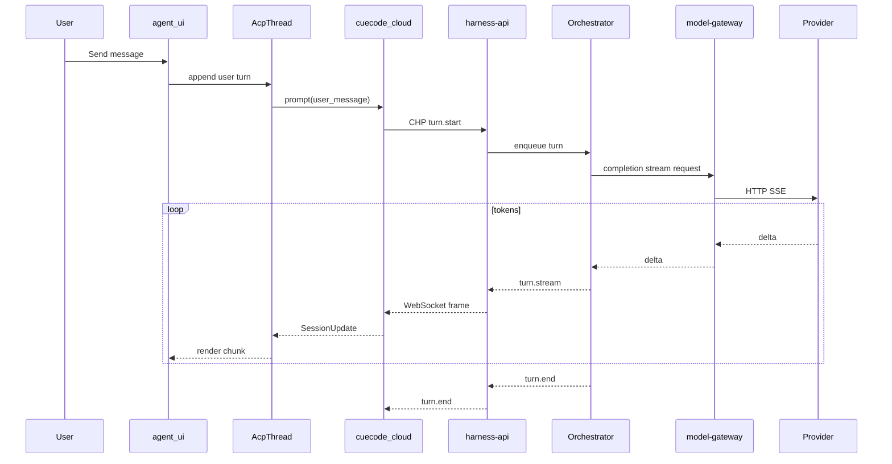
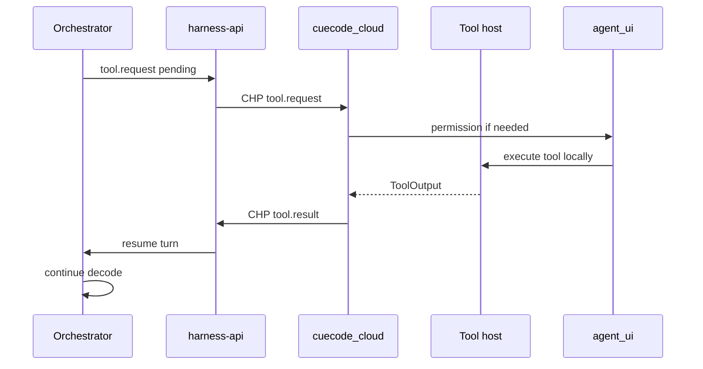
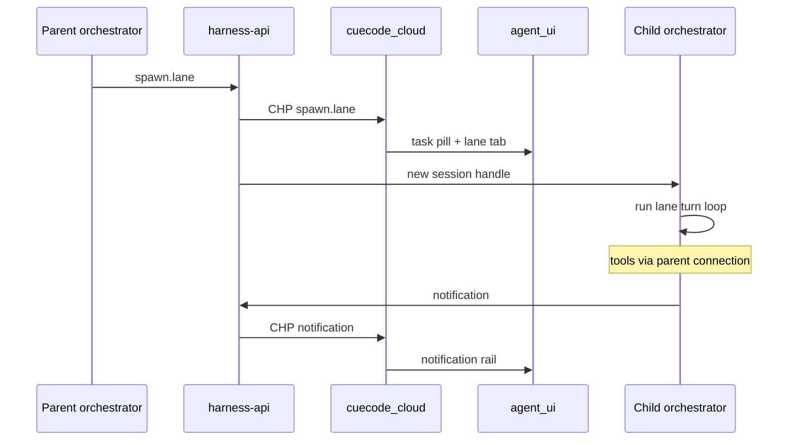
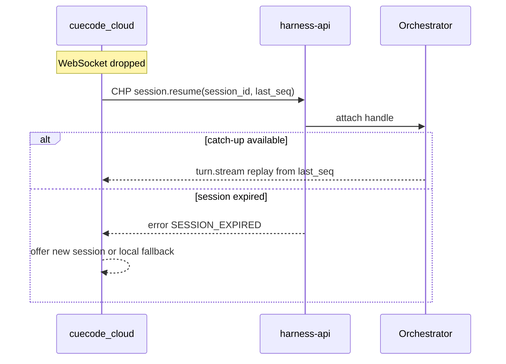
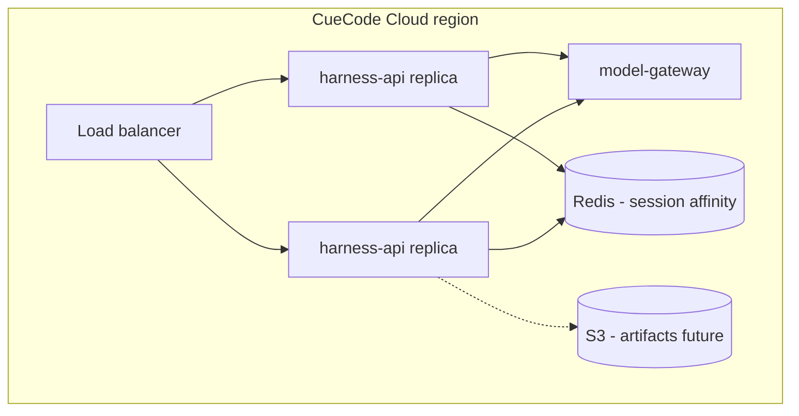

# CueHarness architecture {#cloud-architecture}

> **CueCloud umbrella:** CueHarness is the cloud agent-runtime half of CueCloud. Index: [README](./README.md).
> **Branch:** [harness/cloud/](./01-overview.md) — server-side orchestration for CueHarness (Model B).  
> **Protocol:** [03-protocol.md](./03-protocol.md) — CHP wire format.  
> **Client:** [04-open-client.md](./04-open-client.md) — GPL `cuecode_cloud` crate.

Architecture for CueCode Cloud: how the **GPL IDE**, **CHP client**, **harness-api**,
**model-gateway**, and **external model providers** compose. Tool execution and permissions
remain on the desktop; the closed harness owns the agent turn loop.

Related: [06-system-design §overview](../core/06-system-design.md#overview),
[10-infrastructure §infra-overview](../ops/10-infrastructure.md#infra-overview),
[local harness §data-flow](../local/01-agent-harness.md#data-flow)

---

## Summary {#summary}



| Service | Responsibility | Stateful? |
|---------|----------------|-----------|
| `harness-api` | CHP termination, session CRUD, auth, rate limits | Session affinity |
| Orchestrator (in-api v1) | Turn loop, lanes, compaction, builtin routing | Per-session memory |
| `model-gateway` | Provider HTTP, key vault, model routing, retries | Key cache |
| `artifact-store` (future) | Sidechains, spills, cross-device blobs | Object storage |

---

## Layer stack {#layer-stack}

```
┌─────────────────────────────────────────────────────────────────────────┐
│ L5  Product UX — agent_ui, notification rail, unified review (GPL)    │
├─────────────────────────────────────────────────────────────────────────┤
│ L4  Session entity — AcpThread, plan, action_log (GPL)                │
├─────────────────────────────────────────────────────────────────────────┤
│ L3  Agent wire — cuecode_cloud CloudAgentConnection (GPL)             │
├─────────────────────────────────────────────────────────────────────────┤
│ L2  CHP — WebSocket / SSE, JSON envelopes (spec in 03-protocol)       │
╞═════════════════════════════════════════════════════════════════════════╡
│                      TLS boundary — internet                            │
╞═════════════════════════════════════════════════════════════════════════╡
│ L1  harness-api — session, turn, tool round-trip (closed)             │
├─────────────────────────────────────────────────────────────────────────┤
│ L0  Orchestrator + model-gateway + artifact-store (closed)            │
└─────────────────────────────────────────────────────────────────────────┘
```

Compare to **local in-process** stack ([local §data-flow](../local/01-agent-harness.md#data-flow)):

```
Local (no network for agent loop):
  agent_ui → AcpThread → agent::Thread → language_models → provider
                              ↓
                         local tools + sandbox

Cloud (CHP boundary replaces agent::Thread):
  agent_ui → AcpThread → cuecode_cloud → CHP → harness-api → orchestrator
                              ↓                                    ↓
                         local tools + sandbox              model-gateway → provider
```

**Key invariant:** Everything below `AcpThread` that touches the filesystem, terminal, or
GPUI permissions stays in the IDE. Everything above CHP that touches prompts, scheduling, or
provider keys stays in the cloud.

---

## Services {#services}

### harness-api {#harness-api}

Public-facing edge service for desktop clients.

| Concern | Implementation notes |
|---------|---------------------|
| Transport | WebSocket primary; SSE fallback ([03-protocol §transport](./03-protocol.md#transport)) |
| Auth | Bearer token (CueCode account) or harness API key (BYOK/self-host) |
| Session store | `session_id` → orchestrator handle; TTL + explicit `session.end` |
| Rate limiting | Per-account turn budget; 429 → CHP error code |
| Health | `GET /health`, `GET /v1/chp/capabilities` |
| Observability | Request id propagation; no raw prompt logging in v1 |

**Does not:** Call providers directly (delegates to `model-gateway`). Does not execute tools.

### Orchestrator {#orchestrator}

Embedded in `harness-api` for v1; may split to worker pool later.

| Concern | Implementation notes |
|---------|---------------------|
| Turn loop | Receive user message → assemble context → call gateway → parse tool calls |
| Lanes | `spawn.lane` creates child session handles; parent notified via CHP |
| Compaction | Server-side when context budget exceeded; preserves spec links + plan summary |
| Builtin agents | explore / plan / implement / verification — selected by intent + spawn meta |
| Async jobs | Background lanes complete → `notification` event to parent connection |

**Does not:** Run `cargo test`, read local files, or show permission UI.

### model-gateway {#model-gateway}

Internal service; not exposed to desktop except via orchestrator.

| Concern | Implementation notes |
|---------|---------------------|
| Provider adapters | OpenAI, Anthropic, Google, OpenRouter, Bedrock (parity with fork adapters) |
| Key modes | Managed (CueCode keys) vs BYOK (per-tenant vault) |
| Routing | Model id → provider; fallback chain on 5xx / rate limit |
| Streaming | Server-sent chunks to orchestrator; orchestrator maps to CHP `turn.stream` |
| Cost | Token accounting per session; emitted in `turn.stream` meta (optional UI) |



### artifact-store (future) {#artifact-store}

Deferred service for cross-device and large payloads.

| Artifact type | Storage | Client access |
|---------------|---------|---------------|
| Sidechain JSONL | Object store keyed by `session_id` | Pull on `load_session` |
| Tool spill refs | Pointer in CHP; blob in store | IDE may prefer local spill |
| Checkpoint snapshots | Encrypted blob; opt-in | Restore on new device |

v1: artifacts remain **local** under `~/.config/cuecode/sessions/`; cloud stores transcript
metadata only. See [01-overview §open-questions](./01-overview.md#open-questions) CQ2.

---

## Data flows {#data-flows}

### Flow 1: User prompt → streamed response {#flow-prompt}



### Flow 2: Tool round-trip {#flow-tool}



Tool host reuses existing `agent` tool registry and `cuecode_sandbox` policy checks — cloud
sends **tool name + JSON args** only; IDE validates against intent allowlist before execution.

### Flow 3: Spawn async lane {#flow-spawn-lane}



Child lanes share the **same CHP WebSocket** in v1 (multiplexed by `lane_id`); future: dedicated
connection per lane for isolation.

### Flow 4: Reconnect / resume {#flow-reconnect}



Details: [03-protocol §reconnect](./03-protocol.md#reconnect-resume).

---

## Comparison: cloud vs local in-process {#comparison-local}

| Aspect | Local NativeAgent | Cloud harness |
|--------|-------------------|---------------|
| **Process boundary** | Same process as IDE | Separate server |
| **Latency** | Lowest (no RTT) | +1 RTT per tool round; streaming masks token latency |
| **Context assembly** | `agent::Thread` + templates in fork | Orchestrator (closed) |
| **Model keys** | Keychain → `language_models` | Vault → `model-gateway` |
| **Compaction** | `agent` auto-compact | Server policy |
| **Lane scheduler** | `cuecode_sandbox` (planned) | Orchestrator |
| **Offline** | Full | Requires reconnect or fallback |
| **Upgrade cadence** | Desktop release | Server deploy independent |
| **Debuggability** | Rust logs local | CHP trace id + client debug pane |
| **GPL surface** | Entire loop visible | Loop closed; CHP + client visible |

### When local wins {#when-local}

- Air-gap, classified environments, GPL purity requirements
- Sub-50ms tool feedback loops (tight pair-programming)
- Custom prompt hacking (researchers, contributors)

### When cloud wins {#when-cloud}

- Managed models without key setup
- Heavy multi-lane orchestration without shipping scheduler in GPL
- Rapid harness improvements without desktop update
- Cross-device session resume (with artifact-store)

---

## Deployment topology {#deployment}



| Environment | URL pattern | Notes |
|-------------|-------------|-------|
| Production | `wss://harness.cuecode.dev/v1/chp` | Product builds hardcode default |
| Staging | `wss://harness.staging.cuecode.dev/v1/chp` | Beta channel |
| Self-host | Customer-provided base URL | Settings override |
| Local dev | `ws://localhost:8787/v1/chp` | Private repo docker-compose |

Desktop discovers endpoints via:

1. Build-time default in `cuecode_cloud`
2. User override in `~/.config/cuecode/settings.json` → `cloud.harness_url`
3. Capability handshake on connect ([03-protocol §capabilities](./03-protocol.md#capabilities-handshake))

---

## Security architecture {#security}

| Threat | Mitigation |
|--------|------------|
| Token theft | Short-lived access token; refresh via OS keychain |
| MITM | TLS 1.3; certificate pinning in product builds (optional) |
| Malicious harness | Client validates tool allowlist locally; server cannot bypass OS sandbox |
| Prompt injection to exfil | Tools run locally; network policy from intent profile |
| Session hijack | `session_id` + auth binding; rotate on reconnect |
| Provider key leak | Keys only in gateway vault; never in CHP payloads |

**Trust model:** User trusts CueCode Cloud for **orchestration quality**, not for **filesystem
access**. The IDE is the security boundary for code execution.

---

## Failure modes {#failure-modes}

| Failure | Client behavior | Server behavior |
|---------|-----------------|-----------------|
| WebSocket drop mid-turn | Auto reconnect + resume ([03 §reconnect](./03-protocol.md#reconnect-resume)) | Buffer events ≤60s or end turn |
| harness-api 503 | Exponential backoff; toast "Cloud unavailable" | Health fail LB |
| model-gateway 429 | CHP `RATE_LIMITED`; UI suggests wait or local fallback | Queue or shed load |
| Tool timeout | `tool.result` error to server; lane may retry | Orchestrator marks partial |
| Auth expired | Re-auth flow; preserve `session_id` if possible | 401 on CHP |
| User denies permission | `denied: true`; model continues with denial context | Logged, not retried blindly |

User-facing copy deck: extend [10-infrastructure §error-toast](../ops/10-infrastructure.md#error-toast-copy-deck).

---

## Rust / crate map (client side) {#rust-map}

Cloud architecture **touches these GPL crates** only:

| Crate | Role |
|-------|------|
| `cuecode_cloud` | CHP client, `CloudAgentServer`, `CloudAgentConnection` |
| `acp_thread` | `AgentConnection` trait, `AcpThread` session entity |
| `agent_ui` | Renders stream; unchanged contract |
| `agent` | Tool host execution path (invoked by cloud client) |
| `cuecode_sandbox` | Intent policy enforcement on tool requests |
| `agent_servers` | Registers `CloudAgentServer` alongside NativeAgent |

Closed repo has **no GPUI dependency**.

---

## Evolution path {#evolution}

| Version | Change |
|---------|--------|
| v1 | Monolithic orchestrator in `harness-api`; local artifacts only |
| v1.1 | Dedicated lane worker pool |
| v2 | `artifact-store` GA; cross-device `load_session` |
| v2.1 | Optional E2E encrypted transcript (enterprise) |

---

## Acceptance criteria {#acceptance-criteria}

### AC-A1: Tool execution stays local {#ac-a1}

**Given** a cloud session with an pending `write_file` tool.request  
**When** the harness sends the request over CHP  
**Then** the file is written only by the IDE tool host after local permission approval; harness-api never receives file contents unless explicitly included in tool.result

### AC-A2: Model gateway isolation {#ac-a2}

**Given** a managed-model cloud session  
**When** orchestrator requests completion  
**Then** all provider HTTP exits through `model-gateway`; harness-api logs contain no provider API keys

### AC-A3: Streaming end-to-end {#ac-a3}

**Given** a user prompt in cloud mode  
**When** the provider streams tokens  
**Then** the user sees incremental UI updates within 200ms of server receive under nominal network (P95 staging)

### AC-A4: Reconnect mid-turn {#ac-a4}

**Given** an active turn and a WebSocket disconnect lasting &lt;30s  
**When** the client sends `session.resume` with correct `last_seq`  
**Then** the user sees no duplicate assistant messages and the turn completes or cancels cleanly

### AC-A5: Local fallback on hard failure {#ac-a5}

**Given** harness-api unreachable for 3 retry attempts  
**When** the user chooses "Continue locally"  
**Then** the session migrates to NativeAgent with preserved transcript in AcpThread (best-effort) and local tools enabled

### AC-A6: Semantic equivalence {#ac-a6}

**Given** the same intent profile and user prompt  
**When** run once via cloud and once via local fallback  
**Then** tool allowlist denials match; permission prompts appear for the same tool classes (model text may differ)

---

## Document status {#document-status}

| Field | Value |
|-------|-------|
| Status | Draft |
| Depends on | [01-overview](./01-overview.md), [03-protocol](./03-protocol.md) |
| Closed repo | `cuecode-harness` (private) |
