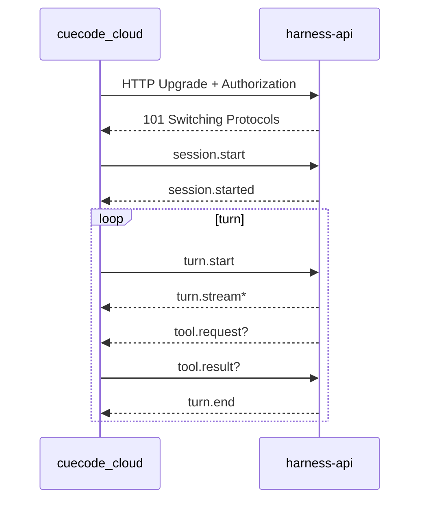
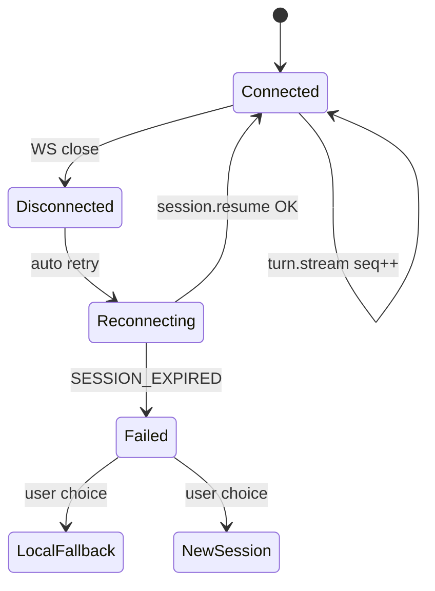

# CueHarness Protocol (CHP) {#chp-protocol}

> **CueCloud umbrella:** CHP is the wire contract between the GPL client and CueHarness (the cloud agent-runtime half of CueCloud). Index: [README](./README.md).
> **Branch:** [harness/cloud/](./01-overview.md) — wire contract between GPL client and CueHarness.  
> **Alignment:** ACP-shaped where possible; CueCode extensions namespaced in `chp.*` meta.  
> **Client:** [04-open-client.md](./04-open-client.md) — reference implementation in `cuecode_cloud`.

**CHP** (CueCode Harness Protocol) is the JSON message protocol over WebSocket (primary) or
SSE (fallback) connecting `cuecode_cloud` to `harness-api`. It carries session lifecycle,
streaming turns, tool round-trips, permissions, lane spawns, and notifications.

Related: [02-architecture §data-flows](./02-architecture.md#data-flows),
[08-agent-tools-and-skills](../agent/08-agent-tools-and-skills.md),
[local harness §notification payloads](../local/01-agent-harness.md),
[acp_thread connection.rs](../../../../crates/acp_thread/src/connection.rs) (client trait mapping)

**Non-goal:** This spec does not document proprietary prompt bodies or orchestrator internals.

---

## Design principles {#design-principles}

| Principle | Meaning |
|-----------|---------|
| **ACP-aligned** | Reuse ACP type names (`SessionId`, tool shapes) where behavior matches |
| **Client executes tools** | Server emits `tool.request`; client returns `tool.result` |
| **Multiplexed streams** | One connection per session; lanes identified by `lane_id` |
| **Explicit versioning** | Every envelope carries `chp_version` |
| **Resumable** | `session_id` + monotonic `seq` enable reconnect |
| **No silent binary** | JSON UTF-8 only in v1; attachments via URL refs (future) |

---

## Transport {#transport}

### WebSocket (primary) {#transport-websocket}

| Field | Value |
|-------|-------|
| URL | `{base}/v1/chp/connect` |
| Subprotocol | `cuecode-harness.chp.v1` |
| Direction | Bidirectional JSON text frames |
| Heartbeat | Client `ping` every 30s; server `pong` or CHP `keepalive` |
| Max frame | 256 KiB (tool results may use spill ref) |



### SSE fallback {#transport-sse}

When WebSocket is blocked (corporate proxy, some Linux configs):

| Field | Value |
|-------|-------|
| Downlink | `GET {base}/v1/chp/sessions/{session_id}/events` (SSE) |
| Uplink | `POST {base}/v1/chp/sessions/{session_id}/commands` |
| Limitation | Higher latency on tool round-trip; same JSON schema |

Client tries WebSocket first; caches fallback per host in settings.

---

## Envelope {#envelope}

Every message is a JSON object:

```json
{
  "chp_version": "1.0",
  "type": "turn.stream",
  "session_id": "sess_01HXYZ...",
  "seq": 42,
  "request_id": "req_abc123",
  "lane_id": null,
  "timestamp": "2026-06-17T12:00:00Z",
  "payload": { }
}
```

| Field | Required | Description |
|-------|----------|-------------|
| `chp_version` | yes | Protocol version string; see [§Versioning](#versioning) |
| `type` | yes | Message type discriminator |
| `session_id` | usually | Omitted only on `session.start` |
| `seq` | server→client | Monotonic per session for resume |
| `request_id` | optional | Correlate request/response; client-generated on uplink |
| `lane_id` | optional | `null` = parent session |
| `timestamp` | optional | RFC 3339 |
| `payload` | yes | Type-specific body |

---

## Versioning {#versioning}

| `chp_version` | Status | Notes |
|---------------|--------|-------|
| `1.0` | Draft | Initial CHP |
| `1.x` | — | Backward-compatible additions only |
| `2.0` | — | Breaking changes require new subprotocol |

**Handshake:**

1. Client sends highest supported version in `session.start`.
2. Server responds with negotiated `chp_version` in `session.started`.
3. If no overlap → `error` code `VERSION_MISMATCH`.

Client must reject unknown **required** payload fields in patch versions (forward-compatible ignore for optional fields).

---

## Capabilities handshake {#capabilities-handshake}

`session.started` payload includes server capabilities:

```json
{
  "negotiated_version": "1.0",
  "capabilities": {
    "transports": ["websocket", "sse"],
    "supports_resume": true,
    "supports_load_session": true,
    "supports_spawn_lane": true,
    "supports_permission_request": true,
    "max_tool_result_bytes": 262144,
    "models": ["claude-sonnet-4", "gpt-4.1"]
  },
  "session_id": "sess_01HXYZ...",
  "auth": { "tier": "managed", "account_id": "acc_..." }
}
```

Maps to `AgentConnection` capability flags in [04-open-client](./04-open-client.md#agent-connection-mapping).

---

## Message types {#message-types}

### Overview table {#message-table}

| type | Direction | Purpose |
|------|-----------|---------|
| `session.start` | C→S | Create session |
| `session.started` | S→C | Session ready + capabilities |
| `session.resume` | C→S | Reconnect after drop |
| `session.resumed` | S→C | Catch-up complete |
| `session.end` | either | Tear down |
| `turn.start` | C→S | User message / continue |
| `turn.stream` | S→C | Streaming assistant + meta |
| `turn.end` | S→C | Turn complete |
| `turn.cancel` | C→S | User interrupt |
| `tool.request` | S→C | Execute tool locally |
| `tool.result` | C→S | Tool output or error |
| `permission.request` | S→C | Pre-tool approval UI |
| `permission.response` | C→S | User decision |
| `spawn.lane` | S→C | New lane notification + meta |
| `notification` | S→C | Async completion / away summary |
| `error` | either | Fatal or recoverable |
| `keepalive` | either | Heartbeat |

---

### session.start {#msg-session-start}

Client → server. Creates orchestrator handle.

```json
{
  "chp_version": "1.0",
  "type": "session.start",
  "request_id": "req_start_1",
  "payload": {
    "work_dirs": ["/Users/dev/myproject"],
    "project_id": "proj_hash_abc",
    "intent": "fix",
    "runtime_mode": "cloud",
    "model_id": "claude-sonnet-4",
    "client": {
      "app": "cuecode",
      "app_version": "0.1.0",
      "platform": "macos",
      "cuecode_cloud_version": "0.1.0"
    },
    "resume_session_id": null,
    "meta": {
      "spec_links": [".cursor/specs/core/04-sandbox-core.md#intent-profiles"]
    }
  }
}
```

| Field | Notes |
|-------|-------|
| `intent` | Maps to intent profile ([04-sandbox-core](../core/04-sandbox-core.md#intent-profiles)) |
| `runtime_mode` | `cloud` \| `byok_cloud` |
| `resume_session_id` | If set, server attempts attach instead of fresh session |

---

### session.started / session.resumed {#msg-session-started}

Server → client. See [capabilities handshake](#capabilities-handshake).

`session.resumed` additional field:

```json
{
  "payload": {
    "last_seq": 41,
    "replay_from": 38,
    "missed_messages": []
  }
}
```

---

### turn.start {#msg-turn-start}

Client → server. User turn (maps to ACP `PromptRequest` subset).

```json
{
  "type": "turn.start",
  "session_id": "sess_01HXYZ...",
  "request_id": "req_turn_9",
  "payload": {
    "user_message_id": "umsg_uuid",
    "content": [
      { "type": "text", "text": "Fix the auth bug in crates/auth" }
    ],
    "context": {
      "open_buffers": ["crates/auth/src/lib.rs"],
      "diagnostics_summary": "3 errors in auth crate"
    }
  }
}
```

Server must not require full repo snapshot in v1 — context is hint-only; tools fetch truth.

---

### turn.stream {#msg-turn-stream}

Server → client. Streaming events (ACP `SessionUpdate`-like).

```json
{
  "type": "turn.stream",
  "session_id": "sess_01HXYZ...",
  "seq": 43,
  "payload": {
    "user_message_id": "umsg_uuid",
    "update": {
      "type": "assistant_message_chunk",
      "text": "I'll inspect the auth module"
    }
  }
}
```

**Update types** (payload.update.type):

| update.type | Maps to UI |
|-------------|------------|
| `assistant_message_chunk` | Transcript streaming |
| `thinking_chunk` | Optional collapsed region |
| `tool_call_started` | Status line |
| `plan_update` | Plan panel checkbox sync |
| `title_update` | Thread title |
| `token_usage` | Context budget (optional) |

---

### turn.end {#msg-turn-end}

```json
{
  "type": "turn.end",
  "session_id": "sess_01HXYZ...",
  "seq": 58,
  "payload": {
    "user_message_id": "umsg_uuid",
    "stop_reason": "end_turn",
    "usage": { "input_tokens": 12000, "output_tokens": 800 }
  }
}
```

`stop_reason`: `end_turn` | `max_tokens` | `cancelled` | `error`

---

### tool.request {#msg-tool-request}

Server → client. IDE must execute via local tool host.

```json
{
  "type": "tool.request",
  "session_id": "sess_01HXYZ...",
  "seq": 45,
  "payload": {
    "tool_call_id": "tc_001",
    "tool_name": "read_file",
    "arguments": {
      "path": "crates/auth/src/lib.rs"
    },
    "requires_permission": false,
    "lane_id": null
  }
}
```

If `requires_permission: true`, client shows modal **before** execution (or uses trust graph).

---

### tool.result {#msg-tool-result}

Client → server.

```json
{
  "type": "tool.result",
  "session_id": "sess_01HXYZ...",
  "request_id": "req_tool_001",
  "payload": {
    "tool_call_id": "tc_001",
    "ok": true,
    "content": [
      { "type": "text", "text": "file contents..." }
    ],
    "spill_ref": null
  }
}
```

Error case:

```json
{
  "payload": {
    "tool_call_id": "tc_001",
    "ok": false,
    "error": {
      "code": "TOOL_DENIED",
      "message": "User denied permission"
    }
  }
}
```

Oversized results: write to session spill file locally; set `spill_ref` path (server may request fetch in v2).

---

### permission.request {#msg-permission-request}

Server → client when orchestrator wants explicit approval before `tool.request`.

```json
{
  "type": "permission.request",
  "session_id": "sess_01HXYZ...",
  "seq": 44,
  "payload": {
    "permission_id": "perm_001",
    "kind": "tool_call",
    "tool_name": "run_terminal_command",
    "summary": "Run cargo test -p auth",
    "details": {
      "command": "cargo test -p auth",
      "cwd": "/Users/dev/myproject"
    }
  }
}
```

---

### permission.response {#msg-permission-response}

Client → server.

```json
{
  "type": "permission.response",
  "session_id": "sess_01HXYZ...",
  "request_id": "req_perm_001",
  "payload": {
    "permission_id": "perm_001",
    "decision": "allow_once",
    "trust_promotion": null
  }
}
```

`decision`: `allow_once` | `allow_session` | `deny`  
`trust_promotion`: optional rule for local trust graph (IDE-side only; server informed for logging)

---

### spawn.lane {#msg-spawn-lane}

Server → client when orchestrator spawns subagent ([local §spawn](../local/01-agent-harness.md#data-flow)).

```json
{
  "type": "spawn.lane",
  "session_id": "sess_01HXYZ...",
  "seq": 50,
  "payload": {
    "lane_id": "lane_verify_12",
    "child_session_id": "sess_child_abc",
    "agent_type": "verification",
    "execution_context": "async",
    "title": "Verify turn 12",
    "run_in_background": true
  }
}
```

`execution_context`: `active` | `async` | `hybrid` — mirrors [local ExecutionContext](../local/01-agent-harness.md#rust-types).

---

### notification {#msg-notification}

Server → client. Async / hybrid handoff ([local §notification-rail](../local/01-agent-harness.md#notification-rail-ui)).

```json
{
  "type": "notification",
  "session_id": "sess_01HXYZ...",
  "seq": 72,
  "payload": {
    "notification_id": "notif_001",
    "kind": "verification_verdict",
    "lane_id": "lane_verify_12",
    "title": "Verification FAIL",
    "summary": "2 tests failed in auth",
    "actions": [
      { "label": "Open review", "action": "open_unified_review" },
      { "label": "Retry verify", "action": "retry_lane" }
    ],
    "data": {
      "verdict": "fail",
      "evidence_path": "sessions/sess_01/verdict-turn-12.json"
    }
  }
}
```

**kind** enum (align with local `SessionNotificationKind`):

| kind | Purpose |
|------|---------|
| `subagent_completed` | Background lane done |
| `verification_verdict` | VERDICT pass/fail/partial |
| `away_summary` | Window unfocused digest |
| `proactive_brief` | High-signal blocker |
| `lane_conflict` | Overlapping writers detected |

---

### session.end {#msg-session-end}

Either direction.

```json
{
  "type": "session.end",
  "session_id": "sess_01HXYZ...",
  "payload": {
    "reason": "user_closed",
    "save_artifact": true
  }
}
```

---

### turn.cancel {#msg-turn-cancel}

Client → server. User pressed stop.

```json
{
  "type": "turn.cancel",
  "session_id": "sess_01HXYZ...",
  "payload": {
    "user_message_id": "umsg_uuid"
  }
}
```

---

## Error codes {#error-codes}

Sent as `type: "error"`:

```json
{
  "type": "error",
  "session_id": "sess_01HXYZ...",
  "payload": {
    "code": "SESSION_EXPIRED",
    "message": "Session timed out after 24h",
    "recoverable": false,
    "retry_after_ms": null
  }
}
```

| code | HTTP analog | recoverable | Client action |
|------|-------------|-------------|---------------|
| `VERSION_MISMATCH` | 400 | no | Show upgrade prompt |
| `AUTH_REQUIRED` | 401 | yes | Re-authenticate |
| `AUTH_EXPIRED` | 401 | yes | Refresh token |
| `FORBIDDEN` | 403 | no | Toast + support link |
| `SESSION_NOT_FOUND` | 404 | no | Offer new session |
| `SESSION_EXPIRED` | 410 | no | New session or local fallback |
| `RATE_LIMITED` | 429 | yes | Backoff; show retry |
| `TURN_IN_PROGRESS` | 409 | yes | Wait or cancel |
| `TOOL_TIMEOUT` | 504 | yes | Retry tool or cancel turn |
| `PROVIDER_ERROR` | 502 | yes | Toast; gateway issue |
| `INTERNAL` | 500 | maybe | Retry with id |

---

## Reconnect / resume {#reconnect-resume}



**Algorithm (client):**

1. On disconnect, pause UI streaming indicator; retain `session_id`, `last_seq`.
2. Exponential backoff reconnect to same URL with auth header.
3. Send `session.resume` with `{ session_id, last_seq, client_state_hash }`.
4. Server replies `session.resumed` with replay messages or `error SESSION_EXPIRED`.
5. Apply replayed messages idempotently (dedupe by `seq`).

**Server obligations:**

- Buffer server→client messages for **60 seconds** minimum after disconnect.
- Idempotent `session.resume` — duplicate resume safe.
- On turn in progress: either complete, cancel, or replay partial stream with `update.type: assistant_message_chunk` + `final: true` marker.

---

## ACP alignment map {#acp-alignment}

| CHP | ACP equivalent | Notes |
|-----|----------------|-------|
| `session.start` | Initialize session | CHP adds intent + runtime_mode |
| `turn.start` | `PromptRequest` | Subset of content blocks |
| `turn.stream` | SessionUpdate stream | Chunked |
| `tool.request/result` | Tool call RPC | Client-side execution |
| `session.end` | Close session | Same semantics |
| `spawn.lane` | — | CueCode extension |
| `notification` | — | CueCode extension |
| `permission.*` | Permission APIs | CueCode GPUI-specific |

Future: optional ACP bridge mode for third-party clients ([12-open-questions](../ops/12-open-questions.md)).

---

## Debug and tracing {#debug}

Product builds may enable CHP debug pane (mirrors `AcpDebugMessage` pattern):

| Field | Logged |
|-------|--------|
| `request_id` | Always — support correlation |
| Payload bodies | Opt-in setting `cloud.debug_chp` |
| Tool arguments | Opt-in; redact secrets |

Never log provider API keys or auth tokens in client debug export.

---

## Acceptance criteria {#acceptance-criteria}

### AC-P1: Version negotiation {#ac-p1}

**Given** a client supporting `chp_version` `1.0` and a server supporting `1.0`  
**When** `session.start` is sent  
**Then** `session.started` returns `negotiated_version: "1.0"` and no `VERSION_MISMATCH` error

### AC-P2: Tool round-trip {#ac-p2}

**Given** an active session  
**When** the server sends `tool.request` for `read_file`  
**Then** the client responds with `tool.result` within the tool timeout and the next `turn.stream` continues the assistant response

### AC-P3: Permission deny path {#ac-p3}

**Given** a `permission.request` for terminal execution  
**When** the user denies  
**Then** the client sends `permission.response` with `decision: deny` and subsequent `tool.result` has `ok: false` without executing the command

### AC-P4: Reconnect replay {#ac-p4}

**Given** a disconnect after receiving `seq: 40`  
**When** the client reconnects within 60s and sends `session.resume` with `last_seq: 40`  
**Then** no duplicate chunks with `seq <= 40` appear and streaming continues from `seq: 41`

### AC-P5: SSE fallback {#ac-p5}

**Given** WebSocket upgrade fails with HTTP 403  
**When** the client falls back to SSE transport  
**Then** a complete turn (prompt → stream → end) succeeds with identical JSON payloads modulo transport framing

### AC-P6: Notification actions {#ac-p6}

**Given** a `notification` with `kind: verification_verdict` and action `open_unified_review`  
**When** the user clicks the action in the notification rail  
**Then** unified review opens with evidence from local session path referenced in `data.evidence_path`

### AC-P7: Lane spawn UX {#ac-p7}

**Given** a `spawn.lane` with `execution_context: async`  
**When** the message is received  
**Then** a task pill appears in agent_ui and the lane tab is created without blocking the composer

---

## Document status {#document-status}

| Field | Value |
|-------|-------|
| Status | Draft |
| chp_version | 1.0 (draft) |
| Implementers | `cuecode_cloud` (client), `cuecode-harness/services/harness-api` (server) |
