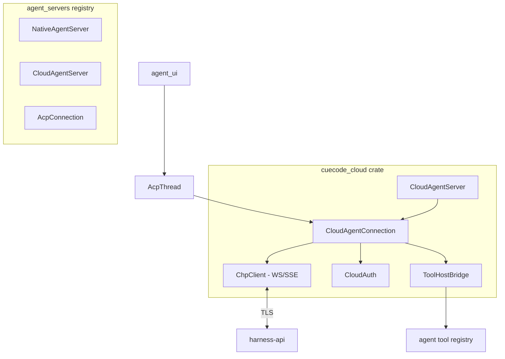
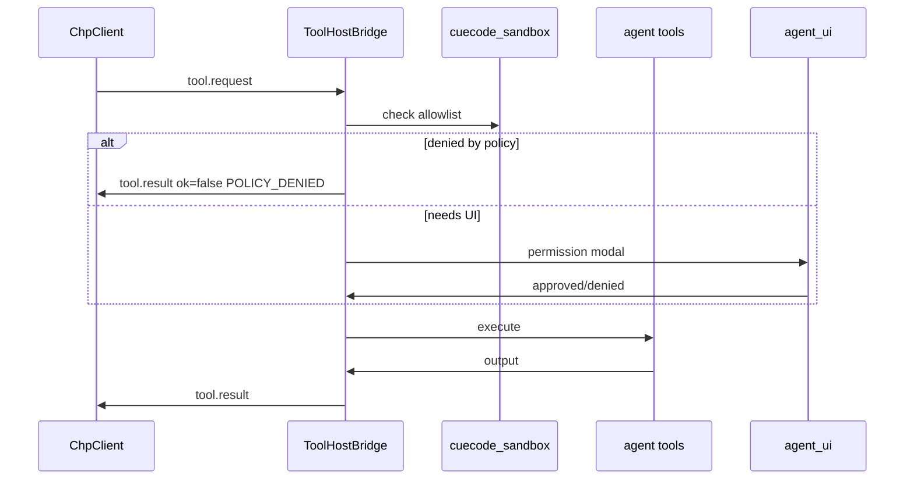

# CueHarness open client — `cuecode_cloud` {#open-client}

> **CueCloud umbrella:** `cuecode_cloud` is the GPL wire client that speaks CHP to CueHarness (the cloud agent-runtime half of CueCloud). Index: [README](./README.md).
> **Branch:** [harness/cloud/](./01-overview.md) — GPL wire client in the public fork.  
> **Protocol:** [03-protocol.md](./03-protocol.md) — CHP message contract.  
> **Reference traits:** `crates/acp_thread/src/connection.rs`, `crates/agent_servers/src/agent_servers.rs`.

The **`cuecode_cloud`** crate is the open-source (GPL-3.0-or-later) desktop component that
speaks CHP to CueCode Cloud. It implements `AgentServer` / `AgentConnection` so the rest of
the IDE (`agent_ui`, `AcpThread`) treats cloud sessions identically to NativeAgent and external
ACP backends — except orchestration runs remotely.

Related: [01-overview §moat-boundary](./01-overview.md#moat-boundary),
[06-system-design §agent-backends](../core/06-system-design.md#agent-backends),
[02-architecture §rust-map](./02-architecture.md#rust-map)

**Explicit scope:** Transport, auth, streaming bridge, tool host delegation, reconnect.
**Out of scope:** Prompts, scheduler, model decode, builtin agent logic.

---

## Summary {#summary}



| Type | Implements | File (planned) |
|------|------------|----------------|
| `CloudAgentServer` | `AgentServer` | `cloud_agent_server.rs` |
| `CloudAgentConnection` | `AgentConnection` | `cloud_agent_connection.rs` |
| `ChpClient` | WebSocket + SSE | `chp/client.rs` |
| `ToolHostBridge` | Local tool exec | `tool_host.rs` |

---

## Responsibilities {#responsibilities}

### 1. Authentication {#auth}

| Method | Use case |
|--------|----------|
| Device OAuth flow | Product builds — CueCode account |
| API token | BYOK Cloud / self-hosted harness |
| Refresh | Store refresh token in OS keychain (`cuecode_cloud::auth`) |

Maps to `AgentConnection::authenticate`, `auth_methods`, `logout` in
[connection.rs](../../../../crates/acp_thread/src/connection.rs).

```rust
// Sketch — not shipped API
pub enum CloudAuthMethod {
    CueCodeAccount,
    HarnessApiToken,
}
```

On auth failure: surface CHP `AUTH_*` errors to `agent_ui` toast; do not fall back silently
to NativeAgent unless user confirms ([01-overview AC-O2](./01-overview.md#ac-o2)).

### 2. CHP streaming {#streaming}

- Maintain WebSocket connection per `CloudAgentConnection`.
- Parse CHP envelopes; map `turn.stream` → ACP-shaped updates for `AcpThread`.
- Handle `turn.end`, backpressure, and user cancel via `turn.cancel`.
- Fall back to SSE per [03-protocol §transport-sse](./03-protocol.md#transport-sse).

**Seq tracking:** Update `last_seq` on every server message; used by [reconnect](./03-protocol.md#reconnect-resume).

### 3. Tool host bridge {#tool-host-bridge}

When CHP `tool.request` arrives:

1. Resolve tool in `agent` registry (same as NativeAgent).
2. Apply `cuecode_sandbox` intent allowlist / trust graph.
3. Show permission UI if `requires_permission` or policy demands.
4. Execute tool on foreground thread rules (GPUI modal) or background for read-only.
5. Send `tool.result` (or `permission.request` → `permission.response` first).



Large outputs: spill to session dir; return `spill_ref` per [03-protocol §tool.result](./03-protocol.md#msg-tool-result).

### 4. Reconnect {#reconnect}

- Detect WebSocket close / ping timeout.
- Exponential backoff (1s, 2s, 4s … cap 30s).
- Send `session.resume`; replay missed messages.
- On `SESSION_EXPIRED`: emit event to `agent_ui` with "Reconnect failed" + actions (new session, local fallback).

`supports_resume_session()` → `true`.  
`supports_load_session()` → `true` when server capability set ([03 §capabilities](./03-protocol.md#capabilities-handshake)).

### 5. Lane and notification forwarding {#lanes-notifications}

- `spawn.lane` → create lane tab + task pill in `AcpThread` meta.
- `notification` → `SessionNotification` for notification rail (map kinds to local enum).
- Multiplex by `lane_id` on single connection (v1).

Behavior must match [local harness UI sections](../local/01-agent-harness.md#harness-ui-overview).

---

## Non-responsibilities {#non-responsibilities}

The following **must not** appear in `cuecode_cloud`:

| Forbidden | Reason | Where it lives |
|-----------|--------|----------------|
| System prompt templates | Moat | Closed orchestrator |
| Builtin agent definitions | Moat | Closed orchestrator |
| Turn scheduler / lane arbitration logic | Moat | Closed orchestrator |
| Model token decoding | Moat | Orchestrator + gateway |
| Provider API keys in process | Security | `model-gateway` vault |
| Compaction algorithms | Moat | Closed orchestrator |
| Proprietary prompt bodies in comments/tests | License leak | — |

If a contributor needs to change orchestration behavior, update the private `cuecode-harness`
repo and adjust CHP if wire contract changes — not `cuecode_cloud` business logic.

**Acceptable in client:** Model **id strings** for picker display; intent **names**; spec **paths**
in session meta (user-owned content).

---

## AgentConnection mapping {#agent-connection-mapping}

Reference: [`AgentConnection`](../../../../crates/acp_thread/src/connection.rs) trait.

| AgentConnection method | CloudAgentConnection behavior |
|------------------------|-------------------------------|
| `new_session` | CHP `session.start` → `Entity<AcpThread>` |
| `load_session` | CHP resume + hydrate from local session dir |
| `resume_session` | CHP `session.resume` without full history replay |
| `close_session` | CHP `session.end` |
| `prompt` | CHP `turn.start`; stream via callback |
| `cancel` | CHP `turn.cancel` |
| `authenticate` | OAuth / token exchange |
| `auth_methods` | CueCode account + API token |
| `model_selector` | Optional — proxy server `capabilities.models` |
| `supports_*` | From capabilities handshake |

Reference: [`AgentServer`](../../../../crates/agent_servers/src/agent_servers.rs) trait.

| AgentServer method | CloudAgentServer behavior |
|--------------------|---------------------------|
| `connect` | Auth check → `ChpClient::connect` → `Rc<CloudAgentConnection>` |
| `agent_id` | Fixed `AgentId` for "CueCode Cloud" |
| `logo` | CueCode cloud icon |
| `default_mode` | Pass-through from settings |

---

## Crate layout {#crate-layout}

```
crates/cuecode_cloud/
├── Cargo.toml
├── src/
│   ├── cuecode_cloud.rs          # lib root, re-exports
│   ├── cloud_agent_server.rs     # impl AgentServer
│   ├── cloud_agent_connection.rs # impl AgentConnection
│   ├── auth.rs                   # OAuth, keychain, token refresh
│   ├── chp/
│   │   ├── client.rs             # WS + SSE transport
│   │   ├── envelope.rs           # JSON types matching 03-protocol
│   │   ├── reconnect.rs          # resume state machine
│   │   └── error.rs              # CHP error codes → anyhow
│   ├── tool_host.rs              # ToolHostBridge
│   ├── session_store.rs          # Local session_id, seq, spill paths
│   └── settings.rs               # harness_url, debug flags
└── tests/
    ├── chp_roundtrip.rs          # golden JSON fixtures from spec
    └── fake_harness_server.rs    # test-support mock CHP server
```

### Dependencies (expected) {#dependencies}

| Crate | Purpose |
|-------|---------|
| `acp_thread` | `AgentConnection`, `AcpThread`, message types |
| `agent` | Tool registry execution |
| `agent_servers` | `AgentServer` trait |
| `agent_client_protocol` | ACP schema alignment |
| `cuecode_sandbox` | Intent allowlist (when available) |
| `gpui`, `async-tungstenite` or `tokio-tungstenite` | WS client |
| `http_client` | SSE fallback, OAuth |
| `serde`, `serde_json` | CHP envelopes |

Keep dependency fan-in minimal — `cuecode_cloud` must not depend on `agent_ui` (UI callbacks via traits / channels).

---

## Initialization and wiring {#init-wiring}

### Register in agent server store {#register-server}

In CueCode product binary init (e.g. `crates/cuecode/src/main.rs` or `agent_ui` bootstrap):

```rust
// Sketch — product build only
#[cfg(feature = "cuecode_cloud")]
{
    use cuecode_cloud::CloudAgentServer;
    agent_servers::register_server(cx, Rc::new(CloudAgentServer::new(settings)));
}
```

OSS self-builds without `cuecode_cloud` feature: only `NativeAgentServer` + external ACP.

### Default agent server selection {#default-server}

| Build | Default `AgentServer` | Setting override |
|-------|----------------------|------------------|
| CueCode product | `CloudAgentServer` | `agent.runtime = local` → NativeAgent |
| OSS / dev | `NativeAgentServer` | Opt-in cloud via settings |
| Tests | `StubAgentConnection` / fake harness | — |

Settings keys (`~/.config/cuecode/settings.json`):

```json
{
  "agent": {
    "runtime": "cloud",
    "cloud": {
      "harness_url": null,
      "auth_method": "cuecode_account",
      "debug_chp": false
    }
  }
}
```

`runtime`: `"cloud"` | `"byok_cloud"` | `"local"`

### Feature flags {#feature-flags}

| Flag | Effect |
|------|--------|
| `cuecode_cloud` | Compile cloud client |
| `cuecode_product` | Default server = cloud; bundled OAuth client id |
| `cuecode_cloud/test-support` | Fake harness for GPUI tests |

---

## Interaction with AcpThread {#acp-thread}

`AcpThread` holds `Rc<dyn AgentConnection>` — cloud connection is a drop-in replacement:

```
AcpThread
  connection: Rc<CloudAgentConnection>
  plan, terminals, subagent handles  // unchanged
  session_dir under ~/.config/cuecode/sessions/
```

Cloud-specific state lives **inside** `CloudAgentConnection`:

- `session_id` (CHP)
- `last_seq`
- `ChpClient` handle
- Pending `tool_call_id` → permission modal map

Do not fork `AcpThread` for cloud — reuse existing session entity ([06-system-design](../core/06-system-design.md)).

---

## Testing strategy {#testing}

| Test type | Location | Covers |
|-----------|----------|--------|
| JSON golden | `cuecode_cloud/tests/chp_roundtrip.rs` | Envelope parse/serialize |
| Fake harness | `fake_harness_server.rs` | Tool round-trip, reconnect |
| GPUI integration | `agent_ui` tests with stub | Notification rail actions |
| E2E (staging) | Manual / CI nightly | Real harness-api |

Follow [gpui-test skill](../../../../.cursor/skills/gpui-test/SKILL.md) for async reconnect cases.

---

## Observability {#observability}

| Event | Emitted when |
|-------|--------------|
| `cloud_session_start` | `session.started` received |
| `cloud_reconnect` | Resume success/fail |
| `cloud_tool_roundtrip_ms` | tool.request → tool.result |
| `cloud_chp_error` | `error` message |

Align with [local §harness-analytics](../../harness/local/01-agent-harness.md) event names where applicable.
Telemetry **opt-in** per [10-infrastructure §telemetry](../ops/10-infrastructure.md#telemetry).

---

## Migration from NativeAgent-only {#migration}

| Step | Work |
|------|------|
| 1 | Add `cuecode_cloud` crate with CHP types + fake server tests |
| 2 | Implement `CloudAgentConnection::prompt` streaming |
| 3 | Wire `ToolHostBridge` to agent tools |
| 4 | Register `CloudAgentServer` behind feature flag |
| 5 | Product build flips default; dogfood against staging harness |
| 6 | Document parity gaps in [12-open-questions](../ops/12-open-questions.md) |

NativeAgent remains registered permanently as local fallback.

---

## Acceptance criteria {#acceptance-criteria}

### AC-C1: AgentServer registration {#ac-c1}

**Given** a CueCode product build with `cuecode_cloud` enabled  
**When** the agent panel loads  
**Then** `CloudAgentServer` appears in the agent backend list and connects without API key entry when authenticated

### AC-C2: AgentConnection prompt parity {#ac-c2}

**Given** a connected `CloudAgentConnection`  
**When** `prompt()` is called with a user message  
**Then** `AcpThread` receives the same `SessionUpdate` variant sequence shape as NativeAgent (text chunks, tool status, end turn)

### AC-C3: Tool host deny {#ac-c3}

**Given** Explore intent with write tools disallowed locally  
**When** the server sends `tool.request` for `write_file`  
**Then** `ToolHostBridge` returns `tool.result` with error without writing and never sends file content to the server

### AC-C4: Reconnect transparent {#ac-c4}

**Given** an in-progress streamed turn  
**When** the WebSocket drops and reconnect succeeds within 60s  
**Then** the transcript shows no duplicate assistant segments and the task pill state remains consistent

### AC-C5: No prompt leakage in crate {#ac-c5}

**Given** the `cuecode_cloud` source tree  
**When** searched for orchestration templates  
**Then** zero proprietary system prompt strings exist; only CHP JSON types and trait glue

### AC-C6: OSS build without cloud {#ac-c6}

**Given** a build without `cuecode_cloud` feature  
**When** compiled and run  
**Then** binary size excludes WebSocket client deps and NativeAgent is the only built-in backend

### AC-C7: Notification rail integration {#ac-c7}

**Given** a CHP `notification` with `kind: verification_verdict`  
**When** delivered to `CloudAgentConnection`  
**Then** `agent_ui` notification rail renders title, summary, and actions matching [local §notification-rail](../local/01-agent-harness.md#notification-rail-ui)

---

## Document status {#document-status}

| Field | Value |
|-------|-------|
| Status | Draft |
| Crate | `cuecode_cloud` (planned) |
| License | GPL-3.0-or-later |
| Blocks | [03-protocol](./03-protocol.md) stable, staging harness-api |
