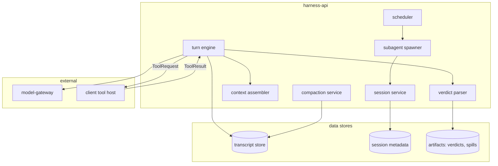
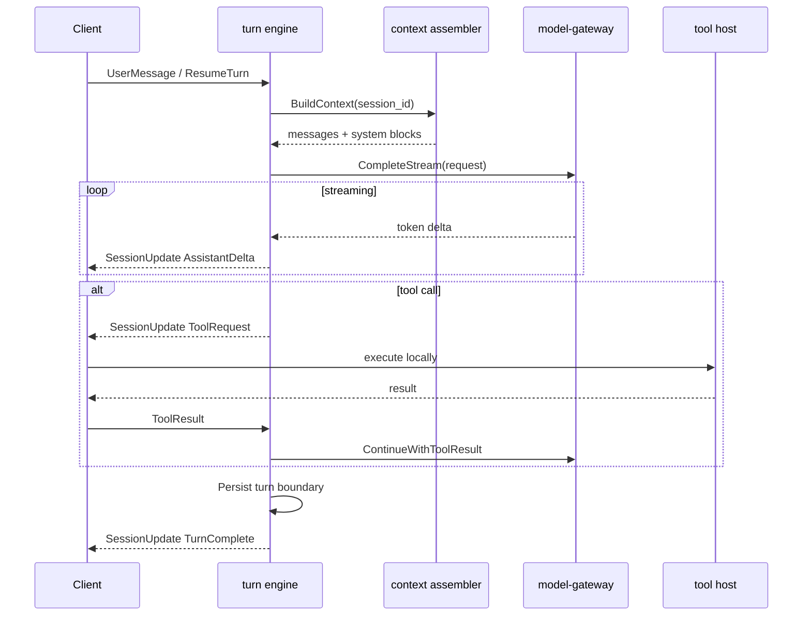
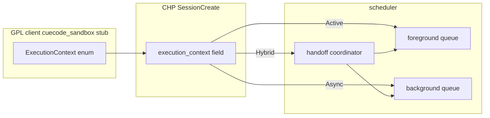

# Cloud services — harness-api {#cloud-services}

> **Repo:** `cuecode-harness` (private, proprietary). Not shipped in GPL tree.  
> **Client:** [04-open-client](./04-open-client.md) · **Protocol:** [03-protocol](./03-protocol.md)  
> **Local semantics:** [../local/01-agent-harness.md](../local/01-agent-harness.md)

Closed-source services that run CueCode agent orchestration in production (Model B).
The GPL IDE connects via CHP; it does not embed turn logic, built-in agent prompts, or
model routing secrets.

Related: [06-tool-host](./06-tool-host.md), [07-model-gateway](./07-model-gateway.md),
[08-roadmap](./08-roadmap.md), [10-infrastructure](../ops/10-infrastructure.md)

---

## Service overview {#service-overview}



| Service | Responsibility |
|---------|----------------|
| **session** | Create, resume, archive; parent/child session graph |
| **turn engine** | One model turn: assemble context → stream → tools → persist |
| **scheduler** | Maps `ExecutionContext` to queue priority and concurrency |
| **subagent spawner** | Built-in agent lanes; background task lifecycle |
| **context assembler** | System prompt, spec index, skills, transcript slice |
| **compaction** | Summarize history; preserve invariants |
| **verdict parser** | Structured PASS/FAIL/PARTIAL from verification lane |

---

## Session service {#session-service}

### Session graph {#session-graph}

Sessions form a tree keyed by `session_id`:

```
root (main composer)
├── sub-explore-8f3a     (Async, explore)
├── sub-implement-9b2c   (Active, implement)
└── sub-verify-12d4      (Async, verification)
```

| Field | Type | Notes |
|-------|------|-------|
| `session_id` | UUID | Stable across resume |
| `parent_session_id` | Option UUID | None for root |
| `agent_type` | enum | `main`, `explore`, `plan`, `implement`, `verification`, `coordinator` |
| `execution_context` | Active \| Async \| Hybrid | See [scheduler](#scheduler) |
| `intent` | Explore \| Fix \| Ship \| Review \| Orchestrate | Inherited from parent unless overridden |
| `linked_spec_paths` | Vec path | Preserved through compaction |
| `workspace_fingerprint` | hash | Repo identity for policy; not full file tree |

Create via CHP `SessionCreate`; resume via `SessionResume { session_id }`.
Archive on explicit user action or TTL (enterprise configurable).

### Transcript source of truth {#transcript-source-of-truth}

**Cloud owns the canonical transcript.** Client maintains a **read-through cache** for
offline display only — never authoritative for resume or audit.

| Store | Content | Retention |
|-------|---------|-----------|
| Transcript store | Ordered message + tool call records (JSONL-equivalent) | Session lifetime + org policy |
| Sidechain index | Child session ids + completion summaries | Same as parent |
| Artifact store | VERDICT markdown, large tool spills | Linked from transcript refs |

Client sync model:

1. Subscribe to `SessionUpdate` stream (delta).
2. On reconnect, `TranscriptSync { from_seq }` fills gaps.
3. Local `~/.config/cuecode/sessions/` is cache; cloud seq wins on conflict.

See [03-protocol §transcript](./03-protocol.md#transcript-sync).

---

## Turn engine {#turn-engine}

One **turn** = user message (or scheduler tick) through model completion, including
all tool round-trips delegated to the client.



### Turn state machine {#turn-state}

| State | Client UX | Server behavior |
|-------|-----------|-----------------|
| `idle` | Composer ready | Awaiting input |
| `streaming` | Assistant text grows | Forward gateway deltas |
| `tool_pending` | Permission UI | Block until ToolResult or timeout |
| `tool_running` | Tool card active | Client executing |
| `compacting` | "Summarizing…" banner | Compaction job |
| `failed` | Error toast | Retry policy or terminal |

Turn boundaries align with local `agent::Thread` turn hooks for semantic parity.

---

## Scheduler {#scheduler}

Maps [ExecutionContext](../local/01-agent-harness.md#rust-types) from local harness
to server-side scheduling policy.

| ExecutionContext | Scheduler behavior | Concurrency |
|------------------|-------------------|-------------|
| **Active** | Same session queue as parent; optional composer block flag | 1 foreground turn per session |
| **Async** | Background worker pool; lower priority than Active | N per workspace cap |
| **Hybrid** | Async worker → notification → parent synthesis turn | Worker async; handoff Active |

```rust
// Sketch: cuecode-harness scheduler (not in GPL repo)
pub struct ScheduleRequest {
    pub session_id: SessionId,
    pub execution_context: ExecutionContext,
    pub agent_type: AgentType,
    pub parent_session_id: Option<SessionId>,
}

pub enum ScheduleOutcome {
    Queued { position: u32 },
    Started { turn_id: TurnId },
    Rejected { reason: ScheduleRejectReason },
}
```

### Scheduler rules {#scheduler-rules}

| Rule | Rationale |
|------|-----------|
| One writer per overlapping path set | Match local [lane conflict](../local/01-agent-harness.md#lane-switch) |
| Verification Async never blocks Active composer | Phase 3b product story |
| Coordinator spawns only via Orchestrate intent | Hybrid gate |
| Deep explore capped at workspace concurrency | Cost + fairness |
| FAIL VERDICT holds session complete flag | Until user override |

### ExecutionContext mapping diagram {#execution-context-map}



Local `cuecode_sandbox::ExecutionContext` serializes verbatim on CHP.
Server rejects unknown values; client local stub mirrors enum for offline dev.

---

## Subagent spawn {#subagent-spawn}

Subagent spawner creates child sessions from parent turn (tool call or built-in action).

| Input | Server action |
|-------|---------------|
| `agent_type: explore` | New session, read-only allowlist, default Async |
| `run_in_background: true` | Queue on background pool; emit notification on complete |
| `session_id: resume` | Validate parent link; append to existing child transcript |
| `prompt` | Initial user message in child context |

Spawn does **not** push full parent transcript to child v1 — summary + spec index +
task prompt only (matches [local §C.3](../local/01-agent-harness.md#c-3-fork-research)).

On completion:

1. Persist child turn boundary.
2. Emit `SessionNotification` (CHP) to parent subscription.
3. Attach artifact refs (sidechain summary, VERDICT path if verification).

---

## Built-in agents {#builtin-agents}

Behavior **outlines** only — full prompts live in `cuecode-harness` private repo.
Semantics must match [local §A.2](../local/01-agent-harness.md#a-2-active-agents) and
[08 §builtin-agents](../agent/08-agent-tools-and-skills.md#builtin-agents).

| Agent ID | Default context | Purpose outline | Tool policy (server) |
|----------|-----------------|-----------------|----------------------|
| `explore` | Async | Map codebase; answer architecture questions | Read-only catalog |
| `plan` | Active | Strategy before edits; plan entries | Read-only + plan tools |
| `implement` | Active | Multi-step fixes and features | Fix intent write set |
| `verification` | Async | Adversarial test/check gate | Read + sandboxed terminal tests |
| `coordinator` | Hybrid | Orchestrate workers; synthesize | spawn + read_spec only |

### explore {#agent-explore}

- **Goal:** Fast codebase survey; no mutations.
- **Output:** Structured summary for parent synthesis (Hybrid handoff).
- **Model hint:** Fast/small via gateway ([07 §routing](./07-model-gateway.md#routing)).
- **Omit full spec body:** Spec index only (`omit_spec_index: true`).

### plan {#agent-plan}

- **Goal:** Produce plan entries linkable to specs before implement.
- **Output:** Plan JSON compatible with `AcpThread.plan` import on client.
- **Gate:** Parent must clear plan approval before implement spawn (client UI).

### implement {#agent-implement}

- **Goal:** Execute approved plan items with write tools.
- **Output:** Diffs via tool host; checkpoints client-side ([06](./06-tool-host.md)).
- **Spawn:** May be forbidden on main thread depending on intent profile.

### verification {#agent-verification}

- **Goal:** Run tests/linters; emit machine-parseable VERDICT.
- **Output:** See [verdict](#verdict) section.
- **Never:** edit, write, spawn subagents.

Prompt storage: `cuecode-harness/prompts/agents/{id}.md` — versioned per deploy.
Client receives **agent metadata only** (id, allowed_tools, execution_default).

---

## Context assembly {#context-assembly}

Context assembler builds the message list for each turn.

### Layers (in order) {#context-layers}

| Layer | Source | Notes |
|-------|--------|-------|
| System base | Server template | CueCode harness doctrine |
| Intent block | Session `intent` | Matches [08 §system-prompt](../agent/08-agent-tools-and-skills.md#system-prompt) |
| Spec index | Client `WorkspaceSnapshot.spec_index` | Titles + paths; not full bodies unless linked |
| Linked spec body | Session metadata | Full markdown when `@spec` linked |
| Skill refs | On-demand via tool | Progressive disclosure |
| Transcript slice | Transcript store | Recent turns + compact summary |
| Tool definitions | Server allowlist ∩ client capability | Filtered catalog |

Client sends **WorkspaceSnapshot** on session create/resume:

```json
{
  "spec_index": [{ "path": ".cursor/specs/core/04-sandbox-core.md", "title": "...", "summary": "..." }],
  "linked_spec_paths": [".cursor/specs/delivery/07-implementation-roadmap.md"],
  "intent": "Fix",
  "tool_capabilities": ["read_file", "grep", "terminal", "edit_file"]
}
```

Server never trusts client for allowlist — intersects with agent_type policy.

---

## Compaction {#compaction}

Server-run compaction when context budget exceeded (mirrors [10 §compaction](../ops/10-infrastructure.md#compaction)).

| Preserve | Drop or summarize |
|----------|-------------------|
| Linked spec paths | Old grep output |
| Intent + agent_type | Collapsed read groups |
| Checkpoint ids (client refs) | Redundant tool chatter |
| Plan state summary | Stale explore sidechains (keep refs) |
| VERDICT refs | Raw terminal walls |

Compaction emits `SessionUpdate CompactionApplied { summary, preserved_refs }`.
Client updates cache; cloud transcript replaces pre-compact slice atomically by seq range.

**Never** compact linked spec **body** without explicit user confirm flag on session.

---

## VERDICT generation {#verdict}

Verification agent output must parse to structured verdict — not prose-only.

### Format {#verdict-format}

```markdown
VERDICT: PASS|FAIL|PARTIAL

## Evidence
- command: `cargo test -p auth`
  exit_code: 0
- command: `./script/clippy`
  exit_code: 1
  stderr_ref: artifact://verdicts/turn-12/clippy.txt
```

Parser (`verdict parser` service):

1. Regex + structured blocks → `Verdict` enum (matches local Rust type).
2. Persist artifact markdown to artifact store.
3. Emit `SessionNotificationKind::VerificationVerdict` to parent.
4. Set `session.block_complete = true` on FAIL until override.

| Verdict | Session complete | Notification |
|---------|------------------|--------------|
| PASS | Allowed | Green rail card |
| FAIL | Blocked | Red card + Open review |
| PARTIAL | Warn | Yellow card |

Client renders from structured CHP payload — **never** infer from assistant prose alone
(local rule: [01 §notification-envelope](../local/01-agent-harness.md#notification-envelope)).

---

## API surface (internal) {#api-surface}

HTTP/gRPC between `harness-api` components (private — not CHP):

| Endpoint | Method | Purpose |
|----------|--------|---------|
| `/v1/sessions` | POST | Create session |
| `/v1/sessions/{id}/turns` | POST | Start turn |
| `/v1/sessions/{id}/transcript` | GET | Sync from seq |
| `/v1/sessions/{id}/spawn` | POST | Subagent spawn |
| `/v1/sessions/{id}/compact` | POST | Force compaction |
| `/v1/schedule/workers` | GET | Admin: queue depth |

Auth: org API key + device token from CueCode account (enterprise SSO later).
See [07 §auth](./07-model-gateway.md#auth).

---

## Failure modes {#failure-modes}

| Failure | Client behavior | Server behavior |
|---------|-----------------|-----------------|
| Gateway 429 | Show retry toast | Backoff + fallback model |
| Tool timeout | Cancel local tool; send ToolError | Mark turn failed; offer retry |
| Scheduler reject | Toast reason | Log + metric |
| Transcript desync | Full sync from last ack seq | Idempotent replay |
| Compaction fail | Continue with warning | Abort turn; preserve raw |

---

## Document status {#document-status}

| Field | Value |
|-------|-------|
| Status | Draft |
| Implements | Model B orchestration |
| Depends on | [03-protocol](./03-protocol.md), [07-model-gateway](./07-model-gateway.md) |
| Milestones | [08-roadmap](./08-roadmap.md) M1–M3 |
