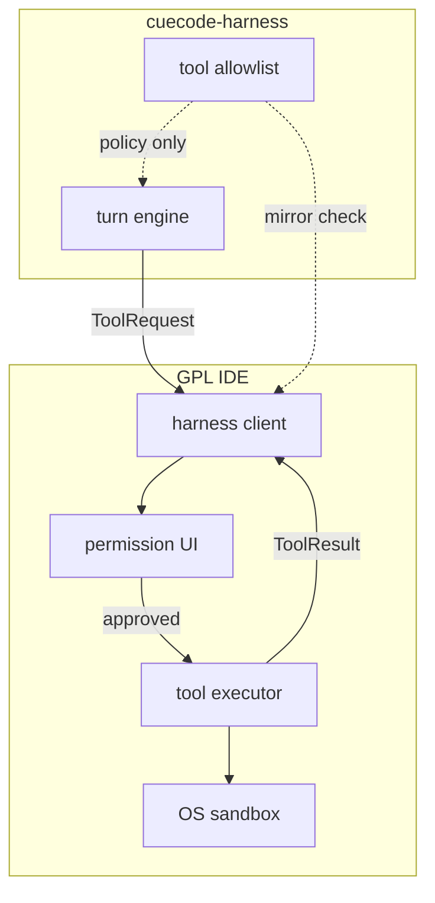
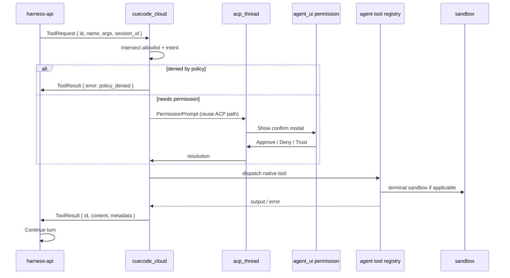
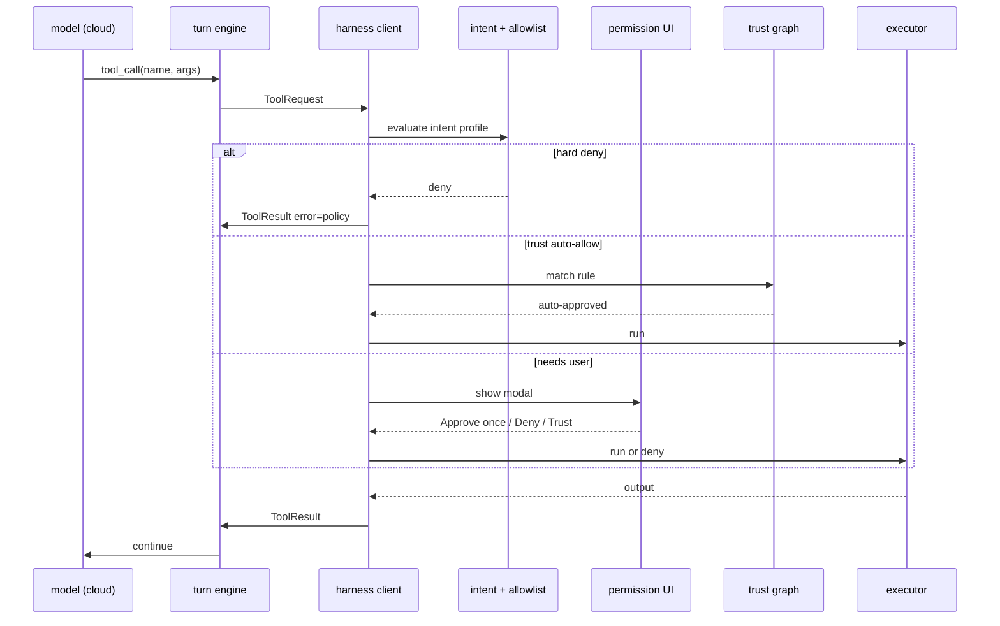

# Tool host — client-side execution {#tool-host}

> **CueCloud umbrella:** CueHarness runs orchestration remotely; all side-effecting tools execute on the developer machine. Index: [README](./README.md).
> **Repo:** GPL `apps/CueCode-IDE` — `crates/cuecode_cloud` + existing `agent` tools.  
> **Server:** [05-cloud-services](./05-cloud-services.md) issues `ToolRequest`; never executes FS/terminal.  
> **Protocol:** [03-protocol](./03-protocol.md#tool-round-trip)

The cloud harness runs orchestration remotely; **all side-effecting tools execute on
the developer machine** inside the GPL IDE. The tool host bridges CHP `ToolRequest` →
native agent tool implementations → `ToolResult` upstream.

Related: [08-agent-tools-and-skills](../agent/08-agent-tools-and-skills.md),
[10-infrastructure §terminal-sandbox](../ops/10-infrastructure.md#terminal-sandbox),
[../local/01-agent-harness.md](../local/01-agent-harness.md#a-3-active-tools)

---

## Trust model {#trust-model}



| Layer | Enforces | Cannot bypass |
|-------|----------|---------------|
| **Server allowlist** | Which tools appear in model context; rejects disallowed tool names at turn engine | Client claiming extra tools in result |
| **Intent profile** | Explore vs Fix tool matrix | Server (client sends intent snapshot) |
| **Permission UI** | User confirm/deny/trust | Server |
| **OS sandbox** | Seatbelt / Bubblewrap on terminal | Server |

Server allowlist is **authoritative for model exposure**. Client must **refuse**
execution if local policy is stricter (e.g. Explore + `edit_file`).

---

## End-to-end flow {#end-to-end-flow}



Cloud never receives raw filesystem paths outside worktree policy unless user approved
and result is redacted per tool (e.g. `.env` paths masked in logs).

---

## Reuse: acp_thread + terminal paths {#acp-reuse}

Do **not** duplicate permission or terminal infrastructure.

| Existing surface | Tool host reuse |
|------------------|-----------------|
| `acp_thread::AcpThread` permission callbacks | Map CHP `ToolRequest` → same prompt types |
| `agent_settings` tool permissions | Evaluate before execute |
| `agent::sandboxing` | Terminal spawn policy by intent |
| `crates/sandbox` Seatbelt / Bubblewrap | Unchanged for `terminal` tool |
| `action_log` | Log every cloud-delegated tool for checkpoints |
| `agent_ui` permission modal | Same GPUI components; label "Cloud agent requested…" |

### acp_thread mapping {#acp-mapping}

```rust
// Sketch: cuecode_cloud (GPL)
pub async fn handle_tool_request(
    request: ChpToolRequest,
    thread: &Entity<AcpThread>,
    cx: &mut AsyncApp,
) -> ChpToolResult {
    let tool_name = &request.name;
    if !local_allowlist.permits(tool_name, request.session.intent) {
        return ChpToolResult::policy_denied(tool_name);
    }
    let permission = thread
        .request_tool_permission(tool_name, &request.args, cx)
        .await?;
    match permission {
        PermissionOutcome::Approved => execute_native_tool(request, cx).await,
        PermissionOutcome::Denied(reason) => ChpToolResult::denied(reason),
    }
}
```

Terminal sessions: reuse `acp_thread` terminal handles so unified review Terminal tab
lists cloud-delegated commands identically to local agent ([09 §review-panel](../design/09-ui-ux-spec.md#review-panel)).

---

## Server allowlist {#server-allowlist}

Turn engine attaches tools to model requests from **agent_type × intent** matrix
(defined in [05 §builtin-agents](./05-cloud-services.md#builtin-agents)).

Client sends `tool_capabilities` on connect — intersection only:

```
effective_tools = server_allowlist(agent_type, intent)
                  ∩ client_capabilities
                  ∩ intent_profile(client)
```

| Check | Where | On mismatch |
|-------|-------|-------------|
| Tool name in server allowlist | Server | Model never sees tool |
| Tool name in client capabilities | Server | Omit from schema |
| Intent allows tool | Client | `policy_denied` without UI |
| User permission | Client | `denied` with reason |
| Hard deny (.env, force push) | Client | Always block |

### Builtin agent allowlists (server source of truth) {#allowlist-table}

| Tool | explore | plan | implement | verification | coordinator |
|------|---------|------|-----------|--------------|-------------|
| read_file, grep, find_* | ✓ | ✓ | ✓ | ✓ | ✓ |
| diagnostics | ✓ | ✓ | ✓ | ✓ | ✓ |
| list_specs, read_spec | ✓ | ✓ | ✓ | ✓ | ✓ |
| edit_file, write_* | ✗ | ✗ | ✓ | ✗ | ✗ |
| terminal | ✗ | ✗ | ✓ sandboxed | ✓ test-only | ✗ |
| spawn_agent | ✗ | limited | optional | ✗ | ✓ |
| fetch / web_search | intent | intent | intent | ✗ | intent |
| checkpoint / rewind | ✗ | ✗ | ✓ | ✗ | ✗ |

✓ = may appear in model tool list. ✗ = server excludes entirely.

---

## OS sandbox (client-only) {#os-sandbox}

Server cannot apply Seatbelt/Bubblewrap — **client enforces** before `terminal` executes.

| Intent | Terminal | Sandbox |
|--------|----------|---------|
| Explore | Denied at permission layer | N/A |
| Fix / Ship | Allowed | Seatbelt (macOS) / bwrap (Linux) |
| Verification | Test commands only | Same as Fix |
| Review | Denied | N/A |

Network policy from [10 §network-allowlists](../ops/10-infrastructure.md#network-allowlists)
applies inside sandbox wrapper — unchanged from local agent.

Windows: partial sandbox disclaimer per [10 §windows-sandbox](../ops/10-infrastructure.md#windows-sandbox).

---

## Tool catalog mapping {#tool-catalog}

Map CHP tool names to existing `crates/agent/src/tools/` implementations.

### Native tools {#native-tools}

| CHP name | Rust tool | Client module | Notes |
|----------|-----------|---------------|-------|
| `read_file` | `ReadFileTool` | `agent::tools::read_file` | Path scoped to worktree |
| `grep` | `GrepTool` | `agent::tools::grep` | |
| `edit_file` | `EditFileTool` | `agent::tools::edit_file` | action_log + review |
| `terminal` | `TerminalTool` | `agent::tools::terminal` | sandboxed_terminal path |
| `fetch` | `FetchTool` | `agent::tools::fetch` | intent network gate |
| `diagnostics` | `DiagnosticsTool` | `agent::tools::diagnostics` | |
| `skill` | `SkillTool` | `agent::tools::skill` | Loads `.cursor/skills/` |
| `spawn_agent` | `SpawnAgentTool` | `agent::tools::spawn_agent` | **Becomes CHP Spawn to server** in cloud mode |

### CueCode tools {#cuecode-tools}

| CHP name | Crate | Delegates to |
|----------|-------|--------------|
| `list_specs` | `cuecode_specs` | Spec index scan |
| `read_spec` | `cuecode_specs` | Spec body load |
| `link_spec` | `cuecode_specs` | Session metadata → sync server |
| `checkpoint` | `cuecode_sandbox` | Local checkpoint store |
| `rewind` | `cuecode_sandbox` | Local restore |

### MCP tools {#mcp-tools}

Pattern: `mcp::{server}::{tool}`

Execute via existing `context_server` registry on client. Server allowlist must
explicitly enable MCP prefixes per org policy — default off in alpha.

---

## Permission flow {#permission-flow}

### Sequence diagram {#permission-sequence}



### Permission UI copy (cloud) {#permission-copy}

| State | Headline |
|-------|----------|
| First ask | "Cloud agent wants to run `{tool}`" |
| Trust promoted | "Auto-approved (trust)" |
| Denied | "You denied `{tool}` — agent will retry or stop" |
| Policy | "Blocked by Explore intent — switch to Fix" |

Reuse [09-ui-ux-spec §tool-ux](../design/09-ui-ux-spec.md#tool-ux) strings; prefix "Cloud" where ambiguity matters.

---

## Large results and spill {#tool-spill}

Match local harness: outputs > threshold spill to disk under session cache dir;
`ToolResult` carries `content_ref` instead of inline body.

| Threshold | Default | Cloud behavior |
|-----------|---------|----------------|
| Inline max | 32 KiB | Client uploads ref hash; server stores artifact pointer |
| Spill path | `~/.config/cuecode/sessions/{id}/tool-results/` | Sync metadata only |

Server transcript stores ref; client serves content on audit export.

---

## spawn_agent in cloud mode {#spawn-agent-cloud}

Local `spawn_agent` tool becomes **CHP SpawnSubagent** to server scheduler
([05 §subagent-spawn](./05-cloud-services.md#subagent-spawn)).

| Field | Local behavior | Cloud behavior |
|-------|----------------|----------------|
| `agent_type` | Local allowlist | Server builtin registry |
| `run_in_background` | Local Task | Server Async queue |
| `session_id` | Resume local sub-thread | Resume cloud child session |

Client UI (task pills, notification rail) unchanged — driven by CHP `SessionUpdate`.

---

## Failure and timeout {#failure-timeout}

| Case | Client | Server |
|------|--------|--------|
| User idle on permission | 5 min default cancel | Turn failed; retry offer |
| Tool panic | Log + ToolResult error | Metric alert |
| Sandbox spawn fail | Error with platform hint | |
| Disconnect mid-tool | Cancel local; queue result if reconnect within TTL | Idempotent by `tool_call_id` |

---

## Testing {#testing}

| Test | Scope |
|------|-------|
| M0 round-trip | Mock server ToolRequest → local read_file → ToolResult |
| Allowlist deny | Explore + edit_file never executes |
| Permission reuse | GPUI test: modal appears on terminal |
| Sandbox | Integration: Fix intent terminal uses Seatbelt |

See [08-roadmap §M0](./08-roadmap.md#m0).

---

## Document status {#document-status}

| Field | Value |
|-------|-------|
| Status | Draft |
| Crates | `cuecode_cloud`, `agent`, `acp_thread`, `sandbox` |
| Depends on | [03-protocol](./03-protocol.md), [05-cloud-services](./05-cloud-services.md) |
