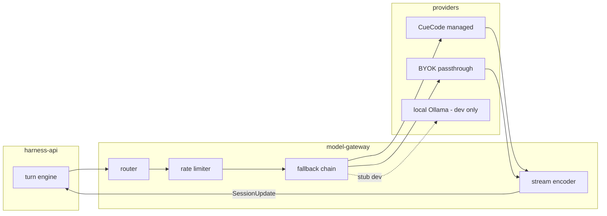
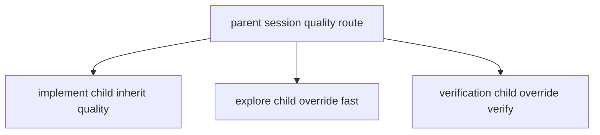
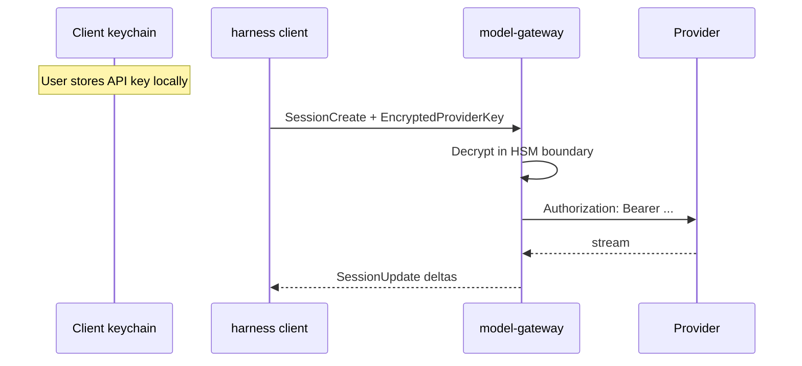
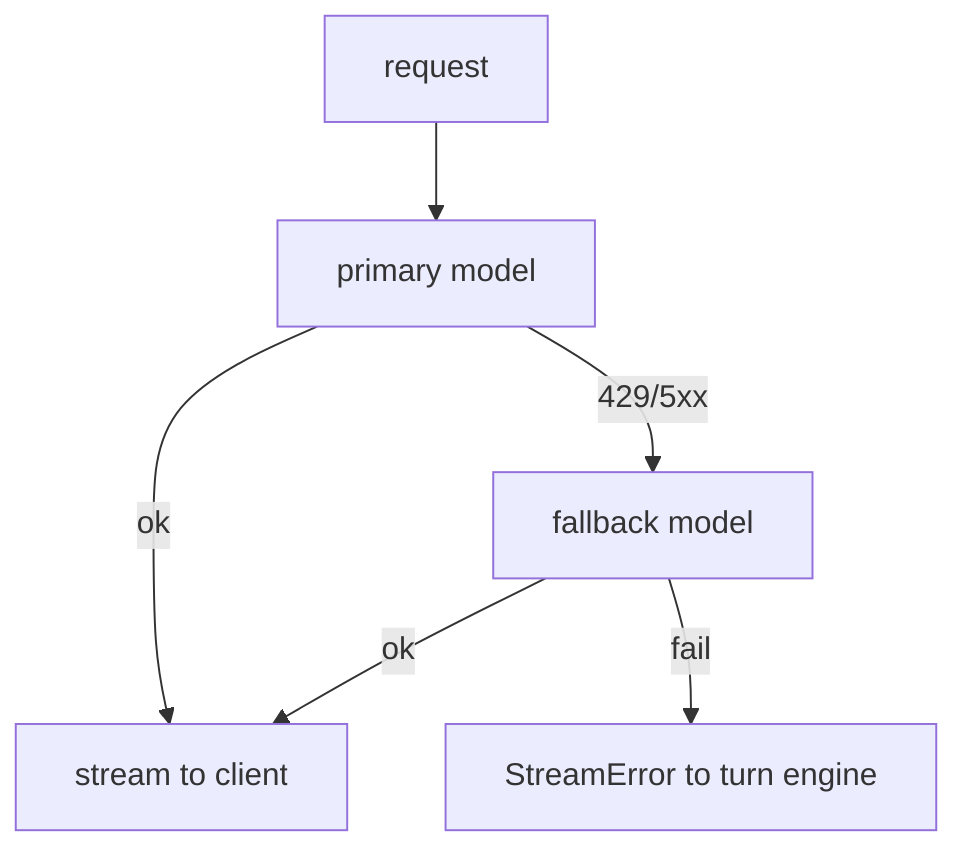

# Model gateway {#model-gateway}

> **Repo:** `cuecode-harness` (private) — `model-gateway` service.  
> **Consumers:** [05-cloud-services §turn-engine](./05-cloud-services.md#turn-engine)  
> **Infra context:** [10-infrastructure §models](../ops/10-infrastructure.md#models)

Routes LLM requests from the cloud turn engine to providers. Streams token deltas back
as CHP `SessionUpdate` chunks for the GPL client to render. Supports CueCode-managed
keys and BYOK passthrough.

Related: [07-model-gateway](./07-model-gateway.md), [03-protocol §streaming](./03-protocol.md),
[08-roadmap §M4](./08-roadmap.md#m4)

---

## Architecture {#architecture}



Gateway is **stateless per request** except stream handles; session affinity via `turn_id`.

---

## Routing {#routing}

Route by **lane / agent_type** + org tier + user override.

| Agent type | Default route tier | Model profile | Temperature |
|------------|-------------------|---------------|-------------|
| `main` / implement | Quality | User-selected or org default | Model default |
| `explore` | Fast | Small/fast model pool | Low |
| `plan` | Quality | Inherit parent session route | Medium |
| `verification` | Fast + deterministic | Fixed verify model | Low, low top_p |
| `coordinator` | Quality | Inherit parent | Medium |

Matches [10 §model-per-context](../ops/10-infrastructure.md#model-per-context) and local
`BuiltinAgentDefinition::model_hint`.

### Routing table (config) {#routing-table}

```yaml
# cuecode-harness config sketch (private)
routes:
  fast:
    primary: anthropic/claude-haiku-4
    fallback: openai/gpt-4o-mini
  quality:
    primary: anthropic/claude-sonnet-4
    fallback: openai/gpt-4o
  verify:
    primary: openai/gpt-4o-mini
    fallback: anthropic/claude-haiku-4
agent_routes:
  explore: fast
  implement: quality
  verification: verify
  plan: inherit
  coordinator: inherit
```

### Lane inheritance {#lane-inheritance}

Child sessions inherit parent **route class** unless `agent_type` overrides (e.g. explore → fast).



---

## Streaming decode {#streaming}

Gateway opens provider SSE/stream; encodes to CHP `SessionUpdate` for client.

| Provider event | CHP SessionUpdate variant |
|----------------|---------------------------|
| Text delta | `AssistantDelta { text, turn_id }` |
| Tool call start | `ToolCallStart { id, name }` |
| Tool call args delta | `ToolCallArgsDelta { id, json_fragment }` |
| Tool call complete | `ToolCallComplete { id, name, args }` |
| Usage | `UsageUpdate { input_tokens, output_tokens }` |
| Error | `StreamError { code, message, retry_after }` |
| Done | `AssistantComplete { turn_id, finish_reason }` |

Client `cuecode_cloud` forwards to `acp_thread` using **same** rendering path
as local `language_model` streaming ([10 §streaming-errors](../ops/10-infrastructure.md#streaming-errors)).

### Backpressure {#backpressure}

| Condition | Behavior |
|-----------|----------|
| Client slow consumer | Buffer up to 256 KiB; then coalesce deltas |
| Disconnect | Gateway cancels provider stream; turn pauses |
| Reconnect | `StreamResume { turn_id, from_byte }` if provider supports |

---

## CueCode-managed keys vs BYOK {#keys-byok}

| Mode | Key storage | Billing | Use case |
|------|-------------|---------|----------|
| **CueCode-managed** | Gateway vault (KMS) | CueCode subscription meter | Default cloud build |
| **BYOK passthrough** | Client encrypts → gateway decrypt per request | User pays provider | Power users, enterprise |
| **Hybrid org** | Per-team policy | Mixed | Enterprise default |

### BYOK passthrough flow {#byok-flow}



**Never** persist BYOK plaintext at rest on server beyond request scope.
Audit log records provider + model id only — not key material.

Local-only dev: gateway may proxy to `localhost:11434` when `CHP_DEV_LOCAL=1` ([08 §M0](./08-roadmap.md#m0)).

### CueCode-managed metering {#metering}

| Dimension | Unit |
|-----------|------|
| Input tokens | Per org monthly quota |
| Output tokens | Per org monthly quota |
| Fast lane | Separate cheaper pool |
| Verify lane | Included in session cap |

Overage: soft throttle → queue → hard stop with user-visible message.

Links: [10-infrastructure](../ops/10-infrastructure.md), [11-metrics §north-star](../ops/11-metrics-and-success.md).

---

## Rate limits {#rate-limits}

Applied at gateway **before** provider call.

| Limit | Scope | Default |
|-------|-------|---------|
| Requests/min | org_id | 60 |
| Tokens/min | org_id | 500k |
| Concurrent streams | org_id | 10 |
| Fast lane RPM | org_id | 120 |
| BYOK | user_id | Provider limit only + abuse guard |

Headers on limit:

```
X-CueCode-RateLimit-Remaining: 42
X-CueCode-RateLimit-Reset: 1718659200
Retry-After: 30
```

Client maps to composer toast: "Rate limited — retry in 30s" ([10 §streaming-errors](../ops/10-infrastructure.md#streaming-errors)).

---

## Fallback models {#fallback}

On provider error, gateway walks **fallback chain** for route tier.

| Trigger | Action |
|---------|--------|
| HTTP 429 | Retry primary with backoff; then fallback |
| HTTP 5xx | Immediate fallback |
| Context length exceeded | Return structured error to turn engine → compaction |
| Auth failure (managed key) | Alert ops; fail closed for org |
| Auth failure (BYOK) | User-facing: "Check API key in Settings" |



Fallback must preserve **tool schema compatibility** — verify lane fallbacks stay function-calling capable.

Log every fallback: `{ org, route, primary, fallback, reason }` for SLO tracking.

---

## Auth {#auth}

| Token | Purpose |
|-------|---------|
| Org API key | harness-api + gateway admin |
| Device session JWT | Client ↔ cloud (short-lived) |
| Encrypted BYOK blob | Per-provider key passthrough |

Device JWT minted on CueCode sign-in (cloud build only — distinct from removed zed.dev agent wall in GPL offline build).

Enterprise (M4): SSO → org mapping → SCIM seat management. See [08 §M4](./08-roadmap.md#m4).

---

## Security {#security}

| Requirement | Implementation |
|-------------|----------------|
| No key in logs | Redact Authorization headers |
| Prompt exfil guard | Org policy: disable fetch tools server-side for sensitive repos |
| Model data retention | Zero retention flag on supported providers |
| Regional routing | EU org → EU endpoint pool (enterprise) |

Align with [06-system-design §security](../core/06-system-design.md#security).

---

## Observability {#observability}

| Metric | Alert |
|--------|-------|
| `gateway.latency_p99` | > 8s streaming start |
| `gateway.fallback_rate` | > 5% / 5 min |
| `gateway.error_rate` | > 1% |
| `gateway.tokens_per_session` | Anomaly detection |

Traces: `turn_id` correlates turn engine ↔ gateway ↔ provider request id.

---

## Local / dev parity {#dev-parity}

| Mode | Gateway behavior |
|------|------------------|
| Cloud prod | Managed keys + BYOK |
| Dogfood staging | Managed keys; lower limits |
| Dev stub | Echo model or Ollama proxy |
| GPL offline build | **No gateway** — local `language_models` only |

CueCode GPL build without cloud account uses Model A exclusively ([../local/01-agent-harness.md](../local/01-agent-harness.md)).

---

## Document status {#document-status}

| Field | Value |
|-------|-------|
| Status | Draft |
| Parent infra | [10-infrastructure](../ops/10-infrastructure.md#models) |
| Milestones | M1 streaming, M4 BYOK enterprise |
