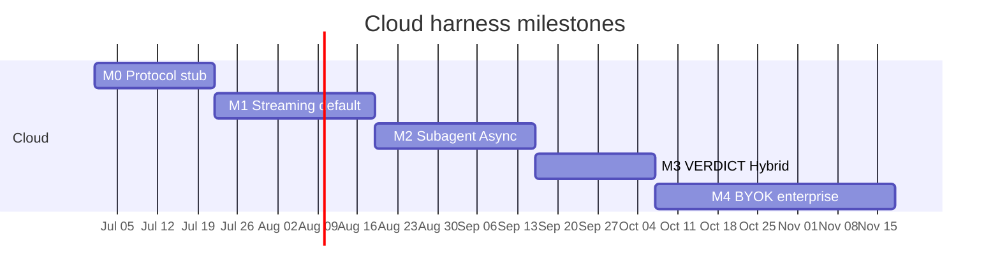
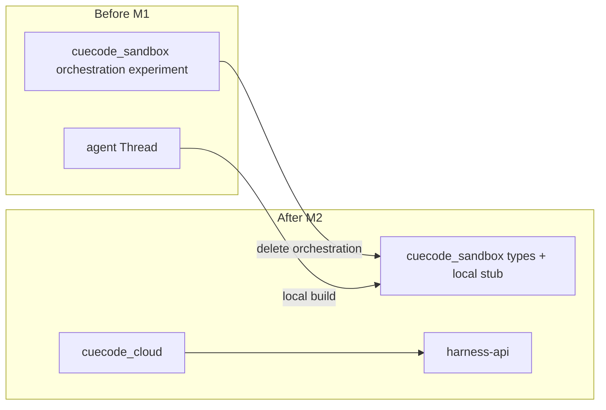

# Cloud harness roadmap {#cloud-roadmap}

> **Split from:** [07-implementation-roadmap §Phase 3b](../delivery/07-implementation-roadmap.md#phase-3b)  
> **Local parallel:** [../local/01-agent-harness.md](../local/01-agent-harness.md) (semantic reference)  
> **Index:** [README](./README.md)

Phased delivery for Model B cloud orchestration. Milestones **M0–M4** are additive —
GPL client ships local harness (Model A) throughout. Cloud milestones gate **default
cloud agent** in CueCode cloud-branded builds only.

Related: [05-cloud-services](./05-cloud-services.md), [06-tool-host](./06-tool-host.md),
[07-model-gateway](./07-model-gateway.md), [12-open-questions](../ops/12-open-questions.md)

---

## Relationship to main roadmap {#relationship}

| Main roadmap phase | Cloud milestone | Notes |
|--------------------|-----------------|-------|
| Phase 2 intent | M0 stub | Client sends intent snapshot |
| Phase 3 review | M1+ | Tool host feeds action_log |
| Phase 3b harness | M2–M3 | Spawn, VERDICT, Hybrid |
| Phase 4 trust | M1+ | Trust graph client-side for tools |
| Phase 6 ship | M4 | Enterprise BYOK + SSO |

Phase 3b in [07-implementation-roadmap](../delivery/07-implementation-roadmap.md#phase-3b) describes **local**
implementation. This doc is the **cloud split** — same UX, different orchestrator.



---

## M0 — Protocol + stub server + one tool round-trip {#m0}

**Duration:** ~3 weeks  
**Goal:** Prove CHP loop: client ↔ stub `harness-api` ↔ one tool execution.

### Scope {#m0-scope}

| Deliverable | Repo |
|-------------|------|
| CHP message types frozen (v0) | Both — spec [03-protocol](./03-protocol.md) |
| Stub turn engine (echo model) | `cuecode-harness` |
| `cuecode_cloud` crate | GPL |
| Single tool: `read_file` round-trip | GPL tool host |
| Local dev: in-process stub server | GPL feature flag `cloud_harness_stub` |

### Product narrative {#m0-narrative}

Developer enables cloud harness dev flag. Composer sends prompt to stub server; server
returns fake assistant text + one `read_file` request; permission modal appears; file
contents return upstream; stub completes turn. No real model spend.

### Exit criteria {#m0-exit}

- [ ] CHP `SessionCreate` → `UserMessage` → `ToolRequest` → `ToolResult` → `TurnComplete`
- [ ] Client renders tool card identically to local agent
- [ ] Server rejects `edit_file` for explore agent_type in stub allowlist
- [ ] `./script/clippy` clean on `cuecode_cloud`

### Tasks {#m0-tasks}

- [ ] Define CHP v0 in [03-protocol](./03-protocol.md)
- [ ] Stub harness-api (Rust or TypeScript — private repo decision)
- [ ] Wire `acp_thread` to harness client adapter
- [ ] Integration test: mock HTTP server + read_file

---

## M1 — Streaming + default cloud agent {#m1}

**Duration:** ~4 weeks  
**Goal:** Production-shaped streaming; cloud agent default in CueCode cloud build.

### Scope {#m1-scope}

| Deliverable | Notes |
|-------------|-------|
| model-gateway v1 | CueCode-managed keys only |
| Streaming `SessionUpdate` | [07 §streaming](./07-model-gateway.md#streaming) |
| Context assembly v1 | Spec index from client snapshot |
| Cloud build flag | `release_channel = cloud` enables harness default |
| Offline fallback | Model A when no auth / air-gap |

### Product narrative {#m1-narrative}

User signs into CueCode cloud (not zed.dev). Default agent lane routes through
harness-api. Tokens stream into composer. BYOK users still on managed keys until M4.
GPL tarball without cloud branding stays Model A only.

### Exit criteria {#m1-exit}

- [ ] First token < 3s p95 (managed route, US)
- [ ] Rate limit UX matches [07 §rate-limits](./07-model-gateway.md#rate-limits)
- [ ] Compaction v0 preserves linked spec path
- [ ] Cloud build launches with harness default; GPL build unchanged

### Tasks {#m1-tasks}

- [ ] Gateway router + fast/quality tiers
- [ ] Turn engine persistent transcript store
- [ ] Client stream decoder → `acp_thread`
- [ ] Onboarding: cloud vs local explainer

---

## M2 — Spawn subagent + Async notifications {#m2}

**Duration:** ~4 weeks  
**Goal:** Background explore/verify; notification rail from CHP.

### Scope {#m2-scope}

| Deliverable | Semantics |
|-------------|-----------|
| Scheduler Async queue | [05 §scheduler](./05-cloud-services.md#scheduler) |
| `SpawnSubagent` CHP | explore + verification builtins |
| `SessionNotification` push | Maps to local notification kinds |
| Task pills + rail | Reuse `agent_ui` — data from CHP |
| Sidechain transcript sync | Cloud SoT; client read-through |

Split from [07 Phase 3b tasks](../delivery/07-implementation-roadmap.md#phase-3b-tasks):

- Local: `cuecode_sandbox` ExecutionContext
- Cloud: same enum on wire; server scheduler implements queues

### Product narrative {#m2-narrative}

User spawns background explore while typing in main composer. Pill spins; notification
on complete. Resume child via `session_id`. Explore cannot edit — enforced server +
client.

### Exit criteria {#m2-exit}

- [ ] Background explore completes with notification (matches [QA-P3b](../delivery/07-implementation-roadmap.md#qa-p3b))
- [ ] `session_id` resume without duplicate thread
- [ ] Async lane does not block composer (configurable block flag for Active spawn)
- [ ] Sidechain view loads from cloud sync

### Tasks {#m2-tasks}

- [ ] Server subagent spawner + builtin registry outlines
- [ ] CHP notification subscription (WebSocket or SSE)
- [ ] Client `ExecutionContext` on spawn from composer
- [ ] EC-20 edge case: duplicate session_id resume

---

## M3 — VERDICT + Hybrid handoffs {#m3}

**Duration:** ~3 weeks  
**Goal:** Verification gate + plan→implement→verify pipeline across cloud.

### Scope {#m3-scope}

| Deliverable | Reference |
|-------------|-----------|
| VERDICT parser service | [05 §verdict](./05-cloud-services.md#verdict) |
| Session complete block on FAIL | Local parity |
| Hybrid handoff artifacts | [local §C.5](../local/01-agent-harness.md#c-5-hybrid-handoff-artifacts-required) |
| Plan import to `AcpThread.plan` | Client |
| Unified review on VERDICT click | [09 §review-panel](../design/09-ui-ux-spec.md#review-panel) |

### Product narrative {#m3-narrative}

Ship flow: approve plan (active) → implement worker (async) → verify (async) →
VERDICT PASS → user marks complete in review. FAIL blocks complete until override
(EC-16).

### Exit criteria {#m3-exit}

- [ ] VERDICT FAIL shows structured notification — not prose inference
- [ ] FAIL unacknowledged blocks session complete
- [ ] Hybrid flow produces plan + checkpoint + VERDICT artifact chain
- [ ] PASS path dogfood on internal repo

### Tasks {#m3-tasks}

- [ ] Verification agent outline + parser tests
- [ ] Artifact store for evidence markdown
- [ ] Client override audit log entry
- [ ] Coordinator spawn (Orchestrate intent) — minimal v1

---

## M4 — BYOK gateway + enterprise {#m4}

**Duration:** ~6 weeks  
**Goal:** BYOK passthrough, org admin, enterprise SSO.

### Scope {#m4-scope}

| Deliverable | Reference |
|-------------|-----------|
| BYOK encrypted key upload | [07 §byok-flow](./07-model-gateway.md#byok-flow) |
| Org admin console | Seats, usage, route policy |
| SSO (SAML/OIDC) | Enterprise |
| Regional routing | EU pool |
| Audit export | Transcript + tool log export |

### Product narrative {#m4-narrative}

Enterprise team brings own Anthropic keys; gateway passthrough with audit. Admin sets
fast/quality routes per team. Compliance officer exports session transcripts.

### Exit criteria {#m4-exit}

- [ ] BYOK session completes without storing key at rest
- [ ] SSO login → org JWT → harness access
- [ ] Usage dashboard: tokens per team
- [ ] GDPR export: transcript JSONL download

---

## Migration: cuecode_sandbox → local stub only {#migration}

`cuecode_sandbox` in GPL repo **does not** implement cloud orchestration.

| Component | Cloud build | GPL local build |
|-----------|-------------|-----------------|
| `ExecutionContext` enum | Serializes to CHP; scheduling on server | Local scheduler stub for dev |
| `BuiltinAgentDefinition` | Metadata mirror for UI labels | Full local harness in-process |
| Turn engine | **Removed** — use harness client | `agent::Thread` |
| Transcript SoT | Cloud | `~/.config/cuecode/sessions/` |
| VERDICT parser | Server | Local Rust parser (same grammar) |

### Migration phases {#migration-phases}

1. **Phase 3b local first** — implement semantics in GPL per [07 Phase 3b](../delivery/07-implementation-roadmap.md#phase-3b).
2. **M0** — extract wire types; `cuecode_sandbox` exports CHP-compatible enums only.
3. **M1** — cloud default build flag; local path remains fallback.
4. **M2+** — delete duplicate turn logic from any experimental GPL cloud code paths.



**Rule:** No proprietary prompt bodies or gateway secrets in `cuecode_sandbox`.

---

## Dependency graph {#dependencies}

```
M0 (CHP + stub + one tool)
 └── M1 (streaming + gateway + cloud default)
      └── M2 (spawn + async notify)
           └── M3 (VERDICT + hybrid)
                └── M4 (BYOK + enterprise)
```

Parallel work:

- M1 gateway can start during late M0
- Local Phase 3b UI (rail, pills) ships in GPL alongside M2

---

## Traceability {#traceability}

| Milestone | Spec anchors | QA |
|-----------|--------------|-----|
| M0 | [03-protocol](./03-protocol.md), [06 §testing](./06-tool-host.md#testing) | CHP integration test |
| M1 | [07-model-gateway](./07-model-gateway.md), [05 §turn-engine](./05-cloud-services.md#turn-engine) | Stream latency |
| M2 | [05 §scheduler](./05-cloud-services.md#scheduler), [local §Part B](../local/01-agent-harness.md#part-b-async) | QA-P3b cloud variant |
| M3 | [05 §verdict](./05-cloud-services.md#verdict), [local §Part C](../local/01-agent-harness.md#part-c-hybrid) | VERDICT dogfood |
| M4 | [07 §keys-byok](./07-model-gateway.md#keys-byok), [10-infra](../ops/10-infrastructure.md) | SSO + BYOK smoke |

---

## Open questions {#open-questions}

Items needing decision before or during milestones. Cross-ref [12-open-questions](../ops/12-open-questions.md).

| ID | Question | Blocks | Proposal |
|----|----------|--------|----------|
| CQ1 | CHP transport: WebSocket vs HTTP/2 SSE vs both | M0 | WebSocket primary; SSE fallback for corporate proxies |
| CQ2 | Stub server language in private repo | M0 | Rust for parity with client types crate shared via git submodule |
| CQ3 | Shared types crate: public API boundary | M0 | `cuecode-harness-types` published to client as git dep only |
| CQ4 | Cloud sign-in vs GPL no-account promise | M1 | Separate `cloud` release channel; GPL tarball unchanged |
| CQ5 | Transcript retention default | M2 | 90 days free; enterprise configurable |
| CQ6 | Client cache size on disk | M2 | LRU 500 MiB per workspace |
| CQ7 | VERDICT override audit | M3 | Local + server append-only audit event |
| CQ8 | BYOK key rotation | M4 | Re-upload in settings; old sessions finish on old key |
| CQ9 | MCP tools in cloud allowlist default | M2 | Off; org opt-in |
| CQ10 | Windows tool host sandbox story | M1 | Same partial sandbox as local [10 §windows](../ops/10-infrastructure.md#windows-sandbox) |

### Open questions process {#oq-process}

1. File decision in [12-open-questions](../ops/12-open-questions.md) when resolved.
2. Update this section with **Decision:** line + date.
3. PR implementing milestone must link CQ ids closed or deferred.

---

## Analytics (cloud) {#analytics}

Extend [07 §analytics-events-by-phase](../delivery/07-implementation-roadmap.md#analytics-events-by-phase):

| Event | Milestone | Properties |
|-------|-----------|------------|
| `cuecode.cloud.session_created` | M0 | `transport`, `stub: bool` |
| `cuecode.cloud.tool_round_trip` | M0 | `tool`, `latency_ms`, `outcome` |
| `cuecode.cloud.stream_first_token` | M1 | `route`, `latency_ms` |
| `cuecode.cloud.spawn_background` | M2 | `agent_type` |
| `cuecode.cloud.verdict` | M3 | `pass_fail_partial` |
| `cuecode.cloud.byok_session` | M4 | `provider` |

All events opt-in per [10 §telemetry](../ops/10-infrastructure.md).

---

## Document status {#document-status}

| Field | Value |
|-------|-------|
| Status | Draft |
| Owner | Cloud harness workstream |
| Last split from | [07-implementation-roadmap §Phase 3b](../delivery/07-implementation-roadmap.md#phase-3b) |
