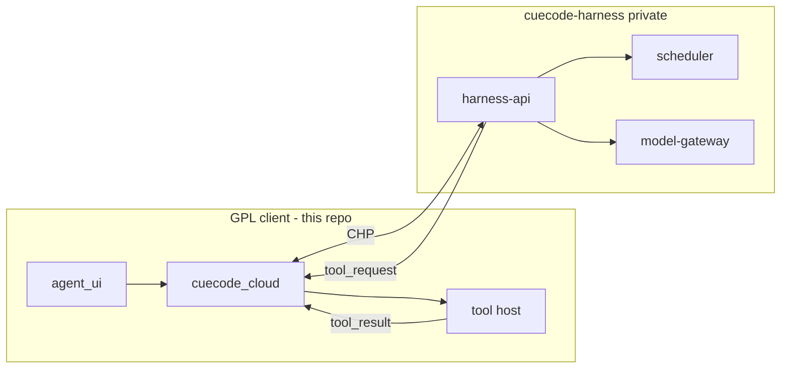
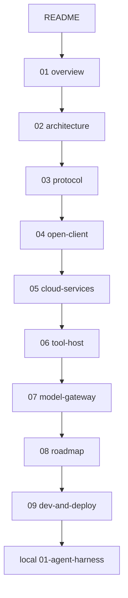

# Cloud harness specs {#cloud-harness-index}

> **Branch:** [harness/cloud/](./README.md) — Model B: proprietary cloud orchestration (production default).  
> **Local fallback:** [harness/local/](../local/01-agent-harness.md) — in-process GPL harness (offline / dev).  
> **Parent index:** [00-README](../../00-README.md)

CueCode ships two harness models. **Model B (cloud)** runs agent orchestration in closed
services (`cuecode-harness` private repo). The GPL IDE (`CueCode-Agents`) is a **thin
client**: transcript rendering, permission UI, local tool execution, OS sandbox.

Related: [harness/README](../README.md), [06-system-design](../core/06-system-design.md),
[10-infrastructure](../ops/10-infrastructure.md), [07-implementation-roadmap](../delivery/07-implementation-roadmap.md#phase-3b)

Agent skill: `.cursor/skills/cuecode-ai-maxxing/SKILL.md`

---

## Model A vs Model B {#model-a-vs-b}

| Aspect | Model A (local) | Model B (cloud) |
|--------|-----------------|-----------------|
| Orchestration | `agent::Thread` in-process | `harness-api` turn engine |
| Transcript SoT | Local session dir | Cloud session store |
| Tool execution | Direct in `agent` | Client tool host ([06](./06-tool-host.md)) |
| Model calls | User BYOK / Ollama | Gateway + optional BYOK ([07](./07-model-gateway.md)) |
| License | GPL stack only | GPL client + proprietary server |
| Default product | Dev / air-gap | CueCode cloud build |

---

## Reading order {#reading-order}

Read in numeric order for first pass. Jump by role using the table below.

| # | Doc | Lines | Read when |
|---|-----|-------|-----------|
| 01 | [overview](./01-overview.md) | ~150 | Choosing cloud vs local; trust boundary |
| 02 | [architecture](./02-architecture.md) | ~200 | Crate/repo split; deployment topology |
| 03 | [protocol](./03-protocol.md) | ~250 | Implementing CHP client or server |
| 04 | [open-client](./04-open-client.md) | ~200 | GPL `cuecode_cloud` — CHP bridge to `acp_thread` |
| 05 | [cloud-services](./05-cloud-services.md) | ~250 | Session, turn engine, scheduler, agents |
| 06 | [tool-host](./06-tool-host.md) | ~225 | Client-side tool execution + permissions |
| 07 | [model-gateway](./07-model-gateway.md) | ~225 | Routing, streaming, BYOK, rate limits |
| 08 | [roadmap](./08-roadmap.md) | ~225 | M0–M4 milestones; migration from local |
| 09 | [dev-and-deploy](./09-dev-and-deploy.md) | E2E | **Agent runbook** — test, run, deploy M0 |

### By persona {#persona-guide}

| Persona | Path |
|---------|------|
| **Product** | 01 → 08 → [13-ai-maxxing](../agent/13-ai-maxxing.md) |
| **GPL client engineer** | [04-open-client](./04-open-client.md) → 03 → 06 → [08-agent-tools](../agent/08-agent-tools-and-skills.md) |
| **Cloud backend engineer** | 01 → 02 → 05 → 07 → 03 |
| **Infra / SRE** | 02 → 07 → [10-infrastructure](../ops/10-infrastructure.md) |
| **Agent implementing M0** | [09-dev-and-deploy](./09-dev-and-deploy.md) → verify gates |

---

## Semantic parity with local harness {#semantic-parity}

Cloud harness **must preserve** semantics defined in [local/01-agent-harness.md](../local/01-agent-harness.md):

| Local concept | Cloud home |
|---------------|------------|
| `ExecutionContext` (Active/Async/Hybrid) | Scheduler in [05 §scheduler](./05-cloud-services.md#scheduler) |
| Built-in agents (`explore`, `plan`, …) | Server agent registry [05 §builtin-agents](./05-cloud-services.md#builtin-agents) |
| `SessionNotificationKind` | CHP `SessionUpdate` + push [03 §notifications](./03-protocol.md) |
| `VERDICT` gate | Turn engine parser [05 §verdict](./05-cloud-services.md#verdict) |
| Tool allowlists | Server enforce + client mirror [06 §allowlist](./06-tool-host.md#server-allowlist) |
| Sidechain transcripts | Cloud SoT; client cache read-only [05 §transcript](./05-cloud-services.md#transcript-source-of-truth) |

Local harness remains the **reference implementation** for semantics and GPUI UX.
Cloud is the **production orchestrator** — not a divergent product.

---

## Repository split {#repo-split}

| Repo | License | Contains |
|------|---------|----------|
| `CueCode-Agents` (this fork) | GPL-3.0-or-later | IDE, `cuecode_cloud`, tool host, UI |
| `cuecode-harness` (private) | Proprietary | `harness-api`, scheduler, model-gateway, prompts |

No proprietary orchestration logic in the GPL tree. Prompt bodies for built-in agents
live in `cuecode-harness`; behavior **outlines** only in [05](./05-cloud-services.md).

---

## Document status {#document-status}

| Field | Value |
|-------|-------|
| Status | Draft |
| Canonical local spec | [../local/01-agent-harness.md](../local/01-agent-harness.md) |
| Implementation milestone | [08-roadmap](./08-roadmap.md) M0–M4 |
| Open questions | [08 §open-questions](./08-roadmap.md#open-questions), [12-open-questions](../ops/12-open-questions.md) |

---

## Cross-links to parent specs {#parent-links}

| Topic | Parent spec |
|-------|-------------|
| Sandbox intents | [04-sandbox-core](../core/04-sandbox-core.md#intent-profiles) |
| Tool inventory | [08-agent-tools-and-skills](../agent/08-agent-tools-and-skills.md) |
| Models / compaction | [10-infrastructure](../ops/10-infrastructure.md#models) |
| Phase 3b harness (local) | [07-implementation-roadmap](../delivery/07-implementation-roadmap.md#phase-3b) |
| System design crates | [06-system-design](../core/06-system-design.md#new-crates) |
