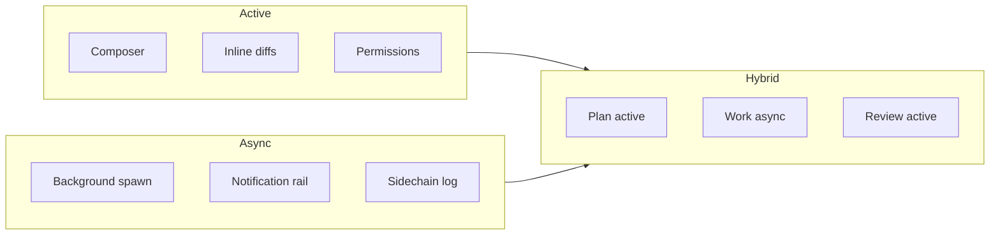
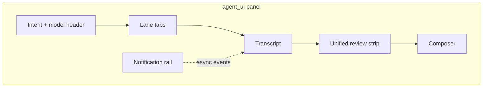
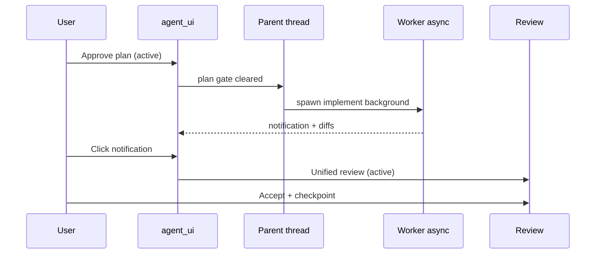

# Local agent harness — Active, Async, and Hybrid {#agent-harness}

> **Branch:** [harness/local/](../README.md#local-harness) — in-process, GPL, IDE-embedded harness.  
> **Production default:** [harness/cloud/](../cloud/README.md) (Model B — proprietary cloud orchestration).  
> This doc defines harness **semantics** and **local fallback** implementation.

CueCode local harness spec: how coding agents run **in-process** in this **Rust / GPUI /
Zed-fork** stack, organized by **when the developer is in the loop**.

Reference research: `claude-code-main/` at the CueInference workspace root (leaked Claude Code CLI — patterns only;
local fallback implements in Rust, native GPUI, GPL stack).

Related: [04-sandbox-core](../core/04-sandbox-core.md), [06-system-design](../core/06-system-design.md),
[08-agent-tools-and-skills](../agent/08-agent-tools-and-skills.md), [13-ai-maxxing](../agent/13-ai-maxxing.md),
[cloud harness](../cloud/01-overview.md)

Agent skill: `.cursor/skills/cuecode-ai-maxxing/SKILL.md`

---

## Summary {#summary}

| Context | Developer | Harness goal |
|---------|-----------|--------------|
| **Active** | Present, steering | Pair-program; low latency; inline review |
| **Async** | Away or "don't block me" | Keep sandbox moving; notify on completion |
| **Hybrid** | Handoff between both | Background work → artifact → active synthesis |

**North star:** Every feature maps to one context (or a documented hybrid handoff).
Hybrid handoffs always produce a **session artifact** — never "the agent said it's fine"
without a checkpoint, plan entry, VERDICT, or spec link.



---

## Rust / crate map {#rust-map}

Existing Zed fork surfaces (extend, don't duplicate):

| Layer | Crate(s) | Harness role |
|-------|----------|--------------|
| Session entity | `acp_thread` | `AcpThread`, plan, terminals, subagent sessions |
| Native agent loop | `agent` | Tools, `Thread`, system prompt, compaction |
| Agent UI | `agent_ui` | Panel, composer, diff review, notifications |
| External agents | `agent_servers`, `acp_tools` | ACP backends |
| Skills | `agent_skills`, `.cursor/skills/` | Playbooks, progressive disclosure |
| Permissions | `agent_settings`, `agent::sandboxing` | Intent → tool rules |
| Edit tracking | `action_log` | Reject, undo, checkpoint input |
| Spawn subagents | `agent::spawn_agent_tool` | `spawn_agent` + `session_id` resume |
| MCP | `context_server*` | Deferred tools (future: tool catalog) |
| Models | `language_model*`, `language_models` | Lane-specific model selection |
| Editor integration | `editor`, `project`, `lsp` | LSP tools, diagnostics, inline assist |
| OS sandbox | `sandbox` | Seatbelt, Bubblewrap |

**New CueCode crates** (see [06-system-design](../core/06-system-design.md)):

| Crate | Harness responsibility |
|-------|------------------------|
| `cuecode_specs` | Spec index, plan ↔ spec sync, `@spec` context |
| `cuecode_sandbox` | Intent profiles, trust graph, checkpoints, **execution context** (Active/Async/Hybrid scheduling) |

### Proposed Rust types (`cuecode_sandbox`) {#rust-types}

```rust
/// When and how an agent lane runs relative to the developer.
pub enum ExecutionContext {
    /// Blocks composer; results inline in main session UI.
    Active,
    /// Background task; delivers SessionNotification when done.
    Async,
    /// Starts async; user synthesizes on notification (coordinator pattern).
    Hybrid,
}

pub enum SessionNotificationKind {
    SubagentCompleted { session_id: String, summary: String },
    VerificationVerdict { verdict: Verdict, evidence_path: PathBuf },
    AwaySummary { message: String },
    ProactiveBrief { message: String },
    LaneConflict { path: PathBuf, lanes: Vec<String> },
}

pub enum Verdict {
    Pass,
    Fail { reason: String },
    Partial { reason: String },
}

pub struct BuiltinAgentDefinition {
    pub id: &'static str,
    pub execution_default: ExecutionContext,
    pub allowed_tools: ToolAllowlist,
    pub disallowed_tools: &'static [&'static str],
    pub model_hint: ModelHint, // Fast | Inherit | Default
    pub omit_spec_index: bool, // Read-only lanes skip full spec body
}
```

Wire `ExecutionContext` into `spawn_agent` tool schema (foreground vs background) and
`agent_ui` task pill / notification rail.

### Data flow (ASCII) {#data-flow}

```
User input (agent_ui)
       │
       ▼
AcpThread ──────────────────────────────┐
       │                                │
       ▼                                │
agent::Thread (tools, model)            │
       │                                │
       ├──► spawn_agent (foreground)     │ subagent session_id
       │         │                      │
       │         ▼                      ▼
       │    inline SessionUpdate    sidechain.jsonl
       │                                │
       └──► spawn_agent (background)     │
                 │                      │
                 ▼                      ▼
            Task handle            on complete
                 │                      │
                 └──────────► SessionNotification
                                       │
                                       ▼
                              agent_ui notification rail
```

---

## Three execution contexts {#three-contexts}

### Active {#active}

**Definition:** Developer is present (window focused, recent input, or explicitly
waiting). Work must be **interruptible**, **visible**, and **low-latency**.

**Default UX:** Main `agent_ui` conversation, inline diffs, permission prompts, LSP/diagnostics.

**Policies when active:**

- Prefer **foreground** Explore only for answers needed in <30s
- Launch **background** for deep search, full verify, multi-file survey
- Collapse read/grep noise in transcript (UI grouping)
- No proactive notifications except blockers or verify FAIL

### Async {#async}

**Definition:** Developer away, multitasking, or opted into "run in background."
Work completes via **structured notification** — parent does not poll.

**Default UX:** Task badge, notification list, away summary on return, sidechain transcript on disk.

**Policies when async:**

- Parallel read-only research OK
- One writer per overlapping file set
- Post-turn housekeeping OK (memory, compact, cron)
- Proactive brief only for high-signal events

### Hybrid {#hybrid}

**Definition:** Starts in one context, finishes in another. Requires explicit **handoff artifact**.

**Examples:** Plan (active) → Implement (active/async) → Verify (async) → Review (active);
coordinator chat (active) + workers (async) → synthesis (active).

---

## Harness UI overview {#harness-ui-overview}

The harness is not only backend `Task` handles — it is **visible GPUI chrome** in `agent_ui`.

| UI region | Active | Async | Hybrid |
|-----------|--------|-------|--------|
| Main composer | Primary input | Read-only or coordinator | Synthesis after notify |
| Transcript | Full stream | Collapsed groups | Parent + "N background jobs" |
| Task pills | Spinner on foreground | Badge count | Mixed |
| Notification rail | Hidden (except FAIL) | Primary feedback | Handoff clicks |
| Lane panel | Tab per lane | Async lanes dimmed | Coordinator highlighted |
| Unified review | Inline accept/reject | Opens on notify click | VERDICT + diffs |
| Intent header | Always visible | Shows active workers | Orchestrate badge |



---

## Active mode UI {#active-ui}

### Composer states {#composer-states}

| State | Visual | Input |
|-------|--------|-------|
| Ready | Default border | Enabled |
| Streaming | Pulse on model icon | Queue or interrupt |
| Tool running | Tool name in status line | Cancel optional |
| Permission wait | Modal overlay | Approve/deny |
| Plan gate | "Approve plan to implement" banner | Plan actions only |

### Inline diff strip {#inline-diff}

Active implement flows show hunks in **unified review** without leaving composer focus:

```
┌─ Unified review (active) ─────────────────────────────────────┐
│ Plan: 2/5 complete   Spec: 04-sandbox-core#intent-profiles   │
├───────────────────────────────────────────────────────────────┤
│ ▼ agent/src/sandboxing.rs  +12 -3                            │
│   pub fn apply_intent_policy(...) {                           │
│ ▼ crates/agent_ui/notification.rs  +44                      │
├───────────────────────────────────────────────────────────────┤
│ [Accept all] [Reject] [Open in editor] [Checkpoint]           │
└───────────────────────────────────────────────────────────────┘
```

### Active product story: pair-program fix {#story-active-fix}

Dev hits compile error, stays in **Active** implement:

1. Diagnostics tool surfaces errors in transcript (collapsed).
2. Agent proposes edit; diff appears in unified review **immediately**.
3. User accepts single hunk; checkpoint auto-offered.
4. Foreground `cargo check` in sandboxed terminal — output grouped.
5. No notification rail noise — all inline.

**Crates:** `agent_ui::conversation_view`, `action_log`, `agent::sandboxing`.

---

## Async mode UI {#async-ui}

### Task pills {#task-pills}

When background jobs run, show pills above composer:

```
┌─ Task pills ──────────────────────────────────────────────────┐
│  ● explore "map agent_ui"   ◐ verify turn-12   ✓ plan done  │
└───────────────────────────────────────────────────────────────┘
```

| Pill state | Meaning |
|------------|---------|
| `●` spinning | In progress |
| `◐` partial | Streaming / waiting on tool |
| `✓` | Complete — click opens sidechain summary |
| `✗` | Failed — click opens error + retry |

Implementation sketch: `agent_ui` entity `BackgroundTaskBar` subscribed to `acp_thread` notifications.

### Notification rail UI {#notification-rail-ui}

**Primary async feedback surface.** Right edge or bottom drawer of agent panel.

```
┌─ Agent panel ────────────────────────────────┬─ Notifications ─┐
│ [Explore][Implement][Verify]  Intent: Fix    │ 2 unread        │
├──────────────────────────────────────────────┤                 │
│ Transcript (collapsed background tools)      │ ● Verify FAIL   │
│                                              │   turn 12       │
│ > Implemented auth fix (async)               │   [Open review] │
│   3 files — see notification                 │                 │
│                                              │ ○ Explore done  │
│                                              │   map agent_ui  │
│                                              │   [Summarize]   │
│                                              │                 │
│                                              │ ✓ Away summary  │
│                                              │   20m away      │
├──────────────────────────────────────────────┤                 │
│ Composer                                     │ [Mark all read] │
└──────────────────────────────────────────────┴─────────────────┘
```

**Interaction model:**

| Gesture | Action |
|---------|--------|
| Click notification | Focus unified review with artifact |
| Mark read | Clears badge; keeps history |
| Open sidechain | Loads full subagent transcript (optional tab) |
| Retry | Re-spawn failed async job with same `session_id` policy |

**Notification card structure (GPUI):**

```rust
pub struct NotificationCard {
    pub kind: SessionNotificationKind,
    pub timestamp: DateTime<Utc>,
    pub read: bool,
    pub action: NotificationAction, // OpenReview | Summarize | Retry
}
```

### Session notification envelope {#notification-envelope}

Deliver as structured metadata on `AcpThread` + optional user-role message:

```xml
<session-notification>
  <session-id>sub-8f3a</session-id>
  <kind>verification_verdict</kind>
  <summary>VERDICT: FAIL — tests/auth_test.rs</summary>
  <result-path>~/.config/cuecode/sessions/.../verdicts/12.md</result-path>
</session-notification>
```

Parse in `acp_thread`; render in `agent_ui` — **never** rely on model prose alone.

### Async product story: deep explore while in meeting {#story-async-meeting}

1. User spawns **explore** with `run_in_background: true` before joining call.
2. Pill shows `● explore`; composer still usable for notes.
3. On complete, rail shows `○ Explore done — 14 files surveyed`.
4. User clicks **Summarize** → parent thread inserts synthesis (Hybrid handoff).
5. Sidechain JSONL preserved for audit.

---

## Hybrid mode UI {#hybrid-ui}

### Handoff flow (diagram) {#hybrid-handoff-diagram}



### Coordinator composer (Orchestrate intent) {#coordinator-ui}

When intent = **Orchestrate**, composer becomes coordinator-only:

```
┌─ Orchestrate (Hybrid coordinator) ──────────────────────────────┐
│ Tools: spawn_agent, read_spec, plan — NO edit/terminal        │
├───────────────────────────────────────────────────────────────┤
│ Active workers: implement (async), verify (async)               │
│                                                               │
│ You: Spawn implement for plan items 3-5                       │
│ Coordinator: Started worker sub-9a2 — notification pending    │
│                                                               │
│ [Rail] implement sub-9a2 complete → 2 files                   │
├───────────────────────────────────────────────────────────────┤
│ Composer: synthesize results for user...                      │
└───────────────────────────────────────────────────────────────┘
```

### Hybrid product story: ship with verify gate {#story-hybrid-ship}

1. **Active:** User approves plan linked to `07-implementation-roadmap`.
2. **Async:** Implement worker edits files; notification → review.
3. **Active:** User accepts; checkpoint.
4. **Async:** Verification agent runs tests → `VERDICT: PASS`.
5. **Active:** Review panel shows VERDICT evidence; user marks session complete.

Artifact chain: plan entry → checkpoint → VERDICT file — satisfies [C.5](#c-5-hybrid-handoff-artifacts-required).

---

## Lane panel UI {#lane-panel-ui}

**Multi-lane** = parallel specialized agents with shared spec index and conflict rules.
**No tmux** — GPUI tabs only.

```
┌─ Lanes ───────────────────────────────────────────────────────────┐
│  [Coordinator*] [Explore ○] [Implement ●] [Verify ◐] [+ Add]   │
├───────────────────────────────────────────────────────────────────┤
│ * Coordinator = parent thread (Orchestrate only)                    │
│ ○ = idle   ● = active/foreground   ◐ = async running              │
├───────────────────────────────────────────────────────────────────┤
│ Shared: spec index · session id · checkpoint stack (parent)       │
│ Conflict: implement + verify cannot write same path set           │
└───────────────────────────────────────────────────────────────────┘
```

### Lane panel ASCII (full panel mockup) {#lane-panel-full}

```
╔═══════════════════════════════════════════════════════════════════╗
║ CueCode — Agent Session                          Intent: [Fix ▼]  ║
╠═══════════════════════════════════════════════════════════════════╣
║ Lanes                                                             ║
║ ┌────────────┬────────────┬────────────┬────────────┐             ║
║ │Coordinator │ Explore    │ Implement  │ Verify     │             ║
║ │  (parent)  │  async ✓   │  active ●  │  async ◐   │             ║
║ └────────────┴────────────┴────────────┴────────────┘             ║
╠═══════════════════════════════════════════════════════════════════╣
║ Transcript — Implement lane (active)                              ║
║ ┌─────────────────────────────────────────────────────────────┐   ║
║ │ ▶ Searched 8 files (collapsed)                              │   ║
║ │ ▶ Edited crates/auth/login.rs                               │   ║
║ │ ▶ Running sandboxed: cargo test -p auth                      │   ║
║ └─────────────────────────────────────────────────────────────┘   ║
╠═══════════════════════════════════════════════════════════════════╣
║ Unified review                                                    ║
║  auth/login.rs +24 -6          [Accept] [Reject] [Diff]           ║
╠═══════════════════════════════════════════════════════════════════╣
║ Composer                                                          ║
║ │ Fix the remaining auth edge case from verify feedback_        │   ║
║ └───────────────────────────────────────────────────────────────  ║
╠══════════════════════════════╦════════════════════════════════════╣
║                              ║ Notifications (2)                  ║
║                              ║ ┌──────────────────────────────┐ ║
║                              ║ │ VERIFY FAIL — auth_test      │ ║
║                              ║ │ [Open evidence]              │ ║
║                              ║ ├──────────────────────────────┤ ║
║                              ║ │ EXPLORE done — 14 files      │ ║
║                              ║ │ [Insert summary]             │ ║
║                              ║ └──────────────────────────────┘ ║
╚══════════════════════════════╩════════════════════════════════════╝
```

### Lane switching behavior {#lane-switch}

| Action | GPUI behavior |
|--------|---------------|
| Click lane tab | Filter transcript to sub-session; composer targets lane |
| Add lane | Spawn default agent for intent (explore async, implement active) |
| Close lane | Cancel `Task` if running; keep sidechain on disk |
| Conflict detected | `LaneConflict` notification; block second writer |

Lanes = separate sub-sessions keyed by `session_id` under one parent `AcpThread` ([Q13](../ops/12-open-questions.md#q13-lanes)).

---

## Part A — Active harness {#part-a-active}

Features that assist **while the developer codes**.

### A.1 Main thread and composer {#a-1-main-thread}

| Feature | Rust touchpoints | Status |
|---------|------------------|--------|
| Session-first composer | `agent_ui::message_editor`, `conversation_view` | Exists |
| Intent switcher | `cuecode_sandbox` + `agent_ui` header | Planned Phase 2 |
| Spec index in prompt | `cuecode_specs` + `agent/templates/system_prompt.hbs` | Planned Phase 1 |
| Inline / terminal assist | `inline_assistant`, `terminal_*` | Exists |
| Structured user questions | New tool or GPUI modal | Planned |
| Permission prompts | `agent_settings`, tool permission UI | Exists |
| Unified review strip | `agent_ui` + `action_log` | Planned Phase 3 |
| Tool group collapse | `agent_ui` transcript renderer | Planned Beta |

### A.2 Active typed agents (built-in) {#a-2-active-agents}

Implement as **Rust-enforced tool allowlists** + prompt templates — not prompt-only honor system.

| Agent ID | When to use | Tools | Model | `omit_spec_index` |
|----------|-------------|-------|-------|-------------------|
| `explore` | Codebase search, architecture questions | read, grep, find_path, find_references, diagnostics, list_directory | fast / small | yes |
| `plan` | Implementation strategy before edits | same as explore | inherit | yes |
| `implement` | Multi-step fixes and features | all except spawn (configurable) | inherit | no |
| `review` | Human-led diff walkthrough | read, diagnostics, get_code_actions | inherit | no |

Registration: extend `spawn_agent_tool` with `agent_type: Option<String>` matching
definitions loaded from `.agents/agents/*.md` (Agent Skills format) **or** hardcoded
`cuecode_sandbox::builtin_agents()` for v1.

### A.3 Active tools (native `crates/agent`) {#a-3-active-tools}

Already shipped — keep and extend:

| Tool | Active use |
|------|------------|
| `read_file`, `grep`, `find_path`, `find_references` | Navigation |
| `edit_file`, `write_file`, rename/move/copy/delete | Implement |
| `terminal`, `sandboxed_terminal` | Run tests/build |
| `diagnostics`, `get_code_actions` | Fix loop |
| `skill` | Load playbook body |
| `spawn_agent` | Foreground delegate when blocking |
| `fetch`, `web_search` | Research (intent-gated) |
| `list_agents_and_models` | Meta |

Planned active additions:

| Tool | Purpose |
|------|---------|
| `list_specs` / `read_spec` | SDAL ([08](../agent/08-agent-tools-and-skills.md#new-tools)) |
| `create_checkpoint` / `restore_checkpoint` | Session rewind |
| `ask_user` | Structured multiple-choice mid-flow |

### A.4 Active context economy {#a-4-context-economy}

Long active sessions must not die on context limits:

| Mechanism | Implementation sketch |
|-----------|----------------------|
| Auto-compact | Existing `agent` compaction; preserve intent + linked spec path |
| Collapsed tool groups | `agent_ui` — group grep/read into "Searched N files" |
| Tool result spill | Large outputs → disk under session dir; `read_file` to fetch |
| File state cache | Track what model saw; require read before edit if partial/stale |
| Spec index as attachment | Inject catalog via system message delta, not mutating tool schema |

### A.5 Active CueCode moats (native GPUI) {#a-5-active-moats}

| Feature | Crates |
|---------|--------|
| Unified review (plan \| diffs \| terminal \| spec) | `agent_ui`, `cuecode_specs` |
| Checkpoint rewind in editor | `cuecode_sandbox`, `action_log` |
| Intent-bound permissions | `cuecode_sandbox`, `agent_settings` |
| Deep LSP (hover, symbols, call hierarchy) | Extend `go_to_definition` / new LSP tool |

---

## Part B — Async harness {#part-b-async}

Features that run **while the developer is away** or explicitly non-blocking.

### B.1 Background subagents {#b-1-background-subagents}

Extend `SpawnAgentToolInput`:

```rust
pub struct SpawnAgentToolInput {
    pub label: String,
    pub message: String,
    pub session_id: Option<SessionId>,
    /// Default false for implement; true for verify and deep explore.
    pub run_in_background: bool,
    pub agent_type: Option<String>,
}
```

**Notification protocol** (deliver as user-role message or ACP `SessionUpdate`):

```xml
<session-notification>
  <session-id>...</session-id>
  <kind>subagent_completed|verification_verdict|...</kind>
  <summary>...</summary>
  <result>...</result>
</session-notification>
```

Implement in `acp_thread` + `agent_ui` notification rail. Store full transcript in
sidechain path keyed by `session_id` (mirror Claude Code sidechain storage).

### B.2 Verification agent (async gate) {#b-2-verification-agent-async-gate}

| Field | Value |
|-------|-------|
| `agent_type` | `verification` |
| `execution_default` | Async |
| `disallowed_tools` | edit, write, spawn |
| Output | `VERDICT: PASS\|FAIL\|PARTIAL` + command evidence blocks |
| Blocks | Session "complete" / ship intent until PASS or user override |

Prompt body: adapt adversarial verify pattern from leak (`verificationAgent.ts`).
Skill: `/verify` in `.cursor/skills/` invokes this agent.

**UI on FAIL:** notification rail red card + unified review opens evidence markdown.

### B.3 Post-turn async jobs (stop hooks) {#b-3-post-turn-jobs}

Run on main thread **after** turn completes (`agent` thread loop — new hook point):

| Job | Trigger | Rust home |
|-----|---------|-----------|
| Session notes update | Auto-compact boundary | `cuecode_sandbox` or `agent` compact hook |
| Spec learnings extract | Stop hook, optional | Forked `spawn_agent` or background task |
| Prompt suggestion | Stop hook, optional | Background inference → composer ghost text |
| Away summary | GPUI window unfocused N minutes | `agent_ui` + background summary task |

**Rule:** Subagents must not overwrite main-thread stop-hook state (match leak:
`query/stopHooks.ts` main-session guard).

### B.4 Proactive / scheduled (later phases) {#b-4-proactive}

| Feature | Context | Notes |
|---------|---------|-------|
| Cron agent runs | Async | Headless; `agent_servers` or native cron tool |
| PR / CI webhook → session message | Async → Hybrid | Inject as notification; user reads active |
| Nightly verify on branch | Async | Dogfood metric driver |
| Magic spec docs | Async | `# CUE SPEC:` header; update on read + background sync |

Defer until Beta ([07 Phase 5+](../delivery/07-implementation-roadmap.md#phase-5)).

### B.5 Async artifacts (on disk) {#b-5-async-artifacts-on-disk}

| Artifact | Path pattern | Purpose |
|----------|--------------|---------|
| Sidechain transcript | `~/.config/cuecode/sessions/<id>/sidechains/<session_id>.jsonl` | Full subagent log |
| Tool result spill | `.../tool-results/` | Huge grep/terminal output |
| Session memory doc | `.../session-notes.md` | Structured compact summary |
| Verify evidence | `.../verdicts/<turn>.md` | Parsed VERDICT + commands |

---

## Part C — Hybrid harness {#part-c-hybrid}

Patterns that **span** active and async.

### C.1 Coordinator-lite (Orchestrate intent) {#c-1-coordinator-lite-orchestrate-intent}

Main session **Orchestrate** intent:

- **Active:** User + coordinator composer; coordinator may read specs/plan
- **Async:** `spawn_agent` workers (explore, implement, verify)
- **Active again:** Coordinator synthesizes worker results; never "based on findings, fix it" in worker prompts

Coordinator tool allowlist (main thread): `spawn_agent`, send-message equivalent
(resume via `session_id`), stop task, read_spec — **no edit/terminal** on coordinator.

Implementation: intent profile in `cuecode_sandbox` + dynamic tool filter in
`agent::Thread` tool registry.

### C.2 Plan → Ship pipeline {#c-2-plan-ship-pipeline}

| Step | Context | Artifact |
|------|---------|----------|
| Enter Plan intent | Active | Plan entries in `AcpThread.plan` + optional spec file |
| User approves plan | Active | Exit plan gate (permission / UI) |
| Implement | Active or async | Diffs + checkpoints |
| Verify | Async | VERDICT file |
| Review | Active | Unified review panel |

Wire `EnterPlanMode` equivalent to **Review/Explore intent + plan file**, not a separate binary.

### C.3 Fork-style research (optional, Hybrid) {#c-3-fork-research}

**Goal:** Background research sharing parent context without re-injecting full spec body.

CueCode approach (no TS fork cache — adapt conceptually):

1. Parent spawns background `explore` with **summary of parent turn** in message (not full transcript v1)
2. Sidechain transcript isolated
3. Notification on complete; parent summarizes for user

Future: share prompt cache via same model + system prefix hash (optimization).

### C.4 Multi-lane (GPUI-native swarms) {#c-4-multi-lane-gpui-native-swarms}

**No tmux.** Parallel lanes in `agent_ui`:

| Lane | Default context | Shared state |
|------|-----------------|--------------|
| Explore | Async | Spec index, session id |
| Implement | Active | Checkpoints, plan |
| Verify | Async | Changed files list |
| Coordinator | Active | Task notifications |

Lanes = separate sub-sessions with shared `cuecode_specs` index and
conflict rules (one writer per path set).

See [05-innovations](../core/05-innovations.md#multi-lane), [09-ui-ux-spec](../design/09-ui-ux-spec.md),
[§Lane panel UI](#lane-panel-ui).

### C.5 Hybrid handoff artifacts (required) {#c-5-hybrid-handoff-artifacts-required}

Every hybrid flow must produce at least one:

| Artifact | Crate |
|----------|-------|
| Plan entry / plan file | `acp_thread`, `cuecode_specs` |
| Checkpoint | `cuecode_sandbox`, `action_log` |
| VERDICT | `cuecode_sandbox` |
| Spec section link | `cuecode_specs` |
| Task list item | `AcpThread.plan` or future task entity |
| Notification envelope | `acp_thread` metadata |

---

## Feature matrix: Active / Async / Hybrid {#feature-matrix}

| Capability | Active | Async | Hybrid | Primary Rust home |
|------------|--------|-------|--------|-------------------|
| Main composer | ● | | | `agent_ui`, `agent` |
| Explore agent | ● | ○ | ● | `spawn_agent_tool`, `cuecode_sandbox` |
| Plan agent | ● | | ● | same |
| Implement agent | ● | ○ | ● | same |
| Verification agent | | ● | ● | same + notification |
| Coordinator / Orchestrate | ● | ● | ● | intent + tool filter |
| `spawn_agent` foreground | ● | | ● | `agent` |
| `spawn_agent` background | | ● | ● | `agent`, `acp_thread` |
| Session notification | | ● | ● | `acp_thread`, `agent_ui` |
| Notification rail UI | | ● | ● | `agent_ui` |
| Task pills | ○ | ● | ● | `agent_ui` |
| Lane panel | ○ | ● | ● | `agent_ui` |
| Intent switcher | ● | | | `cuecode_sandbox`, `agent_ui` |
| Trust graph | ● | ○ | ● | `cuecode_sandbox` |
| Checkpoints | ● | | ● | `cuecode_sandbox`, `action_log` |
| Unified review | ● | | ● | `agent_ui` |
| Spec index / SDAL | ● | | ● | `cuecode_specs` |
| Skills | ● | ○ | ● | `agent_skills` |
| Post-turn memory extract | | ● | | `agent` hook |
| Away summary | | ● | | `agent_ui` |
| Auto-compact / session notes | ○ | ● | ● | `agent` |
| Worktree isolation | ○ | ● | ● | `project`, git, sandbox |
| Cron / scheduled agent | | ● | | future |
| MCP deferred catalog | ● | | | `context_server`, `agent` |
| Inline assist | ● | | | `inline_assistant` |

● = primary · ○ = secondary

---

## Built-in agent roster (CueCode v1 target) {#builtin-agents}

Ship definitions in `cuecode_sandbox` (Rust) + optional `.agents/agents/*.md` overrides.

| ID | `execution_default` | Read-only | Background default | Blocks completion |
|----|---------------------|-----------|--------------------|-------------------|
| `explore` | Hybrid | yes | yes | no |
| `plan` | Active | yes | no | no |
| `implement` | Active | no | no | no |
| `verification` | Async | yes* | yes | yes (FAIL) |
| `coordinator` | Active | yes | n/a (main thread) | no |

\*Verify may run bash/tests read-only; no project file writes.

**Tool enforcement:** Filter in `agent::tools` registration when `agent_type` set —
same pattern as Claude Code `filterToolsForAgent` in `constants/tools.rs` equivalent.

---

## Skills ↔ agents ↔ intents {#skills-agents-intents}

| Skill (`.cursor/skills/`) | Typical context | Invokes |
|---------------------------|-----------------|---------|
| `cuecode-ai-maxxing` | Active (Cursor) | doctrine |
| `implement-spec` | Hybrid | plan agent → implement |
| `explore-codebase` | Active/Async | explore agent |
| `/verify` (planned) | Async | verification agent |
| User project skills | Active | `skill` tool |

Frontmatter extensions (Agent Skills spec):

```yaml
agent: verification
context: fork  # maps to background spawn with isolated transcript
```

---

## Implementation phases (mapped to [07](../delivery/07-implementation-roadmap.md)) {#phases}

### Harness v1 — Alpha (Phases 0–3) {#phase-v1-alpha}

| Deliverable | Context | UI |
|-------------|---------|-----|
| Built-in `explore` / `plan` tool walls | Active | Transcript |
| `run_in_background` + notifications | Async | Task pills + rail v1 |
| `verification` agent + VERDICT | Async | FAIL card in rail |
| Checkpoints + unified review | Active + Hybrid | Review strip |
| Spec index | Active | Spec chip in header |

### Harness v2 — Beta (Phases 4–5) {#phase-v2-beta}

| Deliverable | Context | UI |
|-------------|---------|-----|
| Trust graph + auto-allow | Active + Async | Permission toasts |
| Multi-lane UI | Hybrid | Lane panel tabs |
| Coordinator / Orchestrate intent | Hybrid | Coordinator composer |
| Collapse tool groups + result spill | Active | Collapsed transcript |
| Away summary | Async | Rail card on focus |

### Harness v3 — Post-Beta {#phase-v3-post-beta}

| Deliverable | Context | UI |
|-------------|---------|-----|
| Post-turn session notes / extract | Async | Session notes tab |
| Cron agents | Async | Scheduled pill |
| Worktree isolation per Ship session | Hybrid | Worktree badge |
| Prompt suggestion / speculation accept | Hybrid | Ghost text in composer |
| Magic spec docs | Hybrid | Spec auto-sync indicator |

---

## Default policies {#policies}

1. **Hybrid handoff requires an artifact** (see [C.5](#c-5-hybrid-handoff-artifacts-required))
2. **Never fabricate async results** — coordinator waits for notification
3. **Read-only agents enforced in Rust**, not only in prompts
4. **Subagent omit spec body** when `omit_spec_index` — parent interprets ([13](../agent/13-ai-maxxing.md))
5. **Local-first** — all harness features work without zed.dev
6. **Errors propagate to UI** — async failures surface in notification rail
7. **One writer per path set** — lane conflicts emit `LaneConflict` notification
8. **Cancel is safe** — dropping `Task` cancels background job without poisoning parent

---

## GPUI implementation guide {#gpui-guide}

| Component | Entity sketch | Subscriptions |
|-----------|---------------|---------------|
| `NotificationRail` | `Vec<NotificationCard>` | `acp_thread` events |
| `LanePanel` | `Vec<LaneTab>` | sub-session metadata |
| `TaskPillBar` | active background tasks | spawn/cancel |
| `UnifiedReview` | diffs + plan + verdict | `action_log`, spec proposals |

Patterns from `ui-ux-gpui` skill:

- Use `cx.listener` for composer and notification clicks
- `cx.spawn` for async UI updates after background completion
- `cx.notify()` when rail unread count changes
- Never update entity while already updating (GPUI borrow rules)

---

## Research index (claude-code-main) {#research-index}

> **Full inventory:** [research/00-claude-code-inventory.md](../../research/00-claude-code-inventory.md) — all tools, commands, services with Adopt/Adapt/Defer/Reject.  
> **Policy:** [research/01-parity-decisions.md](../../research/01-parity-decisions.md) · **Program:** [15-competitive-parity.md](../../parity/15-competitive-parity.md)

Legacy quick map (see inventory for complete rows):

| Leak area | CueCode port |
|-----------|--------------|
| `tools/AgentTool/*` | `spawn_agent_tool`, builtin defs in `cuecode_sandbox` |
| `coordinator/coordinatorMode.ts` | Orchestrate intent + tool filter → [18 §coordinator](../../parity/18-teams-and-tasks.md#coordinator) |
| `query/stopHooks.ts` | Post-turn hooks → [17 §stop-hooks](../../parity/17-memory-and-context.md#stop-hooks) |
| `utils/forkedAgent.ts` | Background spawn + sidechain (v2) |
| `tasks/LocalAgentTask/*` | GPUI task pill + notifications |
| `utils/fileHistory.ts` | `cuecode_sandbox` checkpoints |
| `utils/toolResultStorage.ts` | Tool result spill |
| `skills/loadSkillsDir.ts` | Already mirrored in `agent_skills` |
| `constants/tools.ts` | Tool allowlists per agent type |
| `memdir/*` | Memory store → [17](../../parity/17-memory-and-context.md) |
| `Task*`, `Team*`, `SendMessage` | Lane + task protocol → [18](../../parity/18-teams-and-tasks.md) |

---

## Product stories index {#product-stories-index}

| Story | Context | Section |
|-------|---------|---------|
| Pair-program fix | Active | [§Active product story](#story-active-fix) |
| Deep explore in meeting | Async | [§Async product story](#story-async-meeting) |
| Ship with verify gate | Hybrid | [§Hybrid product story](#story-hybrid-ship) |
| Fix auth (maxxing) | Hybrid | [13 §story-fix-auth](../agent/13-ai-maxxing.md#story-fix-auth) |
| Multi-lane implement + verify | Hybrid | [§Lane panel](#lane-panel-full) |

---

## Testing harness features {#testing}

| Test type | Command / approach |
|-----------|-------------------|
| Tool allowlist | `cargo test -p agent` — spawn_agent + filter |
| Notification parse | `cargo test -p acp_thread` |
| GPUI rail / lanes | `agent_ui` visual tests — `gpui-test` skill |
| VERDICT gate | Integration: verify FAIL blocks Ship complete |
| Sidechain persistence | Filesystem temp dir tests in `cuecode_sandbox` |

Reproduce flaky GPUI tests with scheduler seeds per `gpui-test` skill.

---

## Open questions {#open-questions}

Track resolutions in [12-open-questions](../ops/12-open-questions.md#harness-open):

1. Single `AcpThread` vs multiple threads for multi-lane v1? → [Q13](../ops/12-open-questions.md#q13-lanes)
2. Background spawn: in-process async task vs separate ACP connection? → [Q14](../ops/12-open-questions.md#q14-background)
3. VERDICT parser: strict line-based vs structured JSON tool output? → [Q15](../ops/12-open-questions.md#q15-verdict)
4. Coordinator: separate built-in prompt template vs intent-only? → [Q16](../ops/12-open-questions.md#q16-coordinator)

---

## Checklist for new harness features {#checklist}

Before shipping:

- [ ] Classified Active / Async / Hybrid
- [ ] Handoff artifact named if Hybrid
- [ ] Rust tool enforcement if agent-typed
- [ ] UI path for notifications (async) or inline (active)
- [ ] Notification rail / lane / pill mock aligned with this spec
- [ ] Sidechain or artifact path on disk if async
- [ ] Spec section linked in PR
- [ ] Works local / BYOK
- [ ] Failure visible in `agent_ui`
- [ ] Cancel does not poison parent session
- [ ] `./script/clippy` + targeted tests

---

## Verification agent prompt outline (Rust port) {#verification-prompt-outline}

Port target: `crates/agent/templates/verification_system_prompt.hbs` (new) + optional
`.agents/agents/verification.md` override. Pattern source: adversarial verify from
leak research ([§research-index](#research-index)); enforce with Rust tool wall.

### Section 1: Role and mission {#verify-prompt-role}

```
You are the CueCode Verification Agent — an adversarial, read-only checker.

Your job is to PROVE whether the session's proposed changes work — not to fix code,
not to suggest features, not to agree with the implement agent.

You run in the background (Async). The user may be away. Your output must be
machine-parseable via submit_verdict AND human-readable in the evidence file.
```

**Rust wiring:** `agent_type: "verification"`, `execution_default: Async`,
`omit_spec_index: false` (need changed file list, not full spec catalog).

### Section 2: Hard constraints {#verify-prompt-constraints}

```
CONSTRAINTS (enforced in Rust — violations are tool errors):

- DO NOT call edit_file, write_file, delete_file, rename, move, or spawn_agent.
- DO NOT modify .cursor/specs/ files.
- Terminal commands: read-only verification only (tests, lint, build check).
- DO NOT claim PASS without running at least one verification command OR
  explicitly marking PARTIAL with reason "no test target found".
- DO NOT fabricate command output — paste truncated real output in evidence.
- If tests fail, verdict is FAIL — never PASS with caveats.
```

### Section 3: Inputs you receive {#verify-prompt-inputs}

```
You will receive:
- Parent session summary (intent, linked spec anchors)
- List of changed files since last checkpoint
- Optional: implement agent summary message
- Optional: user-specified verify commands from plan

You will NOT receive full parent transcript (context economy).
Read additional files with read_file if needed.
```

### Section 4: Verification procedure {#verify-prompt-procedure}

```
PROCEDURE (follow in order):

1. INVENTORY — List changed files; note crate boundaries (Cargo workspace).
2. SELECT CHECKS — Prefer in order:
   a. User/plan specified command
   b. ./script/clippy (if Rust touched)
   c. cargo test -p <affected_crates>
   d. cargo check -p <affected_crates>
3. RUN — Execute via sandboxed terminal (Fix/Ship sandbox policy).
4. INSPECT — On failure, read relevant source; diagnose root cause briefly.
5. VERDICT — Call submit_verdict with structured JSON (required).
6. EVIDENCE — Ensure verdict markdown mirrors commands + truncated output.
```

### Section 5: Verdict rubric {#verify-prompt-rubric}

```
PASS — All selected checks exited 0; no obvious missing tests for changed logic.

FAIL — Any check failed, crash, or unverified risky change (security, sandbox).

PARTIAL — Could not run full suite (missing deps, no tests exist, timeout).
         Include reason and what WAS verified.

Ship intent blocks on FAIL until user override with confirm.
```

### Section 6: submit_verdict tool contract {#verify-prompt-tool}

```json
{
  "status": "pass | fail | partial",
  "summary": "One sentence for notification rail",
  "commands": [
    {
      "command": "cargo test -p agent",
      "exit_code": 0,
      "output_tail": "… last 40 lines …"
    }
  ],
  "failed_tests": ["optional test name paths"],
  "changed_files_reviewed": ["crates/agent/src/thread.rs"],
  "spec_anchors_checked": ["harness/local/01-agent-harness.md#verification-prompt-outline"]
}
```

**Rust:** `submit_verdict` is the **only** write path — writes to session `verdicts/` dir.

### Section 7: Evidence markdown template {#verify-prompt-evidence}

```markdown
# Verification evidence — turn {{turn}}

**Verdict:** PASS | FAIL | PARTIAL
**Agent:** verification
**Session:** {{session_id}}

## Commands

| Command | Exit | Notes |
|---------|------|-------|
| `cargo test -p agent` | 0 | |

## Output (tail)

\`\`\`
…
\`\`\`

## Analysis

[2-5 sentences — factual, adversarial]

## Spec compliance

- [ ] Linked spec sections honored (if applicable)
```

### Section 8: Unhappy paths {#verify-prompt-unhappy}

```
- Command timeout → PARTIAL; suggest narrower test command in summary.
- Sandbox deny → PARTIAL; note SANDBOX_DENIED in summary (triggers toast copy).
- No Rust changes → run closest applicable check or PARTIAL with reason.
- Flaky test → FAIL if fails on retry once; note flake in failed_tests.
```

### Section 9: Prompt assembly (Handlebars sketch) {#verify-prompt-assembly}

```handlebars
{{> partial_role_verification}}

Changed files:
{{#each changed_files}}
- {{this}}
{{/each}}

Linked specs:
{{#each spec_anchors}}
- {{this}}
{{/each}}

{{> partial_verify_procedure}}
{{> partial_verdict_rubric}}
```

### Section 10: Tests for prompt port {#verify-prompt-tests}

| Test | Assert |
|------|--------|
| Tool wall | `edit_file` denied for verification agent_type |
| submit_verdict required | Session without tool call → FAIL parse fallback |
| Evidence file exists | Path under `verdicts/<turn>.md` |
| Notification | FAIL → red card in rail |
| Ship gate | FAIL blocks `session_complete` |

---

## Built-in agent system prompt outlines {#builtin-prompt-outlines}

Rust port targets: `crates/agent/templates/{explore,plan,implement}_system_prompt.hbs`
+ `cuecode_sandbox::builtin_agents()`. Prompts are **short** — skills and specs supply depth.

### Explore agent {#explore-prompt-outline}

**Mission:** Read-only codebase investigation; map architecture; answer questions.

**Bullets:**

- You are the Explore agent — **read-only**. Rust denies all write and terminal tools.
- Prefer `grep`, `find_path`, `find_references`, `list_directory`, `read_file`, `diagnostics`.
- Collapse searches: cite file paths and line ranges; do not dump full files.
- Do **not** propose implementation unless user explicitly switches to Fix/Plan intent.
- Do **not** load full `.cursor/specs/` bodies (`omit_spec_index: true`); parent handles spec interpretation.
- Output structure:
  - **Summary** (3–5 sentences)
  - **Key files** (bulleted paths + one-line role)
  - **Open questions** for the parent or user
- Network is off — do not use fetch/web_search unless intent profile changes.
- If asked to edit, respond: "Explore intent is read-only — switch to Fix or spawn implement."

**Execution default:** Hybrid (background for deep surveys, foreground for quick answers).

**Model hint:** Fast / small local model when lane-specific.

### Plan agent {#plan-prompt-outline}

**Mission:** Produce implementation strategy before edits; sync with linked specs.

**Bullets:**

- You are the Plan agent — **read-only** until user approves plan gate.
- Read linked specs via `read_spec` / `list_specs`; cite `{#anchor-id}` in plan entries.
- Output plan as numbered steps with checkboxes mappable to `AcpThread.plan`.
- Each step: **action**, **files likely touched**, **verify command**, **spec anchor** (if any).
- Do not call `edit_file`, `terminal`, or `spawn_agent` except `ask_user` for clarifications.
- Flag risks: sandbox, permissions, cross-crate impact, missing tests.
- End with: **Ready to implement?** — user must approve before implement tools unlock.
- If spec and user request conflict, **spec wins** — note discrepancy explicitly.
- Keep plan concise (<15 steps); split into phases for large work.

**Execution default:** Active (user present for plan approval).

**Model hint:** Inherit session model.

### Implement agent {#implement-prompt-outline}

**Mission:** Execute approved plan; make edits; run sandboxed verification commands.

**Bullets:**

- You are the Implement agent — writes allowed per Fix/Ship intent profile.
- Follow approved plan order; mark plan items complete as you finish (checkbox sync).
- Prefer minimal diffs; match existing crate style; run `./script/clippy` mindset.
- Use `sandboxed_terminal` for `cargo test`, `cargo check`, `./script/clippy` — not unsandboxed unless user confirms.
- On permission deny: stop and report — do not retry same tool silently.
- Do not push git remotes without Ship intent + explicit user confirm.
- Do not write `.cursor/specs/` prose without `propose_spec_update` → review flow.
- Spawn `verification` agent async after substantive edits (Ship intent: required).
- Propagate errors to user-visible messages — no stderr-only failures.
- Before claiming done: list **files changed**, **commands run**, **remaining plan items**.

**Execution default:** Active foreground; background optional for long refactors.

**Model hint:** Inherit session model (quality).

### Prompt override path {#prompt-override-path}

```
Priority (high → low):
1. `.agents/agents/<id>.md` frontmatter + body
2. `crates/agent/templates/<id>_system_prompt.hbs`
3. `cuecode_sandbox::BuiltinAgentDefinition` static strings
```

---

## Notification payloads (XML and JSON) {#notification-payloads}

Structured notifications are **source of truth** — UI parses these, not model prose
([§session-notification-envelope](#notification-envelope)). Store on `AcpThread` metadata;
mirror as user-role message for model awareness optional.

### XML schema {#notification-xml-schema}

```xml
<session-notification version="1">
  <session-id>string</session-id>       <!-- subagent session_id -->
  <parent-session-id>string</parent-session-id>
  <kind>enum</kind>
  <timestamp>ISO-8601</timestamp>
  <intent>explore|fix|ship|review|orchestrate</intent>
  <summary>string</summary>              <!-- ≤240 chars for rail card -->
  <result-path>absolute or ~ path</result-path>
  <artifact-type>sidechain|verdict|diff|summary</artifact-type>
  <read>false</read>
  <actions>
    <action id="open_review|summarize|retry|insert_summary" primary="true|false"/>
  </actions>
</session-notification>
```

### JSON equivalent {#notification-json-schema}

```json
{
  "version": 1,
  "session_id": "sub-8f3a",
  "parent_session_id": "parent-001",
  "kind": "verification_verdict",
  "timestamp": "2026-06-17T14:32:01Z",
  "intent": "ship",
  "summary": "VERDICT: FAIL — cargo test -p auth (2 failed)",
  "result_path": "~/.config/cuecode/sessions/parent-001/verdicts/12.md",
  "artifact_type": "verdict",
  "read": false,
  "actions": [
    { "id": "open_review", "primary": true },
    { "id": "retry", "primary": false }
  ],
  "payload": {}
}
```

`payload` is kind-specific (see examples below).

---

### Example: subagent_completed (explore) {#notification-example-explore}

**XML:**

```xml
<session-notification version="1">
  <session-id>sub-explore-7c2</session-id>
  <parent-session-id>parent-001</parent-session-id>
  <kind>subagent_completed</kind>
  <timestamp>2026-06-17T13:05:00Z</timestamp>
  <intent>explore</intent>
  <summary>Explore done — surveyed 14 files in agent_ui</summary>
  <result-path>~/.config/cuecode/sessions/parent-001/sidechains/sub-explore-7c2.jsonl</result-path>
  <artifact-type>sidechain</artifact-type>
  <read>false</read>
  <actions>
    <action id="insert_summary" primary="true"/>
    <action id="summarize" primary="false"/>
  </actions>
</session-notification>
```

**JSON:**

```json
{
  "version": 1,
  "session_id": "sub-explore-7c2",
  "parent_session_id": "parent-001",
  "kind": "subagent_completed",
  "timestamp": "2026-06-17T13:05:00Z",
  "intent": "explore",
  "summary": "Explore done — surveyed 14 files in agent_ui",
  "result_path": "~/.config/cuecode/sessions/parent-001/sidechains/sub-explore-7c2.jsonl",
  "artifact_type": "sidechain",
  "read": false,
  "actions": [
    { "id": "insert_summary", "primary": true },
    { "id": "summarize", "primary": false }
  ],
  "payload": {
    "files_surveyed": 14,
    "agent_type": "explore",
    "label": "map agent_ui"
  }
}
```

---

### Example: verification_verdict (FAIL) {#notification-example-verdict-fail}

**XML:**

```xml
<session-notification version="1">
  <session-id>sub-verify-9d1</session-id>
  <parent-session-id>parent-001</parent-session-id>
  <kind>verification_verdict</kind>
  <timestamp>2026-06-17T14:32:01Z</timestamp>
  <intent>ship</intent>
  <summary>VERDICT: FAIL — auth_test::login_expired</summary>
  <result-path>~/.config/cuecode/sessions/parent-001/verdicts/12.md</result-path>
  <artifact-type>verdict</artifact-type>
  <read>false</read>
  <actions>
    <action id="open_review" primary="true"/>
    <action id="retry" primary="false"/>
  </actions>
</session-notification>
```

**JSON:**

```json
{
  "version": 1,
  "session_id": "sub-verify-9d1",
  "parent_session_id": "parent-001",
  "kind": "verification_verdict",
  "timestamp": "2026-06-17T14:32:01Z",
  "intent": "ship",
  "summary": "VERDICT: FAIL — auth_test::login_expired",
  "result_path": "~/.config/cuecode/sessions/parent-001/verdicts/12.md",
  "artifact_type": "verdict",
  "read": false,
  "actions": [
    { "id": "open_review", "primary": true },
    { "id": "retry", "primary": false }
  ],
  "payload": {
    "verdict": "fail",
    "failed_tests": ["auth_test::login_expired", "auth_test::token_refresh"],
    "commands_run": 2,
    "blocks_ship": true
  }
}
```

---

### Example: verification_verdict (PASS) {#notification-example-verdict-pass}

```json
{
  "version": 1,
  "session_id": "sub-verify-9d2",
  "parent_session_id": "parent-001",
  "kind": "verification_verdict",
  "timestamp": "2026-06-17T15:01:00Z",
  "intent": "ship",
  "summary": "VERDICT: PASS — clippy + agent tests clean",
  "result_path": "~/.config/cuecode/sessions/parent-001/verdicts/13.md",
  "artifact_type": "verdict",
  "read": false,
  "actions": [{ "id": "open_review", "primary": true }],
  "payload": {
    "verdict": "pass",
    "commands_run": 2,
    "blocks_ship": false
  }
}
```

---

### Example: away_summary {#notification-example-away}

```json
{
  "version": 1,
  "session_id": "parent-001",
  "parent_session_id": "parent-001",
  "kind": "away_summary",
  "timestamp": "2026-06-17T16:20:00Z",
  "intent": "fix",
  "summary": "20m away — 2 files changed, verify PASS, 1 permission pending",
  "result_path": "~/.config/cuecode/sessions/parent-001/session-notes.md",
  "artifact_type": "summary",
  "read": false,
  "actions": [{ "id": "open_review", "primary": true }],
  "payload": {
    "away_minutes": 20,
    "background_jobs_completed": 2,
    "pending_permissions": 1
  }
}
```

---

### Example: lane_conflict {#notification-example-lane-conflict}

```json
{
  "version": 1,
  "session_id": "sub-implement-4a",
  "parent_session_id": "parent-001",
  "kind": "lane_conflict",
  "timestamp": "2026-06-17T14:10:00Z",
  "intent": "fix",
  "summary": "Lane conflict — implement and verify both target auth/login.rs",
  "result_path": "",
  "artifact_type": "summary",
  "read": false,
  "actions": [{ "id": "open_review", "primary": true }],
  "payload": {
    "path": "crates/auth/src/login.rs",
    "lanes": ["implement", "verify"],
    "blocked_lane": "verify"
  }
}
```

---

### Example: subagent_failed {#notification-example-failed}

```json
{
  "version": 1,
  "session_id": "sub-implement-8b",
  "parent_session_id": "parent-001",
  "kind": "subagent_failed",
  "timestamp": "2026-06-17T14:45:00Z",
  "intent": "fix",
  "summary": "Implement worker failed — model connection refused",
  "result_path": "~/.config/cuecode/sessions/parent-001/sidechains/sub-implement-8b.jsonl",
  "artifact_type": "sidechain",
  "read": false,
  "actions": [
    { "id": "retry", "primary": true },
    { "id": "summarize", "primary": false }
  ],
  "payload": {
    "error_class": "model_error",
    "agent_type": "implement",
    "retry_allowed": true
  }
}
```

### Parser requirements (Rust) {#notification-parser-rust}

| Requirement | Crate |
|-------------|-------|
| Parse XML or JSON from `SessionUpdate` metadata | `acp_thread` |
| Validate `kind` enum | `cuecode_sandbox` |
| Persist `read` flag | `agent_ui` notification entity |
| Unknown version → log + show raw summary | `agent_ui` fallback card |

---

## Harness analytics events {#harness-analytics-events}

Events extend [11 §event-catalog](../ops/11-metrics-and-success.md#event-catalog). **No prompt
content, no full paths** — use hashes and enums. Log to `local.jsonl` when opt-in.

### Event schema base {#harness-event-base}

```json
{
  "event": "string",
  "ts": "ISO-8601",
  "session_id": "uuid",
  "parent_session_id": "uuid or null",
  "intent": "explore|fix|ship|review|orchestrate",
  "execution_context": "active|async|hybrid",
  "agent_type": "explore|plan|implement|verification|coordinator|null",
  "lane_id": "string or null"
}
```

### Spawn and lifecycle {#harness-events-spawn}

| Event | Extra fields | When |
|-------|--------------|------|
| `spawn_background` | `agent_type`, `label_hash`, `run_in_background: true` | Background agent started |
| `spawn_foreground` | `agent_type`, `label_hash` | Foreground delegate |
| `spawn_completed` | `session_id`, `duration_ms`, `success: bool` | Subagent terminal state |
| `spawn_cancelled` | `session_id`, `reason` | User cancel or Task drop |
| `lane_opened` | `lane_id`, `agent_type` | User adds lane tab |
| `lane_closed` | `lane_id`, `had_running_task: bool` | Lane tab closed |

**Example:**

```json
{
  "event": "spawn_background",
  "ts": "2026-06-17T13:00:00Z",
  "session_id": "parent-001",
  "parent_session_id": null,
  "intent": "fix",
  "execution_context": "async",
  "agent_type": "explore",
  "lane_id": "explore",
  "label_hash": "a3f2…",
  "run_in_background": true
}
```

### Notification events {#harness-events-notification}

| Event | Extra fields | When |
|-------|--------------|------|
| `notification` | `kind`, `delivered: true` | Card shown in rail |
| `notification_open` | `kind`, `action_id` | User clicks card action |
| `notification_dismiss` | `kind`, `mark_read: bool` | Dismiss / mark all read |
| `notification_retry` | `kind`, `prior_session_id` | Retry from failed card |

**Example:**

```json
{
  "event": "notification_open",
  "ts": "2026-06-17T14:33:00Z",
  "session_id": "parent-001",
  "intent": "ship",
  "execution_context": "hybrid",
  "agent_type": "verification",
  "lane_id": "verify",
  "kind": "verification_verdict",
  "action_id": "open_review"
}
```

### VERDICT events {#harness-events-verdict}

| Event | Extra fields | When |
|-------|--------------|------|
| `verdict` | `status: pass\|fail\|partial`, `commands_run`, `failed_test_count` | submit_verdict |
| `verdict_override` | `prior_status: fail`, `reason_hash` | User ships despite FAIL |

**Example:**

```json
{
  "event": "verdict",
  "ts": "2026-06-17T14:32:01Z",
  "session_id": "sub-verify-9d1",
  "parent_session_id": "parent-001",
  "intent": "ship",
  "execution_context": "async",
  "agent_type": "verification",
  "status": "fail",
  "commands_run": 2,
  "failed_test_count": 2
}
```

### Hybrid handoff events {#harness-events-hybrid}

| Event | Extra fields | When |
|-------|--------------|------|
| `hybrid_handoff` | `from_context`, `to_context`, `artifact_type` | Active→Async or reverse |
| `plan_gate_approved` | `plan_entry_count` | User clears plan gate |
| `insert_summary` | `source_session_id`, `chars` | Explore summary inserted |
| `away_summary_shown` | `away_minutes`, `jobs_completed` | Window refocus |

**Example:**

```json
{
  "event": "hybrid_handoff",
  "ts": "2026-06-17T13:05:05Z",
  "session_id": "parent-001",
  "intent": "fix",
  "execution_context": "hybrid",
  "from_context": "async",
  "to_context": "active",
  "artifact_type": "sidechain"
}
```

### Lane conflict events {#harness-events-conflict}

```json
{
  "event": "lane_conflict",
  "ts": "2026-06-17T14:10:00Z",
  "session_id": "parent-001",
  "intent": "fix",
  "execution_context": "hybrid",
  "lane_id": "verify",
  "path_hash": "9e1c…",
  "lanes": ["implement", "verify"]
}
```

### Execution context timing {#harness-events-timing}

| Event | Extra fields | When |
|-------|--------------|------|
| `active_turn_complete` | `duration_ms`, `tool_call_count` | Foreground turn ends |
| `async_job_duration` | `duration_ms`, `agent_type` | Background job completes |
| `notification_latency` | `spawn_to_notify_ms` | Spawn → notification delivered |

Used for [11 §performance](../ops/11-metrics-and-success.md#performance) notification latency target (<1s).

### Harness metrics mapping {#harness-events-dashboard-map}

| Dashboard widget ([11 §dashboard](../ops/11-metrics-and-success.md#weekly-sdsW-dashboard)) | Events |
|------------------------------------------------------|--------|
| Background completion rate | `spawn_background` + `spawn_completed` |
| Notification open rate | `notification` + `notification_open` |
| VERDICT pass rate | `verdict` where status=pass / count |
| VERDICT override rate | `verdict_override` / fail verdicts |
| Multi-lane sessions | distinct `lane_id` per `session_id` |
| Active vs async ratio | `active_turn_complete` vs `async_job_duration` |

### Instrumentation checklist {#harness-events-checklist}

- [ ] All events include `execution_context` and `intent`
- [ ] Subagent events include `parent_session_id`
- [ ] No prompt text, diff content, or absolute paths
- [ ] `label_hash` instead of spawn label string
- [ ] Schema version bump documented in [11 §local-logging](../ops/11-metrics-and-success.md#local-logging)
- [ ] QA scripts updated ([11 §qa-metrics-scripts](../ops/11-metrics-and-success.md#qa-metrics-scripts))

---

## Document changelog {#changelog}

| Date | Change |
|------|--------|
| 2026-06-17 | Expanded to 700+ lines: UI mockups, rail, lane panel, product stories |
