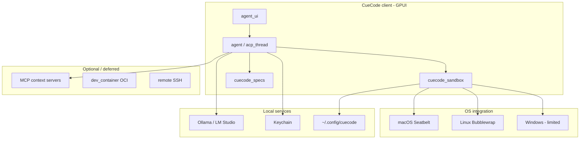
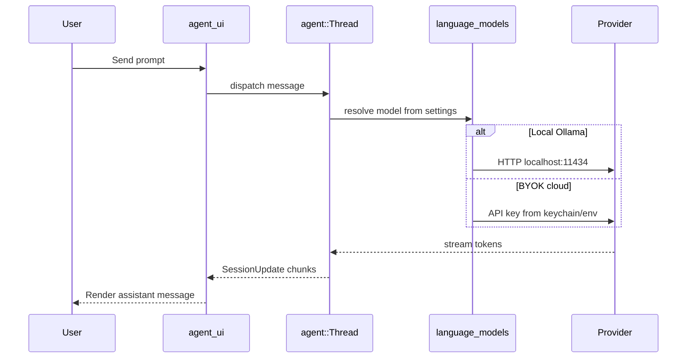
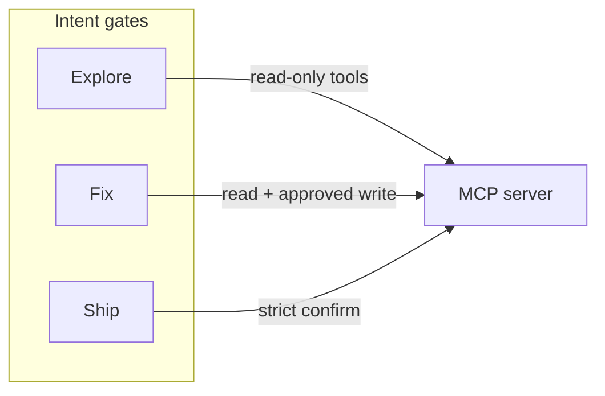
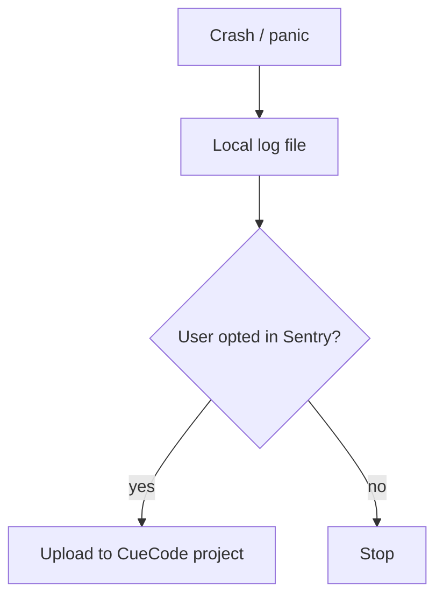

# Infrastructure {#infrastructure}

Models, sandbox OS integration, MCP, containers, build/release, telemetry, and
operational infrastructure for CueCode — a **Rust / GPUI** fork of Zed.

This document answers: *what external systems does CueCode depend on, how do we
run agents safely on each OS, and how do we build/ship without zed.dev?*

Related: [06-system-design](../core/06-system-design), [08-agent-tools-and-skills](../agent/08-agent-tools-and-skills),
[10-infrastructure](./10-infrastructure), [harness/README](../harness/README.md)

---

## Infrastructure overview {#infra-overview}



```
┌─────────────────────────────────────────────────────────────────┐
│                     CueCode Infrastructure Layers                │
├─────────────────────────────────────────────────────────────────┤
│  L4  Release: bundle scripts, auto-update, GPL artifacts      │
│  L3  Observability: local metrics, opt-in Sentry, no phone-home │
│  L2  Agent runtime: models, MCP, compaction, tool spill       │
│  L1  OS sandbox: Seatbelt / Bubblewrap / Windows policy       │
│  L0  Storage: ~/.config/cuecode, session dirs, keychain         │
└─────────────────────────────────────────────────────────────────┘
```

---

## Language models {#models}

### v1 requirement: BYOK / local default {#byok-default}

**No dependency on zed.dev LLM proxy** for core agent workflows.

CueCode alpha must boot, send a first prompt, and receive a response with:

- Local Ollama (or LM Studio OpenAI-compatible endpoint), **or**
- User-supplied API key for OpenAI / Anthropic / OpenRouter / etc.



### Provider matrix {#provider-matrix}

| Provider type | Crates | Config surface | CueCode notes |
|---------------|--------|----------------|---------------|
| Ollama | `ollama`, `language_models` | `agent.default_model`, settings JSON | **Best local default** for docs/onboarding |
| LM Studio | OpenAI-compatible URL | Custom endpoint in settings | Same adapter as OpenAI |
| OpenAI | `open_ai`, `language_models` | API key + model id | BYOK |
| Anthropic | `anthropic` | API key | BYOK |
| Google / Gemini | `google_ai` | API key | BYOK |
| OpenRouter | `open_router` | API key | Optional aggregator |
| AWS Bedrock | `bedrock` | IAM / keys | Power users |
| DeepSeek / Mistral / etc. | respective crates | API key | As upstream supports |

**Remove or gate:** `language_models_cloud` zed.dev billing paths for CueCode alpha.
Users must never hit a paywall modal to try the native agent.

### Model settings {#model-settings}

| Setting | Location | Purpose |
|---------|----------|---------|
| `agent.default_model` | `assets/settings/default.json` | Factory default (local-friendly) |
| User override | `~/.config/cuecode/settings.json` | Per-machine preference |
| Environment | Provider-specific (`OPENAI_API_KEY`, etc.) | CI / power users |
| Per-session | `agent_ui` model picker | Lane-specific overrides ([cloud/07](../harness/cloud/07-model-gateway.md)) |

**CueCode default policy (alpha):**

1. If Ollama reachable → suggest `qwen2.5-coder` or user-installed model ([12 §Q10](./12-open-questions#q10-default-model)).
2. Else → onboarding points to LM Studio or API key entry.
3. Never block composer on zed.dev sign-in.

### Model selection per harness context {#model-per-context}

| Context | Model hint | Rationale |
|---------|------------|-----------|
| Explore (async) | Fast / small | Cheaper grep-heavy turns |
| Plan | Inherit session | Same reasoning as user thread |
| Implement | Inherit or user pick | Quality matters |
| Verification | Fast + deterministic temp | Adversarial check, not creative |
| Coordinator | Inherit | Synthesis quality |

Wire via server-side agent registry ([cloud/05](../harness/cloud/05-cloud-services.md#builtin-agents)); local stub in `cuecode_sandbox` for offline only.

### Streaming and errors {#streaming-errors}

Existing path: `language_model` → `agent::Thread` → `acp_thread` → `agent_ui`.

CueCode requirements:

| Failure | User-visible behavior |
|---------|----------------------|
| No model configured | Actionable onboarding — "Start Ollama" or "Add API key" |
| Connection refused (Ollama) | Retry + link to docs |
| Rate limit / 429 | Backoff message; do not spin forever |
| Context overflow | Offer compact or truncate tool results |
| Auth failure | Keychain/settings hint; never log key |

All errors must surface in `agent_ui` composer area — no silent stderr-only failures.

### Compaction {#compaction}

Existing: `agent.auto_compact` summarizes long threads.

**CueCode additions:**

| Rule | Why |
|------|-----|
| Never compact linked spec **body** without user confirm | Specs are source of truth |
| Preserve intent + active spec path in compact summary | SDAL continuity |
| Preserve checkpoint ids and plan state | Rewind still works |
| Context budget UI shows pre-compact breakdown | [05-innovations](../core/05-innovations#context-budget) |

```rust
// Sketch: compact hook in agent::Thread (post-turn)
pub struct CompactPreserve {
    pub intent: Intent,
    pub linked_spec_paths: Vec<PathBuf>,
    pub checkpoint_head: Option<CheckpointId>,
    pub plan_summary: String,
}
```

### Context servers and model tools {#model-tools}

Deferred tool catalog via MCP (future): model requests tool list at runtime.
v1: static tool registry in `agent` with intent-based filter from `cuecode_sandbox`.

---

## Terminal sandbox {#terminal-sandbox}

### Platforms {#sandbox-platforms}

| OS | Mechanism | Crate | Status in fork |
|----|-----------|-------|----------------|
| macOS | Seatbelt (`sandbox-exec`) | `crates/sandbox/src/macos_seatbelt.rs` | Implemented behind feature flag |
| Linux | Bubblewrap | `crates/sandbox/src/linux_bubblewrap.rs` | Implemented behind feature flag |
| Windows | No kernel sandbox equivalent | `crates/sandbox` no-op | **Limited** — document risk |

```
macOS agent terminal spawn
──────────────────────────
agent::sandboxed_terminal
        │
        ▼
sandbox::macos_seatbelt::apply
        │
        ├── writable_directories: [worktree, /tmp/session-*]
        ├── network: Allowlist | Deny | PerCommandConfirm
        └── spawn: /bin/zsh -c "cargo test ..."
```

```
Linux agent terminal spawn
──────────────────────────
agent::sandboxed_terminal
        │
        ▼
linux_bubblewrap::run_launcher_if_invoked
        │
        ├── bwrap --ro-bind /usr --bind worktree
        ├── --unshare-net (unless allowlist)
        └── exec user command
```

### CueCode policy {#sandbox-policy}

| Intent | Sandbox | Network | Notes |
|--------|---------|---------|-------|
| **Explore** | N/A (no write terminal) | Off | Read-only tools only |
| **Review** | N/A | Off | Human writes only |
| **Fix** | **On** when platform supports | Allowlist | Default for implement |
| **Ship** | **On** + stricter confirm | Allowlist + CI | git push confirm |
| **Orchestrate** | Workers inherit child intent | Per worker | Coordinator no terminal |

- **Fix** and **Ship** intents enable sandbox when platform supports it.
- **Explore** and **Review** never spawn unsandboxed write terminals.
- User override: **"Run unsandboxed once"** with explicit confirm (existing escape hatch).

### Network allowlists {#network-allowlists}

Extend `NetworkRequest` / host patterns in `agent::sandboxing`:

| Tier | Hosts | Confirm |
|------|-------|---------|
| Package registries | `crates.io`, `index.crates.io`, `npmjs.org`, `pypi.org`, `github.com` | Auto on Fix/Ship allowlist |
| User allowlist | Per intent profile in `~/.config/cuecode/intent_profiles.json` | Editable in settings UI |
| `AnyHost` | Unrestricted | **Per-command confirm** |
| Deny | Default for Explore/Review | — |

```json
// intent_profiles.json sketch (Fix intent)
{
  "fix": {
    "network": {
      "allow": ["crates.io", "index.crates.io", "127.0.0.1:11434"],
      "deny_by_default": true
    }
  }
}
```

### Windows sandbox story {#windows-sandbox}

See [12 §Q7](./12-open-questions#q7-windows). Until resolved:

| Option | UX |
|--------|-----|
| Ship with warning | Banner: "Agent terminals are not sandboxed on Windows" |
| macOS + Linux only | Alpha download page omits Windows |
| WSL-only terminals | Route `terminal` tool to WSL2 when available |

Implementation touchpoint: `agent::sandboxing` platform branch + `agent_ui` disclaimer.

### Sandbox testing {#sandbox-testing}

| Command | Purpose |
|---------|---------|
| `./script/clippy` | Lint including sandbox crates |
| `cargo test -p sandbox` | Unit tests |
| `cargo xtask sandbox-tests` | Linux Bubblewrap NixOS VM tests |

CI should run sandbox tests on Linux; macOS Seatbelt validated manually + dogfood.

### Integration with spawn_agent {#sandbox-spawn}

Background workers ([local §B.1](../harness/local/01-agent-harness.md#part-b-async)) inherit parent intent sandbox policy.
Verification agent: read-only — no `edit_file`, sandboxed test commands only.

---

## MCP / context servers {#mcp}

Existing infrastructure:

| Crate | Role |
|-------|------|
| `context_server` | MCP client runtime |
| `context_server_configuration` | User/server config |
| Agent settings | Enable/disable per server |

### CueCode MCP policy {#mcp-policy}



| Policy | Detail |
|--------|--------|
| Curated default template | Optional `assets/mcp/default-template.json` — not required |
| Intent inheritance | Explore: read-only MCP tools; Fix: wider; Ship: confirm destructive |
| UI | `ConfigureContextServerModal` — rebrand strings, link to docs |
| Local-first | MCP servers run user-side; no zed.dev relay required |

### MCP tool permission mapping {#mcp-permissions}

Map MCP tool descriptors → `agent_settings::ToolPermission` patterns:

1. Server declares tool schema.
2. `cuecode_sandbox` applies intent filter (same as native tools).
3. UI shows MCP tool name in permission prompt (not generic "tool call").

### Failure modes {#mcp-failures}

| Failure | Behavior |
|---------|----------|
| Server offline | Skip server; show warning in session header |
| Tool timeout | Retry once; then fail with partial result path |
| Permission deny | Model receives deny reason; user can elevate trust |

---

## Dev containers {#dev-containers}

`crates/dev_container` — OCI / devcontainer API support in upstream Zed.

**v1 status:** **Not critical path.**

| Phase | Use case |
|-------|----------|
| Alpha | Ignore unless build breaks |
| Beta | **Ship** intent may spawn isolated devcontainer for untrusted repos |
| Post-beta | Reproducible agent environments per repo |

Future flow:

```
Ship intent + untrusted repo flag
        │
        ▼
dev_container::spawn_from_devcontainer_json
        │
        ▼
Agent session bound to container FS + network namespace
```

Defer implementation until post-beta unless security story demands earlier.

---

## Remote development {#remote}

Crates: `remote`, `remote_server` — Zed SSH remoting.

### CueCode v1 stance {#remote-v1}

| Priority | Action |
|----------|--------|
| Keep | If build works; do not delete |
| Do not prioritize | No CueCode-specific remote UX in alpha |
| Agent parity | Remote project sessions inherit intent/sandbox rules **where OS allows** |

Remote agent caveats:

- Sandbox applies on **remote OS** (Linux VM → Bubblewrap).
- Local Mac UI + remote Linux → terminal sandbox is remote-side.
- Checkpoint/action_log paths must be project-relative on remote worktree.

---

## Filesystem layout {#filesystem-layout}

### Config directory {#config-dir}

After rebrand ([03-fork-and-rebrand](../core/03-fork-and-rebrand)): `~/.config/cuecode/`

```
~/.config/cuecode/
├── settings.json              # User settings override
├── intent_profiles.json       # Intent → permissions (cuecode_sandbox)
├── trust/                     # Per-repo trust graph
│   └── <repo-hash>.json
├── credentials/               # Dev only — prod uses keychain
├── metrics/
│   └── local.jsonl            # Opt-in local metrics ([11](./11-metrics-and-success))
└── sessions/
    └── <session-id>/
        ├── sidechains/        # Subagent transcripts
        ├── tool-results/      # Spill for huge outputs
        ├── session-notes.md   # Compact / memory
        └── verdicts/          # Verification VERDICT files
```

**Critical:** Change `APP_NAME` in `crates/paths/src/paths.rs` so fork data never collides with Zed.

### Session artifacts {#session-artifacts}

Aligned with [local §B.5](../harness/local/01-agent-harness.md#b-5-async-artifacts-on-disk):

| Artifact | Writer | Reader |
|----------|--------|--------|
| Sidechain JSONL | `acp_thread` subagent | Parent on notification |
| Tool spill | `agent` tool handler | Model via `read_file` |
| VERDICT md | verification agent | Unified review UI |
| Checkpoints | `cuecode_sandbox` | Rewind UI |

---

## Build and release {#build-release}

### Developer build {#developer-build}

```sh
# Debug CueCode (after rebrand: cuecode binary)
cargo run

# Lint (required before PR)
./script/clippy

# Agent-focused tests
cargo test -p agent -p acp_thread -p agent_ui

# Sandbox VM tests (Linux)
cargo xtask sandbox-tests

# Future CueCode crates
cargo test -p cuecode_specs -p cuecode_sandbox
```

### macOS requirements {#macos-requirements}

- Full **Xcode** (Metal toolchain on macOS 26+).
- See `docs/src/development/macos.md`.
- Seatbelt tests: manual + dogfood (sandbox-exec availability).

### Linux requirements {#linux-requirements}

- bubblewrap (`bwrap`) installed for sandboxed terminals.
- Standard Rust toolchain per upstream Zed docs.

### Release artifacts (Phase 6) {#release-artifacts}

Rebrand existing bundle scripts:

| Script | Output |
|--------|--------|
| `script/bundle-mac` | `CueCode.dmg` |
| `script/bundle-linux` | `.tar.gz` / distro packages |
| `script/bundle-windows.ps1` | Windows installer |

Release checklist:

- [ ] Binary named `cuecode` not `zed`
- [ ] About dialog / bundle ID CueCode-branded
- [ ] No zed.dev update URL
- [ ] GPL-3.0-or-later notices bundled
- [ ] Signed/notarized (macOS) per maintainer certs

### Auto-update {#auto-update}

| Alpha | Beta+ |
|-------|-------|
| Disabled or manual check | CueCode update server (self-hosted) |
| **Do not poll zed.dev** | Channel: stable / preview |

Implementation: fork `auto_update` crate paths + URL constants in [03](../core/03-fork-and-rebrand).

---

## Telemetry and crashes {#telemetry}

| Service | Alpha recommendation | Implementation notes |
|---------|---------------------|----------------------|
| Telemetry | **Off by default** | Remove phone-home; no silent metrics upload |
| Sentry | **Opt-in only** | Separate CueCode Sentry project if used |
| Crash logs | **Local only** unless opt-in | `~/.config/cuecode/logs/` |
| Usage analytics | None in alpha | Revisit with consent UI post-beta |



Dogfood metrics use **local JSONL** per [11 §logging](./11-metrics-and-success#logging) — not cloud telemetry.

---

## Secrets and credentials {#secrets}

| Secret type | Storage | Never |
|-------------|---------|-------|
| API keys (prod) | OS keychain via credential provider | In repo, in logs |
| API keys (dev) | Alternate dev credential provider (existing Zed behavior) | Committed `.env` |
| MCP tokens | Keychain or settings encrypted blob | Plaintext in spec files |
| Session content | Local disk | Uploaded without consent |

Rotation: settings UI "Clear API keys" wipes keychain entries for provider ids.

Agent prompts must **hard-deny** reading `.env`, `credentials.json`, SSH keys unless explicit Ship intent + user confirm.

---

## CI (fork maintainer) {#ci}

Upstream Zed CI is heavy. **Minimal CueCode fork CI:**

```yaml
# Conceptual CI pipeline
jobs:
  clippy:
    run: ./script/clippy
  agent_tests:
    run: cargo test -p agent -p acp_thread -p agent_ui
  cuecode_crates:  # when added
    run: cargo test -p cuecode_specs -p cuecode_sandbox
  sandbox_linux:
    run: cargo xtask sandbox-tests
  # optional:
  macos_build:
    runs-on: self-hosted-macos
    run: cargo build --release
```

| Gate | Blocks merge |
|------|--------------|
| clippy | Yes |
| agent crate tests | Yes |
| sandbox Nix tests (Linux) | Yes on terminal/sandbox changes |
| Full release bundle | Nightly or release branch only |

### Dependency policy {#dependency-policy}

- Track upstream security advisories for `cargo audit` (optional job).
- Pin critical forks in workspace `Cargo.toml` as upstream does.
- Document merge strategy in [12 §Q8](./12-open-questions#q8-upstream).

---

## Performance infrastructure {#performance}

| Layer | Target | Measurement |
|-------|--------|-------------|
| GPUI frame time | <8ms (120fps) | Existing Zed perf tooling |
| Time to first token (local) | <3s | [11](./11-metrics-and-success#product-metrics) |
| Time to first token (cloud API) | <10s | Same |
| Tool result spill threshold | >N KB → disk | Configurable; default 32–64 KiB |
| Spec index build | <500ms worktree | Background `cuecode_specs` watch |

Cold `cargo run` build time is a **dev metric**, not product SLO.

---

## Infrastructure dependencies map {#dependencies-map}

| Dependency | Required v1? | Fallback |
|------------|--------------|----------|
| Ollama (or other local) | Recommended | Cloud BYOK |
| bubblewrap (Linux) | For sandboxed Fix/Ship | Unsandboxed + warning |
| Xcode (macOS dev) | For building | Prebuilt binaries |
| MCP servers | Optional | Native tools only |
| dev_container / Docker | No | Host worktree |
| zed.dev | **No** | — |
| Remote SSH | Optional | Local only |

---

## Infrastructure non-goals (v1) {#infra-non-goals}

- Self-hosted collab server
- CueCode Cloud accounts or billing
- Custom model training / fine-tuning pipeline
- Kubernetes deploy (unless productizing collab later)
- Managed MCP hosting
- Centralized spec sync cloud (specs stay in git worktree)

---

## Phase mapping {#phase-mapping}

| Roadmap phase | Infrastructure deliverables |
|---------------|----------------------------|
| Phase 0 | Paths rebrand, disable zed.dev model proxy, keychain |
| Phase 1 | Spec index path, local metrics JSONL stub |
| Phase 2 | Intent profiles JSON, sandbox policy wiring |
| Phase 3 | Verification artifacts dir, notification persistence |
| Phase 4 | `cuecode_sandbox` crate extract, trust store |
| Phase 5 | Multi-lane session dirs, away summary |
| Phase 6 | Bundle scripts, update server decision |

See [07-implementation-roadmap](../delivery/07-implementation-roadmap).

---

## Open infrastructure questions {#infra-open}

Cross-link [12-open-questions](./12-open-questions):

| ID | Topic |
|----|-------|
| Q7 | Windows sandbox |
| Q8 | Upstream merge / CI cost |
| Q10 | Default Ollama model |
| Q14 | Background spawn transport |

Resolve in 12; update this doc when decisions land.

---

## Operational runbooks {#operational-runbooks}

Playbooks for support, dogfood, and on-call during alpha. Each runbook follows:
**Symptoms → Diagnosis → Fix → Escalate → Post-incident.**

### Runbook: Model won't connect {#runbook-model-wont-connect}

**Symptoms:**

- Composer shows "No model configured" or spinning forever with no tokens
- Toast: "Connection refused" or "Authentication failed"
- `model_error` events in local JSONL ([11 §event-catalog](./11-metrics-and-success#event-catalog))
- First prompt fails activation metric

**Quick triage (2 minutes):**

```
User report: "Agent won't respond"
        │
        ▼
Is Ollama intended?
├── Yes → curl http://127.0.0.1:11434/api/tags
│         ├── 200 + models → check CueCode settings model id
│         └── connection refused → start Ollama / wrong port
└── No (cloud BYOK)
          ├── Key in keychain? → settings → providers
          ├── 401/403 → rotate key, check env override
          └── 429 → rate limit; wait or switch model
```

**Diagnosis steps:**

| Step | Command / action | Pass criteria |
|------|------------------|---------------|
| 1 | Settings → Models → verify provider selected | Non-empty model id |
| 2 | Local: `curl -s http://127.0.0.1:11434/api/tags` | JSON list of models |
| 3 | Cloud: test key with provider CLI or curl | 200 on models endpoint |
| 4 | CueCode logs: `~/.config/cuecode/logs/` | No key material; error class only |
| 5 | Network: confirm no corporate proxy blocking localhost | Ollama reachable |
| 6 | Check `language_models` provider in settings JSON | Matches intended provider id |

**Fix paths:**

| Root cause | Fix | User comms |
|------------|-----|------------|
| Ollama not running | `ollama serve` or open Ollama.app | [Toast: Ollama not running](#error-toast-copy-deck) |
| Wrong model id | Pick model from `ollama list` in settings | [Toast: Model not found](#error-toast-copy-deck) |
| Missing API key | Settings → Add API key → keychain | [Toast: API key required](#error-toast-copy-deck) |
| Invalid API key | Re-enter key; clear stale keychain entry | [Toast: Authentication failed](#error-toast-copy-deck) |
| Context overflow | Offer compact; truncate tool results | [Toast: Context limit](#error-toast-copy-deck) |
| zed.dev proxy hit | Disable cloud proxy; use BYOK ([Phase 0](../delivery/07-implementation-roadmap#phase-0)) | [Toast: Account not required](#error-toast-copy-deck) |
| Provider outage | Switch model or wait | [Toast: Provider unavailable](#error-toast-copy-deck) |

**Rust touchpoints:**

- `language_models` provider resolution
- `agent_ui` composer error banner
- `agent::Thread` stream error handler — must propagate to UI ([§streaming-errors](#streaming-errors))

**Escalate when:**

- Keychain read fails on macOS (permissions)
- All providers fail on clean install
- Regression after provider crate bump — file issue with `model_error` class

**Post-incident:**

- Add row to provider matrix if new failure class
- Update onboarding copy if recurring misconfiguration
- Log anonymized `model_error` event — no prompts

---

### Runbook: Sandbox denied {#runbook-sandbox-denied}

**Symptoms:**

- Terminal tool fails immediately with sandbox policy error
- Toast: "Sandbox denied" or "Operation not permitted"
- Agent suggests unsandboxed run; user confused on Fix intent
- Linux: `bwrap: Failed to create new namespace`
- macOS: `sandbox-exec: sandbox_apply: Operation not permitted`

**Quick triage:**

```
Terminal failure on agent command
        │
        ▼
Which OS?
├── macOS → Seatbelt profile deny?
│           ├── path outside writable_directories
│           └── network blocked (cargo fetch)
├── Linux → bwrap installed? (which bwrap)
│           ├── missing → sandbox unavailable
│           └── user namespace restricted (ChromeOS, some VPS)
└── Windows → expected: no kernel sandbox ([§windows-sandbox](#windows-sandbox))
              └── show banner + confirm unsandboxed
```

**Diagnosis steps:**

| Step | Action | Expected |
|------|--------|----------|
| 1 | Confirm intent (Explore never writes; Fix/Ship sandbox on) | Intent matches policy |
| 2 | macOS: check writable_directories includes worktree + /tmp | Paths in seatbelt profile |
| 3 | Linux: `which bwrap` | `/usr/bin/bwrap` or nix path |
| 4 | Network: command needs crates.io? | Allowlist includes host |
| 5 | Reproduce: `cargo xtask sandbox-tests` (maintainer) | Linux VM tests pass |
| 6 | User chose "deny" on network confirm | Retry with allowlist edit |

**Fix paths:**

| Root cause | Fix | User comms |
|------------|-----|------------|
| Path outside sandbox | Add worktree root; avoid `/etc` writes | [Toast: Sandbox path denied](#error-toast-copy-deck) |
| Network denied | Add host to intent allowlist or confirm once | [Toast: Network blocked](#error-toast-copy-deck) |
| bwrap missing (Linux) | Install bubblewrap package | [Toast: Sandbox unavailable Linux](#error-toast-copy-deck) |
| Windows no sandbox | Confirm unsandboxed or use WSL2 | [Toast: Windows unsandboxed](#error-toast-copy-deck) |
| Seatbelt disabled in debug build | Use release or enable feature flag | Internal only |
| Bubblewrap VM test fail | Fix policy regression in PR | CI blocker |

**Intent-specific policy reminder:**

| Intent | Write terminal | Sandbox | Network |
|--------|----------------|---------|---------|
| Explore | Never | N/A | Deny |
| Review | Never | N/A | Deny |
| Fix | Sandboxed when supported | On | Allowlist |
| Ship | Sandboxed + confirm push | On | Allowlist + git confirm |
| Orchestrate | Workers inherit child intent | Per worker | Per worker |

**Escalate when:**

- Sandbox passes in CI but fails on maintainer machine (OS update)
- New macOS Seatbelt rule breaks `cargo test`
- User reports data loss — **P0**; checkpoint + action_log review

**Post-incident:**

- Update intent_profiles.json example in [§network-allowlists](#network-allowlists)
- Add test case to `cargo xtask sandbox-tests` if new deny pattern

---

### Runbook: MCP fails {#runbook-mcp-fails}

**Symptoms:**

- Session header warning: "Context server offline"
- Tool calls to MCP hang then timeout
- `ConfigureContextServerModal` shows red status
- Agent transcript: "MCP tool unavailable"
- Partial results after single retry ([§mcp-failures](#mcp-failures))

**Quick triage:**

```
MCP tool failure
        │
        ▼
Server process running?
├── No → start server (user-side command)
├── Yes → CueCode config points to right command/URL?
│         ├── stdio: path + args in settings
│         └── HTTP/SSE: port + auth header
└── Intent allows tool?
          ├── Explore: read-only MCP only
          └── Fix/Ship: write tools need confirm
```

**Diagnosis steps:**

| Step | Action | Pass |
|------|--------|------|
| 1 | Settings → MCP → server list enabled | Toggle on |
| 2 | Manual launch server command from config | Process stays up |
| 3 | CueCode restart after config change | Client reloads servers |
| 4 | Check intent filter in `cuecode_sandbox` | Tool allowed for intent |
| 5 | Permission prompt dismissed? | User deny → model gets reason |
| 6 | Timeout logs (no secrets) | `tool_deny` or timeout class |

**Fix paths:**

| Root cause | Fix | User comms |
|------------|-----|------------|
| Server not started | User starts MCP server per docs | [Toast: MCP server offline](#error-toast-copy-deck) |
| Bad command path | Fix settings JSON path | [Toast: MCP config invalid](#error-toast-copy-deck) |
| Auth token expired | Refresh token in keychain | [Toast: MCP auth failed](#error-toast-copy-deck) |
| Tool timeout | Retry; increase timeout in config if supported | [Toast: MCP timeout](#error-toast-copy-deck) |
| Intent blocked write | Switch to Fix/Ship or approve tool | [Toast: MCP tool not allowed](#error-toast-copy-deck) |
| Schema mismatch | Update server or disable tool | [Toast: MCP tool error](#error-toast-copy-deck) |
| zed.dev relay assumed | MCP is local-only in CueCode v1 | Docs link |

**Degraded mode:**

When MCP server offline, CueCode **must**:

1. Skip server for remainder of session (no infinite retry loop)
2. Show persistent warning chip in session header
3. Continue native tools (`read_file`, `grep`, etc.)
4. Emit no prompt content in logs

**Escalate when:**

- Built-in curated template breaks on clean install
- MCP permission mapping panics in `agent`
- Security concern: MCP tool exfiltrated path outside worktree

**Post-incident:**

- Update `assets/mcp/default-template.json` if applicable
- Add row to [§mcp-failures](#mcp-failures) table

---

### Runbook index {#runbook-index}

| Runbook | Anchor | Primary owner |
|---------|--------|---------------|
| Model won't connect | `{#runbook-model-wont-connect}` | Agent inference |
| Sandbox denied | `{#runbook-sandbox-denied}` | Platform / sandbox |
| MCP fails | `{#runbook-mcp-fails}` | Agent + context_server |

Future runbooks (post-alpha): auto-update failure, remote SSH agent, devcontainer spawn.

---

## Error toast copy deck {#error-toast-copy-deck}

User-facing strings for infrastructure failures. **Tone:** direct, actionable, no blame.
Implement in `agent_ui` toast/banner components; keep titles ≤60 chars, body ≤140 chars.

### Model and provider toasts {#toast-models}

| ID | Title | Body | Primary action | Secondary |
|----|-------|------|----------------|-----------|
| `MODEL_NONE` | No model configured | Connect Ollama or add an API key in Settings → Models. | Open Settings | View setup guide |
| `OLLAMA_DOWN` | Ollama isn't running | Start Ollama, then retry. Default: localhost:11434. | Retry prompt | Open Ollama help |
| `MODEL_NOT_FOUND` | Model not found | Pick a model you have installed, or run `ollama pull <model>`. | Open model picker | — |
| `API_KEY_REQUIRED` | API key required | Add your provider key in Settings. Keys stay in the keychain. | Add API key | Switch to Ollama |
| `AUTH_FAILED` | Authentication failed | Check your API key and try again. | Open Settings | — |
| `RATE_LIMIT` | Rate limited | Provider throttled this request. Wait a moment or switch models. | Retry | Switch model |
| `CONTEXT_LIMIT` | Context limit reached | Compact the thread or start a new session with the same spec link. | Compact thread | New session |
| `PROVIDER_DOWN` | Provider unavailable | The model provider didn't respond. Try again or use a local model. | Retry | Use Ollama |
| `ACCOUNT_NOT_REQUIRED` | No account needed | CueCode doesn't require zed.dev. Use Ollama or your own API key. | Open Settings | — |
| `STREAM_INTERRUPTED` | Response interrupted | Connection dropped mid-stream. Retry the last message. | Retry | — |

### Sandbox toasts {#toast-sandbox}

| ID | Title | Body | Primary action | Secondary |
|----|-------|------|----------------|-----------|
| `SANDBOX_PATH` | Sandbox blocked this path | The command tried to write outside the project sandbox. | View policy | Run unsandboxed once |
| `SANDBOX_NETWORK` | Network blocked | This command needs network access. Allow for this host or once. | Allow host | Deny |
| `SANDBOX_UNAVAILABLE_LINUX` | Sandbox unavailable | Install `bubblewrap` to run sandboxed terminals on Linux. | View docs | Run unsandboxed once |
| `SANDBOX_UNAVAILABLE` | Sandbox unavailable | Sandboxed terminals aren't supported here. Confirm to run unsandboxed. | Confirm once | Cancel |
| `WINDOWS_UNSANDBOXED` | Terminals aren't sandboxed on Windows | Agent commands run with full permissions. Review carefully. | I understand | Learn more |
| `SANDBOX_DENIED` | Command denied by sandbox | Seatbelt blocked this operation. Check paths and network allowlist. | View details | Unsandboxed once |
| `GIT_PUSH_CONFIRM` | Confirm git push | Ship intent requires explicit approval before push. | Approve push | Cancel |

### MCP toasts {#toast-mcp}

| ID | Title | Body | Primary action | Secondary |
|----|-------|------|----------------|-----------|
| `MCP_OFFLINE` | MCP server offline | `%server_name% didn't start. Check Settings → MCP.` | Open MCP settings | Continue without |
| `MCP_CONFIG` | MCP config invalid | Fix the command or URL for `%server_name%`. | Edit config | Disable server |
| `MCP_AUTH` | MCP authentication failed | Update the token for `%server_name%`. | Fix credentials | Disable server |
| `MCP_TIMEOUT` | MCP tool timed out | `%tool_name% didn't respond. Retry or disable the server.` | Retry | Skip tool |
| `MCP_NOT_ALLOWED` | MCP tool not allowed | `%tool_name% isn't available in %intent% intent. Switch intent or approve.` | Change intent | Approve once |
| `MCP_TOOL_ERROR` | MCP tool failed | `%tool_name% returned an error. Native tools still work.` | View log | Dismiss |

### Generic infrastructure toasts {#toast-generic}

| ID | Title | Body | Primary action | Secondary |
|----|-------|------|----------------|-----------|
| `KEYCHAIN_ERROR` | Couldn't read credentials | Allow keychain access for CueCode in System Settings. | Open Settings | — |
| `DISK_FULL` | Session storage full | Free disk space under ~/.config/cuecode/sessions. | Open folder | — |
| `SPEC_INDEX_FAIL` | Spec index failed | Couldn't index .cursor/specs/. Check folder exists in project root. | Retry index | — |
| `COMPACT_FAILED` | Couldn't compact thread | Compact failed; start a new session and link the same spec. | New session | — |

### Copy deck implementation notes {#toast-impl}

```rust
// Sketch: agent_ui toast ids map to copy deck rows
pub enum InfraToastId {
    ModelNone,
    OllamaDown,
    SandboxPath,
    McpOffline,
    // ...
}

pub struct InfraToastCopy {
    pub id: InfraToastId,
    pub title: SharedString,
    pub body: SharedString,
    pub primary: ToastAction,
    pub secondary: Option<ToastAction>,
}
```

**Rules:**

1. `%server_name%`, `%tool_name%`, `%intent%` — interpolate at runtime; never log secrets.
2. Primary action always offers a **next step**; avoid "Error occurred" alone.
3. Windows sandbox toasts use `WINDOWS_UNSANDBOXED` on every Fix/Ship terminal until [Q7](./12-open-questions#q7-windows) resolved.
4. All toasts link to docs anchors when "Learn more" / "View docs" present.
5. Localization: wrap strings for future i18n; alpha English-only ok.

### Toast severity mapping {#toast-severity}

| Severity | GPUI treatment | Examples |
|----------|----------------|----------|
| Info | Blue banner, auto-dismiss 8s | MCP offline degraded mode |
| Warning | Amber banner, persist until dismiss | Windows unsandboxed |
| Error | Red banner + composer inline | Auth failed, sandbox denied |
| Blocker | Modal overlay | Permission wait (not toast) |

---

## Infrastructure checklist (pre-ship) {#infra-checklist}

Before alpha release:

- [ ] No required zed.dev network calls on cold start
- [ ] Default model path works offline (Ollama or explicit BYOK setup)
- [ ] `~/.config/cuecode` paths live; no Zed collision
- [ ] Seatbelt/Bubblewrap enabled for Fix/Ship on supported OS
- [ ] Windows risk documented if shipping Windows
- [ ] API keys in keychain not logs
- [ ] `./script/clippy` + agent tests in CI
- [ ] GPL notices in bundle
- [ ] Telemetry off by default
