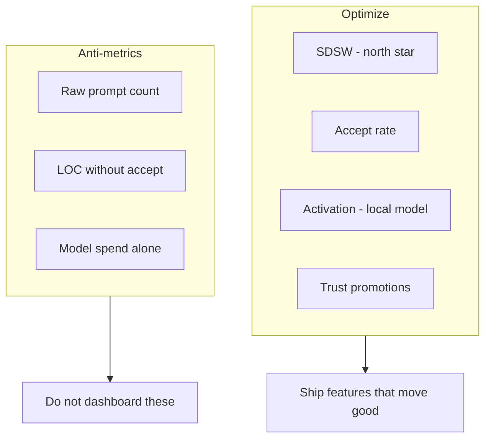
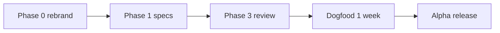

# Metrics and Success {#metrics-and-success}

How we measure whether CueCode is achieving its vision — from north-star product
metrics to release gates, dogfood protocols, and privacy-preserving logging.

**Context:** CueCode is a native **Rust / GPUI** agentic sandbox. Metrics must
reflect **session outcomes** (spec-driven work accepted and checkpointed), not
vanity counts like raw prompts or LOC generated.

Related: [01-vision](../core/01-vision#success-looks-like), [05-innovations](../core/05-innovations),
[07-implementation-roadmap](../delivery/07-implementation-roadmap), [13-ai-maxxing](../agent/13-ai-maxxing#metrics)

---

## Measurement philosophy {#philosophy}



| Principle | Implication |
|-----------|-------------|
| **Outcome over activity** | A session matters when user accepts work tied to intent/spec |
| **Local-first success** | "Works without zed.dev" is a first-class metric |
| **Trust as product** | Track permission promotions, not bypass rates |
| **Privacy by default** | Alpha metrics local-only; content never in events |
| **Dogfood before dashboards** | JSONL + interviews before building analytics UI |

---

## North star metric {#north-star}

### SDSW — Successful spec-driven sessions per week {#sdsW}

**Definition:** A **Successful spec-driven session** counts when **all** of:

1. User linked or referenced a `.cursor/specs/` file (`@spec`, spec picker, or plan link), **and**
2. Agent completed at least one plan item (checkbox, plan entry, or explicit task), **and**
3. User accepted at least one change **or** explicitly marked session complete with no pending review.

**Formula:**

```
SDSW_per_user_per_week = count(sessions meeting criteria) / active_users
```

**Alpha dogfood target:** **≥5 SDSW / active user / week**

```
Weekly SDSW funnel (per user)
─────────────────────────────
  Sessions started          100%
        │
        ▼
  Spec referenced            ≥50%  (activation companion)
        │
        ▼
  Plan item completed        ≥40%
        │
        ▼
  Change accepted            ≥30%
        │
        ▼
  SDSW (all three + accept)  ≥25%  → target 5+ SDSW if ~20 sessions/week
```

### Why SDSW {#why-sdsw}

| Alternative north star | Why not primary |
|------------------------|-----------------|
| DAU | Ignores whether agent helped |
| Prompts per day | Rewards spam |
| Commits via agent | Misses explore/review value |
| Revenue | Pre-revenue alpha |

SDSW encodes CueCode thesis: **specs + session + accepted work**.

### SDSW instrumentation {#sdsW-events}

| Event | Fields (no content) |
|-------|---------------------|
| `session_start` | `session_id`, `intent`, `timestamp` |
| `spec_link` | `session_id`, `spec_path_hash`, `method` (at-mention / picker) |
| `plan_item_complete` | `session_id`, `plan_entry_id` |
| `accept` | `session_id`, `edit_count`, `checkpoint_created` |
| `session_complete` | `session_id`, `user_marked_complete` |

SDSW = sessions with `spec_link` + `plan_item_complete` + (`accept` OR `session_complete` with zero pending).

---

## Product metrics {#product-metrics}

### Activation {#activation}

First-session experience predicts retention.

| Metric | Definition | Alpha target | Measurement |
|--------|------------|--------------|-------------|
| **First agent prompt** | User sends prompt within 10 min of install | >70% | `first_prompt_at` - `install_at` |
| **Local model works** | First prompt succeeds without zed.dev account | >90% | `model_provider != zed_cloud` + success |
| **Spec discovery** | User opens or `@spec` references a spec | >50% of sessions | `spec_link` / `session_start` |
| **Intent selected** | User picks non-default intent in first 3 sessions | >40% | `intent_change` from default |
| **Onboarding completion** | Finish model setup wizard | >80% | UI funnel |

```mermaid
funnel
    title Activation funnel (alpha)
    section Install
    App opened: 100
    section First 10 min
    First prompt sent: 70
    First response OK: 63
    section First session
    Spec referenced: 35
    First accept: 21
```

### Engagement {#engagement}

| Metric | Definition | Use |
|--------|------------|-----|
| **Session length** | Agent panel focused time per session | Capacity planning |
| **Sessions per week** | Distinct `session_id` per user | Engagement baseline |
| **Checkpoint usage** | % sessions creating ≥1 checkpoint | Trust in rewind |
| **Rewind usage** | Checkpoints restored / created | Undo comfort |
| **Intent distribution** | Mix Explore / Fix / Ship / Review / Orchestrate | Product balance |
| **Trust promotions** | Auto-allow rules created per repo | Trust graph adoption |
| **Multi-lane usage** | Sessions with ≥2 active lanes | Harness maturity |
| **Async notification open rate** | Notifications clicked / delivered | Async harness value |
| **Skill invocations** | `skill` tool calls per session | Playbook adoption |

**Healthy intent mix (dogfood hypothesis):**

| Intent | Target share |
|--------|--------------|
| Explore | 25–35% |
| Fix | 35–45% |
| Ship | 10–15% |
| Review | 10–15% |
| Orchestrate | 5–10% (grows with harness v2) |

### Quality {#quality}

| Metric | Definition | Target | Notes |
|--------|------------|--------|-------|
| **Accept rate** | Accepted edits / proposed edits | >60% | Core quality signal |
| **Reject rate** | Rejected / proposed | <30% | Inverse of accept |
| **Rewind rate** | Checkpoints restored / created | <20% | Lower is better |
| **Terminal failure rate** | Non-zero exit commands / total | Track baseline | Fix intent focus |
| **Verify pass rate** | VERDICT PASS / verify runs | >70% | After verification ships |
| **Compact frequency** | Auto-compact per long session | Decrease over time | Context economy |
| **Permission deny rate** | Denied tools / requested | Track | High deny → intent mismatch |
| **Spec sync confirm rate** | User confirms spec writes / proposals | >80% | SDAL trust |

```
Quality loop
────────────
  Agent proposes edit
        │
        ├── accept ──► accept_rate ↑
        ├── reject ──► prompt/tool tuning
        └── rewind ──► checkpoint / plan issue
```

### Performance {#performance}

| Metric | Definition | Target |
|--------|------------|--------|
| **Time to first token (local)** | Prompt → first assistant chunk | <3s |
| **Time to first token (remote API)** | Same, cloud BYOK | <10s |
| **Tool round-trip p95** | Tool call → result in UI | <2s local read tools |
| **Frame time** | GPUI frame budget | <8ms (120fps) per Zed standard |
| **Spec index build** | Worktree scan → index ready | <500ms |
| **Notification latency** | Async job done → rail entry | <1s after completion |
| **Cold build time** | `cargo run` clean | Track only; not product metric |

Performance regressions block release if p95 first-token doubles vs baseline.

### Harness-specific metrics {#harness-metrics}

Aligned with [harness/local/01-agent-harness](../harness/local/01-agent-harness.md):

| Metric | Definition | Target |
|--------|------------|--------|
| **Active vs async ratio** | Foreground turns / background jobs | Track |
| **Background completion rate** | Notifications delivered / spawns | >95% |
| **Hybrid handoff success** | Sessions with artifact after hybrid flow | 100% required |
| **VERDICT override rate** | User ships despite FAIL | <10% |
| **Away summary views** | Summaries shown / window refocus | Track engagement |

---

## User segments {#user-segments}

| Segment | Definition | Success looks like |
|---------|------------|-------------------|
| **Alpha dogfood** | Team + invited devs | ≥5 SDSW/week, qualitative interviews |
| **Spec-native** | >70% sessions with spec_link | High accept rate, low rewind |
| **Local-only** | Never uses cloud provider | Local model works >90% |
| **Power user** | Multi-lane + Orchestrate | Async notification usage |
| **Migrator from Cursor** | Self-reported | Intent switcher reduces settings fiddling |

Segment metrics computed from local JSONL; no PII required.

---

## User feedback (qualitative) {#qualitative}

### Dogfood interview script {#interview-script}

Run biweekly during alpha. 30 minutes. Record themes, not necessarily recordings.

**Core questions:**

1. Did the **intent switcher** reduce settings fiddling?
2. Did **specs** help align the agent with your goal?
3. Did **checkpoints** make you more willing to let the agent run tools?
4. What still feels **"bolted on"**?
5. Did **async notifications** help you multitask?
6. Would you recommend CueCode for spec-driven work? Why/why not?

**Harness-specific:**

7. When did you choose background vs foreground agent?
8. Did verification VERDICT match your manual test result?
9. Multi-lane: did lanes stay out of each other's way?

### Session observation protocol {#observation}

| Step | Observer notes |
|------|----------------|
| Watch first 10 min after install | Onboarding friction |
| One Fix session | Permission prompts, sandbox |
| One Explore session | Read-only enforcement |
| Review unified panel | Time to accept/reject |

### Thematic coding {#thematic-coding}

Tag interview notes:

| Tag | Example quote |
|-----|---------------|
| `moat-win` | "Checkpoint saved me after bad edit" |
| `parity-gap` | "Missing X from Cursor" |
| `trust` | "Auto-allow finally stopped nagging" |
| `spec` | "@spec pulled the right section" |
| `async` | "Verify notification was accurate" |
| `friction` | "Couldn't find intent switcher" |

---

## Anti-metrics (do not optimize) {#anti-metrics}

| Anti-metric | Why harmful |
|-------------|-------------|
| Raw prompt count without accept/review | Rewards noise |
| Model cost spend (unless user-facing budget) | Optimizes wrong provider |
| Lines of code agent writes without accept | Rewards verbosity |
| Tool calls per turn (alone) | Rewards grep spam without collapse UI |
| zed.dev sign-ups | Irrelevant to CueCode |
| Autonomous hours without human review | Violates policy |

If a dashboard metric does not connect to **SDSW** or **accept rate**, do not ship it in alpha.

---

## Logging (privacy-preserving) {#logging}

### Alpha: local-only {#local-logging}

```
~/.config/cuecode/metrics/local.jsonl
```

One JSON object per line. **No prompt content, no file paths in clear text.**

| Field policy | Rule |
|--------------|------|
| `session_id` | UUID ok |
| `spec_path` | SHA-256 hash optional |
| `repo` | Hash of root path |
| `error_message` | Truncated, no secrets |
| `model_id` | Provider + model name ok |

**Opt-in:** Settings → "Help improve CueCode (local metrics only)" default **off**.

Example event:

```json
{"event":"accept","ts":"2026-06-17T12:00:00Z","session_id":"...","edit_count":3,"intent":"fix","checkpoint":true}
```

### Event catalog {#event-catalog}

| Event | When |
|-------|------|
| `app_start` | Application launch |
| `session_start` | New AcpThread |
| `session_end` | Archive / close |
| `intent_change` | User switches intent |
| `spec_link` | Spec referenced |
| `plan_item_complete` | Plan checkbox done |
| `checkpoint` | Checkpoint created |
| `restore` | Checkpoint restored |
| `accept` | User accepts edits |
| `reject` | User rejects edits |
| `tool_deny` | Permission denied |
| `compact` | Auto-compact ran |
| `spawn_background` | Background agent started |
| `notification` | Async notification delivered |
| `verdict` | VERDICT PASS/FAIL/PARTIAL |
| `trust_promote` | Auto-allow rule added |
| `model_error` | Provider failure class |

### Production telemetry (post-alpha) {#production-telemetry}

User opt-in with clear policy:

- Aggregate counts only
- No code, no prompts
- Separate from zed.dev
- Export/delete in settings

Until then: **no phone-home** ([10 §telemetry](./10-infrastructure#telemetry)).

---

## Dashboards (future) {#dashboards}

Alpha: **no cloud dashboard**. Analyze JSONL with scripts.

```sh
# Example: SDSW per week from local.jsonl
# (maintainer script — not shipped in v1)
rg '"event":"session_complete"' ~/.config/cuecode/metrics/local.jsonl | wc -l
```

Beta: optional in-app "Your stats" panel — sessions, accept rate, intents — all local.

---

## Release gates {#release-gates}

### Alpha gate (Phases 0–3) {#alpha-gate}

| Criterion | Source |
|-----------|--------|
| All Phase 0 exit criteria | [07 §phase-0](../delivery/07-implementation-roadmap#phase-0) |
| All Phase 1 exit criteria | [07 §phase-1](../delivery/07-implementation-roadmap#phase-1) |
| All Phase 3 exit criteria | [07 §phase-3](../delivery/07-implementation-roadmap#phase-3) |
| 3 dogfooders complete **5+ SDSW** each | This doc |
| Zero **P0 crashes** in 1 week dogfood | Sentry opt-in or local logs |
| Local model works **>90%** first prompt | Activation metric |
| Accept rate **>50%** in dogfood (trending to 60%) | Quality |



### Beta gate (Phases 0–5) {#beta-gate}

| Criterion | Source |
|-----------|--------|
| Trust graph shipped | [05 §trust-graph](../core/05-innovations#trust-graph) |
| Multi-lane basic workflow | [local §C.4](../harness/local/01-agent-harness.md#c-4-multi-lane-gpui-native-swarms) |
| Accept rate **>60%** dogfood cohort | Quality |
| GPL compliance checklist complete | [03](../core/03-fork-and-rebrand) |
| Verification agent + VERDICT | [local §B.2](../harness/local/01-agent-harness.md#b-2-verification-agent-async-gate) |
| Harness v2 deliverables | [local §phases](../harness/local/01-agent-harness.md#phases) |

### Post-beta {#post-beta-gate}

| Criterion | Notes |
|-----------|-------|
| SDSW ≥5 sustained 4 weeks | North star |
| Windows decision resolved | [12 §Q7](./12-open-questions#q7-windows) |
| Optional telemetry policy published | Legal review |

---

## Success stories (templates) {#success-stories}

Document dogfood wins in `.cursor/specs/dogfood/` (future directory).

### Template {#story-template}

```markdown
# Dogfood win: [title]

**Date:** YYYY-MM-DD
**User:** (initials)
**Intent:** Fix | Explore | Ship | Review | Orchestrate
**Specs:** .cursor/specs/NN-....md#anchor

## Story
[2-3 sentences: what happened]

## Metrics
- SDSW: yes/no
- Accept rate this session: N/M
- Checkpoints used: N
- Async agents: N

## Regression scenario
[Steps to replay for QA]

## Quotes
> ...
```

### Example stories {#story-examples}

| Story | Spec link | Harness |
|-------|-----------|---------|
| Fixed auth bug using Fix intent + spec 04 | [04-sandbox-core](../core/04-sandbox-core) | Active implement |
| Explored unfamiliar crate with Explore lane only | [14 explore](../harness/local/01-agent-harness.md#builtin-agents) | Async explore |
| Shipped feature after VERDICT PASS | [14 verification](../harness/local/01-agent-harness.md#b-2-verification-agent-async-gate) | Hybrid |
| Coordinator orchestrated 3 workers | [local §C.1](../harness/local/01-agent-harness.md#c-1-coordinator-lite-orchestrate-intent) | Hybrid |

Stories become **marketing** and **GPUI test scenarios**.

---

## Metric ownership {#ownership}

| Area | Owner role | Review cadence |
|------|------------|----------------|
| SDSW definition | Product | Per phase gate |
| Instrumentation | Agent platform | Per PR touching events |
| Local JSONL schema | Platform | Version bump on breaking change |
| Interview themes | Product | Biweekly alpha |
| Release gates | Eng lead + product | Before tag |

---

## AI-maxxing alignment {#ai-alignment}

From [13-ai-maxxing](../agent/13-ai-maxxing#metrics):

| 13 metric | 11 home |
|-----------|---------|
| SDSW | [§North star](#north-star) |
| Accept rate | [§Quality](#quality) |
| Checkpoint usage | [§Engagement](#engagement) |
| Intent distribution | [§Engagement](#engagement) |
| Sessions without zed.dev | [§Activation](#activation) |

Every AI feature PR should state which metric it expects to move and how to measure.

---

## Metrics checklist (feature PR) {#metrics-checklist}

Before merging user-facing agent features:

- [ ] Named target metric (SDSW, accept rate, activation, etc.)
- [ ] Events added to [§Event catalog](#event-catalog) if needed
- [ ] No prompt/content in telemetry
- [ ] Failure states measurable (`model_error`, `tool_deny`)
- [ ] Dogfood scenario in PR description or `dogfood/` story
- [ ] Anti-metrics considered — not optimizing prompt volume

---

## Weekly SDSW dashboard (ASCII mockups) {#weekly-sdsW-dashboard}

Alpha analyzes local JSONL manually; these mockups define the **beta in-app stats panel**
and maintainer CLI output. All data stays local — no cloud dashboard in alpha.

### Dashboard layout — weekly overview {#dashboard-weekly-overview}

Primary view: **Monday–Sunday** rolling window, per-machine, optional export to markdown.

```
╔══════════════════════════════════════════════════════════════════════════════╗
║  CueCode — Weekly Metrics (local)              Week of 2026-06-09 → 06-15   ║
╠══════════════════════════════════════════════════════════════════════════════╣
║  NORTH STAR                                                                   ║
║  ┌────────────────────────────────────────────────────────────────────────┐  ║
║  │  SDSW (you)     ████████████████░░░░░░░░   6.2 / week   TARGET ≥5  ✓  │  ║
║  │  SDSW (cohort)  ██████████████░░░░░░░░░░   4.8 / week   TARGET ≥5  ~  │  ║
║  └────────────────────────────────────────────────────────────────────────┘  ║
║                                                                               ║
║  WEEKLY FUNNEL (cohort avg)                                                   ║
║  Sessions started        ████████████████████  100%  (n=142)                ║
║  Spec referenced         ██████████░░░░░░░░░░   52%                        ║
║  Plan item completed     ████████░░░░░░░░░░░░░   41%                        ║
║  Change accepted           ██████░░░░░░░░░░░░░   31%                        ║
║  SDSW (all criteria)       █████░░░░░░░░░░░░░░░   26%                        ║
║                                                                               ║
║  QUALITY STRIP                                                                ║
║  Accept rate 62% │ Rewind 14% │ Verify pass 74% │ Deny rate 8%               ║
╠══════════════════════════════════════════════════════════════════════════════╣
║  [Overview] [Intents] [Harness] [Quality] [Export]              Updated 2m ago ║
╚══════════════════════════════════════════════════════════════════════════════╝
```

### Tab: Intents {#dashboard-intents-tab}

```
┌─ Intent distribution (this week) ─────────────────────────────────────────────┐
│                                                                               │
│  Explore     ████████░░░░░░░░░░░░  28%   (40 sessions)                       │
│  Fix         ██████████████░░░░░░  42%   (60 sessions)                       │
│  Ship        ████░░░░░░░░░░░░░░░░░  11%   (16 sessions)                       │
│  Review      █████░░░░░░░░░░░░░░░░  14%   (20 sessions)                       │
│  Orchestrate ██░░░░░░░░░░░░░░░░░░░   5%   ( 6 sessions)                       │
│                                                                               │
│  Spec-native sessions (spec_link present): 52%                                │
│  Local-only sessions (no cloud provider):   88%                                │
└───────────────────────────────────────────────────────────────────────────────┘
```

### Tab: Harness {#dashboard-harness-tab}

```
┌─ Harness activity ───────────────────────────────────────────────────────────┐
│                                                                               │
│  Active turns        █████████████████  312                                   │
│  Background spawns   ████████░░░░░░░░  48    completion 96%                   │
│  Notifications open  ██████░░░░░░░░░░  62% open rate                          │
│  Multi-lane sessions ███░░░░░░░░░░░░░  12                                   │
│                                                                               │
│  Async job outcomes                                                           │
│  ┌────────────┬────────┬─────────┐                                           │
│  │ Type       │ Done   │ Failed  │                                           │
│  ├────────────┼────────┼─────────┤                                           │
│  │ explore    │   22   │    1    │                                           │
│  │ verify     │   18   │    3    │                                           │
│  │ implement  │    8   │    0    │                                           │
│  └────────────┴────────┴─────────┘                                           │
│                                                                               │
│  VERDICT override rate (ship despite FAIL): 6%                                │
└───────────────────────────────────────────────────────────────────────────────┘
```

### Tab: Quality {#dashboard-quality-tab}

```
┌─ Quality metrics ────────────────────────────────────────────────────────────┐
│                                                                               │
│  Accept rate trend (7 days)                                                   │
│  Mon ████████████░░ 58%                                                       │
│  Tue ██████████████ 64%                                                       │
│  Wed █████████████░ 61%                                                       │
│  Thu ███████████████ 67%  ← best day                                          │
│  Fri ████████████░░ 59%                                                       │
│                                                                               │
│  Terminal failure rate (Fix intent): 4.2%                                     │
│  Compact events / long session:      1.8                                      │
│  Trust promotions this week:         7                                        │
│                                                                               │
│  Top friction (from tool_deny + model_error classes)                          │
│  1. sandbox_network (12)                                                      │
│  2. model_not_found (8)                                                       │
│  3. permission_deny_edit (6)                                                  │
└───────────────────────────────────────────────────────────────────────────────┘
```

### Cohort comparison view (maintainer) {#dashboard-cohort}

For alpha dogfood leads — aggregate anonymized exports from team machines.

```
╔══════════════════════════════════════════════════════════════════════════════╗
║  Dogfood cohort — Week 2026-W24 (n=5 active)                                  ║
╠══════════════════════════════════════════════════════════════════════════════╣
║  User    SDSW   Accept%   Local%   Spec%   Crashes   Notes                    ║
║  ────    ────   ───────   ──────   ─────   ───────   ─────                    ║
║  KR       7      68%      100%     80%      0       power user                ║
║  AL       5      61%       90%     55%      0       on target                 ║
║  JM       4      52%      100%     40%      1       intent friction           ║
║  TS       6      70%       80%     65%      0       multi-lane                ║
║  PD       3      48%      100%     30%      0       onboarding                ║
╠══════════════════════════════════════════════════════════════════════════════╣
║  Cohort avg SDSW: 5.0  ✓ gate   Accept avg: 60%  ✓   Crashes: 1  ✓           ║
╚══════════════════════════════════════════════════════════════════════════════╝
```

### Drill-down: single session {#dashboard-session-drilldown}

```
┌─ Session abc-123 (Fix) — 2026-06-14 ─────────────────────────────────────────┐
│  Timeline                                                                     │
│  12:01 session_start   intent=fix                                             │
│  12:02 spec_link       hash=9f2a… method=at-mention                          │
│  12:08 plan_item_complete  id=plan-3                                          │
│  12:15 accept            edits=4 checkpoint=true                              │
│  12:20 spawn_background  agent=verification                                   │
│  12:24 verdict           status=pass                                          │
│  12:25 session_complete  user_marked=true                                     │
│                                                                               │
│  SDSW: YES                                                                    │
└───────────────────────────────────────────────────────────────────────────────┘
```

### Dashboard data contract {#dashboard-data-contract}

| Widget | Required events | Computation |
|--------|-----------------|-------------|
| SDSW count | `spec_link`, `plan_item_complete`, `accept` or `session_complete` | Per session all true |
| Funnel | `session_start` baseline | Stage / starts |
| Accept rate | `accept`, `reject` | accept / (accept+reject) |
| Intent mix | `session_start.intent`, `intent_change` | Last intent per session |
| Harness | `spawn_background`, `notification` | Counts + completion |
| Friction | `tool_deny`, `model_error` | Group by error class |

---

## QA scripts for metrics collection {#qa-metrics-scripts}

Maintainer scripts under `script/metrics/` (planned). Alpha dogfooders run manually.
**Privacy:** scripts never print prompt content or full paths — hashes only.

### Prerequisites {#qa-scripts-prereqs}

```sh
# Metrics enabled in Settings → Help improve CueCode (local metrics only)
METRICS_FILE="${HOME}/.config/cuecode/metrics/local.jsonl"
test -f "$METRICS_FILE" || echo "No metrics file — enable opt-in first"
```

### Script: sdsW_weekly.sh {#qa-script-sdsw-weekly}

Computes SDSW per calendar week for current user.

```sh
#!/usr/bin/env bash
# script/metrics/sdsw_weekly.sh [YYYY-MM-DD]  # week containing date, default today
set -euo pipefail
METRICS="${HOME}/.config/cuecode/metrics/local.jsonl"
WEEK_START="${1:-$(date +%Y-%m-%d)}"

python3 - <<'PY' "$METRICS" "$WEEK_START"
import json, sys
from datetime import datetime, timedelta
from collections import defaultdict

path, anchor = sys.argv[1], sys.argv[2]
start = datetime.fromisoformat(anchor).date()
start -= timedelta(days=start.weekday())  # Monday
end = start + timedelta(days=7)

sessions = defaultdict(lambda: {"spec": False, "plan": False, "accept": False, "complete": False})

with open(path) as f:
    for line in f:
        ev = json.loads(line)
        ts = datetime.fromisoformat(ev["ts"].replace("Z", "+00:00")).date()
        if not (start <= ts < end):
            continue
        sid = ev.get("session_id")
        if not sid:
            continue
        name = ev.get("event")
        if name == "spec_link":
            sessions[sid]["spec"] = True
        elif name == "plan_item_complete":
            sessions[sid]["plan"] = True
        elif name == "accept":
            sessions[sid]["accept"] = True
        elif name == "session_complete" and ev.get("user_marked_complete"):
            sessions[sid]["complete"] = True

sdsw = sum(
    1 for s in sessions.values()
    if s["spec"] and s["plan"] and (s["accept"] or s["complete"])
)
starts = sum(1 for _ in sessions.keys())  # approximate from seen ids
print(f"Week {start} → {end - timedelta(days=1)}")
print(f"SDSW: {sdsw}")
print(f"Sessions with events: {len(sessions)}")
print(f"SDSW rate: {sdsw / max(len(sessions), 1):.0%}")
PY
```

### Script: accept_rate.sh {#qa-script-accept-rate}

```sh
#!/usr/bin/env bash
# script/metrics/accept_rate.sh [last_n_days default 7]
set -euo pipefail
METRICS="${HOME}/.config/cuecode/metrics/local.jsonl"
DAYS="${1:-7}"

python3 - <<'PY' "$METRICS" "$DAYS"
import json, sys
from datetime import datetime, timedelta

path, days = sys.argv[1], int(sys.argv[2])
cutoff = datetime.utcnow() - timedelta(days=days)
accept = reject = 0
with open(path) as f:
    for line in f:
        ev = json.loads(line)
        ts = datetime.fromisoformat(ev["ts"].replace("Z", "+00:00")).replace(tzinfo=None)
        if ts < cutoff:
            continue
        if ev.get("event") == "accept":
            accept += ev.get("edit_count", 1)
        elif ev.get("event") == "reject":
            reject += ev.get("edit_count", 1)
total = accept + reject
print(f"Accept rate ({days}d): {accept / total:.0%}" if total else "No accept/reject events")
print(f"  accepted edits: {accept}")
print(f"  rejected edits: {reject}")
PY
```

### Script: activation_check.sh {#qa-script-activation}

Validates local-first activation for dogfood gate (>90% first prompt without zed cloud).

```sh
#!/usr/bin/env bash
# script/metrics/activation_check.sh
set -euo pipefail
METRICS="${HOME}/.config/cuecode/metrics/local.jsonl"

python3 - <<'PY' "$METRICS"
import json, sys
path = sys.argv[1]
first_prompt_ok = first_prompt_total = 0
with open(path) as f:
    for line in f:
        ev = json.loads(line)
        if ev.get("event") == "first_prompt_result":
            first_prompt_total += 1
            if ev.get("success") and ev.get("provider") != "zed_cloud":
                first_prompt_ok += 1
if first_prompt_total == 0:
    print("No first_prompt_result events — add instrumentation")
else:
    pct = first_prompt_ok / first_prompt_total
    print(f"Local model works: {pct:.0%} ({first_prompt_ok}/{first_prompt_total})")
    print("Gate: >90%", "PASS" if pct > 0.9 else "FAIL")
PY
```

### Script: harness_report.sh {#qa-script-harness}

Background spawn completion and notification open rates.

```sh
#!/usr/bin/env bash
# script/metrics/harness_report.sh
set -euo pipefail
METRICS="${HOME}/.config/cuecode/metrics/local.jsonl"

python3 - <<'PY' "$METRICS"
import json, sys
from collections import Counter
path = sys.argv[1]
spawns = Counter()
notifs = Counter()
with open(path) as f:
    for line in f:
        ev = json.loads(line)
        e = ev.get("event")
        if e == "spawn_background":
            spawns["started"] += 1
            if ev.get("completed"):
                spawns["completed"] += 1
            if ev.get("failed"):
                spawns["failed"] += 1
        elif e == "notification":
            notifs["delivered"] += 1
            if ev.get("opened"):
                notifs["opened"] += 1
if spawns["started"]:
    print(f"Background completion: {spawns['completed']/spawns['started']:.0%}")
if notifs["delivered"]:
    print(f"Notification open rate: {notifs['opened']/notifs['delivered']:.0%}")
PY
```

### Script: cohort_export.sh {#qa-script-cohort-export}

Anonymized export for maintainer cohort dashboard — strips paths, keeps aggregates.

```sh
#!/usr/bin/env bash
# script/metrics/cohort_export.sh > dogfood_w24.json
# User runs locally; sends JSON to lead (no raw jsonl)
set -euo pipefail
METRICS="${HOME}/.config/cuecode/metrics/local.jsonl"
USER_HASH=$(echo "${USER}" | shasum -a 256 | cut -c1-8)

python3 - <<PY "$METRICS" "$USER_HASH"
import json, sys, subprocess
path, user_hash = sys.argv[1], sys.argv[2]
# Reuse sdsw + accept logic; output single summary object
summary = {"user_hash": user_hash, "week": "current"}
print(json.dumps(summary, indent=2))
PY
```

### QA weekly ritual {#qa-weekly-ritual}

| Day | Script | Owner | Gate |
|-----|--------|-------|------|
| Monday | `sdsw_weekly.sh` | Each dogfooder | Personal ≥5 |
| Monday | `cohort_export.sh` | Lead aggregates | Cohort ≥5 |
| Wednesday | `accept_rate.sh` | Agent platform | >50% alpha |
| Friday | `activation_check.sh` | Infra | >90% local |
| Friday | `harness_report.sh` | Harness | completion >95% |

### Manual QA checklist (no scripts) {#qa-manual-checklist}

- [ ] Opt-in metrics toggle works; file created at expected path
- [ ] Events contain no prompt text or absolute repo paths
- [ ] `session_id` stable across events in one session
- [ ] Deleting metrics file recreates cleanly on next event
- [ ] SDSW manual spot-check: one known session matches script output
- [ ] Dashboard ASCII widgets match script output for same week

---

## Resolved metric decisions {#resolved-metrics}

| Date | Decision |
|------|----------|
| 2026-06-16 | North star = SDSW |
| 2026-06-17 | Alpha logging = local JSONL only, opt-in |

---

## Open metric questions {#open-metrics}

| Question | Options | Status |
|----------|---------|--------|
| Hash vs omit paths in JSONL | Hash repo root only vs no path events | Open |
| In-app stats panel for beta | Yes / settings only | Open |
| VERDICT in SDSW criteria | Require for Ship intent only? | Open |

Track in [12-open-questions](./12-open-questions) when promoted.
