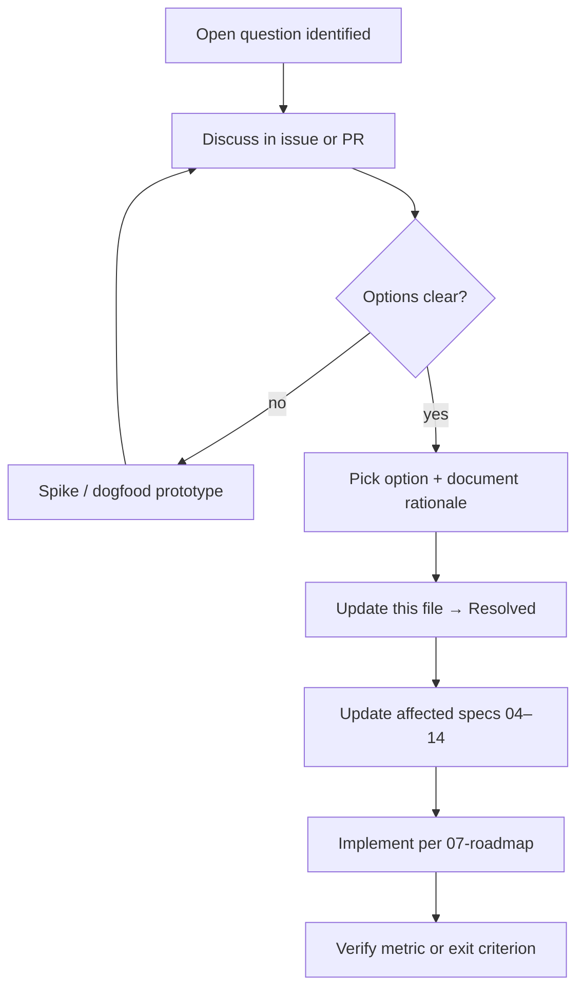
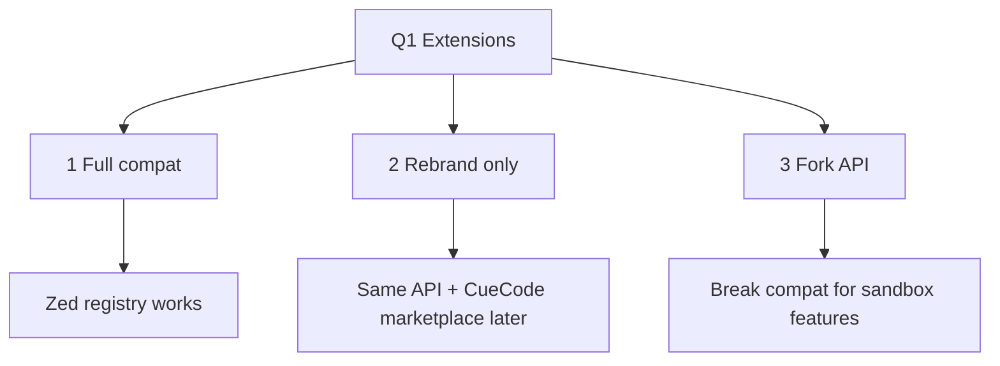
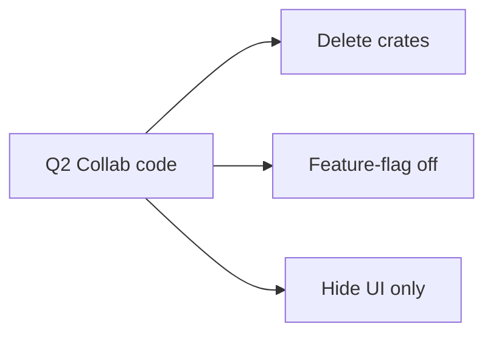
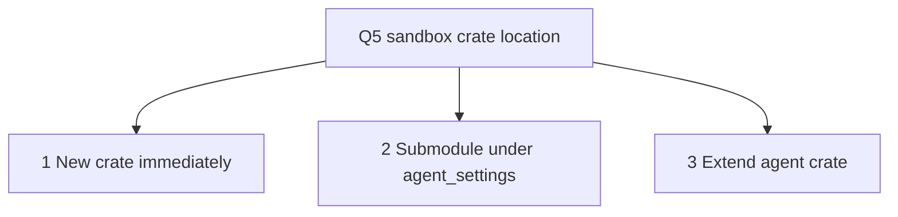
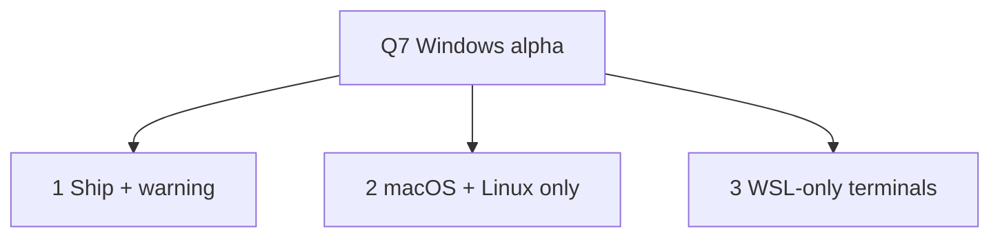
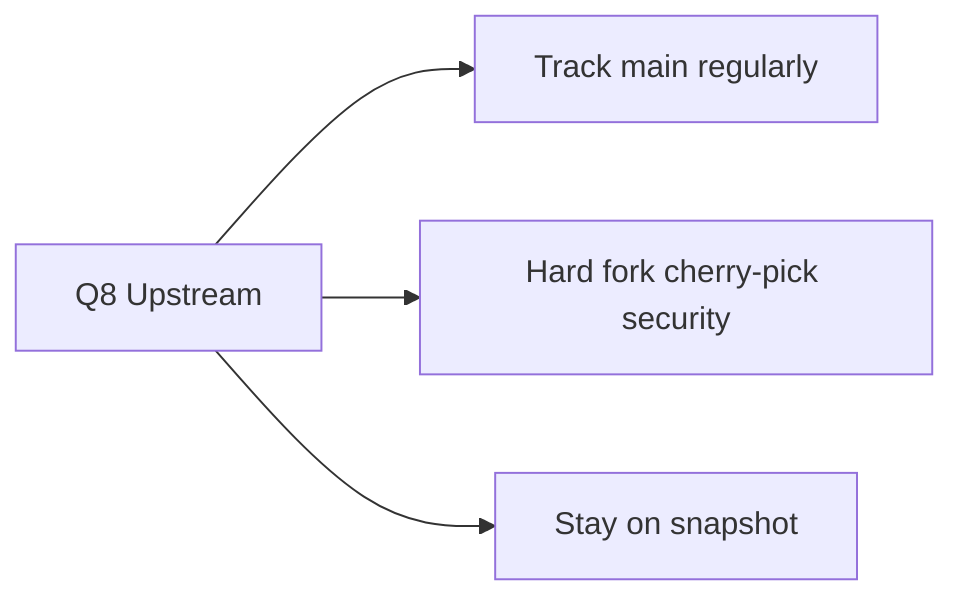
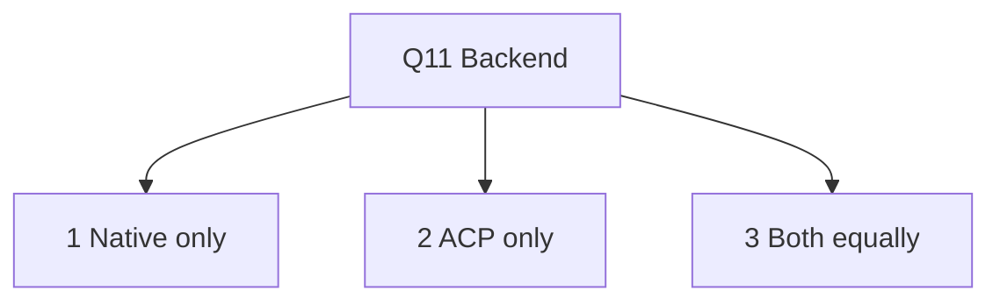
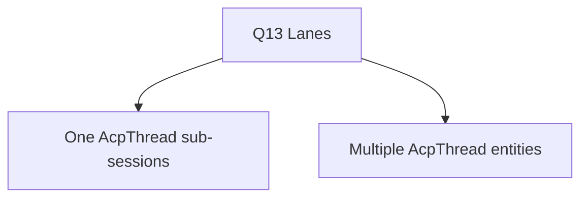
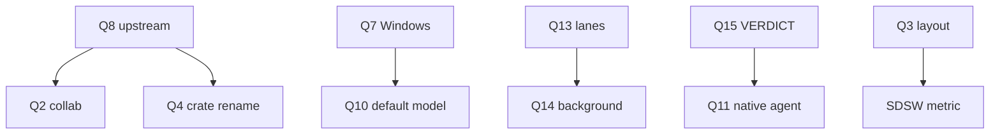
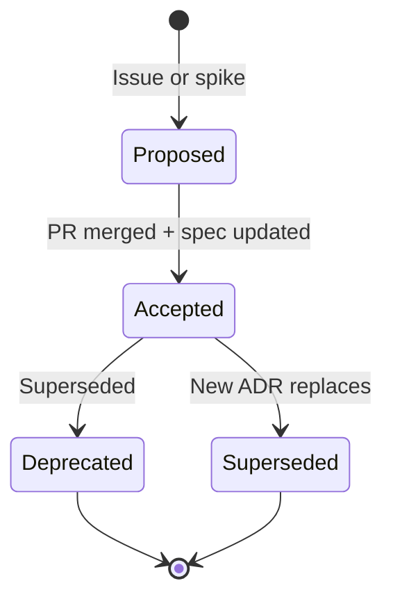

# Open Questions {#open-questions}

Unresolved decisions for CueCode. Each question includes a **decision framework**,
options diagram, tradeoff analysis, and **recommendation narrative**.

Update this doc as choices are made; link to ADRs or PRs. Move resolved items to
[§Resolved](#resolved).

**How to use:** Before architectural PRs, grep this file for related `{#qN-...}` anchors.
Agents must not silently decide open questions — escalate or follow recommendation.

---

## How to resolve a question {#how-to-resolve}



### Resolution template

When resolving, add to **Resolved** table:

| Date | Question | Decision | PR/ADR |
|------|----------|----------|--------|

And update the question section with:

> **Status:** Resolved (YYYY-MM-DD) — [link]

---

## Product {#product-open}

### Q1: Extension compatibility strategy {#q1-extensions}

**Context:** CueCode forks Zed's extension system. Extensions may assume Zed branding,
zed.dev services, or API surface we change.

**Decision framework:**

| Criterion | Weight |
|-----------|--------|
| Time to alpha | High |
| CueCode-specific extension needs | Medium |
| Upstream merge pain | High |
| User migration from Zed | Low (alpha) |

**Options diagram:**



| Option | Pros | Cons |
|--------|------|------|
| **1 Full compat** | Instant extension library | zed.dev deps; hard to add sandbox-only APIs |
| **2 Rebrand only** | Low churn; merge-friendly | Marketplace delay; branding confusion short-term |
| **3 Fork API** | Full CueCode product control | Huge diff; extension authors split |

**ASCII decision tree:**

```
Need CueCode-only extension APIs in alpha?
├── No  → Option 2 (rebrand only)
└── Yes → Can they ship as MCP/skills instead?
          ├── Yes → Option 2
          └── No  → Option 3 (defer to beta planning)
```

**Recommendation narrative:**

Option **2** for alpha: keep Zed extension API compatible so the fork builds and
power users can sideload. Defer **CueCode marketplace** until beta when branding
and `APP_NAME` paths are stable. Document "extensions may reference Zed" in release
notes. Revisit Option 3 only if sandbox/intent APIs cannot be exposed via skills or
MCP.

**Status:** Open

---

### Q2: Keep collab/call code in tree? {#q2-collab}

**Context:** Zed collab (`collab`, channels, calls) is large and ties to zed.dev.
CueCode non-goals exclude collab for v1 ([01 §non-goals](../core/01-vision#non-goals)).

**Decision framework:**

| Criterion | Weight |
|-----------|--------|
| Upstream merge cost | Critical |
| Binary size / compile time | Medium |
| Accidental UI exposure | High |
| Future collab optionality | Low |

**Options:**



| Option | Merge pain | Risk |
|--------|------------|------|
| Delete | Highest on upstream pull | Clean product |
| Feature-flag off | Medium | Dead code compiles |
| Hide UI only | Lowest | Users hit broken collab flows |

**Recommendation narrative:**

Option **2 or 3** for alpha. Prefer **feature-flag off** if compile time is acceptable;
otherwise **hide UI** + disable network calls to zed.dev collab endpoints. Do **not**
delete collab crates until upstream merge strategy ([Q8](#q8-upstream)) is "hard fork."
Deleting is a one-way door that makes every upstream merge a manual nightmare.

**Status:** Open

---

### Q3: Composer-first as default layout? {#q3-layout-default}

**Context:** [05 §composer-first](../core/05-innovations#composer-first) puts agent composer
central vs classic editor-first layout.

**Decision framework:**

| Criterion | Weight |
|-----------|--------|
| New user comprehension | High |
| Zed migrator familiarity | Medium |
| Dogfood signal | High |
| Implementation cost | Low (mostly layout preset) |

**Options diagram:**

```
                    Q3 Layout default
                           │
         ┌─────────────────┼─────────────────┐
         ▼                 ▼                 ▼
   1 Default ON      2 Opt-in preset    3 Never default
   (new installs)    (onboarding pick)  (power user)
```

| Option | When to choose |
|--------|----------------|
| 1 Default ON | Dogfood shows faster SDSW vs editor-first |
| 2 Opt-in preset | Alpha — safest; A/B in dogfood |
| 3 Never default | Editor-first audience only |

**Recommendation narrative:**

Option **2** for alpha: offer **"Sandbox layout"** preset during onboarding without
forcing it. Measure SDSW and session length vs control. Move to Option 1 only if
dogfood shows >15% SDSW lift with no accept-rate drop. GPUI implementation: workspace
serialization preset in `agent_ui` + `workspace`, not a separate binary.

**Status:** Open

---

## Technical {#technical-open}

### Q4: Crate rename `zed` → `cuecode`? {#q4-crate-rename}

**Context:** Root crate `zed` powers the binary. Renaming to `cuecode` clarifies fork
identity but touches every integration test and script.

**Tradeoff matrix:**

| Dimension | Keep `zed` | Rename `cuecode` |
|-----------|------------|------------------|
| Import churn | None | Massive |
| Fork identity | Weak | Strong |
| Upstream merge | Easier | Harder |
| User-facing binary | `cuecode` (via rename binary only) | Aligned |

**Recommendation narrative:**

Defer to **post-alpha** (L3 in [03 §rename-depth](../core/03-fork-and-rebrand#rename-depth)).
Alpha should rename **binary**, `APP_NAME`, and paths only. Internal crate name is
cosmetic to users; merge velocity matters more pre-beta. Revisit when upstream merge
strategy ([Q8](#q8-upstream)) is decided.

**Status:** Open

---

### Q5: Where does `cuecode_sandbox` live initially? {#q5-sandbox-crate}

**Context:** [06 §cuecode_sandbox](../core/06-system-design#new-crates) owns intent, trust,
checkpoints, execution context.

**Options:**



| Option | Best when |
|--------|-----------|
| 1 New crate | API stable; multiple consumers |
| 2 Submodule | Rapid iteration Phase 2 |
| 3 Extend agent | Minimal files — violates separation |

**Recommendation narrative:**

Option **2** for Phase 2: nest `cuecode_sandbox` module under `agent_settings` or
adjacent crate until intent profiles and tool filters stabilize. **Extract** to standalone
crate in Phase 4 when `agent_ui`, `agent`, and tests import it cleanly. Avoid Option 3
— `agent` is already large; sandbox policy deserves isolation.

**Status:** Open

---

### Q6: Spec write confirmation — always? {#q6-spec-confirm}

**Context:** SDAL may mirror plan checkboxes into `.cursor/specs/` files.

**Decision framework:**

| Risk | Mitigation |
|------|------------|
| Agent corrupts spec source of truth | Always confirm |
| Friction on checkbox sync | Optional "sync spec" toggle |
| Malicious prompt injection to specs | Confirm + diff in review UI |

**Options:**

| Mode | Behavior |
|------|----------|
| Always confirm | Every `propose_spec_update` → unified review |
| Auto sync plan only | Checkbox mirrors only; prose needs confirm |
| Never (reject) | Specs read-only for agent |

**Recommendation narrative:**

**Yes — always confirm in v1** for prose changes. **Auto-write** only for plan checkbox
sync when user enables explicit **"Sync spec checkboxes"** toggle on linked spec.
Implementation: `cuecode_specs::propose_spec_update` → review pane never silent `write_file`.

**Status:** Open

---

### Q7: Windows sandbox story {#q7-windows}

**Context:** No Seatbelt/Bubblewrap on Windows ([10 §windows-sandbox](./10-infrastructure#windows-sandbox)).

**Options diagram:**



| Option | Narrative |
|--------|-----------|
| 1 Ship + warning | Max reach; honest about unsandboxed terminals |
| 2 macOS + Linux only | Smallest team; clearest security story |
| 3 WSL-only | Middle ground; requires WSL2 installed |

**Recommendation narrative:**

If team is **small**: Option **2** for alpha — focus dogfood on sandboxed OSes.
If **Windows required**: Option **1** with persistent `agent_ui` banner + Fix/Ship
default to confirm unsandboxed runs. Option **3** as follow-up if WSL detection is reliable.
Block **Ship** intent push operations without explicit confirm on Windows regardless.

**Status:** Open

---

## Legal and upstream {#legal-open}

### Q8: Upstream merge strategy {#q8-upstream}

**Context:** Fork must balance security fixes from `zed-industries/zed` vs CueCode divergence.

**Options:**



| Strategy | Rebase cost | Security | Feature velocity |
|----------|-------------|----------|----------------|
| Track main | High ongoing | Best | Slow |
| Hard fork | Low | Manual CVE watch | Fast |
| Snapshot | Medium one-time | Stale | Fastest short-term |

**Recommendation narrative:**

Document choice in root README. **Default recommendation:** track **main monthly** with
automated CI merge attempt; if merge cost exceeds 2 days/month, switch to **hard fork**
with `zed-cherry-pick` skill for security fixes. Snapshot only for demos — not production
dogfood. This choice cascades to [Q2](#q2-collab) and [Q4](#q4-crate-rename).

**Status:** Open

---

### Q9: Trademark — "CueCode" {#q9-trademark}

**Context:** Product name for distribution in target markets.

**Decision framework:**

- USPTO / EUIPO preliminary search
- Conflict with existing devtools brands
- Domain + social handles

**Recommendation narrative:**

**User to verify** with counsel before public beta. Engineering can use CueCode internally
during alpha. Block **public marketing** and **store listings** until cleared. Document
finding in Resolved table.

**Status:** Open — user to verify

---

## Model and AI {#ai-open}

### Q10: Default local model {#q10-default-model}

**Context:** Onboarding and docs need a concrete Ollama model.

**Candidates:**

| Model | Pros | Cons |
|-------|------|------|
| `qwen2.5-coder` | Strong code; reasonable size | RAM on small machines |
| `deepseek-coder` | Good codegen | Naming/version churn |
| `llama3.1` | General | Weaker on Rust |
| User choice only | No wrong default | Higher first-run friction |

**Recommendation narrative:**

Document **`qwen2.5-coder:7b`** as **suggested** default in onboarding copy, not hard-coded
if user has other models. Settings default: empty → onboarding; if Ollama lists models,
pick best match heuristic (coder tag > size > 7b). See [10 §model-settings](./10-infrastructure#model-settings).

**Status:** Open

---

### Q11: Native agent vs ACP-only {#q11-agent-backend}

**Context:** CueCode can invest in native `agent` crate or thin-shell ACP to Cursor/Claude.

**Options:**



| Option | Moat |
|--------|------|
| Native only | Full SDAL, sandbox, specs |
| ACP only | Fast parity; weak differentiation |
| Both | Best power-user story; more maintenance |

**Recommendation narrative:**

Option **3**: **Native agent** for spec/sandbox/intent/harness integration (non-negotiable
moat). **ACP** for users who bring external agents — but CueCode UI still owns review,
checkpoints, permissions. Native path is default; ACP labeled "External agent."

**Status:** Open

---

## Harness {#harness-open}

See [harness/local/01-agent-harness.md](../harness/local/01-agent-harness.md#open-questions) (local) and [harness/cloud/08-roadmap.md](../harness/cloud/08-roadmap.md#open-questions) (cloud).

### Q13: Multi-lane — one AcpThread or many? {#q13-lanes}

**Context:** Multi-lane UI ([local §C.4](../harness/local/01-agent-harness.md#c-4-multi-lane-gpui-native-swarms))
needs session model decision.

**Options:**



| Option | Pros | Cons |
|--------|------|------|
| One thread, sub-sessions | Unified plan; simpler notifications | Complex state machine |
| Many threads | Clear isolation | Plan/checkpoint sync harder |

**Decision criteria:**

- Shared checkpoint stack required? → favors one parent
- Independent models per lane? → favors many
- GPUI tab model? → maps to many visually

**Recommendation narrative:**

**v1:** **One parent `AcpThread`** with **sub-sessions** keyed by `session_id` (mirror
sidechain model). Lanes are UI filters over sub-sessions + shared spec index. Revisit
many threads if dogfood shows plan sync pain.

**Status:** Open

---

### Q14: Background spawn — in-process task vs separate ACP connection? {#q14-background}

**Context:** Async harness ([local §B.1](../harness/local/01-agent-harness.md#b-1-background-subagents))
must run without blocking GPUI.

**Options:**

```
Q14 Background transport
────────────────────────
  A) in-process Task (cx.spawn / background_spawn)
        │
        ├── Same AcpThread state
        └── Risk: borrow / cancel complexity

  B) separate ACP connection per subagent
        │
        ├── Clean isolation
        └── Heavier; more processes
```

| Option | Rust pattern |
|--------|--------------|
| In-process | `cx.spawn` + `Task` handle; cancel on drop |
| Separate ACP | `agent_servers` new connection |

**Recommendation narrative:**

**v1 in-process** `Task` with sidechain transcript on disk; same parent `AcpThread` for
notifications. **v2** evaluate separate ACP if isolation bugs appear (runaway tools,
deadlock). Must satisfy: subagent cancel does not poison parent ([local §policies](../harness/local/01-agent-harness.md#policies)).

**Status:** Open

---

### Q15: VERDICT format — line-based vs structured JSON tool output? {#q15-verdict}

**Context:** Verification agent ([local §B.2](../harness/local/01-agent-harness.md#b-2-verification-agent-async-gate))
needs parseable output.

**Options:**

| Format | Example | Parser |
|--------|---------|--------|
| Line-based | `VERDICT: PASS` | Regex — fragile |
| JSON tool | `submit_verdict({ "status": "pass" })` | Schema — robust |
| Markdown file | `verdicts/turn.md` frontmatter | Human-readable |

**Recommendation narrative:**

**v1:** dedicated tool `submit_verdict` returning structured JSON **enforced in Rust**
(read-only agent still allowed this one write-to-session-dir tool). **Also** mirror human
summary in markdown artifact for unified review. Line-based `VERDICT:` as fallback parser
only. Blocks Ship intent on `Fail` unless user override with confirm.

**Status:** Open

---

### Q16: Coordinator — separate prompt template vs intent-only? {#q16-coordinator}

**Context:** Orchestrate intent ([local §C.1](../harness/local/01-agent-harness.md#c-1-coordinator-lite-orchestrate-intent)).

| Approach | Detail |
|----------|--------|
| Intent-only | Tool filter + system prompt delta |
| Separate template | `coordinator_system_prompt.hbs` |
| Separate built-in agent | `agent_type: coordinator` on main thread |

**Recommendation narrative:**

**Intent-only + tool filter** for alpha; add dedicated template when dogfood shows coordinator
role confusion. Do not spawn nested coordinator — main thread **is** coordinator.

**Status:** Open

---

## Cloud harness (Model B) {#cloud-harness-open}

See [harness/cloud/08-roadmap.md §open-questions](../harness/cloud/08-roadmap.md#open-questions) for CQ1–CQ10 (CHP transport, shared types crate, cloud sign-in vs GPL no-account, transcript retention, etc.).

Resolve cloud-specific decisions there first; file ADRs in `.cursor/specs/decisions/` when closed.

---

## Cross-question dependency map {#dependency-map}



---

## Question priority (alpha) {#priority}

| Priority | IDs | Blocker for |
|----------|-----|-------------|
| P0 | Q7, Q8, Q11 | Alpha scope |
| P1 | Q5, Q6, Q13, Q14, Q15 | Phase 2–3 harness |
| P2 | Q1, Q2, Q3, Q10 | Beta polish |
| P3 | Q4, Q9, Q16 | Post-alpha |

---

## Decision record template (ADR) {#decision-record-template}

Use this template when resolving any `{#qN-...}` open question. Store ADRs in
`.cursor/specs/decisions/` (future directory) or link from PR description.

### ADR format {#adr-format}

```markdown
# ADR-NNN: [Short title in imperative mood]

**Status:** Proposed | Accepted | Deprecated | Superseded by ADR-XXX
**Date:** YYYY-MM-DD
**Deciders:** [roles or names]
**Related question:** [12-open-questions.md#qN-...]
**Related specs:** [04], [14], etc.

## Context

What is the issue we're seeing that motivates this decision?
Include constraints: alpha timeline, merge cost, dogfood evidence.

## Decision drivers

| Driver | Weight (H/M/L) | Notes |
|--------|----------------|-------|
| Time to alpha | H | |
| User safety | H | |
| Upstream merge cost | M | |
| Dogfood metric impact | M | |

## Considered options

### Option 1: [Name]

**Description:** ...

| Pros | Cons |
|------|------|
| ... | ... |

### Option 2: [Name]

...

## Decision outcome

**Chosen option:** Option N — [one sentence]

**Rationale:** Why this option wins given drivers and current phase.

## Consequences

### Positive

- ...

### Negative / tradeoffs

- ...

### Neutral

- ...

## Compliance / verification

How we know the decision is implemented correctly:

- [ ] Spec sections updated (list anchors)
- [ ] Metric or exit criterion named
- [ ] Open question marked Resolved in 12
- [ ] PR merged: #NNN

## Notes

Links to spikes, dogfood quotes, diagrams.
```

### ADR lifecycle {#adr-lifecycle}



### ADR numbering {#adr-numbering}

| Range | Domain |
|-------|--------|
| ADR-001–019 | Product (layout, extensions, collab) |
| ADR-020–039 | Platform (crates, sandbox, upstream) |
| ADR-040–059 | AI / models / harness |
| ADR-060–079 | Metrics / telemetry / legal |

Filename: `ADR-NNN-short-title.md` — kebab-case, matches H1.

### When to write an ADR vs update 12 only {#adr-vs-open-questions}

| Situation | Action |
|-----------|--------|
| Single option obvious from recommendation | Update 12 Resolved table only |
| Multiple viable options with long-lasting impact | Full ADR + 12 Resolved link |
| Reversible tactical choice | 12 Resolved note sufficient |
| Security / legal / fork identity | Always ADR |

---

## Worked example ADR: Q13 Multi-lane session model {#adr-example-q13}

Full ADR demonstrating resolution of [Q13: Multi-lane — one AcpThread or many?](#q13-lanes).

```markdown
# ADR-041: One parent AcpThread with sub-sessions for multi-lane v1

**Status:** Accepted (pending implementation — treat as decision for alpha)
**Date:** 2026-06-17
**Deciders:** Agent platform, GPUI, Product
**Related question:** 12-open-questions.md#q13-lanes
**Related specs:** harness/local/01-agent-harness.md#c-4-multi-lane-gpui-native-swarms,
  harness/local/01-agent-harness.md#lane-panel-ui, 06-system-design.md#new-crates

## Context

Multi-lane UI ([local §C.4](../harness/local/01-agent-harness.md#c-4-multi-lane-gpui-native-swarms))
requires a session model for parallel explore / implement / verify lanes. Two
architectures are viable:

1. **One parent `AcpThread`** with sub-sessions keyed by `session_id` (mirrors
   existing sidechain model for background agents).
2. **Multiple `AcpThread` entities** — one per lane tab — with explicit sync.

Dogfood needs lane panel in beta gate ([11 §beta-gate](./11-metrics-and-success#beta-gate)).
Wrong choice causes plan desync, duplicate checkpoints, or notification routing bugs.

Existing code already spawns subagents with `session_id` and sidechain JSONL
([local §B.1](../harness/local/01-agent-harness.md#b-1-background-subagents)). Multi-lane should extend
this pattern rather than invent parallel thread entities.

## Decision drivers

| Driver | Weight | Notes |
|--------|--------|-------|
| Shared checkpoint stack | H | User expects one rewind timeline |
| Unified plan + spec index | H | SDAL assumes one plan per session |
| Implementation time to beta | H | Sub-session model reuses sidechain |
| Independent model per lane | M | Can set model on spawn, not thread entity |
| GPUI tab isolation | M | UI filter, not separate entity required |
| Notification routing clarity | M | Parent owns rail |
| Upstream merge cost | L | Mostly CueCode-new code |

## Considered options

### Option 1: One parent AcpThread + sub-sessions

**Description:** Lanes are UI tabs filtering sub-sessions under one parent. Shared
plan, checkpoint stack, spec index. Each lane spawn gets `session_id`; coordinator
is the parent thread (Orchestrate intent).

| Pros | Cons |
|------|------|
| Reuses sidechain + notification protocol | Parent state machine grows complex |
| Single plan + SDAL story | Lane conflict detection needed |
| One checkpoint stack | Cancel/lifecycle must not poison parent |
| Matches Q14 in-process spawn recommendation | Harder if lanes need fully independent plans later |

### Option 2: Multiple AcpThread entities

**Description:** Each lane tab is its own `AcpThread` with cross-thread sync layer.

| Pros | Cons |
|------|------|
| Strong isolation per lane | Plan/checkpoint sync is new hard problem |
| Maps 1:1 to GPUI tabs mentally | Duplicate spec index injection |
| Independent archive/close | Notification routing across threads |
| | Breaks "session-first" unit of work |

### Option 3: Hybrid — parent + one implement thread only

**Description:** Parent for coordinator/explore; second thread only for implement.

| Pros | Cons |
|------|------|
| Smaller than full multi-thread | Arbitrary split; verify still needs home |
| | Two plans or sync anyway |

## Decision outcome

**Chosen option:** Option 1 — **One parent `AcpThread` with sub-sessions keyed by
`session_id`.**

**Rationale:**

- Aligns with existing `spawn_agent` + sidechain infrastructure ([local §data-flow](../harness/local/01-agent-harness.md#data-flow)).
- Preserves single plan, single checkpoint stack, single SDSW session unit ([11 §SDSW](./11-metrics-and-success#sdsW)).
- Q14 recommendation (in-process background `Task`) assumes shared parent state.
- Lane panel is a **view** over sub-sessions, not new entity types ([local §lane-switch](../harness/local/01-agent-harness.md#lane-switch)).
- Independent models per lane achieved via `SpawnAgentToolInput` + model picker, not separate threads.

## Consequences

### Positive

- Faster beta: extend notification rail + lane tabs without new session entity.
- Coordinator (Orchestrate) naturally owns parent composer — no nested coordinator thread.
- `LaneConflict` notification ([local §rust-types](../harness/local/01-agent-harness.md#rust-types)) blocks dual writers on same path set.
- Metrics: one `session_start` per user session; lanes tracked via `spawn_background` + lane id field.

### Negative / tradeoffs

- Parent `AcpThread` state machine must track N sub-session lifecycles.
- Closing a lane cancels `Task` but must not drop parent plan entries.
- If dogfood shows plan sync pain, revisit many-thread model in ADR-042 (explicit supersede).

### Neutral

- GPUI implements lanes as `Vec<LaneTab>` subscribed to parent sub-session metadata.
- Explore lane defaults async; implement defaults active — execution context per spawn, not per thread.

## Compliance / verification

- [ ] `harness/local/01-agent-harness.md` lane sections reference parent + sub-session model
- [ ] `12-open-questions.md` Q13 marked Resolved with link to ADR-041
- [ ] `cargo test -p acp_thread` covers multi sub-session notification routing
- [ ] GPUI test: lane tab switch filters transcript without new AcpThread
- [ ] Metric: `lane_id` optional field on `spawn_background` event ([11 §event-catalog](./11-metrics-and-success#event-catalog))
- [ ] Dogfood: multi-lane story in [local §lane-panel-full](../harness/local/01-agent-harness.md#lane-panel-full) replayable

## Notes

- Spike: 2-day prototype lane tabs over mock sub-session list in `agent_ui`.
- If superseded, new ADR must address checkpoint/plan sync requirements explicitly.
- Cross-link [Q14](./12-open-questions#q14-background): in-process spawn remains v1 transport.
```

### Applying the worked example {#adr-example-application}

To close Q13 using this ADR:

1. Copy ADR-041 to `.cursor/specs/decisions/ADR-041-multi-lane-sub-sessions.md`
2. Update Q13 section:

> **Status:** Resolved (2026-06-17) — [ADR-041](./decisions/ADR-041-multi-lane-sub-sessions.md)

3. Add row to [§Resolved](#resolved):

| Date | Question | Decision | PR/ADR |
|------|----------|----------|--------|
| 2026-06-17 | Q13 Multi-lane threads | One parent AcpThread + sub-sessions | ADR-041 |

4. Implement per [local §lane-panel-ui](../harness/local/01-agent-harness.md#lane-panel-ui).

### ADR review checklist {#adr-review-checklist}

Before marking Accepted:

- [ ] All options from open question documented with pros/cons
- [ ] Decision drivers weighted explicitly
- [ ] Consequences include negative tradeoffs (not cheerleading)
- [ ] Verification steps are testable
- [ ] Spec anchors updated in same PR as ADR
- [ ] No silent decision — PR description links ADR

---

## Resolved {#resolved}

_Move items here when decided, with date and link._

| Date | Question | Decision |
|------|----------|----------|
| 2026-06-16 | Spec directory location | `.cursor/specs/` (this tree) |

---

## Escalation {#escalation}

If implementation is blocked on an open question:

1. Comment in PR with `{#qN-...}` link
2. Propose spike with time box (≤2 days)
3. If recommendation exists, implement per recommendation and note "assumed QN"
4. Product owner resolves before beta gate

---

## Index of anchors {#anchor-index}

| Anchor | Topic |
|--------|-------|
| `{#q1-extensions}` | Extension compat |
| `{#q2-collab}` | Collab code |
| `{#q3-layout-default}` | Composer-first |
| `{#q4-crate-rename}` | zed → cuecode crate |
| `{#q5-sandbox-crate}` | cuecode_sandbox location |
| `{#q6-spec-confirm}` | Spec write confirm |
| `{#q7-windows}` | Windows sandbox |
| `{#q8-upstream}` | Upstream merge |
| `{#q9-trademark}` | CueCode trademark |
| `{#q10-default-model}` | Ollama default |
| `{#q11-agent-backend}` | Native vs ACP |
| `{#q13-lanes}` | Multi-lane threads |
| `{#q14-background}` | Background spawn |
| `{#q15-verdict}` | VERDICT format |
| `{#q16-coordinator}` | Coordinator template |
