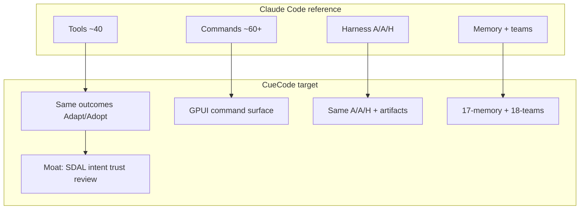

# Competitive parity program {#competitive-parity}

> **Status:** Draft — full Claude Code harness parity spec program  
> **Inventory:** [research/00-claude-code-inventory](../research/00-claude-code-inventory.md) · **Policy:** [research/01-parity-decisions](../research/01-parity-decisions.md)

CueCode **competes with Claude Code on harness capability** — not by cloning a terminal REPL, but by delivering **equivalent outcomes** in a native GPUI sandbox with **strict Active / Async / Hybrid** semantics and **CueCode moat** layers (SDAL, intent, checkpoints, unified review).

---

## Thesis {#thesis}

**Competitive 1.0 definition:** Every row in [00-inventory](../research/00-claude-code-inventory.md) is **Adopt**, **Adapt**, **Defer** (with phase), or **Reject** (with rationale) — and every **Adapt/Adopt** row has an E2E acceptance path in [16-end-to-end-flows](./16-end-to-end-flows.md).

---

## Parity vs moat {#parity-vs-moat}

| Layer | Compete with Claude Code? | CueCode stance |
|-------|---------------------------|----------------|
| Tool execution (read/edit/terminal/grep/web/MCP) | Yes — baseline | **Adopt** Zed tools |
| Subagents + background + verify | Yes — core harness | **Adapt** to GPUI rail + VERDICT |
| Coordinator / teams / tasks | Yes | **Adapt** lanes + task protocol ([18](./18-teams-and-tasks.md)) |
| Memory / compact / context | Yes | **Adapt** memdir + context budget ([17](./17-memory-and-context.md)) |
| Slash commands | Yes — capability parity | **Adapt** to palette/composer ([19](./19-command-surface.md)) |
| Bridge / mobile / desktop handoff | No | **Reject** — CueCode is the IDE ([20](./20-platform-integrations.md)) |
| Plugins marketplace | No | **Reject** v1 |
| SDAL / specs / intent / trust | N/A — CueCode ahead | **Moat** — ship in addition to parity |

Do not sacrifice moat for parity. Parity rows must still pass [13 §checklist](../agent/13-ai-maxxing#design-checklist).

---

## Spec program map {#spec-program}

| Doc | Purpose |
|-----|---------|
| [research/00-claude-code-inventory](../research/00-claude-code-inventory.md) | Master tool/command/service index + decisions |
| [research/01-parity-decisions](../research/01-parity-decisions.md) | Adopt/Adapt/Defer/Reject policy |
| **15-competitive-parity** (this file) | Program thesis + phases |
| [16-end-to-end-flows](./16-end-to-end-flows.md) | E2E acceptance (Gherkin) |
| [17-memory-and-context](./17-memory-and-context.md) | Memory, compact, context viz |
| [18-teams-and-tasks](./18-teams-and-tasks.md) | Teams, tasks, lanes, worktrees |
| [19-command-surface](./19-command-surface.md) | Slash → GPUI mapping |
| [20-platform-integrations](./20-platform-integrations.md) | Cron, remote, voice, GitHub, hooks |
| [21-ai-surfaces](./21-ai-surfaces.md) | Agent vs inline vs Copilot |

Existing docs remain authoritative for implementation detail: [harness/local](../harness/local/01-agent-harness.md), [08-tools](../agent/08-agent-tools-and-skills), [09-ui](../design/09-ui-ux-spec).

---

## Active / Async / Hybrid — program law {#harness-law}

Every parity feature must:

1. Classify **Active**, **Async**, or **Hybrid** ([local §feature-matrix](../harness/local/01-agent-harness.md#feature-matrix)).
2. If **Hybrid**, name the **handoff artifact** ([local §C.5](../harness/local/01-agent-harness.md#c-5-hybrid-handoff-artifacts-required)).
3. Appear in at least one [16](./16-end-to-end-flows.md) flow or justify as infrastructure-only.

---

## Phased delivery {#phases}

Aligns with [07-implementation-roadmap](../delivery/07-implementation-roadmap) + parity gates from [01-policy](../research/01-parity-decisions.md#score-targets).

### P0 — Inventory + law (this program)

- [x] [00-inventory](../research/00-claude-code-inventory.md)
- [x] [01-policy](../research/01-parity-decisions.md)
- [x] [15–21] gap docs
- [ ] Link all PRs to inventory row IDs

### P1 — Active parity (Alpha)

**Target:** 85% tool Adopt+Adapt; daily coding flow A.

| Deliverable | CC analog | Doc |
|-------------|-----------|-----|
| Spec index + SDAL tools | — (moat) | [08](../agent/08-agent-tools-and-skills) |
| Core tools + permissions | File*, Bash, MCP | [08](../agent/08-agent-tools-and-skills) |
| Plan entity + plan gate | EnterPlanMode | [16 flow A](./16-end-to-end-flows.md#flow-a-daily-coding) |
| `ask_user` | AskUserQuestionTool | [08](../agent/08-agent-tools-and-skills) |
| Context compact | `/compact` | [17 §compact](./17-memory-and-context.md#compact) |
| Command palette mapping | top 20 commands | [19](./19-command-surface.md) |

### P2 — Async parity (Alpha harness v1)

**Target:** background spawn, notifications, verify.

| Deliverable | CC analog | Doc |
|-------------|-----------|-----|
| `run_in_background` + sidechains | AgentTool async | [local §B](../harness/local/01-agent-harness.md#part-b-async) |
| Notification rail + payloads | LocalAgentTask | [local §notification-payloads](../harness/local/01-agent-harness.md#notification-payloads) |
| Verification + VERDICT | verificationAgent | [16 flow B](./16-end-to-end-flows.md#flow-b-ship-verify) |
| Stop hooks (memory extract v1) | stopHooks + extractMemories | [17 §stop-hooks](./17-memory-and-context.md#stop-hooks) |
| Task stop / output | TaskStop/Output | [18 §cancellation](./18-teams-and-tasks.md#cancellation) |

### P3 — Hybrid parity (Beta)

**Target:** coordinator, lanes, tasks, worktree.

| Deliverable | CC analog | Doc |
|-------------|-----------|-----|
| Orchestrate intent | coordinatorMode | [18 §coordinator](./18-teams-and-tasks.md#coordinator) |
| Multi-lane UI | teams + parallel agents | [16 flow C](./16-end-to-end-flows.md#flow-c-coordinator) |
| Task protocol | Task* tools | [18 §task-protocol](./18-teams-and-tasks.md#task-protocol) |
| Worktree isolation | EnterWorktree | [18 §worktree](./18-teams-and-tasks.md#worktree-isolation) |
| Memory browser | `/memory` | [17 §memory-ui](./17-memory-and-context.md#memory-ui) |

### P4 — Platform parity (Competitive 1.0)

| Deliverable | CC analog | Decision |
|-------------|-----------|----------|
| Cron agents | ScheduleCron* | Defer → ship or permanent defer ADR |
| Session share/export | `/share`, `/export` | Adapt |
| Remote resume | remote/ | Defer |
| Voice input | `/voice` | Defer |
| GitHub PR comments | `/pr_comments` | Defer |

---

## Explicit rejects {#explicit-rejects}

| CC capability | Rationale |
|---------------|-----------|
| CLI REPL as primary UX | CueCode is GPUI agent panel ([21](./21-ai-surfaces.md)) |
| `/ide`, `/bridge` | Native IDE replaces bridge ([20 §ide-native](./20-platform-integrations.md#ide-native)) |
| `/desktop`, `/mobile` handoff | v1 non-goal ([01-vision §non-goals](../core/01-vision#non-goals)) |
| Plugin marketplace | Scope; use skills + MCP ([20 §plugins](./20-platform-integrations.md#plugins)) |
| `ConfigTool` agent writes settings | Security; settings UI only |
| `SleepTool` proactive loop | Reject; use cron defer if needed |
| Anthropic billing passes `/passes` | CueCode cloud model TBD |

---

## Acceptance — Competitive 1.0 gate {#competitive-gate}

**Given** the inventory in [00](../research/00-claude-code-inventory.md)  
**When** Competitive 1.0 release is declared  
**Then**:

1. 100% tool rows are Adopt/Adapt or documented Defer/Reject  
2. ≥90% top-60 command rows have GPUI path in [19](./19-command-surface.md)  
3. Flows A–H in [16](./16-end-to-end-flows.md) pass manual QA  
4. Async/Hybrid flows produce structured artifacts (no prose-only completion)  
5. [21](./21-ai-surfaces.md) matrix published — no silent Copilot/agent overlap bugs

---

## Cross-links {#cross-links}

| Topic | Spec |
|-------|------|
| Harness semantics | [harness/local](../harness/local/01-agent-harness.md) |
| Cloud orchestration | [harness/cloud](../harness/cloud/README.md) |
| Tools detail | [08](../agent/08-agent-tools-and-skills) |
| Roadmap phases | [07](../delivery/07-implementation-roadmap) |
| Open questions | [12](../ops/12-open-questions) |

---

## Document status {#status}

| Field | Value |
|-------|-------|
| Status | Draft — program charter |
| Last updated | 2026-06-17 |
| Owner | Product + agent |
