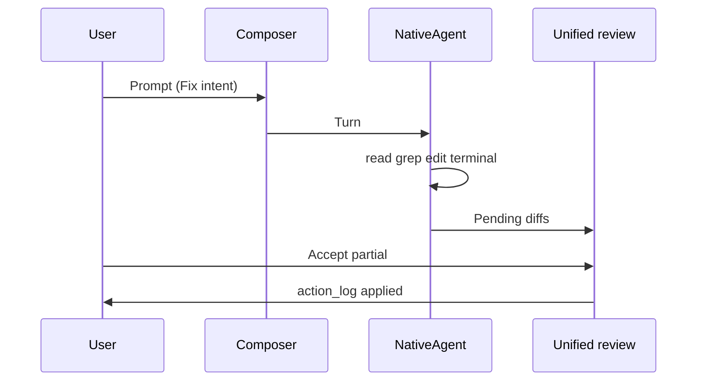
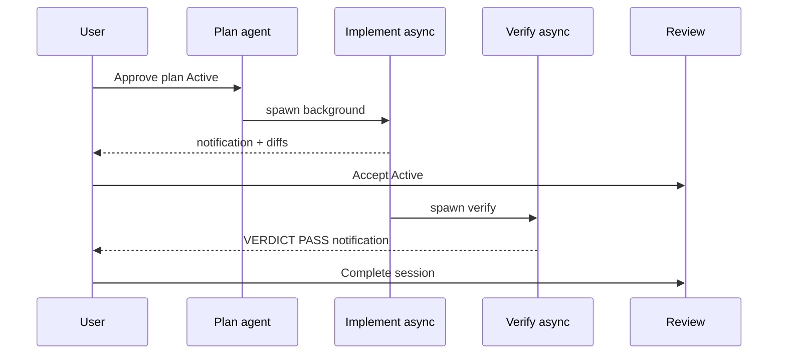
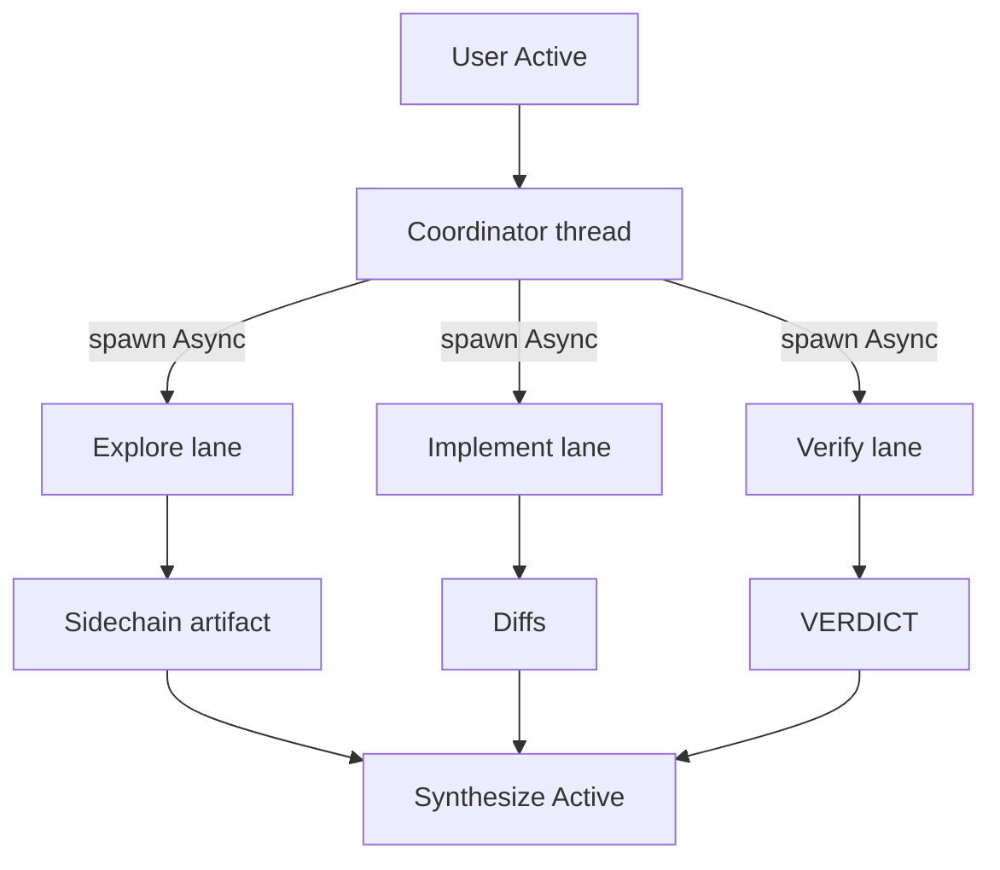

# End-to-end competitive flows {#end-to-end-flows}

> **Program:** [15-competitive-parity](./15-competitive-parity.md) · **Inventory:** [research/00-claude-code-inventory](../research/00-claude-code-inventory.md)

Acceptance-level flows for Claude Code parity using **Active / Async / Hybrid**. Each flow lists CC analog, CueCode path, artifacts, and Gherkin.

**Flow IDs:** Use `CC-FLOW-{A-H}` in PRs and QA scripts.

---

## Flow index {#flow-index}

| ID | Name | CC analog | Primary modes | Spec deps |
|----|------|-----------|---------------|-----------|
| [A](#flow-a-daily-coding) | Daily coding | Default REPL session | Active | 08, 09, 19 |
| [B](#flow-b-ship-verify) | Ship with verify | Plan → agent → verify | Hybrid | local §B.2, 16 |
| [C](#flow-c-coordinator) | Coordinator multi-agent | coordinatorMode + teams | Hybrid | 18 |
| [D](#flow-d-background-away) | Background while away | run_in_background + sidechain | Async → Hybrid | local §async-ui, 17 |
| [E](#flow-e-memory-sessions) | Memory across sessions | /memory + extractMemories | Async + Active | 17 |
| [F](#flow-f-scheduled) | Scheduled agent | CronCreate | Async | 20 §cron |
| [G](#flow-g-security-review) | Security / review | /review, /security-review | Active | 09, 04 Review intent |
| [H](#flow-h-resume-export) | Resume & export | /resume, /export, /rewind | Active | 04 lifecycle, 19 |

---

## Flow A — Daily coding {#flow-a-daily-coding}

**CC analog:** Main thread REPL — prompt → tools → edits → terminal → inline diff.

**CueCode path:** Fix intent · Active · agent panel composer · unified review (when pending edits).



### Artifacts

| Step | Artifact |
|------|----------|
| Plan (optional) | `AcpThread.plan` entries |
| Edits | `action_log` pending → accepted |
| Terminal | Terminal tab in review |

### Gherkin {#gherkin-a}

```gherkin
Feature: CC-FLOW-A Daily coding parity

  Scenario: Fix bug with sandboxed terminal
    Given Fix intent and linked spec optional
    When user prompts to fix a failing test
    Then agent uses read_file and grep without unnecessary confirms
    And terminal runs under OS sandbox when enabled
    And unified review shows diffs before apply
    And user accept creates action_log entries

  Scenario: Command parity compact
    When user invokes compact via command palette
    Then context compacts per 17-compact without losing linked spec path
```

### Parity rows

`FileReadTool`, `GrepTool`, `BashTool`, `/compact`, `/diff` → [00-inventory](../research/00-claude-code-inventory.md)

---

## Flow B — Ship with verify {#flow-b-ship-verify}

**CC analog:** Plan → implement (possibly background) → verificationAgent → user review.

**CueCode path:** Hybrid pipeline — **Active** plan approve → **Async** implement → **Async** verify → **Active** review.



### Artifacts (required) {#artifacts-b}

1. Plan entry / approved plan gate  
2. Checkpoint on accept  
3. `verdicts/<turn>.md` with VERDICT  
4. Notification envelope JSON ([local §notification-payloads](../harness/local/01-agent-harness.md#notification-payloads))

### Gherkin {#gherkin-b}

```gherkin
Feature: CC-FLOW-B Ship with verify

  Scenario: Full hybrid pipeline
    Given Ship or Fix intent with approved plan
    When implement agent runs with run_in_background true
    Then notification rail shows subagent_completed
    When user accepts diffs and creates checkpoint
    And verification agent runs async
    Then VERDICT PASS appears in rail
    And session can_complete is true

  Scenario: FAIL blocks ship
    Given verification returns VERDICT FAIL
    When user attempts session complete under Ship intent
    Then UI blocks until override with confirm
```

### Parity rows

`AgentTool`, `verificationAgent`, `EnterPlanModeTool`, `/plan`, `/review` → [00-inventory](../research/00-claude-code-inventory.md)

---

## Flow C — Coordinator multi-agent {#flow-c-coordinator}

**CC analog:** `COORDINATOR_MODE` — main thread spawns workers; Task* + SendMessage.

**CueCode path:** **Orchestrate intent** · Hybrid · lane panel · task protocol ([18](./18-teams-and-tasks.md)).



### Gherkin {#gherkin-c}

```gherkin
Feature: CC-FLOW-C Coordinator parity

  Scenario: Orchestrate denies direct edit
    Given Orchestrate intent on main thread
    When agent attempts edit_file
    Then intent blocked with CTA to spawn implement lane

  Scenario: Parallel lanes no write conflict
    Given Explore and Implement lanes active
    When both run concurrently
    Then only Implement lane produces file diffs
    And LaneConflict notification if same path targeted
```

### Parity rows

`TeamCreateTool`, `SendMessageTool`, `TaskCreateTool`, coordinatorMode → [18](./18-teams-and-tasks.md)

---

## Flow D — Background while away {#flow-d-background-away}

**CC analog:** Background AgentTool + sidechain JSONL + return to session.

**CueCode path:** **Async** explore/implement · notification rail · **Hybrid** summarize on return.

### Gherkin {#gherkin-d}

```gherkin
Feature: CC-FLOW-D Background away

  Scenario: Deep explore while user multitasks
    Given user spawns explore with run_in_background true
    When explore completes
    Then task pill shows complete
    And notification rail shows subagent_completed
    When user clicks Insert summary
    Then parent thread receives synthesis Hybrid handoff

  Scenario: Away summary on unfocus
    Given window unfocused 20 minutes with active jobs
    When user refocuses
    Then away_summary notification shows job counts
```

### Parity rows

`AgentTool` async, sidechain storage, `/tasks` → [local §B](../harness/local/01-agent-harness.md#part-b-async)

---

## Flow E — Memory across sessions {#flow-e-memory-sessions}

**CC analog:** `/memory`, memdir, extractMemories on stop hook.

**CueCode path:** **Async** extract · **Active** inject at turn start · memory browser ([17](./17-memory-and-context.md)).

### Gherkin {#gherkin-e}

```gherkin
Feature: CC-FLOW-E Memory parity

  Scenario: Stop hook extracts session memory
    Given turn completes with extract enabled
    When stop hook runs Async
    Then memory file updated under ~/.config/cuecode/memory/
    And no main thread state corruption

  Scenario: Relevant memories injected
    Given project memory entries exist
    When new session starts Active
    Then system prompt includes top-k relevant memories under budget
    And user can browse via memory panel equivalent to /memory
```

### Parity rows

`memdir/`, `/memory`, extractMemories → [17](./17-memory-and-context.md)

---

## Flow F — Scheduled agent {#flow-f-scheduled}

**CC analog:** `CronCreateTool` → headless agent → notification.

**CueCode path:** **Async** cron · **Hybrid** handoff on completion ([20 §cron](./20-platform-integrations.md#scheduled-agents)).

**Gate:** Competitive 1.0 defer unless promoted — flow must pass when cron ships.

### Gherkin {#gherkin-f}

```gherkin
Feature: CC-FLOW-F Scheduled agent

  Scenario: Cron fires headless session
    Given cron schedule for verify on main branch
    When cron triggers Async
    Then headless session runs verification agent
    And notification delivered to user's last active workspace
```

---

## Flow G — Security review {#flow-g-security-review}

**CC analog:** `/review`, `/security-review`, read-only analysis.

**CueCode path:** **Review intent** · Active · read-only tool wall · unified review read-only.

### Gherkin {#gherkin-g}

```gherkin
Feature: CC-FLOW-G Security review

  Scenario: Review intent blocks writes
    Given Review intent
    When agent attempts edit_file or terminal write
    Then blocked at permission layer
    And unified review shows diffs and terminal read-only
```

---

## Flow H — Resume & export {#flow-h-resume-export}

**CC analog:** `/resume`, `/rewind`, `/export`, session JSONL.

**CueCode path:** Thread sidebar · checkpoint timeline · session bundle export.

### Gherkin {#gherkin-h}

```gherkin
Feature: CC-FLOW-H Resume export

  Scenario: Resume prior session
    Given archived thread in sidebar
    When user opens thread
    Then transcript plan and linked spec restore
    And coordinator mode matches saved Orchestrate flag if any

  Scenario: Rewind checkpoint
    Given checkpoint stack with turn 5 and turn 8
    When user rewinds to turn 5
    Then action_log and plan match snapshot
    And optional git restore follows 04 lifecycle rules

  Scenario: Export session bundle
    When user exports session
    Then bundle includes sidechains verdicts and checkpoint metadata
```

### Parity rows

`/resume`, `/rewind`, `/export` → [19 §session](./19-command-surface.md#session-commands)

---

## QA script index {#qa-index}

| Flow | Script ID | Owner |
|------|-----------|-------|
| A | QA-CC-A1 | Agent UI |
| B | QA-CC-B1 | Harness |
| C | QA-CC-C1 | Lanes |
| D | QA-CC-D1 | Async rail |
| E | QA-CC-E1 | Memory |
| F | QA-CC-F1 | Platform |
| G | QA-CC-G1 | Intent |
| H | QA-CC-H1 | Session |

Run before Competitive 1.0 gate ([15 §gate](./15-competitive-parity.md#competitive-gate)).

---

## Document status {#status}

| Field | Value |
|-------|-------|
| Status | Draft — acceptance flows |
| Last updated | 2026-06-17 |
