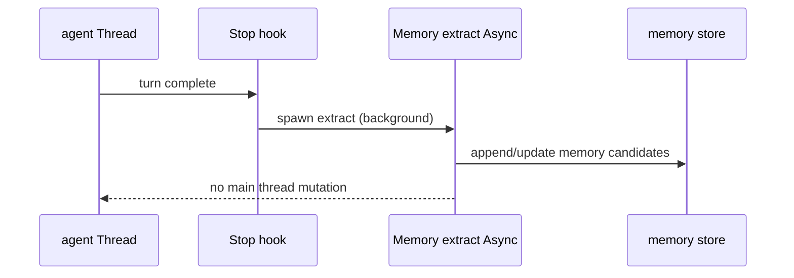

# Memory and context {#memory-and-context}

> **Program:** [15-competitive-parity](./15-competitive-parity.md) · **CC:** memdir, extractMemories, `/memory`, `/compact`, `/context`  
> **Inventory:** [00 §services](../research/00-claude-code-inventory.md#services)

CueCode memory and context system — competitive parity with Claude Code **plus** spec-aware compaction (preserve linked `.cursor/specs/` paths).

---

## Summary {#summary}

| CC capability | CueCode | A/A/H | Decision | Phase |
|---------------|---------|-------|----------|-------|
| memdir | CueCode memory store | Async write / Active read | **Adapt** | 4 |
| extractMemories (stop hook) | Memory extract job | Async | **Adapt** | 3b |
| `/memory` command | Memory browser UI | Active | **Adapt** | 4 |
| `/compact` | Compact now + auto-compact | Active | **Adapt** | 2–4 |
| `/context` | Context budget UI | Active | **Adapt** | 4 |
| teamMemorySync | Opt-in cloud team mem | Async | **Defer** | 6+ |
| CLAUDE.md / init | `@spec` + SDAL (moat) | Active | **Moat** | 1 |

---

## Memory scopes {#memory-scopes}

| Scope | Path | Shared | Extract source |
|-------|------|--------|----------------|
| **Session** | `~/.config/cuecode/sessions/<id>/session-notes.md` | No | Stop hook, compact boundary |
| **Project** | `<worktree>/.cuecode/memory/` or `.cursor/memory/` (TBD Q17) | Git optional | User + agent propose |
| **User** | `~/.config/cuecode/memory/user/` | Cross-project | User `/memory` edits |
| **Team** | Cloud sync bucket (opt-in) | Org | **Defer** [team-memory](#team-memory) |

**Conflict rule:** Linked spec anchors **beat** memory injection when they disagree ([13 §checklist](../agent/13-ai-maxxing#checklist-trust)).

---

## Storage layout {#storage-layout}

```
~/.config/cuecode/
  memory/
    user/
      *.md                    # User-global memories
    projects/
      <repo_hash>/
        *.md                  # Project-scoped
  sessions/
    <session_id>/
      session-notes.md        # Session compact summary
      sidechains/             # (harness — local spec)
      tool-results/
```

Project-scoped files use same `repo_hash` as trust graph ([06 §persistence](../core/06-system-design)).

---

## Extract pipeline {#extract-pipeline}

**CC analog:** `services/extractMemories/` + `stopHooks.ts`.

**CueCode:** Post-turn **Async** job on main session only (subagents must not overwrite parent — match CC guard).



### Extract rules

1. Propose memories as structured candidates — **user confirm** before promotion to project/user scope (v1).
2. Never extract secrets (.env patterns, API keys) — hard deny in extractor prompt.
3. Preserve `linked_spec_path` in session-notes even if memory compacts.

**Crate:** `cuecode_sandbox::memory` or extend `agent` stop hook ([local §B.3](../harness/local/01-agent-harness.md#b-3-post-turn-jobs)).

---

## Stop hooks {#stop-hooks}

| Job | Trigger | Mode | CC analog |
|-----|---------|------|-----------|
| Memory extract | Turn end | Async | extractMemories |
| Session notes | Compact boundary | Async | session summary |
| Away summary | Window unfocus N min | Async | — (CueCode addition) |
| Spec learning extract | Optional | Async | — (SDAL moat) |

Hook registration: `agent::Thread` post-turn; idempotent per turn id.

---

## Retrieval (Active turn start) {#retrieval}

**CC analog:** `findRelevantMemories.ts`.

At session prompt assembly ([08 §system-prompt](../agent/08-agent-tools-and-skills#system-prompt)):

1. Load memory index for project + user scopes.
2. Score relevance (embedding or keyword v1).
3. Inject top-k under **context budget** — never evict linked spec body.
4. `omit_spec_index` agents skip full memory catalog ([local §explore](../harness/local/01-agent-harness.md#explore-prompt-outline)).

---

## Compact {#compact}

**CC analog:** `/compact`, `services/compact/`.

| Surface | Behavior |
|---------|----------|
| Command palette "Compact conversation" | Same as `/compact` |
| Auto-compact at 85% | Setting `agent.auto_compact` + context budget |
| Preserve always | Intent block, linked spec path, memory scope headers |

See [05 §context-budget](../core/05-innovations#context-budget) for UI.

---

## Context budget UI {#context-budget-ui}

**CC analog:** `/context`.

Categories: Specs · Files · Chat · Tools · Memory · Skills catalog.

User actions: Drop chunk · Compact now · Pin linked spec.

---

## Memory UI {#memory-ui}

**CC analog:** `/memory` REPL command.

| UI | Location |
|----|----------|
| Memory browser | Settings → Agent → Memory **or** agent panel `@memory` |
| List entries | Scope filter: session / project / user |
| Edit / delete | User only for project/user; session auto |
| Proposals | Review panel tab when agent proposes memory |

---

## Session brief {#session-brief}

**CC analog:** `BriefTool`.

Attach brief file or markdown to session at start — injected once Active, not re-injected every turn unless pinned.

---

## Team memory {#team-memory}

**CC analog:** `teamMemorySync/`.

**Decision:** **Defer** Competitive 1.0 — opt-in cloud sync post-Beta.

When shipped: same scopes as project memory with org ACL; never sync without admin toggle.

---

## Tools {#tools}

| Tool | Purpose | Phase |
|------|---------|-------|
| `memory_list` | List memories by scope | 4 |
| `memory_read` | Read entry | 4 |
| `memory_propose` | Propose new entry (confirm) | 4 |
| (no `memory_write` silent) | — | — |

Register in [08](../agent/08-agent-tools-and-skills) when implementing.

---

## Acceptance criteria {#acceptance}

### AC-MEM-1: Extract parity

**Given** a completed turn with extract enabled  
**When** stop hook runs  
**Then** session-notes or memory candidate file updates Async without blocking composer

### AC-MEM-2: /memory parity

**Given** project memories exist  
**When** user opens memory browser  
**Then** user can list edit delete entries equivalent to CC `/memory`

### AC-MEM-3: Compact preserves spec

**Given** linked spec `04-sandbox-core#lifecycle`  
**When** user compacts at 85%  
**Then** linked spec path remains in prompt assembly

---

## Open questions {#open-questions}

| ID | Question |
|----|----------|
| Q17 | Project memory path: `.cuecode/memory/` vs `.cursor/memory/` |
| Q18 | Embedding vs keyword retrieval v1 |

File in [12-open-questions](../ops/12-open-questions) when resolved.

---

## Document status {#status}

| Field | Value |
|-------|-------|
| Status | Draft — gap spec |
| Last updated | 2026-06-17 |
