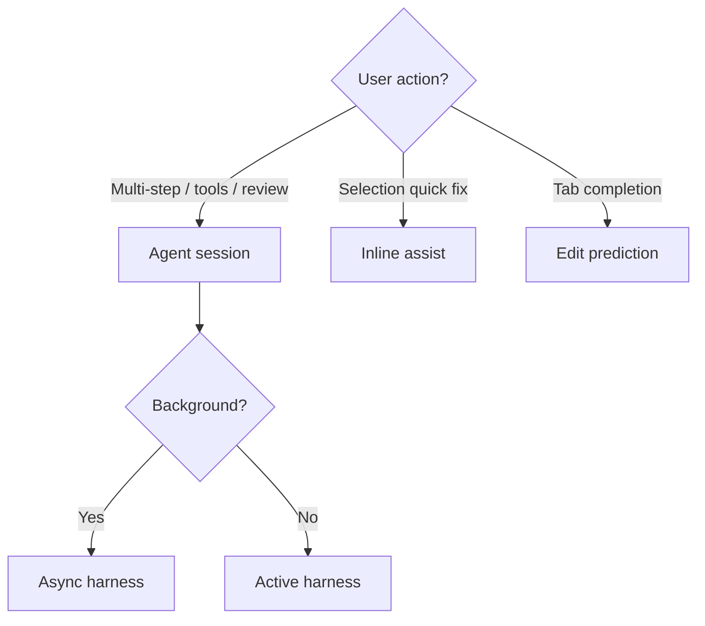

# AI surfaces — Agent, inline, Copilot {#ai-surfaces}

> **Program:** [15-competitive-parity](./15-competitive-parity.md) · **CC:** single REPL · **CueCode:** multi-surface Zed fork

Defines how **agent session**, **inline assist**, and **edit prediction (Copilot)** divide responsibility — required for full competitive clarity.

---

## Surface matrix {#surface-matrix}

| Surface | Crates | User intent | Harness A/A/H | CC parity |
|---------|--------|-------------|---------------|-----------|
| **Agent session** | `agent_ui`, `acp_thread`, `agent` | Multi-step work, tools, lanes | Active / Async / Hybrid | **Primary CC harness parity target** |
| **Inline assist** | `inline_assistant` | Selection-scoped quick edit | Active only | Partial — CC inline in bridge |
| **Edit prediction** | `edit_prediction*`, `copilot*` | Tab-complete ghost text | N/A (non-session) | Baseline IDE parity |
| **Terminal assist** | `terminal_*` | Shell command help | Active | Optional |

**Rule:** Harness features (spawn, verify, lanes, VERDICT) live on **agent session** only — never silently on Copilot.

---

## Agent session (primary) {#agent-session}

**Competes with:** Claude Code main REPL + AgentTool + coordinator.

Includes:

- Composer, threads, plan, checkpoints
- Full tool registry ([08](../agent/08-agent-tools-and-skills))
- Intent profiles ([04](../core/04-sandbox-core))
- SDAL + specs (moat)
- Notification rail, lanes ([local harness](../harness/local/01-agent-harness.md))

**Default product surface** — composer-first layout ([05 §composer-first](../core/05-innovations#composer-first)).

---

## Inline assist {#inline-assist}

**Competes with:** CC selection context via bridge — quick transforms.

| Behavior | Policy |
|----------|--------|
| Scope | Selection or visible region |
| Tools | No `spawn_agent`, no lanes |
| Mode | **Active** only |
| Sandbox | Read selection context; writes need confirm |
| Intent | Inherits workspace default or **Fix** micro-profile |

**Does not replace** agent session for multi-file tasks.

---

## Edit prediction / Copilot {#copilot}

**Competes with:** GitHub Copilot in VS Code — not Claude Code harness.

| Behavior | Policy |
|----------|--------|
| Priority | **Complementary** ([13 §surfaces](../agent/13-ai-maxxing#ai-surfaces)) |
| De-emphasize | No SDAL, no checkpoints on prediction accepts |
| Config | User can disable; never required for agent |
| Data | Same model picker family as agent optional |

**Reject:** Running full agent tool loop through Copilot path.

---

## Routing decision tree {#routing-tree}

---

## Context sharing {#context-sharing}

| Data | Agent | Inline | Copilot |
|------|-------|--------|---------|
| Linked spec | Yes | Optional snippet | No |
| Memory inject | Yes | No | No |
| Trust graph | Yes | Simplified | No |
| action_log | Yes | Selection only | No |

Prevent cross-surface permission escalation.

---

## Competitive parity by surface {#parity-by-surface}

| CC capability | Target surface |
|---------------|----------------|
| Full tool harness | Agent |
| Subagents / verify | Agent Async/Hybrid |
| `/compact`, `/memory` | Agent (+ settings) |
| Selection edit from IDE | Inline |
| — | Copilot baseline only |

---

## UI copy {#ui-copy}

| Surface | Empty state hint |
|---------|------------------|
| Agent | "Describe what you want to build or fix" |
| Inline | "Ask about this selection" |
| Copilot | (Zed default ghost text) |

---

## Acceptance {#acceptance}

### AC-SURF-1: Harness isolation

**Given** user accepts Copilot suggestion  
**Then** no checkpoint, lane, or VERDICT state changes

### AC-SURF-2: Inline no spawn

**Given** inline assist session  
**When** model requests spawn_agent  
**Then** tool unavailable

---

## Document status {#status}

| Field | Value |
|-------|-------|
| Status | Draft — gap spec |
| Last updated | 2026-06-17 |
